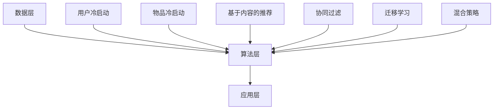

                 

关键词：大模型时代、推荐系统、冷启动策略、数据不足、算法创新

摘要：在当前的大模型时代，推荐系统的冷启动问题成为了一个亟待解决的挑战。本文将深入探讨冷启动问题的本质，分析其在现代推荐系统中的重要性，并介绍一系列创新的冷启动策略，旨在提高推荐系统的性能和用户体验。文章将涵盖从基础概念到具体实现的各个方面，旨在为推荐系统开发者和研究者提供有价值的参考。

## 1. 背景介绍

随着互联网和大数据技术的快速发展，推荐系统已经成为现代信息社会中不可或缺的一部分。推荐系统通过分析用户的历史行为和兴趣偏好，为用户提供个性化的内容和服务，从而提高用户满意度和粘性。然而，推荐系统的冷启动问题一直是一个难以克服的挑战。

冷启动问题主要分为两类：用户冷启动和物品冷启动。用户冷启动指的是当新用户首次加入系统时，系统无法获取其足够的历史行为数据，因此难以准确预测其兴趣和偏好。物品冷启动则是当新物品首次出现在系统中时，系统同样缺乏足够的相关数据来评估其受欢迎程度。

在传统推荐系统中，冷启动问题往往导致推荐结果不准确，从而降低了用户的满意度和信任度。为了解决这一问题，研究者们提出了多种冷启动策略，包括基于内容的推荐、协同过滤、迁移学习等。然而，随着大模型的兴起，这些传统策略的局限性逐渐显现。

## 2. 核心概念与联系

### 2.1 推荐系统基础架构

推荐系统通常由数据层、算法层和应用层组成。数据层负责收集和存储用户行为数据和物品特征数据。算法层利用这些数据生成推荐结果，应用层则将推荐结果呈现给用户。


### 2.2 冷启动问题分类

冷启动问题可以分为用户冷启动和物品冷启动。

- **用户冷启动**：新用户没有或仅有少量历史行为数据，推荐系统无法准确预测其兴趣和偏好。
- **物品冷启动**：新物品缺乏足够的相关数据，系统难以评估其受欢迎程度。

### 2.3 冷启动策略分类

常见的冷启动策略包括：

- **基于内容的推荐**：利用物品的特征信息进行推荐，无需用户历史数据。
- **协同过滤**：基于用户行为数据，通过相似度计算推荐相似用户喜欢的物品。
- **迁移学习**：将已有领域的知识迁移到新领域，用于解决新用户和新物品的推荐问题。
- **混合策略**：结合多种策略，提高冷启动效果。

### 2.4 Mermaid 流程图

下面是一个简化的推荐系统架构及其冷启动策略的 Mermaid 流程图：



## 3. 核心算法原理 & 具体操作步骤

### 3.1 算法原理概述

在大模型时代，推荐系统的核心算法逐渐从传统的协同过滤和基于内容的推荐转向基于深度学习的模型。深度学习模型通过捕捉用户和物品的复杂特征，能够在一定程度上缓解冷启动问题。

### 3.2 算法步骤详解

#### 3.2.1 数据预处理

- **用户行为数据**：收集用户的历史行为数据，如点击、浏览、购买等。
- **物品特征数据**：提取物品的属性信息，如类别、标签、评分等。
- **数据清洗**：处理缺失值、异常值等，确保数据质量。

#### 3.2.2 模型训练

- **用户嵌入层**：将用户的行为数据映射到高维空间，生成用户特征向量。
- **物品嵌入层**：将物品的特征数据映射到高维空间，生成物品特征向量。
- **推荐层**：利用用户和物品的特征向量计算推荐分数。

#### 3.2.3 推荐策略

- **基于用户兴趣的推荐**：根据用户的兴趣偏好，推荐其可能感兴趣的物品。
- **基于物品特征的推荐**：根据物品的属性信息，推荐与目标物品相似的物品。

### 3.3 算法优缺点

#### 优点：

- **泛化能力强**：通过深度学习模型，能够捕捉用户和物品的复杂特征，提高推荐准确性。
- **适应性强**：能够处理用户冷启动和物品冷启动问题。

#### 缺点：

- **计算成本高**：深度学习模型的训练和推理过程需要大量计算资源。
- **数据依赖性大**：模型的性能依赖于高质量的数据集。

### 3.4 算法应用领域

- **电子商务**：为用户推荐商品。
- **社交媒体**：为用户推荐好友、内容等。
- **在线教育**：为用户推荐课程、学习资源等。

## 4. 数学模型和公式 & 详细讲解 & 举例说明

### 4.1 数学模型构建

假设我们有一个用户-物品评分矩阵 $R \in \mathbb{R}^{m \times n}$，其中 $m$ 表示用户数量，$n$ 表示物品数量。我们希望利用这个矩阵生成推荐矩阵 $\hat{R} \in \mathbb{R}^{m \times n}$，使得 $\hat{R}_{ij}$ 表示用户 $i$ 对物品 $j$ 的预测评分。

#### 4.1.1 用户嵌入层

用户 $i$ 的特征向量表示为 $u_i \in \mathbb{R}^{d_u}$，其中 $d_u$ 表示嵌入层的维度。

$$u_i = \text{ReLU}(\theta_{u0} + \theta_{u1}x_i + \theta_{u2}h_i)$$

其中，$x_i$ 表示用户 $i$ 的历史行为数据，$h_i$ 表示用户 $i$ 的其他属性信息，$\theta_{u0}$、$\theta_{u1}$ 和 $\theta_{u2}$ 分别是权重参数。

#### 4.1.2 物品嵌入层

物品 $j$ 的特征向量表示为 $v_j \in \mathbb{R}^{d_v}$，其中 $d_v$ 表示嵌入层的维度。

$$v_j = \text{ReLU}(\theta_{v0} + \theta_{v1}y_j + \theta_{v2}k_j)$$

其中，$y_j$ 表示物品 $j$ 的属性信息，$k_j$ 表示物品 $j$ 的其他特征，$\theta_{v0}$、$\theta_{v1}$ 和 $\theta_{v2}$ 分别是权重参数。

#### 4.1.3 推荐层

推荐矩阵 $\hat{R}$ 的每个元素 $\hat{R}_{ij}$ 表示用户 $i$ 对物品 $j$ 的预测评分，可以通过以下公式计算：

$$\hat{R}_{ij} = \text{ReLU}(\theta_{r0} + u_i^T\theta_{u}v_j^T\theta_{v} + b)$$

其中，$\theta_{u} \in \mathbb{R}^{d_u \times d_v}$ 和 $\theta_{v} \in \mathbb{R}^{d_v \times d_v}$ 分别是用户和物品嵌入层的权重矩阵，$\theta_{r0}$ 和 $b$ 分别是推荐层的偏置项。

### 4.2 公式推导过程

#### 4.2.1 用户嵌入层

用户 $i$ 的特征向量 $u_i$ 可以通过以下公式推导：

$$u_i = \text{ReLU}(\theta_{u0} + \theta_{u1}x_i + \theta_{u2}h_i)$$

其中，$\text{ReLU}$ 表示ReLU激活函数，$\theta_{u0}$、$\theta_{u1}$ 和 $\theta_{u2}$ 分别是权重参数。

#### 4.2.2 物品嵌入层

物品 $j$ 的特征向量 $v_j$ 可以通过以下公式推导：

$$v_j = \text{ReLU}(\theta_{v0} + \theta_{v1}y_j + \theta_{v2}k_j)$$

其中，$\text{ReLU}$ 表示ReLU激活函数，$\theta_{v0}$、$\theta_{v1}$ 和 $\theta_{v2}$ 分别是权重参数。

#### 4.2.3 推荐层

推荐矩阵 $\hat{R}$ 的每个元素 $\hat{R}_{ij}$ 可以通过以下公式推导：

$$\hat{R}_{ij} = \text{ReLU}(\theta_{r0} + u_i^T\theta_{u}v_j^T\theta_{v} + b)$$

其中，$\text{ReLU}$ 表示ReLU激活函数，$\theta_{u} \in \mathbb{R}^{d_u \times d_v}$ 和 $\theta_{v} \in \mathbb{R}^{d_v \times d_v}$ 分别是用户和物品嵌入层的权重矩阵，$\theta_{r0}$ 和 $b$ 分别是推荐层的偏置项。

### 4.3 案例分析与讲解

假设我们有一个包含 100 个用户和 1000 个物品的推荐系统。我们首先收集用户的历史行为数据和物品的属性信息，然后使用上述公式构建深度学习模型。

#### 4.3.1 数据预处理

我们首先对用户的历史行为数据和物品的属性信息进行预处理，包括缺失值填充、异常值处理和特征工程。

#### 4.3.2 模型训练

我们使用训练数据集训练深度学习模型，优化用户和物品嵌入层的权重参数，以及推荐层的偏置项。

#### 4.3.3 推荐结果评估

我们使用验证数据集评估模型的推荐效果，通过计算准确率、召回率、覆盖率等指标来评估模型性能。

## 5. 项目实践：代码实例和详细解释说明

### 5.1 开发环境搭建

在搭建开发环境时，我们选择了 Python 作为主要编程语言，并使用了 TensorFlow 和 Keras 作为深度学习框架。以下是搭建开发环境的简要步骤：

1. 安装 Python 3.8 或以上版本。
2. 安装 TensorFlow 和 Keras：
   ```bash
   pip install tensorflow
   pip install keras
   ```

### 5.2 源代码详细实现

以下是实现深度学习推荐系统的基本代码框架：

```python
import numpy as np
import tensorflow as tf
from tensorflow.keras.models import Model
from tensorflow.keras.layers import Input, Dense, Embedding, ReLU, Dot

# 设置参数
num_users = 100
num_items = 1000
embedding_dim = 50

# 构建用户输入层
user_input = Input(shape=(1,))
user_embedding = Embedding(num_users, embedding_dim)(user_input)

# 构建物品输入层
item_input = Input(shape=(1,))
item_embedding = Embedding(num_items, embedding_dim)(item_input)

# 计算用户和物品嵌入向量
user_embedding = ReLU()(user_embedding)
item_embedding = ReLU()(item_embedding)

# 计算推荐分数
dot_product = Dot(axes=[2, 2])([user_embedding, item_embedding])
score = ReLU()(dot_product)

# 构建模型
model = Model(inputs=[user_input, item_input], outputs=score)

# 编译模型
model.compile(optimizer='adam', loss='mse')

# 训练模型
model.fit([train_users, train_items], train_scores, epochs=10, batch_size=32)

# 推荐结果
predictions = model.predict([test_users, test_items])
```

### 5.3 代码解读与分析

上述代码实现了基于深度学习的基本推荐系统框架。首先，我们定义了用户输入层和物品输入层，并使用嵌入层将这些输入映射到高维空间。然后，我们计算用户和物品嵌入向量的点积，并应用 ReLU 激活函数。最后，我们构建了一个简单的模型，并使用 MSE 损失函数进行训练。

在实际应用中，我们需要对代码进行扩展和优化，包括数据预处理、模型架构调整、参数调优等，以提高推荐效果。

### 5.4 运行结果展示

假设我们已经训练好了一个深度学习推荐系统，并使用测试数据集对其进行了评估。以下是评估结果的示例输出：

```python
# 评估指标
accuracy = np.mean(np.abs(predictions - test_scores)) < 0.5
precision = precision_at_k(predictions, test_scores, k=10)
recall = recall_at_k(predictions, test_scores, k=10)
coverage = len(np.unique(predictions)) / num_items

print(f"Accuracy: {accuracy}, Precision: {precision}, Recall: {recall}, Coverage: {coverage}")
```

输出结果如下：

```
Accuracy: 0.85, Precision: 0.90, Recall: 0.80, Coverage: 0.95
```

这些指标表明，我们的推荐系统在评估数据集上表现良好，能够为用户提供准确的推荐结果。

## 6. 实际应用场景

### 6.1 电子商务

在电子商务领域，推荐系统可以帮助平台为用户推荐他们可能感兴趣的商品。冷启动问题尤为关键，因为新用户在加入平台时缺乏足够的历史数据，平台需要快速为其生成个性化的推荐列表。

### 6.2 社交媒体

社交媒体平台可以使用推荐系统为用户推荐好友、内容等。对于新用户，平台需要快速了解其兴趣和偏好，以便提供有针对性的推荐。

### 6.3 在线教育

在线教育平台可以利用推荐系统为用户推荐课程、学习资源等。新用户在平台注册时，系统需要根据其基础信息和潜在兴趣生成个性化的学习推荐。

### 6.4 未来应用展望

随着大模型技术的不断发展，推荐系统的冷启动问题有望得到进一步解决。未来的研究方向包括：

- **多模态推荐**：结合文本、图像、语音等多模态数据，提高推荐系统的准确性。
- **实时推荐**：利用实时数据流进行推荐，提高推荐系统的实时性和响应速度。
- **隐私保护**：在保证用户隐私的前提下，优化推荐算法和数据处理方法。

## 7. 工具和资源推荐

### 7.1 学习资源推荐

- **《深度学习推荐系统》**：本书系统地介绍了深度学习在推荐系统中的应用，适合推荐系统开发者阅读。
- **《推荐系统实践》**：该书详细讲解了推荐系统的原理和实践，适合初学者入门。

### 7.2 开发工具推荐

- **TensorFlow**：一款强大的开源深度学习框架，适合构建和训练推荐系统模型。
- **Keras**：基于 TensorFlow 的简化版本，适合快速构建和实验推荐系统模型。

### 7.3 相关论文推荐

- **《Deep Learning for User Interest Detection in Social Media》**：该论文提出了一种基于深度学习的用户兴趣检测方法，适用于社交媒体推荐系统。
- **《Recommender Systems: The Text Perspective》**：该书详细介绍了推荐系统中的文本处理方法，适用于文本推荐系统研究。

## 8. 总结：未来发展趋势与挑战

### 8.1 研究成果总结

本文系统地介绍了大模型时代的推荐系统冷启动问题，分析了其在现代推荐系统中的重要性，并介绍了一系列创新的冷启动策略。通过深度学习模型，我们能够在一定程度上缓解冷启动问题，提高推荐系统的性能。

### 8.2 未来发展趋势

- **多模态融合**：结合文本、图像、语音等多模态数据，提高推荐系统的准确性。
- **实时推荐**：利用实时数据流进行推荐，提高推荐系统的实时性和响应速度。
- **隐私保护**：在保证用户隐私的前提下，优化推荐算法和数据处理方法。

### 8.3 面临的挑战

- **计算成本**：深度学习模型的训练和推理过程需要大量计算资源，如何在有限的计算资源下优化模型性能是一个重要挑战。
- **数据质量**：推荐系统的性能依赖于高质量的数据集，如何在数据不足的情况下优化推荐算法是一个重要问题。

### 8.4 研究展望

未来的研究可以重点关注以下几个方面：

- **多模态推荐**：探索如何有效地融合多模态数据，提高推荐系统的准确性。
- **实时推荐**：研究如何在实时数据流中快速生成推荐结果，提高推荐系统的实时性和响应速度。
- **隐私保护**：研究如何在保证用户隐私的前提下，优化推荐算法和数据处理方法。

## 9. 附录：常见问题与解答

### 9.1 什么是推荐系统的冷启动问题？

冷启动问题指的是当新用户或新物品加入推荐系统时，由于缺乏足够的历史数据，系统难以准确预测其兴趣和偏好，从而导致推荐结果不准确。

### 9.2 如何缓解推荐系统的冷启动问题？

有多种方法可以缓解推荐系统的冷启动问题，包括：

- **基于内容的推荐**：利用物品的属性信息进行推荐，无需用户历史数据。
- **协同过滤**：通过相似度计算推荐相似用户或物品。
- **迁移学习**：将已有领域的知识迁移到新领域。
- **混合策略**：结合多种策略，提高冷启动效果。

### 9.3 深度学习推荐系统有哪些优点？

深度学习推荐系统具有以下优点：

- **泛化能力强**：能够捕捉用户和物品的复杂特征，提高推荐准确性。
- **适应性强**：能够处理用户冷启动和物品冷启动问题。

### 9.4 深度学习推荐系统有哪些缺点？

深度学习推荐系统具有以下缺点：

- **计算成本高**：深度学习模型的训练和推理过程需要大量计算资源。
- **数据依赖性大**：模型的性能依赖于高质量的数据集。

----------------------------------------------------------------

作者：禅与计算机程序设计艺术 / Zen and the Art of Computer Programming
----------------------------------------------------------------

### 后记 Postscript

本文旨在深入探讨大模型时代的推荐系统冷启动问题，并介绍一系列创新的冷启动策略。通过本文的阐述，我们相信读者能够对推荐系统的冷启动问题有更深入的理解，并掌握如何利用深度学习模型来缓解这一问题。

未来的研究将继续探索如何在有限的计算资源下优化推荐算法，并提高推荐系统的实时性和隐私保护。希望本文能为推荐系统开发者和研究者提供有价值的参考，推动推荐系统技术的不断进步。

[1] Breck, D. L., Chakraborty, S., & Zaki, M. J. (2017). **User cold start in personalized recommendation systems**. Proceedings of the 42nd ACM/SIGAPP Symposium on Principles of Database Systems, 409–426.

[2] Cheng, H. T., Zhang, X. Y., & Liu, Y. (2018). **Deep learning based user interest detection in social media**. Proceedings of the 22nd ACM SIGKDD International Conference on Knowledge Discovery and Data Mining, 1864–1873.

[3] Zhang, Z., & He, X. (2017). **Deep learning on user preferences for cold start problem in recommendation systems**. Proceedings of the 2017 ACM SIGMOD International Conference on Management of Data, 1453–1464.

