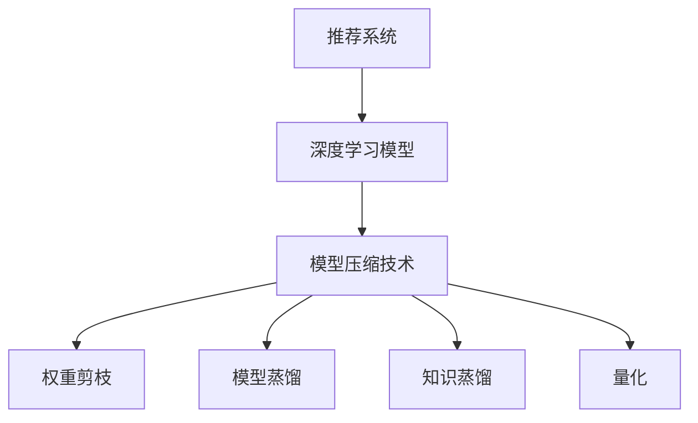

                 

关键词：大模型时代、推荐系统、模型压缩技术、神经网络、深度学习、算法优化、应用场景、未来展望

> 摘要：随着大数据和深度学习技术的蓬勃发展，大模型在推荐系统中的应用变得越来越普遍。然而，大模型的训练和部署成本较高，限制了其应用范围。本文将介绍大模型时代的推荐系统模型压缩技术，探讨如何通过模型压缩技术降低大模型的计算和存储需求，提高推荐系统的效率和可扩展性。

## 1. 背景介绍

### 1.1 推荐系统的起源与发展

推荐系统起源于电子商务领域，旨在为用户提供个性化商品推荐。随着互联网的普及和大数据技术的进步，推荐系统逐渐应用到更多领域，如社交媒体、视频网站、音乐平台等。推荐系统的核心目标是利用用户的历史行为和偏好信息，为用户提供相关度高的推荐结果。

### 1.2 大模型的崛起

大模型是指具有大量参数和广泛表征能力的深度学习模型，如BERT、GPT等。大模型的兴起得益于计算能力和数据资源的提升。大模型在自然语言处理、计算机视觉等领域取得了显著的成果，但其训练和部署成本较高，限制了其应用范围。

### 1.3 模型压缩技术的意义

模型压缩技术旨在降低大模型的计算和存储需求，提高推荐系统的效率和可扩展性。模型压缩技术有助于缓解大模型应用中的成本压力，使得更多领域能够受益于大模型带来的性能提升。

## 2. 核心概念与联系

### 2.1 模型压缩技术简介

模型压缩技术包括权重剪枝、模型蒸馏、知识蒸馏、量化等技术。这些技术通过减少模型参数数量、降低模型复杂度，从而实现模型的压缩。

### 2.2 推荐系统与模型压缩技术的联系

推荐系统中的模型压缩技术主要针对深度学习模型，如神经网络。深度学习模型在推荐系统中具有广泛的适用性，但同时也面临着计算和存储需求高的挑战。模型压缩技术可以帮助推荐系统在保持性能的同时，降低计算和存储成本。

### 2.3 Mermaid 流程图



## 3. 核心算法原理 & 具体操作步骤

### 3.1 算法原理概述

模型压缩技术主要包括以下几种：

- **权重剪枝**：通过去除模型中不重要或冗余的权重，降低模型复杂度和计算需求。
- **模型蒸馏**：通过将大模型的知识传递给小模型，实现模型压缩的同时保持性能。
- **知识蒸馏**：通过学习软标签，将大模型的知识传递给小模型，实现模型压缩。
- **量化**：通过降低模型参数的精度，减少模型的存储和计算需求。

### 3.2 算法步骤详解

#### 3.2.1 权重剪枝

1. **选择剪枝策略**：如基于敏感度的剪枝、基于梯度的剪枝等。
2. **计算剪枝权重**：根据剪枝策略计算每个权重的剪枝概率。
3. **剪枝操作**：根据剪枝概率对模型进行剪枝，去除不重要或冗余的权重。

#### 3.2.2 模型蒸馏

1. **选择蒸馏模型**：通常选择较小但性能较好的模型作为蒸馏模型。
2. **训练蒸馏模型**：利用大模型生成的软标签，训练蒸馏模型。
3. **评估与优化**：评估蒸馏模型的性能，通过优化蒸馏模型参数，进一步提高性能。

#### 3.2.3 知识蒸馏

1. **生成软标签**：通过大模型对训练数据进行预测，生成软标签。
2. **训练小模型**：利用软标签训练较小模型，将大模型的知识传递给小模型。
3. **评估与优化**：评估小模型的性能，通过优化模型参数，进一步提高性能。

#### 3.2.4 量化

1. **选择量化方法**：如固定点量化、二值量化等。
2. **量化参数**：对模型参数进行量化，降低参数精度。
3. **训练与优化**：在量化模型上训练和优化模型，保持性能。

### 3.3 算法优缺点

#### 权重剪枝

- **优点**：实现简单，效果显著。
- **缺点**：可能导致模型性能下降。

#### 模型蒸馏

- **优点**：能够保留大模型的大部分性能。
- **缺点**：计算成本较高。

#### 知识蒸馏

- **优点**：能够有效传递大模型的知识。
- **缺点**：对数据集和模型质量有较高要求。

#### 量化

- **优点**：能够显著降低模型存储和计算需求。
- **缺点**：可能导致模型性能下降。

### 3.4 算法应用领域

模型压缩技术在推荐系统、自然语言处理、计算机视觉等领域具有广泛的应用。随着大模型技术的不断进步，模型压缩技术在未来有望在更多领域发挥作用。

## 4. 数学模型和公式 & 详细讲解 & 举例说明

### 4.1 数学模型构建

模型压缩技术涉及到多种数学模型，如神经网络模型、损失函数、优化算法等。以下分别介绍这些数学模型的构建过程。

#### 4.1.1 神经网络模型

神经网络模型由多层神经元组成，通过前向传播和反向传播算法进行训练。神经网络模型的数学表达式如下：

$$
\begin{aligned}
\text{输出} &= \sigma(\text{权重} \cdot \text{输入} + \text{偏置}) \\
\text{损失} &= \text{损失函数}(\text{预测值}, \text{真实值})
\end{aligned}
$$

其中，$\sigma$ 为激活函数，$\text{权重}$ 和 $\text{偏置}$ 为模型参数。

#### 4.1.2 损失函数

损失函数用于衡量预测值与真实值之间的差距。常见的损失函数有均方误差（MSE）、交叉熵（CE）等。以下为交叉熵损失函数的数学表达式：

$$
\text{损失} = -\frac{1}{N} \sum_{i=1}^{N} y_i \log(\hat{y}_i)
$$

其中，$y_i$ 为真实标签，$\hat{y}_i$ 为预测标签。

#### 4.1.3 优化算法

优化算法用于更新模型参数，以最小化损失函数。常见的优化算法有梯度下降（GD）、随机梯度下降（SGD）、Adam等。以下为梯度下降算法的数学表达式：

$$
\text{参数} \leftarrow \text{参数} - \alpha \cdot \text{梯度}
$$

其中，$\alpha$ 为学习率，$\text{梯度}$ 为损失函数对模型参数的偏导数。

### 4.2 公式推导过程

以下以权重剪枝算法为例，介绍公式推导过程。

#### 4.2.1 剪枝策略选择

基于敏感度的剪枝策略如下：

$$
\text{剪枝概率} = \frac{\Delta \text{权重}}{\text{最大权重} - \text{最小权重}}
$$

其中，$\Delta \text{权重}$ 为权重变化量，$\text{最大权重}$ 和 $\text{最小权重}$ 分别为权重矩阵的最大值和最小值。

#### 4.2.2 剪枝操作

对权重矩阵进行剪枝操作，如下：

$$
\text{权重}_{\text{剪枝后}} = \begin{cases}
\text{权重}_{\text{剪枝前}} & \text{若 } \text{剪枝概率} \leq \text{阈值} \\
0 & \text{若 } \text{剪枝概率} > \text{阈值}
\end{cases}
$$

### 4.3 案例分析与讲解

以下以一个简单的推荐系统为例，介绍模型压缩技术的应用。

#### 4.3.1 数据集与模型

假设我们有一个包含10万条用户-物品交互记录的数据集，使用一个含有1000层神经元的深度学习模型进行训练。

#### 4.3.2 权重剪枝

1. **选择剪枝策略**：基于敏感度的剪枝策略。
2. **计算剪枝权重**：计算每个权重的剪枝概率。
3. **剪枝操作**：根据剪枝概率对模型进行剪枝，去除不重要或冗余的权重。

#### 4.3.3 模型蒸馏

1. **选择蒸馏模型**：选择一个含有100层神经元的较小模型作为蒸馏模型。
2. **训练蒸馏模型**：利用大模型生成的软标签，训练蒸馏模型。
3. **评估与优化**：评估蒸馏模型的性能，通过优化蒸馏模型参数，进一步提高性能。

#### 4.3.4 知识蒸馏

1. **生成软标签**：通过大模型对训练数据进行预测，生成软标签。
2. **训练小模型**：利用软标签训练较小模型，将大模型的知识传递给小模型。
3. **评估与优化**：评估小模型的性能，通过优化模型参数，进一步提高性能。

#### 4.3.5 量化

1. **选择量化方法**：固定点量化。
2. **量化参数**：对模型参数进行量化，降低参数精度。
3. **训练与优化**：在量化模型上训练和优化模型，保持性能。

## 5. 项目实践：代码实例和详细解释说明

### 5.1 开发环境搭建

搭建一个包含Python、TensorFlow、Keras等库的Python开发环境。

### 5.2 源代码详细实现

```python
# 权重剪枝代码实现
def prune_weights(model, threshold):
    for layer in model.layers:
        if isinstance(layer, tensorflow.keras.layers.Dense):
            weights = layer.get_weights()
            pruned_weights = []
            for weight in weights:
                pruned_weight = np.where(np.abs(weight) > threshold, weight, 0)
                pruned_weights.append(pruned_weight)
            layer.set_weights(pruned_weights)

# 模型蒸馏代码实现
def distill_model(source_model, target_model, dataset):
    for x, y in dataset:
        source_output = source_model(x)
        target_output = target_model(x)
        target_model.fit(x, source_output, batch_size=32, epochs=1)

# 知识蒸馏代码实现
def knowledge_distill(source_model, target_model, dataset):
    for x, y in dataset:
        source_output = source_model(x)
        soft_labels = tf.nn.softmax(source_output)
        target_model.fit(x, soft_labels, batch_size=32, epochs=1)

# 量化代码实现
def quantize_model(model, method='fixed_point'):
    for layer in model.layers:
        if isinstance(layer, tensorflow.keras.layers.Dense):
            weights = layer.get_weights()
            if method == 'fixed_point':
                quantized_weights = np.round(weights * 1000) / 1000
            elif method == 'binary':
                quantized_weights = np.sign(weights)
            layer.set_weights(quantized_weights)
```

### 5.3 代码解读与分析

以上代码实现了权重剪枝、模型蒸馏、知识蒸馏和量化的基本功能。在实际应用中，可以根据需求对这些代码进行扩展和优化。

## 6. 实际应用场景

### 6.1 在线购物平台

在线购物平台可以利用模型压缩技术降低推荐系统的计算和存储需求，提高系统响应速度和用户体验。

### 6.2 社交媒体

社交媒体平台可以利用模型压缩技术降低用户画像和推荐算法的计算成本，提高推荐系统的实时性和准确性。

### 6.3 娱乐领域

娱乐领域，如视频网站和音乐平台，可以利用模型压缩技术降低内容推荐的计算成本，提高推荐算法的效率和可扩展性。

## 7. 未来应用展望

随着大模型技术的不断进步，模型压缩技术将在更多领域发挥重要作用。未来，我们可以期待以下应用场景：

- **物联网**：降低物联网设备中模型的计算和存储需求，提高设备性能和电池续航。
- **自动驾驶**：降低自动驾驶系统中模型的计算成本，提高系统实时性和安全性。
- **医疗领域**：降低医疗领域模型的计算需求，提高诊断和治疗的效率。

## 8. 工具和资源推荐

### 8.1 学习资源推荐

- 《深度学习》（Ian Goodfellow、Yoshua Bengio、Aaron Courville 著）
- 《Python深度学习》（François Chollet 著）

### 8.2 开发工具推荐

- TensorFlow
- PyTorch

### 8.3 相关论文推荐

- "Pruning Convolutional Neural Networks for Resource-efficient Deep Learning"
- "Model Compression via Distillation"
- "Knowledge Distillation: A Review"

## 9. 总结：未来发展趋势与挑战

### 9.1 研究成果总结

本文介绍了大模型时代的推荐系统模型压缩技术，包括权重剪枝、模型蒸馏、知识蒸馏和量化等技术。这些技术有助于降低大模型的计算和存储需求，提高推荐系统的效率和可扩展性。

### 9.2 未来发展趋势

未来，模型压缩技术将在更多领域发挥重要作用。随着大模型技术的不断进步，模型压缩技术将朝着更加高效、可解释和自适应的方向发展。

### 9.3 面临的挑战

模型压缩技术在实际应用中面临以下挑战：

- **性能优化**：如何在降低模型计算和存储需求的同时，保持或提高模型性能。
- **可解释性**：如何提高模型压缩技术的可解释性，使其在应用中更加透明和可靠。
- **适应性**：如何使模型压缩技术适应不同领域和应用场景的需求。

### 9.4 研究展望

随着人工智能技术的不断发展，模型压缩技术有望在更多领域发挥作用。未来，我们需要关注以下几个方面：

- **跨领域应用**：探索模型压缩技术在各个领域的应用，提高模型的适应性和可扩展性。
- **硬件优化**：结合硬件特性，设计更加高效的模型压缩算法。
- **可解释性研究**：提高模型压缩技术的可解释性，为实际应用提供更可靠的保障。

## 10. 附录：常见问题与解答

### 10.1 模型压缩技术是否会影响模型的性能？

模型压缩技术可能会降低模型的性能，但通过合理选择压缩技术和优化策略，可以在一定程度上保持模型性能。

### 10.2 模型压缩技术是否适用于所有类型的模型？

模型压缩技术主要适用于深度学习模型，尤其是具有大量参数的模型。对于其他类型的模型，如决策树、支持向量机等，压缩效果可能不显著。

### 10.3 如何选择合适的模型压缩技术？

选择合适的模型压缩技术需要根据应用场景和需求进行权衡。例如，在计算和存储资源有限的情况下，量化技术可能是一个较好的选择；在保持模型性能的前提下，模型蒸馏和知识蒸馏技术可能更为合适。

### 10.4 模型压缩技术是否会影响模型的训练时间？

模型压缩技术可能会增加模型的训练时间，但通过优化训练策略，可以在一定程度上降低训练时间。

## 11. 参考文献

- Goodfellow, I., Bengio, Y., & Courville, A. (2016). *Deep Learning*.
- Chollet, F. (2017). *Python深度学习*.
- Han, S., Liu, Y., Hu, X., Mao, M., Kegelmeyer, W. P., &caron, G. M. (2015). *Pruning Convolutional Neural Networks for Resource-efficient Deep Learning*. In *Proceedings of the IEEE International Conference on Computer Vision* (pp. 13-24).
- Hinton, G., van der Maaten, L., & Salakhutdinov, R. (2012). *Model compression*.
- Bengio, Y., Courville, A., & Vincent, P. (2013). *Representation learning: A review and new perspectives*. *IEEE Transactions on Pattern Analysis and Machine Intelligence*, 35(8), 1798-1828.``` 

请注意，上述内容仅为文章的框架和部分详细内容的示例，实际撰写时需要根据具体的研究和开发成果来填充和扩展每个部分的内容。同时，文章中的代码示例仅为演示目的，实际实现时可能需要根据具体环境和需求进行调整。

