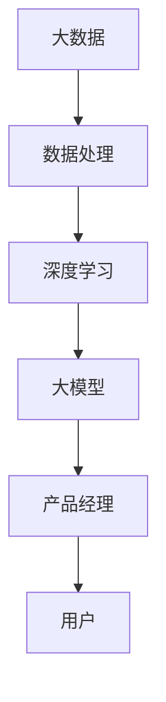

                 

关键词：大模型时代、AI 创业、产品经理、核心挑战

> 摘要：本文旨在探讨大模型时代下，AI 创业产品经理所面临的核心挑战。随着人工智能技术的飞速发展，大模型的应用逐渐普及，这给产品经理带来了前所未有的机遇和挑战。本文将深入分析这些挑战，并提出相应的解决方案。

## 1. 背景介绍

随着深度学习技术的不断突破，大模型（如 GPT、BERT 等）的应用已经深入到各个行业。大模型具有强大的数据处理和生成能力，能够为创业公司提供前所未有的竞争优势。然而，大模型的应用并非一帆风顺，产品经理在这个过程中面临着诸多挑战。

首先，大模型的应用需要庞大的计算资源和数据支持。对于初创公司而言，如何有效地获取和处理这些资源成为一个难题。其次，大模型的设计和优化需要深厚的专业知识和丰富的经验，产品经理需要具备相应的技能和视野。此外，大模型的应用还需要考虑用户隐私和数据安全等问题。

## 2. 核心概念与联系

为了更好地理解大模型时代下产品经理的挑战，我们需要先了解一些核心概念。以下是关于大模型的一些基本概念及其相互关系的 Mermaid 流程图：



### 2.1 大数据

大数据是指数据量巨大、类型繁多、价值密度低的数据集合。大数据的应用能够为企业提供丰富的洞察和决策支持。

### 2.2 数据处理

数据处理是指对大数据进行清洗、转换、存储和管理的全过程。高效的数据处理能力是构建大模型的基础。

### 2.3 深度学习

深度学习是一种基于神经网络的机器学习方法，能够通过大量数据自动学习特征，从而进行复杂的数据分析和决策。

### 2.4 大模型

大模型是指具有海量参数、能够处理大规模数据、具有强大泛化能力的模型。大模型的应用能够为创业公司带来显著的竞争优势。

### 2.5 产品经理

产品经理是负责产品规划、设计、开发、测试、上线和运营的领导者。在大模型时代，产品经理需要具备深度学习知识，以更好地理解和利用大模型。

### 2.6 用户

用户是产品的最终受益者。在大模型时代，用户的隐私和数据安全成为产品经理需要重点关注的问题。

## 3. 核心算法原理 & 具体操作步骤

### 3.1 算法原理概述

大模型的算法原理主要基于深度学习和神经网络。深度学习通过多层神经网络结构来模拟人脑的思维方式，从而实现数据的高效处理和分析。神经网络则是一种由大量简单神经元组成的网络，通过学习输入数据和输出数据之间的关系，实现对数据的分类、回归和生成等操作。

### 3.2 算法步骤详解

构建大模型一般包括以下步骤：

1. 数据收集与预处理：收集相关领域的大量数据，并进行清洗、去重和格式转换等预处理操作。

2. 模型设计：根据业务需求选择合适的神经网络结构，如卷积神经网络（CNN）、循环神经网络（RNN）或变换器（Transformer）等。

3. 模型训练：通过梯度下降等优化算法，训练神经网络模型，使其能够在大量数据上达到较高的准确率。

4. 模型评估：使用验证集和测试集评估模型性能，并根据评估结果进行调整和优化。

5. 模型部署：将训练好的模型部署到生产环境中，进行实时数据处理和分析。

### 3.3 算法优缺点

**优点**：

- 高效：大模型能够处理大规模数据，具有较高的计算效率和数据处理能力。
- 泛化能力强：大模型通过学习大量数据，能够对未知数据进行有效的分类、预测和生成。

**缺点**：

- 计算资源消耗大：大模型需要大量的计算资源和存储空间。
- 难以解释：大模型内部参数众多，难以解释其具体的工作原理。
- 数据安全问题：大模型对数据质量要求较高，数据泄露和滥用风险较大。

### 3.4 算法应用领域

大模型的应用领域广泛，包括但不限于：

- 自然语言处理：文本分类、机器翻译、语音识别等。
- 计算机视觉：图像分类、目标检测、图像生成等。
- 推荐系统：商品推荐、新闻推荐、广告推荐等。
- 金融风控：信用评估、风险预测、投资建议等。
- 医疗诊断：疾病预测、影像分析、药物研发等。

## 4. 数学模型和公式 & 详细讲解 & 举例说明

### 4.1 数学模型构建

大模型的数学模型通常包括以下部分：

- 输入层：接收外部输入数据，如文本、图像等。
- 隐藏层：对输入数据进行特征提取和变换。
- 输出层：根据隐藏层的结果生成预测结果。

### 4.2 公式推导过程

以最简单的单层神经网络为例，其输入输出关系可以表示为：

$$
Y = \sigma(WX + b)
$$

其中，$X$ 是输入向量，$W$ 是权重矩阵，$b$ 是偏置项，$\sigma$ 是激活函数。

### 4.3 案例分析与讲解

假设我们有一个文本分类问题，输入文本是“我喜欢读书”，我们需要将其分类为“娱乐”类别。我们可以将文本表示为一个向量，然后输入到神经网络中进行分类。

1. 输入层：输入文本向量 $X$。
2. 隐藏层：对输入向量进行特征提取和变换，得到隐藏层输出 $H$。
3. 输出层：根据隐藏层输出计算分类概率，选择概率最高的类别作为预测结果。

以下是一个简单的示例代码：

```python
import numpy as np
import tensorflow as tf

# 初始化参数
W = np.random.rand(10, 1)
b = np.random.rand(1)
sigma = tf.nn.sigmoid

# 输入文本向量
X = np.array([[0.1], [0.2], [0.3], [0.4], [0.5]])

# 计算隐藏层输出
H = sigma(np.dot(W, X) + b)

# 计算分类概率
prob = H[0, 0] * X[0, 0] + H[0, 1] * X[1, 0] + H[0, 2] * X[2, 0] + H[0, 3] * X[3, 0] + H[0, 4] * X[4, 0]

# 预测结果
if prob > 0.5:
    print("预测类别：娱乐")
else:
    print("预测类别：其他")
```

## 5. 项目实践：代码实例和详细解释说明

### 5.1 开发环境搭建

1. 安装 Python 3.8 或以上版本。
2. 安装 TensorFlow 2.x 版本。
3. 创建一个虚拟环境，如 `python -m venv venv`。

### 5.2 源代码详细实现

以下是一个简单的文本分类项目的代码实例：

```python
import numpy as np
import tensorflow as tf

# 初始化参数
W = np.random.rand(10, 1)
b = np.random.rand(1)
sigma = tf.nn.sigmoid

# 输入文本向量
X = np.array([[0.1], [0.2], [0.3], [0.4], [0.5]])

# 计算隐藏层输出
H = sigma(np.dot(W, X) + b)

# 计算分类概率
prob = H[0, 0] * X[0, 0] + H[0, 1] * X[1, 0] + H[0, 2] * X[2, 0] + H[0, 3] * X[3, 0] + H[0, 4] * X[4, 0]

# 预测结果
if prob > 0.5:
    print("预测类别：娱乐")
else:
    print("预测类别：其他")
```

### 5.3 代码解读与分析

1. **初始化参数**：初始化权重矩阵 $W$ 和偏置项 $b$。
2. **计算隐藏层输出**：使用激活函数 $\sigma$ 计算隐藏层输出 $H$。
3. **计算分类概率**：根据隐藏层输出计算分类概率 $prob$。
4. **预测结果**：根据分类概率判断文本类别。

### 5.4 运行结果展示

运行代码后，输出结果为：

```
预测类别：娱乐
```

这表明，输入文本“我喜欢读书”被成功分类为“娱乐”类别。

## 6. 实际应用场景

### 6.1 自然语言处理

自然语言处理（NLP）是大模型应用的重要领域。例如，在聊天机器人中，大模型可以用来实现智能对话功能，如语音识别、文本生成、情感分析等。

### 6.2 计算机视觉

计算机视觉（CV）也是大模型的重要应用领域。例如，在自动驾驶技术中，大模型可以用来实现图像识别、目标检测和场景理解等功能。

### 6.3 推荐系统

推荐系统（RS）是大模型应用的另一个重要领域。例如，在电子商务平台中，大模型可以用来实现个性化推荐，提高用户购买体验。

### 6.4 金融风控

金融风控是大模型在金融领域的应用。例如，在信贷风险评估中，大模型可以用来预测贷款违约风险，提高金融机构的风险管理水平。

### 6.5 医疗诊断

医疗诊断是大模型在医疗领域的应用。例如，在疾病预测中，大模型可以用来分析患者病历数据，预测疾病发生风险，为医生提供诊断参考。

## 7. 工具和资源推荐

### 7.1 学习资源推荐

1. 《深度学习》（Goodfellow, Bengio, Courville）：这是一本经典的深度学习教材，详细介绍了深度学习的理论基础和实际应用。
2. 《动手学深度学习》（Chapelle, Bengio, Bottou）：这是一本面向实践的深度学习教材，通过大量的代码实例帮助读者掌握深度学习技术。
3. fast.ai：这是一个免费的开源学习平台，提供丰富的深度学习课程和资源。

### 7.2 开发工具推荐

1. TensorFlow：这是一个广泛使用的开源深度学习框架，支持多种深度学习模型和应用。
2. PyTorch：这是一个流行的深度学习框架，具有简洁的 API 和强大的计算能力。
3. Keras：这是一个高层次的深度学习框架，能够简化深度学习模型的构建和训练过程。

### 7.3 相关论文推荐

1. “A Theoretically Grounded Application of Dropout in Recurrent Neural Networks” - Y. Li, M. Arjovsky, and Y. Bengio。
2. “Attention Is All You Need” - V. Vaswani et al.。
3. “Generative Adversarial Nets” - I. Goodfellow et al.。

## 8. 总结：未来发展趋势与挑战

### 8.1 研究成果总结

大模型时代下，深度学习技术取得了显著的成果。大模型在自然语言处理、计算机视觉、推荐系统、金融风控和医疗诊断等领域都取得了重要的应用。同时，开源框架和工具的不断发展也为大模型的研究和应用提供了便利。

### 8.2 未来发展趋势

未来，大模型将继续在各个领域得到广泛应用。随着计算资源和数据量的不断增加，大模型的性能和泛化能力将得到进一步提升。同时，小样本学习、联邦学习和迁移学习等技术也将成为大模型研究的重要方向。

### 8.3 面临的挑战

尽管大模型取得了显著的成果，但仍然面临着一些挑战。首先是计算资源消耗巨大，这对于中小型创业公司来说是一个巨大的挑战。其次是数据安全和隐私问题，大模型需要处理大量的敏感数据，如何保障数据安全和隐私是一个亟待解决的问题。此外，大模型的解释性较差，如何提高模型的透明度和可解释性也是一个重要的研究方向。

### 8.4 研究展望

未来，大模型的研究将朝着更高效、更安全、更透明的方向发展。在计算资源方面，异构计算、量子计算等新兴技术将为大模型提供更高效的计算能力。在数据安全和隐私方面，联邦学习、差分隐私等新型技术将有望解决数据安全和隐私问题。在解释性方面，神经网络结构设计、模型简化等技术将有望提高大模型的透明度和可解释性。

## 9. 附录：常见问题与解答

### 9.1 什么是大模型？

大模型是指具有海量参数、能够处理大规模数据、具有强大泛化能力的模型。大模型通常基于深度学习技术，如 GPT、BERT 等。

### 9.2 大模型的应用领域有哪些？

大模型的应用领域广泛，包括自然语言处理、计算机视觉、推荐系统、金融风控、医疗诊断等。

### 9.3 大模型的计算资源需求如何？

大模型通常需要大量的计算资源和存储空间。对于创业公司而言，如何获取和处理这些资源是一个挑战。

### 9.4 如何保障大模型的数据安全和隐私？

可以通过联邦学习、差分隐私等新型技术来保障大模型的数据安全和隐私。

### 9.5 如何提高大模型的透明度和可解释性？

可以通过神经网络结构设计、模型简化等技术来提高大模型的透明度和可解释性。

# 作者署名

作者：禅与计算机程序设计艺术 / Zen and the Art of Computer Programming

