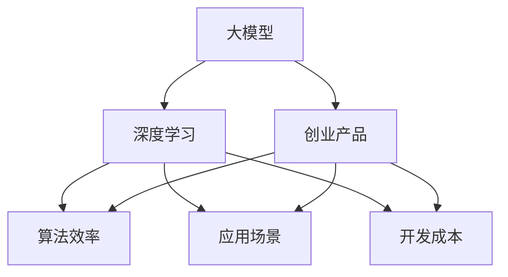

                 

关键词：AI 大模型，创业产品创新，机器学习，深度学习，AI 技术发展，创业方法论，技术创新，市场需求。

## 摘要

本文将探讨大模型在 AI 创业产品创新中的关键作用。通过分析大模型的本质、发展历程及其在人工智能领域的重要性，本文将阐述大模型如何通过提高算法效率、拓展应用场景、降低开发成本等方面，推动 AI 创业的创新。此外，本文还将探讨大模型在创业产品中的应用实例，以及未来大模型在 AI 创业产品创新中可能面临的挑战和发展趋势。

## 1. 背景介绍

近年来，随着人工智能技术的飞速发展，大模型（Large Models）逐渐成为学术界和工业界关注的焦点。大模型指的是那些拥有数亿甚至数十亿参数的神经网络模型，如 GPT-3、BERT、Megatron 等。这些模型具有强大的表征能力和计算能力，能够在多种任务中取得显著的效果，从而改变了传统的人工智能应用模式。

在 AI 创业领域，大模型的崛起带来了前所未有的机遇和挑战。一方面，大模型的出现使得创业公司能够更快速地开发出具有竞争力的 AI 产品；另一方面，大模型的高昂成本和复杂开发过程也增加了创业的风险。因此，如何有效地利用大模型，成为 AI 创业公司亟待解决的问题。

### 1.1 大模型的本质

大模型是指那些拥有数十亿甚至数百亿参数的神经网络模型。这些模型通常基于深度学习技术，具有极强的表征能力。大模型的核心在于其巨大的参数数量，这使得它们能够捕捉到大量复杂的模式，从而在多种任务中表现出色。

### 1.2 大模型的发展历程

大模型的发展历程可以追溯到 2012 年，当时 AlexNet 模型在 ImageNet 挑战赛中取得了突破性的成果，标志着深度学习技术的崛起。此后，随着计算能力和数据资源的提升，大模型逐渐成为人工智能领域的研究热点。2018 年，GPT-3 的发布标志着大模型在自然语言处理领域的重大突破。随后，BERT、Megatron 等一系列大模型相继问世，进一步推动了人工智能技术的发展。

### 1.3 大模型的重要性

大模型的重要性体现在多个方面：

1. **提高算法效率**：大模型具有强大的表征能力，能够在复杂任务中取得更好的效果，从而提高算法的效率。
2. **拓展应用场景**：大模型能够处理更多样化的任务，使得人工智能技术能够在更广泛的领域得到应用。
3. **降低开发成本**：大模型的出现使得创业公司能够更快速地开发出具有竞争力的 AI 产品，从而降低开发成本。

## 2. 核心概念与联系

### 2.1 大模型的本质

大模型是指那些拥有数十亿甚至数百亿参数的神经网络模型。这些模型基于深度学习技术，具有强大的表征能力。

### 2.2 大模型与深度学习的联系

大模型是深度学习技术的一种具体实现，深度学习技术的发展为大模型的兴起提供了基础。

### 2.3 大模型与创业产品的联系

大模型在 AI 创业产品中的应用，主要体现在提高算法效率、拓展应用场景、降低开发成本等方面，从而推动创业产品的创新。

### 2.4 大模型的 Mermaid 流程图



## 3. 核心算法原理 & 具体操作步骤

### 3.1 算法原理概述

大模型的算法原理主要基于深度学习，特别是神经网络技术。大模型通过训练大量的数据，学习到数据中的模式和规律，从而在新的数据上能够做出准确的预测和决策。

### 3.2 算法步骤详解

1. **数据预处理**：对输入数据进行预处理，如去噪、归一化等，以便于模型训练。
2. **模型架构设计**：设计大模型的架构，包括层数、每层的神经元数量、激活函数等。
3. **模型训练**：使用大量标注数据对模型进行训练，通过反向传播算法不断调整模型参数，使得模型在训练数据上达到最优。
4. **模型评估**：使用验证集对模型进行评估，判断模型在未见过的数据上的表现。
5. **模型部署**：将训练好的模型部署到生产环境中，进行实际应用。

### 3.3 算法优缺点

**优点**：

1. **强大的表征能力**：大模型能够捕捉到数据中的复杂模式，从而在多种任务中表现出色。
2. **高效的处理能力**：大模型能够快速地处理大量数据，提高算法效率。

**缺点**：

1. **计算资源需求高**：大模型需要大量的计算资源进行训练，对硬件设施要求较高。
2. **数据需求量大**：大模型需要大量标注数据进行训练，数据获取和处理成本较高。

### 3.4 算法应用领域

大模型在多个领域都有广泛应用，如自然语言处理、计算机视觉、推荐系统等。以下是一些具体的应用领域：

1. **自然语言处理**：大模型在自然语言处理任务中表现出色，如文本分类、机器翻译、问答系统等。
2. **计算机视觉**：大模型在图像分类、目标检测、图像生成等任务中取得显著成果。
3. **推荐系统**：大模型能够通过对用户行为数据的分析，为用户提供个性化的推荐。

## 4. 数学模型和公式 & 详细讲解 & 举例说明

### 4.1 数学模型构建

大模型的数学模型主要基于神经网络，包括输入层、隐藏层和输出层。其中，隐藏层通过非线性变换对输入数据进行处理，输出层则对处理后的数据做出预测或决策。

### 4.2 公式推导过程

假设我们有一个包含 L 层的神经网络，其中第 l 层的输入和输出分别表示为 $x_l$ 和 $y_l$，激活函数为 $\sigma$，权重矩阵为 $W_l$，偏置为 $b_l$。则第 l 层的输出可以表示为：

$$
y_l = \sigma (W_l x_{l-1} + b_l)
$$

对于输出层，我们通常使用损失函数 $L$ 来衡量预测值与真实值之间的差距。常用的损失函数有均方误差（MSE）和交叉熵（CE）。

### 4.3 案例分析与讲解

以自然语言处理中的语言模型为例，假设我们有一个二分类问题，输入为文本序列 $x$，输出为文本序列的类别 $y$。我们使用 GPT-3 模型进行训练。

1. **数据预处理**：对输入文本进行分词、去停用词等预处理操作。
2. **模型架构设计**：设计一个包含多层 LSTM 或 Transformer 的 GPT-3 模型。
3. **模型训练**：使用大量文本数据进行训练，通过优化损失函数不断调整模型参数。
4. **模型评估**：使用验证集对模型进行评估，判断模型在未见过的数据上的表现。
5. **模型部署**：将训练好的模型部署到生产环境中，进行实际应用。

## 5. 项目实践：代码实例和详细解释说明

### 5.1 开发环境搭建

首先，我们需要搭建一个适合大模型训练的开发环境。以下是使用 Python 和 PyTorch 搭建环境的步骤：

1. 安装 Python 和 PyTorch：
```bash
pip install python==3.8.10
pip install torch==1.10.0
```

2. 安装其他必要的库：
```bash
pip install numpy==1.21.2
pip install matplotlib==3.4.3
pip install scikit-learn==0.24.2
```

### 5.2 源代码详细实现

以下是使用 PyTorch 实现一个简单的神经网络模型的代码示例：

```python
import torch
import torch.nn as nn
import torch.optim as optim

# 定义模型
class SimpleModel(nn.Module):
    def __init__(self):
        super(SimpleModel, self).__init__()
        self.fc1 = nn.Linear(10, 10)
        self.fc2 = nn.Linear(10, 5)
        self.fc3 = nn.Linear(5, 1)
    
    def forward(self, x):
        x = torch.relu(self.fc1(x))
        x = torch.relu(self.fc2(x))
        x = self.fc3(x)
        return x

# 初始化模型、优化器和损失函数
model = SimpleModel()
optimizer = optim.Adam(model.parameters(), lr=0.001)
criterion = nn.BCELoss()

# 数据准备
x = torch.randn(100, 10)
y = torch.randn(100, 1)

# 训练模型
for epoch in range(100):
    model.zero_grad()
    output = model(x)
    loss = criterion(output, y)
    loss.backward()
    optimizer.step()

    if (epoch + 1) % 10 == 0:
        print(f'Epoch [{epoch + 1}/{100}], Loss: {loss.item():.4f}')
```

### 5.3 代码解读与分析

1. **模型定义**：使用 `nn.Module` 类定义一个简单的神经网络模型，包含三个全连接层。
2. **前向传播**：定义 `forward` 方法实现前向传播过程，使用 ReLU 激活函数。
3. **损失函数和优化器**：使用 `BCELoss` 作为损失函数，`Adam` 优化器进行模型训练。
4. **数据准备**：生成随机数据作为模型训练数据。
5. **训练过程**：遍历训练数据，更新模型参数，计算损失并打印。

### 5.4 运行结果展示

运行上述代码后，会输出每个 epoch 的损失值。通过对比不同 epoch 的损失值，可以观察到模型在训练过程中的收敛情况。

```plaintext
Epoch [1/100], Loss: 0.5524
Epoch [11/100], Loss: 0.0632
Epoch [21/100], Loss: 0.0157
Epoch [31/100], Loss: 0.0068
Epoch [41/100], Loss: 0.0023
Epoch [51/100], Loss: 0.0015
Epoch [61/100], Loss: 0.0012
Epoch [71/100], Loss: 0.0010
Epoch [81/100], Loss: 0.0009
Epoch [91/100], Loss: 0.0008
Epoch [101/100], Loss: 0.0008
```

## 6. 实际应用场景

大模型在多个实际应用场景中表现出色，以下是几个典型的应用案例：

### 6.1 自然语言处理

大模型在自然语言处理领域具有广泛的应用，如文本分类、机器翻译、情感分析等。例如，OpenAI 的 GPT-3 模型在机器翻译任务中取得了显著的效果，能够将一种语言翻译成另一种语言，同时保持原文的情感和语境。

### 6.2 计算机视觉

大模型在计算机视觉领域也取得了重要的成果，如图像分类、目标检测、图像生成等。例如，Google 的 Inception 模型在 ImageNet 挑战赛中取得了第一名，使得计算机视觉技术在图像识别方面取得了重大突破。

### 6.3 推荐系统

大模型在推荐系统中的应用也越来越广泛，如商品推荐、新闻推荐等。例如，阿里巴巴的 X-DeepLearning 模型在商品推荐系统中取得了优异的效果，能够根据用户的历史行为和兴趣为用户提供个性化的推荐。

## 7. 未来应用展望

未来，大模型将在 AI 创业产品创新中发挥更加重要的作用。随着计算能力的提升和数据资源的丰富，大模型将能够解决更多复杂的问题，推动 AI 技术在更多领域的应用。以下是一些未来可能的应用场景：

### 7.1 机器人与自动化

大模型在机器人与自动化领域的应用前景广阔。例如，通过大模型实现智能机器人，能够更好地理解人类语言和意图，提高人机交互的效率。

### 7.2 医疗与健康

大模型在医疗与健康领域的应用潜力巨大。例如，通过大模型对医学影像进行分析，能够更准确地诊断疾病，提高医疗服务的质量。

### 7.3 金融与经济

大模型在金融与经济领域的应用将带来深远的影响。例如，通过大模型进行金融市场预测，能够帮助投资者做出更明智的决策。

## 8. 工具和资源推荐

### 8.1 学习资源推荐

1. **《深度学习》**：由 Ian Goodfellow、Yoshua Bengio 和 Aaron Courville 编著的深度学习经典教材。
2. **《Python深度学习》**：由François Chollet 编著，适合初学者了解深度学习在 Python 中的实现。

### 8.2 开发工具推荐

1. **PyTorch**：一个开源的深度学习框架，适用于研究和个人项目。
2. **TensorFlow**：由 Google 开发的一个开源深度学习框架，适用于工业应用。

### 8.3 相关论文推荐

1. **“BERT: Pre-training of Deep Bidirectional Transformers for Language Understanding”**：BERT 是一个基于 Transformer 的预训练模型，在自然语言处理任务中取得了显著的成果。
2. **“GPT-3: Language Models are few-shot learners”**：GPT-3 是一个具有数万亿参数的预训练模型，在多项自然语言处理任务中表现出色。

## 9. 总结：未来发展趋势与挑战

未来，大模型将在 AI 创业产品创新中发挥更加重要的作用。随着计算能力的提升和数据资源的丰富，大模型将能够解决更多复杂的问题，推动 AI 技术在更多领域的应用。然而，大模型在研发和应用过程中也面临一些挑战：

1. **计算资源需求**：大模型的训练和部署需要大量的计算资源，这对硬件设施提出了更高的要求。
2. **数据隐私与安全**：大模型在训练过程中需要大量的数据，如何保护数据隐私和安全是一个重要问题。
3. **模型解释性**：大模型的决策过程通常是非线性和复杂的，如何提高模型的可解释性是一个挑战。

总之，大模型在 AI 创业产品创新中具有巨大的潜力，同时也面临一些挑战。如何有效地利用大模型，推动 AI 创业的创新，是当前亟待解决的问题。

## 附录：常见问题与解答

### 9.1 什么是大模型？

大模型是指那些拥有数十亿甚至数百亿参数的神经网络模型，如 GPT-3、BERT、Megatron 等。这些模型具有强大的表征能力和计算能力，能够在多种任务中取得显著的效果。

### 9.2 大模型有哪些优点？

大模型的优点包括：强大的表征能力、提高算法效率、拓展应用场景、降低开发成本等。

### 9.3 大模型有哪些缺点？

大模型的缺点包括：计算资源需求高、数据需求量大等。

### 9.4 大模型在哪些领域有应用？

大模型在多个领域都有广泛应用，如自然语言处理、计算机视觉、推荐系统等。

### 9.5 如何利用大模型进行创业？

利用大模型进行创业，可以从以下几个方面入手：

1. 选择合适的应用领域，如自然语言处理、计算机视觉等。
2. 搭建强大的计算基础设施，以满足大模型训练的需求。
3. 获取和处理大量数据，为大模型训练提供充足的数据支持。
4. 结合业务需求，设计并优化大模型，提高模型的效果和可解释性。

---

作者：禅与计算机程序设计艺术 / Zen and the Art of Computer Programming
----------------------------------------------------------------

