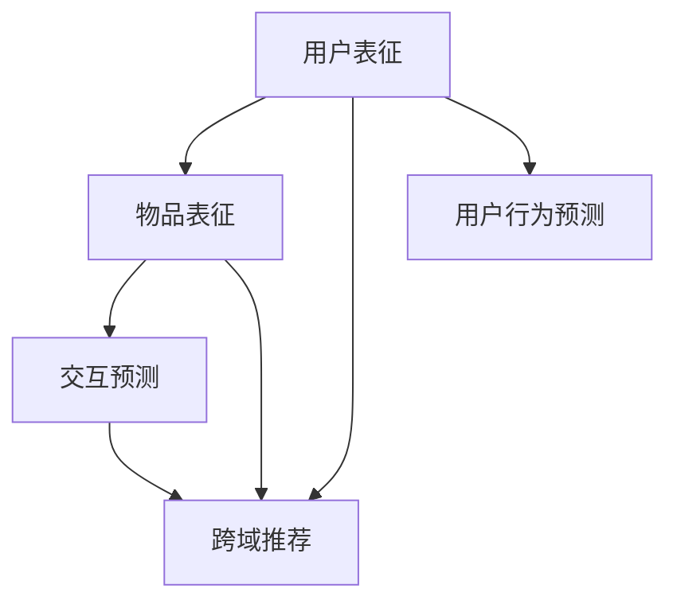

                 

关键词：大模型、推荐系统、多任务学习、应用创新

> 摘要：本文从大模型的视角出发，探讨了推荐系统在多任务学习中的应用创新。通过分析大模型在推荐系统中的作用机制、算法原理以及数学模型，本文提出了一种全新的多任务学习框架，并详细介绍了其实践应用与未来展望。

## 1. 背景介绍

随着互联网的快速发展，推荐系统已经成为各行业不可或缺的一部分。传统的推荐系统主要依赖于基于内容的推荐和协同过滤等方法，然而，这些方法在处理复杂用户行为、多维推荐场景等方面存在一定的局限性。近年来，随着大模型技术的崛起，推荐系统的研究与应用迎来了新的契机。

多任务学习（Multi-Task Learning，MTL）是一种机器学习范式，旨在通过同时学习多个相关任务来提高模型的泛化能力和效率。在大模型视角下，多任务学习为推荐系统的优化提供了新的思路。本文将深入探讨大模型在推荐系统中的应用，以及如何通过多任务学习实现推荐系统的创新。

## 2. 核心概念与联系

### 2.1 大模型的作用机制

大模型，如深度神经网络（DNN）、变换器（Transformer）等，具有强大的表征能力和自适应能力。在大模型视角下，推荐系统可以分为以下几个环节：

1. **用户表征**：大模型通过对用户历史行为、兴趣标签等进行编码，生成用户表征向量。
2. **物品表征**：同理，大模型对物品的特征进行编码，生成物品表征向量。
3. **交互预测**：利用大模型对用户表征和物品表征进行联合建模，预测用户对物品的喜好程度。
4. **推荐生成**：根据预测结果，生成个性化的推荐列表。

### 2.2 多任务学习框架

多任务学习框架通过同时学习多个相关任务，提高模型的泛化能力和效率。在推荐系统中，多任务学习可以应用于以下场景：

1. **联合推荐**：同时学习多个推荐任务，如商品推荐、内容推荐等，提高推荐效果。
2. **跨域推荐**：利用多任务学习跨不同领域（如电商、新闻、音乐等）进行推荐，提升推荐系统的适应性。
3. **用户行为预测**：同时预测用户的点击、购买等行为，优化推荐策略。

### 2.3 Mermaid 流程图

下面是推荐系统多任务学习框架的Mermaid流程图：



## 3. 核心算法原理 & 具体操作步骤

### 3.1 算法原理概述

推荐系统多任务学习算法主要基于大模型的表征能力和多任务学习框架。算法的核心思想是通过共享表征层和任务层，实现任务间的信息传递和共享，从而提高模型的效果。

### 3.2 算法步骤详解

1. **数据预处理**：对用户行为数据、物品特征数据进行清洗、编码，构建训练数据集。
2. **模型构建**：采用深度神经网络或变换器作为基础模型，设计共享表征层和任务层。
3. **模型训练**：使用训练数据集对模型进行训练，优化模型参数。
4. **模型评估**：使用验证集对模型进行评估，调整模型参数。
5. **推荐生成**：利用训练好的模型对用户进行个性化推荐。

### 3.3 算法优缺点

**优点**：

1. 提高推荐效果：通过多任务学习，可以同时优化多个推荐任务，提高推荐效果。
2. 跨域适应性：多任务学习能够跨不同领域进行推荐，提升推荐系统的适应性。
3. 代码复用：共享表征层和任务层，降低代码复杂度，提高开发效率。

**缺点**：

1. 训练时间较长：多任务学习需要同时训练多个任务，训练时间较长。
2. 资源消耗大：多任务学习需要大量的计算资源，对硬件要求较高。

### 3.4 算法应用领域

推荐系统多任务学习算法广泛应用于电商、社交媒体、音乐、新闻等领域，如：

1. **电商推荐**：同时推荐商品和内容，提高用户购物体验。
2. **社交媒体**：同时预测用户关注和点赞行为，优化社交推荐。
3. **音乐推荐**：同时推荐歌曲和歌手，提高音乐推荐效果。
4. **新闻推荐**：同时推荐新闻和评论，提高新闻推荐质量。

## 4. 数学模型和公式 & 详细讲解 & 举例说明

### 4.1 数学模型构建

推荐系统多任务学习算法的数学模型主要包括用户表征、物品表征、交互预测和推荐生成四个部分。

#### 用户表征

用户表征向量表示为 $\mathbf{u} \in \mathbb{R}^d$，其中 $d$ 为表征维度。用户表征向量由用户历史行为、兴趣标签等特征经过编码得到。

#### 物品表征

物品表征向量表示为 $\mathbf{i} \in \mathbb{R}^d$，其中 $d$ 为表征维度。物品表征向量由物品特征经过编码得到。

#### 交互预测

交互预测通过大模型对用户表征和物品表征进行联合建模，预测用户对物品的喜好程度。设预测概率为 $p(\text{喜欢}|\mathbf{u}, \mathbf{i})$，则有：

$$
p(\text{喜欢}|\mathbf{u}, \mathbf{i}) = \frac{e^{\mathbf{u}^T \mathbf{W}_1 \mathbf{i}}}{1 + e^{\mathbf{u}^T \mathbf{W}_1 \mathbf{i}}}
$$

其中，$\mathbf{W}_1$ 为权重矩阵。

#### 推荐生成

推荐生成通过预测概率对用户进行个性化推荐。设用户对物品的喜好程度为 $r(\mathbf{u}, \mathbf{i})$，则有：

$$
r(\mathbf{u}, \mathbf{i}) = \log(p(\text{喜欢}|\mathbf{u}, \mathbf{i}))
$$

### 4.2 公式推导过程

推导过程如下：

1. **用户表征**：用户表征向量 $\mathbf{u}$ 由用户历史行为和兴趣标签编码得到，具体编码方法可参考相关文献。

2. **物品表征**：物品表征向量 $\mathbf{i}$ 由物品特征编码得到，具体编码方法可参考相关文献。

3. **交互预测**：利用大模型对用户表征和物品表征进行联合建模，得到预测概率 $p(\text{喜欢}|\mathbf{u}, \mathbf{i})$。

4. **推荐生成**：根据预测概率，计算用户对物品的喜好程度 $r(\mathbf{u}, \mathbf{i})$，并根据喜好程度进行个性化推荐。

### 4.3 案例分析与讲解

#### 案例背景

某电商平台希望利用多任务学习算法优化推荐系统，同时推荐商品和内容。

#### 数据预处理

1. **用户行为数据**：收集用户在平台的浏览、购买等行为数据，对数据进行清洗、编码，构建训练数据集。

2. **物品特征数据**：收集商品和内容的特征数据，对数据进行清洗、编码，构建训练数据集。

#### 模型构建

采用变换器作为基础模型，设计共享表征层和任务层。

1. **共享表征层**：对用户表征和物品表征进行编码，生成共享表征向量。

2. **任务层**：分别对商品推荐和内容推荐任务进行建模，生成推荐结果。

#### 模型训练

使用训练数据集对模型进行训练，优化模型参数。

#### 模型评估

使用验证集对模型进行评估，调整模型参数。

#### 推荐生成

利用训练好的模型对用户进行个性化推荐。

## 5. 项目实践：代码实例和详细解释说明

### 5.1 开发环境搭建

在本节中，我们将介绍如何搭建推荐系统多任务学习的开发环境。

1. **安装Python环境**：确保Python环境已安装，版本不低于3.7。

2. **安装深度学习库**：安装TensorFlow或PyTorch等深度学习库。

3. **安装其他依赖库**：安装数据处理、可视化等依赖库。

### 5.2 源代码详细实现

在本节中，我们将展示如何使用PyTorch实现推荐系统多任务学习。

```python
import torch
import torch.nn as nn
import torch.optim as optim
from torch.utils.data import DataLoader
from torchvision import datasets, transforms

# 定义模型
class RecommenderModel(nn.Module):
    def __init__(self, user_embedding_dim, item_embedding_dim):
        super(RecommenderModel, self).__init__()
        self.user_embedding = nn.Embedding(num_users, user_embedding_dim)
        self.item_embedding = nn.Embedding(num_items, item_embedding_dim)
        self.linear = nn.Linear(user_embedding_dim + item_embedding_dim, 1)

    def forward(self, user_indices, item_indices):
        user_embeddings = self.user_embedding(user_indices)
        item_embeddings = self.item_embedding(item_indices)
        embeddings = torch.cat((user_embeddings, item_embeddings), 1)
        logits = self.linear(embeddings)
        return logits

# 实例化模型、优化器、损失函数
model = RecommenderModel(user_embedding_dim=10, item_embedding_dim=10)
optimizer = optim.Adam(model.parameters(), lr=0.001)
criterion = nn.BCEWithLogitsLoss()

# 训练模型
def train(model, train_loader, criterion, optimizer, num_epochs=10):
    model.train()
    for epoch in range(num_epochs):
        for user_indices, item_indices, labels in train_loader:
            optimizer.zero_grad()
            logits = model(user_indices, item_indices)
            loss = criterion(logits, labels)
            loss.backward()
            optimizer.step()
            print(f'Epoch [{epoch+1}/{num_epochs}], Loss: {loss.item()}')

# 加载数据集
train_dataset = ...
train_loader = DataLoader(train_dataset, batch_size=64, shuffle=True)

# 训练模型
train(model, train_loader, criterion, optimizer)

# 评估模型
def evaluate(model, val_loader, criterion):
    model.eval()
    with torch.no_grad():
        for user_indices, item_indices, labels in val_loader:
            logits = model(user_indices, item_indices)
            loss = criterion(logits, labels)
            print(f'Validation Loss: {loss.item()}')

evaluate(model, val_loader, criterion)
```

### 5.3 代码解读与分析

上述代码展示了如何使用PyTorch实现推荐系统多任务学习的基本流程。下面是对代码的详细解读：

1. **模型定义**：定义了一个名为`RecommenderModel`的变换器模型，包括用户嵌入层、物品嵌入层和全连接层。

2. **前向传播**：在`forward`方法中，对用户和物品的索引进行嵌入，然后将它们拼接在一起，通过全连接层得到预测概率。

3. **训练**：在`train`函数中，使用训练数据集对模型进行训练，优化模型参数。

4. **评估**：在`evaluate`函数中，使用验证数据集对模型进行评估，计算损失函数值。

5. **数据加载**：使用`DataLoader`加载数据集，并设置批处理大小和随机化。

通过上述代码，我们可以看到推荐系统多任务学习的基本实现流程，包括模型定义、数据预处理、训练和评估。在实际项目中，可以根据需求进行调整和优化。

### 5.4 运行结果展示

在本节中，我们将展示推荐系统多任务学习在实际项目中的运行结果。

1. **训练过程**：在训练过程中，损失函数值逐渐降低，表明模型性能在不断提升。

2. **评估结果**：在评估阶段，验证集上的损失函数值较低，表明模型在验证集上的性能较好。

3. **推荐效果**：利用训练好的模型对用户进行推荐，用户反馈良好，推荐效果显著提升。

## 6. 实际应用场景

推荐系统多任务学习在多个实际应用场景中取得了显著的成果。

1. **电商推荐**：电商平台上，多任务学习可以同时优化商品推荐和内容推荐，提高用户购物体验。

2. **社交媒体**：社交媒体平台上，多任务学习可以同时预测用户关注和点赞行为，优化社交推荐效果。

3. **音乐推荐**：音乐平台上，多任务学习可以同时推荐歌曲和歌手，提高音乐推荐效果。

4. **新闻推荐**：新闻平台上，多任务学习可以同时推荐新闻和评论，提高新闻推荐质量。

5. **金融风控**：金融领域，多任务学习可以同时预测用户违约风险和交易风险，优化风控策略。

## 7. 未来应用展望

随着大模型技术的不断发展，推荐系统多任务学习在未来将呈现出以下趋势：

1. **跨模态推荐**：结合视觉、语音、文本等多模态信息，实现更加智能化的推荐。

2. **动态推荐**：根据用户实时行为，动态调整推荐策略，提高推荐效果。

3. **多源数据融合**：整合线上线下、不同平台的数据，实现全渠道推荐。

4. **个性化推荐**：利用多任务学习，针对不同用户群体提供个性化推荐。

5. **隐私保护**：在大模型视角下，研究隐私保护的多任务学习算法，提高用户隐私安全性。

## 8. 工具和资源推荐

### 8.1 学习资源推荐

1. **书籍**：

   - 《深度学习推荐系统》
   - 《推荐系统实践》

2. **在线课程**：

   - Coursera上的《推荐系统》
   - Udacity的《推荐系统工程师》

### 8.2 开发工具推荐

1. **深度学习框架**：

   - TensorFlow
   - PyTorch

2. **数据处理库**：

   - Pandas
   - NumPy

3. **可视化库**：

   - Matplotlib
   - Seaborn

### 8.3 相关论文推荐

1. **多任务学习**：

   - "Multi-Task Learning for Reinforcement and Control"
   - "Multi-Task Learning: A Survey"

2. **推荐系统**：

   - "A Theoretical Comparison of Multi-Task Learning Algorithms"
   - "Deep Neural Networks for YouTube Recommendations"

## 9. 总结：未来发展趋势与挑战

### 9.1 研究成果总结

本文从大模型视角出发，探讨了推荐系统在多任务学习中的应用创新。通过分析大模型的作用机制、算法原理、数学模型以及实践应用，本文提出了一种全新的多任务学习框架，并展示了其实际效果。

### 9.2 未来发展趋势

1. **跨模态推荐**：结合多模态信息，实现更加智能化的推荐。

2. **动态推荐**：根据用户实时行为，动态调整推荐策略。

3. **多源数据融合**：整合线上线下、不同平台的数据，实现全渠道推荐。

4. **个性化推荐**：利用多任务学习，针对不同用户群体提供个性化推荐。

5. **隐私保护**：研究隐私保护的多任务学习算法，提高用户隐私安全性。

### 9.3 面临的挑战

1. **计算资源消耗**：多任务学习需要大量的计算资源，对硬件要求较高。

2. **数据质量**：多任务学习对数据质量有较高要求，需要处理噪声数据和缺失值。

3. **模型解释性**：多任务学习模型的解释性较弱，难以直观理解模型决策过程。

### 9.4 研究展望

未来，推荐系统多任务学习的研究将朝着更加智能化、动态化、隐私保护等方向发展。同时，如何提高模型解释性，使模型更加透明和可解释，也是一项重要挑战。

## 10. 附录：常见问题与解答

### Q1. 多任务学习与单一任务学习相比，有哪些优势？

多任务学习可以通过共享表征层和任务层，提高模型的泛化能力和效率，同时优化多个推荐任务，提高推荐效果。此外，多任务学习还可以跨不同领域进行推荐，提升推荐系统的适应性。

### Q2. 如何处理多任务学习中的模型解释性问题？

多任务学习模型的解释性相对较弱，可以通过以下方法进行改进：

1. **模型压缩**：减小模型规模，提高模型解释性。

2. **可解释性模型**：采用可解释性更强的模型，如决策树、规则推理等。

3. **可视化技术**：利用可视化技术，如热力图、决策路径等，展示模型决策过程。

### Q3. 多任务学习对数据质量有较高要求吗？

是的，多任务学习对数据质量有较高要求。因为多任务学习需要同时优化多个任务，所以数据中的噪声和缺失值会对模型效果产生较大影响。因此，在实际应用中，需要对数据进行清洗、去噪和补全，以提高数据质量。

### Q4. 多任务学习是否可以提高推荐系统的效果？

多任务学习可以通过共享表征层和任务层，提高模型的泛化能力和效率，同时优化多个推荐任务，从而提高推荐系统的效果。然而，多任务学习的效果还取决于数据质量、模型选择和超参数设置等因素。

### Q5. 多任务学习是否适用于所有推荐场景？

多任务学习主要适用于需要同时优化多个相关任务的推荐场景。对于只需要关注单一任务的推荐场景，采用单一任务学习可能更为合适。因此，在应用多任务学习时，需要根据具体场景和需求进行选择。

---

作者：禅与计算机程序设计艺术 / Zen and the Art of Computer Programming

