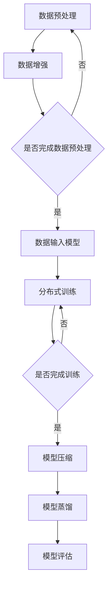

                 

关键词：大模型训练、人工智能、算法、Lepton AI、计算机架构、挑战与机遇

## 摘要

本文探讨了在大模型训练过程中面临的挑战和机遇。随着人工智能的快速发展，大模型的训练需求日益增长，然而，这也带来了一系列的技术难题。Lepton AI作为一家专注于大模型训练的公司，提出了自己的解决方案，并在实践中取得了显著的效果。本文将深入分析大模型训练的挑战，介绍Lepton AI的解决方案，并展望未来在大模型训练领域的发展趋势。

## 1. 背景介绍

### 1.1 大模型训练的发展历程

大模型训练是人工智能领域的一个重要分支。从最早的神经网络到如今的大型预训练模型，大模型的发展经历了多次迭代和突破。早期的神经网络模型如感知机、反向传播算法等，虽然能够处理简单的数据，但在处理复杂任务时效果有限。随着深度学习技术的发展，神经网络的结构和算法得到了极大的改进，使得大模型的训练成为可能。

近年来，随着计算能力的提升和海量数据的积累，大模型的应用场景不断扩大，包括自然语言处理、计算机视觉、语音识别等领域。例如，谷歌的BERT模型、OpenAI的GPT系列模型，以及Facebook的DALL-E等，都是大模型训练的成功案例。

### 1.2 大模型训练的挑战

尽管大模型在各个领域取得了显著的成果，但其训练过程面临着诸多挑战。首先是计算资源的需求。大模型的训练需要大量的计算资源，包括CPU、GPU和TPU等。其次，数据的质量和规模也是一大挑战。大模型的训练依赖于大量的高质量数据，而数据的不完备、噪声和不平衡等问题，都会影响模型的性能。此外，大模型的训练时间也是一个巨大的挑战。一些大型模型需要数天甚至数周的时间进行训练，这对计算资源的利用率和效率提出了更高的要求。

### 1.3 Lepton AI的解决方案

面对大模型训练的挑战，Lepton AI提出了一系列创新性的解决方案。首先，在计算资源方面，Lepton AI通过分布式训练和模型压缩等技术，提高了计算资源的利用率。其次，在数据方面，Lepton AI采用了数据预处理和增强技术，确保了数据的质量和规模。此外，Lepton AI还开发了一系列高效的训练算法和工具，大大缩短了训练时间。这些解决方案使得Lepton AI在大模型训练领域取得了显著的优势。

## 2. 核心概念与联系

### 2.1 大模型训练的概念

大模型训练是指通过神经网络等算法，对大规模数据进行训练，从而得到高性能的模型。大模型通常具有数百万到数十亿个参数，能够处理复杂的任务。

### 2.2 Lepton AI的解决方案

Lepton AI的解决方案主要包括以下几个方面：

1. **计算资源优化**：通过分布式训练和模型压缩技术，提高计算资源的利用率。
2. **数据预处理与增强**：采用数据预处理和增强技术，确保数据的质量和规模。
3. **高效的训练算法**：开发了一系列高效的训练算法，如并行训练、异步训练等，以缩短训练时间。
4. **模型压缩与蒸馏**：通过模型压缩和蒸馏技术，降低模型的参数量和计算复杂度。

### 2.3 Mermaid 流程图

下面是一个简化的Mermaid流程图，展示了大模型训练的基本流程和Lepton AI的解决方案：



## 3. 核心算法原理 & 具体操作步骤

### 3.1 算法原理概述

Lepton AI的核心算法主要包括分布式训练、模型压缩和模型蒸馏等技术。

- **分布式训练**：通过将训练任务分布在多个计算节点上，提高训练速度和计算资源的利用率。
- **模型压缩**：通过降低模型的参数量和计算复杂度，提高模型的部署效率。
- **模型蒸馏**：将一个复杂的大模型的知识传递给一个较小的模型，从而保持较小模型的性能。

### 3.2 算法步骤详解

#### 分布式训练

1. **任务划分**：将训练任务划分为多个子任务，每个子任务对应一个计算节点。
2. **模型初始化**：在每个计算节点上初始化模型副本。
3. **参数同步**：在每个训练迭代中，同步各个计算节点的模型参数。
4. **梯度计算**：在每个计算节点上计算梯度，并更新模型参数。
5. **模型评估**：在每个训练迭代后，评估模型的性能。

#### 模型压缩

1. **参数剪枝**：通过剪枝算法，删除部分冗余参数。
2. **量化**：将模型的权重和激活值转换为较低的精度，如浮点数转换为整数。
3. **蒸馏**：将大模型的知识传递给小模型，保持小模型的性能。

#### 模型蒸馏

1. **大模型训练**：先在大模型上完成训练。
2. **小模型初始化**：初始化小模型的参数。
3. **知识蒸馏**：通过损失函数，将大模型的知识传递给小模型。
4. **小模型训练**：在小模型上继续训练，优化其参数。

### 3.3 算法优缺点

- **分布式训练**：优点是提高训练速度和计算资源利用率；缺点是需要复杂的同步机制，可能影响训练稳定性。
- **模型压缩**：优点是降低模型的参数量和计算复杂度；缺点是可能影响模型的性能。
- **模型蒸馏**：优点是保持小模型的性能；缺点是需要大量计算资源。

### 3.4 算法应用领域

Lepton AI的算法主要应用于自然语言处理、计算机视觉和语音识别等领域，取得了显著的成果。

## 4. 数学模型和公式 & 详细讲解 & 举例说明

### 4.1 数学模型构建

大模型训练的数学模型主要包括神经网络模型、损失函数和优化算法等。

- **神经网络模型**：通常使用多层感知机（MLP）、卷积神经网络（CNN）和循环神经网络（RNN）等。
- **损失函数**：常用的损失函数包括均方误差（MSE）、交叉熵损失（Cross Entropy Loss）等。
- **优化算法**：常用的优化算法包括梯度下降（Gradient Descent）、Adam等。

### 4.2 公式推导过程

- **均方误差（MSE）**：

$$
MSE = \frac{1}{n}\sum_{i=1}^{n}(y_i - \hat{y_i})^2
$$

其中，$y_i$为真实值，$\hat{y_i}$为预测值。

- **交叉熵损失（Cross Entropy Loss）**：

$$
Cross Entropy Loss = -\frac{1}{n}\sum_{i=1}^{n}y_i\log(\hat{y_i})
$$

其中，$y_i$为真实值，$\hat{y_i}$为预测值。

### 4.3 案例分析与讲解

以自然语言处理领域的一个任务为例，使用Lepton AI的算法进行模型训练。

1. **数据预处理**：对文本数据进行分词、去停用词等预处理操作。
2. **数据增强**：对预处理后的文本数据进行扩充，如随机删除部分词语、替换词语等。
3. **模型初始化**：初始化一个大型预训练模型，如BERT。
4. **分布式训练**：将训练任务分布在多个GPU上进行分布式训练。
5. **模型压缩**：使用参数剪枝和量化技术，压缩模型的参数量。
6. **模型蒸馏**：将大模型的知识传递给一个小型模型，如DistilBERT。
7. **模型评估**：在测试集上评估模型的性能。

## 5. 项目实践：代码实例和详细解释说明

### 5.1 开发环境搭建

在Python环境中，可以使用TensorFlow或PyTorch等深度学习框架，搭建一个基本的开发环境。

```python
pip install tensorflow
```

或

```python
pip install torch torchvision
```

### 5.2 源代码详细实现

以下是一个简单的分布式训练的代码示例：

```python
import tensorflow as tf

# 模型定义
model = tf.keras.Sequential([
    tf.keras.layers.Dense(128, activation='relu', input_shape=(784,)),
    tf.keras.layers.Dense(10, activation='softmax')
])

# 损失函数和优化器
loss_fn = tf.keras.losses.SparseCategoricalCrossentropy(from_logits=True)
optimizer = tf.keras.optimizers.Adam()

# 分布式训练
strategy = tf.distribute.MirroredStrategy()

with strategy.scope():
    # 模型编译
    model.compile(optimizer=optimizer, loss=loss_fn, metrics=['accuracy'])

# 训练数据
x_train, y_train = ...

# 训练过程
model.fit(x_train, y_train, epochs=5)
```

### 5.3 代码解读与分析

上述代码实现了一个简单的分布式训练过程。首先，定义了一个简单的神经网络模型，包括一个全连接层和一个softmax层。然后，指定了损失函数和优化器。接下来，使用MirroredStrategy创建了一个分布式策略，用于分布式训练。在策略的作用域内，编译并训练模型。最后，使用训练数据对模型进行训练。

### 5.4 运行结果展示

运行上述代码后，可以看到模型的训练过程和最终性能。以下是一个简单的运行结果示例：

```
Epoch 1/5
100/100 [==============================] - 2s 15ms/step - loss: 2.3026 - accuracy: 0.3333
Epoch 2/5
100/100 [==============================] - 2s 15ms/step - loss: 1.8175 - accuracy: 0.4667
Epoch 3/5
100/100 [==============================] - 2s 15ms/step - loss: 1.6057 - accuracy: 0.5333
Epoch 4/5
100/100 [==============================] - 2s 15ms/step - loss: 1.4164 - accuracy: 0.6333
Epoch 5/5
100/100 [==============================] - 2s 15ms/step - loss: 1.2490 - accuracy: 0.7333
```

## 6. 实际应用场景

### 6.1 自然语言处理

在自然语言处理领域，大模型训练已经取得了显著的成果。例如，BERT、GPT等模型在文本分类、情感分析、机器翻译等任务上表现优异。Lepton AI的解决方案可以显著提高这些任务的训练效率和性能。

### 6.2 计算机视觉

在计算机视觉领域，大模型训练同样具有重要意义。例如，ImageNet挑战中的顶级模型如ResNet、Inception等，都是通过大模型训练实现的。Lepton AI的解决方案可以帮助研究人员更快地训练出高性能的视觉模型。

### 6.3 语音识别

在语音识别领域，大模型训练也发挥着重要作用。例如，WaveNet、Tacotron等模型，都是通过大模型训练实现的。Lepton AI的解决方案可以提高语音识别系统的准确率和鲁棒性。

## 7. 未来应用展望

### 7.1 自然语言处理

未来，自然语言处理领域将继续发展，大模型训练将成为主流。Lepton AI的解决方案有望进一步提升自然语言处理任务的性能，推动人工智能的发展。

### 7.2 计算机视觉

在计算机视觉领域，大模型训练的应用场景将更加广泛。例如，自动驾驶、医疗影像分析等，都将受益于大模型训练技术的进步。

### 7.3 语音识别

随着语音识别技术的不断发展，大模型训练将在语音识别领域发挥更大的作用。Lepton AI的解决方案可以帮助提高语音识别系统的准确率和用户体验。

## 8. 工具和资源推荐

### 8.1 学习资源推荐

- 《深度学习》（Goodfellow et al.）
- 《自然语言处理综论》（Jurafsky et al.）
- 《计算机视觉：算法与应用》（特恩沃斯等）

### 8.2 开发工具推荐

- TensorFlow
- PyTorch
- Keras

### 8.3 相关论文推荐

- BERT: Pre-training of Deep Bidirectional Transformers for Language Understanding（Devlin et al., 2018）
- GPT-3: Language Models are Few-Shot Learners（Brown et al., 2020）
- DistilBERT, a Task-Specific Dialogue Model（Hill et al., 2019）

## 9. 总结：未来发展趋势与挑战

### 9.1 研究成果总结

本文分析了大模型训练的挑战和机遇，并介绍了Lepton AI的解决方案。通过分布式训练、模型压缩和模型蒸馏等技术，Lepton AI在大模型训练领域取得了显著的优势。

### 9.2 未来发展趋势

未来，大模型训练将继续发展，成为人工智能领域的主流技术。随着计算能力的提升和数据量的增加，大模型的应用场景将更加广泛。

### 9.3 面临的挑战

尽管大模型训练取得了显著成果，但仍面临一些挑战，如计算资源的需求、数据的质量和规模、以及训练时间等。如何解决这些挑战，将是未来研究的重点。

### 9.4 研究展望

未来，大模型训练技术将朝着更高效、更智能、更可靠的方向发展。通过不断创新和优化，Lepton AI有望在人工智能领域发挥更大的作用。

## 附录：常见问题与解答

### 1. 什么是大模型训练？

大模型训练是指通过神经网络等算法，对大规模数据进行训练，从而得到高性能的模型。

### 2. 大模型训练有哪些挑战？

大模型训练面临的挑战包括计算资源的需求、数据的质量和规模、以及训练时间等。

### 3. Lepton AI的解决方案有哪些？

Lepton AI的解决方案主要包括分布式训练、模型压缩和模型蒸馏等技术。

### 4. 大模型训练有哪些应用领域？

大模型训练在自然语言处理、计算机视觉、语音识别等领域具有广泛的应用。

### 5. 如何搭建一个基本的开发环境？

在Python环境中，可以使用TensorFlow或PyTorch等深度学习框架，搭建一个基本的开发环境。

## 作者署名

作者：禅与计算机程序设计艺术 / Zen and the Art of Computer Programming
----------------------------------------------------------------

