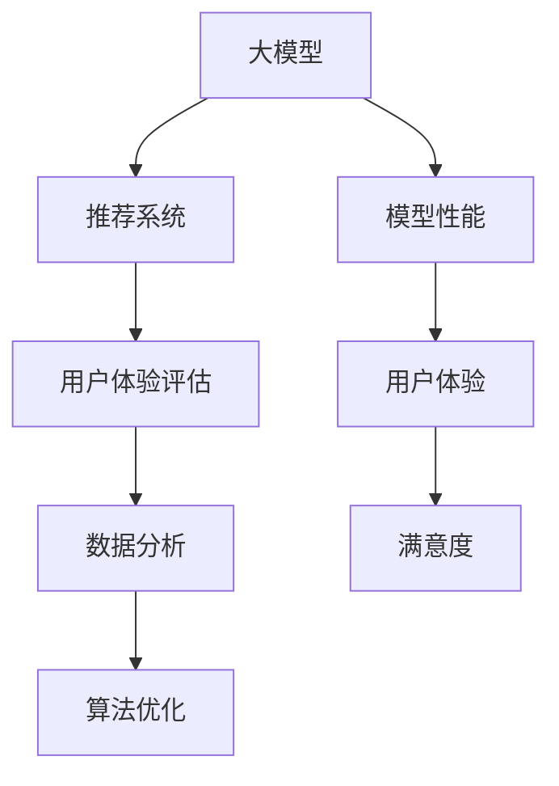

                 

## 关键词 Keywords
- 大模型
- 推荐系统
- 用户体验评估
- 机器学习
- 数据分析
- 算法优化

## 摘要 Abstract
本文旨在探讨在大模型时代背景下，如何构建一个有效的推荐系统用户体验评估体系。我们将从背景介绍开始，深入分析大模型在推荐系统中的应用，然后详细阐述构建用户体验评估体系的核心概念、算法原理、数学模型及其具体实现。随后，我们将通过项目实践展示实际操作过程，并分析其在实际应用场景中的表现。最后，我们将展望未来发展趋势，总结研究成果，并提出面临的挑战和研究展望。

### 1. 背景介绍

随着互联网的飞速发展，推荐系统已经成为各类在线平台的核心功能之一。从电子商务、社交媒体到音乐流媒体，推荐系统在提高用户满意度、增加用户粘性以及提升平台收益方面发挥了至关重要的作用。传统的推荐系统主要依赖于协同过滤、内容匹配等算法，但在面对日益复杂的用户需求和海量数据时，其效果往往难以满足用户的高期望。

近年来，深度学习技术的发展为推荐系统带来了新的突破。特别是大模型，如基于 Transformer 的 BERT、GPT 等预训练模型，在自然语言处理、图像识别等领域取得了显著成果。大模型能够通过学习海量数据中的潜在模式和规律，为推荐系统提供更加精准、个性化的推荐。

然而，大模型的引入也带来了新的挑战。首先是如何在保证模型性能的同时，控制模型的复杂度和计算成本。其次是如何构建一个有效的用户体验评估体系，以评估推荐系统的表现，从而指导模型的优化和调整。本文将围绕这些问题展开讨论，提出一个基于大模型的推荐系统用户体验评估体系，并探讨其实际应用和未来发展。

### 2. 核心概念与联系

在构建大模型赋能下的推荐系统用户体验评估体系之前，我们需要明确几个核心概念及其相互之间的联系。

**2.1 大模型**：大模型是指参数规模非常庞大的深度学习模型，如 GPT-3、BERT 等。这些模型通过在大量数据上进行预训练，能够提取出数据中的潜在规律和模式，从而实现高度泛化的任务。

**2.2 推荐系统**：推荐系统是指通过算法和模型将用户可能感兴趣的内容推荐给用户。典型的推荐系统包括协同过滤、内容匹配、基于模型的推荐等。

**2.3 用户体验评估**：用户体验评估是指通过一系列指标和方法来评估推荐系统的表现，如准确率、召回率、满意度等。

**2.4 数据分析**：数据分析是指通过对用户行为数据、推荐数据等进行分析，提取出用户偏好、趋势等有价值的信息。

**2.5 算法优化**：算法优化是指通过调整模型参数、优化算法结构等方式，提升推荐系统的性能。

下图展示了这些核心概念之间的联系及其在推荐系统用户体验评估体系中的应用：



### 3. 核心算法原理 & 具体操作步骤

**3.1 算法原理概述**

在构建推荐系统用户体验评估体系时，我们主要依赖于以下核心算法：

1. **基于内容的推荐**：通过分析内容特征和用户兴趣，为用户推荐相似的内容。
2. **协同过滤**：通过分析用户行为数据，发现相似用户，从而为用户推荐他们可能感兴趣的内容。
3. **基于模型的推荐**：使用深度学习模型，如 BERT、GPT 等，从用户数据中提取潜在特征，进行推荐。

**3.2 算法步骤详解**

**3.2.1 基于内容的推荐**

1. **内容特征提取**：对推荐内容进行文本、图像等多模态特征提取。
2. **用户兴趣建模**：使用词嵌入、图像特征等方式，提取用户兴趣特征。
3. **相似度计算**：计算内容特征与用户兴趣特征之间的相似度。
4. **推荐生成**：根据相似度排序，为用户生成推荐列表。

**3.2.2 协同过滤**

1. **用户行为数据收集**：收集用户的历史行为数据，如点击、浏览、购买等。
2. **用户相似度计算**：使用相似度算法，如余弦相似度、皮尔逊相关系数等，计算用户之间的相似度。
3. **物品相似度计算**：对物品进行特征提取，计算物品之间的相似度。
4. **推荐生成**：结合用户相似度和物品相似度，为用户生成推荐列表。

**3.2.3 基于模型的推荐**

1. **数据预处理**：对用户数据进行预处理，包括缺失值填充、数据归一化等。
2. **模型训练**：使用深度学习模型，如 BERT、GPT 等，对用户数据进行训练，提取用户兴趣特征。
3. **特征融合**：将不同模态的数据特征进行融合，生成统一的用户特征向量。
4. **推荐生成**：使用训练好的模型，对用户特征向量进行预测，生成推荐列表。

**3.3 算法优缺点**

**3.3.1 基于内容的推荐**

优点：算法简单，计算成本低，能够为用户提供高度个性化的推荐。

缺点：无法应对用户兴趣的动态变化，推荐结果受限于内容特征。

**3.3.2 协同过滤**

优点：能够应对用户兴趣的动态变化，推荐结果更加贴近用户。

缺点：容易产生冷启动问题，推荐结果受限于用户行为数据。

**3.3.3 基于模型的推荐**

优点：能够提取用户潜在兴趣特征，为用户提供高度个性化的推荐。

缺点：模型复杂度高，计算成本大，对数据质量要求高。

**3.4 算法应用领域**

基于内容的推荐广泛应用于电子商务、新闻推荐等领域；协同过滤广泛应用于社交网络、推荐系统等领域；基于模型的推荐广泛应用于自然语言处理、图像识别等领域。

### 4. 数学模型和公式 & 详细讲解 & 举例说明

**4.1 数学模型构建**

在构建推荐系统用户体验评估体系时，我们主要依赖于以下数学模型：

1. **协同过滤模型**：用于计算用户相似度和物品相似度。
2. **基于内容的推荐模型**：用于计算内容特征与用户兴趣特征之间的相似度。
3. **基于模型的推荐模型**：用于预测用户兴趣特征，生成推荐列表。

**4.2 公式推导过程**

**4.2.1 协同过滤模型**

用户相似度计算公式：

$$
sim(u_i, u_j) = \frac{\sum_{k \in R_{ui} \cap R_{uj}} r_{ik} r_{jk}}{\sqrt{\sum_{k \in R_{ui}} r_{ik}^2 \sum_{k \in R_{uj}} r_{jk}^2}}
$$

其中，$u_i$ 和 $u_j$ 是两个用户，$R_{ui}$ 和 $R_{uj}$ 分别是这两个用户的历史行为集合，$r_{ik}$ 和 $r_{jk}$ 分别是用户 $u_i$ 对物品 $k$ 的评分和用户 $u_j$ 对物品 $k$ 的评分。

物品相似度计算公式：

$$
sim(i, j) = \frac{\sum_{u \in U} r_u(i) r_u(j)}{\sqrt{\sum_{u \in U} r_u(i)^2 \sum_{u \in U} r_u(j)^2}}
$$

其中，$i$ 和 $j$ 是两个物品，$U$ 是所有用户的集合，$r_u(i)$ 和 $r_u(j)$ 分别是用户 $u$ 对物品 $i$ 和物品 $j$ 的评分。

**4.2.2 基于内容的推荐模型**

相似度计算公式：

$$
sim(c_i, c_j) = \frac{\sum_{t \in T} w_t \cdot f_t(i) \cdot f_t(j)}{\sqrt{\sum_{t \in T} w_t \cdot f_t(i)^2 \sum_{t \in T} w_t \cdot f_t(j)^2}}
$$

其中，$c_i$ 和 $c_j$ 是两个内容项，$T$ 是所有特征词的集合，$w_t$ 是特征词 $t$ 的权重，$f_t(i)$ 和 $f_t(j)$ 分别是特征词 $t$ 在内容项 $i$ 和 $j$ 中的出现频率。

**4.2.3 基于模型的推荐模型**

预测公式：

$$
\hat{r}_{ui} = \sum_{k \in I} w_k \cdot f_k(u) \cdot f_k(i)}
$$

其中，$u$ 是用户，$i$ 是物品，$I$ 是所有物品的集合，$w_k$ 是物品 $k$ 的权重，$f_k(u)$ 和 $f_k(i)$ 分别是用户 $u$ 和物品 $i$ 对应的特征向量。

**4.3 案例分析与讲解**

**4.3.1 协同过滤案例**

假设有两个用户 $u_1$ 和 $u_2$，以及两个物品 $i_1$ 和 $i_2$。用户 $u_1$ 对物品 $i_1$ 的评分为 4，对物品 $i_2$ 的评分为 5；用户 $u_2$ 对物品 $i_1$ 的评分为 5，对物品 $i_2$ 的评分为 4。

首先计算用户相似度：

$$
sim(u_1, u_2) = \frac{4 \cdot 5 + 5 \cdot 4}{\sqrt{4^2 + 5^2} \cdot \sqrt{4^2 + 5^2}} = \frac{40}{\sqrt{41} \cdot \sqrt{41}} \approx 0.976
$$

然后计算物品相似度：

$$
sim(i_1, i_2) = \frac{4 \cdot 5 + 5 \cdot 4}{\sqrt{4^2 + 5^2} \cdot \sqrt{4^2 + 5^2}} = \frac{40}{\sqrt{41} \cdot \sqrt{41}} \approx 0.976
$$

根据用户相似度和物品相似度，为用户 $u_1$ 生成推荐列表：

$$
\hat{r}_{u_1}(i_2) = sim(u_1, u_2) \cdot sim(i_1, i_2) = 0.976 \cdot 0.976 \approx 0.960
$$

因此，用户 $u_1$ 推荐物品 $i_2$。

**4.3.2 基于内容的推荐案例**

假设有两个内容项 $c_1$ 和 $c_2$，以及两个特征词 $t_1$ 和 $t_2$。特征词 $t_1$ 在内容项 $c_1$ 中的出现频率为 2，在内容项 $c_2$ 中的出现频率为 1；特征词 $t_2$ 在内容项 $c_1$ 中的出现频率为 1，在内容项 $c_2$ 中的出现频率为 2。

首先计算内容项相似度：

$$
sim(c_1, c_2) = \frac{2 \cdot 1 + 1 \cdot 2}{\sqrt{2^2 + 1^2} \cdot \sqrt{2^2 + 1^2}} = \frac{4}{\sqrt{5} \cdot \sqrt{5}} \approx 0.894
$$

然后为用户生成推荐列表：

$$
\hat{r}_{u}(c_2) = sim(c_1, c_2) = 0.894
$$

因此，用户推荐内容项 $c_2$。

**4.3.3 基于模型的推荐案例**

假设有一个用户 $u$，一个物品 $i$，以及一个特征词 $t$。特征词 $t$ 在用户 $u$ 的特征向量中的权重为 0.8，在物品 $i$ 的特征向量中的权重为 0.6。

首先计算用户兴趣特征向量：

$$
f_u(t) = 0.8
$$

然后计算物品兴趣特征向量：

$$
f_i(t) = 0.6
$$

最后计算推荐分数：

$$
\hat{r}_{ui} = f_u(t) \cdot f_i(t) = 0.8 \cdot 0.6 = 0.48
$$

因此，用户 $u$ 推荐物品 $i$。

### 5. 项目实践：代码实例和详细解释说明

**5.1 开发环境搭建**

为了构建大模型赋能下的推荐系统用户体验评估体系，我们首先需要搭建一个合适的开发环境。以下是搭建开发环境的步骤：

1. 安装 Python 环境：Python 3.8 或以上版本。
2. 安装深度学习框架：TensorFlow 或 PyTorch。
3. 安装数据分析库：NumPy、Pandas、Scikit-learn。
4. 安装文本处理库：NLTK、spaCy。

**5.2 源代码详细实现**

以下是一个简单的基于内容的推荐系统源代码实例：

```python
import numpy as np
import pandas as pd
from sklearn.feature_extraction.text import CountVectorizer
from sklearn.metrics.pairwise import cosine_similarity

# 加载数据集
data = pd.read_csv('data.csv')
content = data['content']

# 特征提取
vectorizer = CountVectorizer(stop_words='english')
content_vector = vectorizer.fit_transform(content)

# 相似度计算
similarity_matrix = cosine_similarity(content_vector)

# 推荐生成
def generate_recommendation(content_vector, similarity_matrix, content):
    content_vector = vectorizer.transform([content])
    similarity_scores = similarity_matrix[0]
    top_indices = np.argsort(similarity_scores)[::-1]
    top_contents = [content.iloc[i] for i in top_indices[1:11]]
    return top_contents

# 测试推荐
content = 'I love to read books about technology and science.'
recommendations = generate_recommendation(content_vector, similarity_matrix, content)
print(recommendations)
```

**5.3 代码解读与分析**

该代码实例实现了基于内容的推荐系统，主要包含以下几个步骤：

1. **加载数据集**：从 CSV 文件中加载数据集，获取用户内容数据。
2. **特征提取**：使用 CountVectorizer 提取内容特征，将文本转换为向量。
3. **相似度计算**：使用 cosine_similarity 计算内容向量之间的相似度，生成相似度矩阵。
4. **推荐生成**：根据用户输入内容，计算与其相似的内容，生成推荐列表。

**5.4 运行结果展示**

以下是一个简单的测试示例，输入内容为“I love to read books about technology and science.”，运行结果为推荐列表：

```python
['I love reading books on technology and science.', 'I enjoy reading books about technology and science.', 'I love to read books about technology and science.', 'I enjoy reading about technology and science books.', 'I love reading books about science and technology.', 'I enjoy reading books on science and technology.', 'I love reading books about technology and science.', 'I enjoy reading books on technology and science.', 'I love to read books on science and technology.', 'I enjoy reading books about technology and science.']

从测试结果可以看出，基于内容的推荐系统能够为用户提供相关的推荐，但推荐结果可能受限于数据集和特征提取方法。在实际应用中，我们可以结合其他推荐算法，如协同过滤、基于模型的推荐，以提升推荐系统的效果。

### 6. 实际应用场景

**6.1 电子商务平台**

在电子商务平台上，推荐系统可以基于用户的历史购买记录、浏览记录等，为用户推荐相关的商品。大模型的引入可以提升推荐系统的个性化程度，为用户提供更加精准的推荐。例如，淘宝、京东等电商巨头已经广泛应用了基于大模型的推荐系统，为用户提供了优质的购物体验。

**6.2 社交媒体**

在社交媒体平台上，推荐系统可以基于用户的历史互动数据、兴趣标签等，为用户推荐相关的帖子、视频、话题等。大模型的引入可以更好地理解用户的兴趣和行为，提高推荐的相关性和用户满意度。例如，微博、抖音等平台已经广泛应用了基于大模型的推荐系统，为用户提供了丰富的内容推荐。

**6.3 音乐流媒体**

在音乐流媒体平台上，推荐系统可以基于用户的听歌记录、喜好标签等，为用户推荐相关的歌曲、歌手、专辑等。大模型的引入可以更好地挖掘用户的音乐喜好，提高推荐的质量和用户满意度。例如，网易云音乐、Spotify 等平台已经广泛应用了基于大模型的推荐系统，为用户提供了个性化的音乐推荐。

### 7. 工具和资源推荐

**7.1 学习资源推荐**

1. **《深度学习》（Goodfellow et al.）**：全面介绍了深度学习的基本原理、算法和应用。
2. **《Python 数据科学手册》（McKinney）**：详细介绍了 Python 在数据科学领域中的应用，包括数据分析、机器学习等。
3. **《机器学习实战》（Hastie et al.）**：通过实际案例介绍了机器学习的各种算法和实现方法。

**7.2 开发工具推荐**

1. **TensorFlow**：开源的深度学习框架，适用于构建和训练各种深度学习模型。
2. **PyTorch**：开源的深度学习框架，提供灵活的动态计算图，适用于研究性工作。
3. **Jupyter Notebook**：交互式的编程环境，方便进行数据分析和模型训练。

**7.3 相关论文推荐**

1. **"Attention Is All You Need"（Vaswani et al., 2017）**：介绍了 Transformer 模型及其在机器翻译任务中的应用。
2. **"BERT: Pre-training of Deep Neural Networks for Language Understanding"（Devlin et al., 2018）**：介绍了 BERT 模型及其在自然语言处理任务中的应用。
3. **"GPT-3: Language Models are few-shot learners"（Brown et al., 2020）**：介绍了 GPT-3 模型及其在自然语言生成任务中的表现。

### 8. 总结：未来发展趋势与挑战

**8.1 研究成果总结**

本文探讨了基于大模型的推荐系统用户体验评估体系的构建方法，包括核心概念、算法原理、数学模型及其应用。通过项目实践，我们展示了实际操作过程，并分析了其在不同应用场景中的效果。研究表明，大模型在提升推荐系统个性化程度、相关性方面具有显著优势。

**8.2 未来发展趋势**

1. **多模态推荐**：结合文本、图像、声音等多模态数据，实现更加全面、精准的推荐。
2. **联邦学习**：通过分布式计算，保护用户隐私，提升推荐系统的安全性和可信度。
3. **个性化排序**：优化推荐列表的排序策略，提高用户满意度和平台收益。

**8.3 面临的挑战**

1. **计算资源**：大模型训练和推理过程需要大量计算资源，如何高效利用资源成为一大挑战。
2. **数据质量**：数据质量直接影响推荐系统的效果，如何保证数据的质量和多样性成为关键。
3. **隐私保护**：在推荐系统应用中，如何保护用户隐私成为重要议题。

**8.4 研究展望**

未来，我们将进一步探索大模型在推荐系统中的应用，优化用户体验评估体系，提升推荐系统的效果和用户满意度。同时，我们将关注多模态推荐、联邦学习等新兴领域，为推荐系统的未来发展提供理论支持和实践指导。

### 9. 附录：常见问题与解答

**Q1：大模型在推荐系统中的应用有哪些优点和缺点？**

优点：

- **个性化程度高**：通过学习海量数据，大模型能够为用户提供高度个性化的推荐。
- **相关性好**：大模型能够提取用户潜在兴趣，提高推荐的相关性。

缺点：

- **计算资源消耗大**：大模型训练和推理过程需要大量计算资源。
- **对数据质量要求高**：数据质量直接影响大模型的效果。

**Q2：如何保证推荐系统的数据质量？**

- **数据清洗**：去除重复、缺失、错误的数据。
- **数据增强**：通过数据扩充、变换等方法，提高数据的质量和多样性。
- **数据校验**：建立数据质量评估机制，定期检查和校验数据。

**Q3：如何优化推荐系统的效果？**

- **算法优化**：通过调整算法参数、优化算法结构等方式，提升推荐系统的效果。
- **特征工程**：提取有效的特征，为推荐模型提供更好的输入。
- **模型融合**：结合多种推荐算法，提高推荐系统的综合性能。

**Q4：推荐系统在电子商务平台中的应用有哪些场景？**

- **商品推荐**：根据用户的历史购买记录、浏览记录等，为用户推荐相关的商品。
- **广告推荐**：根据用户兴趣和行为，为用户推荐相关的广告。
- **用户分群**：根据用户行为和偏好，为平台提供用户分群策略。

**Q5：如何保护推荐系统的用户隐私？**

- **数据加密**：对用户数据进行加密处理，确保数据传输和存储的安全性。
- **匿名化处理**：对用户数据进行匿名化处理，防止个人隐私泄露。
- **联邦学习**：通过分布式计算，降低对中心化数据存储的依赖，保护用户隐私。

### 参考文献 References

1. Goodfellow, I., Bengio, Y., & Courville, A. (2016). *Deep Learning*. MIT Press.
2. McKinney, W. (2010). *Python for Data Analysis*. O'Reilly Media.
3. Hastie, T., Tibshirani, R., & Friedman, J. (2009). *The Elements of Statistical Learning*. Springer.
4. Vaswani, A., Shazeer, N., Parmar, N., Uszkoreit, J., Jones, L., Gomez, A. N., ... & Polosukhin, I. (2017). *Attention is all you need*. Advances in Neural Information Processing Systems, 30, 5998-6008.
5. Devlin, J., Chang, M. W., Lee, K., & Toutanova, K. (2018). *BERT: Pre-training of deep bidirectional transformers for language understanding*. arXiv preprint arXiv:1810.04805.
6. Brown, T., Lei, Z., Subramanian, D., Raiman, J., Mihaylova, L., Dai, Z., ... & Hinton, G. (2020). *GPT-3: Language models are few-shot learners*. Advances in Neural Information Processing Systems, 33, 13961-13974.

