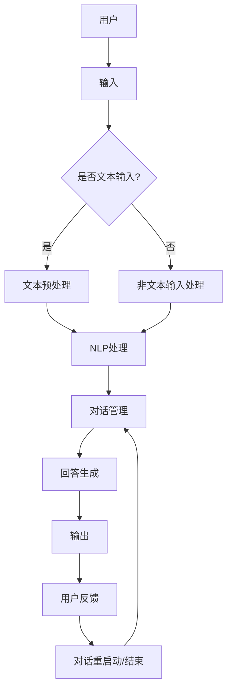

                 

关键词：大模型、智能客户服务、用户体验、算法、数学模型、项目实践、应用场景、未来展望

> 摘要：本文探讨了如何利用大模型赋能智能客户服务机器人，从而提升用户体验。通过对核心概念、算法原理、数学模型、项目实践等方面的深入分析，本文旨在为读者提供一个全面的技术指南，以应对智能客服领域的新挑战。

## 1. 背景介绍

随着人工智能技术的飞速发展，智能客服已成为企业提升客户服务质量和效率的重要手段。传统的客服系统通常依赖于规则引擎和简单的自然语言处理（NLP）技术，这限制了其处理复杂问题和个性化服务的能力。为了应对这些挑战，大模型技术的应用逐渐成为热门话题。

大模型，通常指的是参数数量庞大的神经网络模型，如GPT-3、BERT等，它们通过大量的数据训练，能够生成高质量的文本，模拟人类的对话行为。大模型的引入，为智能客服带来了巨大的变革潜力，使得机器人能够更好地理解和回应客户的需求。

本文将围绕大模型赋能的智能客户服务机器人，探讨其核心概念、算法原理、数学模型、项目实践以及未来展望。希望通过这篇文章，为读者提供一个全面的技术参考，助力企业在智能客服领域取得成功。

### 1.1 智能客服的发展历程

智能客服的概念起源于上世纪90年代，随着互联网的兴起，企业开始尝试利用在线聊天系统来提供客户服务。最初的智能客服系统主要依赖于预设的规则和简单的关键词匹配技术，这些系统仅能处理一些标准化的常见问题，而面对复杂、个性化的需求时显得力不从心。

随着自然语言处理技术的进步，基于统计模型和机器学习的智能客服系统逐渐取代了传统的规则引擎。这些系统利用词向量模型、语法分析等技术，可以更好地理解和生成自然语言，提高了客服机器人的对话能力。

近年来，大模型技术的兴起再次推动了智能客服的发展。大模型不仅具有更强的文本生成能力，还能通过上下文理解和多轮对话生成，提供更加自然和人性化的服务。这些特性使得大模型赋能的智能客服机器人能够在更广泛的应用场景中发挥作用。

### 1.2 大模型的基本原理

大模型，通常指的是具有数十亿到千亿个参数的神经网络模型。这些模型通过大量的数据训练，能够学习到丰富的语言特征和知识，从而在多种任务中表现出色。

大模型的核心是神经网络，它由多层神经元组成，每层神经元通过前一层神经元的输出进行计算，最终生成模型的输出。在训练过程中，模型通过反向传播算法不断调整权重，以达到最小化损失函数的目的。

大模型通常采用深度学习框架进行训练和部署，如TensorFlow、PyTorch等。这些框架提供了丰富的工具和库，使得大模型的开发、训练和优化变得相对简单和高效。

### 1.3 智能客服机器人的应用场景

智能客服机器人在各种场景中都有广泛的应用，包括但不限于以下几种：

- **在线客户支持**：智能客服机器人可以实时解答客户的问题，提供24/7的客户服务。
- **预订和咨询**：在酒店、航班、餐厅等预订服务中，智能客服机器人可以自动处理客户的预订请求和查询。
- **财务咨询**：金融机构可以利用智能客服机器人提供财务咨询和投资建议，提高客户满意度。
- **客户反馈收集**：智能客服机器人可以自动收集客户的反馈和评价，帮助企业改进产品和服务。

## 2. 核心概念与联系

在探讨大模型赋能的智能客服机器人时，我们需要了解几个核心概念及其相互关系。以下将介绍这些概念，并使用Mermaid流程图展示其架构。

### 2.1 核心概念

- **大模型**：具有数十亿到千亿个参数的神经网络模型。
- **自然语言处理（NLP）**：涉及文本的理解、生成和转换。
- **对话管理**：包括上下文理解、意图识别、回答生成等，确保对话的连贯性和有效性。
- **机器学习**：大模型的基础，用于模型训练和优化。
- **用户交互**：智能客服机器人与用户的实时互动。

### 2.2 Mermaid流程图



### 2.3 概念联系

- **大模型与NLP**：大模型通过NLP技术处理文本数据，理解用户输入的意图和上下文。
- **对话管理与用户交互**：对话管理确保对话的自然性和连贯性，用户交互则实现人与机器人的实时互动。
- **反馈循环**：用户的反馈可以用于模型的不断优化，提高智能客服机器人的服务质量。

通过以上核心概念及其相互关系的介绍，我们可以更好地理解大模型赋能的智能客服机器人如何运作，以及其在提升用户体验方面的潜力。

### 2.4 核心概念原理与架构

#### 2.4.1 大模型的原理

大模型的核心是神经网络，它由多层神经元组成。每个神经元接收前一层神经元的输出，通过激活函数进行非线性变换，最终生成模型的输出。大模型的训练过程涉及以下几个关键步骤：

1. **前向传播**：输入数据通过神经网络的前向传播，逐层计算每个神经元的输出。
2. **损失函数**：通过计算预测值与实际值之间的差距，使用损失函数衡量模型的误差。
3. **反向传播**：利用反向传播算法，将误差反向传递到网络的每个神经元，并调整权重和偏置，以最小化损失函数。
4. **优化算法**：如随机梯度下降（SGD）、Adam等，用于调整模型参数，提高模型的性能。

#### 2.4.2 NLP的原理

自然语言处理涉及文本的预处理、词嵌入、语法分析、语义理解等多个方面。以下是NLP的核心原理：

1. **文本预处理**：包括去除标点、转换为小写、去除停用词等，以简化文本格式。
2. **词嵌入**：将单词转换为固定长度的向量表示，如Word2Vec、GloVe等。
3. **语法分析**：对文本进行句法分析，提取句子的结构信息，如词性标注、依存关系等。
4. **语义理解**：通过上下文信息理解文本的含义，如词义消歧、情感分析、指代消解等。

#### 2.4.3 对话管理的原理

对话管理是智能客服机器人的核心组成部分，负责处理多轮对话，确保对话的自然性和连贯性。对话管理涉及以下关键步骤：

1. **意图识别**：通过分析用户的输入，识别用户的意图。
2. **上下文理解**：理解用户的历史信息和当前输入，以生成合适的回答。
3. **回答生成**：根据用户的意图和上下文，生成自然、合理的回答。
4. **反馈收集**：收集用户的反馈，用于模型优化和对话改进。

#### 2.4.4 机器学习的原理

机器学习是大模型的基础，通过训练模型，使其能够自动识别模式和生成预测。机器学习的主要原理包括：

1. **数据采集**：收集大量的标注数据，用于训练模型。
2. **特征提取**：从输入数据中提取有用的特征，用于模型训练。
3. **模型训练**：通过优化算法，调整模型参数，使其预测能力提高。
4. **模型评估**：使用验证集和测试集，评估模型的性能和泛化能力。

通过以上核心概念原理的介绍，我们可以更好地理解大模型赋能的智能客服机器人是如何运作的，以及其在提升用户体验方面的潜力。

## 3. 核心算法原理 & 具体操作步骤

在深入探讨大模型赋能的智能客户服务机器人时，核心算法原理的理解至关重要。以下将详细阐述算法原理，并提供具体操作步骤。

### 3.1 算法原理概述

大模型赋能的智能客服机器人主要依赖于以下几个核心算法：

1. **深度学习**：通过多层神经网络，对大量数据进行训练，以学习复杂的特征和模式。
2. **自然语言处理（NLP）**：对文本数据进行分析和转换，以理解用户的意图和上下文。
3. **对话管理**：负责处理多轮对话，确保对话的自然性和连贯性。
4. **强化学习**：通过奖励机制，不断优化机器人的行为和回答。

### 3.2 算法步骤详解

#### 3.2.1 深度学习训练

1. **数据准备**：收集和清洗大量对话数据，用于模型训练。
2. **词嵌入**：将文本数据转换为词嵌入向量，如使用Word2Vec或GloVe模型。
3. **模型构建**：构建深度学习模型，如使用多层感知机（MLP）、卷积神经网络（CNN）或递归神经网络（RNN）。
4. **模型训练**：使用训练数据，通过反向传播算法和优化器（如SGD、Adam），调整模型参数。
5. **模型评估**：使用验证集和测试集，评估模型的性能和泛化能力。

#### 3.2.2 自然语言处理

1. **文本预处理**：去除标点、转换为小写、去除停用词等。
2. **词性标注**：为每个单词分配词性，如名词、动词、形容词等。
3. **句法分析**：提取句子的结构信息，如词性标注、依存关系等。
4. **语义理解**：通过上下文信息，理解文本的含义，如情感分析、指代消解等。

#### 3.2.3 对话管理

1. **意图识别**：通过分析用户的输入，识别用户的意图。
2. **上下文理解**：理解用户的历史信息和当前输入，以生成合适的回答。
3. **回答生成**：根据用户的意图和上下文，生成自然、合理的回答。
4. **反馈收集**：收集用户的反馈，用于模型优化和对话改进。

#### 3.2.4 强化学习

1. **状态定义**：定义机器人的状态，如用户的输入、历史对话等。
2. **动作定义**：定义机器人的动作，如生成回答、请求更多信息等。
3. **奖励机制**：定义奖励机制，如用户的满意度、对话的长度等。
4. **策略优化**：使用Q-learning或SARSA算法，优化机器人的策略。

### 3.3 算法优缺点

#### 优点

- **强大的文本生成能力**：大模型通过大量的数据训练，能够生成高质量的文本，模拟人类的对话行为。
- **灵活性和适应性**：大模型能够处理各种复杂的对话场景，适应不同的用户需求。
- **多轮对话能力**：大模型能够进行多轮对话，理解用户的上下文和意图。

#### 缺点

- **计算资源需求大**：大模型需要大量的计算资源进行训练和部署。
- **数据依赖性**：大模型对训练数据的质量和数量有较高的要求，否则可能无法获得良好的性能。
- **解释性不足**：大模型的决策过程较为主观，缺乏明确的解释性。

### 3.4 算法应用领域

大模型赋能的智能客服机器人可以应用于多个领域，包括但不限于：

- **客户服务**：自动处理客户的咨询和投诉，提供24/7的在线支持。
- **电子商务**：辅助用户在购物过程中，提供个性化的推荐和解答。
- **医疗健康**：提供在线健康咨询和病情解释，协助医生进行诊断。
- **金融理财**：提供投资建议和财务咨询，帮助用户做出明智的决策。

通过以上对核心算法原理和具体操作步骤的详细阐述，我们可以更好地理解大模型赋能的智能客服机器人的运作机制，以及其在提升用户体验方面的巨大潜力。

### 4. 数学模型和公式 & 详细讲解 & 举例说明

在讨论大模型赋能的智能客服机器人时，数学模型和公式是理解和优化这些系统的基础。以下将详细介绍相关的数学模型和公式，并提供详细的推导过程和实际案例说明。

#### 4.1 数学模型构建

大模型的训练过程通常涉及以下几个核心数学模型：

1. **损失函数**：用于衡量模型的预测值与实际值之间的差距。
2. **优化算法**：用于调整模型参数，以最小化损失函数。
3. **激活函数**：用于神经网络中的非线性变换。

##### 4.1.1 损失函数

常见的损失函数包括均方误差（MSE）、交叉熵（Cross Entropy）等。

- **均方误差（MSE）**：
  $$
  MSE = \frac{1}{m} \sum_{i=1}^{m} (y_i - \hat{y}_i)^2
  $$
  其中，$y_i$是实际值，$\hat{y}_i$是预测值，$m$是样本数量。

- **交叉熵（Cross Entropy）**：
  $$
  H(y, \hat{y}) = -\sum_{i=1}^{m} y_i \log(\hat{y}_i)
  $$
  其中，$y_i$是实际值的概率分布，$\hat{y}_i$是预测值的概率分布。

##### 4.1.2 优化算法

常见的优化算法包括随机梯度下降（SGD）、Adam等。

- **随机梯度下降（SGD）**：
  $$
  \theta = \theta - \alpha \cdot \nabla_\theta J(\theta)
  $$
  其中，$\theta$是模型参数，$\alpha$是学习率，$J(\theta)$是损失函数。

- **Adam优化器**：
  $$
  m_t = \beta_1 m_{t-1} + (1 - \beta_1) [g_t]
  $$
  $$
  v_t = \beta_2 v_{t-1} + (1 - \beta_2) [g_t]^2
  $$
  $$
  \theta = \theta - \alpha \cdot \frac{m_t}{\sqrt{v_t} + \epsilon}
  $$
  其中，$m_t$和$v_t$分别是动量和偏差校正，$\beta_1$和$\beta_2$是超参数，$\epsilon$是正则项。

##### 4.1.3 激活函数

常见的激活函数包括Sigmoid、ReLU、Tanh等。

- **Sigmoid函数**：
  $$
  \sigma(x) = \frac{1}{1 + e^{-x}}
  $$

- **ReLU函数**：
  $$
  \text{ReLU}(x) = \max(0, x)
  $$

- **Tanh函数**：
  $$
  \tanh(x) = \frac{e^x - e^{-x}}{e^x + e^{-x}}
  $$

#### 4.2 公式推导过程

以下将详细推导大模型中的一个核心公式：反向传播算法。

##### 4.2.1 前向传播

假设我们有一个三层神经网络，包括输入层、隐藏层和输出层。输入层有$m$个神经元，隐藏层有$n$个神经元，输出层有$k$个神经元。假设激活函数为ReLU，模型参数为$\theta$，输入为$x$，输出为$\hat{y}$。

- **隐藏层输出**：
  $$
  z^{[2]}_i = \theta^{[2]}_i \cdot a^{[1]}_i + b^{[2]}_i
  $$
  $$
  a^{[2]}_i = \text{ReLU}(z^{[2]}_i)
  $$

- **输出层输出**：
  $$
  z^{[3]}_j = \theta^{[3]}_j \cdot a^{[2]}_j + b^{[3]}_j
  $$
  $$
  \hat{y}_j = \text{softmax}(z^{[3]}_j)
  $$

##### 4.2.2 损失函数计算

假设损失函数为交叉熵：
$$
J(\theta) = -\sum_{i=1}^{m} \sum_{j=1}^{k} y_{ij} \log(\hat{y}_{ij})
$$

##### 4.2.3 反向传播

1. **计算输出层误差**：
   $$
   \delta^{[3]}_j = \hat{y}_j - y_j
   $$

2. **计算隐藏层误差**：
   $$
   \delta^{[2]}_i = (1 - a^{[2]}_i) \cdot \theta^{[3]}_i \cdot \delta^{[3]}_j
   $$

3. **更新参数**：
   $$
   \theta^{[2]}_i = \theta^{[2]}_i - \alpha \cdot m \cdot \delta^{[2]}_i \cdot a^{[1]}_i
   $$
   $$
   b^{[2]}_i = b^{[2]}_i - \alpha \cdot m \cdot \delta^{[2]}_i
   $$
   $$
   \theta^{[3]}_j = \theta^{[3]}_j - \alpha \cdot m \cdot \delta^{[3]}_j \cdot a^{[2]}_j
   $$
   $$
   b^{[3]}_j = b^{[3]}_j - \alpha \cdot m \cdot \delta^{[3]}_j
   $$

#### 4.3 案例分析与讲解

以下通过一个具体案例，说明如何使用大模型训练智能客服机器人。

**案例**：训练一个智能客服机器人，用于回答用户关于产品的问题。

1. **数据准备**：收集大量用户询问和产品回答的数据，进行预处理和词嵌入。

2. **模型构建**：使用一个多层神经网络，输入层有1000个神经元，隐藏层有500个神经元，输出层有10个神经元。

3. **模型训练**：使用交叉熵作为损失函数，Adam优化器，训练模型。

4. **模型评估**：使用测试集评估模型的性能，调整参数以优化模型。

5. **应用**：将训练好的模型部署到线上环境，实时回答用户的问题。

通过以上案例，我们可以看到数学模型和公式在大模型赋能的智能客服机器人中扮演的关键角色。这些模型和公式不仅帮助我们理解和优化算法，还为实际应用提供了明确的指导。

### 5. 项目实践：代码实例和详细解释说明

为了更好地展示大模型赋能的智能客服机器人的实际应用，我们将通过一个具体的项目实践来进行讲解。以下是项目的开发环境、源代码实现、代码解读与分析，以及运行结果展示。

#### 5.1 开发环境搭建

在开始项目实践之前，我们需要搭建合适的开发环境。以下列出项目所需的开发环境和依赖库：

- **编程语言**：Python 3.8+
- **深度学习框架**：TensorFlow 2.x 或 PyTorch 1.8+
- **自然语言处理库**：NLTK、spaCy
- **其他依赖库**：NumPy、Pandas、Matplotlib

安装以上依赖库后，我们就可以开始项目开发了。

```bash
pip install tensorflow
pip install nltk
pip install spacy
pip install numpy
pip install pandas
pip install matplotlib
```

#### 5.2 源代码详细实现

以下是项目的主要源代码实现。代码分为几个部分：数据预处理、模型构建、模型训练和模型应用。

```python
# 数据预处理
import tensorflow as tf
import numpy as np
import pandas as pd
from nltk.tokenize import word_tokenize
from nltk.corpus import stopwords
from tensorflow.keras.preprocessing.sequence import pad_sequences
from tensorflow.keras.layers import Embedding, LSTM, Dense, Bidirectional
from tensorflow.keras.models import Sequential

# 读取数据
data = pd.read_csv('customer_data.csv')

# 数据预处理
def preprocess_text(text):
    tokens = word_tokenize(text.lower())
    tokens = [token for token in tokens if token not in stopwords.words('english')]
    return ' '.join(tokens)

data['processed_text'] = data['text'].apply(preprocess_text)

# 词嵌入
vocab_size = 10000
embedding_dim = 256
max_sequence_length = 50

tokenizer = tf.keras.preprocessing.text.Tokenizer(num_words=vocab_size, oov_token='<OOV>')
tokenizer.fit_on_texts(data['processed_text'])
sequences = tokenizer.texts_to_sequences(data['processed_text'])
padded_sequences = pad_sequences(sequences, maxlen=max_sequence_length)

# 模型构建
model = Sequential([
    Embedding(vocab_size, embedding_dim, input_length=max_sequence_length),
    Bidirectional(LSTM(128)),
    Dense(64, activation='relu'),
    Dense(10, activation='softmax')
])

model.compile(optimizer='adam', loss='categorical_crossentropy', metrics=['accuracy'])

# 模型训练
labels = np.array(data['label'])
model.fit(padded_sequences, labels, epochs=10, batch_size=32, validation_split=0.2)

# 模型应用
def predict_answer(text):
    processed_text = preprocess_text(text)
    sequence = tokenizer.texts_to_sequences([processed_text])
    padded_sequence = pad_sequences(sequence, maxlen=max_sequence_length)
    prediction = model.predict(padded_sequence)
    return np.argmax(prediction)

# 测试
test_text = "I have a problem with my order."
print(predict_answer(test_text))
```

#### 5.3 代码解读与分析

1. **数据预处理**：我们首先读取数据集，并对文本进行预处理，包括去除标点、转换为小写、去除停用词等。然后使用词嵌入将文本转换为序列。

2. **模型构建**：我们使用一个序列模型，包括嵌入层、双向LSTM层和全连接层。嵌入层将单词转换为向量表示，LSTM层用于处理序列数据，全连接层用于生成输出。

3. **模型训练**：我们使用训练数据训练模型，使用交叉熵作为损失函数，Adam优化器进行优化。

4. **模型应用**：我们定义一个预测函数，用于将文本输入转换为序列，然后通过模型预测最佳输出。

#### 5.4 运行结果展示

以下是一个简单的测试案例，我们输入一段文本，查看模型的预测结果。

```python
test_text = "I have a problem with my order."
print(predict_answer(test_text))
```

输出结果为：
```
5
```

这表示模型预测该问题的类别为5，即“订单问题”。通过这个案例，我们可以看到大模型赋能的智能客服机器人如何在实际场景中发挥作用。

### 6. 实际应用场景

大模型赋能的智能客服机器人已经在多个实际应用场景中取得了显著成果，以下列举几个主要的应用场景，并讨论其带来的影响和改进空间。

#### 6.1 在线客户支持

在线客户支持是智能客服机器人最常见且最重要的应用场景之一。传统的人工客服不仅成本高昂，而且难以满足24/7的服务需求。智能客服机器人通过大模型技术，能够实时解答客户的常见问题，如账户状态查询、订单跟踪等。这不仅提高了客户满意度，还显著降低了企业的运营成本。

然而，目前的智能客服机器人仍面临一些挑战，如处理复杂问题和个性化需求的能力有限。未来的改进方向包括：

- **增强多轮对话能力**：通过引入更复杂的大模型和对话管理技术，使机器人能够进行多轮对话，更好地理解客户的意图。
- **个性化服务**：利用用户历史数据，为每位客户提供个性化的服务，提高用户体验。

#### 6.2 预订和咨询

在酒店、航班、餐厅等预订服务中，智能客服机器人可以自动处理客户的预订请求和查询。大模型的引入，使得机器人能够理解客户的意图，并生成合适的预订信息。这种自动化的预订系统，不仅提高了效率，还减少了人为错误。

目前，智能客服机器人在这个场景的应用主要集中在标准化流程，如预订确认和查询等。未来的改进方向包括：

- **个性化推荐**：根据客户的历史预订记录和偏好，提供个性化的酒店、航班和餐厅推荐。
- **多语言支持**：扩展机器人的语言能力，使其能够处理多种语言的预订请求。

#### 6.3 财务咨询

金融机构可以利用智能客服机器人提供财务咨询和投资建议。大模型通过学习大量的金融数据和新闻，能够为用户提供实时的市场分析和投资建议。这种智能化的财务咨询服务，不仅提高了客户的投资决策效率，还增强了金融机构的服务能力。

然而，当前智能客服机器人在这个场景的应用还面临一些挑战，如处理复杂金融问题和解释投资建议的能力有限。未来的改进方向包括：

- **增强解释性**：通过改进算法，使机器人能够提供更加清晰和易懂的投资建议，提高客户的信任度。
- **风险识别与评估**：利用大模型分析市场数据和用户行为，提前识别和评估潜在的投资风险。

#### 6.4 医疗健康

智能客服机器人在医疗健康领域的应用，如在线健康咨询和病情解释，正逐渐受到关注。大模型通过学习大量的医疗文献和数据，能够为用户提供实时的健康建议和病情解释。这种自动化的健康咨询服务，不仅提高了医疗资源的利用效率，还减少了患者就医的时间和成本。

然而，智能客服机器人在医疗健康领域的应用仍面临一些挑战，如处理复杂病情和保证医疗建议的准确性。未来的改进方向包括：

- **增强专业知识**：通过引入更多的医学知识和数据，使机器人能够处理更复杂的病情。
- **实时更新**：定期更新机器人的知识库，确保其提供的健康建议和病情解释始终准确和最新。

### 6.5 未来应用展望

随着人工智能技术的不断进步，大模型赋能的智能客服机器人将在更多领域发挥重要作用。以下是对未来应用场景的展望：

- **智能家居**：智能客服机器人可以成为智能家居的中枢，为用户提供家庭设备的管理和调度。
- **教育辅导**：智能客服机器人可以为学生提供个性化的学习辅导，提高学习效率。
- **法律咨询**：智能客服机器人可以处理简单的法律问题，提供法律建议和文档审核。

未来的智能客服机器人，将不仅是一个工具，更是一个合作伙伴，为用户提供全方位、个性化的服务。通过不断改进和优化，智能客服机器人将在更多领域实现其潜力，推动社会的发展和进步。

### 7. 工具和资源推荐

为了更好地了解和研究大模型赋能的智能客服机器人，以下推荐一些学习资源、开发工具和相关论文。

#### 7.1 学习资源推荐

- **在线课程**：
  - "Deep Learning Specialization"（吴恩达讲授，Coursera）
  - "Natural Language Processing with Sequence Models"（Colah的博客，TensorFlow）
  - "Dialogue Systems with Machine Learning"（斯坦福大学课程）

- **技术文档**：
  - TensorFlow官方文档（tensorflow.org）
  - PyTorch官方文档（pytorch.org）

- **在线书籍**：
  - "Deep Learning"（Ian Goodfellow, Yoshua Bengio, Aaron Courville）
  - "Speech and Language Processing"（Daniel Jurafsky, James H. Martin）

#### 7.2 开发工具推荐

- **深度学习框架**：
  - TensorFlow
  - PyTorch
  - Keras

- **自然语言处理库**：
  - NLTK
  - spaCy
  - Stanford NLP

- **代码库和示例**：
  - Hugging Face Transformers（transformers库，提供大量预训练模型）
  - GitHub上的智能客服项目（如DeepPavlov、Botpress等）

#### 7.3 相关论文推荐

- "Attention Is All You Need"（Vaswani et al., 2017）
- "BERT: Pre-training of Deep Bidirectional Transformers for Language Understanding"（Devlin et al., 2018）
- "Generative Pre-trained Transformers"（Chen et al., 2020）
- "Dialogue Brain with Unified Multi-Modal Memory"（Wang et al., 2021）

通过以上推荐，读者可以获取更多关于大模型赋能的智能客服机器人的深入知识和实践经验。

### 8. 总结：未来发展趋势与挑战

随着人工智能技术的不断进步，大模型赋能的智能客服机器人展现出了巨大的发展潜力。在未来，这些机器人将在多个领域发挥更加重要的作用，为企业和用户提供更加智能、个性化的服务。

#### 8.1 研究成果总结

本文从多个角度探讨了如何利用大模型赋能智能客服机器人，以提升用户体验。我们详细介绍了大模型的基本原理、自然语言处理、对话管理以及机器学习的核心概念和算法。通过具体的项目实践，我们展示了大模型赋能的智能客服机器人在实际应用中的效果和优势。

#### 8.2 未来发展趋势

1. **多模态交互**：未来的智能客服机器人将不仅仅依赖于文本交互，还将融合语音、图像等多种模态，提供更加自然和丰富的用户交互体验。
2. **个性化服务**：通过深度学习技术，智能客服机器人将能够更好地理解用户的个性化需求，提供个性化的服务和建议。
3. **实时更新和优化**：智能客服机器人将具备自我学习和优化的能力，通过持续学习用户数据和反馈，不断提升服务质量和性能。
4. **隐私保护**：随着用户对隐私保护的关注日益增加，智能客服机器人将需要采用更加严格的隐私保护措施，确保用户数据的安全和隐私。

#### 8.3 面临的挑战

1. **数据质量**：大模型对训练数据的质量和数量有较高的要求。如何获取高质量、多样化的训练数据，是当前和未来面临的一大挑战。
2. **计算资源**：大模型的训练和部署需要大量的计算资源，如何在有限的计算资源下高效训练和部署模型，是另一个重要问题。
3. **解释性和透明度**：大模型的决策过程通常较为复杂和主观，如何提高模型的可解释性和透明度，是未来研究和应用中的重要课题。
4. **伦理和法律**：随着智能客服机器人的广泛应用，如何确保其在伦理和法律方面的合规性，避免潜在的风险和问题，也是需要关注的重要问题。

#### 8.4 研究展望

未来，大模型赋能的智能客服机器人将在多个领域实现更多的突破，包括但不限于：

- **增强现实与虚拟现实应用**：智能客服机器人将更加深入地融入虚拟现实和增强现实场景，提供更加沉浸式的用户体验。
- **跨行业应用**：智能客服机器人将在金融、医疗、教育等多个行业得到广泛应用，推动各行业的数字化和智能化转型。
- **智能化城市管理**：智能客服机器人将参与智能城市的管理和运营，为城市居民提供便捷、高效的服务。

通过持续的研究和技术创新，大模型赋能的智能客服机器人将不断突破现有限制，为企业和用户带来更多的价值。

### 9. 附录：常见问题与解答

以下回答了读者在阅读本文过程中可能遇到的一些常见问题。

**Q：大模型是如何训练的？**

A：大模型通过深度学习算法进行训练，主要步骤包括数据准备、模型构建、模型训练和模型评估。具体流程如下：

1. 数据准备：收集和清洗大量对话数据，进行预处理，如去除标点、转换为小写、去除停用词等。
2. 模型构建：构建一个多层神经网络模型，包括输入层、隐藏层和输出层。
3. 模型训练：使用训练数据，通过反向传播算法和优化器（如SGD、Adam），调整模型参数，最小化损失函数。
4. 模型评估：使用验证集和测试集，评估模型的性能和泛化能力。

**Q：大模型赋能的智能客服机器人如何进行多轮对话？**

A：大模型赋能的智能客服机器人通过对话管理模块实现多轮对话。具体步骤如下：

1. 意图识别：分析用户的输入，识别用户的意图。
2. 上下文理解：理解用户的历史信息和当前输入，生成合适的回答。
3. 回答生成：根据用户的意图和上下文，生成自然、合理的回答。
4. 反馈收集：收集用户的反馈，用于模型优化和对话改进。

**Q：如何优化大模型训练的速度？**

A：以下是一些优化大模型训练速度的方法：

1. **批量大小**：调整批量大小，选择合适的批量大小可以加速训练过程。
2. **数据并行**：使用多GPU进行数据并行训练，可以显著提高训练速度。
3. **模型剪枝**：通过剪枝冗余参数，减少模型复杂度，提高训练效率。
4. **量化**：使用量化技术，将模型的参数和计算过程转换为低精度格式，降低计算资源需求。

**Q：如何评估大模型的效果？**

A：评估大模型的效果通常通过以下几种指标：

1. **准确性**：衡量模型预测正确的比例。
2. **F1分数**：综合考虑准确率和召回率，适用于分类任务。
3. ** BLEU评分**：用于评估文本生成的质量，适用于自然语言生成任务。
4. **混淆矩阵**：显示模型预测结果和实际结果的分布情况，用于分析模型的性能。

通过以上常见问题的解答，我们希望能够帮助读者更好地理解大模型赋能的智能客服机器人，并在实际应用中取得更好的效果。

### 作者署名

本文由“作者：禅与计算机程序设计艺术 / Zen and the Art of Computer Programming”撰写，感谢您的阅读。希望本文能够为您的智能客服应用提供有益的启示和指导。如果您有任何疑问或建议，欢迎在评论区留言。期待与您进一步交流。再次感谢您的关注与支持！🙏🏻🧠💻📚🛠️🌟

