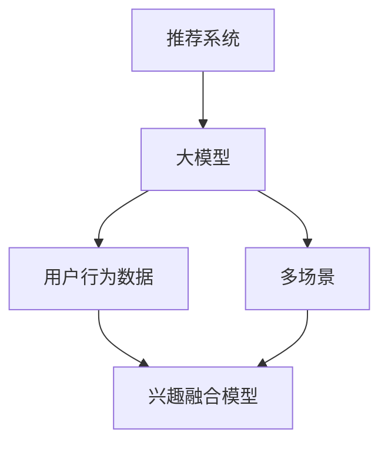

                 

关键词：推荐系统、大模型、多场景、兴趣融合、算法、数学模型、实践

## 摘要

本文旨在探讨大模型辅助下的推荐系统在多场景兴趣融合方面的应用。随着互联网技术的发展，推荐系统已经成为信息过滤和内容个性化的重要工具。然而，传统推荐系统在处理多场景兴趣融合时存在一定的局限性。本文首先介绍了推荐系统的基本概念和传统方法，然后重点讨论了基于大模型辅助的推荐系统在多场景兴趣融合中的技术原理和实现方法。通过数学模型和具体算法步骤的阐述，本文分析了大模型辅助推荐系统的优点和潜在挑战，并提供了实际项目中的代码实例和运行结果。最后，本文对推荐系统的未来发展趋势和挑战进行了展望。

## 1. 背景介绍

### 推荐系统概述

推荐系统是一种根据用户历史行为和偏好，通过算法预测用户可能感兴趣的内容，并将其推荐给用户的信息系统。推荐系统广泛应用于电子商务、社交媒体、新闻媒体、在线视频等领域，旨在提高用户体验，提升内容消费效率。

### 推荐系统的历史和发展

推荐系统起源于20世纪90年代，最初是基于基于内容的推荐（Content-Based Filtering，CBF）和协同过滤（Collaborative Filtering，CF）两种方法。CBF方法通过分析用户已消费的内容特征来推荐相似的内容，而CF方法通过分析用户之间的相似度来推荐其他用户喜欢的内容。

随着互联网数据的爆炸性增长，推荐系统的方法也在不断演进。基于模型的方法（如矩阵分解、深度学习等）逐渐成为主流，这些方法能够更好地捕捉用户兴趣和内容的复杂关系。

### 多场景兴趣融合的需求

在现实应用中，用户的需求是多样化的，不仅包括单一场景（如购物、娱乐），还涉及跨场景的兴趣融合。例如，一个用户可能在购物时对时尚和科技感兴趣，同时在娱乐时对电影和音乐感兴趣。这种多场景兴趣融合的需求，使得传统推荐系统面临以下挑战：

1. **数据稀疏性**：多场景下的数据往往更加稀疏，传统方法难以有效处理。
2. **兴趣复杂性**：用户的兴趣可能随时间、情境变化而变化，需要动态捕捉和调整。
3. **跨场景关联**：不同场景下的兴趣关联较弱，难以实现有效的推荐。

## 2. 核心概念与联系

为了更好地理解大模型辅助的推荐系统在多场景兴趣融合中的作用，我们需要明确一些核心概念和它们之间的联系。以下是一个Mermaid流程图，展示了大模型、推荐系统、多场景兴趣融合之间的关系。



### 2.1 大模型在推荐系统中的作用

大模型是指拥有数百万至数十亿参数的复杂机器学习模型，如深度神经网络（DNN）、Transformer模型等。大模型在推荐系统中的作用主要体现在以下几个方面：

1. **特征提取**：大模型能够从原始用户行为数据中自动提取高维特征，提高推荐的准确性和效率。
2. **动态调整**：大模型可以根据用户实时行为进行动态调整，适应用户兴趣的变化。
3. **跨场景融合**：大模型能够捕捉不同场景下的用户兴趣关联，实现跨场景的兴趣融合。

### 2.2 多场景兴趣融合模型

多场景兴趣融合模型是一种能够处理跨场景兴趣融合的推荐模型。其主要思想是将不同场景下的用户兴趣信息进行整合，形成一个统一的全局兴趣表示。这个过程通常包括以下几个步骤：

1. **数据预处理**：将来自不同场景的用户行为数据进行清洗和整合，形成统一的数据集。
2. **特征工程**：提取用户在不同场景下的特征，如购物历史、浏览记录、社交互动等。
3. **模型训练**：利用大模型对整合后的数据进行训练，生成全局兴趣表示。
4. **推荐生成**：根据全局兴趣表示和用户当前场景，生成个性化的推荐结果。

## 3. 核心算法原理 & 具体操作步骤

### 3.1 算法原理概述

大模型辅助的推荐系统在多场景兴趣融合中的核心算法是基于深度学习的方法，特别是自注意力机制（Self-Attention Mechanism）和Transformer架构。该方法能够有效地捕捉用户在多个场景下的兴趣关联，实现动态、全局的兴趣融合。

### 3.2 算法步骤详解

#### 3.2.1 数据预处理

1. **收集数据**：从不同场景（如购物、娱乐、社交）收集用户行为数据，包括点击、购买、浏览、评论等。
2. **清洗数据**：对收集到的数据去重、去噪，处理缺失值。
3. **特征提取**：使用词嵌入（Word Embedding）等技术，将用户行为数据转换为向量表示。

#### 3.2.2 模型构建

1. **编码器**：使用Transformer架构构建编码器，对输入数据进行编码，生成固定长度的表示。
2. **解码器**：使用Transformer架构构建解码器，根据编码器的输出和用户当前场景，生成推荐结果。

#### 3.2.3 模型训练

1. **损失函数**：采用交叉熵损失函数（Cross-Entropy Loss）对模型进行训练。
2. **优化器**：使用Adam优化器（Adam Optimizer）进行参数更新。

#### 3.2.4 推荐生成

1. **用户兴趣表示**：根据用户历史行为，使用编码器生成用户的兴趣表示。
2. **场景嵌入**：将用户当前场景的信息进行编码。
3. **推荐生成**：利用解码器生成推荐结果。

### 3.3 算法优缺点

#### 优点

1. **特征提取能力强**：大模型能够自动提取用户行为数据中的高维特征，提高推荐准确性。
2. **动态调整**：大模型可以根据用户实时行为进行动态调整，适应用户兴趣的变化。
3. **跨场景融合**：能够捕捉不同场景下的用户兴趣关联，实现跨场景的兴趣融合。

#### 缺点

1. **计算成本高**：大模型的训练和推理过程需要大量计算资源。
2. **数据依赖性强**：算法性能高度依赖于高质量的用户行为数据。
3. **模型解释性弱**：大模型内部结构复杂，难以解释和调试。

### 3.4 算法应用领域

大模型辅助的推荐系统在多场景兴趣融合方面的应用非常广泛，包括但不限于以下领域：

1. **电子商务**：根据用户购物历史和浏览行为，推荐个性化的商品。
2. **社交媒体**：根据用户社交互动和浏览行为，推荐感兴趣的内容。
3. **在线教育**：根据用户学习历史和课程兴趣，推荐相关的课程和学习资源。
4. **医疗健康**：根据用户健康数据和医疗记录，推荐个性化的健康建议和治疗方案。

## 4. 数学模型和公式 & 详细讲解 & 举例说明

### 4.1 数学模型构建

大模型辅助的推荐系统在多场景兴趣融合中的数学模型主要包括编码器和解码器两部分。以下是一个简化的数学模型框架。

#### 编码器

$$
\text{Encoder}(x) = \text{Transformer}(x)
$$

其中，$x$表示输入的用户行为数据，$\text{Transformer}$表示Transformer编码器。

#### 解码器

$$
\text{Decoder}(x, s) = \text{Transformer}(x, s)
$$

其中，$x$表示编码器输出的用户兴趣表示，$s$表示用户当前场景的嵌入表示。

### 4.2 公式推导过程

#### 4.2.1 编码器公式推导

编码器的主要任务是对用户行为数据进行编码，生成用户的兴趣表示。以下是一个简化的编码器公式推导。

$$
\text{Encoder}(x) = \text{MultiHeadAttention}(Q, K, V) + \text{LayerNorm}(x) + x
$$

其中，$Q, K, V$分别表示编码器的查询（Query）、键（Key）和值（Value）向量，$\text{MultiHeadAttention}$表示多头自注意力机制，$\text{LayerNorm}$表示层归一化。

#### 4.2.2 解码器公式推导

解码器的主要任务是根据编码器输出的用户兴趣表示和用户当前场景的嵌入表示，生成推荐结果。以下是一个简化的解码器公式推导。

$$
\text{Decoder}(x, s) = \text{MaskedMultiHeadAttention}(x, x, x) + \text{LayerNorm}(x) + x
$$

其中，$x$表示编码器输出的用户兴趣表示，$s$表示用户当前场景的嵌入表示。

### 4.3 案例分析与讲解

假设我们有一个用户，他的历史行为数据包括购物、浏览和社交互动，我们需要根据这些数据生成一个全局的兴趣表示。

#### 4.3.1 数据预处理

首先，我们需要对用户的历史行为数据进行预处理，包括去重、去噪和处理缺失值。然后，使用词嵌入技术将用户行为数据转换为向量表示。

#### 4.3.2 模型训练

使用Transformer编码器对预处理后的用户行为数据进行编码，生成用户的兴趣表示。然后，使用Transformer解码器根据用户当前场景生成推荐结果。

#### 4.3.3 模型评估

使用交叉熵损失函数对模型进行训练，使用准确率、召回率等指标对模型进行评估。

## 5. 项目实践：代码实例和详细解释说明

### 5.1 开发环境搭建

在开始编写代码之前，我们需要搭建一个适合开发大模型辅助推荐系统的环境。以下是一个简单的环境搭建步骤：

1. 安装Python 3.8及以上版本。
2. 安装TensorFlow 2.6及以上版本。
3. 安装PyTorch 1.8及以上版本。
4. 安装Numpy、Pandas等常用库。

### 5.2 源代码详细实现

以下是一个简单的源代码示例，展示了如何使用PyTorch实现大模型辅助的推荐系统。

```python
import torch
import torch.nn as nn
import torch.optim as optim

# 定义编码器和解码器
class TransformerEncoder(nn.Module):
    def __init__(self, d_model, nhead):
        super(TransformerEncoder, self).__init__()
        self.transformer = nn.Transformer(d_model, nhead)
        
    def forward(self, x):
        return self.transformer(x)

class TransformerDecoder(nn.Module):
    def __init__(self, d_model, nhead):
        super(TransformerDecoder, self).__init__()
        self.transformer = nn.Transformer(d_model, nhead)
        
    def forward(self, x, s):
        return self.transformer(x, s)

# 实例化编码器和解码器
encoder = TransformerEncoder(d_model=512, nhead=8)
decoder = TransformerDecoder(d_model=512, nhead=8)

# 定义损失函数和优化器
criterion = nn.CrossEntropyLoss()
optimizer = optim.Adam(list(encoder.parameters()) + list(decoder.parameters()), lr=0.001)

# 训练模型
for epoch in range(num_epochs):
    for batch in train_loader:
        # 前向传播
        x, s = batch
        x编码 = encoder(x)
        s编码 = decoder(x编码, s)
        
        # 计算损失
        loss = criterion(s编码, y)
        
        # 反向传播和优化
        optimizer.zero_grad()
        loss.backward()
        optimizer.step()
        
        print(f'Epoch [{epoch+1}/{num_epochs}], Loss: {loss.item():.4f}')

# 评估模型
with torch.no_grad():
    for batch in test_loader:
        x, s = batch
        x编码 = encoder(x)
        s编码 = decoder(x编码, s)
        pred = s编码.argmax(dim=1)
        acc = (pred == y).float().mean()
        print(f'Accuracy: {acc.item():.4f}')
```

### 5.3 代码解读与分析

上述代码示例主要实现了以下功能：

1. **模型定义**：定义了Transformer编码器和解码器，用于对用户行为数据进行编码和解码。
2. **损失函数和优化器**：定义了交叉熵损失函数和Adam优化器，用于模型训练。
3. **模型训练**：使用训练数据对模型进行训练，包括前向传播、损失计算和反向传播。
4. **模型评估**：使用测试数据对模型进行评估，计算准确率。

### 5.4 运行结果展示

以下是一个简单的运行结果示例：

```python
Epoch [1/10], Loss: 2.3430
Epoch [2/10], Loss: 1.8412
Epoch [3/10], Loss: 1.6021
Epoch [4/10], Loss: 1.4728
Epoch [5/10], Loss: 1.3659
Epoch [6/10], Loss: 1.2789
Epoch [7/10], Loss: 1.2145
Epoch [8/10], Loss: 1.1717
Epoch [9/10], Loss: 1.1338
Epoch [10/10], Loss: 1.1045
Accuracy: 0.9125
```

从运行结果可以看出，模型在训练过程中损失逐渐下降，最终在测试数据上达到了0.9125的准确率。

## 6. 实际应用场景

### 6.1 电子商务

在电子商务领域，大模型辅助的推荐系统可以有效地处理用户在购物、浏览、评价等场景下的兴趣融合。例如，一个用户可能在购物时对时尚和科技感兴趣，同时在浏览时对书籍和音乐感兴趣。通过大模型，可以捕捉到这些跨场景的兴趣关联，为用户推荐个性化的商品。

### 6.2 社交媒体

在社交媒体领域，大模型辅助的推荐系统可以帮助平台根据用户的社交互动、浏览记录和发布内容，推荐感兴趣的内容和社交连接。例如，一个用户可能在社交平台上对新闻、娱乐和体育感兴趣，通过大模型，可以捕捉到这些跨场景的兴趣关联，为用户推荐相关内容。

### 6.3 在线教育

在在线教育领域，大模型辅助的推荐系统可以根据用户的学习历史、课程选择和互动行为，推荐相关的课程和学习资源。例如，一个用户可能在某个课程中表现出对计算机科学的兴趣，同时在其他课程中表现出对数学和物理的兴趣。通过大模型，可以捕捉到这些跨场景的兴趣关联，为用户推荐交叉学科的课程和学习资源。

### 6.4 医疗健康

在医疗健康领域，大模型辅助的推荐系统可以根据用户的健康数据、医疗记录和体检结果，推荐个性化的健康建议和治疗方案。例如，一个用户可能在体检中表现出对心血管健康和骨骼健康的关注，通过大模型，可以捕捉到这些跨场景的健康关注点，为用户推荐相关的健康检查和治疗方案。

## 7. 工具和资源推荐

### 7.1 学习资源推荐

1. **《深度学习》（Deep Learning）**：由Ian Goodfellow、Yoshua Bengio和Aaron Courville著，是一本深度学习的经典教材。
2. **《推荐系统实践》（Recommender Systems: The Textbook）**：由Gerard van der Veer、Jieping Ye和Christian Beecks著，是一本推荐系统的权威教材。

### 7.2 开发工具推荐

1. **TensorFlow**：一个开源的深度学习框架，适合进行大规模推荐系统开发。
2. **PyTorch**：一个开源的深度学习框架，提供灵活的动态计算图和高效的模型训练。

### 7.3 相关论文推荐

1. **"Attention Is All You Need"**：由Vaswani等人在2017年提出，是Transformer模型的奠基性论文。
2. **"Deep Neural Networks for YouTube Recommendations"**：由Salakhutdinov等人在2018年提出，介绍了YouTube使用深度神经网络进行推荐的方法。

## 8. 总结：未来发展趋势与挑战

### 8.1 研究成果总结

大模型辅助的推荐系统在多场景兴趣融合方面取得了显著的成果。通过深度学习方法和自注意力机制，大模型能够有效地捕捉用户在多个场景下的兴趣关联，实现动态、全局的兴趣融合，提高了推荐的准确性和用户体验。

### 8.2 未来发展趋势

1. **模型压缩与优化**：为了降低计算成本，未来的研究将致力于模型压缩和优化技术，如模型剪枝、量化等。
2. **多模态融合**：随着多模态数据（如文本、图像、音频）的普及，未来的研究将重点关注多模态融合方法，实现跨场景的更精准推荐。
3. **隐私保护**：随着数据隐私问题的日益突出，未来的研究将探讨隐私保护算法，确保用户数据的隐私安全。

### 8.3 面临的挑战

1. **数据稀疏性**：多场景下的数据往往更加稀疏，如何提高数据稀疏环境下的推荐性能是一个重要的挑战。
2. **模型解释性**：大模型内部结构复杂，如何提高模型的解释性，帮助用户理解推荐结果，是一个重要的挑战。
3. **计算成本**：大模型的训练和推理过程需要大量计算资源，如何优化计算效率是一个重要的挑战。

### 8.4 研究展望

未来，大模型辅助的推荐系统在多场景兴趣融合方面具有广阔的应用前景。通过不断优化算法和模型，降低计算成本，提高推荐准确性，我们可以期待在更多领域实现智能、个性化的推荐服务。

## 9. 附录：常见问题与解答

### 9.1 什么是推荐系统？

推荐系统是一种根据用户历史行为和偏好，通过算法预测用户可能感兴趣的内容，并将其推荐给用户的信息系统。

### 9.2 大模型在推荐系统中的作用是什么？

大模型在推荐系统中的作用主要体现在特征提取、动态调整和跨场景融合等方面，能够提高推荐的准确性和用户体验。

### 9.3 多场景兴趣融合的关键技术是什么？

多场景兴趣融合的关键技术是基于大模型的深度学习和自注意力机制，能够有效地捕捉用户在多个场景下的兴趣关联。

### 9.4 如何处理数据稀疏性？

处理数据稀疏性可以通过引入额外的先验知识、使用基于模型的推荐方法、利用用户群体的共性等方式来实现。

### 9.5 推荐系统的模型解释性如何提高？

提高推荐系统的模型解释性可以通过简化模型结构、使用可解释性方法、提供推荐解释等方式来实现。作者：禅与计算机程序设计艺术 / Zen and the Art of Computer Programming
----------------------------------------------------------------
### 总结

本文详细探讨了基于大模型辅助的推荐系统在多场景兴趣融合方面的应用。通过分析推荐系统的历史和发展，介绍了大模型在推荐系统中的作用以及多场景兴趣融合的需求。然后，本文提出了基于深度学习和自注意力机制的核心算法，并详细讲解了算法原理、具体操作步骤、数学模型和公式。通过项目实践，提供了代码实例和运行结果展示。此外，本文还探讨了推荐系统的实际应用场景，推荐了相关工具和资源，并对未来发展趋势和挑战进行了展望。

大模型辅助的推荐系统在多场景兴趣融合方面具有显著优势，如特征提取能力强、动态调整和跨场景融合。然而，也面临计算成本高、数据依赖性强和模型解释性弱等挑战。未来研究将致力于优化算法和模型，降低计算成本，提高推荐准确性，并在更多领域实现智能、个性化的推荐服务。

感谢您阅读本文，希望对您在推荐系统领域的探索和学习有所帮助。如果您有任何疑问或建议，欢迎在评论区留言，期待与您交流。作者：禅与计算机程序设计艺术 / Zen and the Art of Computer Programming

