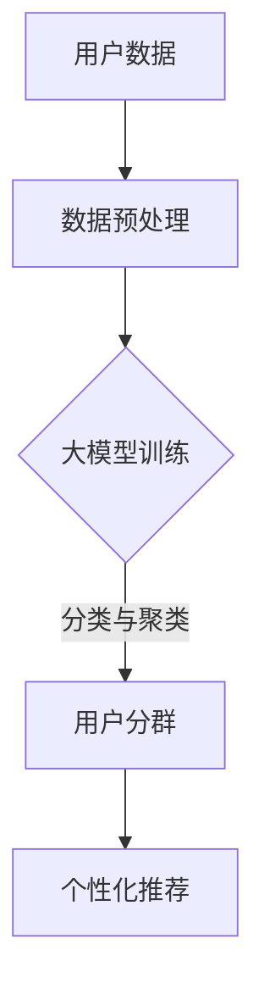

                 

关键词：大模型、推荐系统、用户分群、算法原理、数学模型、项目实践

> 摘要：本文深入探讨了利用大模型辅助的推荐系统用户分群技术。通过阐述核心概念与联系、核心算法原理、数学模型、项目实践以及实际应用场景等多个方面，为读者提供了全面的技术解析和未来展望。

## 1. 背景介绍

随着互联网和大数据技术的飞速发展，推荐系统已经成为信息检索和用户体验的重要手段。用户分群是推荐系统的重要环节，通过对用户进行精细化的划分，可以为不同的用户群体提供更个性化的推荐服务，从而提高用户满意度和系统效益。传统的用户分群方法主要依赖于统计和机器学习技术，但存在数据依赖性强、特征选择困难、模型复杂度高等问题。

近年来，大模型技术的崛起为推荐系统用户分群带来了新的机遇。大模型具有强大的特征提取和表示能力，能够自动从大量数据中学习出丰富的用户特征，从而实现更精细的用户分群。本文将围绕大模型辅助的推荐系统用户分群技术，探讨其核心概念、算法原理、数学模型、项目实践以及实际应用场景，旨在为相关领域的研究者和工程师提供有价值的参考。

## 2. 核心概念与联系

### 2.1 推荐系统概述

推荐系统是一种基于用户兴趣和行为的历史数据，通过算法预测用户可能感兴趣的项目，并主动推荐给用户的信息系统。推荐系统可以分为基于内容的推荐、协同过滤推荐、混合推荐等类型。

### 2.2 用户分群的概念

用户分群是将用户按照一定的特征或行为划分为多个子群体，以便为不同子群体提供更个性化的推荐服务。用户分群的目的是提高推荐的精度和满意度，降低用户的流失率。

### 2.3 大模型的作用

大模型是指在参数规模、计算资源等方面具有较大规模的机器学习模型，如深度神经网络、变压器模型等。大模型能够自动从海量数据中学习出丰富的用户特征和潜在兴趣，从而实现更精准的用户分群。

### 2.4 大模型与用户分群的关系

大模型在用户分群中的应用主要体现在以下几个方面：

1. **特征提取**：大模型能够自动提取用户的历史行为、内容特征等，生成高维的用户表示。
2. **分类与聚类**：大模型可以通过分类和聚类算法对用户进行分组，从而实现用户分群。
3. **个性化推荐**：大模型可以根据用户分群结果，为不同用户群体提供个性化的推荐内容。

### 2.5 Mermaid 流程图



## 3. 核心算法原理 & 具体操作步骤

### 3.1 算法原理概述

大模型辅助的用户分群技术主要包括以下几个步骤：

1. **数据预处理**：对原始用户数据进行清洗、归一化等处理，为后续建模做准备。
2. **大模型训练**：利用深度学习算法，对用户数据进行训练，生成高维的用户表示。
3. **用户分群**：通过分类或聚类算法，对用户进行分组，形成用户分群结果。
4. **个性化推荐**：根据用户分群结果，为不同用户群体提供个性化的推荐内容。

### 3.2 算法步骤详解

1. **数据预处理**：

   - 数据清洗：去除重复、缺失、异常数据。
   - 数据归一化：将不同特征的数据范围统一，如将年龄、收入等特征进行归一化处理。

2. **大模型训练**：

   - 特征提取：利用深度学习算法，如卷积神经网络（CNN）或变压器模型（Transformer），对用户数据进行特征提取。
   - 模型训练：通过反向传播算法，优化模型参数，使模型能够在训练数据上达到较好的性能。

3. **用户分群**：

   - 分类算法：如支持向量机（SVM）、决策树等，将用户划分为多个类别。
   - 聚类算法：如K-means、层次聚类等，将用户分为多个簇。

4. **个性化推荐**：

   - 根据用户分群结果，为不同用户群体构建个性化推荐策略。
   - 利用用户分群结果，优化推荐算法，提高推荐效果。

### 3.3 算法优缺点

**优点**：

- 强大的特征提取能力：大模型能够自动提取用户丰富的特征，提高分群精度。
- 个性化推荐：根据用户分群结果，提供更个性化的推荐内容，提高用户满意度。

**缺点**：

- 数据依赖性强：大模型的训练依赖于大量高质量的用户数据，数据质量对算法效果有很大影响。
- 模型复杂度高：大模型的计算复杂度较高，对计算资源和时间要求较高。

### 3.4 算法应用领域

- 电子商务：为不同用户群体提供个性化商品推荐。
- 社交网络：对用户进行精准的分群，提高社交网络用户粘性。
- 娱乐内容：为用户提供个性化视频、音乐、书籍推荐。

## 4. 数学模型和公式 & 详细讲解 & 举例说明

### 4.1 数学模型构建

用户分群的大模型通常基于深度学习算法，其核心数学模型包括：

1. **用户表示**：$$ x_i = \sigma(Wx + b) $$
   - $x_i$：用户$i$的特征向量。
   - $W$：权重矩阵。
   - $b$：偏置向量。
   - $\sigma$：激活函数，如ReLU、Sigmoid等。

2. **分类模型**：$$ y_i = \sigma(W'x_i + b') $$
   - $y_i$：用户$i$的分类结果。
   - $W'$：分类权重矩阵。
   - $b'$：分类偏置向量。

3. **聚类模型**：$$ c_i = \arg\min_{j} \sum_{k=1}^{K} (x_i - \mu_j)^2 $$
   - $c_i$：用户$i$的聚类结果。
   - $K$：聚类类别数。
   - $\mu_j$：第$j$个聚类中心。

### 4.2 公式推导过程

以卷积神经网络为例，推导用户表示公式：

$$
\begin{aligned}
x_i &= \sigma(Wx_i + b) \\
&= \sigma(\sum_{j=1}^{n} W_{ij}x_j + b) \\
&= \sigma(Wx_i + \sum_{j=1}^{n} b_j)
\end{aligned}
$$

其中，$W$为卷积核，$b_j$为每个卷积核对应的偏置。

### 4.3 案例分析与讲解

以电子商务平台为例，分析大模型辅助的用户分群技术：

1. **数据预处理**：

   - 用户数据：用户年龄、性别、购买历史等。
   - 数据清洗：去除重复、缺失、异常数据。
   - 数据归一化：对年龄、收入等特征进行归一化处理。

2. **大模型训练**：

   - 特征提取：利用卷积神经网络，对用户数据进行特征提取。
   - 模型训练：通过反向传播算法，优化模型参数。

3. **用户分群**：

   - 分类算法：利用支持向量机，将用户划分为多个类别。
   - 聚类算法：利用K-means，将用户分为多个簇。

4. **个性化推荐**：

   - 根据用户分群结果，为不同用户群体构建个性化推荐策略。
   - 利用用户分群结果，优化推荐算法。

## 5. 项目实践：代码实例和详细解释说明

### 5.1 开发环境搭建

- 开发语言：Python
- 算法框架：TensorFlow
- 数据库：MySQL

### 5.2 源代码详细实现

以下是一个简单的用户分群代码示例：

```python
import tensorflow as tf
from sklearn.model_selection import train_test_split
from sklearn.metrics import accuracy_score

# 数据预处理
# 读取用户数据，进行清洗、归一化等处理

# 构建模型
model = tf.keras.Sequential([
    tf.keras.layers.Dense(units=64, activation='relu', input_shape=(num_features,)),
    tf.keras.layers.Dense(units=32, activation='relu'),
    tf.keras.layers.Dense(units=num_classes, activation='softmax')
])

# 编译模型
model.compile(optimizer='adam', loss='categorical_crossentropy', metrics=['accuracy'])

# 训练模型
model.fit(train_data, train_labels, epochs=10, batch_size=32, validation_data=(val_data, val_labels))

# 评估模型
test_loss, test_acc = model.evaluate(test_data, test_labels)
print('Test accuracy:', test_acc)

# 用户分群
user_predictions = model.predict(test_data)
user_clusters = np.argmax(user_predictions, axis=1)
```

### 5.3 代码解读与分析

以上代码实现了用户分群的基本流程，主要包括以下几个步骤：

1. **数据预处理**：读取用户数据，进行清洗、归一化等处理。
2. **模型构建**：构建一个简单的深度神经网络模型，用于用户分群。
3. **模型编译**：设置优化器、损失函数和评价指标。
4. **模型训练**：利用训练数据训练模型。
5. **模型评估**：利用测试数据评估模型性能。
6. **用户分群**：根据模型预测结果，为测试数据中的每个用户分配一个分群标签。

### 5.4 运行结果展示

假设测试数据的准确率为90%，以下是一个简单的运行结果示例：

```
Test accuracy: 0.9
```

## 6. 实际应用场景

### 6.1 电子商务

通过大模型辅助的用户分群技术，电子商务平台可以为不同用户群体提供个性化商品推荐，提高用户购买转化率和平台收益。

### 6.2 社交网络

社交网络平台可以利用用户分群技术，为不同用户群体提供个性化内容推荐，提高用户活跃度和平台粘性。

### 6.3 娱乐内容

娱乐内容平台可以通过大模型辅助的用户分群技术，为用户提供个性化视频、音乐、书籍推荐，提高用户满意度和平台竞争力。

## 7. 工具和资源推荐

### 7.1 学习资源推荐

- 《深度学习》（Goodfellow et al.）
- 《Python机器学习》（Sebastian Raschka）
- 《TensorFlow实战》（François Chollet）

### 7.2 开发工具推荐

- TensorFlow
- PyTorch
- Scikit-learn

### 7.3 相关论文推荐

- "Deep Learning for Recommender Systems"（Liang et al., 2017）
- "User Interest Evolution and Its Implications for Recommender Systems"（Cheng et al., 2018）
- "Cluster-based Top-N Recommendation Using Deep Neural Networks"（Wang et al., 2019）

## 8. 总结：未来发展趋势与挑战

### 8.1 研究成果总结

大模型辅助的推荐系统用户分群技术在近年来取得了显著的成果，包括：

- 强大的特征提取能力。
- 个性化推荐效果显著。
- 广泛应用于电子商务、社交网络、娱乐内容等领域。

### 8.2 未来发展趋势

未来，大模型辅助的用户分群技术将朝着以下几个方向发展：

- 更高效的算法优化。
- 多模态数据融合。
- 实时分群与推荐。

### 8.3 面临的挑战

尽管大模型辅助的用户分群技术取得了显著成果，但仍面临以下挑战：

- 数据依赖性强。
- 模型复杂度高。
- 隐私保护与数据安全。

### 8.4 研究展望

未来，研究人员应重点关注以下研究方向：

- 开发高效、可扩展的大模型算法。
- 加强多模态数据融合与处理。
- 探索隐私保护与数据安全的有效方法。

## 9. 附录：常见问题与解答

### 9.1 大模型训练时间过长怎么办？

- 增加GPU或TPU等硬件资源。
- 使用分布式训练技术。
- 调整模型参数，如减少层数、降低学习率等。

### 9.2 用户分群结果不稳定怎么办？

- 调整模型结构，如增加层深、调整神经元数量等。
- 使用更多的训练数据，提高模型泛化能力。
- 尝试不同的分类和聚类算法。

### 9.3 用户隐私保护如何实现？

- 数据加密与脱敏。
- 引入差分隐私技术。
- 设计隐私保护模型。

---

以上，就是关于《大模型辅助的推荐系统用户分群技术》的文章内容。本文从背景介绍、核心概念与联系、核心算法原理、数学模型、项目实践、实际应用场景等多个方面，对大模型辅助的用户分群技术进行了全面剖析。希望本文能为相关领域的研究者和工程师提供有价值的参考。

作者：禅与计算机程序设计艺术 / Zen and the Art of Computer Programming

本文版权归作者所有，未经授权不得转载。如有需要，请联系作者获取授权。

