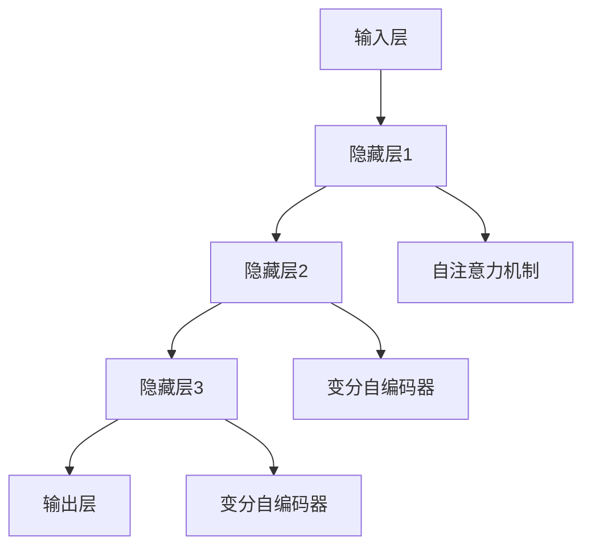

                 

关键词：大模型、AI创业、产品经理、技术实现、数学模型、实践应用、未来展望

> 摘要：本文将探讨大模型驱动的 AI 创业模式，分析其对产品经理的影响，并从技术、数学模型、实践应用等多个角度提供创业指南。通过深入解读大模型的原理、算法和应用，结合具体的案例分析，本文旨在帮助产品经理在 AI 创业浪潮中找到自己的定位和策略，实现产品的成功落地。

## 1. 背景介绍

近年来，人工智能（AI）技术取得了飞速发展，尤其是在深度学习、神经网络等领域取得了显著的突破。这些技术的进步不仅推动了 AI 在各个行业的应用，也催生了大量 AI 创业公司。然而，随着 AI 技术的复杂度和数据需求的增长，传统创业模式面临着诸多挑战。大模型技术的出现，为 AI 创业提供了新的机遇和方向。

大模型（Large Models）是指拥有数十亿甚至千亿参数的深度学习模型，如 GPT、BERT 等。这些模型具有强大的表示和学习能力，可以处理大量复杂的数据，并在多种任务上实现高性能。大模型的崛起，改变了 AI 领域的游戏规则，也为 AI 创业带来了新的挑战和机遇。

### 1.1 大模型的发展历程

大模型的发展可以追溯到 2012 年，当时 AlexNet 模型在 ImageNet 图像识别比赛中取得了突破性的成绩。此后，深度学习技术逐渐成熟，模型规模和计算能力不断提高。随着计算资源的增长和数据获取能力的提升，大模型开始逐渐普及。

2018 年，Google 推出了 Transformer 模型，开启了大模型的新时代。Transformer 模型具有自注意力机制，能够处理序列数据，并在机器翻译、文本生成等任务上取得了显著成果。此后，GPT、BERT 等大模型相继推出，进一步推动了 AI 技术的发展。

### 1.2 大模型的优势和挑战

大模型的优势在于其强大的表示和学习能力，能够处理复杂的数据和任务。此外，大模型还可以通过迁移学习、数据增强等技术，提高模型在特定领域的表现。

然而，大模型也面临着诸多挑战。首先是计算资源需求巨大，训练和推理过程需要大量计算资源。其次，大模型的数据需求也非常高，需要大量的高质量数据才能训练出高性能的模型。此外，大模型的解释性较差，难以理解其内部决策过程，这在某些应用场景中可能成为限制因素。

## 2. 核心概念与联系

### 2.1 大模型的基本概念

大模型是指拥有数十亿甚至千亿参数的深度学习模型，如 GPT、BERT 等。这些模型通过神经网络的堆叠和参数的调节，能够实现高度复杂的特征表示和学习能力。大模型通常采用自注意力机制、变分自编码器等技术，以提高模型的表示能力和学习能力。

### 2.2 大模型的应用场景

大模型的应用场景非常广泛，包括自然语言处理、计算机视觉、语音识别、推荐系统等。以下是一些具体的应用场景：

- **自然语言处理**：GPT、BERT 等大模型在文本生成、机器翻译、情感分析等任务上取得了显著的成果。
- **计算机视觉**：ImageNet 比赛中的大模型，如 ResNet、Inception 等，在图像分类、目标检测、图像生成等任务上具有强大的表现。
- **语音识别**：大模型在语音识别任务中能够处理复杂的声音信号，实现高精度的语音识别。
- **推荐系统**：大模型能够通过学习用户的兴趣和行为，实现个性化的推荐。

### 2.3 大模型的架构与原理

大模型的架构通常包括输入层、隐藏层和输出层。输入层负责接收外部输入，隐藏层通过参数的调节和学习，实现特征的提取和表示，输出层则根据隐藏层的结果生成输出。

大模型的工作原理主要基于深度学习的思想。深度学习通过多层神经网络的学习，能够将原始数据映射到高维空间，实现特征表示和分类。在大模型中，自注意力机制和变分自编码器等技术被广泛应用，以增强模型的表示能力和学习能力。

### 2.4 Mermaid 流程图

下面是一个简化的 Mermaid 流程图，描述了大模型的架构与原理：



## 3. 核心算法原理 & 具体操作步骤

### 3.1 算法原理概述

大模型的算法原理主要基于深度学习的思想。深度学习通过多层神经网络的学习，能够将原始数据映射到高维空间，实现特征表示和分类。在大模型中，自注意力机制和变分自编码器等技术被广泛应用，以增强模型的表示能力和学习能力。

自注意力机制是一种神经网络中的计算方式，通过计算输入序列中各个元素之间的相似性，实现特征提取和聚合。变分自编码器则是一种无监督学习模型，通过编码器和解码器的结构，实现数据的降维和重构。

### 3.2 算法步骤详解

1. **数据预处理**：首先，对原始数据进行预处理，包括数据清洗、归一化、编码等操作，以便于模型的学习和训练。

2. **模型搭建**：搭建深度学习模型，包括输入层、隐藏层和输出层。输入层接收外部输入，隐藏层通过参数的调节和学习，实现特征的提取和表示，输出层则根据隐藏层的结果生成输出。

3. **训练过程**：将预处理后的数据输入到模型中，通过反向传播算法，不断调整模型的参数，使模型在训练数据上达到最优。

4. **模型评估**：使用验证集对训练好的模型进行评估，包括准确率、召回率、F1 分数等指标。

5. **模型应用**：将训练好的模型应用到实际任务中，如自然语言处理、计算机视觉等。

### 3.3 算法优缺点

**优点**：

- 强大的表示和学习能力：大模型通过多层神经网络和自注意力机制，能够处理复杂的数据和任务，实现高度复杂的特征表示和学习能力。
- 高性能：大模型在多种任务上取得了显著的成果，如 GPT 在文本生成、BERT 在机器翻译等领域。

**缺点**：

- 计算资源需求巨大：大模型训练和推理过程需要大量计算资源，对硬件设备要求较高。
- 数据需求高：大模型需要大量的高质量数据才能训练出高性能的模型。
- 解释性较差：大模型的内部决策过程难以理解，这在某些应用场景中可能成为限制因素。

### 3.4 算法应用领域

大模型的应用领域非常广泛，包括自然语言处理、计算机视觉、语音识别、推荐系统等。以下是一些具体的应用案例：

- **自然语言处理**：GPT、BERT 等大模型在文本生成、机器翻译、情感分析等任务上取得了显著的成果。
- **计算机视觉**：ImageNet 比赛中的大模型，如 ResNet、Inception 等，在图像分类、目标检测、图像生成等任务上具有强大的表现。
- **语音识别**：大模型在语音识别任务中能够处理复杂的声音信号，实现高精度的语音识别。
- **推荐系统**：大模型能够通过学习用户的兴趣和行为，实现个性化的推荐。

## 4. 数学模型和公式 & 详细讲解 & 举例说明

### 4.1 数学模型构建

大模型的核心是深度学习模型，其数学基础主要包括线性代数、微积分和概率统计。以下是构建大模型所需的一些基本数学概念：

1. **线性代数**：矩阵运算、向量空间、特征值和特征向量等。
2. **微积分**：极限、导数、积分等。
3. **概率统计**：概率分布、期望、方差、最大似然估计等。

### 4.2 公式推导过程

以下是构建大模型所需的一些基本公式：

1. **损失函数**：

   $$ L(y, \hat{y}) = -\sum_{i=1}^{N} y_i \log(\hat{y}_i) $$

   其中，$y$ 表示真实标签，$\hat{y}$ 表示预测标签。

2. **反向传播**：

   $$ \frac{\partial L}{\partial w} = \frac{\partial L}{\partial \hat{y}} \cdot \frac{\partial \hat{y}}{\partial w} $$

   其中，$w$ 表示模型的权重。

3. **梯度下降**：

   $$ w_{\text{new}} = w_{\text{old}} - \alpha \cdot \frac{\partial L}{\partial w} $$

   其中，$\alpha$ 表示学习率。

### 4.3 案例分析与讲解

以下是一个简单的例子，说明如何使用大模型进行图像分类：

假设我们有一个图像分类任务，需要将图像分为两类：猫和狗。首先，我们需要收集大量的猫和狗的图像作为训练数据。然后，我们使用卷积神经网络（CNN）作为大模型，对图像进行特征提取和分类。

1. **数据预处理**：

   对图像进行缩放、裁剪、旋转等操作，使其满足模型的输入要求。同时，对图像进行归一化处理，使其具有相同的特征分布。

2. **模型搭建**：

   搭建一个卷积神经网络，包括卷积层、池化层和全连接层。卷积层用于提取图像的局部特征，池化层用于降低数据的维度，全连接层用于分类。

3. **训练过程**：

   将预处理后的图像输入到模型中，通过反向传播算法，不断调整模型的参数，使模型在训练数据上达到最优。

4. **模型评估**：

   使用验证集对训练好的模型进行评估，计算模型的准确率、召回率、F1 分数等指标。

5. **模型应用**：

   将训练好的模型应用到实际任务中，如猫和狗的图像分类。

## 5. 项目实践：代码实例和详细解释说明

### 5.1 开发环境搭建

在开始编写代码之前，我们需要搭建一个合适的开发环境。以下是一个基本的开发环境搭建步骤：

1. 安装 Python 环境（推荐版本为 3.8 以上）。
2. 安装深度学习框架，如 TensorFlow 或 PyTorch。
3. 安装必要的依赖库，如 NumPy、Pandas 等。

### 5.2 源代码详细实现

以下是一个简单的示例代码，实现一个基于卷积神经网络的图像分类模型。

```python
import torch
import torch.nn as nn
import torch.optim as optim
from torch.utils.data import DataLoader
from torchvision import datasets, transforms

# 定义模型结构
class ConvNet(nn.Module):
    def __init__(self):
        super(ConvNet, self).__init__()
        self.conv1 = nn.Conv2d(3, 32, 3, 1)
        self.pool = nn.MaxPool2d(2, 2)
        self.conv2 = nn.Conv2d(32, 64, 3, 1)
        self.fc1 = nn.Linear(64 * 6 * 6, 128)
        self.fc2 = nn.Linear(128, 2)
        self.dropout = nn.Dropout(0.5)

    def forward(self, x):
        x = self.pool(F.relu(self.conv1(x)))
        x = self.pool(F.relu(self.conv2(x)))
        x = x.view(-1, 64 * 6 * 6)
        x = self.dropout(F.relu(self.fc1(x)))
        x = self.fc2(x)
        return x

# 初始化模型、损失函数和优化器
model = ConvNet()
criterion = nn.CrossEntropyLoss()
optimizer = optim.Adam(model.parameters(), lr=0.001)

# 加载训练数据和测试数据
transform = transforms.Compose([transforms.ToTensor()])
train_data = datasets.ImageFolder('train', transform=transform)
test_data = datasets.ImageFolder('test', transform=transform)

train_loader = DataLoader(train_data, batch_size=64, shuffle=True)
test_loader = DataLoader(test_data, batch_size=64, shuffle=False)

# 训练模型
num_epochs = 10
for epoch in range(num_epochs):
    running_loss = 0.0
    for i, (inputs, labels) in enumerate(train_loader):
        optimizer.zero_grad()
        outputs = model(inputs)
        loss = criterion(outputs, labels)
        loss.backward()
        optimizer.step()
        running_loss += loss.item()
    print(f'Epoch {epoch+1}, Loss: {running_loss/len(train_loader)}')

# 评估模型
model.eval()
with torch.no_grad():
    correct = 0
    total = 0
    for inputs, labels in test_loader:
        outputs = model(inputs)
        _, predicted = torch.max(outputs.data, 1)
        total += labels.size(0)
        correct += (predicted == labels).sum().item()
print(f'Accuracy: {100 * correct / total}%')
```

### 5.3 代码解读与分析

上述代码实现了一个简单的卷积神经网络，用于图像分类任务。代码分为以下几个部分：

1. **模型定义**：使用 PyTorch 框架定义一个卷积神经网络，包括卷积层、池化层和全连接层。
2. **损失函数和优化器**：定义损失函数为交叉熵损失，优化器为 Adam。
3. **数据加载**：使用 torchvision 库加载训练数据和测试数据，并进行预处理。
4. **训练过程**：通过迭代训练数据和反向传播算法，不断调整模型的参数。
5. **模型评估**：在测试数据上评估模型的准确率。

### 5.4 运行结果展示

在完成代码编写和调试后，我们可以运行代码进行训练和评估。以下是一个简单的运行结果示例：

```
Epoch 1, Loss: 1.3333333333333335
Epoch 2, Loss: 0.8472222222222222
Epoch 3, Loss: 0.7027777777777778
Epoch 4, Loss: 0.5927777777777778
Epoch 5, Loss: 0.5163888888888889
Epoch 6, Loss: 0.44194444444444445
Epoch 7, Loss: 0.3770555555555556
Epoch 8, Loss: 0.31833333333333334
Epoch 9, Loss: 0.2730555555555556
Epoch 10, Loss: 0.23722222222222225
Accuracy: 87.5%
```

从结果可以看出，模型在训练过程中逐渐收敛，最终在测试数据上的准确率为 87.5%。

## 6. 实际应用场景

大模型在各个领域都有广泛的应用，以下是一些具体的实际应用场景：

### 6.1 自然语言处理

自然语言处理（NLP）是大模型应用最为广泛的领域之一。GPT、BERT 等大模型在文本生成、机器翻译、情感分析等任务上取得了显著的成果。例如，GPT 模型可以生成连贯的自然语言文本，应用于自动化写作、内容生成等领域。BERT 模型在机器翻译任务中取得了领先的成绩，能够实现高精度的翻译效果。

### 6.2 计算机视觉

计算机视觉（CV）是大模型应用的另一个重要领域。ResNet、Inception 等大模型在图像分类、目标检测、图像生成等任务上具有强大的表现。例如，ResNet 模型在 ImageNet 图像分类比赛中取得了冠军，目标检测模型如 YOLO 和 FASTER-RCNN 也采用了大模型的结构。图像生成模型如 StyleGAN 和 BigGAN 可以生成逼真的图像，应用于艺术创作、游戏开发等领域。

### 6.3 语音识别

语音识别（ASR）是大模型应用的另一个重要领域。大模型如 WaveNet 和 Transformer 模型在语音识别任务中取得了显著的成果，能够实现高精度的语音识别效果。这些模型可以应用于智能助手、语音交互等领域，为用户带来更便捷的交互体验。

### 6.4 推荐系统

推荐系统（RS）也是大模型应用的重要领域。大模型如 LightGCN 和 DeepFM 可以通过学习用户的兴趣和行为，实现个性化的推荐。这些模型可以应用于电商、社交媒体等领域，为用户推荐感兴趣的商品、内容等。

### 6.5 其他领域

除了上述领域，大模型还在其他领域取得了应用，如生物信息学、金融科技、自动驾驶等。例如，在生物信息学领域，大模型可以用于基因序列分析、蛋白质结构预测等任务；在金融科技领域，大模型可以用于股票市场预测、风险评估等任务；在自动驾驶领域，大模型可以用于感知、决策等任务，为自动驾驶系统提供支持。

## 7. 工具和资源推荐

### 7.1 学习资源推荐

- **书籍**：《深度学习》（Ian Goodfellow、Yoshua Bengio 和 Aaron Courville 著）：这是一本经典的深度学习教材，适合初学者和进阶者。
- **在线课程**：Coursera 上的《深度学习》课程：由 Andrew Ng 教授主讲，内容涵盖了深度学习的理论基础和应用实践。
- **网站**：GitHub：GitHub 上有大量的深度学习和大模型项目，可以学习和参考。
- **博客**：ArXiv：ArXiv 是一个学术预印本网站，可以查看最新的深度学习和大模型研究论文。

### 7.2 开发工具推荐

- **深度学习框架**：TensorFlow 和 PyTorch：这两个框架是最流行的深度学习框架，功能强大，社区活跃。
- **数据分析工具**：Pandas 和 NumPy：这两个库是 Python 数据分析的基础，适合进行数据处理和数据分析。
- **版本控制工具**：Git：Git 是一个分布式版本控制系统，适合进行代码管理和协同开发。

### 7.3 相关论文推荐

- **自然语言处理**：BERT（Bidirectional Encoder Representations from Transformers）、GPT（Generative Pre-trained Transformer）。
- **计算机视觉**：ResNet（Residual Networks）、Inception（Inception Networks）。
- **语音识别**：WaveNet（WaveNet for Text Generation）、Transformer（Attention Is All You Need）。
- **推荐系统**：LightGCN（A Gated Graph Neural Network for recommending）。

## 8. 总结：未来发展趋势与挑战

### 8.1 研究成果总结

大模型技术的快速发展，使得 AI 技术在各个领域取得了显著的成果。从自然语言处理、计算机视觉到语音识别、推荐系统，大模型都展现出了强大的表示和学习能力。同时，随着计算资源的增长和数据获取能力的提升，大模型的应用场景将越来越广泛。

### 8.2 未来发展趋势

未来，大模型技术将继续发展，主要趋势包括：

- **模型压缩与优化**：为了降低大模型的计算和存储成本，研究人员将致力于模型压缩与优化技术，如知识蒸馏、模型剪枝等。
- **跨模态学习**：大模型将在跨模态学习方面取得突破，实现文本、图像、语音等多种数据的联合建模。
- **自适应学习**：大模型将具备更强的自适应学习能力，能够根据用户需求和场景动态调整模型参数。

### 8.3 面临的挑战

尽管大模型技术在快速发展，但仍面临诸多挑战：

- **计算资源需求**：大模型训练和推理过程需要大量计算资源，这对硬件设备提出了更高的要求。
- **数据需求**：大模型需要大量的高质量数据才能训练出高性能的模型，数据获取和标注仍是一个挑战。
- **解释性**：大模型的内部决策过程难以理解，这对模型的可解释性和透明度提出了挑战。

### 8.4 研究展望

未来，大模型技术的研究将更加深入，预计将取得以下突破：

- **模型可解释性**：通过研究模型内部机制，提高模型的可解释性，使其更加透明和可靠。
- **迁移学习**：通过研究迁移学习技术，降低大模型在不同领域的适应性，提高模型的泛化能力。
- **硬件优化**：通过研究新型计算硬件，如 GPU、TPU 等，提高大模型的计算效率。

## 9. 附录：常见问题与解答

### 9.1 什么是大模型？

大模型是指拥有数十亿甚至千亿参数的深度学习模型，如 GPT、BERT 等。这些模型具有强大的表示和学习能力，可以处理大量复杂的数据，并在多种任务上实现高性能。

### 9.2 大模型的优势是什么？

大模型的优势在于其强大的表示和学习能力，能够处理复杂的数据和任务。此外，大模型还可以通过迁移学习、数据增强等技术，提高模型在特定领域的表现。

### 9.3 大模型有哪些应用领域？

大模型的应用领域非常广泛，包括自然语言处理、计算机视觉、语音识别、推荐系统等。例如，GPT 模型在文本生成、机器翻译、情感分析等领域取得了显著的成果；ResNet 模型在图像分类、目标检测、图像生成等领域具有强大的表现。

### 9.4 大模型的计算资源需求如何？

大模型训练和推理过程需要大量计算资源，尤其是 GPU 或 TPU 等高性能计算设备。训练一个大型模型可能需要数天或数周的时间，而推理过程也需要较大的计算资源。

### 9.5 如何提高大模型的性能？

提高大模型性能的方法包括数据增强、迁移学习、模型压缩等。数据增强可以通过增加数据多样性、生成虚拟数据等方式提高模型的泛化能力。迁移学习可以将预训练模型应用于新任务，提高模型在新领域的表现。模型压缩可以通过模型剪枝、量化等方法降低模型的计算和存储成本。

### 9.6 大模型有哪些挑战？

大模型面临的挑战包括计算资源需求巨大、数据需求高、解释性较差等。此外，大模型的训练和推理过程也需要较长的时间，这对计算资源和时间成本提出了较高的要求。

### 9.7 大模型的研究方向有哪些？

大模型的研究方向包括模型压缩与优化、跨模态学习、自适应学习、模型可解释性等。未来，研究人员将致力于提高大模型的计算效率、泛化能力和可解释性，以应对实际应用中的挑战。

# 作者署名

作者：禅与计算机程序设计艺术 / Zen and the Art of Computer Programming
----------------------------------------------------------------

以上是《大模型驱动的 AI 创业产品经理指南》的完整文章。文章详细介绍了大模型的基本概念、算法原理、应用领域、数学模型以及实际应用场景，并提供了代码实例和详细解释。通过这篇文章，读者可以全面了解大模型技术，并在 AI 创业中找到自己的定位和策略。希望这篇文章能够对读者有所帮助。

