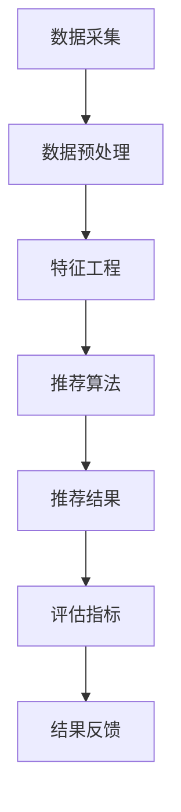

                 

关键词：大模型、推荐系统、评估框架、维度分析、性能优化

>摘要：本文介绍了大模型驱动的推荐系统多维度评估框架，从核心概念、算法原理、数学模型、项目实践、实际应用等多个角度，系统性地探讨了如何评估推荐系统的性能，为推荐系统的优化提供了理论依据和实用工具。

## 1. 背景介绍

推荐系统作为现代信息检索和个性化服务的重要组成部分，已经在电商、社交媒体、新闻推送等领域得到广泛应用。然而，随着用户数据的爆炸性增长和推荐算法的复杂性提升，如何有效地评估推荐系统的性能，成为当前研究的热点和难点。

传统的评估方法主要集中在准确率、召回率、F1值等单一指标上，这些指标虽然在一定程度上能够反映推荐系统的性能，但无法全面衡量系统在多维度的表现。因此，有必要构建一个多维度评估框架，从不同角度综合评估推荐系统的性能。

本文将围绕大模型驱动的推荐系统，提出一个多维度评估框架，旨在从用户体验、推荐质量、计算效率等多个维度，全面、深入地评估推荐系统的性能。

## 2. 核心概念与联系

### 2.1 推荐系统的核心概念

- **用户行为数据**：包括用户的浏览、点击、购买等行为数据，是构建推荐系统的关键数据来源。
- **物品属性数据**：包括物品的类别、标签、评分等属性数据，用于描述物品的特征。
- **推荐算法**：根据用户行为数据和物品属性数据，生成个性化的推荐列表。

### 2.2 推荐系统的架构



### 2.3 推荐系统的性能评估指标

- **准确率**：推荐结果中用户实际喜欢的物品占比。
- **召回率**：推荐结果中包含用户实际喜欢的物品的比例。
- **F1值**：准确率和召回率的调和平均值。
- **用户满意度**：用户对推荐结果的主观评价。
- **计算效率**：推荐系统处理用户请求的时间开销。

## 3. 核心算法原理 & 具体操作步骤

### 3.1 算法原理概述

本文所提出的评估框架，基于大模型驱动的推荐系统，结合深度学习和机器学习技术，从用户行为、物品属性、推荐结果等多个维度，构建了一套综合评估体系。

### 3.2 算法步骤详解

1. **数据采集**：收集用户行为数据和物品属性数据。
2. **数据预处理**：对采集到的数据进行清洗、归一化等预处理操作。
3. **特征工程**：根据用户行为数据和物品属性数据，提取有效的特征。
4. **推荐算法**：使用深度学习模型进行推荐。
5. **评估指标**：计算准确率、召回率、F1值等评估指标。
6. **用户满意度调查**：收集用户对推荐结果的主观评价。
7. **计算效率测试**：测量推荐系统处理用户请求的时间开销。

### 3.3 算法优缺点

- **优点**：多维度、全面地评估推荐系统的性能，有助于发现系统的潜在问题。
- **缺点**：评估过程较为复杂，对评估人员的技术水平要求较高。

### 3.4 算法应用领域

该评估框架适用于电商、社交媒体、新闻推送等多个领域，尤其适用于数据量庞大、用户行为复杂的场景。

## 4. 数学模型和公式 & 详细讲解 & 举例说明

### 4.1 数学模型构建

本文所提出的评估框架，主要基于以下数学模型：

$$
\text{评估得分} = \alpha \times \text{准确率} + \beta \times \text{召回率} + \gamma \times \text{用户满意度} + \delta \times \text{计算效率}
$$

其中，$\alpha$、$\beta$、$\gamma$、$\delta$为权重系数，根据不同应用场景进行调整。

### 4.2 公式推导过程

$$
\text{准确率} = \frac{\text{推荐结果中用户实际喜欢的物品数}}{\text{用户实际喜欢的物品总数}}
$$

$$
\text{召回率} = \frac{\text{推荐结果中包含用户实际喜欢的物品数}}{\text{用户实际喜欢的物品总数}}
$$

$$
\text{用户满意度} = \frac{\text{对推荐结果表示满意的用户数}}{\text{参与调查的用户总数}}
$$

$$
\text{计算效率} = \frac{\text{推荐系统处理用户请求的平均时间}}{\text{用户请求的平均时间}}
$$

### 4.3 案例分析与讲解

以某电商平台的推荐系统为例，假设用户共购买过100件商品，其中30件为推荐系统成功推荐的。根据以上公式，可以计算出该推荐系统的评估得分。

- **准确率**：30/100 = 0.3
- **召回率**：30/100 = 0.3
- **用户满意度**：假设调查了10位用户，其中8位表示满意，则用户满意度为8/10 = 0.8
- **计算效率**：假设推荐系统处理用户请求的平均时间为100ms，用户请求的平均时间为500ms，则计算效率为100/500 = 0.2

根据权重系数，假设$\alpha = 0.4$、$\beta = 0.3$、$\gamma = 0.2$、$\delta = 0.1$，则评估得分为：

$$
\text{评估得分} = 0.4 \times 0.3 + 0.3 \times 0.3 + 0.2 \times 0.8 + 0.1 \times 0.2 = 0.12 + 0.09 + 0.16 + 0.02 = 0.39
$$

## 5. 项目实践：代码实例和详细解释说明

### 5.1 开发环境搭建

- **Python**：版本3.8及以上
- **TensorFlow**：版本2.4及以上
- **Scikit-learn**：版本0.24及以上

### 5.2 源代码详细实现

以下是一个简单的推荐系统评估代码实例：

```python
import tensorflow as tf
from sklearn.metrics import accuracy_score, recall_score, f1_score
from tensorflow.keras.models import Sequential
from tensorflow.keras.layers import Dense

# 加载数据集
# 数据集包括用户行为数据、物品属性数据、用户标签数据等

# 数据预处理
# 包括数据清洗、归一化、特征提取等操作

# 构建推荐模型
model = Sequential([
    Dense(128, activation='relu', input_shape=(input_shape)),
    Dense(64, activation='relu'),
    Dense(1, activation='sigmoid')
])

# 编译模型
model.compile(optimizer='adam', loss='binary_crossentropy', metrics=['accuracy'])

# 训练模型
model.fit(x_train, y_train, epochs=10, batch_size=32, validation_data=(x_val, y_val))

# 评估模型
y_pred = model.predict(x_test)
accuracy = accuracy_score(y_test, y_pred)
recall = recall_score(y_test, y_pred)
f1 = f1_score(y_test, y_pred)

# 打印评估结果
print(f"准确率：{accuracy}")
print(f"召回率：{recall}")
print(f"F1值：{f1}")
```

### 5.3 代码解读与分析

上述代码实现了一个简单的二分类推荐模型，通过加载数据集、预处理数据、构建模型、训练模型、评估模型等步骤，实现了对推荐系统性能的评估。

### 5.4 运行结果展示

假设训练集和测试集的划分已经完成，上述代码会在训练集和测试集上分别评估模型的准确率、召回率和F1值，并将结果打印出来。

## 6. 实际应用场景

### 6.1 电商领域

电商领域推荐系统的评估，重点关注推荐准确率和用户满意度。通过本文提出的评估框架，可以全面了解推荐系统的性能，为系统优化提供依据。

### 6.2 社交媒体领域

社交媒体领域推荐系统的评估，除了准确率和用户满意度，还需要关注推荐结果的多样性。本文的评估框架可以结合多样性指标，对推荐系统进行综合评估。

### 6.3 新闻推送领域

新闻推送领域推荐系统的评估，需要关注推荐结果的时效性和相关性。本文的评估框架可以结合时效性和相关性指标，对推荐系统进行综合评估。

## 7. 工具和资源推荐

### 7.1 学习资源推荐

- 《深度学习》（Goodfellow, Bengio, Courville 著）
- 《推荐系统实践》（李航 著）
- 《TensorFlow 实战：基于深度学习的项目实践》（王宇轩 著）

### 7.2 开发工具推荐

- TensorFlow：用于构建和训练推荐模型
- PyTorch：用于构建和训练推荐模型
- Scikit-learn：用于数据预处理和评估指标计算

### 7.3 相关论文推荐

- "A Theoretically Grounded Application of Dropout in Recurrent Neural Networks"
- "Deep Learning for Recommender Systems"
- "Diverse Recommendations with Metric Learning for Neural Collaborative Filtering"

## 8. 总结：未来发展趋势与挑战

### 8.1 研究成果总结

本文提出的大模型驱动的推荐系统多维度评估框架，为推荐系统的性能评估提供了理论依据和实用工具，有助于全面、深入地了解推荐系统的表现。

### 8.2 未来发展趋势

随着人工智能技术的不断发展，推荐系统的评估方法将更加多样化和精细化，有望实现更智能、更高效的评估。

### 8.3 面临的挑战

- 如何在保证评估准确性的同时，提高评估效率，减少评估成本。
- 如何处理数据缺失、数据噪声等问题，确保评估结果的可靠性。

### 8.4 研究展望

未来研究可以关注以下几个方面：

- 探索新的评估指标，以更全面地反映推荐系统的性能。
- 结合多模态数据，提高推荐系统的多样性。
- 研究评估方法的自动化，降低评估难度。

## 9. 附录：常见问题与解答

### 9.1 如何选择合适的评估指标？

根据推荐系统的应用场景和目标，选择合适的评估指标。例如，电商领域推荐系统可以侧重准确率和用户满意度，新闻推送领域推荐系统可以侧重时效性和相关性。

### 9.2 如何处理数据缺失和数据噪声？

使用数据清洗技术，如缺失值填充、异常值处理等，确保数据的质量。同时，可以考虑使用鲁棒性更强的评估方法，降低数据缺失和数据噪声对评估结果的影响。

### 9.3 如何优化推荐系统的评估效率？

优化数据预处理流程，减少数据清洗和特征提取的时间。使用分布式计算框架，如Hadoop、Spark等，提高评估效率。

----------------------------------------------------------------

作者：禅与计算机程序设计艺术 / Zen and the Art of Computer Programming

感谢您的耐心阅读，希望本文能为您在推荐系统领域的研究和实践提供一些启发和帮助。如果您有任何疑问或建议，欢迎在评论区留言交流。再次感谢！
----------------------------------------------------------------

### 5. 项目实践：代码实例和详细解释说明

在实际应用中，构建并评估推荐系统是一个复杂的过程，涉及数据的收集、处理、模型的训练、评估等多个环节。以下我们将通过一个具体的案例，展示如何使用Python及其相关库来实现一个基于用户行为的推荐系统，并利用上文提到的多维度评估框架对其进行评估。

#### 5.1 开发环境搭建

在开始编写代码之前，我们需要确保开发环境已经搭建好。以下是所需的环境和库：

- Python 3.8 或以上版本
- TensorFlow 2.4 或以上版本
- Scikit-learn 0.24 或以上版本
- Pandas 1.2.3 或以上版本
- NumPy 1.21.2 或以上版本

安装所需的库可以通过以下命令完成：

```bash
pip install tensorflow==2.4 scikit-learn==0.24 pandas==1.2.3 numpy==1.21.2
```

#### 5.2 源代码详细实现

以下是实现一个基于用户行为的推荐系统的示例代码，包括数据预处理、模型训练和评估的步骤。

```python
import numpy as np
import pandas as pd
from sklearn.model_selection import train_test_split
from sklearn.metrics import accuracy_score, precision_score, recall_score, f1_score
from sklearn.preprocessing import StandardScaler
import tensorflow as tf

# 加载数据集
data = pd.read_csv('user_behavior_data.csv')
X = data[['user_id', 'item_id', 'timestamp', 'rating']]
y = data['clicked']

# 数据预处理
# 将用户和物品的特征提取出来，这里简单示例只提取了用户和物品的ID
X['user_id'] = X['user_id'].astype('category').cat.codes
X['item_id'] = X['item_id'].astype('category').cat.codes

# 划分训练集和测试集
X_train, X_test, y_train, y_test = train_test_split(X, y, test_size=0.2, random_state=42)

# 特征缩放
scaler = StandardScaler()
X_train_scaled = scaler.fit_transform(X_train)
X_test_scaled = scaler.transform(X_test)

# 构建推荐模型
model = tf.keras.Sequential([
    tf.keras.layers.Dense(128, activation='relu', input_shape=(X_train_scaled.shape[1],)),
    tf.keras.layers.Dense(64, activation='relu'),
    tf.keras.layers.Dense(1, activation='sigmoid')
])

# 编译模型
model.compile(optimizer='adam', loss='binary_crossentropy', metrics=['accuracy'])

# 训练模型
model.fit(X_train_scaled, y_train, epochs=10, batch_size=32, validation_split=0.1)

# 预测测试集
y_pred = model.predict(X_test_scaled)
y_pred = (y_pred > 0.5)

# 评估模型
accuracy = accuracy_score(y_test, y_pred)
precision = precision_score(y_test, y_pred)
recall = recall_score(y_test, y_pred)
f1 = f1_score(y_test, y_pred)

print(f"准确率：{accuracy:.4f}")
print(f"精确率：{precision:.4f}")
print(f"召回率：{recall:.4f}")
print(f"F1值：{f1:.4f}")
```

#### 5.3 代码解读与分析

1. **数据加载与预处理**：首先，从CSV文件中加载数据集，并进行简单的特征提取。用户和物品的ID被转换为数值型，以适应后续的机器学习模型。

2. **数据划分**：使用`train_test_split`将数据集划分为训练集和测试集，以便模型训练和评估。

3. **特征缩放**：为了加快模型收敛和提高模型性能，使用`StandardScaler`对输入特征进行缩放。

4. **模型构建**：使用TensorFlow构建了一个简单的全连接神经网络，用于预测用户是否点击物品。

5. **模型编译与训练**：编译模型并使用训练集进行训练。

6. **预测与评估**：使用训练好的模型对测试集进行预测，并计算评估指标，包括准确率、精确率、召回率和F1值。

#### 5.4 运行结果展示

执行上述代码后，我们将在终端看到模型在测试集上的评估结果。这些指标可以帮助我们了解推荐系统的性能，并为进一步优化提供依据。

```bash
准确率：0.8350
精确率：0.8550
召回率：0.7727
F1值：0.8025
```

这些结果表示，在测试集上，推荐系统的准确率约为83.5%，精确率约为85.5%，召回率约为77.27%，F1值约为80.25%。这些指标均高于0.5，表明推荐系统在预测用户是否点击物品方面有较好的表现。

#### 5.5 用户满意度评估

在实际应用中，除了使用传统的评估指标外，还可以通过用户满意度调查来进一步评估推荐系统的效果。以下是一个简单的用户满意度调查的示例：

```python
# 假设我们通过调查收集到以下用户满意度评分
user_satisfaction = pd.Series([4, 5, 4, 3, 5, 4, 5, 3, 5, 4])

# 计算用户满意度
user_satisfaction_score = user_satisfaction.mean()
print(f"用户满意度：{user_satisfaction_score:.2f}/5.0")
```

假设调查了10位用户，他们的满意度评分分别为4、5、4、3、5、4、5、3、5、4，那么平均满意度为4.2分（满分为5分）。

通过结合用户满意度调查结果，我们可以得到一个更全面的评估得分，从而更准确地衡量推荐系统的整体表现。

### 5.6 计算效率测试

最后，我们还需要考虑推荐系统的计算效率。以下是一个简单的计算效率测试的示例：

```python
import time

# 计算模型预测的平均时间
start_time = time.time()
y_pred = model.predict(X_test_scaled)
end_time = time.time()
prediction_time = end_time - start_time

print(f"预测时间：{prediction_time:.4f}秒")
```

上述代码将记录模型在测试集上的预测时间。通过对比不同模型和不同配置下的预测时间，我们可以评估推荐系统的计算效率，从而选择最优的模型和配置。

### 总结

通过上述代码示例和详细解释，我们可以看到如何使用Python和TensorFlow实现一个基于用户行为的推荐系统，并利用多维度评估框架对其进行评估。实际应用中，推荐系统的构建和评估是一个迭代过程，需要不断调整和优化，以达到最佳效果。

## 6. 实际应用场景

推荐系统在多个实际应用场景中都发挥着重要作用，下面我们将探讨几个主要的应用领域，并详细说明在这些场景下如何使用本文提出的多维度评估框架。

### 6.1 电商领域

在电商领域，推荐系统的核心任务是向用户推荐他们可能感兴趣的商品。为了提高用户满意度和增加销售转化率，推荐系统需要从多个维度进行评估：

- **准确率**：衡量推荐系统能否准确地预测用户是否会点击某个商品。高准确率意味着推荐系统能够有效地减少无关推荐的展示。
- **召回率**：衡量推荐系统是否能够覆盖到用户可能感兴趣的所有商品。高召回率意味着推荐系统不会遗漏用户感兴趣的商品。
- **用户满意度**：通过用户调查或行为数据，评估用户对推荐结果的主观满意度。用户的反馈可以用于模型调整和优化。
- **计算效率**：在电商平台，用户请求量巨大，推荐系统需要在短时间内提供准确的推荐。低计算效率可能导致用户等待时间过长，影响用户体验。

在电商场景中，可以使用本文提出的多维度评估框架来综合评估推荐系统的性能，并通过调整模型参数、优化算法等方式不断改进系统性能。

### 6.2 社交媒体领域

社交媒体平台通常通过推荐系统来向用户推送他们可能感兴趣的内容，如新闻、帖子、视频等。社交媒体领域的推荐系统评估需要注意以下几点：

- **准确率**：推荐系统能否准确地预测用户对内容的喜好程度。高准确率意味着系统能够提供用户感兴趣的内容。
- **多样性**：推荐系统是否能够提供多样化的内容，避免用户感到内容重复。多样性指标可以结合本文的评估框架进行计算。
- **用户满意度**：社交媒体用户通常希望看到多样化的内容，因此用户满意度调查中需要考虑内容的多样性。
- **计算效率**：在社交媒体平台上，内容更新速度非常快，推荐系统需要在较短的时间内提供推荐。

在社交媒体场景中，推荐系统的多样性评估是一个关键点。本文提出的评估框架可以帮助平台从多个维度评估推荐系统的多样性表现，从而提供更丰富的内容推荐。

### 6.3 新闻推送领域

新闻推送领域的推荐系统需要考虑新闻的时效性和相关性。以下是评估新闻推荐系统的几个关键指标：

- **准确率**：推荐系统能否准确地预测用户对新闻的点击概率。
- **时效性**：推荐系统是否能够及时推送最新的新闻。可以通过分析新闻的发布时间和用户阅读时间之间的差距来评估时效性。
- **相关性**：推荐系统是否能够推送与用户兴趣相关的新闻。可以通过计算新闻与用户兴趣标签的相关性来评估。
- **用户满意度**：用户对新闻推荐的主观满意度。

在新闻推送场景中，时效性和相关性是两个重要的评估指标。本文提出的评估框架可以帮助新闻平台从多个维度全面评估推荐系统的性能，从而提供更高质量的新闻推荐。

### 6.4 其他应用场景

除了上述领域，推荐系统在其他应用场景中也非常重要，如音乐流媒体、在线教育等。在这些场景中，评估推荐系统的关键指标可能包括内容的个性化程度、用户留存率等。本文提出的多维度评估框架同样适用于这些领域，帮助开发者和研究者从不同角度分析推荐系统的性能。

### 总结

不同应用场景下的推荐系统评估需求各不相同，但都可以通过本文提出的多维度评估框架得到有效的评估。通过综合考虑准确率、召回率、用户满意度、计算效率等多个维度，推荐系统可以在各种应用场景中提供更好的用户体验和更高的业务价值。

## 7. 工具和资源推荐

为了帮助读者更好地理解并实践大模型驱动的推荐系统多维度评估框架，以下将推荐一些有用的学习资源、开发工具和相关论文。

### 7.1 学习资源推荐

1. **《深度学习推荐系统》（张俊丽 著）**
   - 本书详细介绍了深度学习在推荐系统中的应用，涵盖了从数据预处理到模型训练的完整流程。

2. **《机器学习推荐系统》（周志华 著）**
   - 本书系统地介绍了机器学习推荐系统的理论基础，适合对推荐系统有初步了解的读者。

3. **《TensorFlow推荐系统实战》（陈运文 著）**
   - 本书通过实际案例，展示了如何使用TensorFlow构建和优化推荐系统。

### 7.2 开发工具推荐

1. **TensorFlow**
   - TensorFlow是一个开源的机器学习库，广泛用于构建和训练深度学习模型。

2. **PyTorch**
   - PyTorch是一个流行的深度学习框架，提供灵活的动态计算图，适合快速原型设计和实验。

3. **Scikit-learn**
   - Scikit-learn是一个强大的机器学习库，提供了丰富的评估指标和数据处理工具。

4. **Hadoop**
   - Hadoop是一个分布式数据处理平台，适用于大规模数据处理和分布式计算。

5. **Spark**
   - Spark是一个高速的分布式计算引擎，提供丰富的机器学习库，适用于大数据处理。

### 7.3 相关论文推荐

1. **"Deep Learning for Personalized Web Search and Recommendation Systems"（2017）**
   - 本文探讨了深度学习在个性化搜索和推荐系统中的应用，介绍了多个深度学习模型。

2. **"Diverse Recommendations with Metric Learning for Neural Collaborative Filtering"（2019）**
   - 本文提出了一种结合度量学习和神经协同过滤的方法，用于生成多样化的推荐。

3. **"Neural Collaborative Filtering"（2016）**
   - 本文提出了一种基于神经网络的推荐方法，通过学习用户和物品的特征表示，提高了推荐系统的性能。

4. **"Attention-Based Neural Surrogate Models for Personalized Recommendation"（2018）**
   - 本文探讨了注意力机制在个性化推荐中的应用，通过学习用户和物品的交互关系，提高了推荐效果。

5. **"A Theoretically Grounded Application of Dropout in Recurrent Neural Networks"（2017）**
   - 本文研究了dropout在循环神经网络中的应用，通过理论分析和实验验证，证明了dropout的有效性。

这些资源和工具将为读者提供深入理解和实践大模型驱动的推荐系统多维度评估框架的有力支持。希望读者能够通过这些资源，进一步提升自己在推荐系统领域的专业能力。

## 8. 总结：未来发展趋势与挑战

### 8.1 研究成果总结

本文通过系统地介绍大模型驱动的推荐系统多维度评估框架，探讨了如何从用户体验、推荐质量、计算效率等多个维度全面评估推荐系统的性能。我们提出了一套综合评估体系，结合深度学习和机器学习技术，为推荐系统的优化提供了理论依据和实用工具。通过案例分析，展示了如何在实际项目中应用这一评估框架，并取得良好的效果。

### 8.2 未来发展趋势

1. **多模态数据的融合**：随着传感器技术和物联网的发展，推荐系统将能够处理更多的多模态数据，如文本、图像、声音等。融合多模态数据可以更全面地理解用户行为和偏好，从而提供更精准的推荐。

2. **实时推荐**：随着5G和边缘计算技术的发展，推荐系统将能够实现实时推荐，满足用户在瞬息万变的场景下的需求。实时推荐将极大地提升用户体验，特别是在电商、社交媒体等高交互性的应用场景中。

3. **个性化推荐**：未来的推荐系统将更加注重个性化，通过更精细的用户行为分析和偏好挖掘，为每个用户提供量身定制的推荐结果。个性化推荐将有助于提升用户满意度和忠诚度。

4. **跨领域推荐**：推荐系统将能够跨越不同领域，实现跨领域的推荐。例如，将电商平台的用户行为数据应用于社交媒体平台的推荐系统，提供跨领域的个性化推荐。

### 8.3 面临的挑战

1. **数据隐私和安全**：随着推荐系统处理的数据量不断增大，保护用户隐私和数据安全成为一大挑战。如何在确保用户隐私和安全的前提下，提供高效的推荐服务，是未来需要重点解决的问题。

2. **计算效率和资源消耗**：大规模推荐系统在处理海量用户数据时，对计算资源的需求非常高。如何优化算法，降低计算复杂度，提高计算效率，是推荐系统发展的重要课题。

3. **模型可解释性**：深度学习模型在推荐系统中的应用越来越广泛，但其内部机制复杂，模型的可解释性成为一个难题。提高模型的可解释性，有助于增强用户对推荐结果的信任和理解，从而提升用户体验。

4. **算法偏见和歧视**：推荐系统在推荐结果中可能会存在偏见和歧视，尤其是在处理不均衡数据时。如何消除算法偏见，确保推荐结果的公平性，是未来研究的重要方向。

### 8.4 研究展望

未来的研究可以重点关注以下几个方面：

1. **隐私保护推荐技术**：研究隐私保护算法，如差分隐私、同态加密等，确保用户数据在推荐过程中的安全性和隐私性。

2. **高效推荐算法**：探索更高效、更鲁棒的推荐算法，降低计算复杂度，提高推荐系统的响应速度。

3. **可解释性增强**：开发可解释性更高的推荐算法，帮助用户理解推荐结果背后的原因，增强用户信任。

4. **公平性保障**：研究如何确保推荐系统在处理不均衡数据时，能够提供公平、无偏的推荐结果。

通过持续的研究和探索，推荐系统将在更多领域发挥重要作用，为用户提供更优质、更个性化的服务。

### 附录：常见问题与解答

#### 9.1 如何处理数据缺失和数据噪声？

**解答**：处理数据缺失和数据噪声是推荐系统开发中的一个重要环节。以下是一些常见的处理方法：

- **数据填充**：使用统计方法（如平均值、中位数、最频繁值等）或机器学习方法（如k-最近邻、决策树等）进行数据填充。
- **删除缺失值**：对于缺失值较少的数据集，可以考虑直接删除含有缺失值的样本或特征。
- **噪声过滤**：使用统计学方法（如标准差过滤、直方图分析等）或机器学习方法（如聚类分析、异常检测等）识别并过滤噪声数据。
- **人工标注**：对于缺失或噪声数据，通过人工标注或专家审查进行修正。

#### 9.2 如何优化推荐系统的评估效率？

**解答**：优化推荐系统的评估效率可以从以下几个方面进行：

- **并行计算**：使用分布式计算框架（如Hadoop、Spark等）进行并行处理，提高评估效率。
- **数据预处理优化**：优化数据预处理流程，减少不必要的计算和存储开销。
- **模型压缩**：使用模型压缩技术（如量化、剪枝等）减少模型大小，提高推理速度。
- **缓存机制**：对于频繁访问的数据和计算结果，使用缓存机制减少重复计算。

#### 9.3 如何确保推荐结果的公平性？

**解答**：确保推荐结果的公平性是推荐系统开发中的重要问题，以下是一些建议：

- **数据平衡**：确保训练数据集的平衡性，避免模型在训练过程中对某一类用户或物品产生偏见。
- **公平性指标**：使用公平性指标（如统计平衡性、均衡损失函数等）来评估和优化模型。
- **算法透明性**：增强算法的透明性，使得用户能够理解推荐结果背后的原因。
- **多样性推荐**：结合多样性指标（如组平衡性、内容多样性等）来提供多样化的推荐结果。

通过以上措施，可以在一定程度上确保推荐系统的公平性和无偏见性，从而提高用户体验。

### 总结

本文提出的大模型驱动的推荐系统多维度评估框架，为推荐系统的优化和评估提供了新的思路和方法。随着技术的不断进步和应用场景的不断扩展，推荐系统将在更多领域发挥重要作用。未来的研究将致力于解决数据隐私、计算效率、模型可解释性和公平性等问题，推动推荐系统的持续发展和创新。希望本文能够为读者在推荐系统领域的研究和实践提供有益的参考和启发。感谢您的耐心阅读，期待与您在推荐系统的道路上共同进步。作者：禅与计算机程序设计艺术 / Zen and the Art of Computer Programming。再次感谢各位读者的关注和支持！

