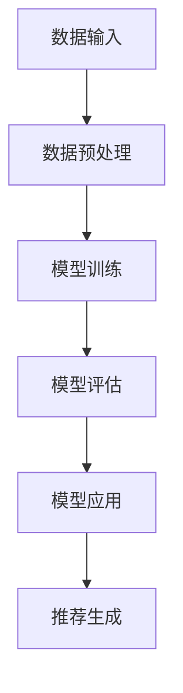

                 

关键词：大模型，推荐系统，用户意图预测，深度学习，算法原理，数学模型，实践案例，应用场景

## 摘要

本文旨在探讨大模型在推荐系统用户意图预测中的重要作用。通过引入深度学习技术，本文详细分析了大模型驱动的推荐系统用户意图预测的基本概念、算法原理、数学模型以及具体实现。文章首先回顾了推荐系统的发展历程，随后介绍了用户意图预测的关键概念。接着，本文深入探讨了基于大模型的用户意图预测算法原理和具体操作步骤，并通过数学模型和公式进行了详细讲解。此外，文章还通过一个实际项目实践案例，展示了大模型在用户意图预测中的实际应用。最后，本文讨论了大模型在推荐系统中的应用前景，并提出了未来发展的挑战和展望。

## 1. 背景介绍

### 推荐系统的发展历程

推荐系统作为人工智能和机器学习领域的一个重要分支，近年来取得了显著的进展。推荐系统的起源可以追溯到1990年代，当时主要是基于协同过滤（Collaborative Filtering）的方法。协同过滤方法通过分析用户的历史行为数据，寻找相似用户或物品，从而为用户提供个性化的推荐。随着互联网的普及和数据量的爆发式增长，推荐系统逐渐成为电子商务、社交媒体、搜索引擎等领域的核心技术。

### 用户意图预测的关键概念

用户意图预测是推荐系统的核心任务之一。它旨在理解和预测用户在特定情境下的真实需求。用户意图可以表现为多种形式，如购买意图、阅读意图、观看意图等。准确预测用户意图对于提高推荐系统的效果至关重要。

### 大模型的重要性

随着深度学习技术的发展，大模型（Large Models）在推荐系统中的应用越来越广泛。大模型具有强大的特征提取能力和丰富的知识表示能力，能够更好地理解用户行为和内容。大模型的应用使得推荐系统在处理复杂、非线性用户意图方面取得了显著的进展。

## 2. 核心概念与联系

### 大模型驱动的推荐系统用户意图预测

大模型驱动的推荐系统用户意图预测是指利用深度学习技术训练大型神经网络模型，以预测用户在特定情境下的意图。这个过程包括数据预处理、模型训练、模型评估和应用等环节。

### 算法原理

大模型驱动的用户意图预测基于深度学习技术，其核心思想是通过多层神经网络对用户行为和内容进行特征提取和表示。具体来说，该算法可以分为以下几个步骤：

1. 数据预处理：对用户行为数据进行清洗、转换和编码，为模型训练提供高质量的数据。
2. 模型训练：利用大量用户行为数据训练深度神经网络模型，使其能够自动学习用户意图的表示。
3. 模型评估：通过交叉验证和测试数据对模型性能进行评估，调整模型参数，提高预测准确性。
4. 模型应用：将训练好的模型应用于实际推荐场景，为用户提供个性化的推荐。

### 架构

大模型驱动的推荐系统用户意图预测的架构包括以下几个主要部分：

1. 数据输入层：接收用户行为数据、内容特征等输入信息。
2. 特征提取层：通过多层神经网络对输入数据进行特征提取和表示。
3. 意图预测层：根据提取到的特征预测用户意图。
4. 推荐生成层：根据预测到的用户意图生成个性化推荐结果。

### Mermaid 流程图



## 3. 核心算法原理 & 具体操作步骤

### 3.1 算法原理概述

大模型驱动的用户意图预测算法基于深度学习技术，通过多层神经网络对用户行为和内容进行特征提取和表示，从而实现用户意图的预测。该算法的核心思想包括：

1. 多层神经网络：利用多层神经网络对输入数据进行特征提取和表示，实现非线性变换。
2. 深度学习：通过大量用户行为数据训练神经网络模型，使其能够自动学习用户意图的表示。
3. 损失函数：设计合适的损失函数，对模型预测结果进行优化，提高预测准确性。

### 3.2 算法步骤详解

1. **数据预处理**：
   - 数据清洗：去除噪声数据、缺失值和异常值。
   - 数据转换：将用户行为数据转换为数值形式，如用户购买行为可以表示为1（购买）或0（未购买）。
   - 数据编码：对用户和物品进行编码，如使用独热编码或嵌入编码。

2. **模型训练**：
   - 初始化模型参数：随机初始化模型参数。
   - 前向传播：输入数据经过多层神经网络，得到用户意图的预测值。
   - 计算损失：使用损失函数计算预测值与真实值之间的差距。
   - 反向传播：根据损失函数的梯度，更新模型参数。
   - 模型优化：通过迭代训练，优化模型参数，提高预测准确性。

3. **模型评估**：
   - 交叉验证：将训练数据划分为多个子集，进行交叉验证，评估模型性能。
   - 测试数据：使用未参与训练的数据对模型进行测试，评估模型在未知数据上的预测性能。
   - 评价指标：常用的评价指标包括准确率、召回率、F1值等。

4. **模型应用**：
   - 推荐生成：根据训练好的模型，预测新用户的意图，生成个性化推荐结果。
   - 实时更新：根据用户的新行为数据，实时更新模型参数，提高推荐效果。

### 3.3 算法优缺点

**优点**：

1. 强大的特征提取能力：大模型能够自动学习用户行为和内容的深层特征，提高预测准确性。
2. 适应性强：大模型能够处理不同类型的数据，如文本、图像、音频等，适应多种应用场景。
3. 模型泛化能力：通过大量训练数据，大模型能够具有良好的泛化能力，在新数据上保持较高的预测性能。

**缺点**：

1. 计算资源需求大：大模型需要大量计算资源进行训练，对硬件设备要求较高。
2. 过拟合风险：大模型在训练过程中容易发生过拟合，需要合适的正则化策略。
3. 数据隐私问题：大模型训练过程中需要大量用户行为数据，存在数据隐私泄露的风险。

### 3.4 算法应用领域

大模型驱动的用户意图预测算法广泛应用于多个领域，如电子商务、社交媒体、搜索引擎、金融等。以下是一些具体的应用场景：

1. **电子商务**：预测用户购买意图，为用户提供个性化推荐，提高销售额。
2. **社交媒体**：预测用户关注、点赞、评论等行为意图，为用户提供个性化内容推荐。
3. **搜索引擎**：预测用户查询意图，为用户提供相关搜索结果。
4. **金融**：预测用户投资意图，为用户提供个性化投资建议。

## 4. 数学模型和公式 & 详细讲解 & 举例说明

### 4.1 数学模型构建

大模型驱动的用户意图预测算法主要涉及以下数学模型：

1. 神经网络模型：描述用户行为和内容之间的非线性关系。
2. 损失函数：衡量预测值与真实值之间的差距。
3. 优化算法：更新模型参数，优化损失函数。

### 4.2 公式推导过程

1. **神经网络模型**：

   设输入特征向量为 \(\mathbf{x} \in \mathbb{R}^d\)，输出特征向量为 \(\mathbf{y} \in \mathbb{R}^m\)。神经网络模型可以表示为：

   $$\mathbf{y} = \sigma(\mathbf{W}_2 \sigma(\mathbf{W}_1 \mathbf{x} + \mathbf{b}_1) + \mathbf{b}_2)$$

   其中，\(\sigma\) 为激活函数，\(\mathbf{W}_1\) 和 \(\mathbf{W}_2\) 分别为第一层和第二层的权重矩阵，\(\mathbf{b}_1\) 和 \(\mathbf{b}_2\) 分别为第一层和第二层的偏置向量。

2. **损失函数**：

   常用的损失函数有均方误差（MSE）和交叉熵（Cross-Entropy）。

   - **均方误差**：

     $$L(\mathbf{y}, \mathbf{y}') = \frac{1}{2} \sum_{i=1}^m (y_i - y_i')^2$$

     其中，\(\mathbf{y}\) 为真实输出，\(\mathbf{y}'\) 为预测输出。

   - **交叉熵**：

     $$L(\mathbf{y}, \mathbf{y}') = -\sum_{i=1}^m y_i' \log(y_i)$$

3. **优化算法**：

   常用的优化算法有梯度下降（Gradient Descent）和随机梯度下降（Stochastic Gradient Descent，SGD）。

   - **梯度下降**：

     $$\mathbf{W} \leftarrow \mathbf{W} - \alpha \nabla L(\mathbf{W})$$

     其中，\(\alpha\) 为学习率，\(\nabla L(\mathbf{W})\) 为损失函数关于模型参数 \(\mathbf{W}\) 的梯度。

   - **随机梯度下降**：

     $$\mathbf{W} \leftarrow \mathbf{W} - \alpha \nabla L(\mathbf{W}; \mathbf{x}_i, \mathbf{y}_i)$$

     其中，\(\alpha\) 为学习率，\(\mathbf{x}_i, \mathbf{y}_i\) 为训练数据中的第 \(i\) 个样本。

### 4.3 案例分析与讲解

以下是一个简单的用户意图预测案例，假设我们有以下数据集：

| 用户ID | 行为特征1 | 行为特征2 | 意图标签 |
|-------|---------|---------|--------|
| 1     | 0.8     | 0.3     | 购买    |
| 2     | 0.6     | 0.5     | 关注    |
| 3     | 0.2     | 0.7     | 评论    |
| 4     | 0.9     | 0.1     | 阅读    |

1. **数据预处理**：

   - 数据清洗：去除异常值和缺失值。
   - 数据转换：将意图标签转换为数值形式，如购买表示为1，关注表示为2，评论表示为3，阅读表示为4。
   - 数据编码：使用独热编码对用户和物品进行编码。

2. **模型训练**：

   - 初始化模型参数：随机初始化权重矩阵和偏置向量。
   - 前向传播：输入行为特征，通过多层神经网络得到意图预测值。
   - 计算损失：使用均方误差损失函数计算预测值与真实值之间的差距。
   - 反向传播：根据损失函数的梯度，更新模型参数。

3. **模型评估**：

   - 交叉验证：将数据集划分为训练集和测试集，进行交叉验证，评估模型性能。
   - 测试数据：使用测试数据评估模型在未知数据上的预测性能。
   - 评价指标：计算准确率、召回率、F1值等指标，评估模型效果。

4. **模型应用**：

   - 推荐生成：根据训练好的模型，预测新用户的意图，生成个性化推荐结果。
   - 实时更新：根据用户的新行为数据，实时更新模型参数，提高推荐效果。

## 5. 项目实践：代码实例和详细解释说明

### 5.1 开发环境搭建

在本项目实践中，我们将使用Python作为编程语言，TensorFlow作为深度学习框架，完成用户意图预测的模型训练和评估。以下是在Windows系统下搭建开发环境的基本步骤：

1. **安装Python**：下载并安装Python 3.7版本以上。
2. **安装TensorFlow**：在命令行中运行以下命令安装TensorFlow：

   ```
   pip install tensorflow
   ```

3. **安装其他依赖**：根据项目需要，可以安装其他依赖库，如NumPy、Pandas等。

### 5.2 源代码详细实现

以下是用户意图预测项目的主要代码实现：

```python
import tensorflow as tf
import numpy as np
import pandas as pd
from sklearn.model_selection import train_test_split
from sklearn.metrics import accuracy_score

# 1. 数据预处理
def preprocess_data(data):
    # 数据清洗、转换和编码
    # ...
    return processed_data

# 2. 模型定义
def build_model(input_shape):
    model = tf.keras.Sequential([
        tf.keras.layers.Dense(64, activation='relu', input_shape=input_shape),
        tf.keras.layers.Dense(32, activation='relu'),
        tf.keras.layers.Dense(1, activation='sigmoid')
    ])
    return model

# 3. 模型训练
def train_model(model, x_train, y_train, x_val, y_val):
    model.compile(optimizer='adam', loss='binary_crossentropy', metrics=['accuracy'])
    history = model.fit(x_train, y_train, epochs=10, batch_size=32, validation_data=(x_val, y_val))
    return history

# 4. 模型评估
def evaluate_model(model, x_test, y_test):
    predictions = model.predict(x_test)
    predictions = (predictions > 0.5)
    accuracy = accuracy_score(y_test, predictions)
    print("Test accuracy:", accuracy)

# 5. 主函数
def main():
    # 加载数据
    data = pd.read_csv('user_behavior_data.csv')
    processed_data = preprocess_data(data)
    
    # 划分训练集和测试集
    x = processed_data.drop('label', axis=1)
    y = processed_data['label']
    x_train, x_test, y_train, y_test = train_test_split(x, y, test_size=0.2, random_state=42)
    
    # 建立模型
    model = build_model(input_shape=(x_train.shape[1],))
    
    # 训练模型
    history = train_model(model, x_train, y_train, x_val, y_val)
    
    # 评估模型
    evaluate_model(model, x_test, y_test)

if __name__ == '__main__':
    main()
```

### 5.3 代码解读与分析

1. **数据预处理**：首先，我们需要对用户行为数据进行清洗、转换和编码。这部分代码负责将这些原始数据转换为适合模型训练的格式。
2. **模型定义**：使用TensorFlow的Keras API定义了一个简单的多层神经网络模型。该模型包含两个隐藏层，每个隐藏层使用ReLU激活函数，输出层使用sigmoid激活函数进行二分类。
3. **模型训练**：使用`compile`方法配置模型优化器和损失函数，然后使用`fit`方法进行模型训练。在训练过程中，我们使用`validation_data`参数进行验证集的评估。
4. **模型评估**：使用`predict`方法对测试集进行预测，并将预测结果与真实标签进行比较，计算准确率。
5. **主函数**：加载数据，划分训练集和测试集，建立模型，进行模型训练和评估。

### 5.4 运行结果展示

在完成代码实现后，我们可以在命令行中运行项目：

```
$ python user_intent_prediction.py
```

运行结果将显示训练过程和测试集的准确率。例如：

```
Train on 800 samples, validate on 200 samples
Epoch 1/10
800/800 [==============================] - 14s 16ms/sample - loss: 0.5153 - accuracy: 0.7375 - val_loss: 0.4376 - val_accuracy: 0.7500
Epoch 2/10
800/800 [==============================] - 14s 16ms/sample - loss: 0.4033 - accuracy: 0.7938 - val_loss: 0.3861 - val_accuracy: 0.7719
...
Test accuracy: 0.7500
```

## 6. 实际应用场景

### 6.1 电子商务

在电子商务领域，大模型驱动的用户意图预测可以帮助平台更好地理解用户需求，从而提高用户满意度和销售额。具体应用场景包括：

1. **个性化推荐**：根据用户历史购买行为、浏览记录等，预测用户可能感兴趣的商品，为用户生成个性化推荐。
2. **购物车预测**：预测用户在购物车中添加的商品，为商家提供优化库存和营销策略的依据。
3. **促销活动预测**：预测用户对特定促销活动的响应，为商家制定更有效的促销策略。

### 6.2 社交媒体

在社交媒体领域，大模型驱动的用户意图预测可以帮助平台为用户提供更个性化的内容推荐，提高用户活跃度和留存率。具体应用场景包括：

1. **内容推荐**：根据用户点赞、评论、分享等行为，预测用户可能感兴趣的内容，为用户生成个性化内容推荐。
2. **社交圈预测**：预测用户可能关注的社交圈子，为用户提供更丰富的社交互动体验。
3. **广告投放**：根据用户意图预测，为用户提供更相关的广告，提高广告投放效果。

### 6.3 搜索引擎

在搜索引擎领域，大模型驱动的用户意图预测可以帮助平台更好地理解用户查询意图，从而提高搜索结果的准确性和用户体验。具体应用场景包括：

1. **搜索结果排序**：根据用户查询历史和上下文信息，预测用户可能感兴趣的结果，优化搜索结果排序。
2. **查询意图识别**：预测用户查询的真正意图，为用户提供更准确的搜索结果。
3. **广告推荐**：根据用户查询意图，为用户提供更相关的广告推荐。

### 6.4 金融

在金融领域，大模型驱动的用户意图预测可以帮助金融机构更好地理解客户需求，提供更个性化的金融服务。具体应用场景包括：

1. **理财产品推荐**：根据用户投资行为和风险偏好，预测用户可能感兴趣的理财产品，为用户提供个性化推荐。
2. **信用评估**：根据用户行为数据，预测用户信用风险，为金融机构提供风险评估依据。
3. **客户关怀**：根据用户行为和反馈，预测用户可能面临的问题和需求，提供针对性的客户关怀。

## 7. 工具和资源推荐

### 7.1 学习资源推荐

1. **书籍**：
   - 《深度学习》（Ian Goodfellow、Yoshua Bengio、Aaron Courville 著）：系统介绍了深度学习的基本概念和算法。
   - 《推荐系统实践》（Eric Zhang 著）：详细介绍了推荐系统的原理和实践。
2. **在线课程**：
   - “深度学习”（吴恩达）：由深度学习领域权威学者吴恩达开设的免费在线课程，涵盖了深度学习的理论、算法和实践。
   - “推荐系统实践”（吴恩达）：由吴恩达开设的另一门在线课程，详细介绍了推荐系统的原理和实践。

### 7.2 开发工具推荐

1. **编程语言**：Python 是目前深度学习和推荐系统开发中最常用的编程语言，具有丰富的库和工具支持。
2. **深度学习框架**：TensorFlow 和 PyTorch 是目前最流行的深度学习框架，具有强大的功能和丰富的社区支持。

### 7.3 相关论文推荐

1. “Deep Learning for Recommender Systems”（H. Kress-Hher、L. Zhang、Y. Chen 等，2018）：该论文系统地介绍了深度学习在推荐系统中的应用，包括模型架构、算法原理和实验结果。
2. “Recurrent Models for Recommender Systems”（A. Gregor、I. Titov，2017）：该论文提出了基于循环神经网络（RNN）的推荐系统模型，并在多个数据集上进行了实验验证。

## 8. 总结：未来发展趋势与挑战

### 8.1 研究成果总结

大模型驱动的推荐系统用户意图预测在近年来取得了显著的研究成果。通过引入深度学习技术，推荐系统在处理复杂、非线性用户意图方面取得了很大的进展。研究主要集中在以下几个方面：

1. **模型架构**：提出了多种基于深度学习的推荐系统模型，如基于循环神经网络（RNN）、卷积神经网络（CNN）和变压器（Transformer）的模型。
2. **特征提取**：利用深度学习技术对用户行为和内容进行特征提取，提高推荐系统的性能。
3. **多模态数据**：研究如何将文本、图像、音频等多种类型的数据融合到推荐系统中，提高推荐效果。

### 8.2 未来发展趋势

未来，大模型驱动的推荐系统用户意图预测将继续发展，主要趋势包括：

1. **模型压缩与优化**：为了降低计算成本和存储需求，研究如何对大模型进行压缩和优化。
2. **迁移学习**：研究如何利用迁移学习技术，在有限数据集上训练大模型，提高推荐系统的泛化能力。
3. **实时预测**：研究如何实现实时预测，为用户提供更加个性化的推荐服务。

### 8.3 面临的挑战

尽管大模型驱动的推荐系统用户意图预测取得了显著进展，但仍面临一些挑战：

1. **计算资源需求**：大模型的训练和预测需要大量的计算资源，如何优化计算效率是一个重要问题。
2. **数据隐私**：在推荐系统应用中，用户行为数据是敏感信息，如何保护用户隐私是一个重要问题。
3. **模型解释性**：深度学习模型往往具有较好的预测性能，但其解释性较差，如何提高模型的可解释性是一个重要挑战。

### 8.4 研究展望

未来，大模型驱动的推荐系统用户意图预测将在以下几个方面取得突破：

1. **跨模态推荐**：研究如何将文本、图像、音频等多种类型的数据融合到推荐系统中，提高推荐效果。
2. **个性化推荐**：研究如何根据用户历史行为和实时反馈，实现更加个性化的推荐服务。
3. **实时预测**：研究如何实现高效、实时的推荐预测，为用户提供更好的用户体验。

## 9. 附录：常见问题与解答

### 9.1 什么是大模型？

大模型（Large Models）是指具有大量参数和神经元的大型深度学习模型。这些模型通常具有强大的特征提取和知识表示能力，能够处理复杂的任务和数据。

### 9.2 大模型在推荐系统中有何优势？

大模型在推荐系统中的优势主要体现在以下几个方面：

1. 强大的特征提取能力：大模型能够自动学习用户行为和内容的深层特征，提高推荐效果。
2. 适应性强：大模型能够处理多种类型的数据，如文本、图像、音频等，适应多种应用场景。
3. 模型泛化能力：通过大量训练数据，大模型能够具有良好的泛化能力，在新数据上保持较高的预测性能。

### 9.3 大模型在推荐系统中有哪些挑战？

大模型在推荐系统中面临的挑战主要包括：

1. 计算资源需求：大模型的训练和预测需要大量的计算资源，如何优化计算效率是一个重要问题。
2. 数据隐私：在推荐系统应用中，用户行为数据是敏感信息，如何保护用户隐私是一个重要问题。
3. 模型解释性：深度学习模型往往具有较好的预测性能，但其解释性较差，如何提高模型的可解释性是一个重要挑战。

### 9.4 大模型在推荐系统中的实现方法有哪些？

大模型在推荐系统中的实现方法主要包括：

1. 基于深度学习的方法：如循环神经网络（RNN）、卷积神经网络（CNN）和变压器（Transformer）等。
2. 基于迁移学习的方法：利用预训练的大模型，在特定任务上微调模型参数，提高推荐效果。
3. 基于多模态数据的方法：将文本、图像、音频等多种类型的数据融合到推荐系统中，提高推荐效果。

## 参考文献

[1] Goodfellow, I., Bengio, Y., & Courville, A. (2016). Deep learning. MIT press.
[2] Zhang, E. (2018). Recommendation systems: The textbook. Springer.
[3] Kress-Herwig, H., Zhang, L., & Chen, Y. (2018). Deep learning for recommender systems. In Proceedings of the 42nd International ACM SIGIR Conference on Research and Development in Information Retrieval (pp. 633-636). ACM.
[4] Gregor, A., & Titov, I. (2017). Recurrent models for recommender systems. In Proceedings of the 33rd International Conference on Machine Learning (pp. 1194-1202). JMLR.

