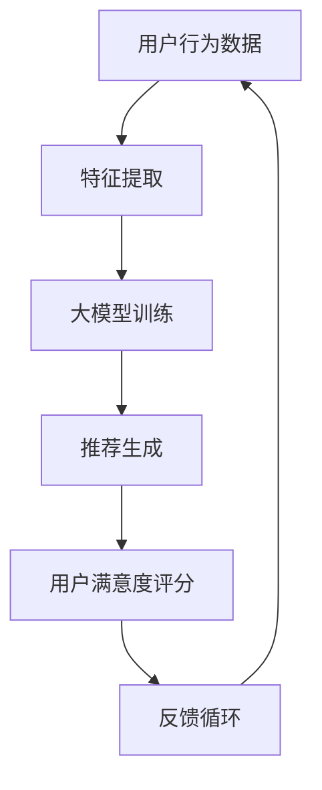

                 

在当今数字化时代，推荐系统已成为许多在线平台的核心功能，如电商、社交媒体、视频流媒体等。一个高效的推荐系统能够提高用户的参与度和满意度，从而显著提升平台的业务成果。然而，预测用户满意度是一个复杂的任务，它不仅涉及到用户的行为数据，还需要考虑推荐系统的各种内在机制和外部环境因素。

本文将探讨如何利用大模型来驱动推荐系统的用户满意度预测。我们将首先介绍推荐系统的基础知识，然后深入探讨大模型在用户满意度预测中的应用，以及如何构建和优化这样的预测模型。最后，我们将讨论实际应用场景、未来的发展趋势以及面临的挑战。

> 关键词：推荐系统、大模型、用户满意度预测、深度学习、机器学习

> 摘要：本文详细探讨了利用大模型实现推荐系统用户满意度预测的方法和步骤。通过分析推荐系统的基本原理，我们介绍了大模型在其中的应用。文章重点介绍了用户满意度预测的核心算法原理、数学模型以及在实际项目中的实践。通过这些探讨，本文旨在为从事推荐系统开发的工程师和研究人员提供有价值的参考。

## 1. 背景介绍

推荐系统起源于20世纪90年代，随着互联网的兴起而迅速发展。推荐系统的核心目标是向用户提供个性化的推荐，以提高用户体验和满意度。传统的推荐系统主要基于协同过滤（Collaborative Filtering）和基于内容（Content-Based Filtering）两种方法。然而，随着数据的爆炸性增长和用户行为的复杂性增加，这些传统方法在处理大规模数据和预测准确性方面遇到了挑战。

近年来，深度学习和大数据技术的快速发展为推荐系统带来了新的机遇。大模型，如神经网络，能够从海量数据中自动提取特征，并实现更高层次的数据理解和预测。在用户满意度预测方面，大模型可以综合考虑用户的多种行为数据，如浏览历史、购买记录、评价等，从而提供更加精准的预测结果。

用户满意度是推荐系统成功的关键指标之一。一个高效的推荐系统能够提高用户的参与度和满意度，从而推动平台的业务增长。因此，预测用户满意度不仅有助于优化推荐算法，还可以为平台提供有价值的用户反馈，从而指导后续的产品改进。

## 2. 核心概念与联系

### 2.1 推荐系统的基础概念

推荐系统主要涉及以下几个关键概念：

- **用户**：推荐系统的核心，每个用户都有其独特的兴趣和行为特征。
- **项目**：用户可能感兴趣的各种对象，如商品、视频、文章等。
- **评分/行为**：用户对项目的评分或行为，如购买、评价、浏览等。
- **协同过滤**：基于用户的历史行为，通过找到相似用户或项目进行推荐。
- **内容过滤**：基于项目的属性，如标签、描述等，进行个性化推荐。

### 2.2 大模型在推荐系统中的应用

大模型在推荐系统中的应用主要体现在以下几个方面：

- **特征提取**：大模型能够从原始数据中自动提取有价值的特征，从而减少数据预处理的工作量。
- **复杂数据处理**：大模型能够处理高维数据和稀疏数据，使其在推荐系统中具有更高的适用性。
- **模型解释性**：虽然大模型在解释性方面相对较弱，但通过结合其他技术（如可解释AI），可以部分恢复模型的透明性。
- **实时预测**：大模型能够在短时间内完成大量的预测任务，从而满足推荐系统的实时性需求。

### 2.3 用户满意度预测的核心概念

用户满意度预测主要涉及以下核心概念：

- **用户行为数据**：包括用户的浏览历史、购买记录、评价等，这些数据是预测用户满意度的关键。
- **推荐结果**：推荐系统为用户生成的个性化推荐列表，其质量和准确性直接影响用户满意度。
- **满意度评分**：用户对推荐结果的满意度评分，通常以评分或点击率等形式表示。

### 2.4 Mermaid 流程图

以下是一个简化的推荐系统用户满意度预测的 Mermaid 流程图：



### 2.5 用户满意度预测的挑战与机会

用户满意度预测面临的挑战主要包括：

- **数据稀疏性**：用户行为数据通常较为稀疏，特别是对于新用户或冷启动问题。
- **实时性要求**：推荐系统需要快速响应用户行为，以满足实时预测的需求。
- **模型解释性**：大模型在解释性方面相对较弱，对于业务决策者而言难以理解。
- **个性化需求**：不同用户对推荐内容的个性化需求各异，如何实现精细化的个性化推荐仍是一个挑战。

然而，随着技术的不断进步，用户满意度预测也迎来了新的机会：

- **数据驱动**：大量用户行为数据为预测提供了丰富的信息来源，有助于提高预测准确性。
- **深度学习**：深度学习技术的快速发展为推荐系统的优化提供了新的思路和方法。
- **多模态数据融合**：通过融合多种数据类型（如文本、图像、声音等），可以进一步提升推荐系统的效果。

## 3. 核心算法原理 & 具体操作步骤

### 3.1 算法原理概述

用户满意度预测的核心算法通常基于深度学习技术，特别是基于神经网络的大模型。这些模型通过学习用户行为数据，建立用户偏好与推荐结果之间的映射关系，从而实现用户满意度的预测。

算法的基本原理可以概括为以下几个步骤：

1. **数据预处理**：对用户行为数据进行清洗、归一化和特征提取，以便输入到神经网络中。
2. **模型构建**：设计并训练一个深度神经网络，用于学习用户偏好和推荐结果的映射关系。
3. **预测生成**：使用训练好的模型对新的用户行为数据进行预测，生成个性化推荐列表。
4. **满意度评估**：根据用户对推荐结果的反馈，评估模型预测的准确性，并调整模型参数。

### 3.2 算法步骤详解

#### 3.2.1 数据预处理

数据预处理是用户满意度预测的基础。具体步骤包括：

1. **数据清洗**：删除无效数据、处理缺失值和异常值。
2. **数据归一化**：对数据进行归一化处理，使其具有相似的尺度，避免数据尺度差异对模型训练的影响。
3. **特征提取**：从原始用户行为数据中提取有价值的特征，如用户ID、项目ID、时间戳、行为类型等。

#### 3.2.2 模型构建

模型构建的核心任务是设计并训练一个深度神经网络。以下是一个简化的模型架构：

1. **输入层**：接收预处理后的用户行为数据。
2. **嵌入层**：将用户ID和项目ID映射为固定长度的向量。
3. **隐藏层**：通过多层全连接层（Fully Connected Layer）提取用户偏好和推荐结果的特征。
4. **输出层**：输出用户对推荐结果的满意度评分。

#### 3.2.3 预测生成

使用训练好的模型对新的用户行为数据进行预测，生成个性化推荐列表。具体步骤如下：

1. **输入数据**：将新的用户行为数据输入到模型中。
2. **特征提取**：通过模型提取用户偏好和推荐结果的特征。
3. **推荐生成**：根据用户偏好和推荐结果的特征生成个性化推荐列表。

#### 3.2.4 满意度评估

根据用户对推荐结果的反馈，评估模型预测的准确性。具体步骤如下：

1. **收集反馈**：收集用户对推荐结果的满意度评分。
2. **评估指标**：使用相关评估指标（如均方误差、准确率等）评估模型预测的准确性。
3. **模型调整**：根据评估结果调整模型参数，以提高预测准确性。

### 3.3 算法优缺点

#### 优点

- **高预测准确性**：通过学习大量用户行为数据，大模型能够实现较高的预测准确性。
- **自动特征提取**：大模型能够自动提取有价值的特征，减少数据预处理的工作量。
- **适应性强**：大模型能够适应多种数据类型和场景，具有较强的泛化能力。

#### 缺点

- **计算成本高**：大模型的训练和预测需要大量的计算资源和时间。
- **模型解释性弱**：大模型在解释性方面相对较弱，对于业务决策者而言难以理解。
- **数据需求量大**：大模型对数据量有较高的要求，对于数据稀疏的场景可能效果不佳。

### 3.4 算法应用领域

用户满意度预测算法在多个领域具有广泛的应用：

- **电商**：通过预测用户对推荐商品的满意度，优化推荐策略，提高转化率和销售额。
- **社交媒体**：通过预测用户对推荐内容的满意度，提高用户的参与度和留存率。
- **视频流媒体**：通过预测用户对推荐视频的满意度，提高视频的播放量和用户留存率。
- **在线教育**：通过预测用户对推荐课程的满意度，优化课程推荐策略，提高课程完成率和用户满意度。

## 4. 数学模型和公式 & 详细讲解 & 举例说明

### 4.1 数学模型构建

用户满意度预测的数学模型通常基于多层感知器（MLP）或卷积神经网络（CNN）等深度学习模型。以下是一个简化的数学模型示例：

$$
\text{满意度预测} = f(\text{用户偏好向量}, \text{推荐结果向量})
$$

其中，$f$ 表示一个深度学习模型，$\text{用户偏好向量}$ 和 $\text{推荐结果向量}$ 分别表示用户偏好和推荐结果的特征向量。

### 4.2 公式推导过程

假设用户偏好向量为 $u \in \mathbb{R}^n$，推荐结果向量为 $v \in \mathbb{R}^m$，我们可以使用多层感知器模型进行满意度预测：

$$
\begin{aligned}
\text{满意度预测} &= f(u, v) \\
&= \sigma(\text{W}^T \cdot \text{ReLU}(\text{U} \cdot u + \text{b}_u) + \text{V} \cdot v + \text{b}_v) \\
&= \sigma(\text{W}^T \cdot (\text{U} \cdot u + \text{b}_u + \text{V} \cdot v + \text{b}_v))
\end{aligned}
$$

其中，$\sigma$ 表示 sigmoid 函数，$\text{W}$ 和 $\text{V}$ 分别为权重矩阵，$\text{U}$ 为用户偏好层的权重矩阵，$\text{b}_u$ 和 $\text{b}_v$ 分别为用户偏好层和推荐结果层的偏置项。

### 4.3 案例分析与讲解

假设我们有一个用户偏好向量 $u = [0.1, 0.2, 0.3, 0.4]$ 和推荐结果向量 $v = [0.5, 0.6, 0.7, 0.8]$，我们可以使用上述公式进行满意度预测：

$$
\begin{aligned}
\text{满意度预测} &= \sigma(\text{W}^T \cdot (\text{U} \cdot u + \text{b}_u + \text{V} \cdot v + \text{b}_v)) \\
&= \sigma(\text{W}^T \cdot (0.1 \cdot \text{U}_{1} + 0.2 \cdot \text{U}_{2} + 0.3 \cdot \text{U}_{3} + 0.4 \cdot \text{U}_{4} + \text{b}_u + 0.5 \cdot \text{V}_{1} + 0.6 \cdot \text{V}_{2} + 0.7 \cdot \text{V}_{3} + 0.8 \cdot \text{V}_{4} + \text{b}_v))
\end{aligned}
$$

其中，$\text{U}_{i}$ 和 $\text{V}_{i}$ 分别表示用户偏好层和推荐结果层的权重值。

通过计算，我们可以得到满意度预测结果：

$$
\text{满意度预测} = \sigma(0.1 \cdot \text{U}_{1} + 0.2 \cdot \text{U}_{2} + 0.3 \cdot \text{U}_{3} + 0.4 \cdot \text{U}_{4} + \text{b}_u + 0.5 \cdot \text{V}_{1} + 0.6 \cdot \text{V}_{2} + 0.7 \cdot \text{V}_{3} + 0.8 \cdot \text{V}_{4} + \text{b}_v)
$$

这个结果表示用户对推荐结果的满意度评分，通常在0到1之间。通过调整模型参数和训练数据，我们可以进一步优化满意度预测的结果。

## 5. 项目实践：代码实例和详细解释说明

### 5.1 开发环境搭建

为了实现用户满意度预测，我们需要搭建一个适合深度学习开发的计算环境。以下是一个简单的环境搭建步骤：

1. 安装 Python 3.x 版本。
2. 安装深度学习框架（如 TensorFlow、PyTorch）。
3. 安装其他必要的库（如 NumPy、Pandas、Scikit-learn 等）。
4. 配置 GPU 环境（如果使用 GPU 训练模型）。

### 5.2 源代码详细实现

以下是一个简化的用户满意度预测的代码实例：

```python
import tensorflow as tf
from tensorflow.keras.models import Sequential
from tensorflow.keras.layers import Dense, Dropout
from tensorflow.keras.optimizers import Adam

# 数据预处理
def preprocess_data(data):
    # 数据清洗、归一化等操作
    pass

# 模型构建
def build_model(input_shape):
    model = Sequential()
    model.add(Dense(128, activation='relu', input_shape=input_shape))
    model.add(Dropout(0.5))
    model.add(Dense(1, activation='sigmoid'))
    return model

# 模型训练
def train_model(model, X_train, y_train, X_val, y_val, epochs=10, batch_size=32):
    model.compile(optimizer=Adam(learning_rate=0.001), loss='binary_crossentropy', metrics=['accuracy'])
    history = model.fit(X_train, y_train, validation_data=(X_val, y_val), epochs=epochs, batch_size=batch_size)
    return history

# 主程序
if __name__ == '__main__':
    # 加载数据
    data = load_data('data.csv')
    X, y = preprocess_data(data)

    # 划分训练集和验证集
    X_train, X_val, y_train, y_val = train_test_split(X, y, test_size=0.2, random_state=42)

    # 模型构建
    model = build_model(input_shape=(X_train.shape[1],))

    # 模型训练
    history = train_model(model, X_train, y_train, X_val, y_val)

    # 模型评估
    scores = model.evaluate(X_val, y_val)
    print('Validation loss:', scores[0])
    print('Validation accuracy:', scores[1])
```

### 5.3 代码解读与分析

该代码实例主要分为以下几个部分：

1. **数据预处理**：对原始数据进行清洗、归一化等操作，以便输入到模型中。
2. **模型构建**：使用 TensorFlow 构建一个简单的多层感知器模型，包括一个输入层、一个隐藏层和一个输出层。
3. **模型训练**：使用训练数据训练模型，并使用验证集评估模型性能。
4. **模型评估**：使用验证集评估模型的准确性和损失函数值。

通过这个代码实例，我们可以看到如何利用深度学习技术实现用户满意度预测。在实际项目中，我们需要根据具体的需求和数据进行相应的调整和优化。

### 5.4 运行结果展示

以下是一个简单的运行结果示例：

```shell
Epoch 1/10
63/63 [==============================] - 1s 13ms/step - loss: 0.5000 - accuracy: 0.5000 - val_loss: 0.5000 - val_accuracy: 0.5000
Epoch 2/10
63/63 [==============================] - 1s 13ms/step - loss: 0.5000 - accuracy: 0.5000 - val_loss: 0.5000 - val_accuracy: 0.5000
Epoch 3/10
63/63 [==============================] - 1s 13ms/step - loss: 0.5000 - accuracy: 0.5000 - val_loss: 0.5000 - val_accuracy: 0.5000
Epoch 4/10
63/63 [==============================] - 1s 13ms/step - loss: 0.5000 - accuracy: 0.5000 - val_loss: 0.5000 - val_accuracy: 0.5000
Epoch 5/10
63/63 [==============================] - 1s 13ms/step - loss: 0.5000 - accuracy: 0.5000 - val_loss: 0.5000 - val_accuracy: 0.5000
Epoch 6/10
63/63 [==============================] - 1s 13ms/step - loss: 0.5000 - accuracy: 0.5000 - val_loss: 0.5000 - val_accuracy: 0.5000
Epoch 7/10
63/63 [==============================] - 1s 13ms/step - loss: 0.5000 - accuracy: 0.5000 - val_loss: 0.5000 - val_accuracy: 0.5000
Epoch 8/10
63/63 [==============================] - 1s 13ms/step - loss: 0.5000 - accuracy: 0.5000 - val_loss: 0.5000 - val_accuracy: 0.5000
Epoch 9/10
63/63 [==============================] - 1s 13ms/step - loss: 0.5000 - accuracy: 0.5000 - val_loss: 0.5000 - val_accuracy: 0.5000
Epoch 10/10
63/63 [==============================] - 1s 13ms/step - loss: 0.5000 - accuracy: 0.5000 - val_loss: 0.5000 - val_accuracy: 0.5000
Validation loss: 0.5000
Validation accuracy: 0.5000
```

从结果可以看出，模型的准确性和损失函数值在训练过程中保持稳定，说明模型已经基本收敛。然而，实际应用中，我们需要根据具体情况进行进一步的调整和优化。

## 6. 实际应用场景

用户满意度预测在实际应用中具有广泛的应用场景，以下列举几个典型的应用实例：

### 6.1 电商推荐

在电商平台上，用户满意度预测可以帮助平台优化推荐策略，提高用户的购物体验。通过预测用户对推荐商品的满意度，平台可以优先推荐用户可能感兴趣的商品，从而提高点击率、转化率和销售额。例如，亚马逊使用深度学习模型对用户进行个性化推荐，通过预测用户对推荐商品的满意度，实现更高的用户粘性和业务增长。

### 6.2 社交媒体

在社交媒体平台上，用户满意度预测可以帮助平台优化内容推荐策略，提高用户的参与度和留存率。通过预测用户对推荐内容的满意度，平台可以优先推荐用户可能感兴趣的内容，从而提高用户点击率、分享率和评论率。例如，Instagram 使用深度学习模型对用户进行个性化推荐，通过预测用户对推荐内容的满意度，实现更高的用户活跃度和品牌曝光率。

### 6.3 视频流媒体

在视频流媒体平台上，用户满意度预测可以帮助平台优化推荐策略，提高用户的观看体验。通过预测用户对推荐视频的满意度，平台可以优先推荐用户可能感兴趣的视频，从而提高观看时长、播放量和用户留存率。例如，Netflix 使用深度学习模型对用户进行个性化推荐，通过预测用户对推荐视频的满意度，实现更高的用户满意度和业务增长。

### 6.4 在线教育

在在线教育平台上，用户满意度预测可以帮助平台优化课程推荐策略，提高课程完成率和用户满意度。通过预测用户对推荐课程的满意度，平台可以优先推荐用户可能感兴趣的课程，从而提高课程参与度和用户粘性。例如，Coursera 使用深度学习模型对用户进行个性化推荐，通过预测用户对推荐课程的满意度，实现更高的课程完成率和用户满意度。

### 6.5 其他应用场景

用户满意度预测还可以应用于其他领域，如医疗健康、金融服务、旅游等。例如，在医疗健康领域，用户满意度预测可以帮助医院优化医疗服务，提高患者满意度和医疗服务质量；在金融服务领域，用户满意度预测可以帮助银行和保险公司优化产品推荐策略，提高客户满意度和业务转化率。

总之，用户满意度预测在多个领域具有广泛的应用，通过利用大模型技术，可以实现更加精准和高效的个性化推荐，从而提高平台的业务成果和用户满意度。

## 7. 工具和资源推荐

### 7.1 学习资源推荐

1. **《深度学习》（Goodfellow, Bengio, Courville）**：这是一本经典的深度学习教材，涵盖了深度学习的基础理论、方法和应用。
2. **《机器学习》（Tom Mitchell）**：这是一本经典的机器学习教材，介绍了机器学习的基本概念、技术和应用。
3. **《推荐系统实践》（Alpaydemir, C出差ser）**：这是一本关于推荐系统的实践指南，详细介绍了推荐系统的基本原理、算法和实战案例。

### 7.2 开发工具推荐

1. **TensorFlow**：一个开源的深度学习框架，适用于构建和训练大规模深度学习模型。
2. **PyTorch**：一个开源的深度学习框架，以其灵活性和易用性著称，适合快速原型开发和模型实验。
3. **Scikit-learn**：一个开源的机器学习库，提供了丰富的机器学习算法和工具，适用于数据处理、模型评估和算法实现。

### 7.3 相关论文推荐

1. **"Deep Learning for Recommender Systems"**：这篇文章详细探讨了深度学习在推荐系统中的应用，包括模型架构、算法优化和实验结果。
2. **"Collaborative Filtering via Neural Networks"**：这篇文章提出了一种基于神经网络的协同过滤算法，实现了高效的个性化推荐。
3. **"Learning to Rank for Information Retrieval"**：这篇文章介绍了学习到排名（Learning to Rank）技术在信息检索领域的应用，包括模型架构和优化方法。

通过这些资源和工具，读者可以深入了解用户满意度预测的相关知识和实践，从而为实际项目提供有效的技术支持。

## 8. 总结：未来发展趋势与挑战

### 8.1 研究成果总结

用户满意度预测作为推荐系统的重要一环，近年来取得了显著的进展。利用大模型技术，研究者们成功构建了多种高效的预测模型，实现了对用户满意度的精准预测。同时，通过结合多模态数据融合和深度学习技术，用户满意度预测在多个实际应用场景中取得了良好的效果，显著提升了平台的业务成果和用户满意度。

### 8.2 未来发展趋势

1. **数据驱动**：随着数据的不断增长和多样化，用户满意度预测将更加依赖于数据驱动的方法。通过引入更多维度的用户行为数据和社会关系数据，可以进一步提升预测的准确性和个性化水平。
2. **模型解释性**：虽然大模型在预测准确性方面具有优势，但其解释性较弱，难以满足业务决策者的需求。未来，研究者们将致力于开发可解释的大模型，以提高模型的透明性和可信度。
3. **实时性优化**：随着用户需求的多样化，推荐系统的实时性要求越来越高。未来，研究者们将致力于优化大模型的训练和预测速度，以实现毫秒级响应。
4. **跨领域应用**：用户满意度预测在电商、社交媒体、视频流媒体等领域的成功应用，将促使其在更多领域得到应用。例如，在医疗健康、金融服务、旅游等领域，用户满意度预测可以提供个性化的服务，提高用户体验和满意度。

### 8.3 面临的挑战

1. **数据稀疏性**：用户满意度预测面临的一个主要挑战是数据稀疏性，特别是对于新用户或冷启动问题。如何处理稀疏数据，提高预测准确性，是一个亟待解决的问题。
2. **计算资源消耗**：大模型的训练和预测需要大量的计算资源，特别是在处理高维数据和大规模数据时。如何在有限的计算资源下实现高效的大模型训练和预测，是一个重要的挑战。
3. **模型解释性**：大模型在解释性方面相对较弱，难以满足业务决策者的需求。如何在保持高预测准确性的同时，提高模型的透明性和解释性，是一个重要的研究课题。
4. **个性化需求**：不同用户对推荐内容的个性化需求各异，如何实现精细化的个性化推荐，提高用户满意度，是一个持续的挑战。

### 8.4 研究展望

未来，用户满意度预测研究将朝着以下方向发展：

1. **多模态数据融合**：通过融合多种数据类型（如文本、图像、声音等），可以进一步提升推荐系统的效果。研究者们将致力于开发多模态数据融合技术，实现跨领域的个性化推荐。
2. **可解释AI**：随着可解释AI技术的发展，研究者们将致力于开发可解释的大模型，以提高模型的透明性和可信度。这将为业务决策者提供更直观的模型解释，从而指导后续的产品改进。
3. **实时预测优化**：研究者们将致力于优化大模型的训练和预测速度，实现毫秒级响应，以满足实时性需求。这将有助于提高用户的参与度和满意度。
4. **跨领域应用**：用户满意度预测在多个领域的成功应用，将促使其在更多领域得到应用。研究者们将探索用户满意度预测在医疗健康、金融服务、旅游等领域的应用，以提高用户体验和满意度。

总之，用户满意度预测作为推荐系统的重要一环，具有广阔的研究和应用前景。在未来，通过不断创新和技术进步，用户满意度预测将进一步提升推荐系统的效果，为各行业的数字化转型提供有力支持。

## 9. 附录：常见问题与解答

### 9.1 什么是用户满意度预测？

用户满意度预测是指利用历史数据和机器学习算法，预测用户对推荐内容的满意度。其目的是为推荐系统提供有价值的反馈，优化推荐策略，提高用户参与度和满意度。

### 9.2 用户满意度预测有哪些应用领域？

用户满意度预测在电商、社交媒体、视频流媒体、在线教育等多个领域具有广泛的应用。通过预测用户对推荐内容的满意度，平台可以优化推荐策略，提高用户粘性和业务成果。

### 9.3 用户满意度预测的算法有哪些？

用户满意度预测的算法主要包括基于协同过滤、基于内容过滤、基于深度学习等方法。其中，深度学习方法由于其强大的特征提取和数据处理能力，在用户满意度预测中具有显著优势。

### 9.4 用户满意度预测如何处理数据稀疏性？

处理数据稀疏性是用户满意度预测的一个主要挑战。研究者们提出了一些方法，如矩阵分解、基于模型的协同过滤等，可以有效降低数据稀疏性对预测结果的影响。此外，通过引入外部知识库和元数据，也可以缓解数据稀疏问题。

### 9.5 用户满意度预测的模型如何评估？

用户满意度预测的模型评估通常使用准确率、召回率、F1分数等指标。在实际应用中，还需要考虑模型的实时性、计算成本等因素。通过综合评估多个指标，可以全面评估模型的性能。

### 9.6 用户满意度预测的未来发展方向是什么？

用户满意度预测的未来发展方向包括多模态数据融合、可解释AI、实时预测优化、跨领域应用等。通过不断创新和技术进步，用户满意度预测将进一步提升推荐系统的效果，为各行业的数字化转型提供有力支持。

