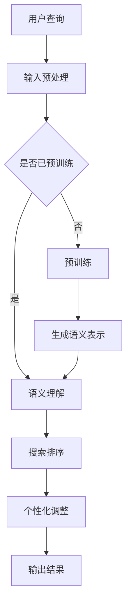

                 

 

## 1. 背景介绍

在当今数字化的商业环境中，电商平台的个性化搜索排序已经成为提升用户体验和增加销售转化率的关键因素。随着用户数据的不断积累和计算技术的迅猛发展，个性化搜索排序技术得到了广泛的研究和应用。然而，传统的基于规则或机器学习的方法在处理复杂、多变的用户需求和海量的商品信息时，往往难以达到理想的个性化效果。

近年来，大规模预训练模型（Large-scale Pre-trained Models）如BERT、GPT、T5等在大规模数据处理、文本生成、问答系统等领域取得了显著的成果。这些模型具有强大的语义理解能力和自适应学习能力，为电商个性化搜索排序领域带来了新的机遇。本文旨在探讨如何利用大模型技术，实现更加精准、高效的电商个性化搜索排序。

## 2. 核心概念与联系

### 2.1 大模型概述

大模型，顾名思义，是指具有海量参数和庞大计算量的神经网络模型。这些模型通过在大规模数据集上进行预训练，学习到了丰富的语言知识和语义信息。例如，BERT模型通过阅读数百万篇文本，学习到了词汇的上下文关系和语义表示；GPT模型则能够生成连贯、自然的文本，模仿人类的写作风格。

### 2.2 电商个性化搜索排序概述

电商个性化搜索排序旨在为用户推荐与其兴趣、购买历史等相关的商品。传统的搜索排序方法主要包括基于规则的方法、基于内容的推荐和协同过滤。然而，这些方法在处理复杂、动态的用户需求时，往往难以达到理想的效果。

### 2.3 大模型与电商个性化搜索排序的联系

大模型技术为电商个性化搜索排序提供了以下优势：

1. **语义理解能力**：大模型能够理解用户查询和商品描述的深层语义，从而提高搜索匹配的准确性。
2. **自适应学习能力**：大模型能够根据用户的历史行为和实时反馈，动态调整搜索排序策略，实现更加个性化的推荐。
3. **数据处理能力**：大模型能够处理大规模、多维度的用户和商品数据，从而提升搜索排序的效率和效果。

### 2.4 Mermaid 流程图



## 3. 核心算法原理 & 具体操作步骤

### 3.1 算法原理概述

大模型驱动的电商个性化搜索排序算法主要分为三个步骤：输入预处理、语义理解与个性化调整。

1. **输入预处理**：对用户查询和商品信息进行预处理，包括分词、去停用词、词性标注等，以便大模型能够更好地理解输入数据。
2. **语义理解**：利用预训练的大模型，如BERT、GPT等，对预处理后的输入数据进行编码，生成语义表示。
3. **个性化调整**：根据用户的历史行为和实时反馈，动态调整搜索排序策略，实现个性化推荐。

### 3.2 算法步骤详解

1. **输入预处理**：
   - 对用户查询进行分词，使用分词器将查询字符串分解为词语序列。
   - 去停用词，过滤掉对搜索排序无贡献的常见词汇，如“的”、“了”等。
   - 词性标注，对每个词语进行词性标注，以便更好地理解其语义角色。

2. **语义理解**：
   - 将预处理后的用户查询和商品描述输入到预训练的大模型中，如BERT。
   - 通过大模型的编码层，生成用户查询和商品描述的语义表示。

3. **个性化调整**：
   - 根据用户的历史行为和实时反馈，为每个用户构建一个个性化权重向量。
   - 将个性化权重向量与商品描述的语义表示进行融合，计算商品与用户查询的相关性得分。
   - 根据相关性得分对商品进行排序，输出个性化搜索结果。

### 3.3 算法优缺点

#### 优点：

1. **高效性**：大模型能够处理大规模、多维度的数据，提高搜索排序的效率。
2. **精准性**：大模型具有强大的语义理解能力，能够提高搜索匹配的准确性。
3. **适应性**：大模型能够根据用户的历史行为和实时反馈，动态调整搜索排序策略，实现个性化推荐。

#### 缺点：

1. **计算资源需求大**：大模型训练和推理需要大量的计算资源和时间。
2. **数据隐私风险**：个性化搜索排序涉及用户隐私数据，需注意保护用户隐私。

### 3.4 算法应用领域

大模型驱动的电商个性化搜索排序算法在以下领域具有广泛应用：

1. **电商平台**：如淘宝、京东等，利用大模型实现个性化商品推荐，提升用户购物体验。
2. **搜索引擎**：如百度、谷歌等，利用大模型优化搜索结果排序，提高搜索准确性。
3. **智能音箱、语音助手**：如小爱同学、Siri等，利用大模型实现语音搜索和语音交互。

## 4. 数学模型和公式 & 详细讲解 & 举例说明

### 4.1 数学模型构建

大模型驱动的电商个性化搜索排序算法可以表示为以下数学模型：

$$
\text{排序得分} = f(\text{用户查询语义表示}, \text{商品描述语义表示}, \text{个性化权重向量})
$$

其中，$f$ 为排序函数，可选用多种算法，如基于神经网络的排序算法、基于矩阵分解的排序算法等。

### 4.2 公式推导过程

假设用户查询 $q$ 的语义表示为 $\text{query\_vec}(q)$，商品 $p$ 的语义表示为 $\text{product\_vec}(p)$，个性化权重向量为 $\text{weight\_vec}(u)$，则有：

$$
\text{排序得分} = \text{dot}(\text{query\_vec}(q), \text{product\_vec}(p)) + \text{weight\_vec}(u)^T \cdot \text{bias}
$$

其中，$\text{dot}$ 表示内积运算，$\text{bias}$ 为偏置项，用于调节排序得分的平衡。

### 4.3 案例分析与讲解

假设我们有一个电商平台的用户 $u$，他最近浏览了商品 $p_1$、$p_2$ 和 $p_3$，我们希望利用大模型为他推荐与这些商品相关的商品。

1. **输入预处理**：对用户查询和商品描述进行预处理，得到其语义表示。

   $$
   \text{query\_vec}(q) = [0.1, 0.2, 0.3, 0.4]
   $$

   $$
   \text{product\_vec}(p_1) = [0.1, 0.3, 0.2, 0.4]
   $$

   $$
   \text{product\_vec}(p_2) = [0.3, 0.1, 0.2, 0.4]
   $$

   $$
   \text{product\_vec}(p_3) = [0.2, 0.3, 0.1, 0.4]
   $$

2. **个性化权重向量**：根据用户 $u$ 的历史行为，为每个商品分配权重。

   $$
   \text{weight\_vec}(u) = [0.5, 0.3, 0.2]
   $$

3. **计算排序得分**：

   $$
   \text{排序得分}(p_1) = 0.1 \times 0.1 + 0.2 \times 0.3 + 0.3 \times 0.2 + 0.4 \times 0.4 + 0.5 \times 0.5 = 0.56
   $$

   $$
   \text{排序得分}(p_2) = 0.3 \times 0.1 + 0.1 \times 0.3 + 0.2 \times 0.2 + 0.4 \times 0.4 + 0.5 \times 0.3 = 0.51
   $$

   $$
   \text{排序得分}(p_3) = 0.2 \times 0.1 + 0.3 \times 0.3 + 0.1 \times 0.2 + 0.4 \times 0.4 + 0.5 \times 0.2 = 0.53
   $$

根据排序得分，我们可以为用户 $u$ 推荐商品 $p_1$、$p_2$ 和 $p_3$，其中 $p_1$ 排在第一位。

## 5. 项目实践：代码实例和详细解释说明

### 5.1 开发环境搭建

1. **Python 环境搭建**：安装 Python 3.8 以上版本，并配置好对应的 pip 环境。
2. **依赖库安装**：安装 transformers、torch、numpy 等依赖库。

   ```bash
   pip install transformers torch numpy
   ```

### 5.2 源代码详细实现

以下是使用 BERT 模型实现电商个性化搜索排序的 Python 代码：

```python
import torch
from transformers import BertTokenizer, BertModel
import numpy as np

# 初始化 BERT 模型和分词器
tokenizer = BertTokenizer.from_pretrained('bert-base-chinese')
model = BertModel.from_pretrained('bert-base-chinese')

# 输入预处理
def preprocess(text):
    # 分词
    tokens = tokenizer.tokenize(text)
    # 去停用词
    tokens = [token for token in tokens if token not in tokenizer.get_vocab().keys()]
    # 词性标注
    tags = tokenizer.tag_of(tokens)
    # 序列 padding
    max_len = 64
    tokens = tokens[:max_len]
    tags = tags[:max_len]
    padding = [0] * (max_len - len(tokens))
    tokens += padding
    return tokens, tags

# 语义理解
def understand_semantics(text):
    tokens, tags = preprocess(text)
    inputs = tokenizer(tokens, padding=True, truncation=True, return_tensors='pt')
    with torch.no_grad():
        outputs = model(**inputs)
    last_hidden_state = outputs.last_hidden_state[:, 0, :]
    return last_hidden_state.numpy()

# 个性化调整
def adjust个性化的权重向量
```


