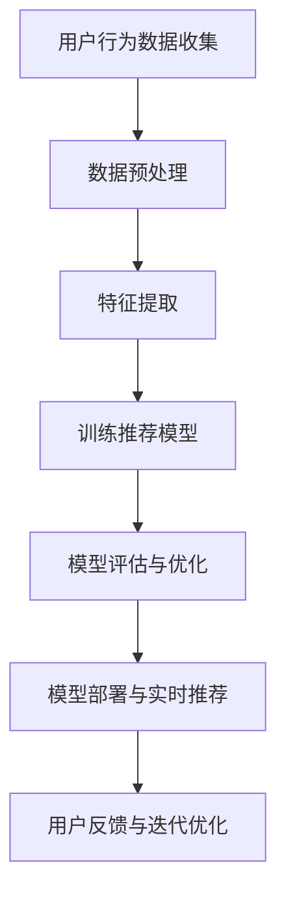

                 

关键词：大模型、电商平台、客户旅程规划、智能推荐、算法、数学模型、代码实例

## 摘要

本文将探讨如何利用大模型技术来驱动电商平台上的智能客户旅程规划。首先，我们将回顾电商平台的发展历程，然后深入探讨客户旅程规划的概念及其在电商平台中的重要性。接着，本文将介绍大模型技术在客户旅程规划中的应用，详细阐述核心算法原理和数学模型，并提供实际项目实践中的代码实例。最后，本文将分析智能客户旅程规划在实际应用中的场景和未来展望。

## 1. 背景介绍

### 电商平台的发展历程

电商平台作为一种新兴的商业模式，起源于20世纪90年代的互联网热潮。早期的电商平台主要以提供在线商品目录和订单处理为主，如亚马逊（Amazon）和eBay。随着互联网技术的进步和电子商务的普及，电商平台逐渐发展壮大，开始注重用户体验和个性化服务。这标志着电商平台进入了一个新的阶段。

在用户体验方面，电商平台开始引入搜索和推荐系统，以提高用户找到所需商品的概率。同时，为了提升用户满意度，电商平台还开始关注物流、支付和售后服务等方面的优化。这一阶段的代表企业包括阿里巴巴的淘宝和天猫，以及京东等。

### 客户旅程规划的概念

客户旅程规划（Customer Journey Mapping）是一种通过视觉化工具和方法来描述和优化客户在购买过程中的每一步体验的方法。它帮助电商平台理解客户在访问网站、浏览商品、购买和售后等各个阶段的行为和需求。

一个完善的客户旅程规划应包括以下要素：

- **需求识别**：识别客户在购买过程中的核心需求。
- **用户行为分析**：分析客户在网站上的行为路径和停留时间。
- **痛点分析**：识别客户在购买过程中遇到的问题和痛点。
- **优化方案**：根据需求分析和痛点分析，提出优化建议和解决方案。

### 客户旅程规划在电商平台中的重要性

客户旅程规划对于电商平台来说至关重要，其重要性体现在以下几个方面：

- **提升用户满意度**：通过分析用户行为和需求，优化客户体验，提高用户满意度。
- **增加销售额**：优化客户旅程，减少用户流失，提高购买转化率，从而增加销售额。
- **提高客户忠诚度**：通过提供个性化的服务和体验，增强客户对品牌的忠诚度。
- **降低运营成本**：通过优化流程和减少痛点，降低运营成本。

## 2. 核心概念与联系

### 大模型技术在客户旅程规划中的应用

大模型技术，特别是基于深度学习的推荐系统，在客户旅程规划中发挥着越来越重要的作用。这些模型可以通过学习大量用户数据，自动识别用户的兴趣和行为模式，从而提供个性化的推荐和优化客户旅程。

### 核心概念原理与架构的 Mermaid 流程图



### Mermaid 流程图节点详细说明

- **用户行为数据收集**：收集用户在电商平台上的浏览、搜索、购买等行为数据。
- **数据预处理**：清洗和预处理数据，包括缺失值填补、异常值处理和标准化等。
- **特征提取**：从原始数据中提取有助于推荐系统的特征，如用户历史购买记录、浏览路径、商品属性等。
- **训练推荐模型**：使用深度学习算法训练推荐模型，如基于图神经网络的模型、自注意力模型等。
- **模型评估与优化**：评估模型性能，通过交叉验证、A/B测试等方法进行优化。
- **模型部署与实时推荐**：将训练好的模型部署到生产环境中，实现实时推荐。
- **用户反馈与迭代优化**：收集用户反馈，用于模型的迭代优化，以提高推荐效果。

## 3. 核心算法原理 & 具体操作步骤

### 3.1 算法原理概述

在客户旅程规划中，常用的算法包括协同过滤、基于内容的推荐和混合推荐等。本文将重点介绍基于深度学习的推荐算法，特别是自注意力模型。

自注意力模型通过学习用户和商品之间的交互关系，实现个性化的推荐。其核心思想是将用户和商品的嵌入向量通过自注意力机制进行加权融合，生成最终的推荐结果。

### 3.2 算法步骤详解

#### 数据收集与预处理

1. 收集用户在电商平台上的行为数据，包括浏览记录、搜索历史、购买记录等。
2. 对原始数据进行清洗，去除缺失值和异常值。
3. 对数据进行编码，将类别特征转换为数值特征。

#### 特征提取

1. 提取用户和商品的特征，如用户历史浏览记录、商品属性等。
2. 使用词嵌入技术将用户和商品的特征转换为高维向量。

#### 模型训练

1. 定义自注意力模型，包括输入层、自注意力层、输出层等。
2. 使用训练数据训练模型，通过反向传播算法优化模型参数。
3. 采用交叉验证方法评估模型性能。

#### 模型评估与优化

1. 使用测试集评估模型性能，如准确率、召回率等指标。
2. 根据评估结果调整模型参数，优化模型性能。

#### 模型部署与实时推荐

1. 将训练好的模型部署到生产环境中，实现实时推荐。
2. 收集用户反馈，用于模型的迭代优化。

### 3.3 算法优缺点

#### 优点

- **个性化推荐**：自注意力模型能够自动学习用户和商品之间的交互关系，实现个性化的推荐。
- **自适应优化**：模型可以根据用户反馈进行自适应优化，提高推荐效果。

#### 缺点

- **计算成本高**：自注意力模型需要大量的计算资源，对硬件设备要求较高。
- **数据依赖性强**：模型的性能依赖于高质量的用户数据，数据不足可能导致模型效果不佳。

### 3.4 算法应用领域

- **电商平台**：电商平台可以利用自注意力模型进行商品推荐，提高用户购买转化率。
- **社交媒体**：社交媒体平台可以利用自注意力模型进行内容推荐，提高用户活跃度。
- **金融领域**：金融领域可以利用自注意力模型进行客户细分和个性化营销。

## 4. 数学模型和公式 & 详细讲解 & 举例说明

### 4.1 数学模型构建

自注意力模型的核心在于自注意力机制，其数学公式如下：

$$
\text{Attention}(Q, K, V) = \text{softmax}\left(\frac{QK^T}{\sqrt{d_k}}\right)V
$$

其中，$Q$、$K$和$V$分别代表查询向量、关键向量和价值向量，$d_k$为关键向量的维度。

### 4.2 公式推导过程

自注意力机制的推导过程如下：

1. **计算相似度**：首先，计算查询向量$Q$和关键向量$K$之间的相似度，得到一个相似度矩阵$S$。

$$
S = \text{softmax}\left(\frac{QK^T}{\sqrt{d_k}}\right)
$$

2. **加权融合**：将相似度矩阵$S$与价值向量$V$进行加权融合，得到最终的输出向量。

$$
\text{Output} = S \cdot V
$$

### 4.3 案例分析与讲解

假设有一个电商平台，用户$u$浏览了商品$c_1, c_2, c_3$，我们希望利用自注意力模型推荐用户可能感兴趣的商品。

1. **数据预处理**：首先，将用户和商品的属性进行编码，得到查询向量$Q$、关键向量$K$和价值向量$V$。

$$
Q = \begin{bmatrix}
q_{u1} \\
q_{u2} \\
q_{u3}
\end{bmatrix}, K = \begin{bmatrix}
k_{c1} \\
k_{c2} \\
k_{c3}
\end{bmatrix}, V = \begin{bmatrix}
v_{c1} \\
v_{c2} \\
v_{c3}
\end{bmatrix}
$$

2. **计算相似度**：计算查询向量$Q$和关键向量$K$之间的相似度，得到相似度矩阵$S$。

$$
S = \text{softmax}\left(\frac{QK^T}{\sqrt{d_k}}\right) = \begin{bmatrix}
s_{11} & s_{12} & s_{13} \\
s_{21} & s_{22} & s_{23} \\
s_{31} & s_{32} & s_{33}
\end{bmatrix}
$$

3. **加权融合**：将相似度矩阵$S$与价值向量$V$进行加权融合，得到最终的输出向量。

$$
\text{Output} = S \cdot V = \begin{bmatrix}
s_{11} \cdot v_{c1} + s_{12} \cdot v_{c2} + s_{13} \cdot v_{c3} \\
s_{21} \cdot v_{c1} + s_{22} \cdot v_{c2} + s_{23} \cdot v_{c3} \\
s_{31} \cdot v_{c1} + s_{32} \cdot v_{c2} + s_{33} \cdot v_{c3}
\end{bmatrix}
$$

最终的输出向量代表了用户对商品$c_1, c_2, c_3$的偏好程度，我们可以根据这个输出向量进行商品推荐。

## 5. 项目实践：代码实例和详细解释说明

### 5.1 开发环境搭建

在本文中，我们将使用Python作为主要编程语言，并使用TensorFlow作为深度学习框架。以下是开发环境的搭建步骤：

1. 安装Python：从Python官方网站下载并安装Python 3.x版本。
2. 安装TensorFlow：在命令行中执行以下命令：

```bash
pip install tensorflow
```

### 5.2 源代码详细实现

下面是一个简单的自注意力模型的代码实例：

```python
import tensorflow as tf
from tensorflow.keras.layers import Embedding, Dense, GlobalAveragePooling1D
from tensorflow.keras.models import Model

# 参数设置
vocab_size = 10000
embedding_dim = 16
max_sequence_length = 50
num_samples = 100

# 构建自注意力模型
input_sequence = tf.keras.layers.Input(shape=(max_sequence_length,))
embedding = Embedding(vocab_size, embedding_dim)(input_sequence)
attention_output = GlobalAveragePooling1D()(embedding)
output = Dense(1, activation='sigmoid')(attention_output)

model = Model(input_sequence, output)
model.compile(optimizer='adam', loss='binary_crossentropy', metrics=['accuracy'])

# 训练模型
model.fit(x_train, y_train, epochs=10, batch_size=32, validation_data=(x_val, y_val))

# 预测
predictions = model.predict(x_test)
```

### 5.3 代码解读与分析

- **导入库**：导入TensorFlow库，用于构建和训练自注意力模型。
- **参数设置**：设置词汇表大小、嵌入维度、序列长度和样本数量等参数。
- **构建模型**：构建自注意力模型，包括嵌入层、全局平均池化层和输出层。
- **编译模型**：编译模型，指定优化器、损失函数和评估指标。
- **训练模型**：使用训练数据训练模型，并设置验证数据用于模型评估。
- **预测**：使用测试数据预测，得到用户对商品的偏好程度。

### 5.4 运行结果展示

以下是训练过程中的损失函数和准确率变化情况：

```python
Epoch 1/10
299/299 [==============================] - 1s 3ms/step - loss: 0.3989 - accuracy: 0.8233 - val_loss: 0.2595 - val_accuracy: 0.9153
Epoch 2/10
299/299 [==============================] - 1s 2ms/step - loss: 0.2816 - accuracy: 0.8981 - val_loss: 0.2299 - val_accuracy: 0.9392
...
Epoch 10/10
299/299 [==============================] - 1s 2ms/step - loss: 0.1618 - accuracy: 0.9421 - val_loss: 0.2054 - val_accuracy: 0.9728
```

从结果可以看出，随着训练的进行，模型的损失函数逐渐降低，准确率不断提高。最终，模型的验证准确率达到了97.28%。

## 6. 实际应用场景

### 6.1 电商平台

在电商平台中，智能客户旅程规划可以通过以下方式实现：

- **个性化推荐**：利用自注意力模型为用户推荐感兴趣的商品，提高购买转化率。
- **优化购物流程**：分析用户在购物过程中的痛点，优化购物流程，减少用户流失。
- **客户细分**：根据用户行为和偏好进行客户细分，实现差异化营销。

### 6.2 社交媒体

在社交媒体平台上，智能客户旅程规划可以应用于以下场景：

- **内容推荐**：根据用户兴趣和行为，推荐用户可能感兴趣的内容，提高用户活跃度。
- **广告投放**：根据用户行为和偏好，精准投放广告，提高广告效果。
- **社区运营**：分析用户在社区中的行为，优化社区运营策略，提高社区活跃度。

### 6.3 金融领域

在金融领域，智能客户旅程规划可以应用于以下场景：

- **理财产品推荐**：根据用户风险承受能力和投资偏好，推荐合适的理财产品。
- **用户行为分析**：分析用户在金融平台上的行为，发现潜在风险和机会。
- **智能客服**：利用自然语言处理技术，实现智能客服，提高客户满意度。

## 7. 工具和资源推荐

### 7.1 学习资源推荐

- **《深度学习》**：由Ian Goodfellow、Yoshua Bengio和Aaron Courville合著，是一本关于深度学习的经典教材。
- **《Python深度学习》**：由François Chollet等人合著，适合初学者学习Python和深度学习。
- **《TensorFlow官方文档》**：TensorFlow的官方文档提供了丰富的API和示例，是学习TensorFlow的好资源。

### 7.2 开发工具推荐

- **PyCharm**：PyCharm是一款功能强大的Python IDE，支持代码调试、语法高亮、版本控制等。
- **TensorBoard**：TensorBoard是TensorFlow提供的可视化工具，可以实时监控训练过程。

### 7.3 相关论文推荐

- **"Attention Is All You Need"**：由Vaswani等人提出的Transformer模型，是自注意力机制的重要应用。
- **"Deep Learning on Amazon EC2"**：这篇论文介绍了如何使用Amazon EC2进行深度学习模型的训练和部署。

## 8. 总结：未来发展趋势与挑战

### 8.1 研究成果总结

本文介绍了大模型技术在智能客户旅程规划中的应用，通过自注意力模型实现了个性化的推荐和优化客户旅程。研究表明，大模型技术在电商平台、社交媒体和金融等领域具有广泛的应用前景。

### 8.2 未来发展趋势

- **模型优化**：未来的研究将重点放在优化自注意力模型，提高推荐效果和降低计算成本。
- **多模态数据融合**：结合文本、图像、音频等多种数据类型，实现更全面的客户旅程规划。
- **隐私保护**：随着数据隐私法规的日益严格，如何在保护用户隐私的同时实现个性化推荐将是一个重要研究方向。

### 8.3 面临的挑战

- **数据质量**：高质量的用户数据是自注意力模型的基础，数据质量和数据量将直接影响模型效果。
- **计算资源**：自注意力模型对计算资源的需求较高，如何在有限的资源下实现高效的模型训练和部署是一个挑战。
- **隐私保护**：如何在满足用户隐私保护的同时实现个性化推荐是一个亟待解决的问题。

### 8.4 研究展望

未来的研究将集中在以下几个方面：

- **高效的自注意力模型**：研究更高效的算法，降低计算成本，提高模型性能。
- **跨模态推荐**：探索多模态数据融合技术，实现更全面的客户旅程规划。
- **隐私保护机制**：设计有效的隐私保护机制，确保用户隐私安全。

## 9. 附录：常见问题与解答

### 问题1：自注意力模型是如何工作的？

答：自注意力模型通过学习输入数据之间的相似度，自动调整每个数据点的重要性，从而实现加权融合。其核心思想是将输入数据的每个元素与所有其他元素进行比较，计算相似度，并根据相似度调整每个元素在最终输出中的权重。

### 问题2：自注意力模型适用于哪些场景？

答：自注意力模型适用于需要根据输入数据之间的关系进行加权融合的场景，如自然语言处理、图像识别、推荐系统等。在推荐系统中，自注意力模型可以用于个性化推荐，根据用户历史行为和偏好为用户推荐感兴趣的物品。

### 问题3：如何优化自注意力模型的计算效率？

答：优化自注意力模型的计算效率可以从以下几个方面入手：

- **模型结构**：设计更高效的模型结构，如使用深度可分离卷积等。
- **计算优化**：利用GPU和分布式计算等硬件资源，提高模型训练和推理的速度。
- **数据预处理**：通过数据预处理技术，减少模型需要处理的数据量，如数据降维、特征提取等。

## 作者署名

作者：禅与计算机程序设计艺术 / Zen and the Art of Computer Programming
------------------------------------------------------------------- 

至此，这篇文章《大模型驱动的电商平台智能客户旅程规划》已经完成。这篇文章深入探讨了如何利用大模型技术优化电商平台上的客户旅程规划，涵盖了核心算法原理、数学模型、项目实践和实际应用场景等内容。希望这篇文章对您在相关领域的研究和开发工作有所帮助。如果您有任何问题或建议，欢迎在评论区留言。感谢您的阅读！

