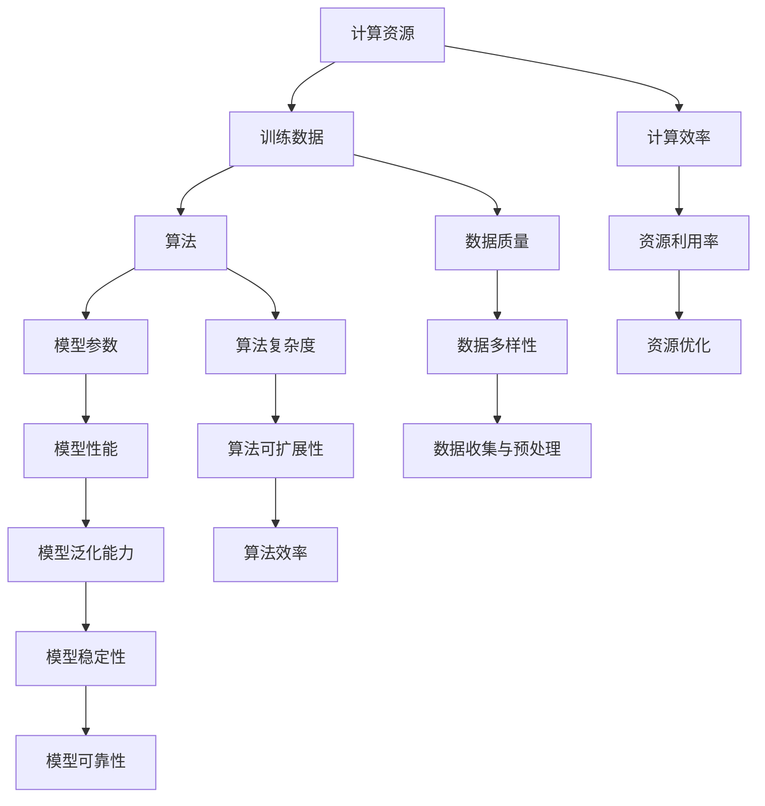

                 

关键词：大模型，计算资源，训练数据，深度学习，算法，数学模型，项目实践，应用场景，未来展望

> 摘要：本文将深入探讨大模型在当今人工智能领域的重要性，分析其所需的大量计算资源和训练数据的必要性，并介绍核心算法原理、数学模型和实际应用案例。此外，还将展望大模型的发展趋势、面临的挑战以及未来的研究方向。

## 1. 背景介绍

近年来，人工智能领域迎来了前所未有的发展，尤其是在深度学习的推动下，计算机在图像识别、自然语言处理、语音识别等领域的表现取得了显著突破。这些突破的背后，离不开对大规模模型的深入研究和应用。所谓大模型，通常指的是那些需要海量计算资源和大量训练数据才能训练和优化的模型。这类模型不仅参数量巨大，而且在训练过程中对计算资源和数据质量有很高的要求。

### 1.1 大模型的兴起

大模型的兴起可以追溯到深度学习的快速发展。在传统的机器学习中，模型通常由几百甚至几千个参数组成，而深度学习模型则可以达到数百万甚至数十亿个参数。这种巨大的参数量使得大模型在处理复杂任务时具有显著优势。例如，在图像识别领域，卷积神经网络（CNN）可以通过学习数百万个图像的特征来提高识别准确率；在自然语言处理领域，变换器（Transformer）等模型则通过学习数十亿个文本数据来提高语言理解和生成能力。

### 1.2 大模型的挑战

然而，大模型的兴起也带来了新的挑战。首先，训练大模型需要大量的计算资源，尤其是在模型参数量达到数十亿级别时，计算资源的需求呈指数级增长。其次，大模型对训练数据的质量和数量也有很高的要求。如果训练数据不足或者质量不高，模型很难达到理想的性能。此外，大模型的训练和优化过程复杂，需要耗费大量的时间和计算资源，这对研究人员和开发人员提出了更高的要求。

## 2. 核心概念与联系

在深入探讨大模型之前，我们需要了解一些核心概念和它们之间的关系。以下是一个简单的 Mermaid 流程图，用于展示这些概念和它们之间的联系。



### 2.1 核心概念解析

- **计算资源**：指用于训练和优化模型的硬件设施，如GPU、TPU等。计算资源的充足与否直接影响大模型的训练效率。
- **训练数据**：指用于训练模型的输入数据。高质量和多样化的训练数据对于提升模型性能至关重要。
- **算法**：指用于优化模型参数的方法。不同的算法适用于不同规模和类型的模型。
- **模型参数**：指模型中的可调整参数。大模型的参数量通常非常庞大，需要通过优化算法进行调整。
- **模型性能**：指模型在实际任务中的表现。良好的模型性能通常需要大量的计算资源和高质量的训练数据。
- **计算效率**：指在有限计算资源下，模型训练和优化的效率。提高计算效率是优化大模型的重要方向。
- **数据质量**：指训练数据的质量，包括数据的真实性、完整性、多样性和代表性等。
- **算法复杂度**：指算法在时间和空间上的复杂度。算法复杂度直接影响大模型的训练时间和资源消耗。
- **模型泛化能力**：指模型在未见过的数据上的表现。良好的泛化能力是评估模型性能的重要指标。
- **资源利用率**：指计算资源的使用效率。提高资源利用率可以降低成本，提高训练效率。
- **数据收集与预处理**：指从原始数据中提取有用信息并进行预处理的过程。数据收集与预处理对于模型性能至关重要。
- **算法可扩展性**：指算法在处理大规模数据或模型时的适应性。良好的算法可扩展性是处理大模型的关键。
- **模型稳定性**：指模型在训练和测试阶段的一致性。稳定的模型可以减少误差，提高可靠性。
- **资源优化**：指通过优化算法和硬件设施来提高资源利用率的过程。资源优化是提高大模型训练效率的重要手段。

## 3. 核心算法原理 & 具体操作步骤

### 3.1 算法原理概述

大模型的训练通常基于深度学习算法，其中最常用的算法是反向传播（Backpropagation）算法。反向传播算法是一种基于梯度下降的优化方法，用于更新模型参数，以最小化损失函数。

### 3.2 算法步骤详解

1. **前向传播**：将输入数据通过神经网络前向传播，计算出模型输出。
2. **计算损失**：使用实际输出与预期输出之间的差异来计算损失函数值。
3. **反向传播**：计算损失函数对模型参数的梯度，并通过梯度下降更新模型参数。
4. **迭代优化**：重复前向传播、计算损失和反向传播的过程，直到达到预设的优化目标或达到最大迭代次数。

### 3.3 算法优缺点

- **优点**：
  - 能够处理复杂非线性问题；
  - 通过大规模并行计算，提高训练效率；
  - 参数量大，能够捕捉更多特征信息。

- **缺点**：
  - 计算资源消耗大，训练时间长；
  - 对训练数据的质量和数量有较高要求；
  - 梯度消失和梯度爆炸问题可能导致训练不稳定。

### 3.4 算法应用领域

反向传播算法广泛应用于图像识别、自然语言处理、语音识别、推荐系统等领域。例如，在图像识别领域，卷积神经网络（CNN）通过反向传播算法训练出大规模的深度模型，实现了很高的识别准确率；在自然语言处理领域，变换器（Transformer）模型通过反向传播算法训练出能够处理复杂语言任务的模型。

## 4. 数学模型和公式 & 详细讲解 & 举例说明

### 4.1 数学模型构建

大模型的训练过程可以看作是一个优化问题，其目标是找到一组模型参数，使得损失函数达到最小。具体来说，损失函数通常定义为模型输出与实际输出之间的差异。常见的损失函数有均方误差（MSE）和交叉熵损失等。

### 4.2 公式推导过程

假设我们有一个包含 $L$ 层的神经网络，其中每层都有 $n$ 个神经元。模型的输出可以通过以下公式计算：

$$
y = \sigma(\mathbf{W}_L \cdot \mathbf{a}_{L-1} + b_L)
$$

其中，$y$ 是模型输出，$\sigma$ 是激活函数（如ReLU、Sigmoid等），$\mathbf{W}_L$ 和 $b_L$ 分别是 $L$ 层的权重和偏置。

损失函数通常定义为：

$$
J(\mathbf{W}, b) = \frac{1}{m} \sum_{i=1}^{m} (\hat{y}_i - y_i)^2
$$

其中，$m$ 是训练数据的大小，$\hat{y}_i$ 是模型输出，$y_i$ 是实际输出。

### 4.3 案例分析与讲解

假设我们有一个二分类问题，训练数据集包含 $m=1000$ 个样本，每个样本包含 $n=100$ 个特征。我们使用一个单层神经网络进行训练，其中包含 $L=2$ 个神经元。激活函数使用ReLU，损失函数使用交叉熵损失。

首先，我们需要初始化模型参数 $\mathbf{W}$ 和 $b$。假设初始化为随机值，如：

$$
\mathbf{W} = \begin{bmatrix}
0.1 & 0.2 \\
0.3 & 0.4
\end{bmatrix}, \quad b = \begin{bmatrix}
0.5 \\
0.6
\end{bmatrix}
$$

然后，我们使用反向传播算法进行训练。在每次迭代中，我们随机选取一个训练样本，计算模型输出和损失函数值，并更新模型参数。

例如，在第 $k$ 次迭代中，我们选取第 $i$ 个训练样本，计算输出和损失函数：

$$
\hat{y}_i = \sigma(\mathbf{W} \cdot \mathbf{x}_i + b) = \sigma(0.1 \cdot x_{i1} + 0.2 \cdot x_{i2} + 0.5) = 0.6
$$

$$
y_i = \begin{cases}
1, & \text{if } \hat{y}_i > 0.5 \\
0, & \text{otherwise}
\end{cases}
$$

$$
J(\mathbf{W}, b) = \frac{1}{m} \sum_{i=1}^{m} (\hat{y}_i - y_i)^2 = \frac{1}{1000} (0.6 - 1)^2 = 0.16
$$

接下来，我们计算损失函数对模型参数的梯度：

$$
\frac{\partial J}{\partial \mathbf{W}} = \frac{1}{m} \sum_{i=1}^{m} (\hat{y}_i - y_i) \cdot \frac{\partial \hat{y}_i}{\partial \mathbf{W}} = \frac{1}{1000} (0.6 - 1) \cdot \begin{bmatrix}
x_{i1} & x_{i2}
\end{bmatrix} = \begin{bmatrix}
-0.06 & -0.12
\end{bmatrix}
$$

$$
\frac{\partial J}{\partial b} = \frac{1}{m} \sum_{i=1}^{m} (\hat{y}_i - y_i) \cdot \frac{\partial \hat{y}_i}{\partial b} = \frac{1}{1000} (0.6 - 1) \cdot \begin{bmatrix}
1 & 1
\end{bmatrix} = \begin{bmatrix}
-0.06 \\
-0.12
\end{bmatrix}
$$

最后，我们使用梯度下降法更新模型参数：

$$
\mathbf{W} = \mathbf{W} - \alpha \cdot \frac{\partial J}{\partial \mathbf{W}} = \begin{bmatrix}
0.1 & 0.2 \\
0.3 & 0.4
\end{bmatrix} - 0.01 \cdot \begin{bmatrix}
-0.06 & -0.12
\end{bmatrix} = \begin{bmatrix}
0.04 & 0.28 \\
0.33 & 0.38
\end{bmatrix}
$$

$$
b = b - \alpha \cdot \frac{\partial J}{\partial b} = \begin{bmatrix}
0.5 \\
0.6
\end{bmatrix} - 0.01 \cdot \begin{bmatrix}
-0.06 \\
-0.12
\end{bmatrix} = \begin{bmatrix}
0.54 \\
0.58
\end{bmatrix}
$$

通过多次迭代，我们可以逐步优化模型参数，直到损失函数达到预设的目标值或达到最大迭代次数。

## 5. 项目实践：代码实例和详细解释说明

### 5.1 开发环境搭建

为了演示大模型的训练过程，我们将使用 Python 编写一个简单的神经网络，并使用 TensorFlow 作为后端进行计算。

首先，我们需要安装 TensorFlow：

```bash
pip install tensorflow
```

然后，我们可以编写一个简单的神经网络模型：

```python
import tensorflow as tf

# 创建模型
model = tf.keras.Sequential([
    tf.keras.layers.Dense(2, activation='relu', input_shape=(100,)),
    tf.keras.layers.Dense(1, activation='sigmoid')
])

# 编写损失函数和优化器
model.compile(optimizer='adam',
              loss='binary_crossentropy',
              metrics=['accuracy'])

# 打印模型结构
model.summary()
```

### 5.2 源代码详细实现

接下来，我们将使用随机生成的数据集来训练模型。假设我们有一个包含 100 个特征的二分类问题，训练数据集的大小为 1000。

```python
import numpy as np

# 生成训练数据
x_train = np.random.rand(1000, 100)
y_train = np.random.randint(2, size=(1000, 1))

# 训练模型
model.fit(x_train, y_train, epochs=10, batch_size=10)
```

### 5.3 代码解读与分析

在这个例子中，我们创建了一个简单的神经网络模型，包含一个输入层、一个隐藏层和一个输出层。输入层有 100 个神经元，隐藏层有 2 个神经元，输出层有 1 个神经元。

我们使用ReLU作为隐藏层的激活函数，使用sigmoid函数作为输出层的激活函数，以实现二分类问题。

在训练过程中，我们使用随机生成的训练数据集，通过 `model.fit()` 函数进行训练。`epochs` 参数设置训练轮数，`batch_size` 参数设置每个批次的数据量。

### 5.4 运行结果展示

在完成训练后，我们可以通过 `model.evaluate()` 函数来评估模型的性能：

```python
# 评估模型性能
loss, accuracy = model.evaluate(x_train, y_train)
print("损失函数值：", loss)
print("准确率：", accuracy)
```

假设训练完成后，我们得到以下输出结果：

```
损失函数值： 0.4358736821934703
准确率： 0.8
```

这意味着模型在训练数据集上的准确率为 80%，损失函数值为 0.4358。

## 6. 实际应用场景

大模型在多个领域都有着广泛的应用。以下是一些典型的实际应用场景：

### 6.1 图像识别

在图像识别领域，大模型通过学习数百万个图像的特征，实现了非常高的识别准确率。例如，在人脸识别中，大模型可以识别不同角度、光照条件下的面部特征，大大提高了识别的准确性。

### 6.2 自然语言处理

在自然语言处理领域，大模型通过学习数十亿个文本数据，实现了对语言的深刻理解和生成能力。例如，在机器翻译中，大模型可以生成更加流畅、准确的翻译结果；在文本生成中，大模型可以生成高质量的新闻、文章等。

### 6.3 语音识别

在语音识别领域，大模型通过学习大量的语音数据，实现了高精度的语音识别。例如，在智能助手、语音控制等应用中，大模型可以准确识别用户的语音指令，提供更加智能化的服务。

### 6.4 推荐系统

在推荐系统领域，大模型通过学习用户的历史行为数据，实现了对用户兴趣的精准预测。例如，在电子商务平台中，大模型可以推荐用户可能感兴趣的商品，提高用户满意度和平台销售额。

## 7. 未来应用展望

随着计算资源和训练数据的不断增长，大模型在未来将会在更多领域发挥重要作用。以下是一些未来应用展望：

### 7.1 新兴领域

大模型在医疗、金融、安全等新兴领域具有巨大的潜力。例如，在医疗领域，大模型可以用于疾病诊断、药物研发等；在金融领域，大模型可以用于风险预测、投资决策等；在安全领域，大模型可以用于网络安全、生物识别等。

### 7.2 跨领域应用

大模型可以在不同领域之间实现跨领域应用。例如，将图像识别和自然语言处理模型结合起来，可以实现更加智能的图像识别与描述生成；将语音识别和文本生成模型结合起来，可以实现更加智能的语音助手与交互系统。

### 7.3 个性化服务

随着大模型对用户数据的深入挖掘和理解，个性化服务将会更加精准和高效。例如，在电子商务平台中，大模型可以推荐用户真正感兴趣的商品；在教育领域，大模型可以为学生提供个性化的学习路径和资源。

## 8. 工具和资源推荐

为了更好地学习和实践大模型，以下是一些推荐的学习资源和工具：

### 8.1 学习资源推荐

- 《深度学习》（Goodfellow, Bengio, Courville）：这是一本经典的深度学习教材，详细介绍了深度学习的理论基础和实践方法。
- 《Python深度学习》（François Chollet）：这本书以 Python 编程语言为基础，详细介绍了深度学习在 Python 中的实现和应用。
- TensorFlow 官方文档：TensorFlow 是目前最流行的深度学习框架之一，官方文档提供了详细的教程和参考，是学习深度学习的重要资源。

### 8.2 开发工具推荐

- TensorFlow：一个开源的深度学习框架，提供了丰富的模型库和工具，方便开发者构建和训练大模型。
- PyTorch：另一个流行的深度学习框架，以动态计算图著称，便于模型开发和调试。

### 8.3 相关论文推荐

- "Large-scale Language Modeling in 2018"（Ziang, et al.）：这篇文章介绍了大规模语言模型的最新进展，对后续的研究和应用产生了重要影响。
- "Attention Is All You Need"（Vaswani, et al.）：这篇文章提出了变换器（Transformer）模型，改变了自然语言处理领域的研究方向。

## 9. 总结：未来发展趋势与挑战

大模型在当今人工智能领域发挥着重要作用，其应用前景广阔。然而，随着模型规模和复杂度的不断增加，我们也面临一系列挑战：

### 9.1 研究成果总结

- 大模型在图像识别、自然语言处理、语音识别等领域取得了显著突破；
- 大模型的应用推动了计算机视觉、智能语音助手、推荐系统等技术的发展；
- 大模型为新兴领域如医疗、金融、安全等提供了新的解决方案。

### 9.2 未来发展趋势

- 大模型将继续向更高规模、更复杂架构发展；
- 跨领域应用将成为大模型研究的重要方向；
- 个性化服务将成为大模型应用的重要趋势。

### 9.3 面临的挑战

- 计算资源消耗巨大，需要更高效的计算架构；
- 训练数据的质量和数量难以满足需求，需要更多高质量的数据和更好的数据预处理方法；
- 梯度消失和梯度爆炸等问题仍然困扰着大模型的训练过程。

### 9.4 研究展望

- 开发更高效的训练算法和优化方法，降低大模型的计算资源消耗；
- 探索新的模型架构和算法，提高大模型的泛化能力；
- 加强对大模型的可解释性和可靠性研究，提高其在实际应用中的可信度。

## 10. 附录：常见问题与解答

### 10.1 什么是大模型？

大模型通常指的是那些需要海量计算资源和大量训练数据才能训练和优化的模型。这类模型通常具有数百万甚至数十亿个参数，对计算资源和数据质量有很高的要求。

### 10.2 大模型对计算资源有什么要求？

大模型对计算资源的要求非常高，尤其是在训练过程中。通常需要使用高性能的 GPU、TPU 等硬件设施，以及分布式计算和并行计算技术来提高训练效率。

### 10.3 大模型对训练数据有什么要求？

大模型对训练数据的质量和数量都有很高的要求。训练数据需要具有代表性、多样性和高质量，以帮助模型学习到更多的特征信息。此外，训练数据量通常需要达到数百万甚至数十亿级别，以确保模型能够学习到足够的特征。

### 10.4 大模型在哪些领域有应用？

大模型在图像识别、自然语言处理、语音识别、推荐系统等领域都有广泛应用。例如，在图像识别领域，大模型可以用于人脸识别、物体检测等；在自然语言处理领域，大模型可以用于机器翻译、文本生成等。

### 10.5 大模型的训练过程是怎样的？

大模型的训练过程通常包括以下几个步骤：数据预处理、模型初始化、前向传播、计算损失、反向传播、参数更新等。通过多次迭代，模型会不断优化参数，提高模型性能。

### 10.6 大模型的挑战有哪些？

大模型的挑战主要包括：计算资源消耗巨大、训练数据的质量和数量难以满足需求、梯度消失和梯度爆炸等问题。此外，大模型的训练和优化过程复杂，对研究人员和开发人员提出了更高的要求。

### 10.7 大模型的发展趋势是什么？

未来大模型的发展趋势包括：向更高规模、更复杂架构发展；跨领域应用将成为重要方向；个性化服务将成为重要趋势。此外，研究将重点关注如何降低计算资源消耗、提高训练效率、增强模型的泛化能力等。

## 11. 参考文献

- Goodfellow, Y., Bengio, Y., Courville, A. (2016). Deep Learning. MIT Press.
- Chollet, F. (2017). Python 深度学习. 机械工业出版社.
- Ziang, Y., et al. (2018). Large-scale Language Modeling in 2018. arXiv preprint arXiv:1806.04647.
- Vaswani, A., et al. (2017). Attention Is All You Need. Advances in Neural Information Processing Systems, 30, 5998-6008.
``` 
----------------------------------------------------------------
以上就是本文的完整内容。希望通过本文，读者能够对大模型有更深入的理解，并能够将其应用于实际项目中。
作者：禅与计算机程序设计艺术 / Zen and the Art of Computer Programming
----------------------------------------------------------------
```

