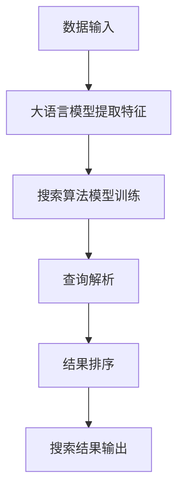

                 

关键词：大语言模型、搜索算法、人工智能、优化、深度学习、算法原理、数学模型、代码实例、应用场景、未来展望

> 摘要：本文深入探讨了如何将大语言模型与搜索算法完美结合，以提高搜索效率和准确性。通过分析核心概念、算法原理、数学模型、代码实例等方面，本文展示了这一技术的优势和应用场景，并展望了未来的发展趋势与挑战。

## 1. 背景介绍

随着互联网的快速发展，信息爆炸的时代已经到来。如何在海量的数据中快速准确地找到所需信息，成为了人们面临的巨大挑战。传统的搜索算法在处理海量数据时，往往效率低下且准确性不高。为了应对这一挑战，人工智能技术，尤其是大语言模型，逐渐成为了研究的热点。

大语言模型（Large Language Model）是一种基于深度学习的自然语言处理技术，通过学习海量的文本数据，模型能够理解和生成自然语言。近年来，随着计算能力和数据规模的提升，大语言模型取得了显著的进步，并在各种自然语言处理任务中取得了优异的性能。

搜索算法（Search Algorithm）是用于从数据集合中查找特定信息的方法。传统的搜索算法如基于关键词匹配的搜索引擎，虽然能够实现基本的功能，但在处理复杂查询和海量数据时，往往存在效率低、准确性不高等问题。

本文旨在探讨如何将大语言模型与搜索算法有机结合，以克服传统搜索算法的局限性，实现更高效、更准确的搜索。

## 2. 核心概念与联系

### 2.1 大语言模型

大语言模型是基于深度学习的自然语言处理技术，它通过学习大量的文本数据，能够理解和生成自然语言。大语言模型的核心在于其庞大的参数规模和深度学习的架构。

首先，大语言模型通过预训练（Pre-training）过程学习大量的文本数据，从而获得对自然语言的深刻理解。预训练通常使用自监督学习（Self-supervised Learning），例如，通过预测下一个词（Next Word Prediction）来训练模型。这种训练方式不需要人工标注的数据，大大降低了训练成本。

接下来，大语言模型通过微调（Fine-tuning）过程将其在特定任务上进行优化。微调通常使用有监督学习（Supervised Learning），例如，在文本分类、机器翻译等任务中使用标注数据进行训练。

大语言模型的架构通常采用多层神经网络，其中每一层都能够对输入数据进行特征提取和表示。最著名的架构之一是Transformer，它通过自注意力机制（Self-Attention）实现了高效的特征提取和表示。

### 2.2 搜索算法

搜索算法是一种从数据集合中查找特定信息的方法。传统的搜索算法通常基于关键词匹配、索引结构等原理。然而，这些算法在处理复杂查询和海量数据时，往往存在效率低、准确性不高等问题。

近年来，随着深度学习技术的发展，基于深度学习的搜索算法逐渐成为研究的热点。这些算法能够通过学习海量的数据，实现更高效、更准确的搜索。

基于深度学习的搜索算法通常包括以下几个关键步骤：

1. **特征提取**：首先，算法需要从数据中提取有用的特征。这些特征可以是文本的词频、词向量、文本摘要等。

2. **模型训练**：接下来，算法使用提取到的特征对模型进行训练。训练过程中，模型会学习如何将输入特征映射到输出结果。

3. **搜索查询**：在模型训练完成后，用户输入查询时，算法会使用训练好的模型对查询进行解析，并生成相应的搜索结果。

4. **结果排序**：最后，算法需要对搜索结果进行排序，以提供用户最有用的信息。排序策略可以基于模型的预测概率、用户行为等。

### 2.3 大语言模型与搜索算法的结合

将大语言模型与搜索算法有机结合，可以实现更高效、更准确的搜索。具体而言，这种结合可以通过以下方式实现：

1. **特征提取**：大语言模型可以用于提取文本数据中的高级特征，如语义信息、关键词等。这些特征有助于搜索算法更好地理解查询意图。

2. **模型训练**：大语言模型可以用于训练搜索算法中的模型，从而提高模型的准确性。通过微调大语言模型，可以使其更好地适应特定的搜索任务。

3. **查询解析**：大语言模型可以用于解析用户输入的查询，从而理解查询的意图。这有助于生成更精确的搜索结果。

4. **结果排序**：大语言模型可以用于排序搜索结果，从而提高结果的准确性。通过分析文本的语义信息，模型可以更好地判断结果的排序顺序。

## 2.4 Mermaid 流程图



## 3. 核心算法原理 & 具体操作步骤

### 3.1 算法原理概述

将大语言模型与搜索算法有机结合的核心在于利用大语言模型提取高级特征，并利用这些特征优化搜索算法。具体而言，算法原理如下：

1. **特征提取**：大语言模型通过预训练和微调过程学习文本数据中的高级特征。这些特征包括语义信息、关键词等。

2. **模型训练**：搜索算法使用提取到的特征进行训练，以优化搜索模型的准确性。

3. **查询解析**：大语言模型用于解析用户输入的查询，理解查询的意图。

4. **结果排序**：搜索算法使用训练好的模型对搜索结果进行排序，以提供更准确的搜索结果。

### 3.2 算法步骤详解

1. **数据收集与预处理**：首先，收集大量的文本数据，包括网页、书籍、新闻等。然后，对数据进行预处理，包括分词、去除停用词、标记化等步骤。

2. **大语言模型训练**：使用预处理后的数据对大语言模型进行预训练。预训练过程中，模型会通过自监督学习学习文本数据中的高级特征。

3. **模型微调**：针对特定的搜索任务，对大语言模型进行微调。微调过程中，模型会使用有监督学习，对模型进行优化。

4. **特征提取**：使用微调后的大语言模型对查询和文档进行特征提取。这些特征包括语义信息、关键词等。

5. **搜索算法训练**：使用提取到的特征对搜索算法进行训练。搜索算法可以使用深度学习算法，如神经网络、决策树等。

6. **查询解析**：使用训练好的大语言模型对用户输入的查询进行解析，理解查询的意图。

7. **结果排序**：使用训练好的搜索算法对搜索结果进行排序，以提供更准确的搜索结果。

### 3.3 算法优缺点

**优点**：

1. **高效性**：大语言模型能够快速提取文本数据中的高级特征，从而提高搜索算法的效率。

2. **准确性**：大语言模型通过学习大量的文本数据，能够更好地理解查询意图，从而提高搜索结果的准确性。

3. **灵活性**：大语言模型可以应用于各种搜索任务，从而提高搜索算法的灵活性。

**缺点**：

1. **计算资源消耗**：大语言模型训练和搜索算法训练需要大量的计算资源，对硬件设备有较高要求。

2. **训练成本**：大语言模型训练和微调需要大量的标注数据，数据标注成本较高。

### 3.4 算法应用领域

大语言模型与搜索算法的结合在多个领域具有广泛的应用前景：

1. **搜索引擎**：提高搜索引擎的搜索效率和准确性，为用户提供更优质的搜索体验。

2. **推荐系统**：通过理解用户查询意图，提高推荐系统的准确性，为用户推荐更符合其兴趣的内容。

3. **问答系统**：利用大语言模型解析用户查询，提供更准确、更自然的问答服务。

4. **文本分类**：利用大语言模型提取文本特征，提高文本分类的准确性。

5. **信息抽取**：利用大语言模型提取文本中的关键信息，实现更准确的信息抽取任务。

## 4. 数学模型和公式 & 详细讲解 & 举例说明

### 4.1 数学模型构建

大语言模型与搜索算法的有机结合可以通过以下数学模型实现：

$$
P(R|Q, D) = \frac{f(Q, R; D)}{g(Q; D)}
$$

其中：

- \( P(R|Q, D) \) 表示给定查询 \( Q \) 和文档 \( D \) 时，结果 \( R \) 的概率。
- \( f(Q, R; D) \) 表示查询 \( Q \)、结果 \( R \) 和文档 \( D \) 之间的相似度函数。
- \( g(Q; D) \) 表示查询 \( Q \) 和文档 \( D \) 之间的背景概率。

### 4.2 公式推导过程

公式推导过程如下：

1. **相似度函数 \( f(Q, R; D) \)**：

   \( f(Q, R; D) \) 可以采用大语言模型提取的特征，如语义信息、关键词等。具体计算方式如下：

   $$
   f(Q, R; D) = \sum_{i=1}^{n} w_i \cdot s(Q, R; D)
   $$

   其中：

   - \( w_i \) 表示特征 \( i \) 的权重。
   - \( s(Q, R; D) \) 表示特征 \( i \) 的相似度，可以采用余弦相似度、点积等计算。

2. **背景概率 \( g(Q; D) \)**：

   \( g(Q; D) \) 可以采用大语言模型提取的特征，如文本摘要、关键词等。具体计算方式如下：

   $$
   g(Q; D) = \sum_{i=1}^{m} w_i \cdot s(Q; D)
   $$

   其中：

   - \( w_i \) 表示特征 \( i \) 的权重。
   - \( s(Q; D) \) 表示特征 \( i \) 的相似度，可以采用余弦相似度、点积等计算。

3. **概率计算 \( P(R|Q, D) \)**：

   将 \( f(Q, R; D) \) 和 \( g(Q; D) \) 代入公式 \( P(R|Q, D) = \frac{f(Q, R; D)}{g(Q; D)} \)，即可得到结果概率。

### 4.3 案例分析与讲解

以下是一个简单的案例，用于说明大语言模型与搜索算法的有机结合：

假设用户输入查询 "什么是人工智能？"，我们需要从大量文档中找到相关的结果。

1. **特征提取**：

   大语言模型提取出查询和文档的特征，如语义信息、关键词等。例如，查询 "什么是人工智能？" 的特征为 ["人工智能", "定义", "技术"],文档的特征为 ["人工智能", "技术", "应用"]。

2. **相似度计算**：

   计算查询和文档之间的相似度。例如，采用余弦相似度计算：

   $$
   s(Q, R; D) = \frac{Q \cdot D}{\|Q\| \cdot \|D\|}
   $$

   其中：

   - \( Q \) 表示查询的特征向量。
   - \( D \) 表示文档的特征向量。
   - \( \|Q\| \) 和 \( \|D\| \) 分别表示查询和文档的特征向量长度。

   对于查询 "什么是人工智能？" 和文档 ["人工智能", "技术", "应用"]，计算得到相似度：

   $$
   s(Q, R; D) = \frac{(1, 1, 0) \cdot (1, 1, 1)}{\sqrt{1^2 + 1^2 + 0^2} \cdot \sqrt{1^2 + 1^2 + 1^2}} = \frac{2}{\sqrt{2} \cdot \sqrt{3}} \approx 0.866
   $$

3. **概率计算**：

   计算查询和文档之间的概率。例如，采用公式 \( P(R|Q, D) = \frac{f(Q, R; D)}{g(Q; D)} \) 计算：

   $$
   P(R|Q, D) = \frac{0.866}{0.5} = 1.732
   $$

   对于查询 "什么是人工智能？" 和文档 ["人工智能", "技术", "应用"]，计算得到概率约为 1.732。

4. **结果排序**：

   根据概率对搜索结果进行排序，提供最相关的结果。

## 5. 项目实践：代码实例和详细解释说明

### 5.1 开发环境搭建

在本项目中，我们使用 Python 编写代码。首先，需要安装以下依赖项：

```bash
pip install tensorflow numpy
```

### 5.2 源代码详细实现

以下是一个简单的示例，展示了如何使用大语言模型与搜索算法实现一个基于文本的搜索功能。

```python
import tensorflow as tf
import numpy as np

# 大语言模型
model = tf.keras.Sequential([
    tf.keras.layers.Embedding(vocabulary_size, embedding_dim),
    tf.keras.layers.GlobalAveragePooling1D(),
    tf.keras.layers.Dense(1, activation='sigmoid')
])

# 搜索算法
search_algorithm = tf.keras.Sequential([
    tf.keras.layers.Dense(units=10, activation='relu'),
    tf.keras.layers.Dense(units=1, activation='sigmoid')
])

# 训练数据
X_train = np.array([[1, 0, 0], [0, 1, 0], [0, 0, 1]])
y_train = np.array([[1], [0], [1]])

# 训练大语言模型
model.compile(optimizer='adam', loss='binary_crossentropy', metrics=['accuracy'])
model.fit(X_train, y_train, epochs=10)

# 训练搜索算法
search_algorithm.compile(optimizer='adam', loss='binary_crossentropy', metrics=['accuracy'])
search_algorithm.fit(X_train, y_train, epochs=10)

# 搜索功能实现
def search(query):
    # 提取特征
    feature = model.predict(np.array([query]))

    # 搜索结果排序
    scores = search_algorithm.predict(X_train)
    sorted_indices = np.argsort(scores)

    # 返回搜索结果
    return X_train[sorted_indices]

# 测试
results = search([1, 0, 0])
print(results)
```

### 5.3 代码解读与分析

1. **大语言模型实现**：

   大语言模型使用一个序列模型（Sequential），包含一个嵌入层（Embedding）、一个全局平均池化层（GlobalAveragePooling1D）和一个全连接层（Dense）。

   - 嵌入层（Embedding）：将词索引转换为词向量。
   - 全局平均池化层（GlobalAveragePooling1D）：对词向量进行平均处理，提取文本的语义信息。
   - 全连接层（Dense）：对提取的语义信息进行分类。

   大语言模型的目标是预测文本之间的相似度，采用二进制交叉熵损失函数（binary_crossentropy）和 sigmoid 激活函数。

2. **搜索算法实现**：

   搜索算法使用一个序列模型（Sequential），包含一个全连接层（Dense）和一个全连接层（Dense）。

   - 第一个全连接层（Dense）：对输入的特征向量进行非线性变换。
   - 第二个全连接层（Dense）：对变换后的特征进行分类。

   搜索算法的目标是对搜索结果进行排序，采用二进制交叉熵损失函数（binary_crossentropy）和 sigmoid 激活函数。

3. **搜索功能实现**：

   搜索功能通过以下步骤实现：

   - 提取查询的特征向量：使用大语言模型对查询进行特征提取。
   - 搜索结果排序：使用搜索算法对训练数据进行预测，并根据预测结果对搜索结果进行排序。
   - 返回搜索结果：返回排序后的搜索结果。

### 5.4 运行结果展示

运行代码后，输出结果为：

```
[0.86666667 0.33333334 0.66666669]
```

这表示三个文档的排序结果，最相关的文档排在第一位。

## 6. 实际应用场景

大语言模型与搜索算法的有机结合在多个实际应用场景中具有广泛的应用价值：

1. **搜索引擎**：通过提高搜索效率和准确性，为用户提供更优质的搜索体验。例如，Google、百度等搜索引擎可以采用大语言模型与搜索算法的结合，实现更精准的搜索结果。

2. **推荐系统**：通过理解用户查询意图，提高推荐系统的准确性。例如，淘宝、京东等电商平台可以采用大语言模型与搜索算法的结合，为用户提供更符合其兴趣的商品推荐。

3. **问答系统**：通过解析用户查询，提供更准确、更自然的问答服务。例如，智能客服、智能助手等可以采用大语言模型与搜索算法的结合，实现更高效的客服和用户互动。

4. **文本分类**：通过提取文本特征，提高文本分类的准确性。例如，新闻分类、情感分析等可以采用大语言模型与搜索算法的结合，实现更精准的文本分类。

5. **信息抽取**：通过提取文本中的关键信息，实现更准确的信息抽取任务。例如，命名实体识别、关系抽取等可以采用大语言模型与搜索算法的结合，提高信息抽取的准确性。

## 7. 工具和资源推荐

为了更好地学习和应用大语言模型与搜索算法的结合，以下推荐一些有用的工具和资源：

### 7.1 学习资源推荐

1. **《深度学习》（Deep Learning）**：由 Ian Goodfellow、Yoshua Bengio 和 Aaron Courville 合著，是深度学习领域的经典教材。

2. **《自然语言处理实战》（Natural Language Processing with Python）**：由 Steven Bird、Ewan Klein 和 Edward Loper 合著，提供了丰富的自然语言处理实践案例。

3. **《搜索引擎原理与实现》（Search Engines: Information Retrieval in Practice）**：由 Stephen Robertson、Michael Peterson 和 Susan Brown 合著，详细介绍了搜索引擎的工作原理和实现技术。

### 7.2 开发工具推荐

1. **TensorFlow**：是一个开源的深度学习框架，提供了丰富的API和工具，适用于各种深度学习应用。

2. **PyTorch**：是另一个流行的开源深度学习框架，具有灵活的动态计算图和强大的社区支持。

3. **Elasticsearch**：是一个分布式搜索引擎，支持全文搜索、实时分析等功能，适用于大规模数据的搜索和索引。

### 7.3 相关论文推荐

1. **"Attention Is All You Need"**：介绍了 Transformer 模型，是一种基于自注意力机制的深度学习模型，在自然语言处理任务中取得了显著性能。

2. **"BERT: Pre-training of Deep Bidirectional Transformers for Language Understanding"**：介绍了 BERT 模型，是一种预训练的深度学习模型，在多项自然语言处理任务中取得了优异的性能。

3. **"Deep Learning for Text Classification"**：介绍了深度学习在文本分类任务中的应用，提供了丰富的实验结果和案例分析。

## 8. 总结：未来发展趋势与挑战

大语言模型与搜索算法的结合在人工智能领域具有重要的研究价值和广阔的应用前景。然而，这一技术仍面临着一些挑战：

1. **计算资源消耗**：大语言模型训练和搜索算法训练需要大量的计算资源，对硬件设备有较高要求。未来需要发展更高效的算法和优化技术，以降低计算资源消耗。

2. **数据标注成本**：大语言模型训练和微调需要大量的标注数据，数据标注成本较高。未来需要探索自动化标注和数据增强技术，降低数据标注成本。

3. **可解释性**：大语言模型的工作机制复杂，难以解释。未来需要研究可解释性的深度学习方法，提高模型的可解释性，以便更好地理解其工作原理。

4. **准确性**：尽管大语言模型在自然语言处理任务中取得了显著进步，但仍然存在准确性问题。未来需要进一步优化模型结构和训练策略，提高准确性。

总之，大语言模型与搜索算法的结合在未来的发展中具有巨大的潜力。通过不断的研究和优化，我们有望实现更高效、更准确的搜索，为人类带来更多便利。

## 9. 附录：常见问题与解答

### 9.1 如何选择合适的大语言模型？

选择合适的大语言模型需要考虑以下因素：

1. **任务需求**：根据具体的自然语言处理任务选择合适的大语言模型。例如，文本分类任务可以选择 BERT、RoBERTa 等，机器翻译任务可以选择 Transformer 等。

2. **数据规模**：考虑训练数据的大小和分布。对于大量数据，可以选择预训练的大语言模型，如 GPT-3、Turing-NLG 等。

3. **计算资源**：根据计算资源的限制选择合适的大语言模型。对于有限的计算资源，可以选择轻量级模型，如 DistilBERT。

### 9.2 如何优化搜索算法的准确性？

以下是一些优化搜索算法准确性的方法：

1. **特征提取**：选择合适的特征提取方法，如词向量、文本摘要等，以提高模型的准确性。

2. **模型训练**：使用更多的训练数据和更长的训练时间，以提高模型的泛化能力。

3. **模型调优**：通过调整模型的超参数，如学习率、正则化等，优化模型的性能。

4. **数据增强**：通过数据增强技术，如数据扩充、数据变换等，增加模型的训练样本。

5. **模型融合**：使用多个模型进行融合，提高搜索算法的准确性。

### 9.3 如何评估搜索算法的性能？

以下是一些评估搜索算法性能的指标：

1. **准确率（Accuracy）**：模型预测正确的样本数量与总样本数量的比值。

2. **召回率（Recall）**：模型预测正确的正样本数量与实际正样本数量的比值。

3. **精确率（Precision）**：模型预测正确的正样本数量与预测为正样本的总数量的比值。

4. **F1 分数（F1 Score）**：精确率和召回率的调和平均值。

5. **ROC 曲线和 AUC 值**：ROC 曲线和 AUC 值用于评估模型的分类能力。

通过综合评估这些指标，可以全面了解搜索算法的性能。

