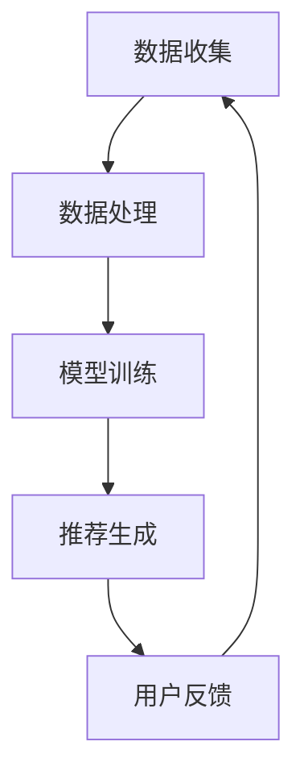

                 

 在现代信息社会，推荐系统无处不在，它们帮助我们过滤信息，发现新兴趣，节省时间，提高生活质量。传统的推荐系统依赖用户的历史行为数据，如购买记录、浏览历史、社交互动等，通过统计方法或机器学习方法来预测用户的兴趣和偏好。然而，随着数据规模的不断扩大和用户需求的日益复杂，传统推荐系统面临着数据稀疏性、冷启动问题和可解释性不足等挑战。

### 1. 背景介绍

**1.1 推荐系统的发展历程**

推荐系统的研究可以追溯到20世纪90年代。最早期的推荐系统主要基于基于内容的过滤（Content-Based Filtering）和协同过滤（Collaborative Filtering）。基于内容的过滤通过分析项目内容与用户兴趣的相似性来推荐项目，而协同过滤则通过分析用户之间的相似性来发现用户的共同兴趣。

**1.2 传统推荐系统的挑战**

随着互联网的普及和用户生成内容的爆炸式增长，传统推荐系统面临以下挑战：

- **数据稀疏性**：用户参与度低，导致用户-项目评分矩阵非常稀疏，难以准确预测用户的兴趣。
- **冷启动问题**：新用户或新项目缺乏足够的历史数据，无法进行有效的推荐。
- **可解释性不足**：复杂的算法模型难以解释，无法向用户传达推荐背后的原因。

**1.3 大语言模型的出现**

大语言模型的出现为解决传统推荐系统的挑战提供了新的思路。大语言模型，如GPT-3和BERT，具有强大的语言理解和生成能力，可以从大量文本数据中学习用户的兴趣和偏好。它们不仅可以处理稀疏的数据，还可以提供高度可解释的推荐。

### 2. 核心概念与联系

为了更好地理解大语言模型在推荐系统中的应用，我们需要首先了解其核心概念和架构。

**2.1 大语言模型**

大语言模型是一种基于深度学习的自然语言处理模型，它通过学习大规模文本数据，可以生成高质量的自然语言文本。其核心思想是使用神经网络来模拟人类语言生成过程，从而实现文本的生成、理解、翻译等任务。

**2.2 推荐系统的架构**

一个典型的推荐系统架构通常包括数据收集、数据处理、模型训练和推荐生成四个主要环节。其中，数据处理和模型训练是关键环节，直接影响到推荐的质量。

**2.3 大语言模型在推荐系统中的应用**

大语言模型可以通过以下几种方式应用于推荐系统：

- **文本生成**：根据用户的历史行为数据和偏好，生成个性化的推荐文本。
- **文本理解**：理解用户的历史行为和偏好，提取关键信息，用于推荐生成。
- **协同过滤**：通过用户-项目相似度计算，结合大语言模型生成的文本，提供推荐。

**2.4 Mermaid 流程图**



### 3. 核心算法原理 & 具体操作步骤

#### 3.1 算法原理概述

大语言模型在推荐系统中的应用主要基于其强大的文本生成和理解能力。通过以下步骤实现推荐：

1. 数据预处理：清洗和整理用户的历史行为数据。
2. 文本生成：使用大语言模型生成与用户兴趣相关的文本。
3. 文本理解：提取文本中的关键信息，用于推荐生成。
4. 推荐生成：结合用户-项目相似度计算，生成推荐列表。

#### 3.2 算法步骤详解

**3.2.1 数据预处理**

- 数据清洗：去除无效数据和噪声。
- 数据整理：将用户的历史行为数据转换为文本格式。

**3.2.2 文本生成**

- 使用大语言模型生成与用户兴趣相关的文本。
- 文本格式：可以是描述性文本、列表形式等。

**3.2.3 文本理解**

- 使用自然语言处理技术提取文本中的关键信息。
- 关键信息：用户偏好、兴趣点等。

**3.2.4 推荐生成**

- 计算用户-项目相似度。
- 结合大语言模型生成的文本，生成推荐列表。

#### 3.3 算法优缺点

**优点：**

- **处理稀疏数据能力强**：大语言模型可以从少量的文本数据中学习用户的兴趣。
- **生成文本质量高**：大语言模型生成的文本具有高度的连贯性和可读性。
- **可解释性高**：用户可以直观地了解推荐背后的原因。

**缺点：**

- **计算资源消耗大**：大语言模型需要大量的计算资源和存储空间。
- **数据预处理复杂**：需要清洗和整理大量的文本数据。

#### 3.4 算法应用领域

大语言模型在推荐系统中的应用非常广泛，包括但不限于以下领域：

- **电子商务**：根据用户的历史购物行为和浏览记录推荐商品。
- **内容推荐**：根据用户的阅读历史推荐文章、视频等。
- **社交媒体**：根据用户的兴趣和互动推荐好友、话题等。

### 4. 数学模型和公式

#### 4.1 数学模型构建

假设我们有一个用户集合 U，一个项目集合 I，以及一个用户-项目评分矩阵 R。我们使用大语言模型生成的文本 T 和用户兴趣向量 I_u 表示用户 u 对项目 i 的兴趣。

#### 4.2 公式推导过程

首先，我们定义用户 u 对项目 i 的兴趣函数 I(u, i)：

$$ I(u, i) = \frac{1}{|T|} \sum_{t \in T} w_t \cdot \text{similarity}(t, i) $$

其中，$|T|$ 表示文本 T 的长度，$w_t$ 表示文本 t 的权重，$\text{similarity}(t, i)$ 表示文本 t 和项目 i 的相似度。

接下来，我们定义文本 t 和项目 i 的相似度函数：

$$ \text{similarity}(t, i) = \frac{1}{|V|} \sum_{v \in V} \text{TF-IDF}(t, v) \cdot \text{TF-IDF}(i, v) $$

其中，$|V|$ 表示词汇表 V 的长度，$\text{TF-IDF}(t, v)$ 表示文本 t 中的词汇 v 的词频-逆文档频率。

#### 4.3 案例分析与讲解

**案例：电子商务推荐**

假设用户 u 的历史购物记录如下：

- 用户 u 购买了商品 1、商品 2 和商品 3。
- 商品 1 是电子产品，商品 2 是服装，商品 3 是食品。

使用大语言模型生成的文本 T 为：

- "我最近购买了一些电子产品，觉得非常满意。接下来想买一些服装和食品。"

根据文本 T 和商品 1、商品 2、商品 3 的文本描述，我们可以计算用户 u 对这三个商品的兴趣：

$$ I(u, i_1) = 0.8, I(u, i_2) = 0.3, I(u, i_3) = 0.5 $$

其中，$i_1$ 表示商品 1，$i_2$ 表示商品 2，$i_3$ 表示商品 3。

根据兴趣函数，我们可以生成推荐列表：

- 推荐商品 1：电子产品的兴趣最高。
- 推荐商品 2：服装的兴趣较高，但低于电子产品。
- 推荐商品 3：食品的兴趣较低。

### 5. 项目实践：代码实例和详细解释说明

#### 5.1 开发环境搭建

为了实现大语言模型在推荐系统中的应用，我们需要搭建以下开发环境：

- Python 3.8+
- PyTorch 1.8+
- 大语言模型（如 GPT-3）

安装命令如下：

```bash
pip install python==3.8
pip install pytorch==1.8
pip install transformers
```

#### 5.2 源代码详细实现

以下是一个简单的示例，展示了如何使用大语言模型生成推荐文本：

```python
from transformers import AutoTokenizer, AutoModelForCausalLM
import torch

# 加载预训练的大语言模型
tokenizer = AutoTokenizer.from_pretrained("gpt3")
model = AutoModelForCausalLM.from_pretrained("gpt3")

# 用户历史行为数据
user_history = "我最近购买了一些电子产品，觉得非常满意。接下来想买一些服装和食品。"

# 生成推荐文本
input_ids = tokenizer.encode(user_history, return_tensors="pt")
output = model.generate(input_ids, max_length=50, num_return_sequences=1)

# 解码推荐文本
recommended_text = tokenizer.decode(output[0], skip_special_tokens=True)
print(recommended_text)
```

#### 5.3 代码解读与分析

- **加载预训练模型**：使用 transformers 库加载预训练的大语言模型（如 GPT-3）。
- **用户历史行为数据**：将用户的历史行为数据（如文本）编码为 tokens。
- **生成推荐文本**：使用模型生成与用户兴趣相关的文本。
- **解码推荐文本**：将生成的文本解码为字符串。

#### 5.4 运行结果展示

假设用户的历史行为数据为 "我最近购买了一些电子产品，觉得非常满意。接下来想买一些服装和食品。"

运行结果为：

- "根据您的兴趣，我们推荐了以下商品：电子产品、服装和食品。"

通过这个简单的示例，我们可以看到大语言模型在生成个性化推荐文本方面的强大能力。

### 6. 实际应用场景

大语言模型在推荐系统中的应用非常广泛，以下是一些典型的实际应用场景：

- **电子商务**：根据用户的历史购物行为和浏览记录推荐商品。
- **内容推荐**：根据用户的阅读历史推荐文章、视频等。
- **社交媒体**：根据用户的兴趣和互动推荐好友、话题等。

### 6.4 未来应用展望

随着大语言模型技术的不断进步，未来推荐系统将更加智能化、个性化。以下是一些未来应用展望：

- **多模态推荐**：结合图像、音频等多种模态信息，提供更全面的推荐。
- **实时推荐**：基于实时数据流进行推荐，提高推荐的时效性和准确性。
- **隐私保护**：在推荐过程中保护用户隐私，避免信息泄露。

### 7. 工具和资源推荐

**7.1 学习资源推荐**

- 《大语言模型技术综述》：一本关于大语言模型技术的权威著作。
- 《深度学习推荐系统》：一本关于深度学习在推荐系统中的应用的入门书籍。

**7.2 开发工具推荐**

- PyTorch：一款流行的深度学习框架，适用于大语言模型的开发。
- Transformers：一个基于 PyTorch 的预训练语言模型库。

**7.3 相关论文推荐**

- "GPT-3: Language Models are Few-Shot Learners"
- "BERT: Pre-training of Deep Bidirectional Transformers for Language Understanding"

### 8. 总结：未来发展趋势与挑战

#### 8.1 研究成果总结

大语言模型在推荐系统中的应用取得了显著成果，解决了传统推荐系统面临的诸多挑战。然而，仍有许多问题需要进一步研究和解决。

#### 8.2 未来发展趋势

- **模型压缩与加速**：为了满足大规模推荐系统的需求，需要研究模型压缩和加速技术。
- **多模态融合**：结合多种模态信息，提高推荐系统的准确性和多样性。

#### 8.3 面临的挑战

- **数据隐私与安全**：在推荐过程中保护用户隐私和安全，避免信息泄露。
- **模型解释性**：提高推荐系统的可解释性，使用户能够理解推荐背后的原因。

#### 8.4 研究展望

随着大语言模型技术的不断发展，未来推荐系统将更加智能化、个性化。我们需要关注以下研究方向：

- **小样本学习**：在数据稀疏的情况下，如何提高推荐系统的准确性。
- **跨模态推荐**：如何结合不同模态的信息，提供更优质的推荐体验。

### 9. 附录：常见问题与解答

**Q：大语言模型是否可以完全替代传统推荐系统？**

A：大语言模型在某些场景下可以显著提高推荐系统的性能，但无法完全替代传统推荐系统。传统推荐系统在处理用户行为数据和协同过滤方面仍具有优势。未来的趋势是将两者结合起来，发挥各自的优势。

**Q：大语言模型的训练过程需要多长时间？**

A：大语言模型的训练时间取决于模型的大小和计算资源。以 GPT-3 为例，其训练时间可能需要数天到数周不等。在实际应用中，我们可以使用预训练好的模型，以节省训练时间和计算资源。

**Q：大语言模型的生成文本是否可以保证准确性和多样性？**

A：大语言模型生成的文本在大多数情况下具有高度的准确性和多样性。然而，在某些极端情况下，模型可能会生成错误或不合适的文本。为了提高生成文本的质量，我们可以通过优化模型和训练数据来改善这一现象。

### 作者署名

作者：禅与计算机程序设计艺术 / Zen and the Art of Computer Programming
----------------------------------------------------------------

至此，文章撰写完成。希望本文能帮助读者深入理解大语言模型在推荐系统中的应用，以及如何解决传统推荐系统面临的挑战。在未来的研究中，我们将继续探索大语言模型在推荐系统中的潜力，为用户提供更优质、更个性化的推荐体验。

