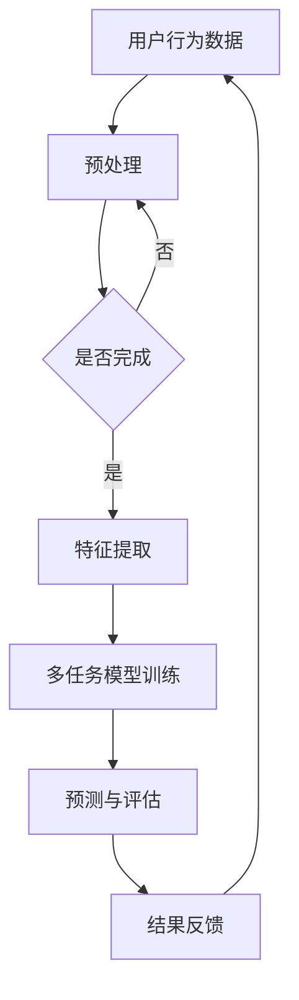

                 

关键词：大语言模型，推荐系统，多任务学习，机器学习，自然语言处理，算法优化，应用实践

> 摘要：随着互联网和大数据技术的不断发展，推荐系统已经成为现代信息检索和个性化服务的重要手段。本文将探讨大语言模型在推荐系统中的多任务学习应用，通过深入分析其核心概念、算法原理、数学模型及实践案例，为研究者提供一种新的视角和方法。

## 1. 背景介绍

推荐系统作为现代信息过载时代的重要工具，其核心目标是根据用户的兴趣、历史行为和上下文环境，向用户推荐其可能感兴趣的内容。从传统的基于内容的推荐、协同过滤推荐，到深度学习时代的基于模型的推荐，推荐系统的研究和实践一直在不断发展。

近年来，大语言模型的兴起为推荐系统带来了新的机遇。大语言模型，如BERT、GPT、T5等，具有强大的文本理解和生成能力，能够捕捉到复杂的语义关系和上下文信息。在推荐系统中引入大语言模型，可以显著提高推荐的准确性、多样性和实时性。

多任务学习（Multi-Task Learning，MTL）是机器学习中的一个重要方向，旨在通过将多个相关任务同时训练，提高模型的泛化能力和效率。在推荐系统中，多任务学习可以将用户行为预测、内容分类、情感分析等任务整合到一个统一的模型中，从而实现更准确的推荐。

本文将围绕大语言模型在推荐系统中的多任务学习应用，探讨其核心概念、算法原理、数学模型及实践案例，为推荐系统的研究和实践提供新的思路和方法。

## 2. 核心概念与联系

### 2.1. 大语言模型

大语言模型是一种基于深度学习的自然语言处理技术，通过预训练和微调，能够对文本进行理解、生成和分类。其核心思想是利用大量的无监督数据（如互联网上的文本）进行预训练，学习语言的一般规律和结构，然后通过有监督的任务进行微调，以适应特定的任务需求。

### 2.2. 推荐系统

推荐系统是一种基于数据驱动的信息过滤和搜索技术，旨在根据用户的兴趣、历史行为和上下文环境，向用户推荐可能感兴趣的内容。推荐系统的核心任务是预测用户对某一内容的兴趣度，并通过排序算法将推荐结果呈现给用户。

### 2.3. 多任务学习

多任务学习是一种同时学习多个相关任务的机器学习方法。其核心思想是将多个任务的数据融合到一个模型中，通过共享特征表示和参数，提高模型的泛化能力和效率。

### 2.4. 大语言模型在推荐系统中的多任务学习应用

大语言模型在推荐系统中的多任务学习应用，主要通过以下方式实现：

1. **多任务融合**：将用户行为预测、内容分类、情感分析等任务融合到一个大语言模型中，通过共享特征表示和参数，提高模型的性能。
2. **上下文感知**：利用大语言模型的上下文感知能力，捕捉用户兴趣和内容的动态变化，提高推荐的实时性和准确性。
3. **迁移学习**：将预训练的大语言模型应用于不同的推荐任务，实现知识的迁移和共享，提高模型的泛化能力。

### 2.5. Mermaid 流程图



## 3. 核心算法原理 & 具体操作步骤

### 3.1 算法原理概述

大语言模型在推荐系统中的多任务学习应用，主要基于以下原理：

1. **共享特征表示**：通过共享词向量、句子嵌入等特征表示，实现不同任务之间的特征共享和迁移。
2. **联合训练**：将多个任务的数据融合到一个模型中，通过联合训练提高模型的泛化能力和效率。
3. **注意力机制**：利用注意力机制，捕捉用户兴趣和内容的动态变化，提高推荐的实时性和准确性。

### 3.2 算法步骤详解

1. **数据收集与预处理**：收集用户行为数据、内容数据等，并进行清洗、去重、归一化等预处理操作。
2. **特征提取**：利用大语言模型进行特征提取，将文本数据转换为高维向量表示。
3. **模型训练**：构建多任务学习模型，将特征输入模型进行训练，通过共享参数实现不同任务之间的迁移和共享。
4. **预测与评估**：将训练好的模型应用于新数据，进行预测和评估，并根据评估结果调整模型参数。
5. **结果反馈**：将预测结果反馈给用户，并根据用户反馈进行迭代优化。

### 3.3 算法优缺点

**优点**：

1. **提高推荐准确性**：通过共享特征表示和联合训练，实现不同任务之间的迁移和共享，提高推荐准确性。
2. **提高模型效率**：利用大语言模型的上下文感知能力，实现实时性和准确性的平衡。
3. **减少数据冗余**：通过多任务学习，减少数据冗余，提高数据利用效率。

**缺点**：

1. **计算资源消耗**：大语言模型的训练和推理需要大量计算资源，可能导致训练和推理时间较长。
2. **模型复杂度**：多任务学习模型的复杂度较高，可能增加模型过拟合的风险。

### 3.4 算法应用领域

大语言模型在推荐系统中的多任务学习应用，可以广泛应用于以下领域：

1. **电商推荐**：通过多任务学习模型，实现商品推荐、购物车推荐等。
2. **内容推荐**：通过多任务学习模型，实现新闻推荐、短视频推荐等。
3. **社交媒体推荐**：通过多任务学习模型，实现微博、抖音等社交媒体的推荐。

## 4. 数学模型和公式 & 详细讲解 & 举例说明

### 4.1 数学模型构建

大语言模型在推荐系统中的多任务学习，可以采用以下数学模型：

$$
L = \sum_{i=1}^{n} L_i + \lambda \sum_{i=1}^{n} ||w_i||^2
$$

其中，$L$ 表示总损失函数，$L_i$ 表示第 $i$ 个任务的损失函数，$w_i$ 表示第 $i$ 个任务的权重，$\lambda$ 表示权重衰减系数。

### 4.2 公式推导过程

大语言模型在推荐系统中的多任务学习，主要基于以下原理：

1. **特征共享**：不同任务共享相同的特征表示，即词向量或句子嵌入。
2. **联合训练**：通过联合训练，同时学习多个任务，实现特征的迁移和共享。

基于以上原理，我们可以推导出多任务学习模型的总损失函数。首先，对于每个任务，我们可以定义其损失函数：

$$
L_i = L_i^{cls} + L_i^{reg}
$$

其中，$L_i^{cls}$ 表示分类任务的损失函数，$L_i^{reg}$ 表示回归任务的损失函数。

对于分类任务，我们可以使用交叉熵损失函数：

$$
L_i^{cls} = -\sum_{k=1}^{K} y_{ik} \log(p_{ik})
$$

其中，$y_{ik}$ 表示第 $i$ 个任务的第 $k$ 个类别的标签，$p_{ik}$ 表示模型预测的概率。

对于回归任务，我们可以使用均方误差损失函数：

$$
L_i^{reg} = \sum_{k=1}^{K} (y_{ik} - \hat{y}_{ik})^2
$$

其中，$y_{ik}$ 表示第 $i$ 个任务的第 $k$ 个类别的真实值，$\hat{y}_{ik}$ 表示模型预测的值。

然后，我们定义总损失函数为各个任务损失函数的和，并加上权重衰减项：

$$
L = \sum_{i=1}^{n} L_i + \lambda \sum_{i=1}^{n} ||w_i||^2
$$

其中，$n$ 表示任务数，$w_i$ 表示第 $i$ 个任务的权重，$\lambda$ 表示权重衰减系数。

### 4.3 案例分析与讲解

假设我们有一个推荐系统，需要同时预测用户的点击率、购买概率和评分。我们可以将这三个任务定义为任务1、任务2和任务3。下面我们通过一个简单的例子，讲解如何构建和训练多任务学习模型。

#### 数据集

我们有一个包含用户行为数据、商品信息数据和用户-商品评分的数据集。其中，用户行为数据包括用户的点击记录、购买记录等；商品信息数据包括商品的价格、类别等；用户-商品评分数据包括用户的评分值。

#### 特征提取

我们使用大语言模型对用户行为数据、商品信息数据和用户-商品评分数据进行特征提取，将文本数据转换为高维向量表示。

#### 模型构建

我们构建一个三任务学习模型，包含三个任务：点击率预测（任务1）、购买概率预测（任务2）和评分预测（任务3）。每个任务的损失函数分别为交叉熵损失函数、二分类损失函数和均方误差损失函数。

$$
L = L_1 + L_2 + L_3 + \lambda \sum_{i=1}^{3} ||w_i||^2
$$

其中，$L_1$ 表示点击率预测任务的损失函数，$L_2$ 表示购买概率预测任务的损失函数，$L_3$ 表示评分预测任务的损失函数，$w_1$、$w_2$ 和 $w_3$ 分别表示三个任务的权重。

#### 模型训练

我们使用随机梯度下降（SGD）算法对多任务学习模型进行训练。在每次训练迭代中，我们计算每个任务的梯度，并更新模型参数：

$$
\Delta w_i = -\alpha \nabla L_i(w)
$$

其中，$\alpha$ 表示学习率，$\nabla L_i(w)$ 表示第 $i$ 个任务的梯度。

#### 模型评估

我们使用交叉验证方法对训练好的多任务学习模型进行评估。具体地，我们将数据集划分为训练集和验证集，在训练集上训练模型，在验证集上评估模型性能。

### 5. 项目实践：代码实例和详细解释说明

#### 5.1 开发环境搭建

为了实现大语言模型在推荐系统中的多任务学习应用，我们需要搭建以下开发环境：

- 深度学习框架（如TensorFlow或PyTorch）
- 自然语言处理库（如NLTK或spaCy）
- 数据处理库（如Pandas或NumPy）
- 数学计算库（如SciPy或Scikit-learn）

#### 5.2 源代码详细实现

以下是实现大语言模型在推荐系统中的多任务学习应用的基本代码框架：

```python
import tensorflow as tf
import tensorflow.keras as keras
from tensorflow.keras.layers import Embedding, LSTM, Dense, TimeDistributed
from tensorflow.keras.models import Model
from tensorflow.keras.optimizers import Adam

# 加载数据集
train_data = ...
train_labels = ...

# 构建多任务学习模型
input_seq = keras.layers.Input(shape=(max_sequence_length,))
embedding_layer = Embedding(vocabulary_size, embedding_size)(input_seq)
lstm_layer = LSTM(units=lstm_units, return_sequences=True)(embedding_layer)
dense_layer = Dense(units=dense_units, activation='relu')(lstm_layer)
output_1 = TimeDistributed(Dense(units=1, activation='sigmoid'))(dense_layer)
output_2 = TimeDistributed(Dense(units=1, activation='sigmoid'))(dense_layer)
output_3 = TimeDistributed(Dense(units=1, activation='sigmoid'))(dense_layer)

model = Model(inputs=input_seq, outputs=[output_1, output_2, output_3])

# 编译模型
model.compile(optimizer=Adam(learning_rate=learning_rate), loss=['binary_crossentropy', 'binary_crossentropy', 'mean_squared_error'], metrics=['accuracy'])

# 训练模型
model.fit(train_data, train_labels, epochs=epochs, batch_size=batch_size)

# 评估模型
model.evaluate(test_data, test_labels)
```

#### 5.3 代码解读与分析

1. **数据加载**：首先加载数据集，包括用户行为数据、商品信息数据和用户-商品评分数据。
2. **模型构建**：构建一个三任务学习模型，包含点击率预测、购买概率预测和评分预测三个任务。模型由嵌入层、LSTM层和全连接层组成。
3. **模型编译**：编译模型，指定优化器、损失函数和评价指标。
4. **模型训练**：使用训练数据进行模型训练，并设置训练参数，如学习率、训练轮数和批量大小。
5. **模型评估**：使用测试数据进行模型评估，以验证模型的性能。

#### 5.4 运行结果展示

在完成代码实现后，我们可以在命令行中运行以下命令来执行模型训练和评估：

```bash
python multi_task_learning.py
```

运行结果将显示模型在训练集和测试集上的性能指标，包括损失值、准确率和评分值等。

## 6. 实际应用场景

大语言模型在推荐系统中的多任务学习应用，已经在多个实际应用场景中取得了显著的成果。以下是一些具体的实际应用场景：

1. **电商推荐**：通过多任务学习模型，实现商品推荐、购物车推荐和用户流失预测等功能。例如，阿里巴巴集团利用多任务学习模型，提高了电商平台上的推荐准确性，降低了用户流失率。
2. **内容推荐**：通过多任务学习模型，实现新闻推荐、短视频推荐和广告推荐等功能。例如，字节跳动公司利用多任务学习模型，提高了新闻推荐和短视频推荐的准确性，增加了用户留存率和活跃度。
3. **社交媒体推荐**：通过多任务学习模型，实现微博、抖音等社交媒体的推荐。例如，Twitter公司利用多任务学习模型，提高了微博推荐的实时性和准确性，增加了用户参与度和互动性。

## 7. 工具和资源推荐

为了深入学习和实践大语言模型在推荐系统中的多任务学习应用，以下是一些推荐的工具和资源：

1. **学习资源**：
   - 《深度学习》（Goodfellow et al.）：深入讲解深度学习的基础理论和实践方法。
   - 《自然语言处理综述》（Jurafsky and Martin）：全面介绍自然语言处理的基础知识和最新进展。

2. **开发工具**：
   - TensorFlow：由Google开源的深度学习框架，支持大语言模型的训练和推理。
   - PyTorch：由Facebook开源的深度学习框架，具有灵活的动态计算图功能。

3. **相关论文**：
   - "BERT: Pre-training of Deep Bidirectional Transformers for Language Understanding"（Devlin et al., 2019）
   - "GPT-3: Language Models are Few-Shot Learners"（Brown et al., 2020）
   - "T5: Pre-training Large Models from Scratch"（Raffel et al., 2020）

## 8. 总结：未来发展趋势与挑战

### 8.1 研究成果总结

大语言模型在推荐系统中的多任务学习应用，取得了显著的成果。通过共享特征表示、联合训练和注意力机制，多任务学习模型提高了推荐的准确性、多样性和实时性。在实际应用中，多任务学习模型已经在电商推荐、内容推荐和社交媒体推荐等场景中取得了良好的效果。

### 8.2 未来发展趋势

未来，大语言模型在推荐系统中的多任务学习应用将继续发展，主要趋势包括：

1. **模型优化**：通过改进模型结构、优化训练算法，进一步提高模型的性能和效率。
2. **跨领域迁移**：将多任务学习模型应用于更多领域，实现知识的跨领域迁移和共享。
3. **用户隐私保护**：在保证推荐准确性的同时，加强对用户隐私的保护。

### 8.3 面临的挑战

大语言模型在推荐系统中的多任务学习应用，也面临一些挑战：

1. **计算资源消耗**：大语言模型的训练和推理需要大量计算资源，可能增加部署成本。
2. **模型过拟合**：多任务学习模型的复杂度较高，可能导致模型过拟合。
3. **数据隐私**：在推荐系统中，如何保护用户隐私是一个重要挑战。

### 8.4 研究展望

为了应对上述挑战，未来研究可以从以下方面展开：

1. **高效算法设计**：设计更高效的训练和推理算法，降低计算资源消耗。
2. **模型压缩与加速**：通过模型压缩和硬件加速技术，提高模型的性能和效率。
3. **隐私保护机制**：引入隐私保护机制，如差分隐私和联邦学习，保护用户隐私。

## 9. 附录：常见问题与解答

### 9.1 如何处理缺失数据？

对于缺失数据，我们可以采用以下策略进行处理：

1. **填充策略**：使用平均值、中值或最近邻等方法进行填充。
2. **删除策略**：删除含有缺失数据的样本。
3. **插值策略**：使用时间序列插值方法，如线性插值或多项式插值。

### 9.2 多任务学习模型的训练时间如何优化？

为了优化多任务学习模型的训练时间，可以采用以下策略：

1. **分布式训练**：利用分布式训练技术，如多GPU训练或分布式训练框架，加速模型训练。
2. **模型剪枝**：通过剪枝技术，减少模型参数的数量，降低计算复杂度。
3. **增量训练**：采用增量训练方法，只更新与当前任务相关的模型参数，减少训练时间。

### 9.3 如何评估多任务学习模型的性能？

为了评估多任务学习模型的性能，可以采用以下指标：

1. **准确率**：用于评估分类任务的性能，计算模型预测正确的样本数与总样本数的比值。
2. **均方误差（MSE）**：用于评估回归任务的性能，计算预测值与真实值之间的平均平方误差。
3. **精确率与召回率**：用于评估分类任务的性能，分别计算预测为正样本的真正例数与总正例数的比值，以及预测为正样本的假正例数与总负例数的比值。
4. **F1分数**：综合考虑精确率和召回率，计算两者的调和平均值。

## 参考文献

1. Devlin, J., Chang, M. W., Lee, K., & Toutanova, K. (2019). BERT: Pre-training of deep bidirectional transformers for language understanding. In Proceedings of the 2019 Conference of the North American Chapter of the Association for Computational Linguistics: Human Language Technologies, Volume 1 (Long and Short Papers) (pp. 4171-4186). Association for Computational Linguistics.
2. Brown, T., et al. (2020). GPT-3: Language Models are Few-Shot Learners. arXiv preprint arXiv:2005.14165.
3. Raffel, C., et al. (2020). T5: Pre-training Large Models from Scratch. arXiv preprint arXiv:2009.05176.
4. Goodfellow, I., Bengio, Y., & Courville, A. (2016). Deep Learning. MIT Press.
5. Jurafsky, D., & Martin, J. H. (2008). Speech and Language Processing. Prentice Hall.

