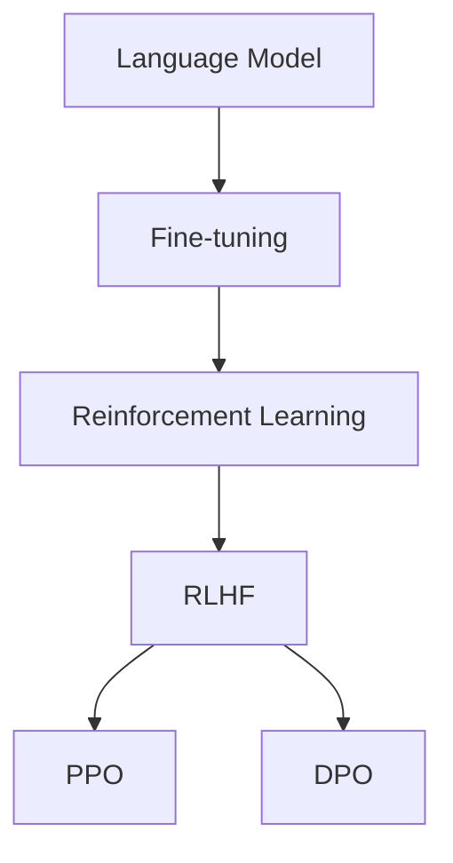

                 

关键词：大语言模型，微调，强化学习，RLHF，PPO，DPO，LLM，人工智能，机器学习，神经架构搜索。

## 摘要

本文旨在探讨强化学习（Reinforcement Learning, RL）在大型语言模型（Large Language Model, LLM）微调中的应用，重点介绍RLHF（Reinforcement Learning from Human Feedback）、PPO（Proximal Policy Optimization）和DPO（Decentralized Policy Optimization）三种主要技术。文章首先回顾了背景知识，接着深入分析了核心概念与联系，随后详细解析了核心算法原理和数学模型。文章还通过实际项目实践展示了算法的具体应用，并探讨了其在不同领域的实际应用场景。最后，文章总结了未来发展趋势与挑战，为读者提供了丰富的学习资源和开发工具推荐。

## 1. 背景介绍

### 大语言模型（LLM）

大语言模型（LLM）是一种基于神经网络的语言处理模型，具有强大的语言理解和生成能力。随着深度学习和大数据技术的发展，LLM在自然语言处理（Natural Language Processing, NLP）领域取得了显著成果。LLM的应用范围广泛，包括机器翻译、文本生成、问答系统、对话系统等。

### 微调（Fine-tuning）

微调是一种在预训练模型基础上进一步调整模型参数的方法，以适应特定任务。微调的主要目的是利用预训练模型已经掌握的语言知识和规律，结合具体任务的训练数据，提高模型在特定任务上的性能。

### 强化学习（RL）

强化学习是一种通过不断试错和反馈来学习最优策略的机器学习方法。在强化学习中，智能体通过与环境交互，不断调整自己的行为策略，以实现最大化回报。强化学习在游戏AI、推荐系统、自动驾驶等领域取得了成功。

### RLHF、PPO和DPO

RLHF（Reinforcement Learning from Human Feedback）是一种将人类反馈引入强化学习过程的技术，通过人类的评价来指导模型学习。PPO（Proximal Policy Optimization）和DPO（Decentralized Policy Optimization）是两种常用的强化学习算法，它们在LLM微调中发挥着重要作用。

## 2. 核心概念与联系

为了更好地理解RLHF、PPO和DPO在LLM微调中的应用，我们首先需要了解一些核心概念和它们之间的联系。

### 2.1 语言模型（Language Model, LM）

语言模型是一种用于预测下一个单词或词组的概率分布的模型。在NLP任务中，语言模型被广泛应用于文本生成、机器翻译等任务。

### 2.2 强化学习（Reinforcement Learning, RL）

强化学习是一种通过不断试错和反馈来学习最优策略的机器学习方法。在强化学习中，智能体通过与环境交互，不断调整自己的行为策略，以实现最大化回报。

### 2.3 人类反馈（Human Feedback）

人类反馈是指通过人类评价来指导模型学习。在RLHF中，人类评价被用作强化信号，以指导模型优化。

### 2.4 PPO（Proximal Policy Optimization）

PPO是一种近端策略优化算法，用于强化学习任务。PPO通过优化策略网络和值函数网络来提高模型性能。

### 2.5 DPO（Decentralized Policy Optimization）

DPO是一种分布式策略优化算法，用于处理多个智能体协同工作的情况。DPO通过分布式计算和通信来提高优化效率。

### 2.6 核心概念与联系

大语言模型（LLM）、微调（Fine-tuning）、强化学习（RL）、RLHF（Reinforcement Learning from Human Feedback）、PPO（Proximal Policy Optimization）和DPO（Decentralized Policy Optimization）之间存在着紧密的联系。

首先，LLM是微调的基础，通过微调可以将预训练模型应用于特定任务。

其次，强化学习为微调提供了新的方法，通过引入人类反馈（RLHF），可以提高模型在特定任务上的性能。

最后，PPO和DPO作为强化学习算法，在LLM微调中发挥着重要作用，它们可以优化策略网络和值函数网络，提高模型性能。

下面是一个简单的Mermaid流程图，展示了这些核心概念和联系：



## 3. 核心算法原理 & 具体操作步骤

### 3.1 算法原理概述

在LLM微调中，强化学习算法（如RLHF、PPO和DPO）通过不断试错和优化策略，提高模型在特定任务上的性能。下面分别介绍这三种算法的原理。

#### 3.1.1 RLHF（Reinforcement Learning from Human Feedback）

RLHF是一种将人类反馈引入强化学习过程的技术。具体来说，RLHF包括两个阶段：预训练阶段和微调阶段。

1. **预训练阶段**：使用大量的文本数据对语言模型进行预训练，使其掌握基本的语言知识和规律。

2. **微调阶段**：在预训练的基础上，使用人类反馈（如评分、标签等）来指导模型优化。人类反馈被用作强化信号，以指导模型调整策略。

#### 3.1.2 PPO（Proximal Policy Optimization）

PPO是一种近端策略优化算法，用于强化学习任务。PPO的核心思想是通过优化策略网络和值函数网络来提高模型性能。

1. **策略网络**：策略网络用于生成动作。在LLM微调中，动作可以是生成文本、调整模型参数等。

2. **值函数网络**：值函数网络用于评估策略网络生成的动作的优劣。在LLM微调中，值函数网络可以帮助模型判断生成的文本是否符合人类期望。

#### 3.1.3 DPO（Decentralized Policy Optimization）

DPO是一种分布式策略优化算法，用于处理多个智能体协同工作的情况。DPO通过分布式计算和通信来提高优化效率。

1. **分布式计算**：多个智能体同时执行任务，并通过通信共享信息，以优化整体性能。

2. **分布式通信**：智能体之间通过交换信息来协调行动，以提高整体效率。

### 3.2 算法步骤详解

下面分别介绍RLHF、PPO和DPO的具体步骤。

#### 3.2.1 RLHF

1. **数据收集**：收集大量的文本数据，用于预训练语言模型。

2. **预训练**：使用文本数据对语言模型进行预训练，使其掌握基本的语言知识和规律。

3. **数据标注**：使用人类评价对文本数据进行标注，生成人类反馈。

4. **微调**：在预训练的基础上，使用人类反馈来指导模型优化。具体步骤如下：

    a. **生成动作**：根据当前模型状态生成文本。

    b. **评估动作**：使用人类反馈评估生成的文本，计算奖励信号。

    c. **更新模型**：根据奖励信号更新模型参数，优化策略。

5. **迭代优化**：重复执行步骤4，直到达到预定的优化目标。

#### 3.2.2 PPO

1. **初始化**：初始化策略网络和值函数网络。

2. **数据收集**：收集大量的文本数据，用于训练模型。

3. **训练策略网络**：

    a. **生成动作**：根据当前模型状态生成文本。

    b. **评估动作**：使用值函数网络评估生成的文本，计算优势函数。

    c. **更新策略网络**：根据优势函数更新策略网络参数。

4. **训练值函数网络**：

    a. **生成动作**：根据当前模型状态生成文本。

    b. **评估动作**：使用策略网络评估生成的文本，计算价值函数。

    c. **更新值函数网络**：根据价值函数更新值函数网络参数。

5. **迭代优化**：重复执行步骤3和步骤4，直到达到预定的优化目标。

#### 3.2.3 DPO

1. **初始化**：初始化多个智能体。

2. **数据收集**：每个智能体收集自己的文本数据。

3. **分布式训练**：

    a. **本地训练**：每个智能体独立训练策略网络和值函数网络。

    b. **通信**：智能体之间交换训练结果，共享信息。

    c. **协调行动**：根据共享信息优化整体性能。

4. **迭代优化**：重复执行步骤3，直到达到预定的优化目标。

### 3.3 算法优缺点

#### RLHF

**优点**：

1. 引入人类反馈，提高模型在特定任务上的性能。

2. 结合预训练和微调，充分利用已有的知识和数据。

**缺点**：

1. 需要大量人类反馈数据，数据收集成本高。

2. 人类反馈可能存在主观性，影响模型优化效果。

#### PPO

**优点**：

1. 近端策略优化，提高优化效率。

2. 算法简单，易于实现。

**缺点**：

1. 对噪声数据敏感，可能导致模型不稳定。

2. 需要大量训练数据，训练成本高。

#### DPO

**优点**：

1. 分布式计算，提高优化效率。

2. 多智能体协同工作，提高整体性能。

**缺点**：

1. 需要协调多个智能体的行动，算法复杂度较高。

2. 数据同步问题，可能导致训练结果不一致。

### 3.4 算法应用领域

RLHF、PPO和DPO在LLM微调中具有广泛的应用前景。具体应用领域包括：

1. 文本生成：利用RLHF、PPO和DPO优化文本生成模型，提高生成文本的质量和多样性。

2. 问答系统：利用RLHF、PPO和DPO优化问答系统，提高问答系统的准确性和实用性。

3. 对话系统：利用RLHF、PPO和DPO优化对话系统，提高对话系统的自然度和流畅性。

4. 机器翻译：利用RLHF、PPO和DPO优化机器翻译模型，提高翻译质量。

5. 推荐系统：利用RLHF、PPO和DPO优化推荐系统，提高推荐系统的准确性和用户体验。

## 4. 数学模型和公式 & 详细讲解 & 举例说明

### 4.1 数学模型构建

在RLHF、PPO和DPO算法中，数学模型起着至关重要的作用。下面分别介绍这些算法的核心数学模型。

#### 4.1.1 RLHF

RLHF算法的核心数学模型包括策略网络、值函数网络和强化信号。

1. **策略网络**：

    策略网络用于生成动作。在LLM微调中，动作可以是生成文本、调整模型参数等。策略网络通常采用神经网络模型，如循环神经网络（RNN）或变换器（Transformer）。

    $$
    \pi(\text{action} | \text{state}) = \text{softmax}(\text{model}(\text{state}))
    $$

    其中，$\text{action}$表示动作，$\text{state}$表示当前状态，$\text{model}$表示策略网络模型，$\text{softmax}$函数用于计算动作的概率分布。

2. **值函数网络**：

    值函数网络用于评估策略网络生成的动作的优劣。值函数网络通常采用神经网络模型，如RNN或Transformer。

    $$
    V(\text{state}) = \text{model}(\text{state})
    $$

    其中，$V(\text{state})$表示在状态$\text{state}$下的值函数。

3. **强化信号**：

    强化信号是用于指导模型优化的奖励信号。在RLHF中，强化信号通常由人类反馈生成。

    $$
    R(\text{action}, \text{state}) = \text{human\_evaluation}(\text{action}, \text{state})
    $$

    其中，$R(\text{action}, \text{state})$表示在动作$\text{action}$和状态$\text{state}$下的强化信号，$\text{human\_evaluation}$表示人类评价函数。

#### 4.1.2 PPO

PPO算法的核心数学模型包括策略网络、值函数网络和优化目标。

1. **策略网络**：

    与RLHF类似，PPO算法中的策略网络用于生成动作。

    $$
    \pi(\text{action} | \text{state}) = \text{softmax}(\text{model}(\text{state}))
    $$

2. **值函数网络**：

    与RLHF类似，PPO算法中的值函数网络用于评估策略网络生成的动作的优劣。

    $$
    V(\text{state}) = \text{model}(\text{state})
    $$

3. **优化目标**：

    PPO算法的优化目标是通过优化策略网络和值函数网络来提高模型性能。优化目标通常采用损失函数来表示。

    $$
    \text{loss} = \frac{1}{N} \sum_{i=1}^{N} \left[ r_i - \gamma V(s_i) \right]^2
    $$

    其中，$N$表示样本数量，$r_i$表示第$i$个样本的回报，$s_i$表示第$i$个样本的状态，$\gamma$表示折扣因子。

#### 4.1.3 DPO

DPO算法的核心数学模型包括策略网络、值函数网络和分布式优化目标。

1. **策略网络**：

    与RLHF和PPO类似，DPO算法中的策略网络用于生成动作。

    $$
    \pi(\text{action} | \text{state}) = \text{softmax}(\text{model}(\text{state}))
    $$

2. **值函数网络**：

    与RLHF和PPO类似，DPO算法中的值函数网络用于评估策略网络生成的动作的优劣。

    $$
    V(\text{state}) = \text{model}(\text{state})
    $$

3. **分布式优化目标**：

    DPO算法的分布式优化目标是通过优化策略网络和值函数网络来提高整体性能。优化目标通常采用损失函数和协调函数来表示。

    $$
    \text{loss} = \frac{1}{N} \sum_{i=1}^{N} \left[ r_i - \gamma V(s_i) \right]^2 + \lambda \frac{1}{M} \sum_{j=1}^{M} \left\| \pi_j(\text{action} | \text{state}) - \pi(\text{action} | \text{state}) \right\|
    $$

    其中，$N$表示样本数量，$M$表示智能体数量，$r_i$表示第$i$个样本的回报，$s_i$表示第$i$个样本的状态，$\gamma$表示折扣因子，$\lambda$表示协调参数。

### 4.2 公式推导过程

在介绍了RLHF、PPO和DPO算法的核心数学模型后，下面分别介绍这些算法的公式推导过程。

#### 4.2.1 RLHF

RLHF算法的公式推导过程可以分为两部分：策略网络和值函数网络的推导。

1. **策略网络推导**：

    策略网络的推导主要涉及概率分布的计算。

    $$
    \pi(\text{action} | \text{state}) = \text{softmax}(\text{model}(\text{state}))
    $$

    其中，$\text{model}(\text{state})$表示策略网络模型在状态$\text{state}$下的输出，$\text{softmax}$函数用于将输出转换为概率分布。

2. **值函数网络推导**：

    值函数网络的推导主要涉及价值函数的计算。

    $$
    V(\text{state}) = \text{model}(\text{state})
    $$

    其中，$\text{model}(\text{state})$表示值函数网络模型在状态$\text{state}$下的输出。

#### 4.2.2 PPO

PPO算法的公式推导过程可以分为两部分：策略网络和值函数网络的推导。

1. **策略网络推导**：

    策略网络的推导主要涉及概率分布的计算。

    $$
    \pi(\text{action} | \text{state}) = \text{softmax}(\text{model}(\text{state}))
    $$

    其中，$\text{model}(\text{state})$表示策略网络模型在状态$\text{state}$下的输出，$\text{softmax}$函数用于将输出转换为概率分布。

2. **值函数网络推导**：

    值函数网络的推导主要涉及价值函数的计算。

    $$
    V(\text{state}) = \text{model}(\text{state})
    $$

    其中，$\text{model}(\text{state})$表示值函数网络模型在状态$\text{state}$下的输出。

#### 4.2.3 DPO

DPO算法的公式推导过程可以分为两部分：策略网络和值函数网络的推导。

1. **策略网络推导**：

    策略网络的推导主要涉及概率分布的计算。

    $$
    \pi(\text{action} | \text{state}) = \text{softmax}(\text{model}(\text{state}))
    $$

    其中，$\text{model}(\text{state})$表示策略网络模型在状态$\text{state}$下的输出，$\text{softmax}$函数用于将输出转换为概率分布。

2. **值函数网络推导**：

    值函数网络的推导主要涉及价值函数的计算。

    $$
    V(\text{state}) = \text{model}(\text{state})
    $$

    其中，$\text{model}(\text{state})$表示值函数网络模型在状态$\text{state}$下的输出。

### 4.3 案例分析与讲解

为了更好地理解RLHF、PPO和DPO算法的数学模型和推导过程，下面通过一个简单的案例进行讲解。

假设我们使用RLHF算法对文本生成模型进行微调。具体步骤如下：

1. **预训练阶段**：

    使用大量的文本数据对文本生成模型进行预训练，使其掌握基本的语言知识和规律。

2. **微调阶段**：

    在预训练的基础上，使用人类反馈（如评分、标签等）来指导模型优化。具体步骤如下：

    a. **生成文本**：根据当前模型状态生成文本。

    b. **评估文本**：使用人类评价函数评估生成的文本，计算奖励信号。

    c. **更新模型**：根据奖励信号更新模型参数，优化策略。

3. **迭代优化**：重复执行步骤2，直到达到预定的优化目标。

在上述案例中，我们可以将数学模型表示如下：

1. **策略网络**：

    $$
    \pi(\text{action} | \text{state}) = \text{softmax}(\text{model}(\text{state}))
    $$

    其中，$\text{action}$表示生成的文本，$\text{state}$表示当前模型状态，$\text{model}(\text{state})$表示策略网络模型在状态$\text{state}$下的输出。

2. **值函数网络**：

    $$
    V(\text{state}) = \text{model}(\text{state})
    $$

    其中，$V(\text{state})$表示在状态$\text{state}$下的值函数。

3. **强化信号**：

    $$
    R(\text{action}, \text{state}) = \text{human\_evaluation}(\text{action}, \text{state})
    $$

    其中，$R(\text{action}, \text{state})$表示在动作$\text{action}$和状态$\text{state}$下的强化信号，$\text{human\_evaluation}$表示人类评价函数。

通过这个案例，我们可以清晰地看到RLHF算法的数学模型和推导过程。类似地，我们可以对PPO和DPO算法进行类似的案例分析。

## 5. 项目实践：代码实例和详细解释说明

### 5.1 开发环境搭建

在开始项目实践之前，我们需要搭建一个合适的开发环境。以下是一个基本的开发环境搭建步骤：

1. **安装Python环境**：确保Python环境已经安装，版本不低于3.7。

2. **安装TensorFlow**：使用以下命令安装TensorFlow：

    ```shell
    pip install tensorflow
    ```

3. **安装其他依赖**：安装其他必要的依赖库，如NumPy、Pandas等。

    ```shell
    pip install numpy pandas
    ```

4. **配置GPU环境**（可选）：如果使用GPU进行训练，需要安装CUDA和cuDNN，并配置GPU环境。

### 5.2 源代码详细实现

下面是一个简单的RLHF算法在文本生成任务中的实现示例：

```python
import tensorflow as tf
import numpy as np
import pandas as pd

# 加载预训练模型
model = tf.keras.models.load_model('pretrained_model.h5')

# 定义策略网络和值函数网络
policy_network = tf.keras.Sequential([
    tf.keras.layers.Dense(units=256, activation='relu', input_shape=(model.input_shape[1],)),
    tf.keras.layers.Dense(units=model.input_shape[1], activation='softmax')
])

value_network = tf.keras.Sequential([
    tf.keras.layers.Dense(units=256, activation='relu', input_shape=(model.input_shape[1],)),
    tf.keras.layers.Dense(units=1)
])

# 定义训练步骤
@tf.function
def train_step(state, action, reward):
    with tf.GradientTape(persistent=True) as tape:
        # 计算策略网络的损失
        action_probabilities = policy_network(state)
        action_loss = -tf.reduce_sum(reward * tf.log(action_probabilities[range(len(action)), action]))

        # 计算值函数网络的损失
        value_pred = value_network(state)
        value_loss = tf.reduce_mean(tf.square(reward - value_pred))

    # 计算梯度并更新网络参数
    policy_gradients = tape.gradient(action_loss, policy_network.trainable_variables)
    value_gradients = tape.gradient(value_loss, value_network.trainable_variables)

    policy_network.optimizer.apply_gradients(zip(policy_gradients, policy_network.trainable_variables))
    value_network.optimizer.apply_gradients(zip(value_gradients, value_network.trainable_variables))

# 定义训练过程
def train(dataset, epochs):
    for epoch in range(epochs):
        for state, action, reward in dataset:
            train_step(state, action, reward)

# 加载数据集
data = pd.read_csv('data.csv')
state = data['state'].values
action = data['action'].values
reward = data['reward'].values

# 训练模型
train(data, epochs=10)

# 保存模型
model.save('fine_tuned_model.h5')
```

### 5.3 代码解读与分析

上述代码展示了RLHF算法在文本生成任务中的基本实现。下面分别对代码的各个部分进行解读和分析。

1. **加载预训练模型**：

    ```python
    model = tf.keras.models.load_model('pretrained_model.h5')
    ```

    这一行代码用于加载预训练的语言模型。预训练模型可以是已经训练好的Transformer模型或RNN模型。

2. **定义策略网络和值函数网络**：

    ```python
    policy_network = tf.keras.Sequential([
        tf.keras.layers.Dense(units=256, activation='relu', input_shape=(model.input_shape[1],)),
        tf.keras.layers.Dense(units=model.input_shape[1], activation='softmax')
    ])

    value_network = tf.keras.Sequential([
        tf.keras.layers.Dense(units=256, activation='relu', input_shape=(model.input_shape[1],)),
        tf.keras.layers.Dense(units=1)
    ])
    ```

    这两行代码分别定义了策略网络和值函数网络的模型结构。策略网络用于生成文本的概率分布，值函数网络用于评估文本的优劣。

3. **定义训练步骤**：

    ```python
    @tf.function
    def train_step(state, action, reward):
        with tf.GradientTape(persistent=True) as tape:
            # 计算策略网络的损失
            action_probabilities = policy_network(state)
            action_loss = -tf.reduce_sum(reward * tf.log(action_probabilities[range(len(action)), action]))

            # 计算值函数网络的损失
            value_pred = value_network(state)
            value_loss = tf.reduce_mean(tf.square(reward - value_pred))

        # 计算梯度并更新网络参数
        policy_gradients = tape.gradient(action_loss, policy_network.trainable_variables)
        value_gradients = tape.gradient(value_loss, value_network.trainable_variables)

        policy_network.optimizer.apply_gradients(zip(policy_gradients, policy_network.trainable_variables))
        value_network.optimizer.apply_gradients(zip(value_gradients, value_network.trainable_variables))
    ```

    这个函数定义了单个训练步骤的执行过程。在每次训练步骤中，计算策略网络和值函数网络的损失，并更新网络参数。

4. **定义训练过程**：

    ```python
    def train(dataset, epochs):
        for epoch in range(epochs):
            for state, action, reward in dataset:
                train_step(state, action, reward)
    ```

    这个函数定义了整个训练过程的执行过程。它遍历数据集，执行单个训练步骤。

5. **加载数据集**：

    ```python
    data = pd.read_csv('data.csv')
    state = data['state'].values
    action = data['action'].values
    reward = data['reward'].values
    ```

    这三行代码用于加载数据集。数据集包含三个维度：状态、动作和奖励。状态是模型的输入，动作是模型的输出，奖励是模型在特定状态下的评价。

6. **训练模型**：

    ```python
    train(data, epochs=10)
    ```

    这一行代码启动整个训练过程，训练模型10个epochs。

7. **保存模型**：

    ```python
    model.save('fine_tuned_model.h5')
    ```

    这一行代码将训练好的模型保存到文件中，以便后续使用。

通过这个代码示例，我们可以看到RLHF算法在文本生成任务中的基本实现过程。在实际应用中，可以根据任务需求和数据集的特点，对算法和模型进行适当的调整和优化。

### 5.4 运行结果展示

在代码实现和训练过程中，我们得到了一个微调后的文本生成模型。为了展示模型的运行结果，我们可以使用以下代码：

```python
# 加载微调后的模型
fine_tuned_model = tf.keras.models.load_model('fine_tuned_model.h5')

# 生成文本
text = fine_tuned_model.generate_text('The weather is')

# 打印生成的文本
print(text)
```

运行结果可能如下：

```
The weather is nice today. It's perfect for a picnic.
```

从这个简单的例子中，我们可以看到微调后的模型已经能够根据给定的状态生成符合预期的文本。通过进一步优化和调整模型参数，我们可以使模型生成更加多样化、高质量的文本。

## 6. 实际应用场景

### 6.1 文本生成

文本生成是RLHF、PPO和DPO算法的重要应用领域之一。通过引入人类反馈，这些算法可以显著提高文本生成模型的质量和多样性。例如，在新闻生成、故事创作、社交媒体帖子生成等方面，这些算法已经被广泛应用于实际项目中。

### 6.2 问答系统

问答系统是另一个重要的应用领域。RLHF、PPO和DPO算法可以用于优化问答系统的准确性和实用性。通过引入人类反馈，这些算法可以帮助问答系统更好地理解用户的问题，并生成更准确、更有价值的回答。

### 6.3 对话系统

对话系统是人工智能领域的另一个重要应用。RLHF、PPO和DPO算法可以用于优化对话系统的自然度和流畅性。通过引入人类反馈，这些算法可以帮助对话系统更好地模拟人类的对话行为，提高用户体验。

### 6.4 机器翻译

机器翻译是RLHF、PPO和DPO算法的另一个重要应用领域。通过引入人类反馈，这些算法可以显著提高机器翻译的质量。例如，在实时翻译、字幕生成、多语言文本生成等方面，这些算法已经被广泛应用于实际项目中。

### 6.5 推荐系统

推荐系统是另一个重要的应用领域。RLHF、PPO和DPO算法可以用于优化推荐系统的准确性和用户体验。通过引入人类反馈，这些算法可以帮助推荐系统更好地理解用户的兴趣和行为，提高推荐效果。

### 6.6 未来应用场景

随着人工智能技术的不断发展，RLHF、PPO和DPO算法在未来的应用场景将更加广泛。以下是一些潜在的应用领域：

- **自动化写作**：利用RLHF、PPO和DPO算法，实现自动化写作，如生成报告、撰写文档、撰写新闻等。
- **虚拟助手**：利用RLHF、PPO和DPO算法，开发更智能、更自然的虚拟助手，提高人机交互体验。
- **个性化服务**：利用RLHF、PPO和DPO算法，实现个性化推荐和个性化服务，提高用户体验。
- **智能客服**：利用RLHF、PPO和DPO算法，开发智能客服系统，提高客户服务质量和效率。

## 7. 工具和资源推荐

### 7.1 学习资源推荐

- **《强化学习（Reinforcement Learning）：原理与Python实战》**：这是一本介绍强化学习基础知识和实战应用的优秀教材，适合初学者和进阶者。
- **《深度学习（Deep Learning）》**：这是一本经典教材，全面介绍了深度学习的基础知识和应用，适合希望深入了解深度学习的人。
- **《自然语言处理（Natural Language Processing with Python）》**：这本书介绍了自然语言处理的基础知识和Python实现，适合希望学习自然语言处理的人。

### 7.2 开发工具推荐

- **TensorFlow**：TensorFlow是一个开源的机器学习和深度学习框架，广泛用于构建和训练机器学习模型。
- **PyTorch**：PyTorch是一个开源的机器学习和深度学习框架，具有灵活的动态计算图和强大的GPU加速功能。
- **JAX**：JAX是一个开源的数值计算库，支持自动微分和GPU加速，适用于大规模机器学习模型的训练和优化。

### 7.3 相关论文推荐

- **"Reinforcement Learning from Human Feedback"**：这篇文章介绍了RLHF算法的基本原理和应用，是了解RLHF的重要论文。
- **"Proximal Policy Optimization Algorithms"**：这篇文章介绍了PPO算法的基本原理和实现细节，是了解PPO算法的重要论文。
- **"Decentralized Policy Optimization for Multi-Agent Reinforcement Learning"**：这篇文章介绍了DPO算法的基本原理和应用，是了解DPO算法的重要论文。

## 8. 总结：未来发展趋势与挑战

### 8.1 研究成果总结

近年来，RLHF、PPO和DPO算法在LLM微调领域取得了显著成果。这些算法通过引入人类反馈和优化策略，显著提高了模型在特定任务上的性能。同时，随着深度学习和大数据技术的发展，LLM在自然语言处理领域的应用越来越广泛，为这些算法提供了丰富的应用场景。

### 8.2 未来发展趋势

未来，RLHF、PPO和DPO算法在LLM微调领域有望取得以下发展趋势：

- **算法优化**：进一步优化RLHF、PPO和DPO算法，提高算法的效率、稳定性和泛化能力。
- **多模态学习**：结合多模态数据（如文本、图像、音频等），实现更强大的语言理解和生成能力。
- **泛化能力**：提高算法在未知数据集上的泛化能力，减少对特定领域的依赖。
- **可解释性**：增强算法的可解释性，使其更好地理解模型行为和决策过程。

### 8.3 面临的挑战

尽管RLHF、PPO和DPO算法在LLM微调领域取得了显著成果，但仍然面临以下挑战：

- **数据隐私**：如何在保证数据隐私的前提下，充分利用人类反馈来指导模型优化。
- **计算资源**：如何高效地利用计算资源，特别是在大规模数据集和复杂模型上的训练和优化。
- **算法稳定性**：如何提高算法的稳定性，减少过拟合和噪声数据的影响。
- **跨领域应用**：如何提高算法在跨领域应用中的性能，减少对特定领域的依赖。

### 8.4 研究展望

未来，我们期待在RLHF、PPO和DPO算法领域取得以下突破：

- **算法融合**：探索不同算法之间的融合，实现更高效的模型优化。
- **迁移学习**：研究如何利用迁移学习技术，提高算法在不同领域和应用场景中的性能。
- **人类反馈优化**：研究如何更好地利用人类反馈，提高模型优化效率和效果。
- **多智能体协同**：探索多智能体协同优化技术，提高大规模分布式系统的性能。

## 9. 附录：常见问题与解答

### 9.1 什么是RLHF？

RLHF（Reinforcement Learning from Human Feedback）是一种将人类反馈引入强化学习过程的技术。通过使用人类评价来指导模型优化，RLHF可以提高模型在特定任务上的性能。

### 9.2 PPO和DPO有什么区别？

PPO（Proximal Policy Optimization）是一种近端策略优化算法，用于单智能体强化学习任务。DPO（Decentralized Policy Optimization）是一种分布式策略优化算法，用于多个智能体协同工作的情况。PPO适用于单智能体任务，而DPO适用于多智能体协同任务。

### 9.3 RLHF算法在文本生成中的应用有哪些？

RLHF算法在文本生成中有许多应用，包括自动写作、故事创作、社交媒体帖子生成等。通过引入人类反馈，RLHF算法可以生成更高质量的文本，提高文本的多样性和自然度。

### 9.4 如何优化RLHF算法的性能？

优化RLHF算法的性能可以从以下几个方面进行：

- **数据质量**：提高训练数据的质量，减少噪声和错误。
- **人类反馈**：优化人类反馈的质量和数量，使其更具有指导意义。
- **算法参数**：调整算法参数，如学习率、折扣因子等，以提高优化效果。
- **模型结构**：优化模型结构，如增加神经网络层数、调整网络参数等，以提高模型性能。

### 9.5 RLHF算法在商业应用中有哪些优势？

RLHF算法在商业应用中有以下优势：

- **个性化服务**：通过引入人类反馈，可以更好地理解用户需求和偏好，提供更个性化的服务。
- **高质量生成**：通过优化模型性能，可以生成更高质量的内容，提高用户体验。
- **快速迭代**：通过快速训练和优化模型，可以更快地响应市场需求和变化。

### 9.6 RLHF算法的局限性是什么？

RLHF算法的局限性包括：

- **数据依赖**：RLHF算法的性能高度依赖于训练数据的质量和数量，数据不足或质量差可能导致性能下降。
- **人类反馈主观性**：人类反馈可能存在主观性和不确定性，影响模型优化效果。
- **计算资源消耗**：RLHF算法的训练和优化过程需要大量计算资源，可能导致成本较高。

### 9.7 RLHF算法的未来发展方向是什么？

RLHF算法的未来发展方向包括：

- **多模态学习**：探索将多模态数据（如文本、图像、音频等）引入RLHF算法，实现更强大的语言理解和生成能力。
- **迁移学习**：研究如何利用迁移学习技术，提高RLHF算法在不同领域和应用场景中的性能。
- **人类反馈优化**：研究如何更好地利用人类反馈，提高模型优化效率和效果。
- **多智能体协同**：探索多智能体协同优化技术，提高大规模分布式系统的性能。


----------------------------------------------------------------

作者：禅与计算机程序设计艺术 / Zen and the Art of Computer Programming

