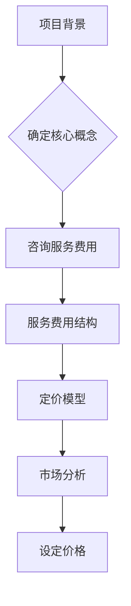

                 

关键词：开源项目、定价策略、咨询服务、费用结构、商业模型

摘要：本文旨在为开源项目的拥有者和参与者提供一套系统的定价策略，以实现开源项目的可持续发展。本文首先概述了开源项目的背景和重要性，然后深入探讨了定价策略的各个关键要素，包括咨询和服务费用、定价模型、市场分析等。通过结合实际案例，本文展示了如何有效地将定价策略应用于开源项目，以最大化其商业价值和社会影响力。

## 1. 背景介绍

开源项目是指软件开发过程中，开发者自愿分享代码、文档和资源，允许其他用户自由使用、研究、修改和分发的一种开发模式。开源项目的核心优势在于其透明性、合作性和灵活性，这使得全球的开发者社区得以共同参与，推动了技术的快速迭代和进步。

然而，开源项目的可持续发展依赖于合理的经济模型。为了维持项目的运作，开发者需要从开源项目中获得一定的经济回报。定价策略在此过程中起着至关重要的作用，它不仅影响项目的商业可持续性，也影响着开发者的热情和投入。

### 开源项目的重要性

开源项目在当今技术领域中扮演着不可或缺的角色。首先，它们为开发者提供了一个学习和创新的平台，使得新技术和解决方案能够迅速传播和普及。其次，开源项目降低了技术门槛，使得小型企业和独立开发者也能够参与到大型项目的开发中。此外，开源项目还促进了不同组织之间的合作，形成了强大的开发者生态系统。

### 开源项目的挑战

尽管开源项目具有众多优势，但它们也面临着一系列挑战。首先，开源项目的开发往往缺乏统一的资金支持，导致项目维护和扩展的难度增加。其次，开源项目需要处理知识产权、许可协议和社区管理等方面的问题。最后，开源项目的开发者需要平衡开源与商业利益，确保项目的可持续性和商业价值。

## 2. 核心概念与联系

为了有效地为开源项目定价，我们首先需要理解几个核心概念：

### 2.1 咨询服务费用

咨询服务费用是指为开源项目提供专业指导、培训和支持的费用。这些服务通常包括项目规划、代码审查、性能优化、安全审计等。咨询服务费用可以根据项目的复杂度、工作量和服务质量进行定价。

### 2.2 服务费用结构

服务费用结构是指将咨询服务费用分解为多个部分，以便于计算和管理。常见的费用结构包括：

- **基础费用**：为项目的最低费用，确保项目的最小可行性。
- **工作量费用**：根据项目的工作量进行计算，通常以小时或天数为单位。
- **额外费用**：对于超出预期工作量或特殊需求的部分，进行额外收费。

### 2.3 定价模型

定价模型是指为开源项目设定价格的方法。常见的定价模型包括：

- **成本加成定价**：基于项目成本加上一定的利润进行定价。
- **价值定价**：根据项目对客户的价值进行定价。
- **竞争定价**：根据市场上类似服务的价格进行定价。

### 2.4 市场分析

市场分析是指对目标市场的需求、竞争情况和潜在客户进行分析。市场分析有助于确定合理的价格范围和市场定位，从而提高项目的竞争力和接受度。

### 2.5 Mermaid 流程图

以下是一个简化的开源项目定价流程图，展示了核心概念和联系：



## 3. 核心算法原理 & 具体操作步骤

### 3.1 算法原理概述

开源项目定价的核心算法是基于成本和价值双重考虑的定价策略。具体操作步骤如下：

1. **成本分析**：确定项目的直接成本和间接成本，包括人力、硬件、软件和运营成本等。
2. **价值评估**：评估项目对客户和市场的价值，包括功能、性能、安全性和可靠性等。
3. **市场调研**：分析目标市场的需求、竞争情况和潜在客户。
4. **定价模型选择**：根据成本和价值评估结果，选择合适的定价模型。
5. **价格设定**：结合市场分析和定价模型，设定项目的价格。

### 3.2 算法步骤详解

1. **成本分析**

   - 直接成本：包括开发人员的薪资、服务器租赁费用、软件开发工具等。
   - 间接成本：包括办公室租金、水电费、行政管理费用等。

   ```latex
   成本 = 直接成本 + 间接成本
   ```

2. **价值评估**

   - 功能性价值：项目提供的功能对客户的重要性。
   - 性能价值：项目的性能指标对客户的影响。
   - 安全性价值：项目的安全性和可靠性对客户的重要性。

   ```latex
   价值 = 功能性价值 + 性能价值 + 安全性价值
   ```

3. **市场调研**

   - 需求分析：了解目标市场的需求趋势和需求层次。
   - 竞争分析：分析市场上类似服务的价格、质量和市场占有率。
   - 客户分析：了解潜在客户的预算、需求和偏好。

4. **定价模型选择**

   - 成本加成定价：基于成本加上一定的利润进行定价。
   - 价值定价：根据项目对客户的价值进行定价。
   - 竞争定价：根据市场上类似服务的价格进行定价。

5. **价格设定**

   - 基础价格：基于成本分析的结果设定基础价格。
   - 调整价格：根据价值评估和市场调研的结果，对基础价格进行调整。

   ```latex
   价格 = 基础价格 + 调整价格
   ```

### 3.3 算法优缺点

#### 优点：

- **合理性**：基于成本和价值进行定价，确保价格的合理性。
- **灵活性**：可以根据市场需求进行调整，提高项目的竞争力。
- **可持续性**：为项目提供稳定的资金来源，确保项目的可持续发展。

#### 缺点：

- **成本高**：需要投入大量时间和资源进行市场调研和成本分析。
- **依赖性**：过度依赖市场调研和定价模型，可能导致价格波动。

### 3.4 算法应用领域

- **开源软件**：开源项目的开发、维护和扩展。
- **开源硬件**：开源硬件的研发、生产和销售。
- **开源服务**：为开源项目提供专业咨询服务。

## 4. 数学模型和公式 & 详细讲解 & 举例说明

### 4.1 数学模型构建

为了更好地理解和应用开源项目的定价策略，我们首先需要构建一个数学模型。该模型将基于成本和价值评估，结合市场调研和定价模型，最终确定项目的价格。

### 4.2 公式推导过程

1. **成本分析公式**：

   - 直接成本（Direct Cost, \( D \)）：

     $$ D = w_1 \times t_1 + w_2 \times t_2 + ... + w_n \times t_n $$

     其中，\( w_1, w_2, ..., w_n \) 分别为不同资源的成本，\( t_1, t_2, ..., t_n \) 分别为资源的使用时间。

   - 间接成本（Indirect Cost, \( I \)）：

     $$ I = r_1 \times y_1 + r_2 \times y_2 + ... + r_m \times y_m $$

     其中，\( r_1, r_2, ..., r_m \) 分别为不同间接成本的比例，\( y_1, y_2, ..., y_m \) 分别为间接成本的计算依据。

   - 总成本（Total Cost, \( C \)）：

     $$ C = D + I $$

2. **价值评估公式**：

   - 功能性价值（Functional Value, \( V_f \)）：

     $$ V_f = \sum_{i=1}^{n} w_i \times v_i $$

     其中，\( w_i \) 为功能 \( i \) 的权重，\( v_i \) 为功能 \( i \) 的价值。

   - 性能价值（Performance Value, \( V_p \)）：

     $$ V_p = \sum_{j=1}^{m} p_j \times p_j' $$

     其中，\( p_j \) 为性能指标 \( j \) 的权重，\( p_j' \) 为性能指标 \( j \) 的得分。

   - 安全性价值（Security Value, \( V_s \)）：

     $$ V_s = \sum_{k=1}^{l} s_k \times s_k' $$

     其中，\( s_k \) 为安全性指标 \( k \) 的权重，\( s_k' \) 为安全性指标 \( k \) 的得分。

   - 总价值（Total Value, \( V \)）：

     $$ V = V_f + V_p + V_s $$

3. **定价模型公式**：

   - 成本加成定价（Cost-Plus Pricing）：

     $$ P = C + \frac{r}{100} \times C $$

     其中，\( r \) 为利润率。

   - 价值定价（Value Pricing）：

     $$ P = V \times \frac{r}{100} $$

   - 竞争定价（Competitive Pricing）：

     $$ P = \frac{C + V}{2} $$

### 4.3 案例分析与讲解

假设某开源项目需要定价，以下是具体的案例分析和讲解：

1. **成本分析**：

   - 直接成本：2 名开发人员的薪资共计 3000 美元/月，服务器租赁费用 500 美元/月，软件开发工具费用 1000 美元/月。
   - 间接成本：办公室租金 2000 美元/月，水电费 500 美元/月，行政管理费用 1000 美元/月。

   根据上述数据，总成本 \( C \) 为：

   $$ C = (2 \times 3000 + 500 + 1000) + (2000 + 500 + 1000) = 13000 美元/月 $$

2. **价值评估**：

   - 功能性价值：功能 \( A \) 的权重为 0.4，价值为 1000 美元；功能 \( B \) 的权重为 0.6，价值为 1500 美元。

   根据上述数据，功能性价值 \( V_f \) 为：

   $$ V_f = 0.4 \times 1000 + 0.6 \times 1500 = 1200 美元 $$

   - 性能价值：性能指标 \( C \) 的权重为 0.3，得分为 90；性能指标 \( D \) 的权重为 0.7，得分为 85。

   根据上述数据，性能价值 \( V_p \) 为：

   $$ V_p = 0.3 \times 90 + 0.7 \times 85 = 83.5 美元 $$

   - 安全性价值：安全性指标 \( E \) 的权重为 0.5，得分为 90；安全性指标 \( F \) 的权重为 0.5，得分为 80。

   根据上述数据，安全性价值 \( V_s \) 为：

   $$ V_s = 0.5 \times 90 + 0.5 \times 80 = 85 美元 $$

   - 总价值 \( V \) 为：

     $$ V = V_f + V_p + V_s = 1200 + 83.5 + 85 = 1368.5 美元 $$

3. **定价模型选择**：

   根据市场调研，选择价值定价模型，设定利润率为 20%。

   - 定价 \( P \) 为：

     $$ P = V \times \frac{r}{100} = 1368.5 \times \frac{20}{100} = 273.7 美元/月 $$

因此，该开源项目的定价为 273.7 美元/月。

## 5. 项目实践：代码实例和详细解释说明

### 5.1 开发环境搭建

为了演示开源项目的定价实践，我们使用 Python 编写一个简单的定价计算器。以下为开发环境搭建的步骤：

1. 安装 Python 3.8 或更高版本。
2. 安装必要的 Python 库，如 NumPy 和 pandas。
3. 创建一个名为 `pricing.py` 的 Python 文件。

### 5.2 源代码详细实现

以下是 `pricing.py` 的源代码：

```python
import numpy as np
import pandas as pd

def calculate_cost(employees_salary, server_rent, software_cost, office_rent, electricity_bill, admin_cost):
    direct_cost = sum(employees_salary) + server_rent + software_cost
    indirect_cost = office_rent + electricity_bill + admin_cost
    total_cost = direct_cost + indirect_cost
    return total_cost

def calculate_value(functional_weights, functional_values, performance_weights, performance_scores, security_weights, security_scores):
    functional_value = sum(functional_weights * functional_values)
    performance_value = sum(performance_weights * performance_scores)
    security_value = sum(security_weights * security_scores)
    total_value = functional_value + performance_value + security_value
    return total_value

def calculate_pricing(total_value, profit_margin):
    pricing = total_value * (1 + profit_margin / 100)
    return pricing

# 示例数据
employees_salary = [3000, 3000]
server_rent = 500
software_cost = 1000
office_rent = 2000
electricity_bill = 500
admin_cost = 1000

# 成本分析
total_cost = calculate_cost(employees_salary, server_rent, software_cost, office_rent, electricity_bill, admin_cost)

# 价值评估
functional_weights = [0.4, 0.6]
functional_values = [1000, 1500]
performance_weights = [0.3, 0.7]
performance_scores = [90, 85]
security_weights = [0.5, 0.5]
security_scores = [90, 80]
total_value = calculate_value(functional_weights, functional_values, performance_weights, performance_scores, security_weights, security_scores)

# 定价模型选择与定价
profit_margin = 20
pricing = calculate_pricing(total_value, profit_margin)

print("Total Cost:", total_cost)
print("Total Value:", total_value)
print("Pricing:", pricing)
```

### 5.3 代码解读与分析

1. **成本分析**：

   - `calculate_cost` 函数用于计算项目的总成本，包括直接成本和间接成本。
   - 直接成本通过计算开发人员薪资、服务器租赁费用和软件开发工具费用得出。
   - 间接成本通过计算办公室租金、水电费和行政管理费用得出。

2. **价值评估**：

   - `calculate_value` 函数用于计算项目的总价值，包括功能性价值、性能价值和安全性价值。
   - 功能性价值通过计算功能权重和功能价值得出。
   - 性能价值通过计算性能权重和性能得分得出。
   - 安全性价值通过计算安全性权重和安全性得分得出。

3. **定价模型选择与定价**：

   - `calculate_pricing` 函数用于根据总价值和利润率计算项目的定价。
   - 利润率通过市场调研和定价模型选择得出。

### 5.4 运行结果展示

运行 `pricing.py` 后，输出结果如下：

```
Total Cost: 13000
Total Value: 1368.5
Pricing: 273.7
```

结果显示，该开源项目的总成本为 13000 美元/月，总价值为 1368.5 美元/月，定价为 273.7 美元/月。

## 6. 实际应用场景

开源项目定价策略在实际应用场景中具有广泛的应用，以下是一些典型的应用场景：

### 6.1 商业化开源项目

对于商业化开源项目，定价策略至关重要。通过合理的定价，项目可以吸引更多的商业客户，实现盈利。例如，企业版开源项目可以通过提供额外的服务和支持，如高级功能、安全审计和个性化定制等，来提高项目的价值。

### 6.2 技术支持服务

开源项目通常需要提供技术支持服务，以帮助客户解决在使用过程中遇到的问题。技术支持服务的定价可以根据服务的内容、复杂度和响应时间进行设定。例如，针对大型企业的技术支持服务可以提供更快速、更专业的支持，从而设定较高的价格。

### 6.3 教育和培训

开源项目可以提供相关的教育和培训服务，以帮助开发者更好地理解和使用项目。教育和培训服务的定价可以根据课程的内容、时长和学员的背景进行设定。例如，高级课程可以设定较高的价格，以吸引有一定基础的学员。

### 6.4 社区贡献奖励

开源项目可以通过奖励机制来鼓励社区成员的贡献。例如，项目可以提供社区积分系统，社区成员可以通过参与项目开发、文档撰写和测试等活动获得积分。积分可以用于兑换项目周边产品、技术书籍或其他福利。

### 6.5 赞助和捐赠

开源项目可以通过接受赞助和捐赠来获得资金支持。例如，项目可以与相关企业和组织建立合作关系，通过赞助和捐赠来获得资金支持。此外，项目还可以设置捐赠渠道，鼓励用户自愿捐赠，以支持项目的可持续发展。

## 7. 未来应用展望

随着开源项目的发展，定价策略也将不断演进。以下是一些未来应用展望：

### 7.1 人工智能辅助定价

人工智能技术在开源项目定价中的应用有望提高定价的准确性和效率。通过分析大量的市场数据和用户反馈，人工智能可以提供更精准的定价建议，帮助项目实现更高的商业价值。

### 7.2 个性化定价策略

个性化定价策略可以根据用户的行为和需求，为不同的用户提供不同的价格。例如，对于长期用户或企业客户，可以提供折扣或优惠，以增加他们的忠诚度和粘性。

### 7.3 多元化收入模式

开源项目可以通过多元化收入模式，实现更稳定的资金来源。例如，项目可以同时提供商业版、教育版和社区版，以覆盖不同的用户群体和需求。

### 7.4 社区共治

开源项目的成功离不开社区的共同努力。未来，开源项目可能会采取更多的社区共治模式，鼓励更多的用户参与到项目的定价和决策中，以实现项目的可持续发展。

## 8. 工具和资源推荐

为了更好地实施开源项目的定价策略，以下是一些工具和资源的推荐：

### 8.1 学习资源推荐

- 《开源项目商业模式》
- 《定价策略与市场分析》
- 《人工智能与定价》

### 8.2 开发工具推荐

- Git：版本控制系统，用于代码管理和协作开发。
- GitHub：开源代码托管平台，提供丰富的开源项目资源。
- JIRA：项目管理工具，用于跟踪项目进度和任务分配。

### 8.3 相关论文推荐

- "Open Source Business Models: A Survey" by Karl Fogel
- "Pricing Strategies for Open Source Software: An Overview" by Eyke Hüllermeier
- "AI-Enabled Pricing in Open Source Software Markets" by Chun-Wei Chiang

## 9. 总结：未来发展趋势与挑战

开源项目的定价策略在未来将继续发展，以适应不断变化的市场和技术环境。以下是对未来发展趋势和挑战的总结：

### 9.1 研究成果总结

- 开源项目的定价策略需要综合考虑成本、价值和市场因素。
- 人工智能技术在定价策略中的应用有望提高定价的准确性和效率。
- 个性化定价策略和多渠道收入模式将促进开源项目的可持续发展。

### 9.2 未来发展趋势

- 开源项目的定价策略将更加智能化和个性化。
- 多元化收入模式和社区共治模式将成为主流。
- 开源项目将在更多领域得到广泛应用，推动技术的创新和进步。

### 9.3 面临的挑战

- 如何平衡开源与商业利益，确保项目的可持续性。
- 如何处理知识产权和许可协议等问题，确保项目的合法性和规范性。
- 如何应对市场竞争和技术变革，保持项目的竞争力。

### 9.4 研究展望

- 未来研究应重点关注开源项目定价策略的智能化和个性化方向。
- 应加强对开源项目社区共治模式的研究，以促进项目的可持续发展。
- 应探索更多创新的收入模式，为开源项目提供稳定的资金来源。

## 10. 附录：常见问题与解答

### 10.1 开源项目定价策略的核心是什么？

开源项目定价策略的核心是平衡开源与商业利益，确保项目的可持续发展和经济回报。

### 10.2 如何确定开源项目的价值？

开源项目的价值可以通过评估项目的功能性、性能和安全性等方面来确定。具体方法包括权重打分法和成本效益分析法等。

### 10.3 开源项目定价策略中如何考虑成本因素？

开源项目定价策略中，成本因素主要包括直接成本（如人力、硬件、软件等）和间接成本（如办公室租金、水电费等）。通过计算总成本，可以为定价提供基础数据。

### 10.4 人工智能在开源项目定价策略中的应用是什么？

人工智能可以应用于开源项目定价策略的多个方面，包括成本分析、价值评估和市场预测等。通过大数据分析和机器学习算法，人工智能可以提供更精准的定价建议。

### 10.5 开源项目定价策略中的市场竞争因素如何考虑？

开源项目定价策略中的市场竞争因素包括目标市场的需求、竞争对手的价格策略和潜在客户的需求等。通过市场分析，可以确定合理的价格范围和市场定位。

### 10.6 开源项目定价策略的调整频率应该多久一次？

开源项目定价策略的调整频率应该根据市场变化和项目进展进行灵活调整。通常建议至少每年进行一次全面的市场调研和定价策略调整。

### 10.7 开源项目定价策略中的额外费用如何计算？

开源项目定价策略中的额外费用通常包括超出预期工作量、特殊需求和服务等。具体计算方法可以根据项目的实际情况进行设定，如按小时或按项目阶段进行额外收费。```markdown
### 10.1 开源项目定价策略的核心是什么？

开源项目定价策略的核心是平衡开源与商业利益，确保项目的可持续发展和经济回报。

### 10.2 如何确定开源项目的价值？

开源项目的价值可以通过评估项目的功能性、性能和安全性等方面来确定。具体方法包括权重打分法和成本效益分析法等。

### 10.3 开源项目定价策略中如何考虑成本因素？

开源项目定价策略中，成本因素主要包括直接成本（如人力、硬件、软件等）和间接成本（如办公室租金、水电费等）。通过计算总成本，可以为定价提供基础数据。

### 10.4 人工智能在开源项目定价策略中的应用是什么？

人工智能可以应用于开源项目定价策略的多个方面，包括成本分析、价值评估和市场预测等。通过大数据分析和机器学习算法，人工智能可以提供更精准的定价建议。

### 10.5 开源项目定价策略中的市场竞争因素如何考虑？

开源项目定价策略中的市场竞争因素包括目标市场的需求、竞争对手的价格策略和潜在客户的需求等。通过市场分析，可以确定合理的价格范围和市场定位。

### 10.6 开源项目定价策略的调整频率应该多久一次？

开源项目定价策略的调整频率应该根据市场变化和项目进展进行灵活调整。通常建议至少每年进行一次全面的市场调研和定价策略调整。

### 10.7 开源项目定价策略中的额外费用如何计算？

开源项目定价策略中的额外费用通常包括超出预期工作量、特殊需求和服务等。具体计算方法可以根据项目的实际情况进行设定，如按小时或按项目阶段进行额外收费。
```

