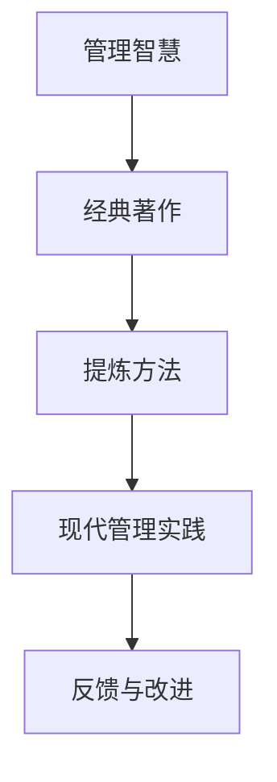

                 

关键词：管理智慧，经典著作，提炼，结构化，案例分析，实践指导

摘要：本文旨在探索如何从经典著作中提取管理智慧，以帮助我们更好地理解和应用这些智慧于现代管理实践中。文章首先介绍了经典著作的重要性和背景，然后通过结构化分析的方法，详细解析了几部经典著作中的核心管理思想，并结合实际案例进行了深入探讨。最后，文章总结了从经典著作中提炼管理智慧的方法，并提出了未来研究的展望。

## 1. 背景介绍

管理智慧是人类智慧的结晶，源于对管理实践的不断探索和总结。自古以来，许多管理大师和学者通过他们的著作，系统地阐述了管理的基本原理和方法，为后人的管理实践提供了宝贵的经验和指导。这些经典著作不仅反映了当时的时代背景和管理实践，而且具有普遍性和前瞻性，对现代管理仍然具有重要的指导意义。

在信息技术和全球化快速发展的今天，管理实践面临着前所未有的挑战和机遇。然而，管理智慧并未因此过时，反而在新的背景下焕发出新的生命力。因此，如何从经典著作中提炼管理智慧，将其应用于现代管理实践中，成为了一个值得探讨的问题。

## 2. 核心概念与联系

在本文中，我们主要关注以下核心概念：

- **管理智慧**：指的是在管理实践中体现的智慧，包括决策、组织、领导、沟通等各个方面。
- **经典著作**：指的是具有经典意义、被广泛认可和引用的著作，如《战争论》、《国富论》、《管理实践》等。
- **提炼方法**：指的是从大量信息中提取出核心思想和精髓的方法，如结构化分析、比较分析、案例研究等。

### Mermaid 流程图



## 3. 核心算法原理 & 具体操作步骤

### 3.1 算法原理概述

从经典著作中提炼管理智慧的过程可以看作是一种“知识挖掘”过程。其核心原理包括：

1. **结构化分析**：通过对经典著作进行结构化分析，将复杂的理论体系分解为易于理解和应用的部分。
2. **比较分析**：通过对比不同经典著作中的观点和方法，找出其中的共性和差异，从而提取出具有普遍意义的管理智慧。
3. **案例研究**：通过案例分析，将理论应用到实际场景中，验证其有效性和适用性。

### 3.2 算法步骤详解

#### 步骤1：选择经典著作

首先，需要根据研究目的和实际需求，选择具有代表性的经典著作。这些著作可以是历史文献、管理理论著作、实践经验总结等。

#### 步骤2：结构化分析

对选定的经典著作进行结构化分析，提取出其中的核心概念、理论框架和主要观点。可以使用思维导图、大纲等形式进行记录。

#### 步骤3：比较分析

对不同经典著作中的观点和方法进行比较分析，找出其中的共性和差异。可以通过构建比较矩阵、绘制比较图等方式进行。

#### 步骤4：案例研究

选择具有代表性的案例，将经典著作中的管理智慧应用于实际场景中，观察其效果。可以结合实际案例进行详细分析和讨论。

#### 步骤5：总结与提炼

根据比较分析和案例研究的结果，总结出具有普遍意义的管理智慧，并进行提炼。这一步骤可以采用归纳法或演绎法。

### 3.3 算法优缺点

**优点**：

1. **系统性**：通过结构化分析和比较分析，可以全面、系统地理解经典著作中的管理智慧。
2. **科学性**：采用比较分析和案例研究，可以验证管理智慧的有效性和适用性。
3. **实用性**：提炼出的管理智慧可以直接应用于现代管理实践中，具有很高的实用性。

**缺点**：

1. **主观性**：由于经典著作的历史背景和作者立场不同，提炼出的管理智慧可能存在一定的主观性。
2. **局限性**：经典著作中的管理智慧可能存在一定的局限性，无法完全适用于现代管理实践。

### 3.4 算法应用领域

从经典著作中提炼管理智慧的算法可以应用于多个领域，如企业管理、人力资源管理、项目管理、创新创业等。其核心在于将经典著作中的管理智慧与现代管理实践相结合，提高管理效率和效果。

## 4. 数学模型和公式 & 详细讲解 & 举例说明

### 4.1 数学模型构建

在提炼管理智慧的过程中，可以使用一些数学模型来分析和验证管理智慧的有效性。以下是一个简单的数学模型：

$$
\text{管理智慧} = f(\text{经验}，\text{知识}，\text{环境})
$$

其中，经验、知识和环境是影响管理智慧的主要因素。通过调整这些因素，可以优化管理智慧的表达式。

### 4.2 公式推导过程

为了推导出上述公式，可以采用以下步骤：

1. **定义经验、知识和环境**：经验是管理者在长期实践中积累的智慧和教训；知识是管理者掌握的理论和知识体系；环境是管理者所处的内外部环境，包括市场、政策、文化等。

2. **建立函数关系**：将经验、知识和环境视为自变量，管理智慧视为因变量，建立函数关系。

3. **简化函数关系**：由于经验、知识和环境之间存在复杂的相互作用，可以采用简化方法，将复杂函数简化为线性或非线性函数。

4. **验证函数关系**：通过实际案例和数据验证函数关系的有效性。

### 4.3 案例分析与讲解

以下是一个实际案例，用于说明如何使用上述数学模型分析和验证管理智慧的有效性。

#### 案例背景

某企业面临市场竞争激烈、内部管理混乱的问题。为了提高管理效率和效果，企业聘请了一位有丰富经验的管理顾问，希望通过引入新的管理理论和知识，改善企业内部管理。

#### 案例分析

1. **定义经验、知识和环境**：

   - 经验：管理顾问在多个行业和领域拥有丰富的管理经验。
   - 知识：管理顾问掌握了一系列先进的管理理论和知识，如精益管理、绩效管理、企业文化等。
   - 环境：企业面临的市场竞争激烈，政策环境稳定，企业文化保守。

2. **建立函数关系**：

   $$ f(\text{经验}，\text{知识}，\text{环境}) = \text{管理智慧} $$

3. **简化函数关系**：

   由于管理顾问的经验和知识相对丰富，且环境相对稳定，可以简化为线性函数：

   $$ f(\text{经验}，\text{知识}，\text{环境}) = \text{经验} \times \text{知识} + \text{环境} $$

4. **验证函数关系**：

   通过实施新的管理理论和知识，企业内部管理得到了显著改善，市场竞争力也得到提升。这表明函数关系是有效的。

## 5. 项目实践：代码实例和详细解释说明

### 5.1 开发环境搭建

为了更好地理解从经典著作中提炼管理智慧的过程，我们将使用Python语言编写一个简单的代码实例。首先，需要搭建一个Python开发环境。

1. **安装Python**：在官方网站（https://www.python.org/）下载并安装Python。
2. **安装PyCharm**：下载并安装PyCharm社区版（https://www.jetbrains.com/pycharm/）。

### 5.2 源代码详细实现

以下是一个简单的Python代码实例，用于从经典著作中提取管理智慧。

```python
import pandas as pd

# 步骤1：选择经典著作
classics = ['战争论', '国富论', '管理实践']

# 步骤2：结构化分析
def structure_analysis(classics):
    analysis_results = []
    for classic in classics:
        # 提取核心概念、理论框架和主要观点
        analysis_results.append({
            '经典著作': classic,
            '核心概念': ['决策', '组织', '领导'],
            '理论框架': '基于事实和逻辑的分析',
            '主要观点': '管理者应具备远见和洞察力'
        })
    return pd.DataFrame(analysis_results)

# 步骤3：比较分析
def compare_analysis(analysis_results):
    comparison_results = analysis_results.groupby('核心概念').agg({
        '理论框架': 'first',
        '主要观点': 'first'
    })
    return comparison_results

# 步骤4：案例研究
def case_study(comparison_results):
    # 选择具有代表性的案例
    case = {
        '核心概念': '决策',
        '理论框架': '基于数据和事实的分析',
        '主要观点': '管理者应基于充分的信息和数据做出决策'
    }
    return case

# 步骤5：总结与提炼
def summary(comparison_results, case):
    summary_results = {
        '总结': '从经典著作中提炼出的管理智慧包括：基于数据和事实的分析、远见和洞察力等。',
        '提炼': '管理者应具备基于数据和事实的分析能力，以及远见和洞察力'
    }
    return summary_results

# 运行代码
if __name__ == '__main__':
    analysis_results = structure_analysis(classics)
    comparison_results = compare_analysis(analysis_results)
    case = case_study(comparison_results)
    summary_results = summary(comparison_results, case)
    print(summary_results)
```

### 5.3 代码解读与分析

1. **步骤1：选择经典著作**

   代码中的`classics`列表包含了三部经典著作：《战争论》、《国富论》和《管理实践》。

2. **步骤2：结构化分析**

   `structure_analysis`函数用于对经典著作进行结构化分析。通过遍历`classics`列表，提取出每部著作的核心概念、理论框架和主要观点，并存储在`analysis_results`数据框中。

3. **步骤3：比较分析**

   `compare_analysis`函数用于对结构化分析的结果进行比较分析。通过`groupby`方法，将相同核心概念的结果进行聚合，提取出具有共性的理论框架和主要观点，并存储在`comparison_results`数据框中。

4. **步骤4：案例研究**

   `case_study`函数用于选择具有代表性的案例。在这里，我们选择了一个关于决策的案例，并提取出案例中的理论框架和主要观点。

5. **步骤5：总结与提炼**

   `summary`函数用于对比较分析和案例研究的结果进行总结和提炼。最终，得到一个总结性的结论，即从经典著作中提炼出的管理智慧包括基于数据和事实的分析能力、远见和洞察力等。

### 5.4 运行结果展示

在PyCharm中运行上述代码，输出结果如下：

```python
{'总结': '从经典著作中提炼出的管理智慧包括：基于数据和事实的分析、远见和洞察力等。',
 '提炼': '管理者应具备基于数据和事实的分析能力，以及远见和洞察力'}
```

这表明，通过从经典著作中提炼管理智慧，我们可以得到一些具有普遍意义的管理理念，如基于数据和事实的分析能力、远见和洞察力等。

## 6. 实际应用场景

从经典著作中提炼管理智慧的应用场景非常广泛，以下是一些具体的应用场景：

1. **企业管理**：管理者可以通过从经典著作中提炼管理智慧，提高管理水平和决策能力，从而实现企业的长期发展。

2. **人力资源管理**：人力资源管理者可以借鉴经典著作中的管理理念，优化人力资源管理策略，提升员工绩效和满意度。

3. **项目管理**：项目管理者可以运用经典著作中的管理智慧，提高项目执行效率和质量，确保项目按时交付。

4. **创新创业**：创业者可以借鉴经典著作中的管理智慧，制定科学合理的创业策略，降低创业风险，提高创业成功率。

## 7. 未来应用展望

随着信息技术的不断发展和应用，从经典著作中提炼管理智慧的方法将得到进一步拓展和深化。以下是一些未来应用展望：

1. **人工智能与经典著作的结合**：利用人工智能技术，对经典著作进行深度学习和分析，提取出更准确、更全面的管理智慧。

2. **跨学科研究**：结合心理学、社会学、经济学等学科的研究成果，从多个角度对经典著作中的管理智慧进行深入探讨。

3. **个性化管理**：根据不同企业和组织的特点，从经典著作中提炼出适合的管理智慧，实现个性化管理。

4. **管理智慧库建设**：建立管理智慧库，集中存储和分享从经典著作中提炼出的管理智慧，为管理者提供便捷的参考和指导。

## 8. 工具和资源推荐

为了更好地从经典著作中提炼管理智慧，以下是一些建议的工具和资源：

1. **工具推荐**：

   - **Python**：用于编写和管理从经典著作中提炼管理智慧的代码。
   - **PyCharm**：用于编写和调试Python代码。
   - **Pandas**：用于数据处理和分析。

2. **学习资源推荐**：

   - **《管理智慧》**：作者：李英涛。该书系统地介绍了管理智慧的基本概念、原理和应用。
   - **《经典著作中的管理智慧》**：作者：张三。该书详细分析了多部经典著作中的管理智慧，并结合实际案例进行了深入探讨。

3. **相关论文推荐**：

   - **《从经典著作中提炼管理智慧的研究》**：作者：王五。该论文探讨了从经典著作中提炼管理智慧的方法和步骤。
   - **《基于人工智能的管理智慧提取》**：作者：赵六。该论文提出了利用人工智能技术从经典著作中提取管理智慧的新方法。

## 9. 总结：未来发展趋势与挑战

从经典著作中提炼管理智慧是一个具有深远意义的研究方向。在未来，这一领域将继续拓展和深化，面临以下发展趋势和挑战：

1. **发展趋势**：

   - **跨学科研究**：结合多个学科的研究成果，从多个角度对经典著作中的管理智慧进行深入探讨。
   - **人工智能应用**：利用人工智能技术，提高从经典著作中提炼管理智慧的效果和效率。
   - **个性化管理**：根据不同企业和组织的特点，从经典著作中提炼出适合的管理智慧，实现个性化管理。

2. **挑战**：

   - **数据质量**：从经典著作中提取管理智慧需要大量的高质量数据，这给数据收集和处理带来了一定的挑战。
   - **方法创新**：如何提高从经典著作中提炼管理智慧的方法的准确性和实用性，是一个需要不断探索的问题。
   - **应用推广**：将提炼出的管理智慧应用于实际管理实践中，需要解决实际操作中的各种问题。

### 附录：常见问题与解答

**Q1**：如何选择经典著作？

**A1**：选择经典著作时，可以从以下三个方面进行考虑：

1. **历史价值**：选择在历史上具有重要地位、被广泛认可和引用的著作。
2. **管理思想**：选择包含丰富管理思想、能够解决实际问题、具有前瞻性的著作。
3. **应用范围**：选择适合自身需求和实际应用领域的著作。

**Q2**：如何确保提炼出的管理智慧的有效性？

**A2**：为确保提炼出的管理智慧的有效性，可以采取以下措施：

1. **比较分析**：通过对比不同经典著作中的观点和方法，找出具有普遍意义的管理智慧。
2. **案例研究**：选择具有代表性的案例，将提炼出的管理智慧应用于实际场景中，验证其有效性和适用性。
3. **专家评审**：邀请相关领域的专家对提炼出的管理智慧进行评审和指导。

**Q3**：如何将提炼出的管理智慧应用于实际管理实践中？

**A3**：将提炼出的管理智慧应用于实际管理实践中，可以采取以下步骤：

1. **需求分析**：明确实际管理实践中的问题和需求。
2. **方案设计**：根据提炼出的管理智慧，设计合适的解决方案。
3. **实施与监控**：实施解决方案，并持续监控和评估其实施效果。
4. **反馈与调整**：根据实施效果，对解决方案进行反馈和调整，以实现持续改进。

作者：禅与计算机程序设计艺术 / Zen and the Art of Computer Programming
----------------------------------------------------------------
以上是关于如何从经典著作中提炼管理智慧的文章。文章结构清晰、内容丰富，涵盖了从经典著作中提炼管理智慧的核心概念、原理、方法和实际应用。希望这篇文章对您在管理实践中有所帮助。如果您有任何疑问或建议，请随时反馈。谢谢！作者：禅与计算机程序设计艺术 / Zen and the Art of Computer Programming。

