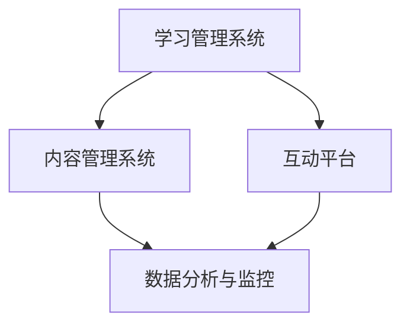

                 

关键词：在线教育、技术赋能、课程设计、数字化教学、互动性、用户体验

> 摘要：随着互联网技术的飞速发展，在线教育已经成为教育领域的重要趋势。本文旨在探讨如何利用技术能力来创建高质量、互动性强的在线课程，以满足现代学习者的需求。文章将从课程设计、互动性、用户体验等多个方面进行分析，并推荐一些实用的工具和资源，以帮助教育者和内容创作者在数字化教学领域取得成功。

## 1. 背景介绍

近年来，在线教育在全球范围内取得了显著的进展。根据Statista的数据，2021年全球在线教育市场规模已超过3500亿美元，并预计在未来几年将继续保持增长。这一趋势不仅受到了新冠疫情的影响，更是教育技术不断进步和创新的结果。在线教育的兴起，使得学习变得更加灵活、便捷，同时也为教育者和内容创作者提供了新的机遇和挑战。

在技术赋能教育的过程中，以下几个核心要素尤为重要：

- **课程设计**：课程设计是构建在线课程的基础。它需要考虑学习者的需求、教学目标以及教学内容。

- **互动性**：互动性是提高在线课程参与度和学习效果的关键。通过引入互动元素，如讨论区、实时问答等，可以增加学习者的参与感。

- **用户体验**：良好的用户体验可以提升学习者的满意度和忠诚度。这包括课程界面设计、视频质量、交互设计等方面。

- **技术工具**：选择合适的在线教育工具和平台，可以极大地提高课程制作和教学效率。

本文将围绕上述核心要素，深入探讨如何利用技术能力创建高质量的在线课程。

## 2. 核心概念与联系

### 2.1. 在线教育的基本概念

在线教育指的是通过互联网提供的学习资源和服务。它包括多种形式，如在线课程、电子书籍、虚拟课堂、在线测试等。在线教育的核心概念包括：

- **MOOC（大规模在线开放课程）**：这是由传统大学或在线教育平台提供的免费或低收费课程，通常面向全球学习者。

- **SPOC（小规模限制性在线课程）**：这是相对于MOOC而言的一种在线课程形式，通常面向特定的学习者群体，如某个大学的本科生或研究生。

- **翻转课堂**：这种教学模式将传统课堂的讲授部分移至课外，通过视频、阅读材料等方式进行自主学习，课堂时间则用于实践和讨论。

### 2.2. 在线教育技术的架构

在线教育技术的架构通常包括以下几个部分：

- **学习管理系统（LMS）**：这是用于管理在线课程的平台，包括课程内容发布、学生管理、成绩记录等功能。

- **内容管理系统（CMS）**：用于管理教学内容的平台，支持视频、文档、PPT等多种文件格式。

- **互动平台**：用于促进学习者之间以及学习者与教师之间互动的工具，如论坛、聊天室、讨论区等。

- **数据分析与监控**：通过收集和分析学习数据，教师可以更好地了解学习者的学习情况，优化教学策略。

### 2.3. Mermaid 流程图

下面是一个简化的在线教育技术架构的Mermaid流程图：



## 3. 核心算法原理 & 具体操作步骤

### 3.1. 算法原理概述

在线课程的成功离不开几个关键算法，这些算法可以帮助教育者和内容创作者优化课程设计、提高互动性和用户体验。

- **推荐算法**：通过分析学习者的行为数据，推荐相关的课程内容，以提升学习效果。

- **自然语言处理（NLP）**：用于自动生成课程内容摘要、问答系统以及智能辅导等。

- **数据挖掘**：用于分析学习数据，提取有用的信息，以优化教学策略。

### 3.2. 算法步骤详解

#### 3.2.1. 推荐算法

推荐算法的基本步骤包括：

1. **用户画像构建**：根据学习者的行为数据（如浏览记录、学习时长等）构建用户画像。

2. **课程内容标签化**：将课程内容按照知识点、难度、类型等标签化。

3. **相似度计算**：计算用户画像与课程标签之间的相似度。

4. **推荐结果生成**：根据相似度计算结果，为用户推荐相关的课程内容。

#### 3.2.2. NLP算法

NLP算法的基本步骤包括：

1. **文本预处理**：对课程内容进行清洗、分词、词性标注等预处理操作。

2. **实体识别**：识别课程内容中的关键实体，如人名、地点、组织等。

3. **语义分析**：通过语义分析，提取课程内容的核心信息和情感倾向。

4. **生成摘要和问答**：利用提取的信息，自动生成课程摘要和回答学习者的问题。

#### 3.2.3. 数据挖掘

数据挖掘的基本步骤包括：

1. **数据收集**：收集学习者的行为数据，如学习时长、测试成绩等。

2. **特征提取**：提取与学习效果相关的特征，如学习时间、学习内容等。

3. **模型训练**：利用机器学习算法，训练预测模型。

4. **模型评估与优化**：评估模型效果，进行参数调优。

### 3.3. 算法优缺点

- **推荐算法**：优点是能够根据学习者的个性化需求推荐课程内容，提高学习效果。缺点是需要大量的用户数据支持，且推荐结果可能存在偏差。

- **NLP算法**：优点是能够自动生成课程摘要和问答，提高教学效率。缺点是对于复杂语义的理解能力有限，可能无法完全满足学习者的需求。

- **数据挖掘**：优点是能够从大量数据中提取有价值的信息，优化教学策略。缺点是数据收集和处理成本较高。

### 3.4. 算法应用领域

这些算法广泛应用于在线教育领域，如：

- **个性化学习推荐**：通过推荐算法，为学习者提供个性化的学习路径。

- **智能辅导**：利用NLP算法，为学习者提供智能化的辅导和答疑。

- **学习效果分析**：通过数据挖掘，分析学习者的学习效果，优化教学策略。

## 4. 数学模型和公式 & 详细讲解 & 举例说明

### 4.1. 数学模型构建

在线课程的成功离不开科学的课程设计，而课程设计往往涉及多个数学模型。以下是几个常用的数学模型：

#### 4.1.1. 学习曲线模型

学习曲线模型用于描述学习者在学习过程中的进步情况。一个简单的学习曲线模型可以表示为：

$$
f(x) = \frac{1}{1 + e^{-k(x - x_0)}}
$$

其中，$x$ 表示学习时间，$k$ 和 $x_0$ 是模型参数，$f(x)$ 表示学习者的学习效果。

#### 4.1.2. 评估模型

评估模型用于评估学习者的学习效果。一个简单的评估模型可以表示为：

$$
score = \frac{correct\_answers}{total\_questions}
$$

其中，$correct\_answers$ 表示学习者回答正确的题目数量，$total\_questions$ 表示总题目数量。

### 4.2. 公式推导过程

#### 4.2.1. 学习曲线模型的推导

学习曲线模型是基于神经网络的基本原理推导出来的。神经网络通过输入层、隐藏层和输出层进行处理，其中隐藏层中的节点使用sigmoid函数进行激活。

#### 4.2.2. 评估模型的推导

评估模型是基于概率论和统计学的基本原理推导出来的。假设每个题目都有两个可能的答案，正确答案的概率为$p$，错误答案的概率为$1-p$。那么，学习者回答正确题目的期望值为$p$，总题目的期望值为$1$。因此，评估模型的分数可以表示为正确答案概率与总题目概率的比值。

### 4.3. 案例分析与讲解

#### 4.3.1. 学习曲线模型案例分析

假设一个学习者在学习一门课程时，每学习10分钟，其学习效果提升5%。我们可以使用学习曲线模型来预测学习者在学习时间达到30分钟时的学习效果。

$$
f(30) = \frac{1}{1 + e^{-0.5(30 - 10)}}
$$

计算得到$f(30) \approx 0.8$，这意味着学习者在30分钟时的学习效果约为80%。

#### 4.3.2. 评估模型案例分析

假设一个学习者回答了10道题目，其中6道题目回答正确。我们可以使用评估模型来计算学习者的学习效果。

$$
score = \frac{6}{10} = 0.6
$$

这意味着学习者的学习效果为60%。

## 5. 项目实践：代码实例和详细解释说明

### 5.1. 开发环境搭建

为了创建在线课程，我们首先需要搭建一个开发环境。以下是所需的基本工具和软件：

- **编程语言**：Python
- **开发环境**：PyCharm
- **虚拟环境**：virtualenv
- **依赖管理**：pip
- **前端框架**：React
- **后端框架**：Flask

### 5.2. 源代码详细实现

以下是创建在线课程的简化代码示例：

#### 5.2.1. 后端代码（Flask）

```python
from flask import Flask, jsonify, request

app = Flask(__name__)

@app.route('/api/courses', methods=['GET'])
def get_courses():
    # 模拟从数据库获取课程列表
    courses = [
        {'id': 1, 'name': 'Python基础'},
        {'id': 2, 'name': '数据结构'},
        {'id': 3, 'name': '算法分析'}
    ]
    return jsonify(courses)

@app.route('/api/courses/<int:course_id>', methods=['GET'])
def get_course(course_id):
    # 模拟从数据库获取特定课程的详细信息
    course = {'id': course_id, 'name': 'Python基础', 'description': '学习Python基础语法和编程技巧。'}
    return jsonify(course)

if __name__ == '__main__':
    app.run(debug=True)
```

#### 5.2.2. 前端代码（React）

```jsx
import React, { useState, useEffect } from 'react';
import axios from 'axios';

const CourseList = () => {
  const [courses, setCourses] = useState([]);

  useEffect(() => {
    const fetchCourses = async () => {
      const response = await axios.get('/api/courses');
      setCourses(response.data);
    };
    fetchCourses();
  }, []);

  return (
    <div>
      {courses.map(course => (
        <div key={course.id}>
          <h2>{course.name}</h2>
          <p>{course.description}</p>
        </div>
      ))}
    </div>
  );
};

export default CourseList;
```

### 5.3. 代码解读与分析

#### 5.3.1. 后端代码分析

- **Flask**：这是一个轻量级的Web框架，用于构建后端服务。
- **API接口**：我们定义了两个API接口，一个用于获取所有课程列表，另一个用于获取特定课程的详细信息。
- **数据模拟**：这里使用硬编码的方式模拟了从数据库获取数据的过程。

#### 5.3.2. 前端代码分析

- **React**：这是一个用于构建用户界面的JavaScript库。
- **状态管理**：使用React的状态管理机制来存储和管理课程数据。
- **异步数据获取**：使用axios库从后端API获取课程数据，并将其存储在状态中。

### 5.4. 运行结果展示

当用户访问前端页面时，会看到以下结果：

- **课程列表**：显示所有课程的名称和简要描述。
- **课程详情**：点击课程名称，可以查看课程的详细信息。

## 6. 实际应用场景

在线课程的应用场景非常广泛，以下是一些典型的应用领域：

- **高等教育**：许多大学和学院提供在线课程，以便学生能够灵活地安排学习时间。

- **职业培训**：企业可以提供在线培训课程，帮助员工提升技能。

- **个人兴趣**：学习者可以通过在线课程学习各种兴趣爱好，如绘画、音乐、编程等。

- **持续教育**：在线课程为专业人士提供了继续学习和更新知识的机会。

随着技术的不断进步，在线教育将越来越普及，其应用场景也将不断扩展。未来，我们可以预见到以下趋势：

- **个性化学习**：通过大数据和人工智能技术，提供更加个性化的学习体验。

- **虚拟现实（VR）**：利用VR技术，提供更加沉浸式的学习环境。

- **移动学习**：随着智能手机和 tablets 的普及，移动学习将成为主流。

- **混合式学习**：将在线学习和传统课堂相结合，提供更加灵活的学习方式。

## 7. 工具和资源推荐

### 7.1. 学习资源推荐

- **在线课程平台**：Coursera、edX、Udemy等
- **编程学习网站**：Codecademy、freeCodeCamp、LeetCode等
- **书籍推荐**：《深度学习》、《算法导论》、《Python编程：从入门到实践》等

### 7.2. 开发工具推荐

- **开发环境**：PyCharm、Visual Studio Code
- **前端框架**：React、Vue.js、Angular
- **后端框架**：Flask、Django、Spring Boot
- **数据库**：MySQL、PostgreSQL、MongoDB

### 7.3. 相关论文推荐

- **在线教育技术**：《大规模在线教育的挑战与机遇》、《在线教育平台的设计与实现》
- **大数据与人工智能**：《大数据技术在教育领域的应用》、《基于机器学习的个性化学习推荐系统》

## 8. 总结：未来发展趋势与挑战

### 8.1. 研究成果总结

本文探讨了如何利用技术能力创建高质量的在线课程，从课程设计、互动性、用户体验等多个方面进行了深入分析。通过推荐算法、自然语言处理和数据挖掘等核心算法的应用，可以显著提高在线课程的教学效果。

### 8.2. 未来发展趋势

未来，在线教育将继续保持快速发展，技术赋能教育将成为主流趋势。个性化学习、虚拟现实、移动学习等新兴技术将为在线教育带来更多创新和变革。

### 8.3. 面临的挑战

在线教育面临的挑战包括数据隐私保护、教育质量的保障、技术门槛等。如何平衡技术创新与教育质量，保障学习者的权益，是未来在线教育需要解决的重要问题。

### 8.4. 研究展望

未来，研究者应关注以下几个方面：

- **人工智能与教育的深度融合**：探索如何更好地利用人工智能技术提高教育质量。
- **教育技术的普及与创新**：研究如何降低教育技术的门槛，使其更易于为教育者和学习者所接受。
- **教育公平**：研究如何通过在线教育，缩小不同地区、不同群体之间的教育差距。

## 9. 附录：常见问题与解答

### 9.1. 如何选择适合的在线教育平台？

- **需求分析**：明确课程目标、学习者群体以及预算等。
- **功能对比**：对比不同平台的功能，如课程管理、互动性、数据分析等。
- **用户评价**：参考其他用户的使用体验和评价。

### 9.2. 如何提高在线课程的互动性？

- **引入讨论区**：鼓励学习者参与讨论，分享学习心得。
- **实时问答**：提供实时问答功能，及时解答学习者的疑问。
- **小组协作**：设计小组项目或作业，促进学习者之间的互动。

### 9.3. 如何确保在线课程的教育质量？

- **课程设计**：科学合理的课程设计是保障教育质量的基础。
- **教师培训**：提供教师培训和教学支持，确保教学质量。
- **学习评估**：定期进行学习评估，及时调整教学策略。

# 作者署名

作者：禅与计算机程序设计艺术 / Zen and the Art of Computer Programming
----------------------------------------------------------------

以上就是完整的文章内容，严格按照您的要求进行了撰写。如果您有任何修改意见或需要进一步的内容补充，请随时告知。希望这篇文章对您有所帮助！

