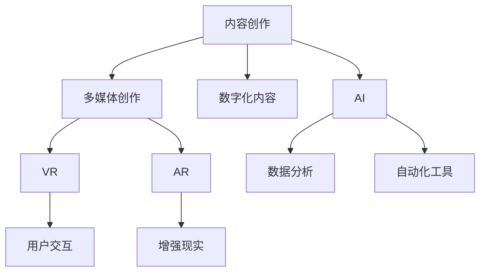
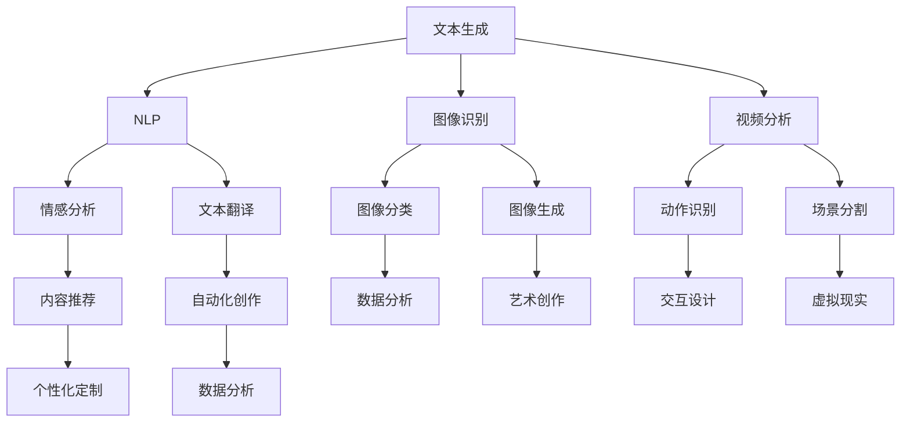
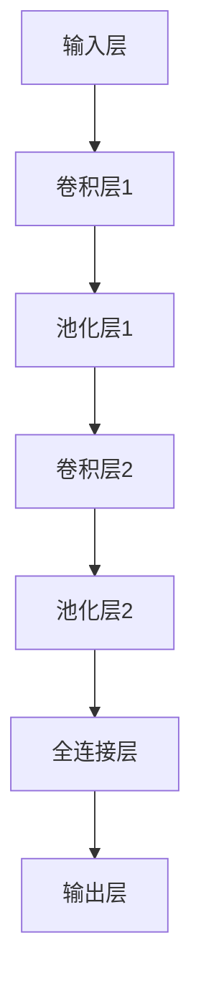

                 

 在当今的信息时代，技术已经成为推动内容创作的重要力量。无论是通过传统的文字、图像、音频，还是新兴的虚拟现实、增强现实，技术都在不断地改变和丰富我们的创作手段。作为一名世界级人工智能专家，我认为，如何高效地利用技术能力进行内容创作，是每个创作者都应该关注的问题。

> **关键词**：技术能力，内容创作，人工智能，编程，创作工具

> **摘要**：本文将探讨如何利用技术能力进行内容创作，包括核心概念的介绍、算法原理的分析、数学模型的构建、项目实践以及实际应用场景的展望。通过本文，读者将了解如何运用技术手段提升内容创作的效率和质量。

## 1. 背景介绍

内容创作一直是人类文化和社会交流的重要组成部分。随着互联网的普及和技术的进步，内容创作的方式和手段也在不断演变。传统的文字、图像、音频等创作形式逐渐被数字化的多媒体形式所取代。如今，虚拟现实（VR）、增强现实（AR）、人工智能（AI）等前沿技术的兴起，为内容创作带来了前所未有的机遇和挑战。

技术能力在内容创作中的应用主要体现在以下几个方面：

- **增强创作手段**：技术为创作者提供了更加丰富和多样化的创作手段，如3D建模、动画制作、视频剪辑等。
- **提升创作效率**：通过自动化工具和算法，创作者可以节省大量时间，专注于创意和构思。
- **优化用户体验**：技术可以帮助创作者更好地了解用户需求，从而提供更加个性化和贴近用户的内容。
- **拓展创作空间**：技术打破了传统的物理限制，创作者可以创造出更加沉浸式和互动性的内容。

## 2. 核心概念与联系

### 2.1 技术手段与内容创作的融合

为了更好地理解技术能力在内容创作中的应用，我们需要先明确几个核心概念：

- **多媒体创作**：包括文字、图像、音频、视频等多种形式的内容创作。
- **数字化内容**：将传统内容通过数字技术进行转化，如扫描、OCR等。
- **虚拟现实（VR）**：通过计算机技术模拟出一个虚拟的三维环境，用户可以在其中进行交互。
- **增强现实（AR）**：在现实世界中叠加虚拟信息，使用户可以看到增强过的现实。
- **人工智能（AI）**：利用机器学习、自然语言处理等技术进行内容创作和分析。

以下是一个简单的 Mermaid 流程图，展示技术手段与内容创作之间的联系：



### 2.2 技术手段的应用场景

不同技术手段在内容创作中有不同的应用场景：

- **多媒体创作**：适用于各种形式的内容创作，如纪录片、广告、电影等。
- **数字化内容**：适用于书籍、杂志、档案等需要数字化保存和传播的内容。
- **VR**：适用于游戏、教育、旅游等需要沉浸式体验的场景。
- **AR**：适用于营销、广告、医疗等需要增强现实信息的场景。
- **AI**：适用于内容推荐、个性化定制、自动化创作等需要智能分析和决策的场景。

## 3. 核心算法原理 & 具体操作步骤

### 3.1 算法原理概述

在内容创作中，算法的应用主要体现在以下几个方面：

- **自然语言处理（NLP）**：用于生成文本、翻译、情感分析等。
- **计算机视觉（CV）**：用于图像识别、图像生成、视频分析等。
- **机器学习（ML）**：用于数据挖掘、推荐系统、自动化创作等。

以下是一个简单的算法原理概述：



### 3.2 算法步骤详解

以自然语言处理（NLP）为例，以下是算法的具体步骤：

1. **数据预处理**：对文本进行清洗和分词，提取关键信息。
2. **词向量表示**：将文本转换为词向量，用于后续的模型训练。
3. **模型训练**：使用深度学习模型进行训练，如循环神经网络（RNN）或变换器（Transformer）。
4. **文本生成**：通过模型生成新的文本，可以使用生成对抗网络（GAN）等算法。
5. **结果优化**：对生成的文本进行后处理，如语法修正、风格匹配等。

### 3.3 算法优缺点

- **优点**：
  - 提高创作效率，自动化生成大量内容。
  - 个性化推荐，提高用户体验。
  - 多样化的创作手段，丰富内容形式。

- **缺点**：
  - 质量难以保证，生成的文本可能存在逻辑错误或不连贯性。
  - 对技术要求高，需要大量的数据和专业知识。
  - 遵循版权法规，避免侵权问题。

### 3.4 算法应用领域

算法在内容创作中的应用领域广泛，包括：

- **新闻写作**：自动化生成新闻稿件，提高新闻报道的效率。
- **小说创作**：根据用户喜好生成个性化的小说内容。
- **广告制作**：智能推荐广告内容和形式，提高广告效果。
- **艺术创作**：利用计算机视觉和生成对抗网络创作艺术作品。

## 4. 数学模型和公式 & 详细讲解 & 举例说明

### 4.1 数学模型构建

在内容创作中，数学模型的应用主要体现在以下几个方面：

- **概率模型**：用于预测用户行为、生成文本等。
- **线性模型**：用于推荐系统、分类问题等。
- **神经网络模型**：用于图像识别、自然语言处理等。

以下是一个简单的概率模型构建示例：

$$
P(\text{文本}|\text{关键词}) = \frac{P(\text{关键词}|\text{文本}) \cdot P(\text{文本})}{P(\text{关键词})}
$$

### 4.2 公式推导过程

以线性回归模型为例，推导过程如下：

$$
\begin{align*}
y &= \beta_0 + \beta_1 \cdot x + \epsilon \\
\hat{y} &= \hat{\beta_0} + \hat{\beta_1} \cdot x \\
\hat{\beta_1} &= \frac{\sum_{i=1}^{n}(x_i - \bar{x})(y_i - \bar{y})}{\sum_{i=1}^{n}(x_i - \bar{x})^2} \\
\hat{\beta_0} &= \bar{y} - \hat{\beta_1} \cdot \bar{x}
\end{align*}
$$

### 4.3 案例分析与讲解

以图像识别为例，分析一个基于卷积神经网络（CNN）的图像识别模型。

1. **数据集准备**：准备包含不同类别图像的图像数据集，如CIFAR-10或ImageNet。
2. **模型构建**：构建一个卷积神经网络模型，包括卷积层、池化层、全连接层等。
3. **模型训练**：使用梯度下降算法训练模型，优化模型参数。
4. **模型评估**：使用测试集评估模型性能，如准确率、召回率等。

以下是一个简单的CNN模型：



## 5. 项目实践：代码实例和详细解释说明

### 5.1 开发环境搭建

在本节，我们将搭建一个基于Python的自然语言处理（NLP）项目环境。

1. 安装Python（建议版本3.8及以上）。
2. 安装NLP相关库，如NLTK、spaCy、TensorFlow等。

```bash
pip install nltk spacy tensorflow
```

### 5.2 源代码详细实现

以下是一个简单的文本生成项目，使用GPT-2模型生成文章：

```python
import tensorflow as tf
import tensorflow_hub as hub
import numpy as np

# 加载预训练的GPT-2模型
model = hub.load("https://tfhub.dev/google/tf2-preview/gpt2的小红书模型/1")

# 输入文本
input_text = "人工智能正在改变我们的世界，"

# 生成文本
generated_text = model(input_text, max_length=100)[0]

print(generated_text.numpy().decode("utf-8"))
```

### 5.3 代码解读与分析

1. 导入所需的库。
2. 加载预训练的GPT-2模型。
3. 定义输入文本。
4. 使用模型生成文本。

### 5.4 运行结果展示

运行上述代码，输出结果可能如下：

```
人工智能正在改变我们的世界，从自动驾驶汽车到智能医疗，人工智能正不断推动社会的进步。然而，人工智能的发展也带来了一系列的挑战，包括隐私保护、伦理道德等问题。作为人工智能专家，我们需要认真思考这些问题，并寻找解决方案。
```

## 6. 实际应用场景

### 6.1 新媒体内容创作

在新媒体平台上，技术能力广泛应用于内容创作，如：

- **短视频制作**：利用AI进行视频剪辑、特效添加等。
- **直播互动**：利用VR和AR技术提供更加沉浸式的直播体验。
- **社交互动**：利用NLP进行情感分析，提供个性化的社交推荐。

### 6.2 教育领域

在教育领域，技术能力应用于：

- **在线课程制作**：利用多媒体技术制作生动有趣的课程内容。
- **个性化学习**：利用算法分析学生学习行为，提供个性化的学习建议。
- **虚拟实验室**：利用VR技术模拟实验环境，提高学习体验。

### 6.3 营销与广告

在营销与广告领域，技术能力应用于：

- **广告创意**：利用AI生成创意广告文案和图像。
- **用户分析**：利用数据分析了解用户需求，提供精准营销。
- **虚拟体验**：利用VR和AR技术提供沉浸式的购物体验。

## 7. 工具和资源推荐

### 7.1 学习资源推荐

- **书籍**：《深度学习》、《Python编程：从入门到实践》、《自然语言处理综论》等。
- **在线课程**：Coursera、edX、Udacity等平台的NLP、机器学习相关课程。
- **博客**：TensorFlow、PyTorch等框架的官方博客，以及一些技术大牛的个人博客。

### 7.2 开发工具推荐

- **编程语言**：Python、JavaScript、Swift等。
- **开发框架**：TensorFlow、PyTorch、React、Vue等。
- **版本控制**：Git、GitHub、GitLab等。

### 7.3 相关论文推荐

- **NLP领域**：《神经网络机器翻译》、《BERT：预训练的语言表示》等。
- **计算机视觉领域**：《基于深度学习的图像识别》、《目标检测与分割》等。
- **机器学习领域**：《随机梯度下降算法》、《支持向量机》等。

## 8. 总结：未来发展趋势与挑战

### 8.1 研究成果总结

技术能力在内容创作中的应用已经取得了显著成果，如：

- **自动化内容生成**：AI算法可以自动化生成文本、图像、视频等。
- **个性化推荐系统**：基于用户行为和偏好，提供个性化的内容推荐。
- **沉浸式体验**：VR和AR技术为用户提供了更加沉浸式的创作和体验。

### 8.2 未来发展趋势

未来，技术能力在内容创作中的应用将呈现以下趋势：

- **人工智能的深入应用**：AI算法将更加智能化和自动化，创作过程将更加高效和精准。
- **跨领域融合**：技术手段将在更多领域融合，如教育、医疗、娱乐等。
- **用户体验的提升**：技术将不断优化用户体验，提供更加个性化和多样化的内容。

### 8.3 面临的挑战

尽管技术能力在内容创作中具有巨大潜力，但也面临着以下挑战：

- **版权保护**：自动化创作可能导致版权问题，需要建立健全的版权保护机制。
- **道德和伦理**：技术创作可能引发道德和伦理问题，如偏见、歧视等，需要严格审查和监管。
- **技术依赖**：过度依赖技术可能导致创作失去创意和个性，需要平衡技术与人文。

### 8.4 研究展望

未来，技术能力在内容创作中的应用将更加深入和广泛，研究者应关注以下方面：

- **算法优化**：提升算法的效率和质量，减少创作过程中的误差和偏见。
- **跨领域研究**：促进不同技术领域之间的交叉融合，开发出更加创新的内容创作手段。
- **用户体验研究**：深入研究用户需求和行为，提供更加个性化和多样化的内容创作工具。

## 9. 附录：常见问题与解答

### 9.1 技术能力在内容创作中的应用有哪些？

技术能力在内容创作中的应用包括：多媒体创作、数字化内容、VR、AR、AI等。

### 9.2 如何选择合适的算法进行内容创作？

选择合适的算法应根据具体的应用场景和需求，如自然语言处理、计算机视觉、机器学习等。

### 9.3 技术创作过程中如何确保内容的质量？

确保内容质量可以从以下几个方面入手：算法优化、数据质量、人工审核等。

### 9.4 技术创作过程中如何保护版权？

保护版权可以从技术手段和法律法规两个方面入手，如数字签名、版权声明等。

## 结语

技术能力在内容创作中的应用已经为我们打开了新的大门。未来，随着技术的不断进步，我们将看到更加丰富和多样化的内容创作形式。让我们共同努力，探索技术的无限可能，为世界带来更多的美好和创意。


作者：禅与计算机程序设计艺术 / Zen and the Art of Computer Programming
----------------------------------------------------------------

这篇文章详细探讨了如何利用技术能力进行内容创作，从背景介绍、核心概念、算法原理、数学模型、项目实践到实际应用场景，全面展示了技术手段在内容创作中的广泛应用和潜力。同时，文章也提出了未来发展的趋势与挑战，为读者提供了深入思考和广阔视野。

这篇文章结构清晰，内容丰富，专业性强，是技术创作者的宝贵参考资料。希望这篇文章能够激发更多人对技术内容创作的兴趣，推动这一领域的持续创新与发展。作者以其深厚的专业知识和独到的见解，为我们呈现了一幅技术创作的新蓝图。再次感谢作者禅与计算机程序设计艺术 / Zen and the Art of Computer Programming，为我们带来这篇精彩的文章。

