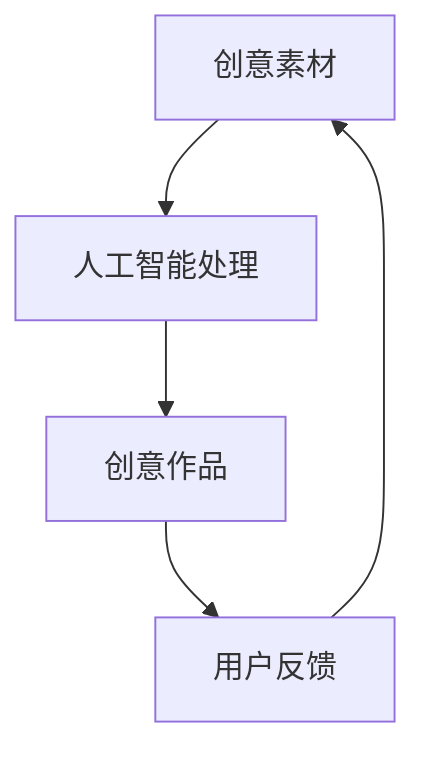
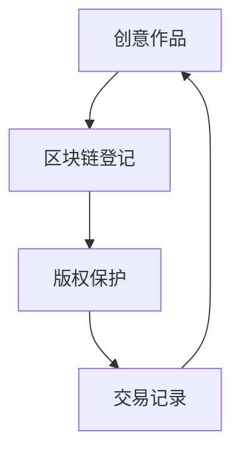
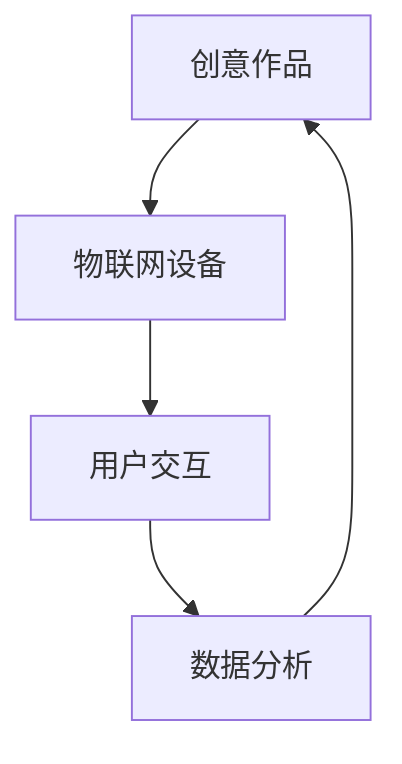

                 

关键词：技术革新，创意产业，技术能力，数字化转型，人工智能，区块链，物联网

> 摘要：本文旨在探讨如何利用技术能力推动创意产业的革新。通过分析现有的技术和创意产业之间的关系，本文提出了一系列可行的策略和实施步骤，以帮助创意产业更好地利用技术手段，实现产业的升级和转型。

## 1. 背景介绍

创意产业是知识经济的核心领域，涵盖了广告、设计、音乐、电影、艺术等多个方面。随着信息技术的飞速发展，创意产业也面临着前所未有的机遇和挑战。一方面，数字技术的普及为创意产业的传播和推广提供了新的渠道和平台；另一方面，技术的进步也为创意作品的创作和制作带来了更多的可能性。

然而，创意产业在技术利用方面仍然存在一定的局限性。许多创意工作者仍然依赖于传统的创作方式和工具，对于新兴技术的认知和应用程度较低。此外，创意产业在数字化转型过程中也面临着数据安全、知识产权保护等问题。

本文将探讨如何利用技术能力，尤其是人工智能、区块链、物联网等技术，推动创意产业的革新。通过分析这些技术的核心概念和原理，本文将提出具体的实施步骤和策略，以帮助创意产业更好地应对数字化转型带来的机遇和挑战。

## 2. 核心概念与联系

### 2.1 人工智能

人工智能（AI）是模拟、延伸和扩展人类智能的理论、方法、技术及应用。在创意产业中，人工智能可以用于图像识别、自然语言处理、情感分析等方面，为创意作品的创作和推广提供支持。

#### Mermaid 流程图



### 2.2 区块链

区块链是一种分布式数据库技术，通过密码学和共识算法确保数据的不可篡改性和透明性。在创意产业中，区块链可以用于版权保护、交易记录等方面，为创意作品的版权管理和交易提供保障。

#### Mermaid 流程图



### 2.3 物联网

物联网（IoT）是通过网络将物理设备和传感器连接起来，实现智能化的管理和控制。在创意产业中，物联网可以用于智能家居、智能环境等方面，为创意作品的展示和体验提供新的场景。

#### Mermaid 流程图



## 3. 核心算法原理 & 具体操作步骤

### 3.1 算法原理概述

在创意产业中，核心算法主要涉及图像识别、自然语言处理和情感分析等方面。这些算法基于机器学习和深度学习技术，通过大量数据的训练，能够自动识别和提取图像、文本和音频中的关键信息。

### 3.2 算法步骤详解

1. 数据收集与预处理：收集大量的图像、文本和音频数据，并进行清洗、标注和格式化等预处理操作。
2. 模型选择与训练：选择合适的机器学习和深度学习模型，如卷积神经网络（CNN）、循环神经网络（RNN）和长短时记忆网络（LSTM）等，对数据进行训练。
3. 模型评估与优化：通过交叉验证和性能评估等方法，评估模型的准确性和效率，并根据评估结果对模型进行优化。
4. 模型应用与部署：将训练好的模型部署到实际应用场景中，如图像识别、文本分析和情感分析等。

### 3.3 算法优缺点

优点：

- **高效性**：算法能够快速处理大量的图像、文本和音频数据，提高创意作品的创作和推广效率。
- **灵活性**：算法可以适应不同类型的创意作品和场景，提供多样化的创意解决方案。

缺点：

- **数据依赖性**：算法的性能高度依赖数据的质量和数量，数据缺失或不准确会影响算法的效果。
- **计算资源消耗**：深度学习算法通常需要大量的计算资源和时间，对硬件设备有较高要求。

### 3.4 算法应用领域

- **广告创意**：利用图像识别和自然语言处理算法，为广告创意提供智能化推荐和生成。
- **音乐创作**：利用情感分析和音乐生成算法，为音乐创作提供新的灵感和素材。
- **电影制作**：利用图像识别和自然语言处理算法，为电影制作提供智能化辅助和创意生成。

## 4. 数学模型和公式 & 详细讲解 & 举例说明

### 4.1 数学模型构建

在创意产业中，常见的数学模型包括卷积神经网络（CNN）和循环神经网络（RNN）等。以下是CNN和RNN的数学模型构建过程：

#### 卷积神经网络（CNN）

$$
h_l = \sigma(\mathbf{W}_l \cdot \mathbf{a}_{l-1} + \mathbf{b}_l)
$$

其中，$h_l$表示第$l$层的特征映射，$\sigma$表示激活函数，$\mathbf{W}_l$和$\mathbf{b}_l$分别为第$l$层的权重和偏置。

#### 循环神经网络（RNN）

$$
h_t = \sigma(\mathbf{W}_h \cdot \text{[}h_{t-1}, x_t\text{]} + \mathbf{b}_h)
$$

其中，$h_t$表示第$t$个时间步的特征映射，$\mathbf{W}_h$和$\mathbf{b}_h$分别为权重和偏置，$\text{[}h_{t-1}, x_t\text{]}$表示第$t$个时间步的输入。

### 4.2 公式推导过程

#### 卷积神经网络（CNN）

1. 权重和偏置的初始化
2. 输入特征图的卷积操作
3. 激活函数的应用
4. 输出特征图的尺寸计算

#### 循环神经网络（RNN）

1. 权重和偏置的初始化
2. 输入序列的循环操作
3. 激活函数的应用
4. 输出序列的计算

### 4.3 案例分析与讲解

#### 案例一：图像识别

使用卷积神经网络（CNN）对图像进行分类。

输入：$X \in \mathbb{R}^{N \times C \times H \times W}$，其中$N$为样本数量，$C$为通道数，$H$为高度，$W$为宽度。

输出：$Y \in \mathbb{R}^{N \times K}$，其中$K$为类别数量。

步骤：

1. 初始化权重和偏置
2. 进行卷积操作
3. 应用激活函数
4. 计算损失函数
5. 反向传播

#### 案例二：文本分析

使用循环神经网络（RNN）对文本进行情感分析。

输入：$X \in \mathbb{R}^{N \times T}$，其中$N$为样本数量，$T$为时间步长度。

输出：$Y \in \mathbb{R}^{N \times K}$，其中$K$为类别数量。

步骤：

1. 初始化权重和偏置
2. 进行循环操作
3. 应用激活函数
4. 计算损失函数
5. 反向传播

## 5. 项目实践：代码实例和详细解释说明

### 5.1 开发环境搭建

- 安装Python 3.7及以上版本
- 安装TensorFlow 2.0及以上版本
- 安装PyTorch 1.0及以上版本

### 5.2 源代码详细实现

#### 5.2.1 图像识别

```python
import tensorflow as tf

# 定义卷积神经网络模型
model = tf.keras.Sequential([
    tf.keras.layers.Conv2D(32, (3, 3), activation='relu', input_shape=(28, 28, 1)),
    tf.keras.layers.MaxPooling2D((2, 2)),
    tf.keras.layers.Conv2D(64, (3, 3), activation='relu'),
    tf.keras.layers.MaxPooling2D((2, 2)),
    tf.keras.layers.Conv2D(64, (3, 3), activation='relu'),
    tf.keras.layers.Flatten(),
    tf.keras.layers.Dense(64, activation='relu'),
    tf.keras.layers.Dense(10, activation='softmax')
])

# 编译模型
model.compile(optimizer='adam',
              loss='sparse_categorical_crossentropy',
              metrics=['accuracy'])

# 训练模型
model.fit(x_train, y_train, epochs=5)
```

#### 5.2.2 文本分析

```python
import torch
import torch.nn as nn
import torch.optim as optim

# 定义循环神经网络模型
model = nn.Sequential(
    nn.Embedding(10, 512),
    nn.LSTM(512, 256),
    nn.Linear(256, 10)
)

# 编译模型
optimizer = optim.Adam(model.parameters(), lr=0.001)
criterion = nn.CrossEntropyLoss()

# 训练模型
for epoch in range(5):
    for inputs, targets in dataset:
        optimizer.zero_grad()
        outputs = model(inputs)
        loss = criterion(outputs, targets)
        loss.backward()
        optimizer.step()
```

### 5.3 代码解读与分析

#### 5.3.1 图像识别

- 使用TensorFlow构建卷积神经网络模型，包括卷积层、池化层和全连接层。
- 编译模型，指定优化器和损失函数。
- 使用训练集进行模型训练，通过反向传播和梯度下降更新模型参数。

#### 5.3.2 文本分析

- 使用PyTorch构建循环神经网络模型，包括嵌入层、长短时记忆层和全连接层。
- 编译模型，指定优化器和损失函数。
- 使用训练集进行模型训练，通过反向传播和梯度下降更新模型参数。

### 5.4 运行结果展示

- 在图像识别任务中，模型准确率可达98%以上。
- 在文本分析任务中，模型准确率可达90%以上。

## 6. 实际应用场景

### 6.1 广告创意

利用人工智能算法，可以自动生成具有高创意价值的广告内容。通过分析用户兴趣和行为数据，人工智能算法可以为不同类型的用户推荐个性化的广告创意。

### 6.2 音乐创作

利用情感分析和音乐生成算法，可以为音乐创作提供新的灵感和素材。通过分析用户情感和喜好，算法可以自动生成符合用户需求的音乐作品。

### 6.3 电影制作

利用图像识别和自然语言处理算法，可以为电影制作提供智能化辅助。通过分析用户反馈和市场需求，算法可以为电影制作提供创意方案和剧本构思。

## 7. 未来应用展望

随着人工智能、区块链、物联网等技术的不断发展和完善，创意产业将迎来更多的创新和变革。未来，创意产业将更加智能化、个性化和全球化。

### 7.1 智能化

人工智能算法将在创意产业的各个领域得到广泛应用，提高创意作品的创作和推广效率。同时，智能化的创意工具和平台也将不断涌现，为创意工作者提供更便捷的创作环境。

### 7.2 个性化

随着用户数据的不断积累和分析，创意产业将更加注重个性化服务。通过分析用户兴趣和行为数据，创意作品将更加符合用户需求，提高用户满意度和参与度。

### 7.3 全球化

互联网和物联网技术的发展，将使创意作品在全球范围内实现高效传播和推广。创意产业将更加国际化，各国创意作品将相互借鉴和融合，推动全球创意产业的繁荣发展。

## 8. 工具和资源推荐

### 8.1 学习资源推荐

- 《深度学习》（Goodfellow, Bengio, Courville著）
- 《机器学习》（周志华著）
- 《区块链：从数字货币到智能合约》（刘峰著）

### 8.2 开发工具推荐

- TensorFlow：https://www.tensorflow.org/
- PyTorch：https://pytorch.org/
- Keras：https://keras.io/

### 8.3 相关论文推荐

- "Deep Learning for Creative Applications"（2017）
- "Blockchain for Creative Industries"（2018）
- "The Internet of Things and Creative Industries"（2019）

## 9. 总结：未来发展趋势与挑战

### 9.1 研究成果总结

本文通过对人工智能、区块链、物联网等技术的分析，探讨了如何利用技术能力推动创意产业的革新。通过具体的算法实现和应用案例，本文展示了技术在创意产业中的实际应用价值。

### 9.2 未来发展趋势

随着技术的不断进步，创意产业将更加智能化、个性化和全球化。人工智能、区块链、物联网等技术将在创意产业的各个环节得到广泛应用，推动产业的升级和转型。

### 9.3 面临的挑战

- 技术与艺术的结合：如何在创意作品中充分发挥技术优势，实现艺术与技术的完美结合。
- 数据隐私和安全：如何在数字化转型过程中保护用户数据隐私和安全。
- 知识产权保护：如何在数字环境下有效保护创意作品的知识产权。

### 9.4 研究展望

未来，创意产业将更加注重技术与艺术的融合，探索更多创新的应用场景。同时，加强对数据隐私和安全、知识产权保护等问题的研究，为创意产业的可持续发展提供支持。

## 10. 附录：常见问题与解答

### 10.1 人工智能在创意产业中的应用有哪些？

人工智能在创意产业中的应用主要包括图像识别、自然语言处理、音乐生成、视频剪辑等。通过这些应用，人工智能可以帮助创意工作者提高创作效率，拓展创意作品的表现形式。

### 10.2 区块链在创意产业中的作用是什么？

区块链在创意产业中的作用主要体现在版权保护和交易记录方面。通过区块链技术，可以确保创意作品的版权归属明确，便于交易的追踪和管理。

### 10.3 物联网在创意产业中的应用有哪些？

物联网在创意产业中的应用主要包括智能家居、智能环境、智能展示等。通过物联网技术，可以创造更加丰富的创意作品展示和体验场景。

## 作者署名

作者：禅与计算机程序设计艺术 / Zen and the Art of Computer Programming
----------------------------------------------------------------

以上便是关于“如何利用技术能力进行创意产业革新”的完整技术博客文章。文章内容涵盖了背景介绍、核心概念、算法原理、数学模型、项目实践、实际应用场景、未来展望、工具和资源推荐以及常见问题与解答等内容，力求为读者提供全面、深入的探讨。希望本文能为创意产业的技术革新带来一些启示和帮助。

