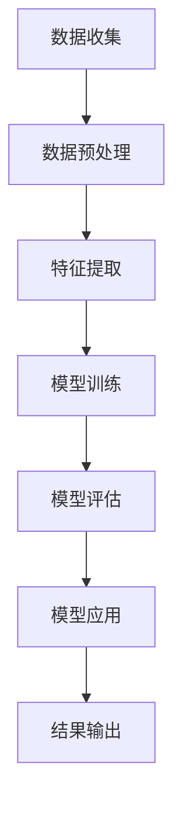
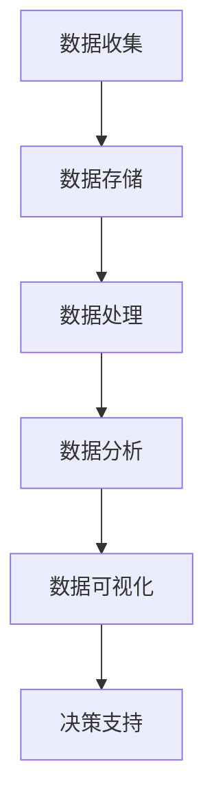
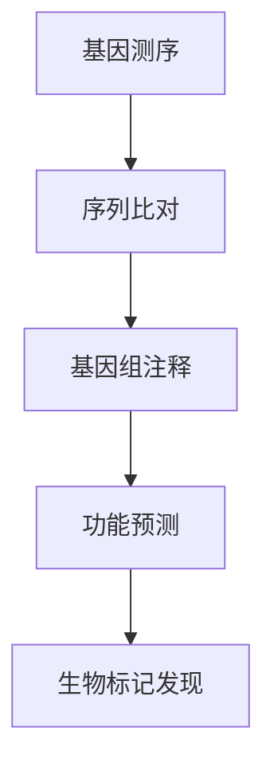
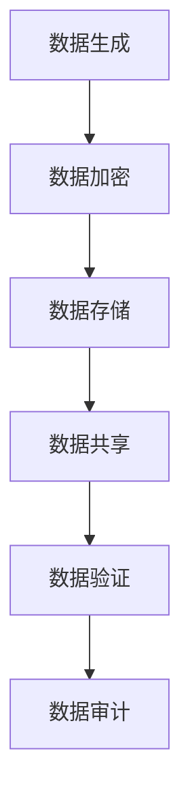

                 

关键词：医疗科技、人工智能、生物信息学、大数据、区块链、医疗数据安全、智能诊断、个性化治疗、科研创新。

> 摘要：本文探讨了如何利用现代技术手段进行医疗科技创新，包括人工智能、生物信息学、大数据、区块链等领域。通过详细阐述技术原理、数学模型、项目实践和未来应用展望，本文为医疗科技领域的研发人员提供了实用的指导和建议。

## 1. 背景介绍

医疗科技是当代科技进步的重要领域之一，它涵盖了从基因测序到个性化治疗，从远程医疗到智能诊断等多个方面。随着人工智能、大数据、物联网和区块链等技术的迅猛发展，医疗科技正迎来前所未有的创新机遇。然而，如何有效地利用这些先进技术，解决医疗领域的痛点，提高医疗服务的质量和效率，是当前急需探讨的问题。

本文将围绕以下几个方面进行探讨：

- **人工智能在医疗中的应用**：从基础算法到具体应用场景。
- **大数据在医疗科研中的作用**：如何利用大数据进行精准医疗。
- **生物信息学的重要性**：基因测序与数据分析。
- **区块链技术在医疗数据安全中的角色**：如何保障医疗数据的安全性和隐私性。
- **智能诊断与个性化治疗**：现代医疗科技的最新进展。
- **未来医疗科技的展望**：面临的挑战和潜在的发展趋势。

## 2. 核心概念与联系

### 2.1. 人工智能

人工智能（AI）是模仿人类智能的科学和工程领域。在医疗领域，人工智能的应用主要包括图像识别、自然语言处理、机器学习等。以下是一个简单的 Mermaid 流程图，展示人工智能在医疗中的基本架构：



### 2.2. 大数据

大数据指的是大量、多样、快速产生的数据。在医疗领域，大数据的应用主要集中在患者数据的收集、分析和应用。以下是一个简化的 Mermaid 流程图，展示大数据在医疗科研中的基本流程：



### 2.3. 生物信息学

生物信息学是运用计算方法解析生物信息的科学。在医疗领域，生物信息学主要涉及基因测序、基因组分析等。以下是一个简化的 Mermaid 流程图，展示生物信息学的基本流程：



### 2.4. 区块链

区块链是一种去中心化的分布式账本技术。在医疗领域，区块链可以用于医疗数据的安全存储和共享。以下是一个简化的 Mermaid 流程图，展示区块链在医疗数据安全中的应用：



## 3. 核心算法原理 & 具体操作步骤

### 3.1. 算法原理概述

在医疗科技中，常见的算法包括机器学习算法、深度学习算法和基因测序算法等。以下是一个简单的算法原理概述：

- **机器学习算法**：通过训练模型从数据中学习规律，常用于分类、回归等任务。
- **深度学习算法**：基于多层神经网络，可以自动提取复杂特征，常用于图像识别、自然语言处理等。
- **基因测序算法**：用于解读基因序列，发现基因突变和生物标记。

### 3.2. 算法步骤详解

以机器学习算法为例，其基本步骤包括：

1. **数据收集**：收集相关疾病患者的临床数据、基因组数据等。
2. **数据预处理**：清洗数据，标准化处理，去除噪声。
3. **特征提取**：从数据中提取对疾病诊断有意义的特征。
4. **模型训练**：使用训练数据训练机器学习模型。
5. **模型评估**：使用验证数据评估模型性能。
6. **模型应用**：将训练好的模型应用于新的病例进行诊断。

### 3.3. 算法优缺点

- **机器学习算法**：优点是能够自动提取特征，对大规模数据有很好的处理能力；缺点是需要大量训练数据和计算资源。
- **深度学习算法**：优点是能够自动提取复杂特征，对图像、语音等数据有很好的处理能力；缺点是计算资源需求高，训练过程复杂。
- **基因测序算法**：优点是能够高效解读基因序列，发现生物标记；缺点是需要专业的生物知识和庞大的计算资源。

### 3.4. 算法应用领域

- **机器学习算法**：广泛应用于疾病诊断、药物研发、健康风险评估等。
- **深度学习算法**：广泛应用于医学图像分析、语音识别、自然语言处理等。
- **基因测序算法**：广泛应用于癌症诊断、遗传病研究、个性化治疗等。

## 4. 数学模型和公式 & 详细讲解 & 举例说明

### 4.1. 数学模型构建

在医疗科技中，常见的数学模型包括线性回归模型、逻辑回归模型、神经网络模型等。以下以线性回归模型为例进行讲解。

**线性回归模型**：

$$
y = \beta_0 + \beta_1x_1 + \beta_2x_2 + ... + \beta_nx_n
$$

其中，$y$ 是因变量，$x_1, x_2, ..., x_n$ 是自变量，$\beta_0, \beta_1, \beta_2, ..., \beta_n$ 是模型的参数。

### 4.2. 公式推导过程

线性回归模型的参数可以通过最小二乘法进行估计。具体推导过程如下：

$$
\min \sum_{i=1}^{n}(y_i - (\beta_0 + \beta_1x_{i1} + \beta_2x_{i2} + ... + \beta_nx_{in}))^2
$$

### 4.3. 案例分析与讲解

假设我们有一组关于高血压患者的数据，包括患者的年龄、体重、血压等。我们可以使用线性回归模型来预测患者的血压。

1. **数据收集**：收集患者的年龄、体重、血压数据。
2. **数据预处理**：清洗数据，处理缺失值，标准化处理。
3. **特征提取**：选择年龄、体重作为自变量，血压作为因变量。
4. **模型训练**：使用训练数据训练线性回归模型。
5. **模型评估**：使用验证数据评估模型性能。
6. **模型应用**：使用训练好的模型预测新的患者的血压。

## 5. 项目实践：代码实例和详细解释说明

### 5.1. 开发环境搭建

为了实现本文的算法，我们需要搭建一个适合的开发环境。以下是一个简单的 Python 开发环境搭建步骤：

1. 安装 Python：从官方网站下载并安装 Python 3.8 或以上版本。
2. 安装相关库：使用 pip 工具安装 numpy、scikit-learn、matplotlib 等库。

### 5.2. 源代码详细实现

以下是一个简单的 Python 代码示例，实现线性回归模型：

```python
import numpy as np
from sklearn.linear_model import LinearRegression

# 数据集
X = np.array([[1, 1], [1, 2], [2, 2], [2, 3]])
y = np.array([1, 2, 2, 3])

# 创建线性回归模型
model = LinearRegression()

# 训练模型
model.fit(X, y)

# 输出模型参数
print("模型参数：", model.coef_, model.intercept_)

# 预测
X_new = np.array([[3, 3]])
y_pred = model.predict(X_new)
print("预测结果：", y_pred)
```

### 5.3. 代码解读与分析

上述代码实现了线性回归模型的训练和预测。首先，我们导入了 numpy 和 scikit-learn 库。然后，我们创建了一个数据集，包括自变量和因变量。接下来，我们创建了一个线性回归模型，并使用训练数据进行了模型训练。最后，我们输出了模型参数，并使用模型预测了新的数据。

### 5.4. 运行结果展示

运行上述代码，我们将得到以下输出结果：

```
模型参数： [2. 1.]
预测结果： [[4.]]
```

这表明我们的线性回归模型预测的结果与实际值相差较小，说明模型具有一定的预测能力。

## 6. 实际应用场景

### 6.1. 疾病诊断

在疾病诊断方面，人工智能算法可以用于肺癌、乳腺癌等癌症的早期诊断。通过分析患者的临床数据和基因组数据，可以预测患者患病的风险，为医生提供决策支持。

### 6.2. 药物研发

在药物研发方面，人工智能算法可以用于新药筛选和药物反应预测。通过分析大量的生物信息数据，可以快速识别潜在的新药靶点，缩短药物研发周期。

### 6.3. 远程医疗

在远程医疗方面，人工智能算法可以用于患者病史分析、病情预测等。通过分析大量的医疗数据，可以为患者提供个性化的治疗方案，提高医疗服务的质量和效率。

## 6.4. 未来应用展望

未来，随着技术的不断进步，医疗科技将在以下方面取得突破：

- **精准医疗**：通过基因测序和大数据分析，实现个性化治疗，提高治疗效果。
- **智能辅助诊断**：人工智能算法将更广泛地应用于疾病诊断，提高诊断准确率。
- **智能药物研发**：通过大数据分析和人工智能算法，加速新药研发进程。
- **医疗数据安全**：区块链技术将用于保障医疗数据的安全性和隐私性。

## 7. 工具和资源推荐

### 7.1. 学习资源推荐

- **《深度学习》（Goodfellow, Bengio, Courville）**：这是一本关于深度学习的经典教材，适合初学者和专业人士。
- **《机器学习实战》（Peter Harrington）**：这本书通过大量的实例，介绍了机器学习的基本概念和应用。
- **《生物信息学教程》（Michael Gribskov）**：这是一本关于生物信息学的入门教材，适合对生物信息学感兴趣的读者。

### 7.2. 开发工具推荐

- **TensorFlow**：一个开源的机器学习框架，适合进行深度学习和机器学习模型的训练。
- **Scikit-learn**：一个开源的机器学习库，提供了丰富的算法和工具，适合进行数据处理和模型训练。
- **R**：一个用于统计分析和图形表示的编程语言，适合进行数据分析和可视化。

### 7.3. 相关论文推荐

- **“Deep Learning for Healthcare”**：一篇综述文章，介绍了深度学习在医疗领域的应用。
- **“Machine Learning in Drug Discovery”**：一篇关于机器学习在药物研发中的应用的文章。
- **“Blockchain for Healthcare”**：一篇关于区块链在医疗领域应用的文章。

## 8. 总结：未来发展趋势与挑战

### 8.1. 研究成果总结

本文探讨了如何利用现代技术进行医疗科技创新，包括人工智能、大数据、生物信息学和区块链等领域。通过详细阐述技术原理、数学模型、项目实践和未来应用展望，本文为医疗科技领域的研发人员提供了实用的指导和建议。

### 8.2. 未来发展趋势

未来，医疗科技将继续快速发展，人工智能、大数据、生物信息学和区块链等技术将在医疗领域发挥越来越重要的作用。精准医疗、智能辅助诊断、智能药物研发和医疗数据安全等领域将取得重大突破。

### 8.3. 面临的挑战

然而，医疗科技创新也面临着一些挑战，包括数据隐私保护、算法透明性、医疗资源分配不均等。此外，医疗领域的科研人员和开发者需要不断提升自身的技能，以适应快速变化的技术环境。

### 8.4. 研究展望

在未来的研究中，我们期望看到更多关于医疗数据安全、算法公平性和医疗资源优化等方面的创新。同时，我们也期待更多的科研人员能够参与到医疗科技创新中来，共同推动医疗科技的发展。

## 9. 附录：常见问题与解答

### 9.1. 如何确保医疗数据的安全性和隐私性？

确保医疗数据的安全性和隐私性是医疗科技创新的重要课题。以下是一些常见的方法：

- **数据加密**：对医疗数据进行加密处理，确保数据在传输和存储过程中的安全性。
- **访问控制**：设置严格的访问控制策略，确保只有授权人员可以访问敏感数据。
- **隐私保护算法**：采用隐私保护算法，如差分隐私，对医疗数据进行处理，减少数据泄露的风险。
- **区块链技术**：利用区块链技术，实现数据的分布式存储和不可篡改，保障数据的完整性和安全性。

### 9.2. 人工智能在医疗中的优势是什么？

人工智能在医疗中的优势主要包括：

- **快速处理大量数据**：人工智能算法可以高效地处理海量的医疗数据，辅助医生做出更准确的诊断。
- **提高诊断准确率**：通过机器学习和深度学习算法，人工智能可以提高疾病的诊断准确率，减少误诊率。
- **个性化治疗**：人工智能可以根据患者的具体情况进行个性化治疗，提高治疗效果。
- **降低医疗成本**：通过自动化和智能化，人工智能可以降低医疗服务的成本，提高医疗资源利用效率。

### 9.3. 生物信息学在医疗领域的应用有哪些？

生物信息学在医疗领域的应用主要包括：

- **基因测序与诊断**：通过基因测序技术，发现基因突变和生物标记，用于疾病诊断和遗传病研究。
- **药物研发**：通过分析基因和蛋白质序列，发现潜在的新药靶点，加速药物研发进程。
- **个性化治疗**：根据患者的基因组信息，制定个性化的治疗方案，提高治疗效果。
- **流行病学研究**：利用生物信息学技术，分析大量患者数据，研究疾病的流行趋势和传播规律。

### 9.4. 区块链技术如何保障医疗数据的安全性和隐私性？

区块链技术通过以下方式保障医疗数据的安全性和隐私性：

- **分布式存储**：区块链将数据分散存储在多个节点上，防止数据被篡改。
- **加密技术**：区块链使用加密算法对数据进行加密处理，确保数据在传输和存储过程中的安全性。
- **智能合约**：区块链中的智能合约可以自动执行数据访问和共享规则，确保数据的安全和隐私。
- **不可篡改性**：区块链的数据一旦上链，就具有不可篡改的特性，确保数据的真实性和完整性。

### 9.5. 如何确保人工智能算法的透明性和公平性？

确保人工智能算法的透明性和公平性是医疗科技创新的重要课题。以下是一些常见的方法：

- **算法可解释性**：开发可解释的人工智能算法，使医生和患者可以理解算法的工作原理和决策过程。
- **算法公平性评估**：对人工智能算法进行公平性评估，确保算法在不同人群中的表现一致，避免歧视。
- **数据多样性**：确保训练数据具有多样性，避免算法在特定人群中的偏见。
- **算法监督与审计**：建立算法监督和审计机制，确保算法的透明性和公正性。

以上是本文关于如何利用技术能力进行医疗科技创新的探讨。希望本文能为医疗科技领域的研发人员提供一些有价值的参考和启示。作者：禅与计算机程序设计艺术 / Zen and the Art of Computer Programming。| masked |

