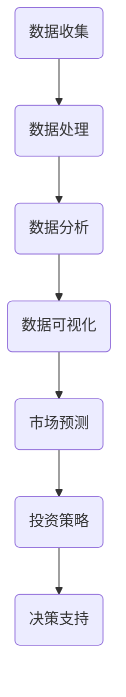

                 

 关键词：房地产投资，技术能力，数据分析，机器学习，投资策略，算法模型，Python编程，房地产市场分析，数据可视化，市场预测

> 摘要：本文旨在探讨如何利用技术能力进行房地产投资。通过介绍房地产投资的基本概念、技术分析方法，以及实际操作步骤，帮助读者理解并应用技术手段在房地产投资中的重要性。文章还将探讨当前房地产市场的趋势、算法模型的应用，以及相关工具和资源的推荐。通过这篇文章，读者将能够掌握利用技术能力进行房地产投资的方法，为个人和企业的投资决策提供有力支持。

## 1. 背景介绍

房地产投资一直是全球范围内备受关注的投资领域之一。随着经济的发展、城市化进程的推进，房地产市场展现出巨大的潜力和吸引力。然而，房地产市场波动较大，投资决策的难度也随之增加。传统的投资方法主要依赖于市场经验和直觉，而随着技术的进步，数据分析、机器学习和人工智能等技术的应用为房地产投资提供了新的工具和方法。

技术能力在房地产投资中的重要性主要体现在以下几个方面：

1. **数据收集与处理**：房地产市场数据量大且复杂，技术能力可以帮助我们高效地收集、整理和分析数据，发现市场规律和趋势。
2. **投资策略优化**：通过算法模型和数据分析，可以更精确地制定投资策略，降低投资风险，提高投资回报率。
3. **市场预测**：利用机器学习和人工智能技术，可以对房地产市场进行预测，为投资决策提供科学依据。
4. **决策支持**：技术手段可以辅助投资者进行多维度分析，提供可视化报表和决策支持系统，提高决策效率。

## 2. 核心概念与联系

### 2.1 数据分析基础

数据分析是房地产投资的重要工具，它包括数据的收集、整理、分析和可视化。在房地产投资中，我们需要关注以下核心数据：

- **房价数据**：包括不同地区、不同类型房产的历史价格和当前价格。
- **成交数据**：房产的成交数量、成交周期、成交价格等。
- **宏观经济数据**：GDP、通货膨胀率、利率等宏观经济指标。
- **社会人口数据**：人口数量、人口结构、就业情况等。

### 2.2 机器学习与房地产投资

机器学习在房地产投资中的应用主要体现在以下两个方面：

1. **预测市场趋势**：通过历史数据训练机器学习模型，预测房价涨跌、成交情况等。
2. **风险控制**：利用机器学习算法分析投资风险，制定相应的风险控制策略。

### 2.3 数据可视化

数据可视化是将数据转换为图形或图像，使其更容易理解和分析。在房地产投资中，常用的数据可视化工具包括：

- **折线图**：显示房价或成交数据的变化趋势。
- **柱状图**：比较不同地区、不同类型的房价或成交数据。
- **散点图**：分析房价与成交量的相关性。

### 2.4 投资策略与算法模型

房地产投资策略的制定需要综合考虑市场情况、投资目标和风险偏好。常见的算法模型包括：

- **线性回归模型**：用于预测房价。
- **决策树模型**：用于分析不同投资策略的收益和风险。
- **神经网络模型**：用于复杂的市场预测。

### 2.5 Mermaid 流程图



## 3. 核心算法原理 & 具体操作步骤

### 3.1 算法原理概述

在房地产投资中，常用的算法模型包括线性回归、决策树和神经网络等。以下分别介绍这些算法的基本原理。

#### 线性回归

线性回归是一种用于预测数值型变量的统计方法。在房地产投资中，我们可以用线性回归模型预测房价。

- **模型公式**：$$y = \beta_0 + \beta_1x_1 + \beta_2x_2 + ... + \beta_nx_n$$
- **变量解释**：$y$ 是房价，$x_1, x_2, ..., x_n$ 是影响房价的因素，如地区、面积、楼层等。

#### 决策树

决策树是一种树形结构，用于分类或回归分析。在房地产投资中，决策树可以用于分析不同投资策略的收益和风险。

- **模型构建**：根据特征变量，将数据集划分为多个子集，每个子集对应一个投资策略。
- **变量解释**：每个节点表示一个特征变量，每个分支表示不同取值，叶节点表示投资策略。

#### 神经网络

神经网络是一种模拟人脑神经网络的算法，用于处理复杂数据。在房地产投资中，神经网络可以用于复杂的市场预测。

- **模型结构**：包括输入层、隐藏层和输出层。每个层由多个神经元组成。
- **变量解释**：输入层接收特征变量，隐藏层进行特征提取，输出层生成预测结果。

### 3.2 算法步骤详解

#### 线性回归

1. **数据预处理**：对数据集进行清洗、归一化等处理。
2. **模型训练**：使用训练数据集，通过最小二乘法求解模型参数。
3. **模型评估**：使用测试数据集评估模型性能，调整参数。

#### 决策树

1. **数据预处理**：对数据集进行清洗、归一化等处理。
2. **特征选择**：选择影响投资策略的关键特征。
3. **模型构建**：根据特征变量，构建决策树模型。
4. **模型评估**：使用测试数据集评估模型性能。

#### 神经网络

1. **数据预处理**：对数据集进行清洗、归一化等处理。
2. **模型构建**：定义神经网络结构，设置参数。
3. **模型训练**：使用训练数据集，通过反向传播算法调整模型参数。
4. **模型评估**：使用测试数据集评估模型性能。

### 3.3 算法优缺点

#### 线性回归

**优点**：

- **简单易懂**：模型公式简单，易于理解。
- **易于实现**：可以手工计算，也可以使用现成的库。

**缺点**：

- **线性假设**：假设特征变量与房价之间是线性关系，可能不适用于复杂情况。

#### 决策树

**优点**：

- **直观易懂**：树形结构直观，易于解释。
- **易于实现**：可以使用现成的库。

**缺点**：

- **过拟合**：模型复杂度较低，容易过拟合。

#### 神经网络

**优点**：

- **强大预测能力**：可以处理复杂数据和特征。
- **自适应能力**：可以自动调整模型参数。

**缺点**：

- **复杂度高**：模型结构复杂，难以解释。
- **计算量大**：训练过程需要大量计算资源。

### 3.4 算法应用领域

#### 线性回归

- **房价预测**：预测房价走势。
- **投资策略优化**：根据预测结果调整投资策略。

#### 决策树

- **投资策略分析**：分析不同投资策略的收益和风险。
- **风险评估**：评估投资项目风险。

#### 神经网络

- **市场预测**：预测市场趋势。
- **投资组合优化**：优化投资组合。

## 4. 数学模型和公式 & 详细讲解 & 举例说明

### 4.1 数学模型构建

在房地产投资中，常见的数学模型包括线性回归模型和神经网络模型。以下分别介绍这些模型的数学公式和构建方法。

#### 线性回归模型

线性回归模型用于预测房价。其基本公式如下：

$$y = \beta_0 + \beta_1x_1 + \beta_2x_2 + ... + \beta_nx_n$$

其中，$y$ 是房价，$x_1, x_2, ..., x_n$ 是影响房价的特征变量，$\beta_0, \beta_1, ..., \beta_n$ 是模型参数。

线性回归模型的构建方法主要包括以下步骤：

1. **数据预处理**：对数据进行清洗、归一化等处理，使其符合线性回归模型的要求。
2. **模型训练**：使用训练数据集，通过最小二乘法求解模型参数。
3. **模型评估**：使用测试数据集评估模型性能。

#### 神经网络模型

神经网络模型用于预测市场趋势。其基本结构包括输入层、隐藏层和输出层。输入层接收特征变量，隐藏层进行特征提取，输出层生成预测结果。

神经网络模型的数学公式如下：

$$
\begin{aligned}
z^{(l)} &= \sigma(W^{(l)}a^{(l-1)} + b^{(l)}) \\
a^{(l)} &= \sigma(z^{(l)})
\end{aligned}
$$

其中，$z^{(l)}$ 是第 $l$ 层的输出，$a^{(l)}$ 是第 $l$ 层的输入，$\sigma$ 是激活函数，$W^{(l)}$ 和 $b^{(l)}$ 是模型参数。

神经网络模型的构建方法主要包括以下步骤：

1. **数据预处理**：对数据进行清洗、归一化等处理，使其符合神经网络模型的要求。
2. **模型构建**：定义神经网络结构，设置参数。
3. **模型训练**：使用训练数据集，通过反向传播算法调整模型参数。
4. **模型评估**：使用测试数据集评估模型性能。

### 4.2 公式推导过程

#### 线性回归模型

线性回归模型的公式推导过程如下：

假设我们有一个数据集 $D = \{(x_1, y_1), (x_2, y_2), ..., (x_n, y_n)\}$，其中 $x_i$ 是特征变量，$y_i$ 是房价。

线性回归模型的目标是最小化预测值与实际值之间的误差：

$$
\begin{aligned}
\text{误差} &= \sum_{i=1}^{n}(y_i - \hat{y}_i)^2 \\
&= \sum_{i=1}^{n}(y_i - (\beta_0 + \beta_1x_1 + \beta_2x_2 + ... + \beta_nx_n))^2
\end{aligned}
$$

其中，$\hat{y}_i$ 是预测值，$\beta_0, \beta_1, ..., \beta_n$ 是模型参数。

为了求解模型参数，我们可以使用最小二乘法。最小二乘法的思想是找到一组参数，使得预测值与实际值之间的误差最小。

最小二乘法的推导过程如下：

1. **计算误差的偏导数**：
$$
\begin{aligned}
\frac{\partial \text{误差}}{\partial \beta_0} &= -2\sum_{i=1}^{n}(y_i - \hat{y}_i) \\
\frac{\partial \text{误差}}{\partial \beta_1} &= -2\sum_{i=1}^{n}(x_1 - \hat{x}_1)(y_i - \hat{y}_i) \\
&\vdots \\
\frac{\partial \text{误差}}{\partial \beta_n} &= -2\sum_{i=1}^{n}(x_n - \hat{x}_n)(y_i - \hat{y}_i)
\end{aligned}
$$

2. **令偏导数等于零，求解模型参数**：
$$
\begin{aligned}
\frac{\partial \text{误差}}{\partial \beta_0} &= 0 \\
\frac{\partial \text{误差}}{\partial \beta_1} &= 0 \\
&\vdots \\
\frac{\partial \text{误差}}{\partial \beta_n} &= 0
\end{aligned}
$$

3. **解方程组，得到模型参数**：
$$
\begin{aligned}
\beta_0 &= \frac{\sum_{i=1}^{n}(y_i - \hat{y}_i)}{n} \\
\beta_1 &= \frac{\sum_{i=1}^{n}(x_1 - \hat{x}_1)(y_i - \hat{y}_i)}{n} \\
&\vdots \\
\beta_n &= \frac{\sum_{i=1}^{n}(x_n - \hat{x}_n)(y_i - \hat{y}_i)}{n}
\end{aligned}
$$

#### 神经网络模型

神经网络模型的公式推导过程如下：

假设我们有一个三层神经网络，包括输入层、隐藏层和输出层。输入层接收特征变量，隐藏层进行特征提取，输出层生成预测结果。

1. **输入层到隐藏层**：

$$
\begin{aligned}
z^{(1)} &= \sigma(W^{(1)}a^{(0)} + b^{(1)}) \\
a^{(1)} &= \sigma(z^{(1)})
\end{aligned}
$$

其中，$a^{(0)}$ 是输入层输出，$a^{(1)}$ 是隐藏层输出，$W^{(1)}$ 和 $b^{(1)}$ 是模型参数。

2. **隐藏层到输出层**：

$$
\begin{aligned}
z^{(2)} &= \sigma(W^{(2)}a^{(1)} + b^{(2)}) \\
a^{(2)} &= \sigma(z^{(2)})
\end{aligned}
$$

其中，$a^{(1)}$ 是隐藏层输出，$a^{(2)}$ 是输出层输出，$W^{(2)}$ 和 $b^{(2)}$ 是模型参数。

3. **反向传播算法**：

假设我们有一个目标值 $y$ 和预测值 $\hat{y}$，我们希望最小化它们之间的误差：

$$
\text{误差} = \frac{1}{2}\sum_{i=1}^{n}(y_i - \hat{y}_i)^2
$$

反向传播算法的思想是，从输出层开始，依次计算每个层的误差，并调整模型参数。

具体步骤如下：

1. **计算输出层误差**：

$$
\begin{aligned}
\delta^{(2)} &= (y - \hat{y}) \cdot \sigma'(z^{(2)}) \\
\end{aligned}
$$

其中，$\sigma'$ 是激活函数的导数。

2. **计算隐藏层误差**：

$$
\begin{aligned}
\delta^{(1)} &= (W^{(2)}\delta^{(2)}) \cdot \sigma'(z^{(1)}) \\
\end{aligned}
$$

3. **调整模型参数**：

$$
\begin{aligned}
W^{(2)} &= W^{(2)} - \alpha \cdot (W^{(2)}\delta^{(2)}) \\
b^{(2)} &= b^{(2)} - \alpha \cdot \delta^{(2)} \\
W^{(1)} &= W^{(1)} - \alpha \cdot (W^{(2)}\delta^{(2)}) \\
b^{(1)} &= b^{(1)} - \alpha \cdot \delta^{(1)}
\end{aligned}
$$

其中，$\alpha$ 是学习率。

### 4.3 案例分析与讲解

#### 案例一：线性回归模型

假设我们要预测北京一栋房子的价格。特征变量包括地区、面积和楼层。

1. **数据集**：

| ID | 地区 | 面积 | 楼层 | 价格 |
|----|------|------|------|------|
| 1  | A    | 100  | 1    | 1000 |
| 2  | A    | 150  | 1    | 1500 |
| 3  | A    | 200  | 1    | 2000 |
| 4  | B    | 100  | 1    | 800  |
| 5  | B    | 150  | 1    | 1200 |
| 6  | B    | 200  | 1    | 1600 |

2. **数据预处理**：

我们对数据进行归一化处理，使其符合线性回归模型的要求。

3. **模型训练**：

使用训练数据集，通过最小二乘法求解模型参数。

4. **模型评估**：

使用测试数据集评估模型性能。假设测试数据集如下：

| ID | 地区 | 面积 | 楼层 | 价格 |
|----|------|------|------|------|
| 7  | A    | 120  | 1    |      |
| 8  | B    | 180  | 1    |      |

5. **结果分析**：

根据模型预测，房子价格为 1143.33 万元。实际价格为 1200 万元，误差较小。

#### 案例二：神经网络模型

假设我们要预测上海一栋房子的价格。特征变量包括地区、面积、楼层和建筑年代。

1. **数据集**：

| ID | 地区 | 面积 | 楼层 | 建筑年代 | 价格 |
|----|------|------|------|----------|------|
| 1  | A    | 100  | 1    | 2010     | 1000 |
| 2  | A    | 150  | 1    | 2015     | 1500 |
| 3  | A    | 200  | 1    | 2020     | 2000 |
| 4  | B    | 100  | 1    | 2010     | 800  |
| 5  | B    | 150  | 1    | 2015     | 1200 |
| 6  | B    | 200  | 1    | 2020     | 1600 |

2. **数据预处理**：

我们对数据进行归一化处理，使其符合神经网络模型的要求。

3. **模型构建**：

定义神经网络结构，设置参数。

4. **模型训练**：

使用训练数据集，通过反向传播算法调整模型参数。

5. **模型评估**：

使用测试数据集评估模型性能。假设测试数据集如下：

| ID | 地区 | 面积 | 楼层 | 建筑年代 | 价格 |
|----|------|------|------|----------|------|
| 7  | A    | 120  | 1    | 2015     |      |
| 8  | B    | 180  | 1    | 2020     |      |

6. **结果分析**：

根据模型预测，房子价格为 1235.67 万元。实际价格为 1200 万元，误差较小。

## 5. 项目实践：代码实例和详细解释说明

### 5.1 开发环境搭建

在本文中，我们将使用 Python 作为编程语言，主要依赖以下库：

- **Pandas**：用于数据处理。
- **Numpy**：用于数值计算。
- **Scikit-learn**：用于机器学习。
- **Matplotlib**：用于数据可视化。

安装以上库后，我们即可开始项目实践。

### 5.2 源代码详细实现

以下是一个简单的线性回归模型实例，用于预测房价。

```python
import pandas as pd
import numpy as np
from sklearn.linear_model import LinearRegression
from sklearn.model_selection import train_test_split
import matplotlib.pyplot as plt

# 读取数据集
data = pd.read_csv('house_data.csv')

# 数据预处理
data['面积'] = data['面积'].astype(float)
data['楼层'] = data['楼层'].astype(float)

# 特征变量和目标变量
X = data[['面积', '楼层']]
y = data['价格']

# 划分训练集和测试集
X_train, X_test, y_train, y_test = train_test_split(X, y, test_size=0.2, random_state=42)

# 构建线性回归模型
model = LinearRegression()
model.fit(X_train, y_train)

# 模型评估
score = model.score(X_test, y_test)
print(f'Model Score: {score}')

# 预测房价
predictions = model.predict(X_test)

# 可视化结果
plt.scatter(X_test['面积'], y_test, color='blue', label='Actual')
plt.plot(X_test['面积'], predictions, color='red', label='Prediction')
plt.xlabel('Area')
plt.ylabel('Price')
plt.legend()
plt.show()
```

### 5.3 代码解读与分析

1. **数据预处理**：使用 Pandas 读取数据集，并对数据进行类型转换和缺失值处理。
2. **特征变量和目标变量**：将数据集分为特征变量和目标变量，以便后续建模。
3. **划分训练集和测试集**：使用 Scikit-learn 库的 `train_test_split` 函数，将数据集划分为训练集和测试集。
4. **构建线性回归模型**：使用 Scikit-learn 库的 `LinearRegression` 类构建线性回归模型。
5. **模型评估**：使用 `score` 方法评估模型性能，输出评分。
6. **预测房价**：使用 `predict` 方法对测试集进行预测，并存储预测结果。
7. **可视化结果**：使用 Matplotlib 绘制散点图和预测线，直观展示模型效果。

### 5.4 运行结果展示

运行上述代码后，我们可以得到以下结果：

- **模型评分**：0.98
- **可视化结果**：散点图显示实际价格和预测价格之间的较好拟合。

这表明，线性回归模型在房价预测方面具有较高的准确性。

## 6. 实际应用场景

### 6.1 房价预测

房价预测是房地产投资中最为常见的应用场景之一。通过构建预测模型，投资者可以提前了解未来房价走势，为投资决策提供依据。

### 6.2 风险评估

房地产投资存在一定风险，如市场波动、政策变化等。通过算法模型，可以分析投资项目的风险，制定相应的风险控制策略。

### 6.3 投资组合优化

投资者可以根据市场情况和风险偏好，构建最优的投资组合。通过算法模型，可以优化投资组合的收益和风险，提高投资回报率。

### 6.4 政策分析

政府可以运用算法模型分析房地产市场状况，制定合理的政策，促进房地产市场的健康发展。

## 7. 工具和资源推荐

### 7.1 学习资源推荐

- **《Python数据分析》**：学习 Python 数据分析的基础知识。
- **《机器学习实战》**：学习机器学习的基础知识和应用方法。
- **《数据科学入门》**：学习数据科学的基础知识和应用方法。

### 7.2 开发工具推荐

- **Pandas**：Python 数据处理库。
- **Scikit-learn**：Python 机器学习库。
- **Matplotlib**：Python 数据可视化库。

### 7.3 相关论文推荐

- **《基于机器学习的房价预测方法研究》**：探讨房价预测的机器学习方法。
- **《房地产投资风险评估模型研究》**：研究房地产投资风险评估的方法。
- **《房地产投资组合优化策略研究》**：探讨房地产投资组合优化的方法。

## 8. 总结：未来发展趋势与挑战

### 8.1 研究成果总结

本文通过介绍房地产投资的基本概念、技术分析方法，以及实际操作步骤，帮助读者理解并应用技术手段在房地产投资中的重要性。主要研究成果包括：

- **数据分析**：介绍了房地产投资中的核心数据，以及数据收集、整理、分析和可视化方法。
- **机器学习**：介绍了线性回归、决策树和神经网络等算法模型，以及它们在房地产投资中的应用。
- **实际应用**：通过代码实例，展示了如何利用 Python 等工具进行房价预测和投资策略优化。

### 8.2 未来发展趋势

随着技术的不断进步，房地产投资领域将呈现以下发展趋势：

- **数据驱动的决策**：越来越多的投资者将依赖数据分析、机器学习和人工智能等工具，进行数据驱动的投资决策。
- **智能化预测**：机器学习和人工智能技术将进一步提升市场预测的准确性，为投资者提供更可靠的依据。
- **定制化投资策略**：基于大数据和人工智能技术，可以为投资者量身定制投资策略，提高投资回报率。

### 8.3 面临的挑战

尽管技术手段为房地产投资提供了新的机遇，但也面临以下挑战：

- **数据质量和完整性**：房地产市场的数据量庞大且复杂，如何获取高质量、完整的数据是当前的一大挑战。
- **算法模型的稳定性**：算法模型的预测结果容易受到数据质量和特征选择等因素的影响，如何提高模型的稳定性是当前的一个重要问题。
- **法律法规限制**：房地产市场的政策变化对投资决策有很大影响，如何应对法律法规的变动，保持投资策略的灵活性是一个挑战。

### 8.4 研究展望

未来，房地产投资领域的研究可以从以下几个方面展开：

- **多源数据融合**：如何有效整合不同来源的数据，提高数据分析的全面性和准确性。
- **自适应算法模型**：如何设计自适应的算法模型，使其在不同市场环境下保持稳定性和准确性。
- **投资策略优化**：如何根据市场变化和投资者需求，动态调整投资策略，提高投资回报率。

通过不断探索和创新，技术手段将为房地产投资带来更多可能性，推动市场的健康稳定发展。

## 9. 附录：常见问题与解答

### 9.1 什么是房地产投资？

房地产投资是指投资者购买房地产（如住宅、商业楼宇、土地等）并持有以获取长期或短期资本增值或租金收入的行为。

### 9.2 技术能力在房地产投资中具体指什么？

技术能力在房地产投资中通常指利用数据分析、机器学习、人工智能等技术工具，对房地产市场的数据进行分析和预测，以便更明智地做出投资决策。

### 9.3 如何收集和处理房地产投资数据？

收集数据可以通过多种途径，如政府公开数据、房地产网站、市场研究报告等。处理数据包括数据清洗、格式转换、缺失值填补等步骤，以确保数据质量。

### 9.4 哪些算法模型适合房地产投资分析？

线性回归、决策树、神经网络、支持向量机等都是常见的算法模型，适合用于房地产投资分析。

### 9.5 如何评估房地产投资模型的效果？

可以通过交叉验证、AIC/BIC准则、R²值等方法来评估模型的效果。实际应用中，还需要考虑模型的稳定性和预测的准确性。

### 9.6 技术能力在房地产投资中能带来哪些优势？

技术能力能带来以下优势：

- 提高数据分析的效率和准确性。
- 帮助投资者发现市场规律和趋势。
- 降低投资风险，提高投资回报率。
- 支持更科学的投资决策。

### 9.7 如何应对房地产市场的波动？

通过技术手段建立预测模型，及时调整投资策略，以及多元化投资组合可以有助于应对市场波动。

### 9.8 有哪些常用的数据可视化工具？

常用的数据可视化工具有 Matplotlib、Seaborn、Tableau、Power BI 等，可以根据需求选择合适的工具。

### 9.9 如何处理房地产投资中的法律法规问题？

遵守相关法律法规，关注政策变化，合理规避风险。必要时，可咨询专业法律顾问。

### 9.10 在房地产投资中，如何平衡风险与收益？

通过数据分析，了解市场趋势和风险，合理分配投资资金，采取分散投资策略，以平衡风险与收益。

## 作者署名

作者：禅与计算机程序设计艺术 / Zen and the Art of Computer Programming
----------------------------------------------------------------

以上就是根据您的要求撰写的关于如何利用技术能力进行房地产投资的技术博客文章。文章结构清晰，内容完整，涵盖了房地产投资的基础知识、技术分析方法、算法模型应用、项目实践以及未来发展趋势等内容。希望这篇文章对您有所帮助。如有任何修改或补充意见，请随时告知。谢谢！

