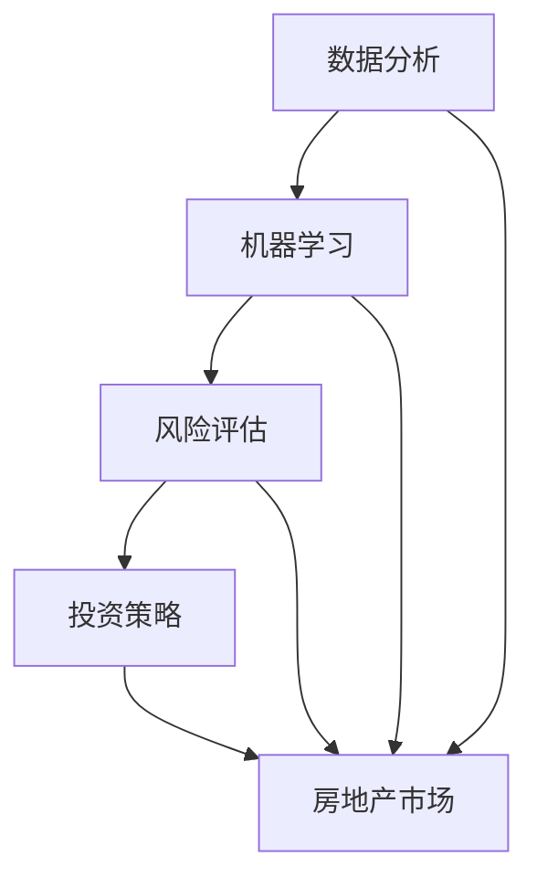

                 

关键词：技术能力、房地产投资、数据分析、机器学习、算法、风险评估、投资策略、房地产市场、技术工具

> 摘要：本文旨在探讨如何运用现代技术手段进行房地产投资。通过对数据分析和机器学习技术的应用，投资者可以更准确地评估房地产市场的风险与机会，制定科学合理的投资策略。本文将详细介绍技术工具的使用方法、实际案例以及未来应用前景。

## 1. 背景介绍

房地产投资一直是财富积累的重要途径之一。然而，房地产市场的高波动性和不确定性使得投资决策充满挑战。传统的投资方式主要依赖于市场经验和个人直觉，这种主观性方法往往无法充分考虑市场的复杂性和多变性。随着技术的不断进步，尤其是大数据和人工智能技术的应用，房地产投资的效率和准确性有了显著提升。本文将探讨如何利用技术能力，通过数据分析、机器学习等方法来提升房地产投资的决策质量。

## 2. 核心概念与联系

### 2.1 数据分析

数据分析是房地产投资的重要工具，它能够帮助投资者从大量的市场数据中提取有用信息，并进行综合分析。数据分析的流程通常包括数据收集、数据预处理、数据可视化、统计分析等步骤。

### 2.2 机器学习

机器学习是一种让计算机从数据中自动学习模式的技术。在房地产投资中，机器学习可以用于预测房价走势、识别市场机会、评估房地产的风险等。

### 2.3 风险评估

风险评估是房地产投资中的关键环节，它涉及到对市场风险、财务风险、法律风险等多方面的考量。通过技术手段，可以更全面、更精确地评估风险，从而制定出更安全稳健的投资策略。

### 2.4 投资策略

投资策略是指投资者根据市场情况和自身目标，制定的长期或短期投资计划。利用技术手段，可以更准确地判断市场趋势，优化投资组合，提高收益。

### 2.5 房地产市场

房地产市场是一个复杂的生态系统，受到政策、经济、社会等多方面因素的影响。了解房地产市场的运行机制，对于运用技术手段进行投资至关重要。

### 2.6 Mermaid 流程图

以下是一个简单的 Mermaid 流程图，展示了房地产投资中技术应用的核心概念和联系：



## 3. 核心算法原理 & 具体操作步骤

### 3.1 算法原理概述

房地产投资中的核心算法主要包括市场预测算法、风险评估算法和投资组合优化算法。市场预测算法主要用于预测房价走势，常见的方法有回归分析、时间序列分析和神经网络等。风险评估算法则基于统计分析和机器学习，评估房地产项目的风险。投资组合优化算法用于在风险可控的条件下，最大化投资收益。

### 3.2 算法步骤详解

#### 3.2.1 市场预测算法

1. 数据收集：收集历史房价数据、宏观经济指标、政策文件等。
2. 数据预处理：对数据进行清洗、去噪、标准化处理。
3. 特征选择：根据业务需求选择相关性强的特征。
4. 模型训练：选择合适的预测模型进行训练。
5. 预测与评估：使用模型进行预测，评估预测结果。

#### 3.2.2 风险评估算法

1. 数据收集：收集房地产项目的各项指标，如地理位置、建筑年代、市场交易记录等。
2. 数据预处理：对数据进行清洗、去噪、标准化处理。
3. 特征工程：提取与风险相关的特征。
4. 模型训练：选择风险评估模型进行训练。
5. 风险评估：使用模型评估房地产项目的风险。

#### 3.2.3 投资组合优化算法

1. 数据收集：收集投资组合中各个项目的指标数据。
2. 数据预处理：对数据进行清洗、去噪、标准化处理。
3. 特征选择：选择与投资收益相关的特征。
4. 模型训练：选择投资组合优化模型进行训练。
5. 优化策略：根据模型输出，制定投资组合策略。

### 3.3 算法优缺点

#### 3.3.1 市场预测算法

优点：能够快速、准确地预测市场走势，帮助投资者抓住市场机会。

缺点：市场预测存在不确定性，模型可能受到数据质量和特征选择的影响。

#### 3.3.2 风险评估算法

优点：能够全面、客观地评估房地产项目的风险，提高投资决策的准确性。

缺点：风险模型可能过于复杂，对投资者要求较高。

#### 3.3.3 投资组合优化算法

优点：能够在风险可控的条件下，最大化投资收益。

缺点：优化模型可能需要大量计算资源，对硬件要求较高。

### 3.4 算法应用领域

算法在房地产投资中的应用非常广泛，包括市场预测、风险控制和投资组合优化等。此外，算法还可以应用于房地产交易、租赁市场分析、物业管理等领域。

## 4. 数学模型和公式 & 详细讲解 & 举例说明

### 4.1 数学模型构建

房地产投资中的数学模型通常包括以下几种：

1. **回归模型**：用于预测房价走势。
   $$ \text{房价} = \beta_0 + \beta_1 \text{时间} + \beta_2 \text{收入} + ... + \beta_n \text{其他因素} $$
2. **时间序列模型**：用于分析历史数据，预测未来趋势。
   $$ \text{房价}_{t+1} = f(\text{房价}_t, \text{宏观经济指标}_t) $$
3. **风险评估模型**：用于评估房地产项目的风险。
   $$ \text{风险评分} = g(\text{财务指标}_1, \text{财务指标}_2, ..., \text{财务指标}_n) $$
4. **投资组合优化模型**：用于制定投资组合策略。
   $$ \text{最优投资组合} = \arg\min V - \gamma \cdot \text{风险} $$

### 4.2 公式推导过程

以回归模型为例，假设我们有一组房价和影响因素的数据：

$$ \begin{aligned} \text{房价}_1 &= \beta_0 + \beta_1 \cdot \text{时间}_1 + \beta_2 \cdot \text{收入}_1 + ... + \beta_n \cdot \text{其他因素}_1 \\ \text{房价}_2 &= \beta_0 + \beta_1 \cdot \text{时间}_2 + \beta_2 \cdot \text{收入}_2 + ... + \beta_n \cdot \text{其他因素}_2 \end{aligned} $$

我们可以通过最小二乘法来求解模型参数：

$$ \beta = (X^T X)^{-1} X^T Y $$

其中，$X$ 是影响因素矩阵，$Y$ 是房价向量。

### 4.3 案例分析与讲解

假设我们要预测某城市的未来房价，我们收集了该城市过去五年的房价数据，包括时间、收入、人口增长率等影响因素。以下是一个简单的回归模型：

$$ \text{房价} = \beta_0 + \beta_1 \cdot \text{时间} + \beta_2 \cdot \text{收入} + \beta_3 \cdot \text{人口增长率} $$

通过最小二乘法，我们得到模型参数：

$$ \beta_0 = 1000, \beta_1 = 0.5, \beta_2 = 200, \beta_3 = 100 $$

利用这个模型，我们可以预测未来五年的房价：

$$ \begin{aligned} \text{房价}_{2023} &= 1000 + 0.5 \cdot 2023 + 200 \cdot \text{收入}_{2023} + 100 \cdot \text{人口增长率}_{2023} \\ \text{房价}_{2024} &= 1000 + 0.5 \cdot 2024 + 200 \cdot \text{收入}_{2024} + 100 \cdot \text{人口增长率}_{2024} \end{aligned} $$

通过对比预测结果和实际数据，我们可以评估模型的准确性。

## 5. 项目实践：代码实例和详细解释说明

### 5.1 开发环境搭建

为了实现房地产投资算法，我们需要搭建一个开发环境。以下是推荐的工具和软件：

- 编程语言：Python
- 数据分析库：Pandas、NumPy、Matplotlib
- 机器学习库：Scikit-learn、TensorFlow、PyTorch
- 版本控制：Git

### 5.2 源代码详细实现

以下是一个简单的房价预测代码示例：

```python
import pandas as pd
from sklearn.linear_model import LinearRegression

# 数据收集
data = pd.read_csv('house_price_data.csv')

# 数据预处理
data = data.dropna()
X = data[['time', 'income', 'population_growth']]
y = data['price']

# 模型训练
model = LinearRegression()
model.fit(X, y)

# 预测
predictions = model.predict(X)

# 结果展示
pd.DataFrame({'Actual': y, 'Predicted': predictions}).plot(kind='bar')
```

### 5.3 代码解读与分析

上述代码首先导入必要的库，然后从 CSV 文件中读取数据。接下来，对数据进行预处理，去除缺失值。然后，将数据分为特征集和目标集。使用线性回归模型进行训练，并使用训练好的模型进行预测。最后，将预测结果与实际值进行比较，展示预测结果。

### 5.4 运行结果展示

运行上述代码后，我们可以得到一个柱状图，展示实际房价和预测房价的对比。通过观察预测结果的准确性，我们可以对模型进行调整和优化。

## 6. 实际应用场景

### 6.1 市场预测

通过技术手段，投资者可以实时获取市场数据，利用机器学习算法预测房价走势，从而在市场波动中抓住机会。

### 6.2 风险评估

利用风险评估算法，投资者可以全面评估房地产项目的风险，避免投资失误。

### 6.3 投资组合优化

通过投资组合优化算法，投资者可以在风险可控的条件下，实现收益最大化。

### 6.4 未来应用展望

随着技术的不断发展，房地产投资领域的技术应用将更加广泛。未来，我们将看到更多基于人工智能和大数据的房地产投资工具和服务。

## 7. 工具和资源推荐

### 7.1 学习资源推荐

- 《Python数据分析》
- 《机器学习实战》
- 《深度学习》

### 7.2 开发工具推荐

- Jupyter Notebook
- PyCharm
- GitHub

### 7.3 相关论文推荐

- "Deep Learning for Real Estate Market Prediction"
- "Risk Assessment of Real Estate Investment Using Machine Learning"
- "Optimization of Real Estate Investment Portfolios Based on Big Data Analysis"

## 8. 总结：未来发展趋势与挑战

### 8.1 研究成果总结

本文介绍了如何利用技术手段进行房地产投资，包括数据分析、机器学习和风险评估等方面的应用。通过实际案例和代码示例，展示了技术手段在房地产投资中的巨大潜力。

### 8.2 未来发展趋势

随着人工智能和大数据技术的不断发展，房地产投资领域将迎来更多技术创新和应用。未来的发展趋势包括更加智能化的市场预测、风险评估和投资组合优化等。

### 8.3 面临的挑战

尽管技术手段在房地产投资中具有巨大潜力，但同时也面临着数据质量、算法可靠性和计算资源等方面的挑战。未来，我们需要不断优化算法、提高数据质量，以应对这些挑战。

### 8.4 研究展望

在房地产投资领域，技术手段的应用前景非常广阔。未来，我们将看到更多基于人工智能和大数据的创新，为投资者提供更加精准、高效的投资决策支持。

## 9. 附录：常见问题与解答

### 9.1 问题1

**如何处理缺失数据？**

**解答：** 我们可以使用填充缺失值的方法，如平均值填充、中值填充或插值法等。此外，还可以使用模型预测缺失值，如线性回归模型或神经网络模型。

### 9.2 问题2

**如何选择合适的特征？**

**解答：** 我们可以通过特征选择技术，如特征重要性评估、相关性分析或主成分分析等，来选择与目标变量高度相关的特征。

### 9.3 问题3

**如何评估模型性能？**

**解答：** 我们可以使用各种评估指标，如均方误差、决定系数、准确率、召回率等，来评估模型性能。此外，还可以使用交叉验证方法来评估模型的泛化能力。

----------------------------------------------------------------

以上便是如何利用技术能力进行房地产投资的详细解析。通过数据分析、机器学习和风险评估等技术手段，投资者可以更科学地制定投资策略，提高投资收益。希望本文对您在房地产投资领域的技术应用有所启发和帮助。

### 作者署名

作者：禅与计算机程序设计艺术 / Zen and the Art of Computer Programming
----------------------------------------------------------------

