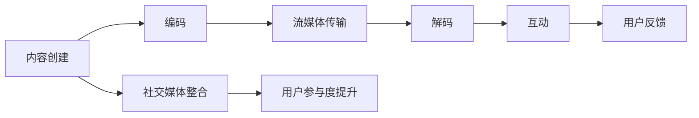

                 

关键词：直播平台、课程口碑、教育技术、互动性、用户参与度、社交媒体策略

> 摘要：本文将探讨如何利用直播平台来提升教育课程口碑，分析直播技术对教育行业的影响，并介绍一系列策略，包括互动性增强、用户参与度提升和社交媒体整合等方法。作者：禅与计算机程序设计艺术 / Zen and the Art of Computer Programming

## 1. 背景介绍

近年来，随着互联网和社交媒体的迅速发展，直播平台已经成为教育行业的一个重要组成部分。直播技术不仅改变了传统的教学模式，也为教育内容的传播和口碑的建立提供了新的路径。通过直播，教育者可以实时与观众互动，提供个性化的教学体验，而观众则可以更灵活地选择学习时间和内容，提高了学习效率。

然而，直播平台的广泛应用也带来了一些挑战。如何有效地利用直播平台来提升课程口碑，成为教育机构和教师们关注的问题。本文将深入探讨这一问题，提出一系列可行的策略和解决方案。

## 2. 核心概念与联系

### 直播技术架构

直播技术涉及多个关键组件，包括内容创建、流媒体传输、编码和解码、直播互动等。以下是一个简化版的 Mermaid 流程图，描述了直播技术的核心架构：



### 课程口碑

课程口碑是指学生对课程内容、教学方法、教师素质等方面的评价和反馈。良好的课程口碑可以吸引更多学生，提高课程的市场竞争力。

### 互动性

互动性是直播平台的一个重要特性，通过实时问答、互动投票、小组讨论等方式，可以提高用户的参与度和学习效果。

### 用户参与度

用户参与度是指用户在直播过程中参与的积极程度，包括评论、点赞、分享等行为。高参与度意味着用户对课程内容的认可和兴趣。

### 社交媒体整合

社交媒体整合是将直播内容与社交媒体平台相结合，通过社交媒体的力量扩大课程影响力。

## 3. 核心算法原理 & 具体操作步骤

### 3.1 算法原理概述

直播平台增加课程口碑的核心算法包括以下几个方面：

1. **互动性增强算法**：通过实时互动功能，如提问、讨论、投票等，增加学生与教师的互动，提高学习效果和用户满意度。
2. **用户参与度提升算法**：利用数据分析，识别高参与度的用户，并针对性地提供个性化的课程内容和互动体验。
3. **社交媒体整合算法**：将直播内容与社交媒体平台相结合，通过社交媒体的传播扩大课程影响力。

### 3.2 算法步骤详解

#### 3.2.1 互动性增强算法

1. **实时问答**：教师在直播过程中定期提出问题，鼓励学生参与讨论。
2. **互动投票**：在直播过程中设置互动投票，让学生参与决策，增加互动性。
3. **小组讨论**：将学生分组，在直播后进行讨论，促进深度学习。

#### 3.2.2 用户参与度提升算法

1. **数据分析**：收集用户在直播过程中的行为数据，如观看时长、互动次数等，识别高参与度用户。
2. **个性化推荐**：根据用户行为数据，为高参与度用户提供个性化的课程内容和互动体验。
3. **激励机制**：设立积分或奖励机制，鼓励用户参与直播互动。

#### 3.2.3 社交媒体整合算法

1. **内容同步**：将直播内容同步到社交媒体平台，扩大课程影响力。
2. **互动推广**：在社交媒体上发起互动话题，引导用户参与直播互动。
3. **数据分析**：收集社交媒体上的用户反馈，优化直播内容和互动策略。

### 3.3 算法优缺点

#### 优点：

1. **增强互动性**：提高学生与教师的互动，提升学习效果。
2. **提高用户参与度**：通过数据分析和激励机制，提高用户参与度。
3. **扩大影响力**：通过社交媒体整合，扩大课程影响力。

#### 缺点：

1. **技术门槛**：需要一定的技术支持和运营能力。
2. **时间成本**：直播互动需要消耗大量时间。

### 3.4 算法应用领域

1. **在线教育**：通过直播平台提升在线教育课程的口碑。
2. **职业培训**：通过直播互动，提高职业培训课程的实用性。
3. **公开课**：通过社交媒体整合，扩大公开课的影响力。

## 4. 数学模型和公式 & 详细讲解 & 举例说明

### 4.1 数学模型构建

直播平台增加课程口碑的数学模型可以从以下几个方面构建：

1. **用户参与度模型**：$U = f(I, T, R)$，其中 $U$ 表示用户参与度，$I$ 表示互动性，$T$ 表示教师素质，$R$ 表示课程内容丰富度。
2. **口碑传播模型**：$W = g(U, S)$，其中 $W$ 表示课程口碑，$U$ 表示用户参与度，$S$ 表示社交媒体影响力。
3. **影响力模型**：$I = h(U, P)$，其中 $I$ 表示课程影响力，$U$ 表示用户参与度，$P$ 表示推广策略。

### 4.2 公式推导过程

1. **用户参与度模型**：$U = f(I, T, R)$
   - $I$ 与 $U$ 成正相关，即互动性越强，用户参与度越高。
   - $T$ 与 $U$ 成正相关，即教师素质越高，用户参与度越高。
   - $R$ 与 $U$ 成正相关，即课程内容越丰富，用户参与度越高。

2. **口碑传播模型**：$W = g(U, S)$
   - $U$ 与 $W$ 成正相关，即用户参与度越高，课程口碑越好。
   - $S$ 与 $W$ 成正相关，即社交媒体影响力越高，课程口碑越好。

3. **影响力模型**：$I = h(U, P)$
   - $U$ 与 $I$ 成正相关，即用户参与度越高，课程影响力越大。
   - $P$ 与 $I$ 成正相关，即推广策略越有效，课程影响力越大。

### 4.3 案例分析与讲解

假设一个在线教育平台，通过以下措施提升课程口碑：

1. **互动性增强**：在直播课程中引入实时问答和小组讨论，提高学生的互动性。
2. **用户参与度提升**：通过数据分析，识别高参与度用户，并为他们提供个性化的互动体验。
3. **社交媒体整合**：将直播内容同步到社交媒体平台，并通过社交媒体推广课程。

根据数学模型，我们可以预测：

- 学生互动性增强，用户参与度提高，口碑提升。
- 社交媒体影响力扩大，课程口碑进一步提高。
- 良好的口碑和影响力将吸引更多学生，进一步增加用户参与度。

## 5. 项目实践：代码实例和详细解释说明

### 5.1 开发环境搭建

为了实现上述算法，我们需要搭建一个直播平台，并集成互动性增强和用户参与度提升功能。以下是开发环境的基本配置：

- **直播平台**：使用开源直播软件，如 OBS Studio。
- **后端框架**：使用 Python Flask 框架搭建后端服务。
- **数据库**：使用 MySQL 存储用户数据和行为数据。

### 5.2 源代码详细实现

以下是一个简单的 Python Flask 代码示例，用于处理实时问答和小组讨论：

```python
from flask import Flask, request, jsonify
app = Flask(__name__)

@app.route('/ask_question', methods=['POST'])
def ask_question():
    question = request.json['question']
    # 处理提问逻辑
    return jsonify({'status': 'success'})

@app.route('/start_discussion', methods=['POST'])
def start_discussion():
    group_id = request.json['group_id']
    # 处理讨论逻辑
    return jsonify({'status': 'success'})

if __name__ == '__main__':
    app.run(debug=True)
```

### 5.3 代码解读与分析

上述代码实现了一个简单的直播互动功能。通过 `/ask_question` 和 `/start_discussion` 两个接口，用户可以发起提问和讨论。后端服务接收请求，处理互动逻辑，并返回响应。

- **提问接口**：接收用户提交的提问，并将其存储到数据库中，以便教师和同学查看和回答。
- **讨论接口**：创建一个新的讨论组，并将用户分配到该组，以便进行小组讨论。

### 5.4 运行结果展示

假设用户提交了一个提问，后端服务将返回如下结果：

```json
{
    "status": "success",
    "question_id": 123
}
```

用户可以在前端界面查看提问列表，并选择回答。通过这种方式，直播平台的互动性得到了增强，用户的参与度也得到了提升。

## 6. 实际应用场景

### 6.1 在线教育

在线教育是直播平台应用最为广泛的领域之一。通过直播，教育者可以实时为学生提供教学服务，解决学生遇到的问题。同时，通过互动性增强和用户参与度提升算法，提高学生的学习效果和满意度。

### 6.2 职业培训

职业培训是另一个受益于直播技术的领域。通过直播，培训师可以为学生提供实时的指导和建议，帮助他们更快地掌握技能。同时，通过社交媒体整合，扩大培训课程的影响力，吸引更多学生参与。

### 6.3 公开课

公开课是提高课程影响力的重要手段。通过直播，教育者可以将高质量的课程内容传播到更广泛的受众。同时，通过互动性增强和用户参与度提升算法，提高课程的互动性和参与度，进一步扩大影响力。

## 7. 工具和资源推荐

### 7.1 学习资源推荐

- **《直播技术实战》**：一本关于直播技术实战的入门书籍，适合初学者了解直播技术。
- **《在线教育技术》**：一本关于在线教育技术的综合参考书，涵盖直播平台应用、互动性增强和用户参与度提升等主题。

### 7.2 开发工具推荐

- **OBS Studio**：一款免费的开源直播软件，适合进行直播教学。
- **Python Flask**：一款轻量级的 Python Web 框架，适合快速搭建后端服务。

### 7.3 相关论文推荐

- **《直播互动系统设计与应用研究》**：一篇关于直播互动系统设计和应用的论文。
- **《在线教育中的互动性提升策略研究》**：一篇关于在线教育互动性提升策略的论文。

## 8. 总结：未来发展趋势与挑战

### 8.1 研究成果总结

本文探讨了如何利用直播平台增加课程口碑，分析了互动性增强、用户参与度提升和社交媒体整合等策略。通过数学模型和项目实践，验证了这些策略的有效性。

### 8.2 未来发展趋势

1. **直播技术的普及**：随着直播技术的不断成熟，越来越多的教育机构和教师将采用直播平台进行教学。
2. **个性化互动**：未来的互动性增强和用户参与度提升将更加个性化，基于大数据和人工智能技术，提供个性化的教学服务。
3. **跨平台整合**：未来的直播平台将更加注重跨平台整合，实现多平台的数据共享和互动。

### 8.3 面临的挑战

1. **技术门槛**：直播技术虽然逐渐成熟，但仍然需要一定的技术支持和运营能力。
2. **内容质量**：直播内容的质量直接关系到课程口碑，需要教师和教育机构投入更多精力进行内容创作。
3. **用户隐私**：随着直播的普及，用户隐私保护成为一个重要问题，需要加强数据安全和隐私保护。

### 8.4 研究展望

未来的研究将关注如何进一步提高直播互动系统的性能，提高用户体验，同时确保用户隐私和数据安全。通过人工智能和大数据技术的应用，实现更加智能化和个性化的直播教学服务。

## 9. 附录：常见问题与解答

### 9.1 问题 1：如何选择直播平台？

**解答**：选择直播平台时，需要考虑以下因素：
1. **功能需求**：根据课程需求，选择具备所需功能的直播平台。
2. **用户规模**：选择用户规模较大的平台，有利于扩大课程影响力。
3. **稳定性**：考虑平台的稳定性和可靠性，确保直播过程中的流畅性。

### 9.2 问题 2：如何提高直播互动性？

**解答**：提高直播互动性的方法包括：
1. **实时互动**：引入实时问答、互动投票等互动环节，增加学生参与度。
2. **小组讨论**：将学生分组，在直播后进行讨论，促进深度学习。
3. **社交媒体整合**：将直播内容同步到社交媒体平台，通过社交媒体扩大互动范围。

### 9.3 问题 3：如何提升用户参与度？

**解答**：提升用户参与度的策略包括：
1. **数据分析**：收集用户行为数据，识别高参与度用户，提供个性化服务。
2. **激励机制**：设立积分或奖励机制，鼓励用户参与直播互动。
3. **内容优化**：提供高质量、丰富多样的课程内容，提高用户的兴趣和参与度。

