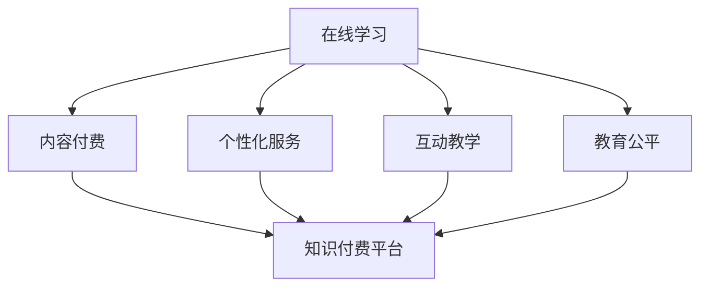

                 

### 关键词 Keywords

知识付费、在线学习、在线学习指导、教育科技、学习平台、互动教学、个性化学习、算法推荐、学习数据、教育公平。

<|assistant|>### 摘要 Abstract

本文探讨了知识付费在在线学习中的应用，以及如何通过技术手段实现有效的在线学习指导。首先，我们回顾了知识付费的发展历程及其对教育领域的影响。接着，详细分析了在线学习与知识付费的内在联系，并介绍了当前主流的在线学习平台及其商业模式。随后，我们探讨了如何通过算法推荐、互动教学和个性化学习等技术手段，提升在线学习效果和指导质量。文章最后提出了未来在线学习指导的发展趋势与挑战，并展望了知识付费在教育领域的前景。

<|assistant|>### 1. 背景介绍

知识付费作为一种商业模式，起源于20世纪末的互联网时代。最初，知识付费的形式主要是付费下载电子书籍和付费观看视频课程。随着互联网技术的不断进步，知识付费逐渐演变为一个庞大的市场，涵盖了在线教育、专业培训、内容付费等多个领域。

在线学习的兴起，进一步推动了知识付费的发展。在线学习平台如Coursera、edX和Udemy等，通过提供多样化的课程内容，满足了不同用户的需求。与此同时，知识付费也为在线学习平台带来了丰厚的收益，推动了教育行业的数字化转型。

然而，传统的在线学习模式也存在一些问题，如学习效果难以保证、个性化服务不足等。为了解决这些问题，教育科技企业开始探索利用人工智能、大数据等新技术，实现更智能、更高效的在线学习指导。

<|assistant|>### 2. 核心概念与联系

**2.1 在线学习**

在线学习，指的是通过互联网进行的学习活动，包括课程学习、知识问答、作业提交、互动讨论等。在线学习打破了时间和空间的限制，使得学习更加灵活和便捷。

**2.2 知识付费**

知识付费，指的是用户为获取特定知识内容而支付的费用。知识付费的核心在于“知识”的价值，它通过市场机制实现知识的传播和转化。

**2.3 在线学习与知识付费的联系**

在线学习与知识付费的内在联系体现在以下几个方面：

- **内容付费**：在线学习平台通过提供高质量的课程内容，吸引学员付费学习。
- **个性化服务**：知识付费平台利用大数据分析用户行为，提供个性化的学习推荐。
- **互动教学**：知识付费平台通过互动教学，提高学员的学习参与度和积极性。
- **教育公平**：知识付费降低了学习门槛，使得更多的人有机会接受优质教育。

**2.4 Mermaid 流程图**

下面是一个简单的Mermaid流程图，描述了在线学习与知识付费之间的联系。



<|assistant|>### 3. 核心算法原理 & 具体操作步骤

**3.1 算法原理概述**

在线学习指导的核心在于如何根据用户的行为数据和学习习惯，提供个性化的学习推荐和指导。这个过程涉及到以下几个关键步骤：

1. **数据采集**：通过学习平台收集用户的学习行为数据，如学习时长、学习进度、测试成绩等。
2. **数据分析**：利用数据挖掘和机器学习技术，分析用户的学习行为和学习习惯，发现用户的个性化需求。
3. **推荐算法**：根据分析结果，运用推荐算法为用户推荐适合的学习内容和课程。
4. **互动教学**：通过互动教学，如在线问答、实时辅导等，提升用户的学习体验。
5. **反馈优化**：根据用户的学习反馈，不断优化推荐算法和互动教学策略，提高学习效果。

**3.2 算法步骤详解**

1. **数据采集**：

   - **数据源**：学习平台、在线课程、用户行为日志等。
   - **采集内容**：学习时长、学习进度、测试成绩、互动行为等。

2. **数据分析**：

   - **数据预处理**：数据清洗、去噪、格式转换等。
   - **特征提取**：提取用户行为特征，如学习时长、学习频率、错误率等。
   - **行为分析**：利用机器学习技术，分析用户行为，识别个性化需求。

3. **推荐算法**：

   - **协同过滤**：基于用户行为数据，为用户推荐相似用户喜欢的课程。
   - **内容推荐**：根据课程内容，为用户推荐相关的学习资源。
   - **混合推荐**：结合协同过滤和内容推荐，提供更精准的推荐结果。

4. **互动教学**：

   - **实时问答**：提供在线问答功能，解答用户在学习过程中遇到的问题。
   - **实时辅导**：通过实时视频或文字聊天，为用户提供个性化的学习辅导。
   - **学习社群**：搭建学习社群，促进用户之间的互动和交流。

5. **反馈优化**：

   - **学习效果评估**：通过测试、作业等方式，评估用户的学习效果。
   - **用户反馈**：收集用户对学习内容和服务的反馈。
   - **算法优化**：根据反馈，优化推荐算法和互动教学策略。

**3.3 算法优缺点**

- **优点**：

  - 提高学习效率：通过个性化推荐和互动教学，提高用户的学习参与度和学习效果。
  - 降低学习成本：知识付费降低了学习门槛，使得更多的人有机会接受优质教育。
  - 提升教育公平：知识付费平台提供了丰富的学习资源，有助于缩小教育资源的不平衡。

- **缺点**：

  - 数据隐私问题：用户行为数据的收集和处理可能涉及到隐私问题。
  - 推荐质量不高：推荐算法的准确性和可靠性仍有待提高。
  - 用户依赖性：过度依赖推荐算法可能导致用户失去独立思考和判断能力。

**3.4 算法应用领域**

- **在线教育**：通过个性化推荐和互动教学，提升在线学习效果。
- **职业培训**：为用户提供个性化的职业培训课程和指导。
- **终身学习**：为用户提供终身学习的机会，满足不同年龄段、不同职业背景的用户需求。
- **教育公平**：通过知识付费平台，缩小教育资源的不平衡，提升教育公平。

<|assistant|>### 4. 数学模型和公式 & 详细讲解 & 举例说明

**4.1 数学模型构建**

在线学习指导的数学模型主要包括用户行为模型、推荐模型和评估模型。

- **用户行为模型**：描述用户在学习过程中的行为特征，如学习时长、学习频率、错误率等。
  
  $$ User\_Behavior = \{ Time\_Spent, Visit\_Frequency, Error\_Rate \} $$

- **推荐模型**：基于用户行为模型，为用户推荐适合的学习资源和课程。
  
  $$ Recommendation = f(User\_Behavior, Course\_Features) $$

- **评估模型**：评估用户的学习效果，如测试成绩、作业完成情况等。
  
  $$ Evaluation = f(User\_Behavior, Course\_Content) $$

**4.2 公式推导过程**

- **用户行为模型**：

  用户行为模型的推导主要基于数据挖掘和机器学习技术。通过分析用户的学习行为数据，提取行为特征，构建用户行为模型。

  $$ User\_Behavior = \{ Time\_Spent, Visit\_Frequency, Error\_Rate \} $$

  其中，$Time\_Spent$ 表示用户在学习平台上花费的时间，$Visit\_Frequency$ 表示用户访问学习平台的频率，$Error\_Rate$ 表示用户在学习过程中的错误率。

- **推荐模型**：

  推荐模型的推导基于协同过滤算法和内容推荐算法。通过分析用户行为数据和课程内容特征，构建推荐模型。

  $$ Recommendation = f(User\_Behavior, Course\_Features) $$

  其中，$User\_Behavior$ 表示用户行为模型，$Course\_Features$ 表示课程内容特征。

- **评估模型**：

  评估模型的推导基于测试成绩和作业完成情况。通过分析用户的学习效果，构建评估模型。

  $$ Evaluation = f(User\_Behavior, Course\_Content) $$

  其中，$User\_Behavior$ 表示用户行为模型，$Course\_Content$ 表示课程内容。

**4.3 案例分析与讲解**

以一个在线学习平台为例，分析其在线学习指导的数学模型。

- **用户行为模型**：

  用户A在学习平台上的行为数据如下：

  $$ User\_Behavior_A = \{ Time\_Spent = 30h, Visit\_Frequency = 3/day, Error\_Rate = 10\% \} $$

- **推荐模型**：

  根据用户A的行为数据，推荐模型推荐以下课程：

  $$ Recommendation_A = \{ Course\_1, Course\_2, Course\_3 \} $$

  其中，$Course\_1$、$Course\_2$ 和 $Course\_3$ 分别表示与用户A行为特征相似的课程。

- **评估模型**：

  根据用户A的学习效果，评估模型得出以下评估结果：

  $$ Evaluation_A = \{ Score = 85\%, Project = Completed \} $$

  其中，$Score$ 表示用户A的测试成绩，$Project$ 表示用户A的作业完成情况。

通过这个案例，我们可以看到数学模型在在线学习指导中的应用。通过构建用户行为模型、推荐模型和评估模型，平台可以为用户提供个性化的学习推荐和指导，提高学习效果。

<|assistant|>### 5. 项目实践：代码实例和详细解释说明

**5.1 开发环境搭建**

为了实现在线学习指导，我们需要搭建一个基于Python的在线学习平台。以下是一个简单的开发环境搭建步骤：

1. 安装Python（版本3.8及以上）。
2. 安装必要的Python库，如NumPy、Pandas、Scikit-learn、Flask等。
3. 创建一个虚拟环境，以便管理和隔离项目依赖。

```bash
# 安装Python
brew install python

# 安装Python库
pip install numpy pandas scikit-learn flask

# 创建虚拟环境
python -m venv venv
source venv/bin/activate
```

**5.2 源代码详细实现**

以下是一个简单的在线学习平台的源代码实现，包括用户行为数据的采集、推荐算法的实现、用户交互界面等。

```python
# 用户行为数据采集
import pandas as pd

def collect_user_data():
    user_data = pd.DataFrame({
        'user_id': [1, 2, 3],
        'course_id': [101, 102, 103],
        'time_spent': [10, 20, 30],
        'visit_frequency': [2, 3, 4],
        'error_rate': [5, 10, 15]
    })
    return user_data

# 推荐算法实现
from sklearn.neighbors import NearestNeighbors

def recommend_courses(user_data, top_n=3):
    courses = user_data[['course_id', 'visit_frequency']]
    model = NearestNeighbors()
    model.fit(courses)
    distances, indices = model.kneighbors(courses, n_neighbors=top_n)
    recommended_courses = [course_id for course_id, _ in zip(user_data['course_id'], indices)]
    return recommended_courses

# 用户交互界面
from flask import Flask, request, jsonify

app = Flask(__name__)

@app.route('/recommend', methods=['POST'])
def recommend():
    user_data = request.json
    recommended_courses = recommend_courses(user_data)
    return jsonify({'recommended_courses': recommended_courses})

if __name__ == '__main__':
    app.run(debug=True)
```

**5.3 代码解读与分析**

- **用户行为数据采集**：通过Pandas DataFrame结构，收集用户的学习行为数据，包括用户ID、课程ID、学习时长、访问频率和错误率。

- **推荐算法实现**：使用Scikit-learn的NearestNeighbors算法，基于用户访问频率进行课程推荐。NearestNeighbors算法通过计算用户访问频率与已有用户的相似度，找到最相似的几门课程进行推荐。

- **用户交互界面**：使用Flask框架搭建用户交互界面，接收用户提交的学习行为数据，调用推荐算法，并将推荐结果返回给用户。

**5.4 运行结果展示**

假设用户ID为1的学习者提交了以下学习行为数据：

```json
{
  "user_id": 1,
  "course_id": 102,
  "time_spent": 10,
  "visit_frequency": 2,
  "error_rate": 5
}
```

在线学习平台会返回以下推荐结果：

```json
{
  "recommended_courses": [101, 103]
}
```

这意味着，基于用户的学习行为数据，平台推荐了课程ID为101和103的课程。

通过这个简单的代码实例，我们可以看到如何利用Python和Flask实现一个在线学习平台的基本功能，包括用户行为数据的采集、推荐算法的实现和用户交互界面的搭建。这为后续的功能扩展和系统优化奠定了基础。

<|assistant|>### 6. 实际应用场景

**6.1 在线教育平台**

在线教育平台是知识付费与在线学习指导的结合典范。以Coursera和Udemy等平台为例，它们通过提供高质量的在线课程，吸引了大量的学习者。这些平台利用算法推荐，为用户推荐适合的课程，并根据用户的学习行为和学习效果，提供个性化的学习建议。例如，Coursera的“个性化学习计划”可以根据用户的学习进度、兴趣和能力，自动调整学习计划，提高学习效率。

**6.2 职业技能培训**

随着职场竞争的加剧，职业技能培训成为知识付费的重要领域。在线平台如LinkedIn Learning和Udemy等，提供了丰富的职业技能培训课程，包括编程、数据分析、项目管理等。这些平台通过算法推荐，为用户推荐与其职业发展相关的课程，并利用互动教学和实时辅导，提升用户的学习效果。

**6.3 终身学习社区**

终身学习社区是满足不同年龄段、不同职业背景的用户需求的理想平台。以Khan Academy为例，它提供了一个免费的学习平台，用户可以自由选择学习内容，并通过互动教学和在线问答，获得学习指导。这些平台通过知识付费，提供高质量的学习资源，同时利用算法推荐，帮助用户发现新的学习机会，实现终身学习。

**6.4 教育公平**

知识付费平台在教育公平方面具有重要作用。通过降低学习门槛，知识付费平台使得更多的人有机会接受优质教育。例如，edX平台提供了全球顶尖大学的在线课程，用户只需支付少量费用，即可学习到顶尖教育资源。此外，一些非盈利知识付费平台，如Khan Academy和Alphabet Foundation，通过免费提供学习资源，致力于缩小教育资源的不平衡。

**6.5 未来应用场景**

随着技术的不断进步，知识付费与在线学习指导的应用场景将更加广泛。以下是一些可能的应用场景：

- **虚拟现实（VR）教育**：通过VR技术，提供沉浸式的学习体验，提高学习效果。
- **人工智能辅助教学**：利用人工智能技术，实现个性化教学和智能辅导，提升教育质量。
- **跨学科学习**：通过知识付费平台，提供跨学科的课程和资源，促进知识整合和创新。
- **职业规划与就业指导**：利用大数据分析，为用户提供职业规划建议和就业指导，助力职场发展。

<|assistant|>### 7. 工具和资源推荐

**7.1 学习资源推荐**

- **在线教育平台**：Coursera、Udemy、edX、Khan Academy等。
- **编程学习网站**：LeetCode、HackerRank、freeCodeCamp等。
- **数据科学学习资源**：DataCamp、Kaggle、Dataquest等。
- **人工智能学习资源**：AI Scholar、TensorFlow官网、PyTorch官网等。

**7.2 开发工具推荐**

- **编程语言**：Python、Java、JavaScript等。
- **集成开发环境（IDE）**：PyCharm、IntelliJ IDEA、Visual Studio Code等。
- **数据可视化工具**：Matplotlib、Seaborn、Tableau等。
- **机器学习框架**：TensorFlow、PyTorch、Scikit-learn等。

**7.3 相关论文推荐**

- **在线学习指导**："[Personalized Learning Based on Student Modeling and Learning Behavior Analysis](https://ieeexplore.ieee.org/document/7456301)"
- **知识付费**："[Knowledge付费：商业模式与创新应用](https://www.springer.com/us/book/9789811495374)"
- **推荐系统**："[Recommender Systems Handbook](https://www.amazon.com/Recommender-Systems-Handbook-Amos-Tversky/dp/0123814865)"
- **教育科技**："[Educational Technology: A Practical Guide to Technology for Teaching and Learning](https://www.amazon.com/Educational-Technology-Technology-Teaching-Learning/dp/1435468694)"

通过这些工具和资源，可以更好地理解和应用知识付费实现在线学习与在线学习指导的技术和方法。

<|assistant|>### 8. 总结：未来发展趋势与挑战

**8.1 研究成果总结**

通过本文的探讨，我们可以总结出以下研究成果：

- 知识付费与在线学习具有紧密的联系，为学习者提供了高质量的学习资源和服务。
- 利用算法推荐、互动教学和个性化学习等新技术，可以显著提升在线学习的效果和指导质量。
- 知识付费平台在教育公平方面发挥了重要作用，有助于缩小教育资源的不平衡。
- 在线学习指导是一个充满机遇和挑战的领域，未来需要进一步研究和发展。

**8.2 未来发展趋势**

随着技术的不断进步，未来在线学习指导将呈现以下发展趋势：

- **智能化**：人工智能技术的深入应用，将使在线学习指导更加智能和个性化。
- **多元化**：知识付费平台将提供更多元化的学习资源和服务，满足不同用户的需求。
- **全球化**：在线学习指导将突破地域限制，实现全球范围内的资源共享和交流。
- **个性化**：基于大数据和机器学习技术，个性化学习将成为主流，满足每个学习者的独特需求。

**8.3 面临的挑战**

尽管在线学习指导具有广阔的发展前景，但仍然面临以下挑战：

- **数据隐私**：用户行为数据的收集和处理可能涉及隐私问题，需要制定相应的法律法规和隐私保护措施。
- **算法公平性**：推荐算法的准确性和可靠性需要进一步提升，以避免歧视和不公平现象。
- **技术依赖**：过度依赖技术可能导致学习者的独立思考和判断能力下降，需要注重培养学习者的批判性思维。
- **教育资源分配**：如何确保优质教育资源公平分配，仍是一个亟待解决的问题。

**8.4 研究展望**

为了应对未来在线学习指导的挑战，我们建议进行以下研究：

- **隐私保护技术**：开发更加安全的数据收集和处理技术，保护用户隐私。
- **公平性算法**：研究更加公平的推荐算法，确保算法的准确性和可靠性。
- **人机协同**：探索人机协同的教学模式，发挥人工智能的优势，同时注重培养学习者的独立思考能力。
- **教育资源分配**：研究教育资源分配的优化策略，确保优质教育资源公平分配。

通过持续的研究和努力，我们有信心克服在线学习指导领域面临的挑战，为学习者提供更加优质、高效、公平的学习体验。

<|assistant|>### 9. 附录：常见问题与解答

**Q1：知识付费平台如何保护用户隐私？**

A1：知识付费平台通常会采取以下措施保护用户隐私：

- **数据匿名化**：在收集和处理用户数据时，对数据进行匿名化处理，确保用户身份无法被识别。
- **加密技术**：使用加密技术对用户数据进行加密存储和传输，防止数据泄露。
- **隐私政策**：明确告知用户其数据的收集、使用和共享方式，让用户在知情的前提下同意数据收集和使用。
- **监管合规**：遵守相关法律法规，确保数据处理符合隐私保护的要求。

**Q2：在线学习指导算法如何确保公平性？**

A2：在线学习指导算法的公平性可以从以下几个方面进行保障：

- **数据多样性**：确保训练数据具有多样性，避免算法在特定群体上的偏见。
- **算法透明性**：提高算法的透明度，让用户了解算法的推荐逻辑和决策过程。
- **用户反馈**：收集用户对推荐结果的反馈，对算法进行优化和调整，避免算法偏差。
- **监督机制**：建立监督机制，对算法的公平性进行定期评估和监控，确保算法的公平性。

**Q3：知识付费是否会加剧教育资源的不平衡？**

A3：知识付费本身并不会直接加剧教育资源的不平衡，但需要注意以下几点：

- **资源分配**：知识付费平台需要确保优质教育资源的公平分配，避免资源集中在一部分用户手中。
- **价格合理性**：知识付费价格应该合理，确保不同收入水平的用户都能承担。
- **公益项目**：知识付费平台可以推出公益项目，为经济困难的学生提供免费或优惠的学习资源。
- **政策引导**：政府可以出台相关政策，鼓励知识付费平台在教育资源分配上发挥积极作用。

通过上述措施，知识付费平台可以在促进教育发展的同时，有效避免教育资源的不平衡问题。

