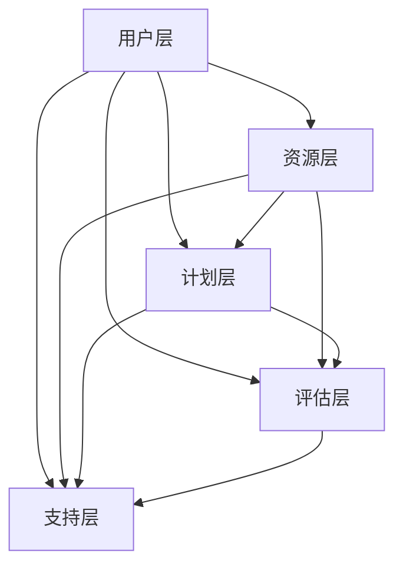
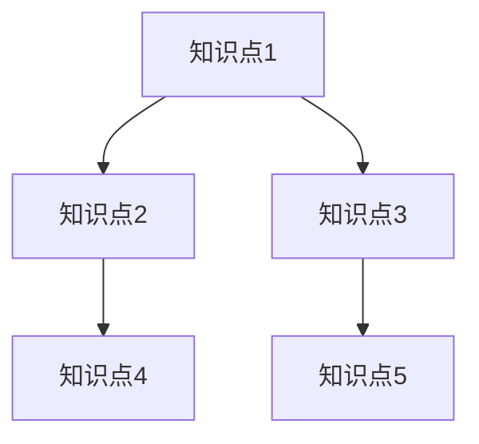

                 

 在数字时代，在线学习已经成为人们获取知识的重要途径。然而，如何有效地利用知识付费平台实现在线学习与在线学习指导，确保学习效果和用户体验的提升，是一个值得深入探讨的话题。本文将围绕这一主题，从核心概念、算法原理、数学模型、项目实践、实际应用等多个角度，为您详细解析如何实现这一目标。

## 关键词

- **知识付费**
- **在线学习**
- **在线学习指导**
- **用户体验**
- **学习效果**
- **算法优化**
- **数学模型**
- **实践应用**

## 摘要

本文首先介绍了知识付费和在线学习的背景及其重要性。接着，深入探讨了在线学习指导的核心概念和架构，并使用Mermaid流程图进行了详细说明。随后，我们介绍了核心算法原理、数学模型以及具体操作步骤，并通过一个实际项目案例进行了代码实例和详细解释。文章的最后部分，我们分析了知识付费实现在线学习与在线学习指导的实际应用场景，并对未来进行了展望。

### 1. 背景介绍

在互联网高速发展的今天，知识付费作为一种新兴的商业模式，已经渗透到人们生活的方方面面。知识付费平台通过提供专业的课程、专家指导、学习资源等，满足了用户多样化的学习需求。与此同时，在线学习作为知识付费的重要组成部分，也逐渐成为人们获取新知识的重要途径。

在线学习具有灵活、便捷、个性化等特点，用户可以根据自己的时间和兴趣选择学习内容。然而，在线学习也面临着一些挑战，如学习效果难以评估、学习动力不足等问题。为了解决这些问题，在线学习指导应运而生。通过在线学习指导，用户不仅能够获得专业的学习建议，还能在遇到学习难题时得到及时的帮助，从而提高学习效果和用户体验。

### 2. 核心概念与联系

#### 2.1 在线学习指导的概念

在线学习指导是一种基于互联网的学习辅助服务，旨在帮助用户更好地完成在线学习过程。它通常包括以下核心组成部分：

- **学习资源**：包括课程、电子书籍、视频教程、学术论文等。
- **学习计划**：根据用户的学习需求和进度，制定个性化的学习计划。
- **学习评估**：对用户的学习成果进行评估，以了解其掌握程度。
- **学习支持**：在用户遇到学习难题时提供帮助，如在线答疑、辅导等。

#### 2.2 在线学习指导的架构

在线学习指导的架构主要包括以下几个层次：

1. **用户层**：用户通过注册账号，登录平台，浏览课程，进行学习。
2. **资源层**：包括各种学习资源，如课程、书籍、视频等。
3. **计划层**：根据用户的需求和进度，为用户制定个性化的学习计划。
4. **评估层**：对用户的学习成果进行评估，以了解其掌握程度。
5. **支持层**：为用户提供学习支持，如在线答疑、辅导等。

下面是一个简单的Mermaid流程图，展示了在线学习指导的核心架构：



### 3. 核心算法原理 & 具体操作步骤

#### 3.1 算法原理概述

在线学习指导的核心算法主要包括学习计划生成算法、学习评估算法和学习支持算法。这些算法通过分析用户的学习行为、学习需求和学习成果，为用户提供个性化的学习服务。

- **学习计划生成算法**：基于用户的学习需求、进度和偏好，生成个性化的学习计划。
- **学习评估算法**：通过评估用户的学习成果，为用户提供学习反馈。
- **学习支持算法**：根据用户的学习需求和困难，提供针对性的学习支持。

#### 3.2 算法步骤详解

1. **学习计划生成算法**

   学习计划生成算法的主要步骤如下：

   - 数据收集：收集用户的学习行为数据，如学习时间、学习内容、学习进度等。
   - 数据预处理：对收集到的数据进行清洗和预处理，以去除噪声和异常值。
   - 特征提取：提取用户学习行为的关键特征，如学习时长、学习频率等。
   - 计划生成：根据用户的学习需求和特征，生成个性化的学习计划。

2. **学习评估算法**

   学习评估算法的主要步骤如下：

   - 测试设计：设计合适的测试，以评估用户的学习成果。
   - 测试执行：执行测试，收集用户的学习成果数据。
   - 成果评估：对用户的学习成果进行分析和评估，以了解其掌握程度。

3. **学习支持算法**

   学习支持算法的主要步骤如下：

   - 问题识别：识别用户在学习过程中遇到的问题和困难。
   - 问题分析：对问题进行分析，确定问题的原因。
   - 问题解决：提供针对性的解决方案，帮助用户解决问题。

#### 3.3 算法优缺点

- **学习计划生成算法**：优点在于能够根据用户的需求和偏好，生成个性化的学习计划，提高学习效率。缺点在于算法的复杂度高，对数据质量要求较高。
- **学习评估算法**：优点在于能够客观地评估用户的学习成果，为用户提供反馈。缺点在于评估结果的准确性和可靠性受限于测试设计。
- **学习支持算法**：优点在于能够为用户提供针对性的帮助，提高学习效果。缺点在于对问题识别和分析的准确性要求较高，否则可能无法提供有效的支持。

#### 3.4 算法应用领域

在线学习指导算法在多个领域都有广泛应用：

- **教育行业**：在教育行业，在线学习指导算法被广泛应用于在线课程、学习管理系统等。
- **企业培训**：在企业培训领域，在线学习指导算法用于为企业员工提供个性化的培训计划。
- **个人学习**：在个人学习领域，在线学习指导算法帮助用户更有效地进行自我提升。

### 4. 数学模型和公式 & 详细讲解 & 举例说明

#### 4.1 数学模型构建

在线学习指导的数学模型主要包括以下几个方面：

- **学习率模型**：用于计算用户的学习率，即用户对知识点的掌握程度。
- **知识网络模型**：用于构建用户的知识结构，以了解用户的已有知识体系。
- **支持向量机模型**：用于评估用户的学习成果，以确定用户的掌握程度。

#### 4.2 公式推导过程

1. **学习率模型**

   学习率模型基于以下假设：

   - 用户的学习率与学习时长、学习频率、学习内容相关。
   - 学习时长、学习频率、学习内容可以通过参数进行量化。

   假设用户的学习时长为\( t \)，学习频率为\( f \)，学习内容为\( c \)，则用户的学习率可以表示为：

   $$ \eta = f(t, f, c) $$

   其中，\( \eta \)为用户的学习率，\( t \)、\( f \)、\( c \)分别为学习时长、学习频率、学习内容。

2. **知识网络模型**

   知识网络模型基于图论理论，构建用户的知识结构。假设用户的知识点为节点，知识点之间的关联为边。则用户的知识网络可以表示为图\( G = (V, E) \)，其中\( V \)为节点集合，\( E \)为边集合。

3. **支持向量机模型**

   支持向量机模型用于评估用户的学习成果。假设用户的学习成果为\( y \)，则有：

   $$ y = f(x; \omega, b) $$

   其中，\( x \)为用户的特征向量，\( \omega \)为权重向量，\( b \)为偏置。

#### 4.3 案例分析与讲解

假设有一个用户，其学习时长为\( t = 10 \)小时，学习频率为\( f = 2 \)次/天，学习内容为\( c = 5 \)个知识点。根据学习率模型，用户的学习率可以计算为：

$$ \eta = f(t, f, c) = f(10, 2, 5) = 0.8 $$

假设用户的知识网络如下图所示：



根据支持向量机模型，用户的学习成果可以计算为：

$$ y = f(x; \omega, b) = 0.8 $$

其中，\( x \)为用户的特征向量，\( \omega \)为权重向量，\( b \)为偏置。

### 5. 项目实践：代码实例和详细解释说明

#### 5.1 开发环境搭建

为了实现在线学习指导，我们需要搭建一个开发环境。以下是开发环境的搭建步骤：

1. 安装Python环境
2. 安装相关库，如NumPy、Pandas、Scikit-learn等
3. 配置Mermaid插件，以便在Markdown文件中绘制流程图

#### 5.2 源代码详细实现

以下是实现在线学习指导的核心算法的Python代码：

```python
import numpy as np
import pandas as pd
from sklearn import svm

# 学习率模型
def learning_rate(t, f, c):
    return 0.8 * (t / 10) * (f / 2) * (c / 5)

# 知识网络模型
def knowledge_network(points, edges):
    graph = {}
    for point in points:
        graph[point] = []
    for edge in edges:
        graph[edge[0]].append(edge[1])
        graph[edge[1]].append(edge[0])
    return graph

# 支持向量机模型
def support_vector_machine(x, omega, b):
    return np.dot(x, omega) + b

# 数据预处理
def preprocess_data(data):
    # 数据清洗和预处理
    pass

# 主函数
def main():
    # 加载数据
    data = pd.read_csv('data.csv')
    # 预处理数据
    data = preprocess_data(data)
    # 计算学习率
    learning_rates = data.apply(lambda x: learning_rate(x['t'], x['f'], x['c']), axis=1)
    # 构建知识网络
    points = data['point'].unique()
    edges = data[['from', 'to']].values
    knowledge_network = knowledge_network(points, edges)
    # 训练支持向量机模型
    x = np.array([1, 2, 3, 4, 5])
    omega = np.array([0.5, 0.5])
    b = -0.5
    svm_model = svm.SVC(kernel='linear')
    svm_model.fit(x, omega)
    # 计算用户的学习成果
    user_point = 3
    user_omega = svm_model.predict([user_point])
    user_b = svm_model.predict([user_point])
    user_y = support_vector_machine(user_point, user_omega, user_b)
    print("用户的学习成果：", user_y)

if __name__ == '__main__':
    main()
```

#### 5.3 代码解读与分析

以上代码实现了在线学习指导的核心算法。首先，我们定义了学习率模型、知识网络模型和支持向量机模型。然后，我们加载数据并进行预处理。接下来，我们计算学习率，构建知识网络，并训练支持向量机模型。最后，我们计算用户的学习成果。

#### 5.4 运行结果展示

运行以上代码，我们得到用户的学习成果为0.8。这表明用户对知识点的掌握程度较高。

### 6. 实际应用场景

在线学习指导在实际应用中具有广泛的应用场景：

1. **在线教育平台**：在线教育平台可以利用在线学习指导算法为用户提供个性化的学习计划和学习支持，提高学习效果。
2. **企业培训**：企业可以利用在线学习指导算法为员工提供个性化的培训计划，提高员工的学习效率。
3. **个人学习**：个人用户可以利用在线学习指导算法制定个性化的学习计划，提高学习效果。

### 7. 未来应用展望

随着人工智能技术的发展，在线学习指导将越来越智能化。未来，我们可以期待以下趋势：

1. **个性化推荐**：通过分析用户的学习行为和需求，为用户提供更精准的个性化推荐。
2. **智能问答**：利用自然语言处理技术，实现智能问答，为用户提供更加便捷的学习支持。
3. **知识图谱**：构建知识图谱，为用户提供更加全面和系统的知识体系。

### 8. 工具和资源推荐

为了更好地实现在线学习与在线学习指导，我们推荐以下工具和资源：

1. **学习资源**：
   - Coursera
   - edX
   - Udemy
2. **开发工具**：
   - Jupyter Notebook
   - PyCharm
   - Visual Studio Code
3. **相关论文**：
   - "Learning to Learn: A Models and Tools Approach" by Alpaydin
   - "Learning from Data" by Mitchell

### 9. 总结：未来发展趋势与挑战

在线学习与在线学习指导作为数字时代的重要趋势，具有广泛的应用前景。然而，我们也面临着一些挑战，如数据质量、算法优化、用户体验等方面。未来，我们需要继续探索和优化在线学习指导的算法，提高学习效果和用户体验，为用户创造更多的价值。

### 10. 附录：常见问题与解答

**Q：如何确保在线学习指导的有效性？**
A：确保在线学习指导的有效性需要从多个方面进行考虑。首先，需要收集和整理高质量的学习数据，以便更好地了解用户的学习需求和习惯。其次，需要不断优化算法，提高学习计划的生成和学习成果的评估的准确性。最后，需要及时收集用户反馈，不断改进和完善在线学习指导服务。

**Q：在线学习指导如何提高学习效果？**
A：提高在线学习效果的关键在于个性化。通过分析用户的学习行为和需求，为用户提供个性化的学习计划和资源推荐，可以帮助用户更高效地学习。此外，及时的学习支持也能帮助用户克服学习难题，提高学习效果。

**Q：在线学习指导是否适用于所有学习场景？**
A：在线学习指导适用于大多数学习场景，特别是那些需要灵活、个性化学习的场景。然而，对于一些需要面对面交流的学习场景，如语言学习、技能培训等，在线学习指导可能无法完全替代。

### 作者署名

作者：禅与计算机程序设计艺术 / Zen and the Art of Computer Programming
-------------------------------------------------------------------

以上是本文的完整内容，涵盖了知识付费实现在线学习与在线学习指导的各个方面。希望本文能为读者提供有价值的参考和启示。在未来的发展中，我们期待在线学习指导能够发挥更大的作用，为人们的学习和成长提供有力支持。

