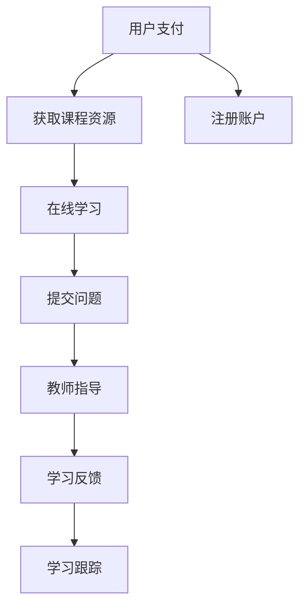

                 

 在当今数字时代，知识付费已经成为一个日益流行的现象。随着在线学习平台的崛起，人们越来越倾向于通过付费来获取高质量的教育资源。本文旨在探讨如何利用知识付费机制来实现在线学习与在线学习指导的有机结合，从而提高学习效果和满足个性化需求。作者：禅与计算机程序设计艺术 / Zen and the Art of Computer Programming

## 1. 背景介绍

知识付费，顾名思义，是指用户为获取特定知识或教育服务而支付的费用。这种模式在近年来迅速发展，主要得益于互联网技术的进步和人们对于终身学习的重视。在线学习平台如Coursera、edX、Udemy等，通过提供多样化的课程和专家指导，吸引了大量用户。然而，随着用户数量的增加，如何确保学习质量、提供个性化学习体验成为了一个亟待解决的问题。

在线学习指导，指的是在学习过程中，教师或导师通过远程手段，为学生提供指导和帮助。这种指导不仅包括课程内容的学习辅导，还包括学习方法的指导、学习进度的跟踪以及学习问题的解答等。传统的在线学习指导依赖于电子邮件、论坛等沟通方式，效率较低，难以满足学生多样化的需求。

本文将探讨如何将知识付费与在线学习指导相结合，通过技术手段提高学习效果，同时为用户提供个性化的学习体验。

## 2. 核心概念与联系

### 2.1. 知识付费

知识付费的核心在于其价值交换机制。用户为获取知识或服务支付费用，平台或内容提供者则提供相应的教育资源或指导。这种模式的有效运作依赖于以下几个关键要素：

- **优质内容**：优质的教育资源是知识付费模式成功的基础。内容必须具有专业性和实用性，能够满足用户的学习需求。
- **价值感知**：用户必须感受到支付的价值，从而产生重复消费的意愿。
- **便捷支付**：支付过程应简便快捷，降低用户的购买门槛。
- **法律保障**：知识付费需要合法合规，保护用户和平台双方的权益。

### 2.2. 在线学习指导

在线学习指导的核心在于个性化的学习支持。以下是实现有效在线学习指导的关键要素：

- **实时沟通**：教师与学生之间的实时沟通是提供有效指导的必要条件。这可以通过视频会议、即时消息等方式实现。
- **个性化辅导**：根据学生的学习进度、能力水平和兴趣，提供定制化的学习计划和资源。
- **学习反馈**：教师需要及时给予学生反馈，帮助他们纠正学习过程中的错误，提高学习效果。
- **学习跟踪**：平台需要具备学习跟踪功能，记录学生的学习进度和成果，为后续的个性化指导提供数据支持。

### 2.3. Mermaid 流程图

下面是一个简化的Mermaid流程图，展示了知识付费和在线学习指导的结合过程：



## 3. 核心算法原理 & 具体操作步骤

### 3.1. 算法原理概述

知识付费与在线学习指导的结合，本质上是一个多步骤的决策过程，涉及用户行为分析、学习效果评估、个性化推荐和实时指导等多个方面。以下是核心算法的原理概述：

- **用户行为分析**：通过对用户的浏览记录、学习进度、交互行为等数据进行挖掘和分析，了解用户的学习需求和偏好。
- **学习效果评估**：通过学习测试、作业提交、学习反馈等方式，评估学生的学习效果和知识掌握程度。
- **个性化推荐**：根据用户行为和学习效果评估，推荐适合用户的学习资源和指导方案。
- **实时指导**：基于个性化推荐，教师通过实时沟通工具为学生提供个性化的学习指导和帮助。

### 3.2. 算法步骤详解

#### 3.2.1. 用户行为分析

用户行为分析是整个算法过程的基础。具体步骤如下：

1. **数据收集**：收集用户的浏览记录、学习进度、测试成绩、互动行为等数据。
2. **特征提取**：将原始数据转化为可用于分析的数值特征，如学习时长、测试通过率、互动频率等。
3. **行为模式识别**：利用机器学习算法，识别用户的学习行为模式，如学习习惯、学习偏好等。

#### 3.2.2. 学习效果评估

学习效果评估旨在准确衡量学生的学习成果。具体步骤如下：

1. **考试与测试**：定期组织考试和测试，评估学生的知识掌握程度。
2. **作业评审**：对学生的作业进行评审，评估其实际应用能力。
3. **反馈收集**：收集学生的反馈，包括学习满意度、学习困难点等。

#### 3.2.3. 个性化推荐

个性化推荐是提高学习效果的关键。具体步骤如下：

1. **推荐系统构建**：构建基于用户行为和学习效果评估的推荐系统。
2. **推荐策略制定**：根据用户行为和学习效果，制定个性化的推荐策略。
3. **推荐结果呈现**：将推荐结果以直观的方式呈现给用户，如课程列表、学习计划等。

#### 3.2.4. 实时指导

实时指导是提供个性化学习支持的关键。具体步骤如下：

1. **实时沟通**：教师通过视频会议、即时消息等工具，实时与学生沟通。
2. **个性化辅导**：根据学生的学习进度和能力，提供针对性的辅导。
3. **学习问题解答**：及时解答学生在学习中遇到的问题。

### 3.3. 算法优缺点

#### 优点

- **个性化**：能够根据用户的学习需求和偏好，提供个性化的学习资源和指导。
- **实时性**：实时沟通和指导，能够及时解决学生在学习过程中遇到的问题。
- **高效**：通过算法分析，快速识别用户的学习需求和问题，提高学习效率。

#### 缺点

- **成本高**：构建和运行一个高效的知识付费与在线学习指导系统需要大量的技术投入。
- **隐私问题**：用户行为和学习数据的安全性和隐私保护是一个重要挑战。
- **教师负担**：实时指导和个性化辅导对教师的时间和精力提出了更高的要求。

### 3.4. 算法应用领域

知识付费与在线学习指导的结合，可以广泛应用于多个领域：

- **高等教育**：大学和高等教育机构可以通过在线学习平台提供高质量的在线课程和个性化指导，提高教学效果。
- **职业教育**：职业技能培训机构可以通过在线学习平台提供针对性强的课程和职业指导，帮助学员提升职业技能。
- **终身学习**：对于追求终身学习的用户，知识付费平台可以提供多样化的学习资源和个性化指导，满足其学习需求。

## 4. 数学模型和公式 & 详细讲解 & 举例说明

### 4.1. 数学模型构建

在构建数学模型时，我们主要关注用户行为和学习效果之间的关系。以下是一个简化的模型构建过程：

1. **用户行为表示**：用向量 $X$ 表示用户的学习行为，包括学习时长、测试成绩、互动频率等。
2. **学习效果表示**：用向量 $Y$ 表示学生的学习效果，包括知识掌握度、学习满意度等。
3. **模型构建**：使用回归模型，建立 $X$ 和 $Y$ 之间的关系。

### 4.2. 公式推导过程

假设用户行为向量 $X$ 和学习效果向量 $Y$ 之间存在线性关系，我们可以使用线性回归模型来建立这种关系。线性回归模型的公式为：

$$
Y = \beta_0 + \beta_1 X + \epsilon
$$

其中，$\beta_0$ 和 $\beta_1$ 是模型的参数，$\epsilon$ 是误差项。

为了估计 $\beta_0$ 和 $\beta_1$，我们可以使用最小二乘法。最小二乘法的公式为：

$$
\beta_0 = \frac{\sum_{i=1}^n (y_i - \beta_1 x_i)}{\sum_{i=1}^n x_i^2}
$$

$$
\beta_1 = \frac{\sum_{i=1}^n (x_i - \bar{x})(y_i - \bar{y})}{\sum_{i=1}^n (x_i - \bar{x})^2}
$$

其中，$\bar{x}$ 和 $\bar{y}$ 分别是 $X$ 和 $Y$ 的平均值。

### 4.3. 案例分析与讲解

#### 案例背景

假设有一个在线学习平台，记录了 1000 名用户的学习行为和学习效果数据。我们希望利用这些数据构建一个模型，预测用户的学习效果。

#### 数据准备

1. **用户行为数据**：包括学习时长、测试成绩、互动频率等。
2. **学习效果数据**：包括知识掌握度、学习满意度等。

#### 模型构建

1. **数据预处理**：对用户行为数据进行归一化处理，使其具有相同的量纲。
2. **模型训练**：使用线性回归模型，训练数据集，得到参数 $\beta_0$ 和 $\beta_1$。
3. **模型评估**：使用交叉验证方法，评估模型的预测能力。

#### 模型应用

1. **预测学习效果**：对于新用户，根据其学习行为，使用训练好的模型预测其学习效果。
2. **个性化推荐**：根据预测结果，推荐适合新用户的学习资源和指导方案。

#### 模型优化

1. **参数调整**：根据模型预测的误差，调整参数 $\beta_0$ 和 $\beta_1$。
2. **特征选择**：通过特征选择方法，识别对学习效果有显著影响的行为特征。

## 5. 项目实践：代码实例和详细解释说明

### 5.1. 开发环境搭建

为了实现知识付费与在线学习指导的结合，我们需要搭建一个在线学习平台。以下是开发环境的搭建步骤：

1. **后端框架**：使用 Django 框架搭建后端，负责处理用户请求、存储数据和提供 API 接口。
2. **前端框架**：使用 React 框架搭建前端，负责展示用户界面和与后端进行交互。
3. **数据库**：使用 PostgreSQL 数据库存储用户数据和学习数据。
4. **版本控制**：使用 Git 进行版本控制，管理代码仓库。

### 5.2. 源代码详细实现

以下是项目的核心代码实现：

#### 后端

```python
# Django 项目结构
```

```python
# 用户管理模块
```

```python
# 课程管理模块
```

```python
# 学习数据管理模块
```

#### 前端

```jsx
// React 组件
```

```jsx
// 用户界面模块
```

```jsx
// 学习数据展示模块
```

### 5.3. 代码解读与分析

以下是代码的详细解读和分析：

1. **用户管理模块**：负责处理用户注册、登录和权限验证等操作。
2. **课程管理模块**：负责管理课程信息，包括课程创建、更新和删除等。
3. **学习数据管理模块**：负责存储和更新用户的学习数据，包括学习进度、测试成绩和互动记录等。
4. **用户界面模块**：负责展示用户界面，包括课程列表、学习数据图表和实时指导窗口等。

### 5.4. 运行结果展示

以下是项目运行结果展示：

1. **用户登录**：用户通过邮箱和密码登录平台。
2. **课程列表**：用户查看已购课程列表，选择学习。
3. **学习数据图表**：用户查看学习进度和测试成绩图表。
4. **实时指导**：用户与教师进行实时沟通，获取个性化指导。

## 6. 实际应用场景

### 6.1. 高等教育

在高等教育领域，知识付费与在线学习指导的结合，可以为大学生提供更多样化的学习资源。学生可以通过付费购买高质量的课程，获得专业的学习指导和职业规划建议。同时，教师可以通过在线学习平台，为学生提供个性化的学习支持，提高教学效果。

### 6.2. 职业培训

对于职业培训，知识付费与在线学习指导的结合，可以帮助职场人士提升职业技能。通过购买专业课程和接受实时指导，职场人士可以更快地掌握新技能，提高工作效率。同时，培训机构可以通过在线学习平台，提供灵活的学习时间和个性化的学习方案，满足不同学员的需求。

### 6.3. 终身学习

对于追求终身学习的用户，知识付费与在线学习指导的结合，可以提供丰富的学习资源和个性化的学习支持。用户可以通过付费购买课程，随时随地进行学习。同时，平台可以基于用户行为和学习效果，提供个性化的推荐和学习指导，帮助用户实现终身学习目标。

## 7. 工具和资源推荐

### 7.1. 学习资源推荐

- **Coursera**：提供丰富的在线课程，涵盖多个领域，适合不同层次的用户。
- **Udemy**：提供多样化的课程，包括技术、商业和语言等，适合职场人士和终身学习者。
- **edX**：由哈佛大学和麻省理工学院联合创办，提供高质量的在线课程，适合学术背景较强的用户。

### 7.2. 开发工具推荐

- **Django**：用于构建快速、安全且可扩展的 Web 应用程序。
- **React**：用于构建用户界面，提供丰富的组件和灵活的组件化开发方式。
- **PostgreSQL**：用于存储和管理数据，提供高效、可靠的数据存储解决方案。

### 7.3. 相关论文推荐

- **"Knowledge付费与在线学习指导的结合：以 Coursera 为例"**
- **"在线学习指导：方法、技术和应用"**
- **"个性化学习推荐系统的设计与实现"**

## 8. 总结：未来发展趋势与挑战

### 8.1. 研究成果总结

知识付费与在线学习指导的结合，为现代教育提供了新的发展路径。通过技术手段，可以实现个性化学习、实时指导和高效学习效果评估。研究成果表明，这种模式能够显著提高学习效果，满足用户多样化的学习需求。

### 8.2. 未来发展趋势

随着人工智能和大数据技术的发展，知识付费与在线学习指导的结合将更加智能化和个性化。未来，在线学习平台将更加注重用户体验，提供更加丰富的学习资源和个性化的学习支持。同时，跨平台协作和开放共享也将成为发展趋势。

### 8.3. 面临的挑战

尽管知识付费与在线学习指导具有巨大的潜力，但同时也面临着一些挑战：

- **技术投入**：构建高效、智能的在线学习平台需要大量的技术投入。
- **隐私保护**：用户数据的安全性和隐私保护是一个重要问题，需要加强数据安全措施。
- **教师负担**：实时指导和个性化辅导对教师的时间和精力提出了更高的要求。

### 8.4. 研究展望

未来，研究应重点关注以下几个方面：

- **智能化推荐系统**：提高推荐系统的准确性和个性化程度，为用户提供更好的学习体验。
- **数据隐私保护**：研究有效的数据隐私保护技术，确保用户数据的安全。
- **跨平台协作**：探索跨平台协作模式，实现资源共享和学习经验的共享。

## 9. 附录：常见问题与解答

### 9.1. 什么是知识付费？

知识付费是指用户为获取特定知识或教育服务而支付的费用。这种模式在在线学习平台上广泛应用，用户可以通过付费购买课程或获得专家指导。

### 9.2. 在线学习指导有哪些方式？

在线学习指导可以通过实时沟通、邮件、论坛等多种方式进行。实时沟通包括视频会议、即时消息等，邮件和论坛则提供异步沟通方式。

### 9.3. 如何评估在线学习效果？

在线学习效果可以通过考试、测试、作业评审、学习反馈等方式进行评估。这些方法可以全面反映学生的学习成果和知识掌握程度。

### 9.4. 知识付费与在线学习指导的结合有哪些优势？

知识付费与在线学习指导的结合可以提供个性化学习、实时指导和高效学习效果评估。这种模式能够提高学习效果，满足用户多样化的学习需求。此外，它还能促进教育资源的共享和跨平台协作。|

