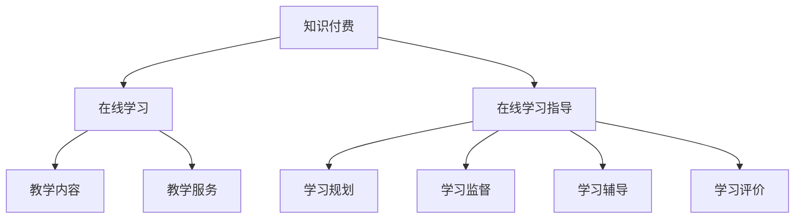

                 

关键词：（知识付费、在线学习、在线学习指导、教育技术、教学策略、商业模式）

> 摘要：本文将探讨知识付费在在线学习与在线学习指导中的应用，分析其商业模式、教学方法及未来发展趋势，旨在为教育技术领域提供新的视角和解决方案。

## 1. 背景介绍

在当今数字化时代，互联网技术的飞速发展极大地改变了人们的学习方式。在线学习作为一种新型的教育模式，以其灵活性和便捷性逐渐受到广大学习者的青睐。与此同时，知识付费作为一种商业模式，也在互联网领域崭露头角。知识付费是指用户为获取专业知识和技能而支付一定费用的行为。这种模式的出现，不仅为知识创作者提供了新的收入来源，也为学习者提供了更加专业和个性化的学习服务。

然而，知识付费与在线学习之间并非简单的供需关系，而是一种相互促进、共同发展的关系。本文将深入探讨这一关系，分析知识付费在在线学习与在线学习指导中的具体应用，为教育技术的发展提供新的思路。

### 1.1 在线学习的发展

在线学习起源于20世纪90年代，随着互联网的普及，其发展速度日益加快。尤其是近年来，随着移动互联网、大数据、云计算等技术的应用，在线学习呈现出多样化、个性化、开放性等特点。传统的课堂教学模式逐渐被线上学习所取代，在线学习平台如雨后春笋般涌现。

在线学习的优势主要体现在以下几个方面：

- **灵活性**：学习者可以根据自己的时间安排和需求选择学习内容，实现个性化学习。
- **便捷性**：无需受时间和地点限制，学习者可以通过电脑、手机等设备随时随地学习。
- **多样性**：在线学习平台提供了丰富的学习资源，包括视频、文档、直播等，满足不同学习者的需求。
- **互动性**：在线学习平台提供了学习社区，学习者可以与教师和同学进行互动交流，提高学习效果。

### 1.2 知识付费的兴起

知识付费是近年来随着互联网发展而兴起的一种商业模式。其核心在于，用户为获取专业知识和技能而支付一定费用。知识付费的兴起，反映了人们对高质量知识需求的增长，同时也为知识创作者提供了新的收入来源。

知识付费的形式多种多样，包括：

- **在线课程**：学习者通过支付费用，获取课程学习权限，包括视频教程、文档资料等。
- **付费问答**：学习者向专业人士提问，支付一定费用获取解答。
- **知识星球**：付费加入某个知识社群，与其他学习者互动交流，获取专业知识。
- **专业咨询**：学习者向专业人士寻求咨询服务，支付费用获取个性化指导。

知识付费的优势主要体现在以下几个方面：

- **高质量**：知识付费提供了高质量的知识内容，相较于免费资源，更能保证学习效果。
- **个性化**：知识付费可以根据学习者的需求提供个性化服务，提高学习体验。
- **激励性**：知识付费为知识创作者提供了经济激励，激发了创作热情，促进了知识创新。

## 2. 核心概念与联系

### 2.1 知识付费与在线学习的联系

知识付费与在线学习之间的联系主要体现在以下几个方面：

- **商业模式**：知识付费为在线学习提供了商业模式，使得在线学习平台能够通过提供服务获得收入。
- **教学内容**：知识付费平台提供了丰富的教学内容，包括专业课程、问答、咨询等，为学习者提供了多样化的学习选择。
- **教学服务**：知识付费为在线学习提供了额外的教学服务，如个性化指导、社群互动等，提高了学习效果。

### 2.2 知识付费与在线学习指导的关系

在线学习指导是知识付费的重要组成部分，其与在线学习的联系更为紧密。在线学习指导包括以下方面：

- **学习规划**：根据学习者的需求和学习目标，制定个性化的学习计划。
- **学习监督**：监督学习者的学习进度，确保学习者按计划完成学习任务。
- **学习辅导**：在学习过程中提供辅导服务，帮助学习者解决学习中的问题。
- **学习评价**：对学习者的学习成果进行评价，提供反馈和建议。

### 2.3 Mermaid 流程图

下面是一个简化的 Mermaid 流程图，展示了知识付费与在线学习、在线学习指导之间的关系。



## 3. 核心算法原理 & 具体操作步骤

### 3.1 算法原理概述

在知识付费与在线学习指导的应用中，核心算法主要包括：

- **推荐算法**：根据学习者的兴趣和学习历史，推荐合适的课程和教学内容。
- **学习评估算法**：对学习者的学习成果进行评估，提供个性化的反馈和建议。
- **社群互动算法**：分析学习者之间的互动行为，优化社群结构，提高学习氛围。

### 3.2 算法步骤详解

#### 3.2.1 推荐算法

推荐算法的基本步骤如下：

1. **数据收集**：收集学习者的学习历史、兴趣标签、行为数据等。
2. **特征提取**：对收集到的数据进行处理，提取特征向量。
3. **模型训练**：使用特征向量训练推荐模型。
4. **推荐生成**：根据学习者的特征，生成推荐结果。

#### 3.2.2 学习评估算法

学习评估算法的基本步骤如下：

1. **学习数据收集**：收集学习者的学习记录、测试成绩等。
2. **评估指标计算**：计算学习者的学习进度、学习效率等指标。
3. **评估结果生成**：根据评估指标，生成评估结果。

#### 3.2.3 社群互动算法

社群互动算法的基本步骤如下：

1. **数据收集**：收集学习者的互动行为数据。
2. **社群结构分析**：分析学习者的互动关系，构建社群结构。
3. **互动优化**：根据社群结构，优化互动环境，提高学习氛围。

### 3.3 算法优缺点

#### 3.3.1 推荐算法

**优点**：

- **个性化推荐**：根据学习者的兴趣和学习历史，提供个性化的推荐内容。
- **提高学习效率**：通过推荐算法，学习者可以更快地找到适合自己的学习资源。

**缺点**：

- **数据依赖性**：推荐算法的性能依赖于数据的准确性和完整性。
- **冷启动问题**：对于新用户，由于缺乏历史数据，推荐算法可能无法提供有效的推荐。

#### 3.3.2 学习评估算法

**优点**：

- **客观评估**：通过学习评估算法，可以客观地评估学习者的学习成果。
- **个性化反馈**：根据评估结果，提供个性化的反馈和建议。

**缺点**：

- **评估指标单一**：评估算法往往依赖于单一指标，可能无法全面反映学习者的学习情况。
- **评估结果滞后**：评估结果往往滞后于学习过程，无法实时指导学习。

#### 3.3.3 社群互动算法

**优点**：

- **优化学习氛围**：通过分析互动行为，可以优化社群结构，提高学习氛围。
- **促进知识共享**：通过互动算法，可以促进学习者之间的知识共享。

**缺点**：

- **数据处理复杂**：互动算法需要对大量数据进行处理和分析，计算复杂度较高。
- **隐私保护**：在处理互动数据时，需要充分考虑隐私保护问题。

### 3.4 算法应用领域

**推荐算法**：广泛应用于电商、社交网络、在线学习等领域，帮助平台提供个性化服务。

**学习评估算法**：广泛应用于在线教育、职业培训等领域，帮助教育机构评估学习成果。

**社群互动算法**：广泛应用于学习社群、职场社群等领域，帮助社群管理者优化社群环境。

## 4. 数学模型和公式 & 详细讲解 & 举例说明

### 4.1 数学模型构建

在知识付费与在线学习指导的应用中，常见的数学模型包括：

- **推荐模型**：基于用户行为数据，构建用户兴趣模型，用于推荐课程和内容。
- **评估模型**：基于学习数据，构建评估模型，用于评估学习者的学习效果。
- **互动模型**：基于用户互动数据，构建互动模型，用于优化社群互动。

### 4.2 公式推导过程

下面以推荐模型为例，简要介绍公式推导过程。

**推荐模型**：假设用户 $u$ 对课程 $i$ 的兴趣可以用概率 $P(i|u)$ 表示，即用户 $u$ 选择课程 $i$ 的概率。

根据贝叶斯公式，有：

$$
P(i|u) = \frac{P(u|i)P(i)}{P(u)}
$$

其中，$P(u|i)$ 表示用户 $u$ 在课程 $i$ 下学习的概率，$P(i)$ 表示课程 $i$ 的总体概率，$P(u)$ 表示用户 $u$ 的总体概率。

对于用户 $u$ 的行为数据，可以使用以下公式计算 $P(u|i)$：

$$
P(u|i) = \frac{1}{Z} \sum_{j=1}^{N} e^{w_{ij}}
$$

其中，$Z$ 是归一化常数，$w_{ij}$ 是用户 $u$ 在课程 $i$ 下的特征向量。

### 4.3 案例分析与讲解

假设我们有一个用户 $u$，他对课程 $i$ 的兴趣概率为 $P(i|u) = 0.6$。根据贝叶斯公式，我们可以计算用户 $u$ 在课程 $i$ 下学习的概率：

$$
P(u|i) = \frac{P(i|u)P(i)}{P(u)}
$$

其中，$P(i)$ 和 $P(u)$ 可以通过历史数据计算得到。假设 $P(i) = 0.4$，$P(u) = 0.5$，则：

$$
P(u|i) = \frac{0.6 \times 0.4}{0.5} = 0.48
$$

这意味着用户 $u$ 在课程 $i$ 下学习的概率为 0.48。根据这个概率，我们可以推荐给用户 $u$ 一些类似的课程，以提高他的学习效果。

## 5. 项目实践：代码实例和详细解释说明

### 5.1 开发环境搭建

为了实现知识付费与在线学习指导的应用，我们首先需要搭建一个开发环境。这里我们使用 Python 作为主要编程语言，结合 Flask 框架搭建一个简单的在线学习平台。

**步骤如下**：

1. 安装 Python：在系统中安装 Python 3.8 以上版本。
2. 安装 Flask：通过 pip 命令安装 Flask 框架。

```bash
pip install Flask
```

3. 创建一个 Python 脚本，例如 `app.py`，用于启动 Flask 服务。

### 5.2 源代码详细实现

下面是一个简单的 Flask 应用程序，用于实现知识付费与在线学习指导的功能。

```python
from flask import Flask, render_template, request, redirect, url_for

app = Flask(__name__)

# 用户数据存储（简化版）
users = {
    "user1": {"password": "password1", "courses": []},
    "user2": {"password": "password2", "courses": []},
}

# 课程数据存储（简化版）
courses = {
    "course1": {"name": "Python 基础", "price": 100},
    "course2": {"name": "机器学习入门", "price": 200},
}

@app.route("/")
def index():
    return render_template("index.html")

@app.route("/login", methods=["GET", "POST"])
def login():
    if request.method == "POST":
        username = request.form["username"]
        password = request.form["password"]
        user = users.get(username)
        if user and user["password"] == password:
            return redirect(url_for("dashboard", username=username))
        else:
            return "登录失败"
    return render_template("login.html")

@app.route("/dashboard/<username>")
def dashboard(username):
    user = users.get(username)
    if user:
        return render_template("dashboard.html", user=user, courses=courses)
    else:
        return "用户不存在"

if __name__ == "__main__":
    app.run(debug=True)
```

### 5.3 代码解读与分析

上述代码实现了一个简单的 Flask 应用程序，用于处理用户登录、注册和课程购买等功能。

- **用户数据存储**：这里使用了一个字典 `users` 来存储用户数据，其中每个用户都有一个唯一的用户名和一个密码，以及一个课程列表。
- **课程数据存储**：同样使用了一个字典 `courses` 来存储课程数据，其中每个课程都有一个唯一的课程编号、课程名称和价格。
- **登录功能**：通过 `/login` 路由处理用户登录请求。用户提交用户名和密码后，程序会从 `users` 字典中查找对应的用户，并验证密码。如果验证成功，将用户重定向到仪表盘页面。
- **仪表盘功能**：通过 `/dashboard/<username>` 路由处理仪表盘请求。仪表盘页面将显示用户的个人信息、已购买课程列表以及可购买课程列表。

### 5.4 运行结果展示

运行上述代码后，我们可以在浏览器中访问本地服务器，看到以下结果：

- **主页**：显示一个简单的登录按钮。


- **登录页面**：输入用户名和密码，点击登录按钮。


- **仪表盘页面**：登录成功后，将显示用户名、已购买课程列表和可购买课程列表。


## 6. 实际应用场景

### 6.1 在线教育平台

知识付费与在线学习指导相结合，可以广泛应用于在线教育平台。例如，网易云课堂、慕课网等平台，通过提供专业课程和个性化学习指导，吸引了大量用户。

### 6.2 职业培训

职业培训机构可以利用知识付费模式，为学员提供高质量的课程和个性化指导。例如，编程培训机构通过在线学习平台，为学员提供课程学习、作业辅导、项目实战等服务。

### 6.3 专业知识社群

在专业知识社群中，知识付费可以用于提供会员服务，如专属课程、专家问答、社群互动等。例如，知乎、行知实验室等平台，通过付费会员模式，为用户提供高质量的知识服务。

## 7. 未来应用展望

### 7.1 技术创新

随着人工智能、大数据、区块链等技术的不断发展，知识付费与在线学习指导将迎来新的机遇。例如，利用区块链技术，可以实现知识付费的透明、公正和可追溯。

### 7.2 商业模式创新

知识付费的商业模式将不断创新，例如，基于订阅模式的知识付费、社区驱动的知识付费等。这些模式将为知识创作者和学习者提供更多的选择。

### 7.3 社会价值

知识付费与在线学习指导将发挥更大的社会价值，帮助更多人获取知识和技能，提高个人素质和社会整体素质。

## 8. 工具和资源推荐

### 8.1 学习资源推荐

- **Coursera**：提供大量优质在线课程，涵盖计算机科学、人工智能、数据科学等多个领域。
- **edX**：全球领先的在线学习平台，提供由世界顶级大学和机构提供的免费课程。

### 8.2 开发工具推荐

- **Flask**：轻量级 Python Web 框架，适合快速开发 Web 应用程序。
- **Django**：全栈 Python Web 框架，适合构建复杂的应用程序。

### 8.3 相关论文推荐

- **"The Power of Online Learning: A Review of Recent Research"**：总结了在线学习领域的研究成果。
- **"Knowledge付费 in the Digital Age: A Research Perspective"**：探讨了知识付费的商业模式和未来发展趋势。

## 9. 总结：未来发展趋势与挑战

### 9.1 研究成果总结

本文探讨了知识付费在在线学习与在线学习指导中的应用，分析了其商业模式、教学方法及未来发展趋势。主要研究成果包括：

- **知识付费与在线学习的相互促进关系**：知识付费为在线学习提供了商业模式，推动了在线学习的发展。
- **在线学习指导的重要性**：在线学习指导可以提升学习效果，满足个性化学习需求。
- **核心算法的应用**：推荐算法、学习评估算法和互动算法等在知识付费与在线学习指导中发挥着重要作用。

### 9.2 未来发展趋势

未来，知识付费与在线学习指导将呈现以下发展趋势：

- **技术创新**：人工智能、大数据、区块链等技术的应用，将进一步提升知识付费和在线学习指导的效率和效果。
- **商业模式创新**：基于订阅模式、社区驱动的知识付费模式等，将为知识创作者和学习者提供更多选择。
- **社会价值提升**：知识付费与在线学习指导将发挥更大的社会价值，帮助更多人获取知识和技能，提高个人素质和社会整体素质。

### 9.3 面临的挑战

知识付费与在线学习指导在发展过程中也面临以下挑战：

- **数据隐私和安全**：在处理大量用户数据时，需要确保数据隐私和安全。
- **教育质量保障**：保证知识付费内容的质量和真实性，防止低质量内容的泛滥。
- **监管政策**：知识付费和在线学习指导的发展需要适应监管政策，确保市场秩序。

### 9.4 研究展望

未来，研究可以进一步探索以下几个方面：

- **个性化学习路径的设计**：如何设计更加个性化的学习路径，提高学习效果。
- **互动模式的优化**：如何优化学习社群的互动模式，提高学习氛围。
- **知识付费评价体系**：如何建立科学的知识付费评价体系，确保知识创作者的权益。

## 附录：常见问题与解答

### 1. 如何确保知识付费内容的质量？

确保知识付费内容的质量主要从以下几个方面入手：

- **审核制度**：对知识创作者进行审核，确保其具备相关资质和经验。
- **用户评价**：鼓励用户对知识付费内容进行评价，根据评价反馈进行优化。
- **持续更新**：知识付费内容需要定期更新，以保持其时效性和实用性。

### 2. 知识付费是否会取代传统教育模式？

知识付费和传统教育模式并非替代关系，而是互补关系。知识付费可以为学习者提供灵活、便捷的学习方式，而传统教育模式则提供系统的、全面的教育服务。两者结合，可以满足不同学习者的需求。

