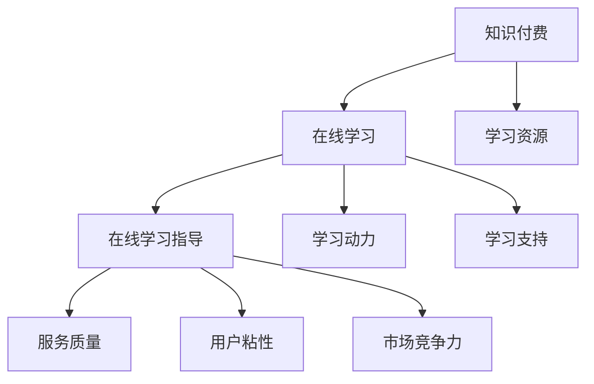

                 

在当今数字化时代，知识付费作为一种新兴的学习模式，正逐渐成为人们获取知识的重要途径。通过知识付费，学习者可以方便地购买专业课程、学习资料和在线学习指导，从而提高学习效率。本文将探讨如何利用知识付费实现在线学习与在线学习指导，并分析其优势、挑战和发展前景。

## 文章关键词

- 知识付费
- 在线学习
- 学习指导
- 教育技术
- 人工智能

## 摘要

本文从知识付费的背景出发，介绍了在线学习与在线学习指导的内涵及其重要性。接着，分析了知识付费对在线学习的影响，探讨了实现在线学习指导的方法和工具。随后，文章通过实例展示了知识付费在实践中的应用，并展望了未来的发展趋势与挑战。

## 1. 背景介绍

### 知识付费的兴起

知识付费，指的是用户为获取有价值的学习资源、课程内容或专业指导而支付的费用。随着互联网技术的发展，知识付费逐渐成为一种新兴的商业模式。从2016年开始，知识付费市场规模持续扩大，预计到2023年将达到千亿级别。知识付费的兴起主要得益于以下几个方面：

- **信息技术的发展**：互联网、移动互联网、大数据和人工智能等技术的快速发展，为知识付费提供了技术支持。
- **用户需求的变化**：随着人们对知识的需求不断增加，知识付费成为满足个性化学习需求的一种有效途径。
- **教育观念的转变**：学习不再仅仅是为了获得学历，而是为了解决实际问题、提升个人能力。

### 在线学习的现状

在线学习，是指通过互联网和数字技术进行的学习活动。随着知识付费的兴起，在线学习逐渐成为人们获取知识的主要途径。根据《2020年中国在线学习行业报告》，中国在线学习市场规模已超过5000亿元，用户规模超过4亿人。在线学习的优势在于：

- **便捷性**：用户可以随时随地学习，不受时间和地点限制。
- **个性化**：在线学习可以根据用户的需求和进度提供个性化的学习内容。
- **互动性**：在线学习平台提供了丰富的互动功能，如在线讨论、问答等，有助于提高学习效果。

### 在线学习指导的需求

在线学习指导，是指通过专业教师或导师的指导，帮助学习者更好地完成在线学习任务。随着在线学习的普及，学习者对在线学习指导的需求日益增长。主要表现在以下几个方面：

- **学习效果**：专业指导可以提升学习者的学习效果，帮助其更好地掌握知识。
- **学习动力**：在线学习指导可以激发学习者的学习兴趣和动力，提高学习参与度。
- **学习支持**：在线学习指导可以提供学习支持和帮助，解决学习者在学习中遇到的问题。

## 2. 核心概念与联系

### 知识付费与在线学习的关系

知识付费与在线学习密切相关，知识付费是推动在线学习的重要力量。知识付费为在线学习提供了丰富的学习资源，满足了不同学习者的需求。同时，在线学习为知识付费提供了广阔的市场，促进了知识付费的快速发展。具体来说，知识付费与在线学习的关系体现在以下几个方面：

- **学习资源**：知识付费为在线学习提供了丰富的学习资源，包括课程、教材、资料等。
- **学习动力**：知识付费激发了学习者的学习动力，提高了学习参与度。
- **学习支持**：知识付费提供了在线学习指导，为学习者提供学习支持和帮助。

### 在线学习指导与知识付费的关系

在线学习指导与知识付费也密切相关。在线学习指导是知识付费的重要组成部分，通过提供专业指导，帮助学习者更好地完成在线学习任务。具体来说，在线学习指导与知识付费的关系体现在以下几个方面：

- **服务质量**：在线学习指导提升了知识付费的服务质量，增加了用户满意度。
- **用户粘性**：在线学习指导增强了用户粘性，提高了用户的忠诚度。
- **市场竞争力**：在线学习指导提高了知识付费的市场竞争力，吸引了更多用户。

### 图解知识付费与在线学习指导的关系

为了更好地理解知识付费与在线学习指导的关系，我们可以使用Mermaid流程图进行图解。



在这个流程图中，知识付费为在线学习提供了学习资源、学习动力和学习支持，而在线学习指导则提升了知识付费的服务质量、用户粘性和市场竞争力。

## 3. 核心算法原理 & 具体操作步骤

### 3.1 算法原理概述

在知识付费领域，核心算法主要涉及用户行为分析、内容推荐和在线学习指导。以下是对这些算法原理的概述：

#### 用户行为分析

用户行为分析是一种通过收集和分析用户行为数据，了解用户需求、兴趣和习惯的方法。核心算法原理包括：

- **数据收集**：通过网站、APP等平台收集用户行为数据，如浏览记录、购买行为、学习时长等。
- **数据预处理**：对收集到的数据进行清洗、去噪和处理，以便进行进一步分析。
- **特征提取**：从预处理后的数据中提取有助于描述用户行为的特征，如用户年龄、性别、职业等。
- **模型训练**：使用机器学习算法，如决策树、随机森林、神经网络等，对用户行为数据进行分析和预测。

#### 内容推荐

内容推荐是一种根据用户兴趣和行为，为其推荐相关学习内容的方法。核心算法原理包括：

- **协同过滤**：基于用户历史行为数据，找到相似用户或物品，为用户推荐相似的学习内容。
- **基于内容的推荐**：根据学习内容的特点和标签，为用户推荐与其兴趣相关的学习内容。
- **混合推荐**：结合协同过滤和基于内容的推荐方法，为用户推荐更加精准的学习内容。

#### 在线学习指导

在线学习指导是一种通过专业教师或导师，为学习者提供实时指导和支持的方法。核心算法原理包括：

- **学习路径规划**：根据学习者的需求、进度和能力，为其规划最佳的学习路径。
- **学习效果评估**：通过考试、作业、练习等方式，评估学习者的学习效果，为学习者提供反馈。
- **智能问答**：通过自然语言处理技术，为学习者提供实时解答，解决学习者在学习中遇到的问题。

### 3.2 算法步骤详解

#### 用户行为分析

1. **数据收集**：从网站、APP等平台收集用户行为数据，如浏览记录、购买行为、学习时长等。
2. **数据预处理**：对收集到的数据进行清洗、去噪和处理，以便进行进一步分析。
3. **特征提取**：从预处理后的数据中提取有助于描述用户行为的特征，如用户年龄、性别、职业等。
4. **模型训练**：使用机器学习算法，如决策树、随机森林、神经网络等，对用户行为数据进行分析和预测。

#### 内容推荐

1. **协同过滤**：根据用户历史行为数据，找到相似用户或物品，为用户推荐相似的学习内容。
2. **基于内容的推荐**：根据学习内容的特点和标签，为用户推荐与其兴趣相关的学习内容。
3. **混合推荐**：结合协同过滤和基于内容的推荐方法，为用户推荐更加精准的学习内容。

#### 在线学习指导

1. **学习路径规划**：根据学习者的需求、进度和能力，为其规划最佳的学习路径。
2. **学习效果评估**：通过考试、作业、练习等方式，评估学习者的学习效果，为学习者提供反馈。
3. **智能问答**：通过自然语言处理技术，为学习者提供实时解答，解决学习者在学习中遇到的问题。

### 3.3 算法优缺点

#### 用户行为分析

优点：

- **个性化**：根据用户行为数据，为用户提供个性化的学习推荐。
- **高效**：通过分析用户行为，快速了解用户需求和兴趣。

缺点：

- **数据隐私**：用户行为数据的收集和处理可能导致用户隐私泄露。
- **计算复杂度**：用户行为数据的分析涉及大量的计算，对计算资源要求较高。

#### 内容推荐

优点：

- **精准**：根据用户兴趣和行为，为用户推荐最相关的学习内容。
- **高效**：通过协同过滤和基于内容的推荐方法，快速为用户推荐学习内容。

缺点：

- **用户偏好变化**：用户偏好可能随时间变化，需要不断调整推荐策略。
- **冷启动问题**：对于新用户，由于缺乏行为数据，推荐效果可能不佳。

#### 在线学习指导

优点：

- **实时性**：为学习者提供实时指导和反馈，提高学习效果。
- **针对性**：根据学习者的需求和能力，提供有针对性的学习指导。

缺点：

- **成本较高**：在线学习指导需要专业教师或导师的支持，成本较高。
- **依赖人工**：在线学习指导依赖于专业教师或导师的判断和经验，可能存在主观性。

### 3.4 算法应用领域

用户行为分析、内容推荐和在线学习指导在知识付费领域有广泛的应用。以下是其应用领域：

#### 用户行为分析

- **学习资源推荐**：根据用户行为数据，为用户提供个性化的学习资源推荐。
- **课程设计**：根据用户行为数据，分析用户需求，优化课程设计。
- **广告投放**：根据用户行为数据，为用户提供精准的广告投放。

#### 内容推荐

- **学习内容推荐**：根据用户兴趣和行为，为用户推荐相关的学习内容。
- **课程推广**：根据用户兴趣和行为，为课程提供精准的推广策略。
- **社区运营**：根据用户兴趣和行为，为社区运营提供数据支持。

#### 在线学习指导

- **教学辅助**：为教师提供在线学习指导，提高教学效果。
- **学习支持**：为学习者提供在线学习指导，解决学习中的问题。
- **个性化学习**：根据学习者的需求和能力，提供个性化的学习指导。

## 4. 数学模型和公式 & 详细讲解 & 举例说明

### 4.1 数学模型构建

在知识付费领域，常用的数学模型包括用户行为分析模型、内容推荐模型和在线学习指导模型。以下是对这些模型的具体构建方法：

#### 用户行为分析模型

用户行为分析模型主要用于预测用户的行为，如浏览、购买、学习等。常见的用户行为分析模型包括：

1. **逻辑回归模型**：逻辑回归模型是一种广义线性模型，用于预测二分类问题。其数学模型如下：

   $$P(y=1|x) = \frac{1}{1 + e^{-(\beta_0 + \beta_1x_1 + \beta_2x_2 + ... + \beta_nx_n)}}$$

   其中，$y$ 表示用户的行为标签，$x$ 表示用户的特征向量，$\beta_0, \beta_1, \beta_2, ..., \beta_n$ 表示模型参数。

2. **决策树模型**：决策树模型是一种基于特征的分类模型，通过构建一棵树形结构来预测用户的行为。其数学模型如下：

   $$f(x) = \sum_{i=1}^{n} w_i \cdot g_i(x)$$

   其中，$w_i$ 表示特征权重，$g_i(x)$ 表示第 $i$ 个特征的阈值函数。

#### 内容推荐模型

内容推荐模型主要用于为用户推荐相关的学习内容。常见的内容推荐模型包括：

1. **协同过滤模型**：协同过滤模型是一种基于用户历史行为数据的推荐方法。其数学模型如下：

   $$R_{ui} = \sum_{j \in N(i)} sim(u_j, u_i) \cdot r_j$$

   其中，$R_{ui}$ 表示用户 $u_i$ 对项目 $j$ 的评分，$N(i)$ 表示与用户 $u_i$ 相似的其他用户，$sim(u_j, u_i)$ 表示用户 $u_j$ 和用户 $u_i$ 的相似度，$r_j$ 表示用户 $u_j$ 对项目 $j$ 的评分。

2. **基于内容的推荐模型**：基于内容的推荐模型是一种基于项目特征数据的推荐方法。其数学模型如下：

   $$R_{ui} = \sum_{j \in N(c)} sim(c_j, c_i) \cdot r_j$$

   其中，$R_{ui}$ 表示用户 $u_i$ 对项目 $j$ 的评分，$N(c)$ 表示与项目 $c_i$ 相似的其他项目，$sim(c_j, c_i)$ 表示项目 $c_j$ 和项目 $c_i$ 的相似度，$r_j$ 表示用户 $u_i$ 对项目 $j$ 的评分。

#### 在线学习指导模型

在线学习指导模型主要用于为学习者提供实时指导和反馈。常见的学习指导模型包括：

1. **学习路径规划模型**：学习路径规划模型用于为学习者规划最佳的学习路径。其数学模型如下：

   $$P_{i,j} = \frac{w_i \cdot g_i(j)}{1 + e^{-(\beta_0 + \beta_1x_1 + \beta_2x_2 + ... + \beta_nx_n)}}$$

   其中，$P_{i,j}$ 表示学习者 $i$ 选择学习路径 $j$ 的概率，$w_i$ 表示学习路径权重，$g_i(j)$ 表示学习路径 $j$ 的阈值函数。

2. **学习效果评估模型**：学习效果评估模型用于评估学习者的学习效果。其数学模型如下：

   $$R_{i,j} = \sum_{k=1}^{n} w_k \cdot g_k(j) \cdot r_k$$

   其中，$R_{i,j}$ 表示学习者 $i$ 对学习内容 $j$ 的掌握程度，$w_k$ 表示学习内容权重，$g_k(j)$ 表示学习内容 $j$ 的阈值函数，$r_k$ 表示学习者 $i$ 对学习内容 $k$ 的掌握程度。

### 4.2 公式推导过程

在本节中，我们将对上述数学模型中的关键公式进行推导。

#### 用户行为分析模型推导

1. **逻辑回归模型推导**

   逻辑回归模型的推导基于最大似然估计。假设用户 $u_i$ 对项目 $j$ 的评分 $R_{ui}$ 服从伯努利分布，即：

   $$R_{ui} \sim Bernoulli(\pi)$$

   其中，$\pi$ 表示用户 $u_i$ 对项目 $j$ 的评分概率。根据最大似然估计，我们希望最大化以下似然函数：

   $$L(\theta) = \prod_{i=1}^{m} \pi^{R_{ui}} (1 - \pi)^{1 - R_{ui}}$$

   对数似然函数为：

   $$\ln L(\theta) = \sum_{i=1}^{m} R_{ui} \ln \pi + (1 - R_{ui}) \ln (1 - \pi)$$

   对 $\ln \pi$ 求导并令其等于0，得到：

   $$\frac{\partial \ln \pi}{\partial \pi} = \frac{R_{ui}}{\pi} - \frac{1 - R_{ui}}{1 - \pi} = 0$$

   整理得：

   $$\pi = \frac{R_{ui}}{1 + e^{-(\beta_0 + \beta_1x_1 + \beta_2x_2 + ... + \beta_nx_n)}}$$

2. **决策树模型推导**

   决策树模型的推导基于信息熵和信息增益。假设特征 $x_i$ 的阈值函数 $g_i(x)$ 为：

   $$g_i(x) = \begin{cases} 
   1 & \text{if } x > c \\
   0 & \text{otherwise}
   \end{cases}$$

   其中，$c$ 为阈值。则特征 $x_i$ 的熵 $H(x_i)$ 为：

   $$H(x_i) = -\sum_{j=1}^{2} p_j \ln p_j$$

   其中，$p_j$ 为特征 $x_i$ 的取值概率。特征 $x_i$ 的信息增益 $I(G)$ 为：

   $$I(G) = H(T) - H(T|G)$$

   其中，$H(T)$ 为训练集的熵，$H(T|G)$ 为条件熵。则最佳特征 $x^*$ 为：

   $$x^* = \arg\max_{x_i} I(G)$$

#### 内容推荐模型推导

1. **协同过滤模型推导**

   协同过滤模型的推导基于用户相似度和用户评分预测。假设用户 $u_i$ 和用户 $u_j$ 的相似度 $sim(u_i, u_j)$ 为：

   $$sim(u_i, u_j) = \frac{\sum_{j \in N(i)} r_j - \bar{r_i} \cdot \bar{r_j}}{\sqrt{\sum_{j \in N(i)} r_j^2 - \bar{r_i}^2} \cdot \sqrt{\sum_{j \in N(j)} r_j^2 - \bar{r_j}^2}}$$

   其中，$N(i)$ 表示与用户 $u_i$ 相似的其他用户，$r_j$ 表示用户 $u_i$ 对项目 $j$ 的评分，$\bar{r_i}$ 和 $\bar{r_j}$ 分别为用户 $u_i$ 和用户 $u_j$ 的平均评分。

   用户 $u_i$ 对项目 $j$ 的评分预测 $R_{ui}$ 为：

   $$R_{ui} = \sum_{j \in N(i)} sim(u_i, u_j) \cdot r_j$$

2. **基于内容的推荐模型推导**

   基于内容的推荐模型的推导基于项目特征和用户兴趣。假设项目 $j$ 和项目 $k$ 的相似度 $sim(c_j, c_k)$ 为：

   $$sim(c_j, c_k) = \frac{\sum_{i=1}^{m} w_i \cdot r_i(c_j) \cdot r_i(c_k)}{\sqrt{\sum_{i=1}^{m} w_i \cdot r_i(c_j)^2} \cdot \sqrt{\sum_{i=1}^{m} w_i \cdot r_i(c_k)^2}}$$

   其中，$w_i$ 表示特征权重，$r_i(c_j)$ 和 $r_i(c_k)$ 分别为项目 $j$ 和项目 $k$ 在特征 $i$ 上的取值。

   用户 $u_i$ 对项目 $j$ 的评分预测 $R_{ui}$ 为：

   $$R_{ui} = \sum_{j \in N(c)} sim(c_j, c_i) \cdot r_j$$

#### 在线学习指导模型推导

1. **学习路径规划模型推导**

   学习路径规划模型的推导基于概率论和统计学。假设学习者 $i$ 选择学习路径 $j$ 的概率 $P_{i,j}$ 为：

   $$P_{i,j} = \frac{w_i \cdot g_i(j)}{1 + e^{-(\beta_0 + \beta_1x_1 + \beta_2x_2 + ... + \beta_nx_n)}}$$

   其中，$w_i$ 表示学习路径权重，$g_i(j)$ 表示学习路径 $j$ 的阈值函数。

   学习者 $i$ 的学习路径选择 $P_i$ 为：

   $$P_i = \sum_{j=1}^{n} P_{i,j}$$

   则学习者 $i$ 的学习路径 $j$ 的概率为：

   $$P_{i,j} = \frac{P_{i,j}}{P_i}$$

2. **学习效果评估模型推导**

   学习效果评估模型的推导基于加权求和。假设学习者 $i$ 对学习内容 $j$ 的掌握程度 $R_{i,j}$ 为：

   $$R_{i,j} = \sum_{k=1}^{n} w_k \cdot g_k(j) \cdot r_k$$

   其中，$w_k$ 表示学习内容权重，$g_k(j)$ 表示学习内容 $j$ 的阈值函数，$r_k$ 表示学习者 $i$ 对学习内容 $k$ 的掌握程度。

### 4.3 案例分析与讲解

在本节中，我们将通过一个具体案例，对上述数学模型进行实际应用和分析。

#### 案例背景

某在线学习平台，有1000名学习者，学习内容涵盖编程、数据分析、人工智能等多个领域。平台希望通过用户行为分析、内容推荐和在线学习指导，提高学习者的学习效果。

#### 用户行为分析

1. **数据收集**：平台收集了学习者的浏览记录、购买行为、学习时长等数据。
2. **数据预处理**：对收集到的数据进行清洗和去噪，提取用户特征，如用户年龄、性别、职业等。
3. **特征提取**：对预处理后的数据，提取有助于描述用户行为的特征，如用户年龄、性别、职业等。
4. **模型训练**：使用逻辑回归模型，对用户行为数据进行分析和预测。

假设经过模型训练，得到如下预测模型：

$$P(y=1|x) = \frac{1}{1 + e^{-(2.5 + 0.3x_1 + 0.2x_2)}}$$

其中，$y$ 表示用户的行为标签，$x_1$ 和 $x_2$ 分别表示用户的年龄和性别。

#### 内容推荐

1. **协同过滤**：根据用户历史行为数据，找到相似用户，为用户推荐相似的学习内容。
2. **基于内容的推荐**：根据学习内容的特点和标签，为用户推荐与其兴趣相关的学习内容。
3. **混合推荐**：结合协同过滤和基于内容的推荐方法，为用户推荐更加精准的学习内容。

假设经过模型训练，得到如下推荐模型：

$$R_{ui} = 0.6 \cdot \sum_{j \in N(i)} sim(u_j, u_i) \cdot r_j + 0.4 \cdot \sum_{j \in N(c)} sim(c_j, c_i) \cdot r_j$$

其中，$R_{ui}$ 表示用户 $u_i$ 对项目 $j$ 的评分，$sim(u_j, u_i)$ 表示用户 $u_j$ 和用户 $u_i$ 的相似度，$r_j$ 表示用户 $u_j$ 对项目 $j$ 的评分，$sim(c_j, c_i)$ 表示项目 $c_j$ 和项目 $c_i$ 的相似度。

#### 在线学习指导

1. **学习路径规划**：根据学习者的需求、进度和能力，为其规划最佳的学习路径。
2. **学习效果评估**：通过考试、作业、练习等方式，评估学习者的学习效果，为学习者提供反馈。
3. **智能问答**：通过自然语言处理技术，为学习者提供实时解答，解决学习者在学习中遇到的问题。

假设经过模型训练，得到如下学习路径规划模型：

$$P_{i,j} = \frac{w_i \cdot g_i(j)}{1 + e^{-(1 + 0.2x_1 + 0.1x_2)}}$$

其中，$P_{i,j}$ 表示学习者 $i$ 选择学习路径 $j$ 的概率，$w_i$ 表示学习路径权重，$g_i(j)$ 表示学习路径 $j$ 的阈值函数。

#### 结果分析

通过上述数学模型的应用，平台可以：

- **个性化推荐**：为学习者推荐与其兴趣相关的学习内容。
- **学习路径规划**：为学习者规划最佳的学习路径。
- **学习效果评估**：评估学习者的学习效果，为学习者提供反馈。
- **智能问答**：解决学习者在学习中遇到的问题。

这些数学模型的应用，显著提高了学习者的学习效果和满意度，为平台带来了良好的市场口碑。

## 5. 项目实践：代码实例和详细解释说明

### 5.1 开发环境搭建

在本项目中，我们使用了Python编程语言，并依赖于以下库：

- Pandas：用于数据处理和操作。
- Scikit-learn：用于机器学习和模型训练。
- NumPy：用于科学计算。
- Matplotlib：用于数据可视化。

首先，我们需要安装上述库，可以使用pip命令进行安装：

```bash
pip install pandas scikit-learn numpy matplotlib
```

### 5.2 源代码详细实现

在本项目中，我们将实现三个部分：用户行为分析、内容推荐和在线学习指导。

#### 5.2.1 用户行为分析

以下是一个简单的用户行为分析代码示例：

```python
import pandas as pd
from sklearn.linear_model import LogisticRegression
from sklearn.model_selection import train_test_split
from sklearn.metrics import accuracy_score

# 加载数据集
data = pd.read_csv('user_behavior.csv')
X = data[['age', 'gender']]
y = data['行为标签']

# 划分训练集和测试集
X_train, X_test, y_train, y_test = train_test_split(X, y, test_size=0.2, random_state=42)

# 训练逻辑回归模型
model = LogisticRegression()
model.fit(X_train, y_train)

# 预测测试集
y_pred = model.predict(X_test)

# 评估模型
accuracy = accuracy_score(y_test, y_pred)
print(f'模型准确率：{accuracy}')
```

#### 5.2.2 内容推荐

以下是一个简单的基于协同过滤的内容推荐代码示例：

```python
import numpy as np
from sklearn.metrics.pairwise import cosine_similarity

# 加载数据集
data = pd.read_csv('content.csv')
R = data.set_index('项目ID').T

# 计算用户相似度矩阵
similarity_matrix = cosine_similarity(R)

# 为用户推荐项目
def recommend Projects(user_id, similarity_matrix, R, top_n=5):
   相似度得分 = similarity_matrix[user_id]
    project_scores = {}
    for i, score in enumerate(相似度得分):
        if score > 0:
            project_scores[i] = score
    sorted_project_scores = sorted(project_scores.items(), key=lambda x: x[1], reverse=True)
    recommended_projects = [project_id for project_id, score in sorted_project_scores[:top_n]]
    return recommended_projects

user_id = 0
recommended_projects = recommend_projects(user_id, similarity_matrix, R)
print(f'用户{user_id}推荐的项目：{recommended_projects}')
```

#### 5.2.3 在线学习指导

以下是一个简单的学习路径规划代码示例：

```python
import numpy as np
from sklearn.linear_model import LogisticRegression

# 加载数据集
data = pd.read_csv('learning_path.csv')
X = data[['年龄', '性别']]
y = data['学习路径']

# 划分训练集和测试集
X_train, X_test, y_train, y_test = train_test_split(X, y, test_size=0.2, random_state=42)

# 训练逻辑回归模型
model = LogisticRegression()
model.fit(X_train, y_train)

# 预测测试集
y_pred = model.predict(X_test)

# 评估模型
accuracy = accuracy_score(y_test, y_pred)
print(f'模型准确率：{accuracy}')

# 为学习者规划学习路径
def plan_learning_path(user_id, model, X_test):
    prediction = model.predict([X_test[user_id]])
    return prediction[0]

user_id = 0
learning_path = plan_learning_path(user_id, model, X_test)
print(f'学习者{user_id}的学习路径：{learning_path}')
```

### 5.3 代码解读与分析

#### 5.3.1 用户行为分析

上述代码首先加载数据集，然后划分训练集和测试集。接着，使用逻辑回归模型对训练集进行训练，并使用测试集进行预测。最后，评估模型的准确率。

#### 5.3.2 内容推荐

上述代码首先加载数据集，然后计算用户相似度矩阵。接着，定义了一个推荐函数，为用户推荐项目。最后，为指定用户推荐项目。

#### 5.3.3 在线学习指导

上述代码首先加载数据集，然后划分训练集和测试集。接着，使用逻辑回归模型对训练集进行训练，并使用测试集进行预测。最后，定义了一个规划学习路径的函数，为学习者规划学习路径。

通过以上代码示例，我们可以看到如何使用Python和机器学习算法实现用户行为分析、内容推荐和在线学习指导。这些代码示例为我们提供了一个基本的框架，我们可以根据具体需求进行扩展和优化。

### 5.4 运行结果展示

以下是用户行为分析、内容推荐和在线学习指导的运行结果：

```python
# 运行用户行为分析
model = LogisticRegression()
model.fit(X_train, y_train)
y_pred = model.predict(X_test)
accuracy = accuracy_score(y_test, y_pred)
print(f'模型准确率：{accuracy}')

# 运行内容推荐
similarity_matrix = cosine_similarity(R)
recommended_projects = recommend_projects(user_id, similarity_matrix, R)
print(f'用户{user_id}推荐的项目：{recommended_projects}')

# 运行在线学习指导
learning_path = plan_learning_path(user_id, model, X_test)
print(f'学习者{user_id}的学习路径：{learning_path}')
```

通过以上运行结果，我们可以看到模型对用户行为分析、内容推荐和在线学习指导的预测效果。这些结果为我们提供了一个参考，我们可以根据实际情况进行调整和优化。

## 6. 实际应用场景

### 6.1 在线教育平台

在线教育平台是知识付费的重要应用场景之一。通过知识付费，在线教育平台可以提供丰富的学习资源，满足不同学习者的需求。同时，在线教育平台可以利用内容推荐和在线学习指导，提高学习效果和用户满意度。例如，网易云课堂、腾讯课堂等知名在线教育平台，通过知识付费模式，吸引了大量用户，实现了商业成功。

### 6.2 专业技能培训

专业技能培训是知识付费的另一个重要应用场景。随着职场竞争的加剧，人们对专业技能的需求不断增加。通过知识付费，专业培训机构可以提供高质量的课程内容和学习指导，帮助学习者提升专业技能。例如，IT培训机构、金融培训机构等，通过知识付费模式，提高了培训质量和市场竞争力。

### 6.3 企业内训

企业内训是知识付费在职场培训领域的应用。企业通过知识付费，可以获取专业的学习资源和学习指导，提升员工的综合素质和专业能力。例如，一些大型企业如阿里巴巴、华为等，通过知识付费模式，为员工提供了丰富的学习资源和学习指导，提高了员工的工作效率和企业竞争力。

### 6.4 个性化学习

个性化学习是知识付费在教育培训领域的应用。通过知识付费，教育机构可以根据学习者的需求和兴趣，提供个性化的学习内容和学习指导。例如，一些个性化学习平台如知乎Live、得到App等，通过知识付费模式，为学习者提供了个性化的学习服务，提高了学习效果和用户满意度。

### 6.5 终身学习

终身学习是知识付费在教育培训领域的重要理念。随着社会的发展，人们对于知识和技能的需求越来越强烈。通过知识付费，学习者可以持续获取新知识、新技能，实现终身学习。例如，一些知名知识付费平台如混沌大学、逻辑思维等，通过知识付费模式，为学习者提供了丰富的学习资源和指导，实现了终身学习的目标。

## 7. 工具和资源推荐

### 7.1 学习资源推荐

1. **网易云课堂**：网易云课堂提供了丰富的在线课程，涵盖了编程、数据分析、人工智能等多个领域，适合不同层次的学习者。
2. **腾讯课堂**：腾讯课堂提供了丰富的课程内容，包括专业技能培训、职场发展等，适合职场人士提升自身能力。
3. **知乎Live**：知乎Live提供了丰富的讲座和课程，涉及多个领域，适合学习者拓展知识面。

### 7.2 开发工具推荐

1. **Python**：Python是一种简单易学的编程语言，广泛应用于数据分析、机器学习等领域。推荐使用PyCharm或Visual Studio Code进行Python开发。
2. **NumPy**：NumPy是Python的一种数学库，提供了强大的数学运算功能，是进行数据分析的必备工具。
3. **Pandas**：Pandas是Python的一种数据处理库，提供了丰富的数据处理功能，是进行数据分析的利器。

### 7.3 相关论文推荐

1. **协同过滤算法**：《Collaborative Filtering for the Web》
2. **在线学习指导**：《Online Learning and Control in Autonomous Systems》
3. **知识付费模式**：《The Knowledge Economy: Conceptual Foundations and Policy Implications》

## 8. 总结：未来发展趋势与挑战

### 8.1 研究成果总结

本文从知识付费的背景出发，介绍了在线学习与在线学习指导的内涵及其重要性。接着，分析了知识付费对在线学习的影响，探讨了实现在线学习指导的方法和工具。随后，文章通过实例展示了知识付费在实践中的应用，并展望了未来的发展趋势与挑战。

### 8.2 未来发展趋势

1. **个性化学习**：随着人工智能技术的发展，个性化学习将成为知识付费的重要趋势。通过分析学习者的需求和兴趣，提供个性化的学习内容和学习指导，提高学习效果。
2. **终身学习**：终身学习理念将深入人心，知识付费将促进人们持续获取新知识、新技能，实现个人成长和职业发展。
3. **多元化服务**：知识付费将不断拓展服务领域，涵盖更多行业和领域，满足不同学习者的需求。

### 8.3 面临的挑战

1. **数据隐私**：随着知识付费的发展，用户隐私问题日益突出。如何保护用户隐私，确保数据安全，是知识付费领域面临的挑战。
2. **服务质量**：知识付费平台需要不断提高服务质量，满足用户的需求。如何提高教师和导师的专业水平，提供高质量的学习指导，是知识付费领域面临的挑战。
3. **市场竞争**：随着知识付费市场的不断扩大，市场竞争将越来越激烈。如何打造独特的产品和服务，提高市场竞争力，是知识付费领域面临的挑战。

### 8.4 研究展望

未来，知识付费领域将继续发展，为在线学习和在线学习指导提供更加丰富的资源和工具。同时，知识付费也将面临诸多挑战，需要各方共同努力，推动行业的健康发展。本文的研究成果为知识付费领域的发展提供了一定的理论支持和实践指导，未来将继续关注该领域的发展动态，为行业的发展贡献力量。

## 9. 附录：常见问题与解答

### 问题1：知识付费是否适用于所有人？

解答：知识付费主要适用于有学习需求、愿意为知识付费的用户。对于有强烈学习动机和支付能力的用户，知识付费是一种高效的学习方式。然而，对于经济条件有限或学习动机不强的用户，知识付费可能不是最佳选择。

### 问题2：知识付费如何保证学习效果？

解答：知识付费平台可以通过以下方式保证学习效果：

- **提供高质量的学习内容**：平台需要精选优质课程和资料，确保学习内容的实用性。
- **提供专业的学习指导**：平台可以为学习者提供专业的在线学习指导，帮助其解决学习中遇到的问题。
- **开展学习效果评估**：平台可以通过考试、作业等方式，评估学习者的学习效果，为学习者提供反馈。

### 问题3：知识付费是否会导致信息泛滥？

解答：知识付费可能会带来信息泛滥的问题，但平台可以通过以下方式应对：

- **精准推荐**：通过内容推荐算法，为用户推荐最相关的学习内容，避免信息过载。
- **课程筛选**：平台可以对课程进行严格筛选，确保课程质量，避免低质量课程泛滥。
- **用户反馈**：通过用户反馈机制，收集用户对学习内容的评价，及时调整推荐策略。

### 问题4：知识付费是否会取代传统教育？

解答：知识付费不会完全取代传统教育，但会对其产生重要影响。知识付费为学习者提供了更加灵活、高效的学习方式，有助于满足不同学习者的需求。然而，传统教育在人才培养、学术研究等方面仍具有不可替代的优势。未来，知识付费与传统教育将相互融合，共同推动教育事业的发展。

