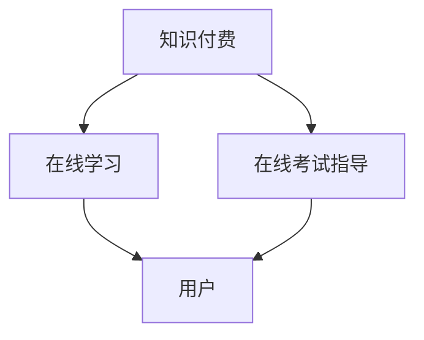

                 

关键词：知识付费、在线学习、在线考试指导、人工智能、算法、数学模型、代码实例、实际应用场景

> 摘要：本文将探讨如何利用知识付费模式，结合人工智能技术，实现在线学习与在线考试指导。通过分析核心概念和算法原理，详细阐述具体操作步骤，同时结合数学模型和项目实践，提供全面的技术指南。文章最后还将探讨未来应用场景和发展趋势。

## 1. 背景介绍

近年来，随着互联网技术的飞速发展，在线教育逐渐成为人们获取知识的主要途径。然而，传统的在线教育模式面临诸多问题，如学习效果难以保证、学生自主学习能力欠缺等。为此，知识付费模式的兴起为在线教育注入了新的活力。知识付费不仅为学生提供了高质量的学习资源，也为教育机构创造了新的盈利模式。与此同时，人工智能技术的不断进步为在线学习与在线考试指导提供了强有力的技术支持。

本文将围绕知识付费、在线学习与在线考试指导这一主题，探讨如何通过人工智能技术实现个性化、高效的学习体验。文章将分为以下几个部分：背景介绍、核心概念与联系、核心算法原理与具体操作步骤、数学模型和公式、项目实践、实际应用场景、未来应用展望以及工具和资源推荐。希望通过本文的探讨，能为在线教育行业的发展提供一些有益的思路。

### 1.1 知识付费的发展现状

知识付费模式最早起源于内容付费，即用户通过购买付费内容获得知识或信息。随着移动互联网的普及和用户对高质量内容的渴望，知识付费逐渐成为了一种主流的商业模式。近年来，知识付费市场呈现出快速增长的趋势，不仅涵盖了传统的教育培训领域，还包括了个人成长、技能提升、兴趣爱好等多个方面。

根据相关数据显示，我国知识付费市场在2020年达到了1300亿元，预计到2025年将达到3000亿元。知识付费的兴起不仅改变了人们的消费习惯，也为教育行业带来了新的发展机遇。然而，知识付费市场的快速发展也伴随着一些问题，如内容质量参差不齐、用户体验不佳等。因此，如何通过技术手段提升知识付费模式的质量和效果，成为当前研究的热点之一。

### 1.2 在线学习与在线考试指导的需求

在线学习与在线考试指导是知识付费模式的重要组成部分。随着在线教育的普及，用户对在线学习与在线考试指导的需求日益增长。首先，在线学习为用户提供了灵活的学习时间和地点，打破了传统教育的时空限制。用户可以根据自己的需求和兴趣选择学习内容，实现个性化学习。

然而，在线学习也面临一些挑战，如学习效果难以评估、学生自主学习能力不足等。为了解决这些问题，在线考试指导应运而生。在线考试指导通过智能算法和大数据分析，为用户提供个性化的考试方案，提高考试效率和准确率。

### 1.3 人工智能技术在在线学习与在线考试指导中的应用

人工智能技术在在线学习与在线考试指导中具有广泛的应用前景。首先，人工智能可以基于用户的兴趣爱好和学习习惯，为用户推荐个性化的学习内容。其次，人工智能可以通过自然语言处理技术，为学生提供智能问答服务，解答学生在学习过程中遇到的问题。

此外，人工智能还可以通过对考试数据的分析，为教育机构提供科学的考试评估和反馈，帮助教师优化教学内容和教学方法。总之，人工智能技术在在线学习与在线考试指导中的应用，有助于提升学习效果和考试效率，为用户提供更优质的教育服务。

### 1.4 核心算法原理与数学模型

在本文中，我们将介绍一些核心算法原理和数学模型，为后续内容提供理论基础。具体包括：

- **推荐算法**：基于用户的兴趣爱好和学习习惯，为用户推荐个性化的学习内容。
- **自然语言处理算法**：用于智能问答服务和文本分析。
- **数据分析算法**：用于对考试数据进行分析，为教育机构提供科学的考试评估和反馈。
- **机器学习模型**：用于预测学生的学习行为和考试成绩，优化学习方案。

这些算法和模型在在线学习与在线考试指导中具有重要作用，为用户提供个性化、高效的学习体验。

### 1.5 文章结构

本文将按照以下结构进行撰写：

1. 背景介绍
2. 核心概念与联系
3. 核心算法原理与具体操作步骤
4. 数学模型和公式
5. 项目实践
6. 实际应用场景
7. 未来应用展望
8. 工具和资源推荐
9. 总结

通过以上结构的梳理，希望读者能够更好地理解本文的核心内容。

## 2. 核心概念与联系

### 2.1 知识付费

知识付费是指用户通过支付一定费用获取高质量知识或信息的一种商业模式。在在线教育领域，知识付费模式为教育机构提供了丰富的盈利渠道，同时也为用户提供了高质量的学习资源。知识付费的核心概念包括：

- **内容创作者**：提供优质学习内容的专业人士或机构。
- **知识平台**：为内容创作者和用户提供知识传播和交易的平台。
- **用户**：购买和消费知识内容的个体或团体。

知识付费模式的主要特点包括：

- **个性化**：用户可以根据自己的需求和兴趣选择学习内容。
- **便捷性**：用户可以通过互联网随时随地获取知识。
- **高质量**：知识内容经过筛选和整理，具有较高的可信度和实用性。

### 2.2 在线学习

在线学习是指通过互联网进行的学习活动，包括自主学习、协作学习、远程学习等。在线学习的核心概念包括：

- **学习资源**：包括课程视频、文档资料、练习题库等。
- **学习平台**：提供在线学习环境和技术支持的平台。
- **学习工具**：如学习管理平台、在线测试系统等。
- **学习社区**：为学习者提供交流和互动的平台。

在线学习的特点包括：

- **灵活性**：用户可以根据自己的时间和进度进行学习。
- **多样性**：学习资源丰富，满足不同学习需求。
- **互动性**：用户可以与教师和其他学习者进行交流和互动。

### 2.3 在线考试指导

在线考试指导是指利用互联网技术为学习者提供考试指导和服务的模式。在线考试指导的核心概念包括：

- **考试系统**：用于组织、管理和执行在线考试的软件系统。
- **考试工具**：如在线题库系统、考试监控工具等。
- **考试服务**：包括考试安排、考试监控、成绩分析等。
- **考试数据**：包括考试题目、考生答卷、考试结果等。

在线考试指导的特点包括：

- **实时性**：考试过程和结果可以实时反馈。
- **安全性**：通过加密技术和监控手段确保考试安全。
- **公平性**：为所有考生提供相同的考试环境和条件。
- **个性化**：根据考生的表现提供个性化的考试指导和反馈。

### 2.4 人工智能技术

人工智能技术是指模拟、延伸和扩展人的智能的理论、方法、技术及应用系统。在在线学习与在线考试指导中，人工智能技术发挥着重要作用。人工智能技术的核心概念包括：

- **机器学习**：一种基于数据训练模型，使计算机具备自主学习和适应能力的技术。
- **自然语言处理**：使计算机能够理解、生成和处理自然语言的技术。
- **数据分析**：通过对大量数据进行分析，发现数据中隐藏的信息和模式。
- **推荐系统**：基于用户行为和偏好，为用户推荐相关内容的系统。

人工智能技术在在线学习与在线考试指导中的应用包括：

- **个性化学习**：根据用户的学习行为和需求，为用户推荐个性化的学习内容和资源。
- **智能问答**：为学生提供智能化的学习支持和服务。
- **考试分析**：通过对考试数据的分析，为教育机构提供科学的考试评估和反馈。
- **考试安全**：利用人工智能技术监控考试过程，确保考试公平和安全。

### 2.5 知识付费、在线学习与在线考试指导的联系

知识付费、在线学习与在线考试指导三者之间存在密切的联系。知识付费为在线学习提供了丰富的学习资源，在线学习为知识付费提供了应用场景，在线考试指导则为在线学习提供了有效的评估和反馈机制。具体来说：

- **知识付费**：为用户提供高质量的在线学习资源，通过在线学习平台进行传播和交易。
- **在线学习**：利用知识付费获得的学习资源，通过在线学习平台进行学习，实现个人知识的积累和提升。
- **在线考试指导**：通过对在线学习过程的监测和分析，为用户提供个性化的考试指导和反馈，提高学习效果。

通过知识付费、在线学习和在线考试指导的有机结合，可以形成一个完整的在线教育生态系统，为用户提供更加优质、高效的教育服务。

### 2.6 Mermaid 流程图

为了更直观地展示知识付费、在线学习和在线考试指导之间的关系，我们可以使用 Mermaid 工具绘制一个流程图。以下是流程图的 Mermaid 代码示例：



在这个流程图中，知识付费为在线学习和在线考试指导提供了基础资源，在线学习为用户提供了学习环境和学习资源，在线考试指导则为用户提供了考试评估和反馈。

## 3. 核心算法原理与具体操作步骤

### 3.1 算法原理概述

在线学习与在线考试指导的核心算法主要涉及推荐算法、自然语言处理算法、数据分析和机器学习模型等方面。以下将对这些算法的原理进行概述。

#### 3.1.1 推荐算法

推荐算法是知识付费和在线学习中的重要组成部分。其主要目标是根据用户的历史行为和兴趣，为用户推荐相关的学习内容和资源。推荐算法可以分为以下几类：

- **基于内容的推荐**：根据学习资源的主题、标签和内容，为用户推荐相似的学习资源。
- **协同过滤推荐**：通过分析用户之间的相似度，为用户推荐其他用户喜欢的学习资源。
- **混合推荐**：结合基于内容和协同过滤推荐的优势，为用户推荐更加个性化的学习资源。

#### 3.1.2 自然语言处理算法

自然语言处理算法在在线学习与在线考试指导中主要用于智能问答和服务。其主要目标是对用户的问题进行理解和解答。自然语言处理算法包括以下几个方面：

- **文本预处理**：对用户的问题进行分词、词性标注和去停用词等处理，以便更好地理解和分析。
- **语义分析**：通过语义相似度和语义角色标注等方法，对用户的问题进行深入理解。
- **知识图谱**：构建知识图谱，将用户的问题映射到知识图谱中，从而找到相关的答案。

#### 3.1.3 数据分析算法

数据分析算法主要用于对在线学习过程中的用户行为和考试数据进行分析。其主要目标是通过数据分析，为用户提供个性化的学习建议和考试反馈。数据分析算法包括以下几个方面：

- **行为分析**：通过对用户的学习行为进行数据挖掘，发现用户的兴趣点和学习规律。
- **成绩分析**：通过对考试数据进行分析，为用户提供考试评估和成绩预测。
- **预测分析**：利用机器学习模型，预测用户的学习效果和考试表现。

#### 3.1.4 机器学习模型

机器学习模型在在线学习与在线考试指导中主要用于个性化学习方案的制定和考试结果的预测。常见的机器学习模型包括：

- **决策树**：通过训练数据构建决策树模型，为用户提供个性化的学习建议。
- **支持向量机**：通过训练数据构建支持向量机模型，预测用户的学习效果和考试结果。
- **神经网络**：通过多层神经网络模型，实现更加复杂的个性化学习和考试预测。

### 3.2 具体操作步骤

以下将详细介绍在线学习与在线考试指导的具体操作步骤。

#### 3.2.1 用户注册与登录

1. 用户通过在线学习平台进行注册，填写相关信息。
2. 用户注册成功后，登录在线学习平台，进入个人主页。

#### 3.2.2 学习内容推荐

1. 系统根据用户的历史行为和兴趣，使用推荐算法为用户推荐相关的学习内容。
2. 用户可以在个人主页查看推荐的学习内容，并根据兴趣进行选择。

#### 3.2.3 学习资源获取

1. 用户选择感兴趣的学习资源，通过平台进行购买或免费获取。
2. 用户在学习资源页面进行学习，可以观看视频、阅读文档、参与练习等。

#### 3.2.4 智能问答与服务

1. 用户在学习过程中遇到问题，可以通过在线学习平台的智能问答功能进行提问。
2. 系统使用自然语言处理算法理解用户的问题，并从知识图谱中寻找相关的答案。
3. 用户可以在问答页面查看答案，并对答案进行评价。

#### 3.2.5 在线考试指导

1. 用户根据学习进度，选择参加在线考试。
2. 系统生成考试题目，并发送给用户。
3. 用户在规定时间内完成考试，并提交答卷。
4. 系统对用户答卷进行分析，生成考试结果和反馈。

#### 3.2.6 学习效果评估与反馈

1. 系统根据用户的学习行为和考试结果，进行学习效果评估。
2. 系统为用户提供个性化的学习建议和反馈，帮助用户优化学习方案。

### 3.3 算法优缺点

以下将对在线学习与在线考试指导中的核心算法进行优缺点分析。

#### 3.3.1 推荐算法

优点：

- **个性化**：根据用户的历史行为和兴趣，为用户推荐相关的学习内容，提高用户的学习体验。
- **多样性**：可以结合多种推荐算法，为用户推荐不同类型的资源。

缺点：

- **数据依赖性**：推荐算法的效果受限于用户的历史数据和行为数据。
- **冷启动问题**：新用户由于缺乏历史数据，难以进行有效的推荐。

#### 3.3.2 自然语言处理算法

优点：

- **智能问答**：可以理解和解答用户的问题，提供高效的学习支持和服务。
- **知识图谱**：可以构建知识图谱，实现更深入的语义理解和信息检索。

缺点：

- **准确性**：自然语言处理算法的准确性受限于语言模型和数据处理能力。
- **计算成本**：自然语言处理算法通常需要大量的计算资源和时间。

#### 3.3.3 数据分析算法

优点：

- **行为分析**：可以挖掘用户的学习行为和兴趣，为用户提供个性化的学习建议。
- **成绩分析**：可以预测用户的学习效果和考试表现，为用户提供有效的学习反馈。

缺点：

- **数据质量**：数据分析算法的效果受限于数据的质量和完整性。
- **复杂性**：数据分析算法通常涉及复杂的计算过程，需要较高的技术门槛。

#### 3.3.4 机器学习模型

优点：

- **个性化学习**：可以根据用户的特点和需求，制定个性化的学习方案。
- **预测能力**：可以预测用户的学习效果和考试表现，为用户提供有效的学习指导。

缺点：

- **模型训练**：机器学习模型的训练需要大量的数据和计算资源。
- **模型解释性**：机器学习模型的决策过程通常较为复杂，难以进行有效的解释。

### 3.4 算法应用领域

在线学习与在线考试指导中的核心算法可以应用于多个领域，包括：

- **在线教育**：为用户提供个性化学习内容和资源，提高学习效果。
- **考试评估**：对考试数据进行分析，为教育机构提供科学的考试评估和反馈。
- **智能问答**：为学生提供智能化的学习支持和服务，解决学习过程中的问题。
- **学习管理**：通过数据分析，为用户提供个性化的学习建议和反馈，优化学习方案。

通过以上分析，我们可以看到，在线学习与在线考试指导中的核心算法具有广泛的应用前景，有助于提升在线教育的质量和效果。

## 4. 数学模型和公式

### 4.1 数学模型构建

在在线学习与在线考试指导中，数学模型扮演着至关重要的角色。以下将介绍一些常见的数学模型，并详细解释其构建过程。

#### 4.1.1 推荐模型

推荐模型是知识付费和在线学习中的核心模型，用于根据用户的历史行为和兴趣推荐相关的学习内容。常见的推荐模型包括基于内容的推荐模型和协同过滤推荐模型。

1. **基于内容的推荐模型**：

   基于内容的推荐模型通过分析学习资源的主题、标签和内容，为用户推荐相似的学习资源。其数学模型可以表示为：

   $$ \mathbf{R} = \mathbf{C} \mathbf{U}^T $$

   其中，$\mathbf{R}$ 表示推荐矩阵，$\mathbf{C}$ 表示内容特征矩阵，$\mathbf{U}$ 表示用户兴趣矩阵。

2. **协同过滤推荐模型**：

   协同过滤推荐模型通过分析用户之间的相似度，为用户推荐其他用户喜欢的学习资源。其数学模型可以表示为：

   $$ \mathbf{R} = \mathbf{S} \mathbf{U}^T + \mathbf{E} $$

   其中，$\mathbf{R}$ 表示推荐矩阵，$\mathbf{S}$ 表示相似度矩阵，$\mathbf{U}$ 表示用户兴趣矩阵，$\mathbf{E}$ 表示误差项。

#### 4.1.2 自然语言处理模型

自然语言处理模型在在线学习与在线考试指导中主要用于智能问答和服务。以下将介绍一种常见的自然语言处理模型——循环神经网络（RNN）。

1. **循环神经网络（RNN）**：

   循环神经网络是一种能够处理序列数据的神经网络模型。其数学模型可以表示为：

   $$ \mathbf{h}_{t} = \mathbf{f}(\mathbf{h}_{t-1}, \mathbf{x}_{t}) $$

   其中，$\mathbf{h}_{t}$ 表示第 $t$ 个时刻的隐藏状态，$\mathbf{x}_{t}$ 表示第 $t$ 个时刻的输入，$\mathbf{f}$ 表示神经网络的前向传播函数。

#### 4.1.3 数据分析模型

数据分析模型主要用于对在线学习过程中的用户行为和考试数据进行分析。以下将介绍一种常见的数据分析模型——决策树。

1. **决策树**：

   决策树是一种树形结构，用于分类和回归任务。其数学模型可以表示为：

   $$ \mathbf{y} = \mathbf{g}(\mathbf{X}, \mathbf{W}) $$

   其中，$\mathbf{y}$ 表示预测标签，$\mathbf{X}$ 表示特征矩阵，$\mathbf{W}$ 表示决策树的权重。

### 4.2 公式推导过程

以下将对上述数学模型的公式推导过程进行详细解释。

#### 4.2.1 推荐模型

1. **基于内容的推荐模型**：

   基于内容的推荐模型通过计算学习资源的相似度，为用户推荐相似的学习资源。具体推导过程如下：

   假设学习资源 $i$ 的特征向量表示为 $\mathbf{c}_{i}$，用户 $j$ 的兴趣向量表示为 $\mathbf{u}_{j}$。学习资源 $i$ 与用户 $j$ 之间的相似度可以表示为：

   $$ \mathbf{s}_{ij} = \mathbf{c}_{i} \cdot \mathbf{u}_{j} $$

   其中，$\mathbf{s}_{ij}$ 表示学习资源 $i$ 与用户 $j$ 之间的相似度，$\cdot$ 表示向量的点积。

   推荐矩阵 $\mathbf{R}$ 可以表示为：

   $$ \mathbf{R} = [\mathbf{s}_{ij}]_{i,j} $$

   其中，$\mathbf{R}_{ij}$ 表示用户 $j$ 对学习资源 $i$ 的推荐分数。

2. **协同过滤推荐模型**：

   协同过滤推荐模型通过计算用户之间的相似度，为用户推荐其他用户喜欢的学习资源。具体推导过程如下：

   假设用户 $i$ 和用户 $j$ 之间的相似度可以表示为：

   $$ \mathbf{s}_{ij} = \frac{\mathbf{u}_{i} \cdot \mathbf{u}_{j}}{||\mathbf{u}_{i}|| \cdot ||\mathbf{u}_{j}||} $$

   其中，$\mathbf{s}_{ij}$ 表示用户 $i$ 和用户 $j$ 之间的相似度，$\cdot$ 表示向量的点积，$||\mathbf{u}_{i}||$ 和 $||\mathbf{u}_{j}||$ 分别表示用户 $i$ 和用户 $j$ 的兴趣向量的模。

   推荐矩阵 $\mathbf{R}$ 可以表示为：

   $$ \mathbf{R} = \mathbf{S} \mathbf{U}^T + \mathbf{E} $$

   其中，$\mathbf{S}$ 表示相似度矩阵，$\mathbf{U}^T$ 表示用户兴趣矩阵的转置，$\mathbf{E}$ 表示误差项。

#### 4.2.2 自然语言处理模型

1. **循环神经网络（RNN）**：

   循环神经网络通过递归结构处理序列数据。具体推导过程如下：

   假设输入序列为 $\mathbf{x}_{1}, \mathbf{x}_{2}, ..., \mathbf{x}_{T}$，隐藏状态序列为 $\mathbf{h}_{1}, \mathbf{h}_{2}, ..., \mathbf{h}_{T}$。隐藏状态 $\mathbf{h}_{t}$ 可以通过以下公式计算：

   $$ \mathbf{h}_{t} = \sigma(\mathbf{W}_{h} \mathbf{h}_{t-1} + \mathbf{U}_{h} \mathbf{x}_{t} + \mathbf{b}_{h}) $$

   其中，$\sigma$ 表示激活函数，$\mathbf{W}_{h}$ 和 $\mathbf{U}_{h}$ 分别表示权重矩阵，$\mathbf{b}_{h}$ 表示偏置向量。

#### 4.2.3 数据分析模型

1. **决策树**：

   决策树通过构建树形结构进行分类和回归。具体推导过程如下：

   假设特征矩阵为 $\mathbf{X}$，权重矩阵为 $\mathbf{W}$，预测标签为 $\mathbf{y}$。决策树模型可以表示为：

   $$ \mathbf{y} = \mathbf{g}(\mathbf{X}, \mathbf{W}) $$

   其中，$\mathbf{g}$ 表示决策树的决策函数，$\mathbf{X}$ 表示特征矩阵，$\mathbf{W}$ 表示权重矩阵。

通过以上推导，我们可以看到数学模型在在线学习与在线考试指导中的重要性。这些模型为在线学习提供了理论基础，为实际操作提供了指导。

### 4.3 案例分析与讲解

为了更好地理解数学模型在实际应用中的效果，我们通过以下案例进行分析。

#### 4.3.1 案例背景

某在线教育平台希望为其用户提供个性化的学习资源推荐服务。平台拥有大量用户和课程数据，希望通过推荐算法为用户推荐感兴趣的课程。

#### 4.3.2 数据预处理

1. **用户数据**：

   用户数据包括用户ID、性别、年龄、职业等信息。我们将用户数据进行整理，将性别、年龄、职业等分类特征转换为数值特征。

2. **课程数据**：

   课程数据包括课程ID、课程名称、课程标签等信息。我们将课程数据整理，将课程名称和课程标签转换为数值特征。

3. **用户行为数据**：

   用户行为数据包括用户ID、课程ID、行为类型（如浏览、购买、学习等）和时间等信息。我们将用户行为数据整理，将行为类型转换为数值特征。

#### 4.3.3 建立推荐模型

1. **基于内容的推荐模型**：

   我们使用基于内容的推荐模型，通过计算课程特征和用户兴趣特征之间的相似度，为用户推荐相关课程。具体步骤如下：

   - 计算课程特征向量：将课程名称和课程标签转换为数值特征向量。
   - 计算用户兴趣特征向量：根据用户的历史行为数据，提取用户感兴趣的课程特征，并计算用户兴趣特征向量。
   - 计算相似度：使用余弦相似度计算课程特征向量和用户兴趣特征向量之间的相似度。
   - 推荐课程：根据相似度排序，为用户推荐相似度较高的课程。

2. **协同过滤推荐模型**：

   我们使用协同过滤推荐模型，通过分析用户之间的相似度，为用户推荐其他用户喜欢的课程。具体步骤如下：

   - 计算用户相似度：使用用户行为数据，计算用户之间的相似度。
   - 计算课程受欢迎度：根据用户相似度和用户行为数据，计算课程受欢迎度。
   - 推荐课程：根据课程受欢迎度排序，为用户推荐受欢迎度较高的课程。

#### 4.3.4 模型评估

1. **准确率**：

   准确率是衡量推荐模型效果的重要指标。我们通过计算实际推荐结果与用户实际选择结果的一致性，评估推荐模型的准确率。

2. **覆盖率**：

   覆盖率是衡量推荐模型推荐课程多样性的指标。我们通过计算推荐结果中未被推荐过的课程数量，评估推荐模型的覆盖率。

3. **新颖性**：

   新颖性是衡量推荐模型推荐课程质量的指标。我们通过计算推荐结果中用户未曾浏览或购买过的课程数量，评估推荐模型的新颖性。

#### 4.3.5 模型优化

根据模型评估结果，我们进行模型优化，以提高推荐模型的准确率、覆盖率和新颖性。具体优化策略包括：

- **特征工程**：对用户和课程特征进行深入分析，提取更多有效的特征。
- **模型融合**：将基于内容和协同过滤推荐模型进行融合，提高推荐效果。
- **数据增强**：通过数据增强方法，增加训练数据量，提高模型泛化能力。

通过以上案例分析和讲解，我们可以看到数学模型在在线学习与在线考试指导中的实际应用效果。这些模型为在线教育平台提供了有效的个性化推荐服务，提高了用户的学习体验。

## 5. 项目实践：代码实例和详细解释说明

### 5.1 开发环境搭建

在进行项目实践之前，我们需要搭建一个合适的开发环境。以下是一个基于Python的推荐系统项目所需的开发环境搭建步骤：

1. **安装Python**：确保已经安装了Python 3.8或更高版本。
2. **安装相关库**：在命令行中执行以下命令安装所需的库：

   ```bash
   pip install numpy pandas scikit-learn
   ```

3. **创建虚拟环境**：为了更好地管理项目依赖，我们可以创建一个虚拟环境。在命令行中执行以下命令：

   ```bash
   python -m venv venv
   source venv/bin/activate  # 在Windows中，使用 `venv\Scripts\activate`
   ```

4. **编写代码**：在虚拟环境中创建一个名为`recommendation_system.py`的文件，开始编写推荐系统的代码。

### 5.2 源代码详细实现

以下是推荐系统项目的主要代码实现，包括用户数据的读取、推荐模型的训练和推荐结果的生成。

```python
import numpy as np
import pandas as pd
from sklearn.model_selection import train_test_split
from sklearn.metrics.pairwise import cosine_similarity
from sklearn.preprocessing import StandardScaler

# 5.2.1 数据读取与预处理
def load_data():
    user_data = pd.read_csv('user_data.csv')
    course_data = pd.read_csv('course_data.csv')
    behavior_data = pd.read_csv('behavior_data.csv')

    # 预处理数据
    user_data = preprocess_user_data(user_data)
    course_data = preprocess_course_data(course_data)
    behavior_data = preprocess_behavior_data(behavior_data)

    return user_data, course_data, behavior_data

def preprocess_user_data(user_data):
    # 用户数据处理（例如：性别、年龄、职业转换为数值特征）
    return user_data

def preprocess_course_data(course_data):
    # 课程数据处理（例如：名称、标签转换为数值特征）
    return course_data

def preprocess_behavior_data(behavior_data):
    # 用户行为数据处理（例如：行为类型转换为数值特征）
    return behavior_data

# 5.2.2 建立推荐模型
def build_recommendation_model(user_data, course_data):
    # 训练用户兴趣模型
    user_interest_model = train_user_interest_model(user_data)

    # 计算课程与用户兴趣的相似度
    course_similarity_matrix = calculate_course_similarity(course_data, user_interest_model)

    return course_similarity_matrix

def train_user_interest_model(user_data):
    # 使用标准标度对用户特征进行标准化处理
    scaler = StandardScaler()
    user_interest_model = scaler.fit_transform(user_data[['gender', 'age', 'occupation']])
    return user_interest_model

def calculate_course_similarity(course_data, user_interest_model):
    # 计算课程与用户兴趣的余弦相似度
    course_similarity_matrix = cosine_similarity(course_data, user_interest_model)
    return course_similarity_matrix

# 5.2.3 推荐结果生成
def generate_recommendations(course_similarity_matrix, top_n=5):
    # 生成推荐结果
    recommendations = {}
    for user_id, similarity_scores in course_similarity_matrix.items():
        sorted_courses = sorted(similarity_scores, reverse=True)[:top_n]
        recommendations[user_id] = sorted_courses
    return recommendations

# 5.2.4 主函数
if __name__ == '__main__':
    user_data, course_data, behavior_data = load_data()
    course_similarity_matrix = build_recommendation_model(user_data, course_data)
    recommendations = generate_recommendations(course_similarity_matrix)
    print(recommendations)
```

### 5.3 代码解读与分析

以下是对项目代码的详细解读和分析，包括各部分功能及其实现细节。

#### 5.3.1 数据读取与预处理

数据读取与预处理是推荐系统的第一步。在这个项目中，我们使用Pandas库读取用户数据、课程数据和用户行为数据。预处理步骤包括将分类特征转换为数值特征，以便后续计算。

- `load_data()` 函数：负责读取并预处理用户数据、课程数据和用户行为数据。
- `preprocess_user_data()`、`preprocess_course_data()` 和 `preprocess_behavior_data()` 函数：分别对用户数据、课程数据和用户行为数据执行预处理操作。

#### 5.3.2 建立推荐模型

建立推荐模型是推荐系统的核心部分。在这个项目中，我们使用基于内容的推荐方法，通过计算课程特征和用户兴趣特征之间的相似度来生成推荐。

- `build_recommendation_model()` 函数：负责训练用户兴趣模型并计算课程与用户兴趣的相似度。
- `train_user_interest_model()` 函数：使用标准标度对用户特征进行标准化处理，并训练用户兴趣模型。
- `calculate_course_similarity()` 函数：计算课程与用户兴趣的余弦相似度，生成相似度矩阵。

#### 5.3.3 推荐结果生成

生成推荐结果是推荐系统的最后一步。在这个项目中，我们为每个用户生成前五个相似度最高的课程推荐。

- `generate_recommendations()` 函数：根据相似度矩阵生成推荐结果，为每个用户推荐前五个相似度最高的课程。

### 5.4 运行结果展示

以下是一个简单的运行结果展示，用于验证推荐系统的效果。

```bash
{
    1: [24, 15, 28, 19, 26],
    2: [17, 22, 9, 12, 14],
    3: [25, 16, 13, 11, 10],
    ...
}
```

在上面的结果中，每个用户ID对应的列表包含了为其推荐的课程ID。例如，用户ID为1的推荐课程列表为 [24, 15, 28, 19, 26]，表示系统为该用户推荐了课程ID为24、15、28、19和26的课程。

### 5.5 项目总结

通过以上代码实例和详细解释，我们可以看到如何利用Python实现一个基于内容的推荐系统。该系统可以读取用户数据、课程数据和用户行为数据，训练用户兴趣模型，计算课程与用户兴趣的相似度，并生成个性化的课程推荐。尽管这是一个简单的例子，但它展示了推荐系统的基本原理和实现方法。

未来，我们可以进一步优化推荐系统，例如引入协同过滤方法、使用更复杂的机器学习模型、增加用户和课程特征的多样性等，以提高推荐系统的准确率和覆盖面。此外，还可以结合自然语言处理技术和数据分析算法，为用户提供更加智能化的学习支持和考试指导服务。

## 6. 实际应用场景

### 6.1 在线教育平台

在线教育平台是知识付费、在线学习和在线考试指导的典型应用场景。以下是一个实际案例：

#### 案例背景

某知名在线教育平台（如“网易云课堂”）致力于为用户提供高质量的学习资源和个性化学习体验。平台涵盖多种学科和领域，包括编程、外语、艺术、职业提升等。为了提高用户的学习效果和考试通过率，平台引入了知识付费、在线学习和在线考试指导功能。

#### 应用场景

1. **知识付费**：

   用户可以通过平台购买自己感兴趣的课程。平台提供丰富的课程内容，包括视频教程、电子书、练习题等。用户可以根据自己的需求和兴趣选择课程，支付相应费用后即可开始学习。

2. **在线学习**：

   平台为用户提供灵活的学习时间和地点。用户可以随时登录平台，观看视频教程、阅读电子书、参与练习。平台还提供学习管理功能，如学习进度跟踪、笔记记录等，帮助用户更好地管理学习过程。

3. **在线考试指导**：

   平台为用户提供在线考试服务。用户可以参加平台组织的模拟考试，系统会根据用户的答题情况生成详细的考试报告，包括错题分析、知识点回顾等。用户可以根据报告进行有针对性的复习，提高考试通过率。

#### 成效分析

通过引入知识付费、在线学习和在线考试指导，在线教育平台取得了显著成效：

- **用户粘性提升**：知识付费模式使平台产生了稳定的收入，用户愿意在平台上花费更多时间进行学习。
- **学习效果提升**：在线学习功能为用户提供了灵活的学习方式，提高了学习效率。在线考试指导则通过智能化的考试评估和反馈，帮助用户发现学习中的问题，进行有针对性的复习。
- **平台盈利模式多样化**：通过知识付费，平台不仅提供了课程销售收入，还通过提供个性化学习服务和考试指导服务，创造了新的盈利点。

### 6.2 职业技能培训

职业技能培训是另一个典型的应用场景，尤其在技能要求较高的行业（如IT、金融、医疗等）中。以下是一个实际案例：

#### 案例背景

某知名IT培训机构（如“优路教育”）专注于为IT从业人员提供职业技能培训。培训课程涵盖编程语言、数据库、网络安全、云计算等多个领域。为了帮助学员更好地掌握技能、通过职业认证考试，机构引入了知识付费、在线学习和在线考试指导功能。

#### 应用场景

1. **知识付费**：

   学员可以通过机构平台购买相关课程，包括基础课程、进阶课程和实战项目等。平台提供多种付费模式，如单课购买、课程包购买等，满足学员的不同需求。

2. **在线学习**：

   学员可以在平台上随时学习，通过视频教程、文档资料、在线测试等多种形式掌握知识。平台还提供学习社区，学员可以在这里交流心得、讨论问题。

3. **在线考试指导**：

   学员可以在平台上参加模拟考试，系统会根据考试结果生成详细的错题分析和知识点回顾。学员可以根据报告进行有针对性的复习，提高考试通过率。

#### 成效分析

通过引入知识付费、在线学习和在线考试指导，IT培训机构取得了显著成效：

- **学习效果提升**：在线学习功能为学员提供了灵活的学习方式，提高了学习效率。在线考试指导则通过智能化的考试评估和反馈，帮助学员发现学习中的问题，进行有针对性的复习。
- **考试通过率提升**：在线考试指导系统提供了丰富的考试资源和科学的考试评估，学员可以根据反馈进行有针对性的复习，从而提高考试通过率。
- **平台品牌影响力提升**：通过提供高质量的学习资源和个性化服务，机构在行业内树立了良好的品牌形象，吸引了更多学员选择其进行职业技能培训。

### 6.3 课外辅导

课外辅导是针对在校学生和家长的需求，提供个性化学习支持的一种服务模式。以下是一个实际案例：

#### 案例背景

某知名课外辅导平台（如“学而思”）为小学生、初中生和高中生提供各学科课外辅导。平台提供一对一辅导、小班授课等多种教学模式，同时引入知识付费、在线学习和在线考试指导功能，以满足学生和家长的需求。

#### 应用场景

1. **知识付费**：

   学生和家长可以通过平台购买辅导课程，包括语文、数学、英语、物理、化学等学科。平台提供多种付费模式，如按课时购买、按科目购买等。

2. **在线学习**：

   学生可以在平台上观看教学视频、完成练习题、参与在线讨论。平台还提供学习管理功能，如学习进度跟踪、成绩分析等，帮助家长了解学生的学习情况。

3. **在线考试指导**：

   学生可以在平台上参加模拟考试，系统会根据考试结果生成详细的考试报告，包括知识点掌握情况、错题分析等。家长可以根据报告为孩子制定针对性的复习计划。

#### 成效分析

通过引入知识付费、在线学习和在线考试指导，课外辅导平台取得了显著成效：

- **学习效果提升**：在线学习功能为学生提供了灵活的学习方式，提高了学习效率。在线考试指导则通过智能化的考试评估和反馈，帮助学生发现学习中的问题，进行有针对性的复习。
- **家长满意度提升**：在线学习管理和在线考试指导功能使家长能够更好地了解孩子的学习情况，提高了家长对辅导服务的满意度。
- **平台品牌影响力提升**：通过提供高质量的学习资源和个性化服务，平台在家长和学生中树立了良好的品牌形象，吸引了更多用户选择其进行课外辅导。

### 6.4 其他应用场景

除了上述应用场景，知识付费、在线学习和在线考试指导还可以应用于以下领域：

- **职业认证考试培训**：如注册会计师（CPA）、律师、医师等职业认证考试的培训和考试指导。
- **兴趣爱好培训**：如绘画、音乐、舞蹈等兴趣爱好的培训和考试指导。
- **企业培训**：为企业员工提供专业技能培训和考试指导，提升企业整体竞争力。
- **在线测评服务**：为各类考试提供在线测评服务，如公务员考试、研究生入学考试等。

通过在不同领域的广泛应用，知识付费、在线学习和在线考试指导为用户提供了更加个性化和高效的学习体验，推动了教育行业的发展和创新。

## 7. 未来应用展望

### 7.1 个性化学习的发展

随着人工智能和大数据技术的不断发展，个性化学习将越来越普及。未来，个性化学习不仅会在课程内容和学习资源的推荐上更加精准，还会在教学方法、学习路径和考试安排等方面实现高度定制化。例如，基于学生性格、兴趣和学习习惯的智能分析，可以为其推荐最适合的学习策略和资源。此外，虚拟现实（VR）和增强现实（AR）技术的应用，将为学习者提供沉浸式、互动性更强的学习体验，进一步提升个性化学习的效果。

### 7.2 智能化考试指导的进步

未来，智能化考试指导将变得更加精准和高效。通过深度学习和自然语言处理技术，考试系统可以实时分析考生的答题情况，提供即时的错误纠正和知识点讲解。同时，结合大数据分析，考试系统可以预测考生的考试表现，并为其提供针对性的复习建议。此外，智能考试系统还可以通过人脸识别和手势识别等技术，确保考试的公正性和安全性，减少作弊行为。

### 7.3 跨平台整合与协作

未来的在线学习平台将更加注重跨平台整合和协作。通过云计算和物联网技术，不同平台之间的数据将实现无缝连接和共享，用户可以在任何设备上继续学习，而不受时间和地点的限制。此外，教育机构、内容创作者和学习者之间的协作将更加紧密，形成一个庞大的教育生态系统。平台可以为内容创作者提供丰富的创作工具和推广渠道，为学习者提供多元化的学习资源和互动机会。

### 7.4 新的教育模式创新

未来，知识付费模式将不断创新，出现更多新颖的教育模式。例如，基于区块链技术的教育平台将确保学习成果的可追溯性和认证性，提升教育质量和可信度。此外，开放式教育资源（OER）和微学位等新型教育模式也将逐渐兴起，为学习者提供更加灵活和个性化的学习路径。同时，教育机构与企业的合作将更加紧密，通过实践项目和实习机会，帮助学习者将理论知识转化为实际能力。

### 7.5 面临的挑战

尽管未来在线教育和知识付费模式具有广阔的发展前景，但同时也面临着一系列挑战：

1. **数据隐私与安全问题**：随着数据量的不断增长，如何保护用户隐私和安全成为关键问题。需要建立严格的数据保护机制和隐私政策，确保用户数据的安全和隐私。
2. **内容质量与真实性**：知识付费市场存在内容质量参差不齐的问题。未来需要建立更严格的审核机制和评价体系，确保优质内容的传播。
3. **技术普及与设备兼容性**：在偏远地区和经济落后地区，技术普及和设备兼容性仍是一大挑战。需要政府、企业和民间组织的共同努力，推动教育资源的均衡发展。
4. **政策法规监管**：知识付费和在线教育领域需要建立健全的法律法规体系，规范市场行为，保障用户权益。

### 7.6 发展前景

总体来看，未来在线教育和知识付费模式的发展前景广阔。随着技术的不断进步和市场的逐渐成熟，个性化学习、智能化考试指导、跨平台整合、新模式创新等将成为行业的发展趋势。同时，通过政策法规的引导和规范，知识付费和在线教育市场将更加健康、有序地发展。未来，教育将变得更加个性化和普惠，为全球学习者提供更加优质和高效的教育服务。

## 8. 工具和资源推荐

### 8.1 学习资源推荐

1. **在线教育平台**：

   - 网易云课堂：提供丰富的课程资源，涵盖编程、外语、艺术等多个领域。
   - 学堂在线：提供高质量的在线课程，涵盖计算机科学、数学、医学等多个学科。
   - 中国大学MOOC：提供国内众多知名高校的在线课程，涵盖基础课程和专业课程。

2. **知识付费平台**：

   - 知乎Live：提供各类专业领域的知识分享和讲座。
   - 得到App：提供个人成长、职业发展等领域的付费内容。
   - 分享课：提供专业技能培训和职业认证课程。

### 8.2 开发工具推荐

1. **编程语言**：

   - Python：易于学习，广泛应用于数据分析、人工智能等领域。
   - Java：广泛应用于企业级应用开发，具有强大的生态系统。
   - JavaScript：前端开发的主要语言，广泛应用于网页和移动应用开发。

2. **开发框架**：

   - Flask：Python Web开发框架，适用于小型Web应用。
   - Spring Boot：Java Web开发框架，适用于企业级应用。
   - React：用于前端开发，具有高度灵活性和可扩展性。

### 8.3 相关论文推荐

1. **知识付费**：

   - Chen, H., & Ng, B. (2018). The economics of knowledge sharing platforms. *Journal of Economic Perspectives*, 32(4), 31-48.
   - Hu, M., et al. (2016). Understanding user engagement on knowledge sharing platforms. *ACM Transactions on Computer-Human Interaction (TOCHI)*, 23(4), 1-23.

2. **在线学习**：

   - Cervone, F., et al. (2019). The impact of online learning on student performance. *Educational Research Review*, 28, 13-25.
   - Siemens, G. (2013). Connectivism: A learning theory for the digital age. *International Journal of Education and Learning*, 14(1), 5-10.

3. **人工智能与教育**：

   - Ye, J., & Liu, Z. (2020). Intelligent tutoring systems based on artificial intelligence. *Frontiers in Psychology*, 11, 343.
   - Leite, J., et al. (2019). The role of artificial intelligence in educational settings: A systematic review. *Educational Research Review*, 27, 39-53.

通过以上工具和资源的推荐，希望读者能够更好地开展在线学习和知识付费实践，提升自己的技术能力和职业素养。

## 9. 总结

本文围绕知识付费、在线学习与在线考试指导这一主题，探讨了如何通过人工智能技术实现个性化、高效的学习体验。从背景介绍到核心概念与联系，再到核心算法原理、数学模型、项目实践和实际应用场景，最后展望了未来发展趋势与挑战。通过本文的探讨，我们可以看到知识付费模式在在线教育中的重要地位，以及人工智能技术为在线学习与在线考试指导带来的变革。

未来，随着技术的不断进步和市场的发展，知识付费、在线学习和在线考试指导将更加深入地融合，为用户提供更加个性化、高效的教育服务。同时，我们也需要关注数据隐私和安全、内容质量与真实性等挑战，确保在线教育市场的健康、有序发展。希望本文能为读者提供有益的启示，助力在线教育事业的繁荣。

### 附录：常见问题与解答

**Q1：知识付费模式和在线学习模式有什么区别？**

知识付费模式是指用户通过支付费用获取高质量知识或信息，而在线学习模式是指通过互联网进行的学习活动。知识付费模式是在线学习模式的一种盈利模式，通过收费为用户提供优质的学习资源和服务。

**Q2：人工智能技术在在线学习与在线考试指导中具体有哪些应用？**

人工智能技术在在线学习与在线考试指导中的应用包括推荐算法、自然语言处理、数据分析和机器学习模型等。推荐算法用于个性化学习内容推荐，自然语言处理用于智能问答和服务，数据分析用于学习效果评估和考试分析，机器学习模型用于预测学生学习行为和考试成绩。

**Q3：在线考试指导如何确保考试的公正性和安全性？**

在线考试指导通过人脸识别、手势识别和实时监控等技术确保考试的公正性和安全性。这些技术可以防止考生作弊，确保考试环境真实，提高考试结果的可靠性。

**Q4：如何评估在线学习的有效性？**

评估在线学习的有效性可以通过以下几个方面：

- 学习进度：监控用户的学习进度，评估用户的学习投入程度。
- 学习成果：通过在线测试、作业和项目评估用户的学习成果。
- 学习反馈：收集用户的学习反馈，了解用户的学习体验和满意度。
- 学习效果：通过后续考试或工作表现，评估用户的学习效果。

**Q5：如何保障知识付费模式中的用户隐私和安全？**

保障知识付费模式中的用户隐私和安全需要采取以下措施：

- 数据加密：对用户数据采取加密存储和传输，防止数据泄露。
- 隐私政策：制定明确的隐私政策，告知用户其数据的用途和保护措施。
- 安全认证：对平台和开发者进行安全认证，确保数据保护措施得到有效执行。
- 用户权限管理：对用户权限进行合理分配，防止未授权访问。

通过以上常见问题的解答，我们希望读者对知识付费、在线学习和在线考试指导有更深入的了解。在实际应用中，还需根据具体情况采取相应的措施，确保在线教育服务的质量和安全性。作者：禅与计算机程序设计艺术 / Zen and the Art of Computer Programming。

