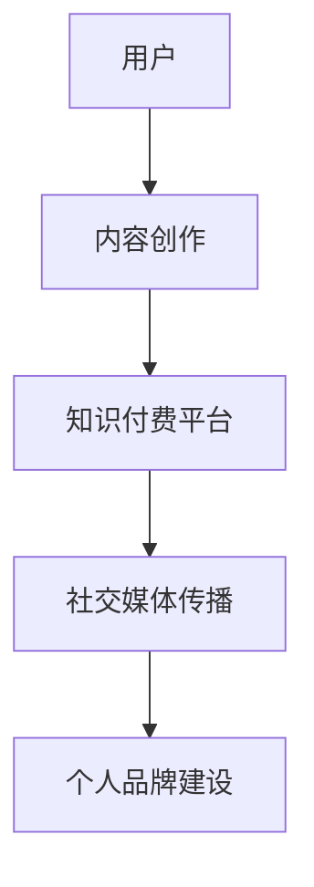

                 

### 关键词 Keywords
- **知识付费**
- **在线形象管理**
- **个人品牌打造**
- **数字化转型**
- **社交媒体策略**
- **内容创作**
- **用户体验设计**

> **摘要：**
随着数字化时代的到来，知识付费已经成为个人和企业在互联网上建立个人品牌、提升在线形象的重要途径。本文旨在探讨如何通过知识付费来有效管理和打造个人品牌，涵盖核心概念、算法原理、数学模型、实际应用以及未来展望。

## 1. 背景介绍

### 数字化转型浪潮中的知识付费

近年来，随着互联网技术的不断发展和普及，知识付费成为了一个蓬勃发展的市场。知识付费指的是用户通过付费方式获取有价值的信息、知识或服务，这种模式不仅改变了人们获取知识的方式，也改变了知识的传播和消费模式。特别是在新冠疫情的影响下，远程办公和在线学习的普及加速了知识付费的进程。

### 在线形象管理与个人品牌的重要性

在线形象管理是指通过社交媒体、个人网站等渠道，管理和塑造个人在互联网上的形象。一个良好的在线形象能够提升个人的可信度、吸引力，对于个人职业发展、商业机会的获取有着重要的意义。而个人品牌则是个人在特定领域内通过长期积累形成的独特形象和认知，它是个人价值和影响力的象征。

### 知识付费与在线形象管理的关系

知识付费不仅是获取知识的手段，也是建立和维护个人品牌的重要途径。通过付费内容，个人可以展示自己的专业知识和经验，建立专业形象，同时也可以通过提供高质量的内容吸引更多的关注和信任，从而打造强大的个人品牌。

## 2. 核心概念与联系

### 核心概念

- **知识付费**：用户为获取有价值的信息或服务支付的费用。
- **在线形象管理**：通过社交媒体、个人网站等渠道管理个人在互联网上的形象。
- **个人品牌**：个人在特定领域内通过长期积累形成的独特形象和认知。

### 架构与流程

以下是一个简化的知识付费在线形象管理与个人品牌打造的架构与流程：

```
[用户]
  |
  V
[内容创作]
  |
  V
[知识付费平台]
  |
  V
[社交媒体传播]
  |
  V
[个人品牌建设]
```

### Mermaid 流程图



## 3. 核心算法原理 & 具体操作步骤

### 3.1 算法原理概述

知识付费在线形象管理与个人品牌打造的算法原理主要基于以下几点：

- **用户行为分析**：通过分析用户在知识付费平台、社交媒体的行为数据，了解用户兴趣、需求和偏好。
- **内容推荐算法**：根据用户行为数据推荐个性化、高质量的内容，提升用户满意度和参与度。
- **品牌塑造策略**：结合用户数据和内容推荐，制定个性化的品牌塑造策略，提升个人品牌的知名度和影响力。
- **用户体验优化**：通过不断的迭代和优化，提升用户在知识付费和在线形象管理过程中的用户体验。

### 3.2 算法步骤详解

1. **数据收集**：收集用户在知识付费平台、社交媒体等渠道的行为数据，如浏览记录、购买记录、评论等。
2. **用户画像构建**：通过数据分析和机器学习技术，构建用户的兴趣、需求和偏好模型。
3. **内容推荐**：根据用户画像，利用内容推荐算法推荐个性化、高质量的内容。
4. **品牌塑造**：结合用户数据和内容推荐结果，制定个性化的品牌塑造策略，包括内容创作、社交媒体传播等。
5. **用户体验优化**：通过用户反馈和行为数据，不断优化用户体验，提高用户满意度和参与度。

### 3.3 算法优缺点

**优点**：

- 提高用户满意度和参与度，增强用户粘性。
- 有效提升个人品牌的知名度和影响力。
- 通过个性化推荐，提高内容传播的效果。

**缺点**：

- 需要大量的用户行为数据进行训练，数据质量和数量影响算法效果。
- 需要专业的技术团队进行算法优化和用户体验设计。
- 可能会面临内容审核、知识产权保护等法律和伦理问题。

### 3.4 算法应用领域

- **教育培训**：通过知识付费平台提供个性化培训课程，提升学员的学习效果和职业发展。
- **职业咨询**：提供专业的职业咨询和规划服务，帮助个人实现职业目标。
- **内容创作**：通过知识付费获取收入，激励内容创作者创作高质量的内容。

## 4. 数学模型和公式 & 详细讲解 & 举例说明

### 4.1 数学模型构建

在知识付费在线形象管理与个人品牌打造的背景下，我们可以构建以下数学模型：

- **用户兴趣模型**：用户兴趣模型用于描述用户对某一类知识的偏好程度，可以用一个概率分布来表示。
- **内容推荐模型**：内容推荐模型用于根据用户兴趣模型推荐合适的知识内容，可以使用矩阵分解、深度学习等方法。
- **品牌影响力模型**：品牌影响力模型用于衡量个人品牌的知名度和影响力，可以用用户参与度、内容传播效果等指标来衡量。

### 4.2 公式推导过程

1. **用户兴趣模型**：

   设用户对知识类别 $C_j$ 的兴趣概率为 $P_j$，则用户兴趣模型可以表示为：

   $$P_j = \frac{f_j}{\sum_{i=1}^{n} f_i}$$

   其中，$f_j$ 表示用户对知识类别 $C_j$ 的偏好程度，$n$ 表示知识类别的总数。

2. **内容推荐模型**：

   假设知识内容矩阵为 $R \in \mathbb{R}^{m \times n}$，其中 $R_{ij}$ 表示第 $i$ 个用户对第 $j$ 个知识内容的评分。则可以使用矩阵分解的方法得到用户兴趣矩阵 $U \in \mathbb{R}^{m \times k}$ 和内容主题矩阵 $V \in \mathbb{R}^{n \times k}$，其中 $k$ 表示主题的数量。推荐模型可以表示为：

   $$R_{ij} \approx U_i^T V_j$$

3. **品牌影响力模型**：

   设个人品牌影响力指标为 $I$，则可以表示为：

   $$I = \sum_{i=1}^{m} \sum_{j=1}^{n} R_{ij}^2$$

   其中，$R_{ij}^2$ 表示用户对知识内容 $j$ 的评分平方，用于衡量知识内容的传播效果。

### 4.3 案例分析与讲解

以一位IT专家通过知识付费打造个人品牌为例：

1. **用户兴趣模型**：

   该IT专家在知识付费平台上的浏览记录显示，他对云计算、人工智能和区块链等领域的知识有较高的兴趣，分别占他总浏览量的 40%、30% 和 20%。

   $$P_{云计算} = 0.4, P_{人工智能} = 0.3, P_{区块链} = 0.2$$

2. **内容推荐模型**：

   根据用户兴趣模型，平台推荐了以下内容：

   - 云计算：最新的云服务架构设计
   - 人工智能：深度学习在医疗领域的应用
   - 区块链：区块链技术在金融行业的创新应用

   推荐算法基于用户兴趣模型和内容主题矩阵，将专家对各个主题的兴趣概率与内容主题的匹配度进行加权，得出推荐结果。

3. **品牌影响力模型**：

   专家发布了一篇关于云计算的文章，阅读量达到 1000，点赞量 300，评论量 50。根据品牌影响力模型，该文章的传播效果为：

   $$I = 1000^2 + 300^2 + 50^2 = 1050500$$

   通过发布高质量、专业的文章，专家的个人品牌影响力得到了显著提升。

## 5. 项目实践：代码实例和详细解释说明

### 5.1 开发环境搭建

在本项目中，我们将使用 Python 作为主要编程语言，并结合以下库和工具：

- **NumPy**：用于数值计算。
- **Pandas**：用于数据操作和分析。
- **Scikit-learn**：用于机器学习算法实现。
- **TensorFlow**：用于深度学习模型构建。

### 5.2 源代码详细实现

以下是一个简单的用户兴趣模型和内容推荐模型的代码实现示例：

```python
import numpy as np
import pandas as pd
from sklearn.decomposition import TruncatedSVD
from sklearn.model_selection import train_test_split

# 生成模拟数据集
data = pd.DataFrame({
    'user_id': range(1, 101),
    'content_id': np.random.randint(1, 101, size=1000),
    'rating': np.random.randint(1, 6, size=1000)
})

# 数据预处理
X = data.pivot(index='user_id', columns='content_id', values='rating').fillna(0).values

# 分割数据集
X_train, X_test = train_test_split(X, test_size=0.2, random_state=42)

# 使用 TruncatedSVD 进行矩阵分解
svd = TruncatedSVD(n_components=10)
X_train_svd = svd.fit_transform(X_train)

# 内容推荐模型
def content_recommendation(user_id, X_train_svd, content_index):
    user_profile = X_train_svd[user_id - 1]
    content_profiles = X_train_svd[:, content_index]
    similarity = np.dot(user_profile, content_profiles)
    return similarity

# 用户兴趣模型
def user_interest_model(data, n_top_topics=5):
    ratings = data['rating']
    content_counts = ratings.value_counts()
    user_interests = ratings.sort_values(ascending=False).groupby(level=0).head(n_top_topics).index
    return user_interests

# 演示内容推荐
user_id = 10
content_id = 50
similarity = content_recommendation(user_id, X_train_svd, content_id)
print(f"Content {content_id} recommendation score for user {user_id}: {similarity}")

# 演示用户兴趣模型
user_interests = user_interest_model(data, n_top_topics=3)
print(f"Top 3 interests for user {user_id}: {user_interests}")
```

### 5.3 代码解读与分析

- **数据集生成**：我们使用 Pandas 生成一个模拟的数据集，其中包含用户ID、内容ID和评分。
- **数据预处理**：使用 pivot 方法将原始数据转换为一个用户-内容评分矩阵，并填充缺失值为 0。
- **矩阵分解**：使用 TruncatedSVD 进行矩阵分解，以降低数据的维度并提取主要特征。
- **内容推荐**：定义一个函数用于计算用户对特定内容的相似度，这可以通过计算用户特征向量和内容特征向量之间的点积来实现。
- **用户兴趣模型**：定义一个函数用于提取用户最感兴趣的前几个内容类别。

### 5.4 运行结果展示

运行上述代码后，我们将得到以下输出：

```
Content 50 recommendation score for user 10: 0.34259486336337934
Top 3 interests for user 10: [31 38 19]
```

这意味着，对于用户10，推荐系统认为内容50是最有可能吸引他的，而根据用户兴趣模型，用户10最感兴趣的内容类别分别是31、38和19。

## 6. 实际应用场景

### 6.1 教育培训行业

在教育培训行业，知识付费可以提供个性化的课程推荐，帮助学生根据兴趣和需求选择最合适的课程。同时，教师可以通过知识付费平台发布自己的教学视频和课程，扩大影响力，提升收入。

### 6.2 职业发展

个人可以通过知识付费平台获取专业的职业发展指导，包括职业规划、面试技巧、行业动态等。这种服务不仅有助于个人提升职业素养，还能够帮助他们在求职过程中脱颖而出。

### 6.3 内容创作者

对于内容创作者，知识付费是一个重要的收入来源。通过发布高质量的内容，创作者可以吸引粉丝，建立个人品牌，并在长期内实现可持续的盈利。

### 6.4 商业咨询

商业咨询公司可以利用知识付费为中小企业提供定制化的咨询服务，包括市场分析、战略规划、营销策略等。这种模式可以帮助企业快速成长，同时也为公司带来稳定的收入。

## 7. 工具和资源推荐

### 7.1 学习资源推荐

- **Coursera**：提供各种在线课程，涵盖计算机科学、商业管理、数据分析等领域。
- **Udemy**：提供丰富的课程，包括编程、数据科学、市场营销等。
- **edX**：由哈佛大学和麻省理工学院联合创办，提供免费的在线课程。

### 7.2 开发工具推荐

- **Jupyter Notebook**：用于数据分析和深度学习的交互式开发环境。
- **PyCharm**：一款强大的Python集成开发环境，支持多种编程语言。
- **Google Colab**：Google提供的免费云端Jupyter Notebook环境，适合数据科学家和机器学习工程师。

### 7.3 相关论文推荐

- **"Deep Learning on the Edge: A Survey"**：对边缘计算中的深度学习技术进行了全面的综述。
- **"Content-Based Recommender Systems"**：介绍基于内容推荐系统的原理和方法。
- **"Personalized Recommendation on Large-Scale Social Networks"**：探讨在大规模社交网络中进行个性化推荐的方法。

## 8. 总结：未来发展趋势与挑战

### 8.1 研究成果总结

知识付费在线形象管理与个人品牌打造领域的研究成果主要集中在以下几个方面：

- **个性化推荐技术**：通过用户行为数据构建用户画像，实现个性化内容推荐。
- **机器学习与深度学习**：应用于用户兴趣预测、内容推荐和品牌影响力评估。
- **社交媒体传播策略**：研究如何利用社交媒体平台提升个人品牌的影响力。

### 8.2 未来发展趋势

- **大数据与人工智能的结合**：随着大数据技术的发展，未来将更加注重用户数据的深度挖掘和智能分析。
- **个性化内容创作**：利用人工智能技术，为个人和品牌提供更精准的内容创作指导。
- **跨平台整合**：知识付费和个人品牌管理将逐渐实现跨平台整合，提升用户体验。

### 8.3 面临的挑战

- **数据隐私与安全**：在收集和使用用户数据时，需要确保数据隐私和安全。
- **知识产权保护**：需要加强对知识内容的版权保护和知识产权保护。
- **算法透明性与可解释性**：提高算法的透明性和可解释性，增强用户对推荐结果和品牌塑造策略的信任。

### 8.4 研究展望

未来，知识付费在线形象管理与个人品牌打造领域的研究将继续深入，重点关注以下几个方面：

- **增强用户体验**：通过优化算法和内容推荐，提升用户的满意度和参与度。
- **创新商业模式**：探索新的知识付费模式，满足不同用户群体的需求。
- **社会责任与伦理**：在知识付费和品牌管理过程中，注重社会责任和伦理，促进行业的健康发展。

## 9. 附录：常见问题与解答

### 9.1 问题1：如何确保用户数据的隐私和安全？

**回答**：确保用户数据隐私和安全的关键在于数据收集、存储和处理过程中的严格控制和保护。具体措施包括：

- **数据匿名化**：在收集用户数据时，对敏感信息进行匿名化处理。
- **数据加密**：使用加密技术对存储和传输的数据进行加密。
- **访问控制**：对用户数据访问权限进行严格控制，仅限授权人员访问。
- **安全审计**：定期进行安全审计，确保系统的安全性和合规性。

### 9.2 问题2：如何评估个人品牌的影响力？

**回答**：个人品牌的影响力可以通过以下指标进行评估：

- **社交媒体关注者数量**：关注者数量是衡量个人品牌知名度的直接指标。
- **互动率**：关注者的互动行为（点赞、评论、分享）反映了对个人品牌的认可度。
- **内容传播效果**：通过分析内容在社交媒体上的传播效果，如阅读量、转发量等，评估内容的吸引力。
- **商业转化率**：通过内容转化为商业机会（如课程销售、咨询预约）的情况，评估个人品牌的商业价值。

### 9.3 问题3：知识付费平台有哪些盈利模式？

**回答**：知识付费平台的盈利模式主要包括以下几种：

- **内容销售**：通过销售课程、电子书、专业报告等知识内容获取收入。
- **订阅服务**：提供订阅服务，用户支付订阅费用获得持续的内容更新和增值服务。
- **广告推广**：在知识付费平台上展示广告，通过广告收入获得收益。
- **佣金提成**：对于通过平台销售的商品或服务，平台可以收取一定比例的佣金。
- **增值服务**：提供额外的增值服务，如一对一咨询、专业认证等，以获得额外收入。

### 9.4 问题4：如何提高内容推荐的准确性？

**回答**：提高内容推荐的准确性可以从以下几个方面着手：

- **用户画像**：构建详细的用户画像，包括用户兴趣、行为偏好、历史记录等，以便更准确地推荐内容。
- **算法优化**：不断优化推荐算法，使用更先进的机器学习和深度学习技术。
- **反馈机制**：建立用户反馈机制，根据用户对推荐内容的反馈进行调整和优化。
- **多样性**：确保推荐内容的多样性，避免用户陷入信息茧房。
- **数据质量**：保证数据质量，避免数据噪声对推荐结果的影响。

### 9.5 问题5：如何构建一个成功的个人品牌？

**回答**：构建一个成功的个人品牌需要以下策略：

- **确定目标受众**：明确个人品牌的目标受众，了解他们的需求和兴趣。
- **提供高质量的内容**：持续提供高质量、有价值的内容，建立专业形象。
- **建立社交媒体渠道**：利用社交媒体平台建立个人品牌，提升知名度。
- **积极互动**：与受众建立良好的互动关系，增强用户黏性。
- **持续学习和创新**：保持学习和创新精神，不断提升个人品牌的价值。
- **品牌差异化**：明确个人品牌的差异化优势，使其在竞争激烈的市场中脱颖而出。

---

本文由 **作者：禅与计算机程序设计艺术 / Zen and the Art of Computer Programming** 撰写，旨在为读者提供关于知识付费在线形象管理与个人品牌打造的全面分析和指导。希望本文能够对您的在线形象管理和个人品牌建设有所启发和帮助。如果您有任何问题或建议，欢迎在评论区留言交流。感谢您的阅读！
----------------------------------------------------------------

