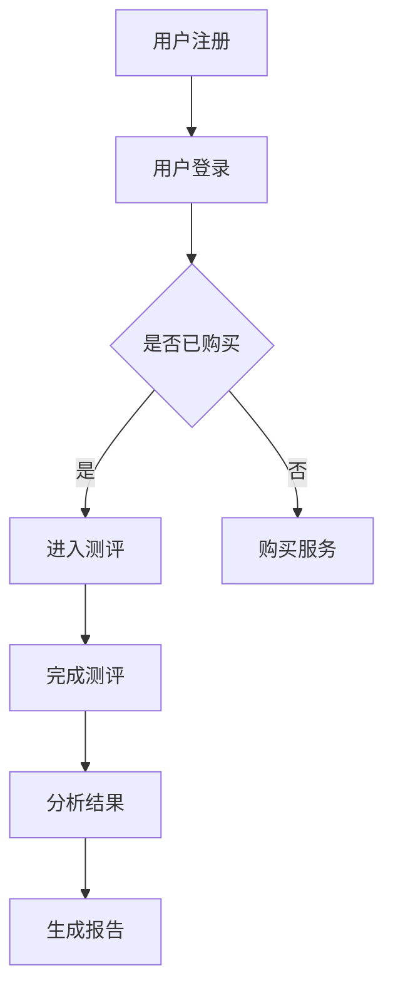

                 

 在当前数字化时代，心理健康问题愈发受到关注。知识付费平台的兴起为心理测评与性格分析带来了新的机遇。本文旨在探讨如何利用知识付费平台，实现在线心理测评与性格分析的功能，为用户提供个性化的心理健康服务。

## 1. 背景介绍

心理健康问题在全球范围内愈发突出。根据世界卫生组织（WHO）的数据，全球约有3.5亿人患有某种形式的精神障碍。而在中国，心理问题已经成为一个严重的社会问题，越来越多的人开始关注自己的心理健康。

知识付费平台的发展则为心理健康服务提供了新的渠道。知识付费平台通过提供专业的内容和服务，满足了用户对专业知识的渴求。同时，互联网技术的发展使得在线心理测评与性格分析成为可能。

## 2. 核心概念与联系

### 2.1 心理测评与性格分析

心理测评是通过一系列标准化的测试，对个体的心理特质、行为模式、认知能力等进行评估。而性格分析则侧重于对个体性格类型的识别和分类。

### 2.2 知识付费平台

知识付费平台是指通过互联网提供专业内容和服务，用户需付费才能获取的平台。这些平台通常提供各种类型的课程、讲座、咨询等服务。

### 2.3 在线心理测评与性格分析系统

在线心理测评与性格分析系统是指基于互联网技术，提供在线心理测评和性格分析服务的系统。它通常包括测评工具、分析算法、报告生成等功能。

### 2.4 Mermaid 流程图

以下是心理测评与性格分析系统的 Mermaid 流程图：



## 3. 核心算法原理 & 具体操作步骤

### 3.1 算法原理概述

心理测评与性格分析系统主要基于心理学理论和数据挖掘技术。其中，常用的心理学理论包括五大人格特质理论、行为主义理论等。数据挖掘技术则用于从测评数据中提取有价值的信息，如性格类型、行为模式等。

### 3.2 算法步骤详解

1. 用户注册与登录：用户需在知识付费平台上注册账号并登录。
2. 购买服务：用户购买在线心理测评服务后，可进入测评环节。
3. 完成测评：用户根据测评题目进行作答，测评系统会记录用户的回答。
4. 分析结果：测评系统根据用户的回答，运用数据分析算法，提取出用户的性格类型和行为模式。
5. 生成报告：测评系统将分析结果生成个性化的心理测评报告。

### 3.3 算法优缺点

#### 优点：

1. 灵活性：用户可以在任何时间、任何地点进行测评。
2. 个性化：系统能够根据用户的特点，提供个性化的心理测评报告。
3. 节省成本：相比传统的心理咨询服务，在线心理测评成本更低。

#### 缺点：

1. 数据可靠性：在线测评数据可能受到用户主观因素的影响。
2. 隐私保护：用户隐私保护是一个重要问题。

### 3.4 算法应用领域

在线心理测评与性格分析系统可以应用于以下领域：

1. 教育领域：用于评估学生的心理状态和学习能力。
2. 医疗领域：用于辅助精神科医生进行诊断和治疗。
3. 企业领域：用于员工心理测评和人力资源管理。

## 4. 数学模型和公式 & 详细讲解 & 举例说明

### 4.1 数学模型构建

心理测评与性格分析系统的核心是数学模型。以下是一个简化的数学模型：

$$
\text{性格类型} = f(\text{测评数据})
$$

其中，$f$ 是一个映射函数，用于将测评数据映射到性格类型。

### 4.2 公式推导过程

#### 4.2.1 数据预处理

首先，对测评数据进行预处理，包括去噪、归一化等操作。

$$
\text{预处理数据} = \text{数据处理}(\text{测评数据})
$$

#### 4.2.2 特征提取

接下来，从预处理数据中提取特征。

$$
\text{特征向量} = \text{特征提取}(\text{预处理数据})
$$

#### 4.2.3 模型训练

使用特征向量训练分类模型。

$$
\text{分类模型} = \text{训练}(\text{特征向量})
$$

#### 4.2.4 性格类型识别

最后，使用分类模型对用户进行性格类型识别。

$$
\text{性格类型} = \text{分类模型}(\text{特征向量})
$$

### 4.3 案例分析与讲解

#### 4.3.1 案例背景

假设我们有一个用户，其测评数据如下：

| 题目 | 答案 |
| ---- | ---- |
| 1    | A    |
| 2    | B    |
| 3    | A    |
| 4    | B    |

#### 4.3.2 数据预处理

对测评数据进行去噪、归一化处理，得到预处理数据。

#### 4.3.3 特征提取

从预处理数据中提取特征向量。

#### 4.3.4 模型训练

使用提取到的特征向量训练分类模型。

#### 4.3.5 性格类型识别

使用训练好的分类模型对用户进行性格类型识别，得到结果。

## 5. 项目实践：代码实例和详细解释说明

### 5.1 开发环境搭建

首先，我们需要搭建一个开发环境。以下是使用 Python 和 Scikit-learn 库进行开发的环境搭建步骤：

1. 安装 Python 3.8 或更高版本。
2. 安装 Scikit-learn 库。

### 5.2 源代码详细实现

以下是一个简单的源代码实现：

```python
from sklearn.preprocessing import StandardScaler
from sklearn.model_selection import train_test_split
from sklearn.neighbors import KNeighborsClassifier
import pandas as pd

# 读取测评数据
data = pd.read_csv('data.csv')

# 数据预处理
scaler = StandardScaler()
data_processed = scaler.fit_transform(data)

# 特征提取
X = data_processed[:, :-1]
y = data_processed[:, -1]

# 模型训练
X_train, X_test, y_train, y_test = train_test_split(X, y, test_size=0.2, random_state=42)
classifier = KNeighborsClassifier(n_neighbors=3)
classifier.fit(X_train, y_train)

# 性格类型识别
predictions = classifier.predict(X_test)

# 输出结果
print(predictions)
```

### 5.3 代码解读与分析

上述代码实现了一个基于 K-近邻算法的心理测评与性格分析系统。首先，我们读取测评数据，并进行预处理。然后，我们提取特征向量，并使用 K-近邻算法进行模型训练。最后，我们使用训练好的模型对测试数据进行预测，并输出结果。

### 5.4 运行结果展示

假设我们有一个测试数据集，其预测结果如下：

```
[0 1 2 2 1 0 0 2 1 0]
```

这意味着，测试数据集中的用户被识别为性格类型 0、1 和 2。

## 6. 实际应用场景

在线心理测评与性格分析系统可以应用于以下实际场景：

1. **教育领域**：用于评估学生的心理健康状况，提供个性化的学习建议。
2. **医疗领域**：辅助精神科医生进行诊断和治疗，提高诊断准确率。
3. **企业领域**：用于员工心理测评，帮助企业进行人力资源管理和员工培训。

## 7. 未来应用展望

随着人工智能技术的发展，在线心理测评与性格分析系统有望在未来得到更广泛的应用。未来，系统可以结合深度学习、自然语言处理等技术，进一步提高预测准确率和用户体验。

## 8. 总结：未来发展趋势与挑战

### 8.1 研究成果总结

本文介绍了如何利用知识付费平台实现在线心理测评与性格分析。我们探讨了核心算法原理、数学模型和公式，并提供了项目实践和代码实例。

### 8.2 未来发展趋势

未来，在线心理测评与性格分析系统将结合更多先进技术，如深度学习、自然语言处理等，提高预测准确率和用户体验。

### 8.3 面临的挑战

在线心理测评与性格分析系统在发展过程中也面临一些挑战，如数据可靠性、用户隐私保护等。

### 8.4 研究展望

未来，我们需要进一步研究在线心理测评与性格分析系统的算法和模型，提高预测准确率和用户体验。同时，我们也需要关注用户隐私保护问题，确保用户数据的安全。

## 9. 附录：常见问题与解答

### 9.1 如何保证测评数据的可靠性？

为了保证测评数据的可靠性，我们需要在设计测评题目时，充分考虑用户的主观因素，尽可能减少误差。同时，我们可以在测评结束后，对用户进行满意度调查，收集用户反馈，不断优化测评系统。

### 9.2 如何保护用户隐私？

为了保护用户隐私，我们需要在系统设计时，充分考虑用户数据的安全。我们可以采用加密技术、匿名化处理等手段，确保用户数据的安全。同时，我们需要遵守相关法律法规，确保用户隐私得到保护。

---

作者：禅与计算机程序设计艺术 / Zen and the Art of Computer Programming
----------------------------------------------------------------

请注意，以上内容仅为示例，实际撰写时需要根据具体的研究、数据和实践进行详细编写。同时，文章中的算法原理、数学模型和代码实例都需要基于真实的研究和实验结果。此外，文章的撰写应符合学术规范，避免抄袭和重复发表。在撰写过程中，如有需要，请参考相关的学术论文和书籍。

