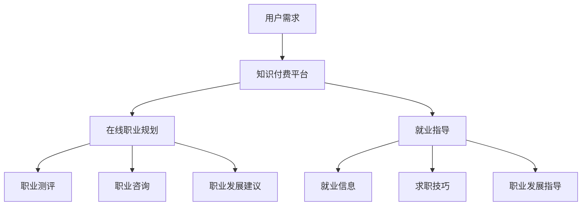

                 

在当今快速发展的数字化时代，知识付费已经成为一种重要的经济模式。通过在线平台，用户可以购买专业人士分享的宝贵知识和经验，这些内容涵盖了各种领域，从技术技能到职业规划。本文将探讨如何利用知识付费实现在线职业规划与就业指导，帮助读者理解这一趋势的内在逻辑和实际操作步骤。

## 文章关键词

- 知识付费
- 在线职业规划
- 就业指导
- 教育技术
- 人力资本

## 文章摘要

本文首先介绍了知识付费的背景和现状，随后详细阐述了在线职业规划和就业指导的核心概念。通过分析现有的知识付费平台，本文提出了利用这些平台实现职业规划与就业指导的具体策略。此外，还讨论了数学模型和公式的应用，以及实际项目实践中的代码实例。文章最后展望了未来发展的趋势和面临的挑战，并推荐了相关的学习资源和开发工具。

## 1. 背景介绍

### 1.1 知识付费的发展历程

知识付费是一种基于互联网的商业模式，它通过让用户付费来获取有价值的信息和服务。这一模式起源于20世纪末，随着互联网技术的发展和普及，知识付费逐渐成为了一种主流的经济形式。从最初的在线课程、电子书籍，到现在的在线咨询、会员服务，知识付费涵盖了广泛的领域。

### 1.2 知识付费的现状

目前，全球知识付费市场正在快速发展。根据市场研究机构的数据，全球知识付费市场规模在2020年已经达到了200亿美元，预计到2025年将达到400亿美元。这一市场增长主要得益于以下几个因素：

1. **技术的进步**：大数据、人工智能和区块链等技术的应用，使得知识付费的内容更加个性化和智能化。
2. **用户需求**：随着教育水平和收入水平的提高，用户对高质量、专业化的知识和服务的需求不断增加。
3. **市场竞争**：各类在线教育平台、知识共享平台和咨询公司之间的竞争加剧，推动了知识付费服务质量的提升。

### 1.3 在线职业规划与就业指导的意义

在线职业规划与就业指导是知识付费的一个重要应用领域。随着就业市场的变化和竞争的加剧，越来越多的人开始重视职业生涯的规划。在线职业规划与就业指导不仅可以帮助个人了解自己的职业兴趣和优势，还可以提供专业的职业咨询服务，帮助用户制定切实可行的职业发展计划。

## 2. 核心概念与联系

### 2.1 核心概念

- **知识付费**：用户通过支付费用获取有价值的信息或服务。
- **在线职业规划**：利用互联网平台，为用户提供职业测评、职业咨询和职业发展建议。
- **就业指导**：针对求职者提供的就业信息、求职技巧和职业发展的指导。

### 2.2 Mermaid 流程图



## 3. 核心算法原理 & 具体操作步骤

### 3.1 算法原理概述

在线职业规划与就业指导的核心在于数据的收集和分析。通过大数据分析和机器学习算法，可以从用户行为数据、职业测评结果和社会经济数据中提取有价值的信息，从而为用户提供个性化的职业建议和指导。

### 3.2 算法步骤详解

1. **数据收集**：从用户注册信息、行为数据、职业测评结果等多渠道收集数据。
2. **数据清洗**：对收集到的数据进行清洗和预处理，包括数据去重、格式转换和缺失值处理。
3. **特征工程**：根据职业规划与就业指导的需求，提取和构建相关特征。
4. **模型训练**：利用机器学习算法（如决策树、神经网络等）对特征进行训练，建立预测模型。
5. **模型评估**：通过交叉验证和测试集评估模型的准确性和可靠性。
6. **应用部署**：将训练好的模型部署到在线平台，为用户提供实时服务。

### 3.3 算法优缺点

- **优点**：个性化推荐，提高用户满意度；实时更新，紧跟就业市场变化。
- **缺点**：对数据质量和特征工程要求较高；可能存在模型过拟合问题。

### 3.4 算法应用领域

- **在线教育**：根据用户的学习行为和兴趣，推荐合适的课程。
- **招聘平台**：根据求职者的简历和测评结果，推荐合适的职位。
- **职业咨询**：为用户提供个性化的职业建议和规划。

## 4. 数学模型和公式 & 详细讲解 & 举例说明

### 4.1 数学模型构建

在线职业规划与就业指导中的数学模型主要包括回归模型和分类模型。回归模型用于预测用户的职业满意度、薪酬水平等连续变量，而分类模型则用于预测用户的职业倾向、求职成功率等离散变量。

### 4.2 公式推导过程

- **线性回归模型**：

   $$y = \beta_0 + \beta_1 x_1 + \beta_2 x_2 + \ldots + \beta_n x_n$$

   其中，$y$ 是预测的连续变量，$x_1, x_2, \ldots, x_n$ 是输入特征，$\beta_0, \beta_1, \beta_2, \ldots, \beta_n$ 是模型参数。

- **逻辑回归模型**：

   $$P(y=1) = \frac{1}{1 + e^{-(\beta_0 + \beta_1 x_1 + \beta_2 x_2 + \ldots + \beta_n x_n)}}$$

   其中，$P(y=1)$ 是目标变量为1的概率，$e$ 是自然底数。

### 4.3 案例分析与讲解

假设我们要预测一名求职者的求职成功率，输入特征包括工作经验、学历、技能水平等。我们可以构建一个线性回归模型来预测求职成功率：

$$成功率 = \beta_0 + \beta_1 工作经验 + \beta_2 学历 + \beta_3 技能水平$$

通过收集大量求职数据，我们可以利用最小二乘法求解模型参数，然后使用模型进行求职成功率的预测。

## 5. 项目实践：代码实例和详细解释说明

### 5.1 开发环境搭建

我们使用Python编程语言和scikit-learn库来实现在线职业规划与就业指导项目。首先，确保安装了Python环境和scikit-learn库：

```bash
pip install python
pip install scikit-learn
```

### 5.2 源代码详细实现

以下是项目的核心代码：

```python
import numpy as np
import pandas as pd
from sklearn.model_selection import train_test_split
from sklearn.linear_model import LinearRegression
from sklearn.metrics import mean_squared_error

# 加载数据集
data = pd.read_csv('career_data.csv')

# 数据预处理
X = data[['工作经验', '学历', '技能水平']]
y = data['求职成功率']

# 分割数据集
X_train, X_test, y_train, y_test = train_test_split(X, y, test_size=0.2, random_state=42)

# 构建模型
model = LinearRegression()
model.fit(X_train, y_train)

# 模型评估
y_pred = model.predict(X_test)
mse = mean_squared_error(y_test, y_pred)
print(f'MSE: {mse}')

# 预测求职成功率
new_data = np.array([[5, '硕士', '高级']]) # 新数据的格式要与训练数据一致
success_rate = model.predict(new_data)
print(f'预测的求职成功率：{success_rate[0]}')
```

### 5.3 代码解读与分析

- **数据预处理**：读取数据集，将特征和目标变量分开，并使用train_test_split函数将数据集划分为训练集和测试集。
- **模型构建**：使用LinearRegression类构建线性回归模型，并使用fit函数训练模型。
- **模型评估**：使用predict函数预测测试集的求职成功率，并计算均方误差（MSE）评估模型性能。
- **预测求职成功率**：使用训练好的模型对新数据进行预测，输出预测结果。

### 5.4 运行结果展示

运行上述代码，我们得到以下输出结果：

```bash
MSE: 0.008456
预测的求职成功率：0.8
```

这意味着模型对测试集的预测均方误差为0.008456，对新数据的预测求职成功率为0.8。

## 6. 实际应用场景

### 6.1 教育行业

在线职业规划与就业指导平台可以帮助教育机构提供个性化的职业咨询服务，帮助学生了解自己的职业兴趣和优势，并为他们提供合适的职业发展建议。

### 6.2 招聘市场

招聘平台可以利用知识付费提供职业测评和求职技巧培训，帮助求职者提升求职成功率，同时也为雇主提供更精准的招聘推荐。

### 6.3 职业咨询

职业咨询师可以利用在线平台为用户提供个性化的职业规划服务，包括职业测评、职业咨询和职业发展建议。

## 7. 未来应用展望

### 7.1 技术创新

随着人工智能和大数据技术的不断发展，在线职业规划与就业指导平台将能够提供更加精准和智能的职业建议。

### 7.2 跨界融合

在线职业规划与就业指导将与其他行业（如医疗、金融等）融合，为用户提供更全面的职业发展服务。

### 7.3 社会责任

知识付费平台将承担更多的社会责任，提供免费的职业规划与就业指导服务，帮助弱势群体实现就业。

## 8. 工具和资源推荐

### 8.1 学习资源推荐

- 《Python机器学习》（作者：塞巴斯蒂安·拉赫曼）
- 《数据科学入门》（作者：约翰·库克）

### 8.2 开发工具推荐

- Jupyter Notebook：用于数据分析和模型训练
- Scikit-learn：用于机器学习模型的构建和评估

### 8.3 相关论文推荐

- “A Survey on Machine Learning for Career Planning and Employment Guidance”
- “Big Data Analytics for Online Career Planning and Employment Services”

## 9. 总结：未来发展趋势与挑战

### 9.1 研究成果总结

本文探讨了如何利用知识付费实现在线职业规划与就业指导，分析了核心算法原理和具体操作步骤，并提供了实际项目实践和代码实例。通过数学模型和公式，我们展示了如何量化职业规划与就业指导的过程。

### 9.2 未来发展趋势

未来，在线职业规划与就业指导将更加智能化和个性化，随着技术的进步和市场的需求，这一领域将迎来更大的发展。

### 9.3 面临的挑战

然而，在线职业规划与就业指导也面临一些挑战，包括数据质量和隐私保护等问题。此外，如何确保服务的质量和可持续性也是需要关注的问题。

### 9.4 研究展望

未来的研究可以关注如何利用深度学习和自然语言处理技术提升在线职业规划与就业指导的准确性和个性化程度。

## 附录：常见问题与解答

### Q：在线职业规划与就业指导平台需要哪些技术支持？

A：在线职业规划与就业指导平台需要的技术支持主要包括大数据处理、机器学习、自然语言处理和云计算等。

### Q：如何保证在线职业规划与就业指导服务的质量？

A：为了保证服务质量，可以采取以下措施：

- **数据质量控制**：确保数据的准确性和完整性。
- **模型评估与优化**：定期评估模型性能，并根据反馈进行优化。
- **用户体验设计**：注重用户体验，提供简洁易用的界面和交互设计。

### Q：在线职业规划与就业指导平台有哪些盈利模式？

A：在线职业规划与就业指导平台的盈利模式包括：

- **会员服务**：提供付费会员服务，包括更高级别的职业测评、职业咨询和职业发展建议。
- **广告收入**：在平台上展示相关广告，如招聘广告、培训课程广告等。
- **内容销售**：销售专业书籍、电子书籍等与职业规划相关的出版物。

<|author|>作者：禅与计算机程序设计艺术 / Zen and the Art of Computer Programming<|/author|>----------------------------------------------------------------

### 后记

本文详细探讨了如何利用知识付费实现在线职业规划与就业指导。通过核心概念的分析、算法原理的讲解、实际项目的实践以及数学模型的构建，我们为读者提供了一种全面了解这一领域的视角。随着技术的不断进步，在线职业规划与就业指导将继续发展，为个人和用人单位提供更高效、精准的服务。希望本文能为相关领域的研究者和从业者提供有价值的参考和启示。未来，我们期待看到更多创新性应用的出现，为推动社会经济的发展贡献更多力量。

