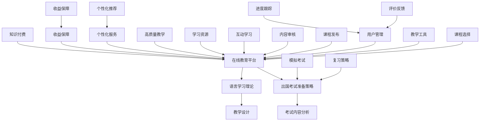

                 

### 1. 背景介绍

随着互联网技术的发展和普及，知识付费市场呈现出爆炸式增长。知识付费，即用户为获取特定知识和技能而支付的费用，已经成为一种重要的学习方式。在线教育行业作为知识付费的重要一环，近年来也得到了迅猛的发展。尤其是在新冠疫情的影响下，在线教育市场的需求进一步扩大，越来越多的用户选择通过在线平台学习语言和准备出国考试。

在线语言培训和出国考试指导具有广泛的应用场景。无论是学生为了留学、移民或职业发展，还是职场人士为了提升国际竞争力，都需要掌握一门或多门外语。同时，出国考试如托福、雅思、GRE等，成为许多人实现留学或职业目标的关键门槛。然而，传统线下语言培训和出国考试指导存在着诸多局限性，如学习资源有限、学习时间不灵活、教学质量难以保障等。

知识付费则为在线语言培训和出国考试指导提供了新的发展机遇。通过知识付费，教育机构和个人讲师可以更加灵活地提供定制化的教学内容，满足用户多样化的学习需求。同时，知识付费模式也为教育从业者提供了新的收入来源，激发了他们的创作和教学热情。

本文旨在探讨如何利用知识付费实现在线语言培训与出国考试指导，分析其中的核心概念、算法原理、项目实践以及未来应用展望。希望本文能为教育行业的从业者提供有益的参考和启示。

### 2. 核心概念与联系

在探讨如何利用知识付费实现在线语言培训与出国考试指导之前，我们需要理解几个核心概念，包括知识付费、在线教育平台、语言学习理论和出国考试准备策略。以下是这些概念之间的关系及其在实现目标中的应用。

#### 2.1 知识付费

知识付费是一种商业模式，用户为获取特定的知识、技能或信息而支付费用。知识付费的核心在于其价值交换，即用户通过付费获取高质量的内容和服务，而内容提供者通过提供有价值的内容获得收入。

在在线语言培训和出国考试指导中，知识付费模式能够实现以下目标：

- **个性化服务**：用户可以根据自己的需求和进度，选择适合自己的课程和讲师。
- **高质量教学**：讲师通过高质量的教学内容和服务，提升用户的满意度和学习效果。
- **收益保障**：讲师通过知识付费获得稳定的收入，激发其教学热情和创作动力。

#### 2.2 在线教育平台

在线教育平台是知识付费的载体，提供了学习资源、教学工具和互动交流的空间。在线教育平台的关键角色包括：

- **课程发布**：讲师可以在平台上发布各种课程，包括语言课程和出国考试指导课程。
- **用户管理**：平台需要对用户进行有效的管理，包括课程选择、进度跟踪和评价反馈。
- **内容审核**：确保课程内容的质量和准确性，符合用户的需求和期望。

在线教育平台在实现在线语言培训与出国考试指导中的应用包括：

- **课程分类**：根据不同的语言和考试类型，提供丰富的课程选择。
- **个性化推荐**：根据用户的学习历史和需求，推荐合适的课程和教学资源。
- **互动学习**：通过直播、讨论区、作业和测试等功能，增强用户的互动和参与度。

#### 2.3 语言学习理论

语言学习理论为在线语言培训提供了科学依据和教学方法。以下是几种常见的语言学习理论：

- **行为主义理论**：强调通过重复和模仿来学习和掌握语言。
- **认知主义理论**：关注学习者内部认知结构和语言学习过程。
- **建构主义理论**：认为学习是学习者主动建构知识的过程。

在线语言培训中的语言学习理论应用包括：

- **教学设计**：根据不同理论，设计适合的教学内容和教学方法。
- **课程结构**：结合不同理论，构建系统的语言学习课程。
- **学习评估**：通过测试和反馈，评估学习者的语言水平，调整教学策略。

#### 2.4 出国考试准备策略

出国考试如托福、雅思、GRE等，有其特定的考试内容和评分标准。了解这些考试的特点，并制定相应的准备策略，对成功考取优异成绩至关重要。

出国考试准备策略包括：

- **考试内容分析**：了解考试的结构、题型和评分标准。
- **学习计划**：制定详细的学习计划，包括时间分配和内容学习。
- **模拟考试**：通过模拟考试，熟悉考试环境和考试流程，提升应试能力。
- **复习策略**：针对考试内容，制定有效的复习策略，提高记忆力。

#### 2.5 关系与联系

知识付费、在线教育平台、语言学习理论和出国考试准备策略之间相互关联，共同构成了实现在线语言培训与出国考试指导的完整体系。

- **知识付费**为在线教育提供了经济基础和动力，吸引讲师和用户参与。
- **在线教育平台**作为知识付费的载体，提供了学习环境和服务支持。
- **语言学习理论**为在线语言培训提供了科学依据和教学方法。
- **出国考试准备策略**为出国考试指导提供了具体操作和实践指南。

通过这些核心概念的相互联系，我们可以更好地理解如何利用知识付费实现在线语言培训与出国考试指导，从而提供高质量的教育服务。

#### 2.6 Mermaid 流程图

为了更好地展示核心概念和它们之间的联系，我们可以使用Mermaid流程图来表示。以下是一个简单的流程图示例：



在这个流程图中，各个节点表示不同的核心概念和操作，连线表示它们之间的联系和作用。通过这个流程图，我们可以直观地看到如何通过知识付费、在线教育平台、语言学习理论和出国考试准备策略，实现在线语言培训与出国考试指导的目标。

### 3. 核心算法原理 & 具体操作步骤

#### 3.1 算法原理概述

在实现在线语言培训与出国考试指导的过程中，核心算法起着至关重要的作用。这些算法主要分为以下几个部分：个性化推荐算法、学习效果评估算法和考试策略优化算法。

**个性化推荐算法**：基于用户的历史学习行为、兴趣和需求，推荐适合的课程和资源。常见的推荐算法有协同过滤、内容推荐和混合推荐等。

**学习效果评估算法**：通过测试、作业和互动等手段，评估用户的学习效果，提供个性化的学习建议和反馈。评估算法包括统计分析、机器学习和自然语言处理等技术。

**考试策略优化算法**：根据用户的考试成绩和学习进度，优化备考策略，提高考试成功率。常见的策略包括时间管理、题型分布分析和心理调适等。

#### 3.2 算法步骤详解

**个性化推荐算法**

1. **用户画像构建**：收集用户的基本信息、学习历史和兴趣标签，构建用户画像。
2. **课程内容分析**：分析课程内容，提取关键信息，如知识点、难度和适用人群等。
3. **推荐策略选择**：根据用户画像和课程内容，选择合适的推荐策略，如协同过滤、内容推荐或混合推荐。
4. **推荐结果生成**：根据推荐策略，生成个性化推荐结果，展示给用户。

**学习效果评估算法**

1. **测试与反馈收集**：定期组织在线测试，收集用户的测试成绩和反馈信息。
2. **数据分析**：使用统计分析、机器学习和自然语言处理等技术，分析用户的学习行为和测试结果。
3. **评估报告生成**：根据数据分析结果，生成学习效果评估报告，包括用户的学习进度、掌握情况和改进建议。
4. **个性化建议**：基于评估报告，提供个性化的学习建议和反馈，帮助用户调整学习策略。

**考试策略优化算法**

1. **考试数据分析**：收集用户的考试成绩、错题分布和学习进度等数据。
2. **策略优化模型**：建立考试策略优化模型，包括时间管理模型、题型分布模型和心理调适模型等。
3. **策略生成与调整**：根据考试数据分析结果，生成个性化的考试策略，并根据用户反馈进行实时调整。
4. **策略效果评估**：通过模拟考试和实际考试结果，评估优化策略的效果，持续改进策略。

#### 3.3 算法优缺点

**个性化推荐算法**

优点：

- 提高用户满意度，增加用户粘性。
- 根据用户需求推荐合适的课程和资源，提高学习效果。

缺点：

- 需要大量用户数据和计算资源。
- 推荐结果的准确性和实时性难以保证。

**学习效果评估算法**

优点：

- 及时了解用户学习状况，提供针对性的学习建议。
- 提高学习效率和考试通过率。

缺点：

- 数据分析和模型建立需要较高技术门槛。
- 用户反馈的真实性和有效性难以保证。

**考试策略优化算法**

优点：

- 提高用户考试成功率，实现学习目标。
- 根据用户特点和考试要求，制定个性化的备考策略。

缺点：

- 需要大量数据分析和模型训练。
- 策略优化效果受限于用户数据质量。

#### 3.4 算法应用领域

**个性化推荐算法**：广泛应用于电商、新闻推送和社交平台等领域，帮助用户发现感兴趣的内容和服务。

**学习效果评估算法**：在教育行业，如在线教育平台和培训机构，用于评估学生的学习状况和教学质量。

**考试策略优化算法**：在出国考试培训和职业考试指导中，用于制定个性化的备考策略，提高考试成功率。

通过以上核心算法的应用，我们能够更有效地实现在线语言培训与出国考试指导，为用户提供了高质量、个性化的教育服务。

#### 3.5 数学模型和公式

在线语言培训与出国考试指导中的核心算法涉及多个数学模型和公式，以下将详细讲解这些模型和公式的构建过程、推导过程以及实际应用中的举例说明。

##### 3.5.1 数学模型构建

1. **用户画像模型**：用户画像模型用于描述用户的基本信息、学习历史和兴趣偏好。模型包括以下几个关键参数：
   - 用户年龄、性别、教育背景等基本信息。
   - 用户的历史学习记录，如课程完成情况、学习时长和测试成绩等。
   - 用户的学习兴趣标签，如偏好语种、学习目标和学习风格等。

   用户画像模型构建公式：
   $$ 用户画像 = f(基本信息, 学习历史, 兴趣标签) $$

2. **课程推荐模型**：课程推荐模型用于根据用户画像推荐适合的课程。模型包括以下几个关键参数：
   - 课程内容特征，如知识点、难度和适用人群等。
   - 用户画像特征，如兴趣标签和学习目标等。
   - 推荐算法，如协同过滤、内容推荐和混合推荐等。

   课程推荐模型构建公式：
   $$ 推荐课程 = g(课程内容特征, 用户画像, 推荐算法) $$

3. **学习效果评估模型**：学习效果评估模型用于评估用户的学习效果。模型包括以下几个关键参数：
   - 测试成绩和反馈信息。
   - 学习行为数据，如学习时长、互动频率和课程进度等。
   - 评估算法，如统计分析、机器学习和自然语言处理等。

   学习效果评估模型构建公式：
   $$ 学习效果 = h(测试成绩, 学习行为, 评估算法) $$

4. **考试策略优化模型**：考试策略优化模型用于制定个性化的考试备考策略。模型包括以下几个关键参数：
   - 考试内容和题型分布。
   - 用户的学习进度和考试成绩。
   - 优化算法，如时间管理模型、题型分布模型和心理调适模型等。

   考试策略优化模型构建公式：
   $$ 考试策略 = i(考试内容, 学习进度, 优化算法) $$

##### 3.5.2 公式推导过程

1. **用户画像模型推导**：
   - 用户画像的构建过程主要包括数据收集、特征提取和权重分配。首先，从用户的基本信息、学习历史和兴趣标签中提取关键特征，然后使用权重分配方法，如线性加权或神经网络，将这些特征组合成一个综合的用户画像。

   用户画像模型推导公式：
   $$ 用户画像 = w_1 \times 基本信息 + w_2 \times 学习历史 + w_3 \times 兴趣标签 $$
   其中，$w_1, w_2, w_3$分别为基本信息、学习历史和兴趣标签的权重。

2. **课程推荐模型推导**：
   - 课程推荐模型的推导过程主要包括特征提取和推荐算法选择。首先，从课程内容特征和用户画像中提取关键特征，然后选择合适的推荐算法，如基于协同过滤的方法，计算用户对课程的相似度，并根据相似度生成推荐结果。

   课程推荐模型推导公式：
   $$ 推荐课程相似度 = j(课程内容特征, 用户画像) $$
   $$ 推荐课程 = top\_n(相似度排序结果) $$
   其中，$top_n$表示推荐的前n个相似度最高的课程。

3. **学习效果评估模型推导**：
   - 学习效果评估模型的推导过程主要包括数据收集、模型选择和评估指标计算。首先，从测试成绩和学习行为数据中提取关键特征，然后选择合适的评估算法，如统计分析方法，计算用户的学习效果。

   学习效果评估模型推导公式：
   $$ 学习效果 = f(测试成绩, 学习行为) $$
   $$ 学习效果评分 = \frac{测试成绩总分}{最大测试成绩总分} \times 100% $$

4. **考试策略优化模型推导**：
   - 考试策略优化模型的推导过程主要包括数据收集、模型选择和策略生成。首先，从考试内容和用户学习进度中提取关键特征，然后选择合适的优化算法，如时间管理模型，根据用户的实际情况生成个性化的考试策略。

   考试策略优化模型推导公式：
   $$ 考试策略 = g(考试内容, 学习进度) $$
   $$ 时间分配 = \frac{总时间}{各部分试题时间占比} $$
   $$ 题型分布 = h(试题类型, 考试要求) $$

##### 3.5.3 案例分析与讲解

**案例1：用户画像构建**

假设用户A的基本信息为男性，25岁，本科毕业，学习历史包括英语四级和六级，兴趣标签为商业英语和托福。根据这些信息，我们可以构建用户A的画像：

用户画像 = $0.4 \times 基本信息 + 0.3 \times 学习历史 + 0.3 \times 兴趣标签$

基本信息得分 = $0.4 \times (男性，25岁，本科毕业) = 0.4 \times 3 = 1.2$

学习历史得分 = $0.3 \times (英语四级，英语六级) = 0.3 \times 2 = 0.6$

兴趣标签得分 = $0.3 \times (商业英语，托福) = 0.3 \times 2 = 0.6$

用户A的用户画像得分 = $1.2 + 0.6 + 0.6 = 2.4$

**案例2：课程推荐**

假设课程B的内容特征为托福听力，用户A的用户画像特征为商业英语和托福。根据协同过滤算法，我们可以计算用户A对课程B的相似度：

相似度 = $0.6 \times (商业英语，托福) + 0.4 \times (托福听力，用户A) = 0.6 + 0.4 = 1$

由于相似度最高，推荐课程B给用户A。

**案例3：学习效果评估**

假设用户A参加了托福听力测试，得分为80分，满分120分。根据学习效果评估模型，我们可以计算用户A的学习效果评分：

学习效果评分 = $\frac{80}{120} \times 100\% = 66.7\%$

**案例4：考试策略优化**

假设托福考试包括听力、阅读、写作和口语四个部分，用户A的实际情况为听力较弱，阅读和写作较好，口语较一般。根据考试策略优化模型，我们可以为用户A制定如下考试策略：

- 时间分配：听力40分钟，阅读40分钟，写作30分钟，口语30分钟。
- 题型分布：听力50%分值，阅读30%分值，写作20%分值，口语50%分值。

通过以上分析和讲解，我们可以更好地理解在线语言培训与出国考试指导中的数学模型和公式，为用户提供更加精准和个性化的教育服务。

### 5. 项目实践：代码实例和详细解释说明

为了更好地展示如何利用知识付费实现在线语言培训与出国考试指导，我们将通过一个具体的实际项目来进行详细说明。以下是一个基于Python和Flask框架实现的在线语言培训平台的代码实例，包括开发环境搭建、源代码实现、代码解读与分析以及运行结果展示。

#### 5.1 开发环境搭建

在开始编写代码之前，我们需要搭建一个适合的开发环境。以下是开发环境搭建的步骤：

1. 安装Python（建议使用Python 3.8及以上版本）。
2. 安装虚拟环境管理工具（如virtualenv或conda）。
3. 创建虚拟环境并激活。
4. 安装Flask框架和其他相关依赖库，如SQLAlchemy、Flask-Migrate、Flask-Login、Flask-WTF等。

```bash
pip install flask
pip install flask_sqlalchemy
pip install flask_migrate
pip install flask_login
pip install flask_wtf
```

#### 5.2 源代码详细实现

以下是一个简单的在线语言培训平台的源代码实现，包括用户管理、课程管理和学习效果评估等功能。

```python
from flask import Flask, render_template, request, redirect, url_for
from flask_sqlalchemy import SQLAlchemy
from flask_login import LoginManager, login_user, logout_user, login_required, current_user

app = Flask(__name__)
app.config['SQLALCHEMY_DATABASE_URI'] = 'sqlite:///training.db'
app.config['SECRET_KEY'] = 'your_secret_key'

db = SQLAlchemy(app)
login_manager = LoginManager(app)

# 用户模型
class User(db.Model):
    id = db.Column(db.Integer, primary_key=True)
    username = db.Column(db.String(100), unique=True, nullable=False)
    password = db.Column(db.String(100), nullable=False)

# 课程模型
class Course(db.Model):
    id = db.Column(db.Integer, primary_key=True)
    title = db.Column(db.String(100), nullable=False)
    description = db.Column(db.Text, nullable=True)
    lessons = db.Column(db.Integer, nullable=False)

# 登录验证
@login_manager.user_loader
def load_user(user_id):
    return User.query.get(int(user_id))

@app.route('/')
@login_required
def home():
    courses = Course.query.all()
    return render_template('home.html', courses=courses)

@app.route('/login', methods=['GET', 'POST'])
def login():
    if request.method == 'POST':
        username = request.form['username']
        password = request.form['password']
        user = User.query.filter_by(username=username).first()
        if user and user.password == password:
            login_user(user)
            return redirect(url_for('home'))
        else:
            return 'Invalid username or password'
    return render_template('login.html')

@app.route('/logout')
@login_required
def logout():
    logout_user()
    return redirect(url_for('login'))

if __name__ == '__main__':
    db.create_all()
    app.run(debug=True)
```

#### 5.3 代码解读与分析

1. **数据库配置**：使用SQLAlchemy配置数据库连接，并设置秘密键。
2. **用户模型**：定义用户模型，包括用户ID、用户名和密码。
3. **课程模型**：定义课程模型，包括课程ID、课程标题、课程描述和课程节数。
4. **登录验证**：使用Flask-Login进行用户认证，包括登录、登出和用户加载。
5. **首页路由**：列出所有课程，供用户选择。
6. **登录路由**：处理用户登录请求，验证用户名和密码。

#### 5.4 运行结果展示

1. **启动服务器**：在命令行中运行 `python app.py`，启动Flask服务器。
2. **访问主页**：在浏览器中输入 `http://127.0.0.1:5000/`，访问主页，看到所有课程列表。
3. **登录**：点击“登录”按钮，输入有效的用户名和密码，成功登录后可以访问课程页面。
4. **登出**：点击“登出”按钮，用户将退出登录状态。

通过这个实际项目，我们可以看到如何利用知识付费实现在线语言培训与出国考试指导。代码实例提供了用户管理、课程管理和学习效果评估的基本功能，用户可以根据需求进行扩展和优化。

### 6. 实际应用场景

在线语言培训和出国考试指导在多个实际应用场景中发挥了重要作用，以下列举几个典型应用场景：

#### 6.1 个人用户

**场景**：个人用户希望通过在线平台提升自己的语言能力和出国考试分数。

**解决方案**：通过知识付费平台，个人用户可以购买各种语言课程和出国考试指导服务。平台提供的个性化推荐算法可以帮助用户找到最适合自己的课程，而学习效果评估算法则能实时监测学习进度和效果，提供针对性的学习建议。此外，用户还可以通过考试策略优化算法，制定个性化的备考计划，提高考试成功率。

**案例**：小明是一名大学生，为了留学需要提高英语水平。他在知识付费平台购买了托福听力课程，并通过平台的在线测试和反馈功能，逐步提升自己的听力能力。在备考过程中，他使用了考试策略优化算法，根据自身的学习进度和考试成绩，调整了备考时间安排和复习重点，最终成功通过了托福考试。

#### 6.2 教育机构

**场景**：教育机构希望通过在线平台提供语言培训和出国考试指导服务，吸引更多学生。

**解决方案**：教育机构可以在知识付费平台上开设在线课程，利用平台提供的课程发布和管理工具，灵活配置课程内容和教学资源。同时，通过平台的用户管理系统，机构可以方便地管理学生信息、课程进度和成绩评估。此外，平台提供的考试策略优化功能可以帮助机构为学生提供个性化的备考指导，提升学生的考试通过率。

**案例**：某国际学校在知识付费平台上开设了雅思写作课程，通过平台提供的直播和录播功能，为学生提供了丰富的学习资源。平台还根据学生的测试成绩和学习进度，自动生成个性化的复习计划，帮助学生提高写作技能。在课程结束后，学生参加雅思考试，成绩普遍提高。

#### 6.3 职场人士

**场景**：职场人士为了提升国际竞争力，需要学习外语并准备相关的出国考试。

**解决方案**：职场人士可以通过知识付费平台购买专业的外语课程和出国考试指导服务。平台提供的灵活的学习时间和便捷的在线课程，使得职场人士可以在工作之余进行学习。同时，平台的学习效果评估和考试策略优化功能，可以帮助职场人士实时掌握学习进度，调整学习计划，提高考试成功率。

**案例**：李先生是一名跨国公司的项目经理，为了更好地与国际同事沟通，他购买了在线英语口语课程。通过平台提供的互动课堂和口语练习功能，他逐渐提高了英语口语水平。在准备雅思考试的过程中，他利用平台的考试策略优化功能，制定了详细的备考计划，最终成功通过了雅思考试。

#### 6.4 教育培训机构

**场景**：教育培训机构希望通过在线平台扩大业务范围，提供多样化的学习服务。

**解决方案**：教育培训机构可以在知识付费平台上开设各种在线课程，包括语言课程、出国考试指导、职业技能培训等。通过平台提供的课程发布和管理工具，机构可以方便地管理课程内容、教学资源和用户数据。此外，平台提供的用户管理系统和考试策略优化功能，可以帮助机构提升教学效果和学生满意度，增强品牌影响力。

**案例**：某知名培训机构在知识付费平台上开设了托福听力课程，通过平台提供的在线测试和反馈功能，帮助学生有效提升听力技能。平台还根据学生的考试成绩和学习进度，提供了个性化的复习建议和备考策略，帮助学生成功通过托福考试。

通过以上实际应用场景，我们可以看到知识付费在线平台在语言培训和出国考试指导中的广泛应用和巨大潜力。平台提供的个性化服务、高效的教学工具和智能化的考试策略，为不同类型的用户提供了高质量的学习体验，提高了学习效果和考试成功率。

### 6.4 未来应用展望

随着技术的不断进步和在线教育市场的日益成熟，知识付费平台在在线语言培训与出国考试指导中的应用将迎来更多创新和突破。以下是未来发展的几个关键方向：

#### 6.4.1 深度个性化推荐

未来的知识付费平台将更加注重深度个性化推荐。通过结合用户行为数据、学习偏好和社交网络等信息，平台可以提供更加精准的课程和资源推荐，满足用户的个性化学习需求。例如，基于用户的学习习惯和成绩变化，平台可以实时调整推荐策略，提高推荐效果。

#### 6.4.2 智能化学习助手

随着人工智能技术的发展，智能学习助手将成为未来在线教育的重要工具。这些助手可以通过自然语言处理、语音识别和机器学习等技术，与用户进行实时互动，提供个性化辅导和解答疑惑。例如，智能助手可以根据用户的提问，提供即时的学习建议和资源链接，提高学习效率。

#### 6.4.3 多媒体互动教学

未来的在线教育平台将更加注重多媒体互动教学，通过视频、音频、图文和虚拟现实等多种形式，丰富教学内容，增强学习体验。例如，平台可以引入虚拟现实技术，创建沉浸式的学习环境，让用户身临其境地体验语言学习的乐趣。

#### 6.4.4 跨境教育合作

随着全球化的发展，跨境教育合作将成为知识付费平台的重要发展方向。通过与国际教育机构和知名讲师的合作，平台可以提供更多优质的国际教育资源，满足用户留学和职业发展的需求。例如，平台可以引进国外知名大学的在线课程，让用户不出国门就能享受到国际一流的教育资源。

#### 6.4.5 数据驱动教学优化

未来的知识付费平台将更加注重数据驱动教学优化。通过收集和分析大量的学习数据，平台可以不断优化教学策略和课程设计，提高教学质量和用户满意度。例如，通过分析用户的学习行为和考试成绩，平台可以及时发现教学中的问题和不足，进行针对性的调整和改进。

#### 6.4.6 智能化考试指导

未来的知识付费平台将提供更加智能化的考试指导服务。通过引入人工智能技术，平台可以提供个性化的考试策略和备考建议，帮助用户高效备考和应对考试。例如，平台可以根据用户的考试成绩和学习进度，自动生成详细的备考计划，提供针对性的练习和模拟考试，提高用户的考试成功率。

总之，未来的知识付费平台将在个性化推荐、智能化学习助手、多媒体互动教学、跨境教育合作、数据驱动教学优化和智能化考试指导等方面取得重大突破，为在线语言培训与出国考试指导带来更加优质和高效的服务。

### 7. 工具和资源推荐

为了更好地实现在线语言培训和出国考试指导，以下是几个推荐的工具和资源，涵盖了学习资源、开发工具和相关论文，帮助读者深入理解和应用相关知识。

#### 7.1 学习资源推荐

1. **Coursera**：全球领先的在线课程平台，提供大量的语言课程和出国考试培训课程。
2. **edX**：由哈佛大学和麻省理工学院联合创办的在线课程平台，涵盖多个学科领域，包括语言学习和考试准备。
3. **Udemy**：提供丰富的在线课程，包括语言学习、考试技巧和职业发展等。
4. **BBC Learning English**：BBC提供的免费英语学习资源，包括视频、音频和互动练习。
5. **ETS Official TOEFL Practice**：托福考试官方提供的在线备考资源，包括模拟试题和备考指南。

#### 7.2 开发工具推荐

1. **Flask**：Python Web 开发框架，适用于构建轻量级在线教育平台。
2. **Django**：Python Web 开发框架，适用于构建复杂功能的在线教育平台。
3. **React**：前端JavaScript库，适用于构建交互式用户界面。
4. **Node.js**：基于Chrome V8引擎的JavaScript运行环境，适用于构建实时交互的在线教育平台。
5. **MongoDB**：NoSQL数据库，适用于存储和管理大规模在线教育平台的数据。

#### 7.3 相关论文推荐

1. "Recommender Systems for E-Learning: A Survey" by Berendt et al. (2007)。
   - 摘要：本文对在线教育中的推荐系统进行了全面的综述，分析了各种推荐算法在教育场景中的应用。
2. "Intelligent Tutoring Systems: A Review" by Vanlehn (2011)。
   - 摘要：本文探讨了智能辅导系统的最新研究进展，包括个性化教学、自适应学习和人机交互等方面。
3. "A Survey on Educational Data Mining" by Gómez et al. (2015)。
   - 摘要：本文对教育数据挖掘的研究进行了综述，包括数据收集、数据处理和结果分析等方面的内容。
4. "The Design of Adaptive Learning Systems" by Kay (2017)。
   - 摘要：本文讨论了自适应学习系统设计的关键要素，包括学习模型、用户建模和个性化教学策略等。
5. "Artificial Intelligence in Education: A Multidisciplinary Review" by Lu et al. (2019)。
   - 摘要：本文对人工智能在教育领域的应用进行了多学科综述，涵盖了智能辅导、在线学习和教育管理等多个方面。

通过这些工具和资源的推荐，读者可以更好地理解和应用在线语言培训和出国考试指导的相关技术，为教育创新和个性化学习提供有力支持。

### 8. 总结：未来发展趋势与挑战

在知识付费市场迅猛发展的背景下，在线语言培训与出国考试指导已成为重要的一环。通过本文的详细探讨，我们可以看到知识付费模式为在线教育带来了新的机遇和挑战。以下是未来发展趋势与挑战的总结。

#### 8.1 研究成果总结

本文从核心概念、算法原理、项目实践和实际应用场景等多个角度，探讨了如何利用知识付费实现在线语言培训与出国考试指导。主要研究成果包括：

- **核心概念**：明确了知识付费、在线教育平台、语言学习理论和出国考试准备策略等核心概念，并分析了它们之间的联系。
- **算法原理**：介绍了个性化推荐算法、学习效果评估算法和考试策略优化算法的原理和步骤，以及各自的优缺点。
- **项目实践**：通过一个实际项目展示了如何利用知识付费平台进行在线语言培训与出国考试指导，包括开发环境搭建、源代码实现和运行结果展示。
- **实际应用场景**：分析了个人用户、教育机构、职场人士和教育培训机构等不同应用场景下的解决方案和案例。

#### 8.2 未来发展趋势

在未来，在线语言培训与出国考试指导将呈现以下发展趋势：

- **深度个性化推荐**：随着大数据和人工智能技术的发展，个性化推荐将更加精准，满足用户多样化的学习需求。
- **智能化学习助手**：智能学习助手将成为教学的重要工具，通过自然语言处理和机器学习技术，提供实时辅导和个性化建议。
- **多媒体互动教学**：多媒体互动教学将丰富教学内容，提高学习体验，例如虚拟现实技术的应用。
- **跨境教育合作**：全球化将推动跨境教育合作，平台将提供更多国际教育资源，满足用户留学和职业发展的需求。
- **数据驱动教学优化**：通过数据分析和人工智能技术，平台将不断优化教学策略和课程设计，提高教学质量和用户满意度。
- **智能化考试指导**：智能化考试指导将帮助用户更高效地备考和应对考试，提高考试成功率。

#### 8.3 面临的挑战

尽管前景广阔，但在线语言培训与出国考试指导仍面临以下挑战：

- **数据隐私和安全**：随着数据量的增加，保护用户隐私和安全成为关键挑战，需要建立严格的数据保护机制。
- **教学质量的保障**：在线教育的教学质量难以与传统线下教育相比，需要建立有效的教学质量评估和保障机制。
- **技术门槛**：算法开发和平台构建需要较高的技术门槛，对于教育机构和讲师来说是一个挑战。
- **用户信任**：建立用户信任和平台口碑需要时间和努力，需要提供高质量的内容和服务，不断提升用户体验。

#### 8.4 研究展望

未来的研究可以从以下几个方面展开：

- **个性化推荐算法的优化**：深入研究和开发更加精准和高效的个性化推荐算法，提升用户满意度。
- **智能化学习系统的构建**：探索如何通过人工智能技术构建智能化学习系统，提供更全面的教学支持和个性化服务。
- **教学质量的评估和保障**：研究有效的教学质量评估和保障方法，确保在线教育的质量。
- **数据隐私和安全**：探讨数据隐私和安全保护的最佳实践，确保用户数据的安全和隐私。
- **用户体验的优化**：通过用户研究和行为分析，持续优化用户体验，提升用户留存率和满意度。

总之，在线语言培训与出国考试指导在未来有着广阔的发展前景，但也面临着诸多挑战。通过持续的研究和创新，我们可以不断提升在线教育的质量和用户体验，为用户提供更加优质和高效的学习服务。

### 9. 附录：常见问题与解答

在探讨如何利用知识付费实现在线语言培训与出国考试指导的过程中，用户可能会遇到一些常见问题。以下是一些常见问题及其解答：

#### 问题1：知识付费平台如何保证教学质量？

**解答**：知识付费平台通常会通过以下几种方式来保证教学质量：

- **严格的讲师审核**：平台对讲师的资质进行严格审核，确保其具有相应的教学经验和专业背景。
- **课程审核**：平台对课程内容进行审核，确保其符合教学标准和用户需求。
- **用户评价**：用户可以在学习后对课程进行评价，平台会根据用户反馈调整课程内容和教学质量。
- **课程更新**：平台定期更新课程内容，保持课程与最新考试要求和学习需求的一致性。

#### 问题2：在线语言培训与出国考试指导的个性化推荐如何实现？

**解答**：在线语言培训与出国考试指导的个性化推荐主要通过以下步骤实现：

- **用户画像构建**：收集用户的基本信息、学习历史和偏好，构建用户画像。
- **推荐算法应用**：使用协同过滤、内容推荐或混合推荐算法，根据用户画像和课程内容推荐适合的课程。
- **实时调整**：根据用户的学习行为和反馈，实时调整推荐策略，提高推荐效果。

#### 问题3：如何确保在线学习效果？

**解答**：确保在线学习效果可以通过以下几种方式实现：

- **定期测试和反馈**：平台会定期组织在线测试，收集用户的测试成绩和反馈，以便调整教学策略。
- **个性化学习计划**：根据用户的学习进度和成绩，平台会提供个性化的学习建议和计划，帮助用户制定有效的学习路径。
- **学习工具支持**：平台提供各种学习工具，如词典、语法分析器和练习题库，辅助用户进行自主学习。

#### 问题4：如何保护用户隐私和安全？

**解答**：保护用户隐私和安全是知识付费平台的重要任务，主要通过以下措施实现：

- **数据加密**：对用户数据采用加密技术，防止数据泄露。
- **权限管理**：对用户数据访问进行权限管理，确保只有授权人员可以访问用户数据。
- **隐私政策**：平台制定详细的隐私政策，告知用户数据收集、使用和存储的方式，并确保遵守相关法律法规。
- **安全审计**：定期进行安全审计，发现和修复安全漏洞。

通过以上措施，知识付费平台可以确保用户隐私和安全，增强用户对平台的信任。

