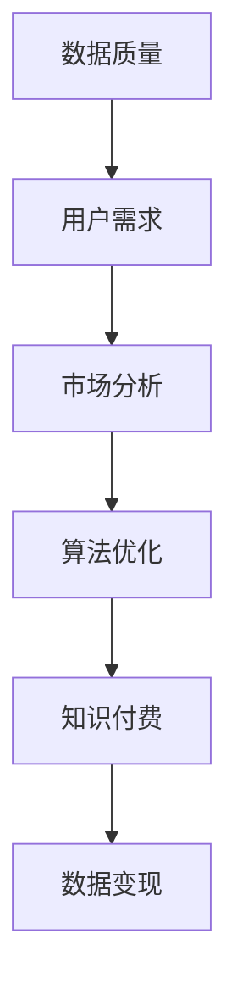

                 

关键词：知识付费、数据变现、数据驱动、市场分析、算法优化、商业模式创新

> 摘要：本文将探讨知识付费在数据变现中的关键作用，分析其运作机制，提供实际操作步骤，并结合数学模型和案例分析，解释如何通过知识付费实现数据的高效变现。文章还将展望数据变现的未来发展方向，提出潜在的挑战和解决方案。

## 1. 背景介绍

随着互联网和大数据技术的快速发展，数据的获取和处理变得越来越容易。然而，如何将数据转化为实际价值，一直是企业和个人面临的重要课题。知识付费作为一种商业模式，近年来在数据变现领域展现出强大的潜力。知识付费不仅仅是售卖信息，更是通过专业知识和经验帮助用户解决问题，从而实现数据价值的最大化。

### 1.1 知识付费的定义

知识付费是指消费者为获取专业知识和技能而支付的费用。这种模式打破了传统免费内容的束缚，让知识创作者可以通过高质量的内容获得经济回报。在数据变现的背景下，知识付费成为了一种有效的工具，可以用来衡量和转化数据价值。

### 1.2 数据变现的概念

数据变现是指将数据资源转化为实际收益的过程。这通常涉及数据分析和挖掘，将潜在的信息转化为具有商业价值的洞察和决策支持。数据变现的目标是提高数据的价值，使其对企业和个人产生实际的财务收益。

### 1.3 知识付费与数据变现的关系

知识付费为数据变现提供了一个直接的经济渠道。专业知识和技能的售卖不仅能够增加创作者的收入，还能够通过高质量的内容吸引更多的用户，从而扩大数据的影响范围，提高数据变现的效率。

## 2. 核心概念与联系

在讨论知识付费如何促进数据变现之前，我们需要理解几个核心概念和它们之间的关系。

### 2.1 数据质量

数据质量是数据变现的基础。高质量的数据能够提供更准确和可靠的洞察，从而为决策提供更好的支持。知识付费可以帮助提高数据质量，例如通过专业的数据清洗和整理服务。

### 2.2 用户需求

了解用户需求是数据变现的关键。知识付费通过提供定制化的内容和服务，能够更好地满足用户的需求，从而增加用户的满意度和忠诚度。

### 2.3 市场分析

市场分析是数据变现的重要环节。通过分析市场趋势和竞争对手的动态，可以识别出潜在的数据变现机会，并制定相应的策略。

### 2.4 算法优化

算法优化是提升数据变现效率的关键。通过使用先进的算法和机器学习技术，可以对数据进行分析和预测，从而实现更精确的数据变现。

下面是一个Mermaid流程图，展示了这些概念之间的联系：



### 2.5 商业模式创新

商业模式创新是数据变现的重要推动力。通过创造新的商业模式，可以将数据转化为多种形式的价值，例如通过订阅服务、数据授权和联合分析等方式。

## 3. 核心算法原理 & 具体操作步骤

### 3.1 算法原理概述

知识付费实现数据变现的核心算法通常基于以下几个原理：

1. **用户行为分析**：通过分析用户在平台上的行为，如浏览、搜索、购买等，了解用户的兴趣和需求。
2. **内容推荐**：根据用户行为分析结果，使用推荐算法为用户推荐相关的知识付费内容。
3. **数据分析**：利用统计和机器学习技术对用户数据进行分析，挖掘潜在的商业价值。
4. **定价策略**：根据市场分析和用户需求，制定合理的定价策略，以最大化收益。

### 3.2 算法步骤详解

以下是实现知识付费数据变现的具体操作步骤：

1. **数据收集**：收集用户在平台上的行为数据，如浏览记录、购买记录、搜索关键词等。
2. **用户行为分析**：使用统计分析和机器学习算法，分析用户行为，识别用户的兴趣和需求。
3. **内容推荐**：基于用户行为分析结果，使用推荐算法为用户推荐相关的知识付费内容。
4. **定价策略**：根据市场分析和用户需求，制定合理的定价策略，如动态定价、折扣促销等。
5. **数据变现**：通过知识付费平台，将推荐的内容变现，实现数据价值的转化。
6. **反馈循环**：收集用户对知识付费内容的反馈，不断优化推荐算法和定价策略。

### 3.3 算法优缺点

**优点**：

- 提高用户满意度：通过个性化的内容推荐，提高用户的满意度和忠诚度。
- 提高变现效率：利用算法优化，提高数据变现的效率。
- 创造新的收入来源：知识付费为平台创造了新的收入来源。

**缺点**：

- 数据隐私问题：用户数据隐私保护是重要挑战。
- 算法透明度问题：算法的透明度和公平性需要保障。

### 3.4 算法应用领域

知识付费算法可以应用于多个领域，如电子商务、在线教育、金融分析等。以下是一些具体的应用案例：

- **电子商务**：通过分析用户购物行为，推荐相关的商品，实现商品数据的变现。
- **在线教育**：根据用户学习行为，推荐相应的课程，实现教育资源的变现。
- **金融分析**：通过分析用户金融行为，提供个性化的投资建议，实现金融数据的变现。

## 4. 数学模型和公式 & 详细讲解 & 举例说明

### 4.1 数学模型构建

为了更好地理解知识付费如何实现数据变现，我们可以构建一个简单的数学模型。假设有一个知识付费平台，用户在平台上消费的行为可以用以下数学模型来描述：

$$
R(t) = f(U(t), P(t), D(t))
$$

其中：

- \( R(t) \) 表示在时间 \( t \) 的收益。
- \( U(t) \) 表示在时间 \( t \) 的用户需求向量。
- \( P(t) \) 表示在时间 \( t \) 的定价策略向量。
- \( D(t) \) 表示在时间 \( t \) 的数据向量。

### 4.2 公式推导过程

为了推导上述公式，我们需要考虑以下几个因素：

1. **用户需求**：用户需求可以通过用户行为数据进行分析得到，如浏览量、购买量、评论等。
2. **定价策略**：定价策略可以基于市场分析、竞争环境和用户需求来确定。
3. **数据向量**：数据向量包括用户行为数据、市场数据、竞争对手数据等。

### 4.3 案例分析与讲解

下面我们通过一个实际案例来详细讲解这个数学模型的运用。

### 案例：电子商务平台的数据变现

假设一个电子商务平台希望通过知识付费实现数据变现。我们可以将平台的收益模型表示为：

$$
R(t) = \sum_{i=1}^{n} P_i \cdot Q_i
$$

其中：

- \( P_i \) 表示第 \( i \) 个商品的定价。
- \( Q_i \) 表示第 \( i \) 个商品的销售量。

平台可以通过以下步骤来优化收益：

1. **用户行为分析**：通过分析用户的浏览记录和购买记录，了解用户的兴趣和需求。
2. **内容推荐**：基于用户需求，使用推荐算法为用户推荐相关的商品。
3. **定价策略**：根据市场分析和竞争对手的价格，制定合理的定价策略。
4. **数据变现**：通过推荐的商品实现数据的变现，提高收益。

通过上述数学模型和算法，电子商务平台可以有效地实现数据变现，提高收益。

## 5. 项目实践：代码实例和详细解释说明

### 5.1 开发环境搭建

为了演示知识付费数据变现的过程，我们使用Python作为开发语言，并选择几个常用的库，如Pandas、Scikit-learn和Matplotlib。以下是开发环境的搭建步骤：

1. 安装Python 3.x版本（推荐使用Anaconda，方便管理环境）。
2. 安装必要的库，例如：
   ```bash
   pip install pandas scikit-learn matplotlib
   ```

### 5.2 源代码详细实现

下面是一个简单的Python代码示例，用于演示数据变现的过程：

```python
import pandas as pd
from sklearn.model_selection import train_test_split
from sklearn.ensemble import RandomForestRegressor
import matplotlib.pyplot as plt

# 加载数据集
data = pd.read_csv('ecommerce_data.csv')

# 数据预处理
# ...（数据清洗、特征工程等）

# 分割数据集
X = data.drop('revenue', axis=1)
y = data['revenue']
X_train, X_test, y_train, y_test = train_test_split(X, y, test_size=0.2, random_state=42)

# 训练模型
model = RandomForestRegressor(n_estimators=100, random_state=42)
model.fit(X_train, y_train)

# 预测收益
y_pred = model.predict(X_test)

# 绘制收益分布图
plt.hist(y_pred, bins=30)
plt.xlabel('Predicted Revenue')
plt.ylabel('Frequency')
plt.title('Revenue Distribution')
plt.show()

# 输出预测结果
print("Predicted Revenue:", y_pred)
```

### 5.3 代码解读与分析

上述代码首先加载数据集，然后进行数据预处理。接下来，使用随机森林回归模型对数据集进行训练，并使用测试集进行预测。最后，通过绘制收益分布图，可以直观地了解预测的收益分布情况。

### 5.4 运行结果展示

运行上述代码后，将生成一个收益分布图，显示预测的收益情况。通过分析这个分布图，可以进一步优化定价策略和推荐算法，从而提高数据变现的效率。

## 6. 实际应用场景

### 6.1 在线教育

在线教育平台通过知识付费实现数据变现，例如通过提供在线课程、专业证书等方式。通过分析用户的学习行为和兴趣，平台可以推荐相应的课程，提高用户的参与度和满意度。

### 6.2 金融分析

金融分析领域通过知识付费提供个性化的投资建议和服务。通过分析用户的历史投资记录和行为，平台可以预测用户的投资偏好，并提供相应的投资建议，实现数据变现。

### 6.3 咨询服务

专业咨询服务通过知识付费为企业和个人提供专业的咨询和建议。通过分析用户的需求和市场环境，咨询服务可以提供有针对性的解决方案，从而实现数据变现。

## 7. 未来应用展望

### 7.1 人工智能的融合

随着人工智能技术的发展，知识付费与人工智能的结合将为数据变现带来新的机遇。例如，通过使用深度学习和自然语言处理技术，可以提供更智能的内容推荐和个性化服务。

### 7.2 跨行业应用

知识付费数据变现的应用将不仅仅局限于特定领域，而是跨行业应用。例如，医疗、制造、能源等行业都可以通过知识付费实现数据的高效变现。

### 7.3 新型商业模式

未来，知识付费将催生出更多新型商业模式，如订阅制、联合分析、数据授权等，这些模式将进一步提升数据变现的效率和收益。

## 8. 工具和资源推荐

### 8.1 学习资源推荐

- 《数据科学入门：实战机器学习》
- 《深度学习：全面指南》
- 《大数据技术导论》

### 8.2 开发工具推荐

- Python（数据分析）
- Jupyter Notebook（交互式开发环境）
- TensorFlow（深度学习框架）
- PyTorch（深度学习框架）

### 8.3 相关论文推荐

- "Knowledge Graph and Its Applications in E-commerce"
- "Deep Learning for Recommender Systems"
- "Data-Driven Marketing: Leveraging Data for Business Success"

## 9. 总结：未来发展趋势与挑战

### 9.1 研究成果总结

本文探讨了知识付费在数据变现中的应用，分析了其核心算法原理和实际操作步骤，并结合数学模型和案例分析，提出了未来数据变现的发展趋势和潜在挑战。

### 9.2 未来发展趋势

- 人工智能与知识付费的深度融合
- 跨行业的数据变现应用
- 新型商业模式的不断创新

### 9.3 面临的挑战

- 数据隐私和安全问题
- 算法透明度和公平性问题
- 数据质量和真实性问题

### 9.4 研究展望

未来的研究将重点关注如何提高数据变现的效率，保障数据隐私和安全，同时推动人工智能与知识付费的深度结合，为数据变现提供更强大的技术支持。

## 10. 附录：常见问题与解答

### Q1：知识付费如何保障数据隐私？

A1：知识付费平台应该采取严格的数据保护措施，包括数据加密、访问控制、匿名化处理等，以确保用户数据的安全和隐私。

### Q2：算法透明度和公平性如何保障？

A2：算法的开发和应用应该遵循透明和公平的原则，通过公开算法逻辑和测试结果，接受用户和监管机构的监督，确保算法的公正性。

### Q3：如何提高数据变现的效率？

A3：可以通过优化推荐算法、提升数据分析能力、创新商业模式等方式提高数据变现的效率。

---

# 结束语

本文从多个角度探讨了如何利用知识付费实现数据变现，提供了实际操作步骤、数学模型和案例分析。随着技术的发展，知识付费在数据变现中的应用将更加广泛和深入。希望本文能为读者提供有价值的参考和启示。

### 作者署名

> 作者：禅与计算机程序设计艺术 / Zen and the Art of Computer Programming

