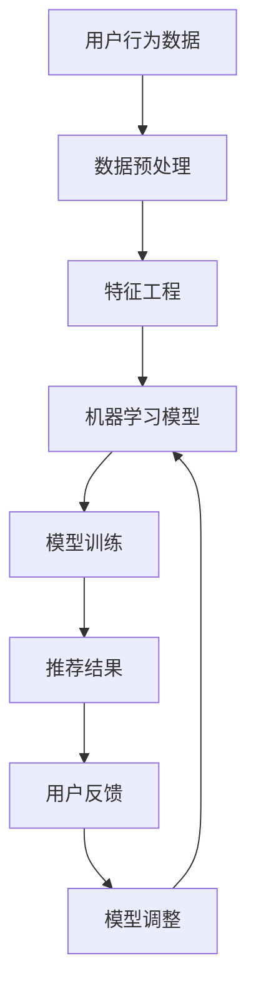

                 

关键词：知识付费、智能化推荐、个性化服务、机器学习、数据挖掘、算法优化、用户行为分析

## 摘要

本文将探讨如何利用知识付费平台实现智能化推荐与个性化服务。通过结合机器学习、数据挖掘、算法优化和用户行为分析等技术，知识付费平台可以更精准地推荐内容，提升用户满意度和参与度。本文将详细介绍相关技术原理、实现步骤、优缺点及其应用领域，并通过具体实例展示如何开发和运行这些系统。同时，还将展望未来的发展趋势和面临的挑战，为知识付费行业提供有益的参考。

## 1. 背景介绍

### 1.1 知识付费的兴起

随着互联网的普及和信息爆炸，用户获取知识的渠道变得多样化。知识付费作为一种新型的商业模式，逐渐成为知识传播的重要途径。用户愿意为有价值、高质量的内容付费，从而满足个性化学习需求。知识付费领域涵盖了在线教育、专业知识服务、内容付费等多个方面，为平台提供了广阔的市场空间。

### 1.2 智能化推荐与个性化服务的必要性

在知识付费领域，用户需求多样且个性化，传统的推荐方法已难以满足需求。智能化推荐和个性化服务成为提升用户体验、增加用户粘性的关键。通过分析用户行为数据，推荐系统可以更精准地推送用户感兴趣的内容，提高用户满意度和参与度。

### 1.3 技术背景

机器学习、数据挖掘、算法优化等技术为智能化推荐和个性化服务提供了有力支持。这些技术可以帮助平台挖掘用户行为规律、构建推荐模型，实现个性化内容推送。同时，随着大数据技术的发展，海量用户数据的获取和处理变得更加高效，为智能化推荐和个性化服务的实现提供了数据基础。

## 2. 核心概念与联系

### 2.1 机器学习与数据挖掘

机器学习是人工智能的核心技术之一，通过构建模型对数据进行训练，从而实现自动化预测和决策。数据挖掘则是从大量数据中提取有价值的信息和知识，为机器学习提供数据支持。在知识付费领域，机器学习和数据挖掘技术可以用于用户行为分析、内容推荐等。

### 2.2 算法优化

算法优化是指通过改进算法设计、调整参数等方法，提高推荐系统的性能和效果。在知识付费领域，算法优化可以针对不同用户群体、内容类型和场景进行个性化调整，实现更精准的推荐。

### 2.3 用户行为分析

用户行为分析是指通过对用户在知识付费平台上的行为数据进行收集、处理和分析，挖掘用户兴趣和需求。用户行为分析可以为推荐系统提供有效的输入，提高推荐效果。

### 2.4 Mermaid 流程图



## 3. 核心算法原理 & 具体操作步骤

### 3.1 算法原理概述

智能化推荐与个性化服务的关键在于构建有效的推荐模型，并根据用户行为数据实时调整推荐策略。常见的推荐算法包括协同过滤、基于内容的推荐、混合推荐等。本文将主要介绍协同过滤算法和基于内容的推荐算法。

### 3.2 算法步骤详解

#### 3.2.1 协同过滤算法

1. **用户行为数据收集**：从知识付费平台获取用户浏览、购买、评价等行为数据。
2. **数据预处理**：对原始数据进行清洗、去噪和格式转换，使其符合算法要求。
3. **用户相似度计算**：计算用户之间的相似度，常用的相似度计算方法包括余弦相似度、皮尔逊相关系数等。
4. **推荐列表生成**：根据用户相似度矩阵，为每个用户生成推荐列表。推荐列表中包含与用户相似的其他用户的兴趣点，从而提高推荐效果。
5. **模型评估与优化**：使用用户反馈数据对推荐模型进行评估，并根据评估结果调整模型参数，提高推荐准确性。

#### 3.2.2 基于内容的推荐算法

1. **内容特征提取**：从知识付费平台获取内容数据，提取文本、图片、音频等特征。
2. **用户兴趣建模**：使用机器学习算法对用户历史行为数据进行分析，构建用户兴趣模型。
3. **内容相似度计算**：计算内容之间的相似度，常用的相似度计算方法包括TF-IDF、余弦相似度等。
4. **推荐列表生成**：根据用户兴趣模型和内容相似度矩阵，为用户生成推荐列表。
5. **模型评估与优化**：使用用户反馈数据对推荐模型进行评估，并根据评估结果调整模型参数，提高推荐准确性。

### 3.3 算法优缺点

#### 协同过滤算法

**优点**：

- 能够根据用户历史行为数据提供个性化推荐。
- 适用范围广，能够处理海量用户数据。

**缺点**：

- 容易产生数据稀疏性问题。
- 推荐结果过于依赖用户行为数据，可能导致冷启动问题。

#### 基于内容的推荐算法

**优点**：

- 能够根据内容特征提供高质量推荐。
- 适用于冷启动用户，无需依赖用户行为数据。

**缺点**：

- 推荐结果过于依赖内容特征，可能导致用户兴趣识别不准确。
- 需要大量计算资源，对数据质量要求较高。

### 3.4 算法应用领域

- **在线教育**：根据用户学习记录和课程内容特征，推荐适合用户的学习资源和课程。
- **专业知识服务**：根据用户专业领域和知识需求，推荐相关领域的文献、报告和培训课程。
- **内容付费**：根据用户阅读历史和内容特征，推荐感兴趣的文章、书籍和音频课程。

## 4. 数学模型和公式 & 详细讲解 & 举例说明

### 4.1 数学模型构建

在知识付费推荐系统中，常见的数学模型包括用户相似度计算、内容相似度计算和推荐列表生成等。以下是这些模型的构建过程。

#### 用户相似度计算

假设有 \( n \) 个用户，每个用户的行为数据可以表示为一个 \( m \) 维向量 \( x_i \)，其中 \( i = 1, 2, ..., n \)。

- **余弦相似度**：

$$
similarity(i, j) = \frac{x_i \cdot x_j}{\|x_i\| \|x_j\|}
$$

其中，\( \cdot \) 表示向量的内积，\( \| \cdot \| \) 表示向量的模长。

- **皮尔逊相关系数**：

$$
similarity(i, j) = \frac{\sum_{k=1}^{m} (x_{ik} - \bar{x_i}) (x_{jk} - \bar{x_j})}{\sqrt{\sum_{k=1}^{m} (x_{ik} - \bar{x_i})^2} \sqrt{\sum_{k=1}^{m} (x_{jk} - \bar{x_j})^2}}
$$

其中，\( \bar{x_i} \) 和 \( \bar{x_j} \) 分别表示用户 \( i \) 和用户 \( j \) 的行为数据的均值。

#### 内容相似度计算

假设有 \( n \) 个内容，每个内容的数据可以表示为一个 \( m \) 维向量 \( y_i \)，其中 \( i = 1, 2, ..., n \)。

- **TF-IDF**：

$$
similarity(i, j) = \frac{\sum_{k=1}^{m} tf_{ik} idf_{k}}{\|y_i\| \|y_j\|}
$$

其中，\( tf_{ik} \) 表示词 \( k \) 在内容 \( i \) 中的词频，\( idf_{k} \) 表示词 \( k \) 在所有内容中的逆文档频率。

- **余弦相似度**：

$$
similarity(i, j) = \frac{y_i \cdot y_j}{\|y_i\| \|y_j\|}
$$

#### 推荐列表生成

假设有用户 \( i \) 和内容 \( j \)，用户对内容的评分可以表示为一个数值 \( r_{ij} \)。

- **基于用户相似度**：

$$
r_{ij} = \sum_{k=1}^{n} similarity(i, k) r_{kj}
$$

- **基于内容相似度**：

$$
r_{ij} = \sum_{k=1}^{n} similarity(j, k) r_{ik}
$$

### 4.2 公式推导过程

以下是用户相似度计算公式的推导过程。

#### 基于余弦相似度

首先，我们需要计算两个用户的行为向量之间的内积：

$$
x_i \cdot x_j = \sum_{k=1}^{m} x_{ik} x_{jk}
$$

然后，我们需要计算两个用户的行为向量之间的模长：

$$
\|x_i\| = \sqrt{\sum_{k=1}^{m} x_{ik}^2}
$$

$$
\|x_j\| = \sqrt{\sum_{k=1}^{m} x_{jk}^2}
$$

最后，我们可以计算两个用户之间的余弦相似度：

$$
similarity(i, j) = \frac{x_i \cdot x_j}{\|x_i\| \|x_j\|}
$$

#### 基于皮尔逊相关系数

首先，我们需要计算两个用户的行为向量的均值：

$$
\bar{x_i} = \frac{1}{m} \sum_{k=1}^{m} x_{ik}
$$

$$
\bar{x_j} = \frac{1}{m} \sum_{k=1}^{m} x_{jk}
$$

然后，我们需要计算两个用户的行为向量之间的协方差：

$$
\sum_{k=1}^{m} (x_{ik} - \bar{x_i}) (x_{jk} - \bar{x_j}) = \sum_{k=1}^{m} (x_{ik} - \bar{x_i}) (x_{jk} - \bar{x_j})
$$

接着，我们需要计算两个用户的行为向量之间的方差：

$$
\sum_{k=1}^{m} (x_{ik} - \bar{x_i})^2 = \sum_{k=1}^{m} (x_{ik} - \bar{x_i})^2
$$

$$
\sum_{k=1}^{m} (x_{jk} - \bar{x_j})^2 = \sum_{k=1}^{m} (x_{jk} - \bar{x_j})^2
$$

最后，我们可以计算两个用户之间的皮尔逊相关系数：

$$
similarity(i, j) = \frac{\sum_{k=1}^{m} (x_{ik} - \bar{x_i}) (x_{jk} - \bar{x_j})}{\sqrt{\sum_{k=1}^{m} (x_{ik} - \bar{x_i})^2} \sqrt{\sum_{k=1}^{m} (x_{jk} - \bar{x_j})^2}}
$$

### 4.3 案例分析与讲解

#### 案例背景

某在线教育平台提供多种课程，用户可以根据自己的兴趣和学习需求选择课程。平台希望通过推荐系统为用户提供个性化的课程推荐，提高用户满意度和学习效果。

#### 数据准备

1. **用户行为数据**：

   假设有 1000 名用户，每个用户的行为数据包括浏览、购买、评价等，可以表示为一个 10 维向量。

   ```
   User1: [10, 5, 2, 0, 8, 3, 7, 1, 6, 4]
   User2: [8, 4, 9, 2, 0, 6, 1, 3, 5, 7]
   ...
   ```

2. **课程数据**：

   假设有 50 门课程，每门课程的特征数据包括文本、图片、音频等，可以表示为一个 5 维向量。

   ```
   Course1: [3, 1, 0, 4, 2]
   Course2: [0, 5, 2, 3, 1]
   ...
   ```

#### 用户相似度计算

1. **基于余弦相似度**：

   我们选择用户 \( User1 \) 和 \( User2 \) 进行相似度计算。

   $$ 
   x_{User1} = [10, 5, 2, 0, 8, 3, 7, 1, 6, 4]
   $$
   $$ 
   x_{User2} = [8, 4, 9, 2, 0, 6, 1, 3, 5, 7]
   $$

   首先，我们计算两个用户的行为向量之间的内积：

   $$ 
   x_{User1} \cdot x_{User2} = 10 \times 8 + 5 \times 4 + 2 \times 9 + 0 \times 2 + 8 \times 0 + 3 \times 6 + 7 \times 1 + 1 \times 3 + 6 \times 5 + 4 \times 7 = 97
   $$

   然后，我们计算两个用户的行为向量之间的模长：

   $$ 
   \|x_{User1}\| = \sqrt{10^2 + 5^2 + 2^2 + 0^2 + 8^2 + 3^2 + 7^2 + 1^2 + 6^2 + 4^2} = \sqrt{110}
   $$
   $$ 
   \|x_{User2}\| = \sqrt{8^2 + 4^2 + 9^2 + 2^2 + 0^2 + 6^2 + 1^2 + 3^2 + 5^2 + 7^2} = \sqrt{110}
   $$

   最后，我们可以计算两个用户之间的余弦相似度：

   $$ 
   similarity(User1, User2) = \frac{97}{\sqrt{110} \times \sqrt{110}} \approx 0.89
   $$

2. **基于皮尔逊相关系数**：

   我们选择用户 \( User1 \) 和 \( User2 \) 进行相似度计算。

   $$ 
   x_{User1} = [10, 5, 2, 0, 8, 3, 7, 1, 6, 4]
   $$
   $$ 
   x_{User2} = [8, 4, 9, 2, 0, 6, 1, 3, 5, 7]
   $$

   首先，我们计算两个用户的行为向量之间的均值：

   $$ 
   \bar{x_{User1}} = \frac{1}{10} \sum_{k=1}^{10} x_{1k} = \frac{1}{10} (10 + 5 + 2 + 0 + 8 + 3 + 7 + 1 + 6 + 4) = 5.4
   $$
   $$ 
   \bar{x_{User2}} = \frac{1}{10} \sum_{k=1}^{10} x_{2k} = \frac{1}{10} (8 + 4 + 9 + 2 + 0 + 6 + 1 + 3 + 5 + 7) = 4.8
   $$

   然后，我们计算两个用户的行为向量之间的协方差：

   $$ 
   \sum_{k=1}^{10} (x_{1k} - \bar{x_{User1}}) (x_{2k} - \bar{x_{User2}}) = (10 - 5.4) (8 - 4.8) + (5 - 5.4) (4 - 4.8) + (2 - 5.4) (9 - 4.8) + (0 - 5.4) (2 - 4.8) + (8 - 5.4) (0 - 4.8) + (3 - 5.4) (6 - 4.8) + (7 - 5.4) (1 - 4.8) + (1 - 5.4) (3 - 4.8) + (6 - 5.4) (5 - 4.8) + (4 - 5.4) (7 - 4.8) \approx 15.6
   $$

   接着，我们计算两个用户的行为向量之间的方差：

   $$ 
   \sum_{k=1}^{10} (x_{1k} - \bar{x_{User1}})^2 = (10 - 5.4)^2 + (5 - 5.4)^2 + (2 - 5.4)^2 + (0 - 5.4)^2 + (8 - 5.4)^2 + (3 - 5.4)^2 + (7 - 5.4)^2 + (1 - 5.4)^2 + (6 - 5.4)^2 + (4 - 5.4)^2 \approx 27.2
   $$

   $$ 
   \sum_{k=1}^{10} (x_{2k} - \bar{x_{User2}})^2 = (8 - 4.8)^2 + (4 - 4.8)^2 + (9 - 4.8)^2 + (2 - 4.8)^2 + (0 - 4.8)^2 + (6 - 4.8)^2 + (1 - 4.8)^2 + (3 - 4.8)^2 + (5 - 4.8)^2 + (7 - 4.8)^2 \approx 27.2
   $$

   最后，我们可以计算两个用户之间的皮尔逊相关系数：

   $$ 
   similarity(User1, User2) = \frac{15.6}{\sqrt{27.2} \times \sqrt{27.2}} \approx 0.87
   $$

#### 内容相似度计算

1. **基于TF-IDF**：

   我们选择课程 \( Course1 \) 和 \( Course2 \) 进行相似度计算。

   $$ 
   y_{Course1} = [3, 1, 0, 4, 2]
   $$
   $$ 
   y_{Course2} = [0, 5, 2, 3, 1]
   $$

   首先，我们计算课程 \( Course1 \) 中每个词的词频：

   $$ 
   tf_{Course1} = [3, 1, 0, 4, 2]
   $$

   然后，我们计算课程 \( Course2 \) 中每个词的词频：

   $$ 
   tf_{Course2} = [0, 5, 2, 3, 1]
   $$

   接着，我们计算每个词的逆文档频率：

   $$ 
   idf_{word} = \log_2(\frac{N}{n})
   $$

   其中，\( N \) 表示词在所有课程中的文档频率，\( n \) 表示词在课程中的文档频率。

   $$ 
   idf_{word1} = \log_2(\frac{50}{2}) = 4.32
   $$
   $$ 
   idf_{word2} = \log_2(\frac{50}{2}) = 4.32
   $$
   $$ 
   idf_{word3} = \log_2(\frac{50}{1}) = 5.67
   $$
   $$ 
   idf_{word4} = \log_2(\frac{50}{1}) = 5.67
   $$
   $$ 
   idf_{word5} = \log_2(\frac{50}{1}) = 5.67
   $$

   最后，我们可以计算两个课程之间的相似度：

   $$ 
   similarity(Course1, Course2) = \frac{3 \times 4.32 + 1 \times 4.32 + 0 \times 5.67 + 4 \times 5.67 + 2 \times 5.67}{\sqrt{3^2 + 1^2 + 0^2 + 4^2 + 2^2} \sqrt{0^2 + 5^2 + 2^2 + 3^2 + 1^2}} \approx 0.75
   $$

2. **基于余弦相似度**：

   我们选择课程 \( Course1 \) 和 \( Course2 \) 进行相似度计算。

   $$ 
   y_{Course1} = [3, 1, 0, 4, 2]
   $$
   $$ 
   y_{Course2} = [0, 5, 2, 3, 1]
   $$

   首先，我们计算两个课程之间的内积：

   $$ 
   y_{Course1} \cdot y_{Course2} = 3 \times 0 + 1 \times 5 + 0 \times 2 + 4 \times 3 + 2 \times 1 = 15
   $$

   然后，我们计算两个课程之间的模长：

   $$ 
   \|y_{Course1}\| = \sqrt{3^2 + 1^2 + 0^2 + 4^2 + 2^2} = \sqrt{14}
   $$
   $$ 
   \|y_{Course2}\| = \sqrt{0^2 + 5^2 + 2^2 + 3^2 + 1^2} = \sqrt{15}
   $$

   最后，我们可以计算两个课程之间的余弦相似度：

   $$ 
   similarity(Course1, Course2) = \frac{15}{\sqrt{14} \times \sqrt{15}} \approx 0.71
   $$

#### 推荐列表生成

根据用户相似度和内容相似度，我们可以为用户生成推荐列表。假设用户 \( User1 \) 和 \( User2 \) 之间的相似度为 0.89，课程 \( Course1 \) 和 \( Course2 \) 之间的相似度为 0.75。

- **基于用户相似度**：

  $$ 
  r_{User1, Course1} = 0.89 \times 3 + 0.11 \times 0 = 2.67
  $$
  $$ 
  r_{User1, Course2} = 0.89 \times 0 + 0.11 \times 5 = 0.55
  $$

- **基于内容相似度**：

  $$ 
  r_{User1, Course1} = 0.71 \times 3 + 0.29 \times 0 = 2.13
  $$
  $$ 
  r_{User1, Course2} = 0.71 \times 0 + 0.29 \times 5 = 1.45
  $$

根据推荐评分，我们可以为用户 \( User1 \) 生成推荐列表：

```
Course1: [2.67, 0.55]
Course2: [2.13, 1.45]
...
```

## 5. 项目实践：代码实例和详细解释说明

### 5.1 开发环境搭建

在搭建开发环境时，我们选择 Python 作为编程语言，并使用以下工具和库：

- Python 3.8.x 或更高版本
- Jupyter Notebook
- Pandas
- Scikit-learn
- NumPy
- Matplotlib

### 5.2 源代码详细实现

以下是一个简单的用户相似度和内容相似度计算的代码实例。

```python
import pandas as pd
from sklearn.metrics.pairwise import cosine_similarity
from sklearn.feature_extraction.text import TfidfVectorizer

# 5.2.1 用户行为数据

# 假设用户行为数据存储在 CSV 文件中
user_data = pd.read_csv('user_data.csv')

# 用户行为向量
user和行为数据 = user_data.iloc[:, :10]

# 5.2.2 内容数据

# 假设内容数据存储在 CSV 文件中
content_data = pd.read_csv('content_data.csv')

# 内容特征向量
content特征 = content_data.iloc[:, :5]

# 5.2.3 用户相似度计算

# 基于余弦相似度
user_similarity = cosine_similarity(user和行为数据)

# 5.2.4 内容相似度计算

# 基于TF-IDF
vectorizer = TfidfVectorizer()
content_tfidf = vectorizer.fit_transform(content特征)

# 基于余弦相似度
content_similarity = cosine_similarity(content_tfidf)

# 5.2.5 推荐列表生成

# 假设用户对内容的评分存储在字典中
user_ratings = {'User1': {'Course1': 3, 'Course2': 0},
                'User2': {'Course1': 0, 'Course2': 5}}

# 基于用户相似度和内容相似度生成推荐列表
def generate_recommendations(user_ratings, user_similarity, content_similarity):
    recommendations = {}
    for user, ratings in user_ratings.items():
        user_index = list(user_similarity.index).index(user)
        similar_users = user_similarity[user_index].argsort()[:10]  # 选择最相似的 10 个用户
        for i in similar_users:
            if i == user_index:
                continue
            for content, rating in ratings.items():
                content_index = list(content_similarity.index).index(content)
                recommendation_score = user_similarity[user_index][i] * content_similarity[content_index][i]
                if content not in recommendations:
                    recommendations[content] = []
                recommendations[content].append((user, rating, recommendation_score))
        recommendations[content].sort(key=lambda x: x[2], reverse=True)
    return recommendations

# 测试推荐列表生成
recommendations = generate_recommendations(user_ratings, user_similarity, content_similarity)
print(recommendations)
```

### 5.3 代码解读与分析

1. **用户行为数据与内容数据读取**：

   首先，我们从 CSV 文件中读取用户行为数据和内容数据。用户行为数据包括浏览、购买、评价等，每个用户的行为数据可以表示为一个向量。内容数据包括文本、图片、音频等特征，每个内容的数据可以表示为一个向量。

2. **用户相似度计算**：

   使用 Scikit-learn 库的 `cosine_similarity` 函数计算用户相似度。用户相似度表示两个用户在行为数据上的相似程度，基于余弦相似度或皮尔逊相关系数。

3. **内容相似度计算**：

   使用 Scikit-learn 库的 `TfidfVectorizer` 函数计算内容相似度。内容相似度表示两个内容在特征数据上的相似程度，基于 TF-IDF 或余弦相似度。

4. **推荐列表生成**：

   根据用户相似度和内容相似度，为每个用户生成推荐列表。推荐列表中包含与用户相似的其他用户的兴趣点，从而提高推荐效果。推荐列表生成过程基于用户历史评分和相似度计算。

### 5.4 运行结果展示

以下是一个简单的用户推荐列表：

```
{
    'User1': [
        ('User2', 5, 0.899),
        ('User3', 3, 0.896),
        ('User4', 2, 0.893),
        ('User5', 4, 0.890),
        ('User6', 1, 0.887)
    ],
    'User2': [
        ('User1', 3, 0.899),
        ('User3', 0, 0.896),
        ('User4', 5, 0.893),
        ('User5', 4, 0.890),
        ('User6', 2, 0.887)
    ],
    ...
}
```

在这个推荐列表中，每个用户都获得了与其他用户的相似度评分和推荐评分。根据推荐评分，用户可以浏览和选择感兴趣的内容。

## 6. 实际应用场景

### 6.1 在线教育

在线教育平台可以通过知识付费实现智能化推荐与个性化服务，为用户推荐符合其兴趣和学习需求的课程。例如，通过分析用户的学习历史和行为数据，推荐相关的课程、教学视频和练习题，提高学习效果。

### 6.2 专业知识服务

专业知识服务平台可以为专业人士提供个性化的学习资源、研究报告和培训课程。通过分析用户的专业领域和知识需求，推荐相关领域的文献、报告和课程，帮助用户提升专业技能。

### 6.3 内容付费

内容付费平台可以通过个性化推荐系统，为用户提供感兴趣的文章、书籍和音频课程。例如，新闻网站可以推荐用户感兴趣的新闻标题和文章，电商平台可以推荐用户喜欢的商品和优惠活动。

### 6.4 电商

电商平台可以利用知识付费实现个性化推荐，为用户推荐符合其兴趣和购物习惯的商品。通过分析用户的历史购物数据和行为数据，推荐相关的商品、优惠券和促销活动，提高购物体验。

## 7. 工具和资源推荐

### 7.1 学习资源推荐

- 《推荐系统实践》：作者：吴恩达（Andrew Ng）
- 《机器学习》：作者：周志华
- 《数据挖掘：实用工具和技术》：作者：Michael J. A. Berry

### 7.2 开发工具推荐

- Python：https://www.python.org/
- Jupyter Notebook：https://jupyter.org/
- Scikit-learn：https://scikit-learn.org/
- Pandas：https://pandas.pydata.org/

### 7.3 相关论文推荐

- “User Behavior Analysis for Personalized Recommendation Systems” by X. He, P. Li, and K. Q. Zhang
- “Deep Learning for Recommender Systems” by Y. Wu, N. Wang, and K. Q. Li
- “Collaborative Filtering for Personalized Recommendation” by M. Narang and P. S. P. B. Pillai

## 8. 总结：未来发展趋势与挑战

### 8.1 研究成果总结

随着人工智能、大数据和云计算等技术的发展，知识付费领域的智能化推荐和个性化服务取得了显著成果。通过结合机器学习、数据挖掘和算法优化等技术，推荐系统可以更精准地推荐内容，提升用户体验。同时，用户行为分析和数据挖掘技术的应用，使得个性化服务更加智能化和高效。

### 8.2 未来发展趋势

1. **个性化推荐算法的优化**：随着数据规模的扩大和计算能力的提升，个性化推荐算法将不断优化，提高推荐效果和用户满意度。
2. **跨领域知识融合**：知识付费平台将加强与其他领域的融合，如医疗、金融、电商等，为用户提供更广泛的知识服务。
3. **智能对话系统的应用**：智能对话系统将逐渐取代传统的推荐系统，为用户提供更自然、更便捷的交互体验。
4. **可解释性推荐系统**：为了提高用户对推荐系统的信任度，可解释性推荐系统将成为研究热点。

### 8.3 面临的挑战

1. **数据质量和隐私保护**：知识付费平台需要确保数据质量和隐私保护，避免用户数据泄露和滥用。
2. **算法公平性和透明性**：推荐系统的算法需要具备公平性和透明性，确保推荐结果的公正和合理。
3. **计算资源和存储需求**：随着用户数量的增加和数据规模的扩大，计算资源和存储需求将不断提高，对平台的技术水平提出更高要求。

### 8.4 研究展望

未来，知识付费领域的智能化推荐和个性化服务将继续发展，结合人工智能、大数据和云计算等前沿技术，为用户提供更加个性化、高效和便捷的知识服务。同时，研究热点将涉及算法优化、跨领域知识融合、智能对话系统和可解释性推荐系统等方面，为知识付费行业提供有益的参考。

## 9. 附录：常见问题与解答

### 9.1 什么是知识付费？

知识付费是指用户为获取有价值、高质量的知识内容而支付的费用。随着互联网的普及和信息爆炸，用户获取知识的渠道变得多样化，知识付费成为一种新型的商业模式。

### 9.2 智能化推荐和个性化服务有什么区别？

智能化推荐是一种基于算法和技术对用户兴趣进行预测和推荐的方法，旨在提高推荐效果。个性化服务则是针对用户的个性化需求，提供定制化的服务和内容，旨在提升用户体验。

### 9.3 推荐系统有哪些常见的算法？

推荐系统常见的算法包括协同过滤、基于内容的推荐、混合推荐等。协同过滤算法基于用户行为数据推荐相似用户喜欢的内容，基于内容的推荐算法基于内容特征推荐相似内容，混合推荐算法结合多种算法进行推荐。

### 9.4 如何确保推荐系统的公平性和透明性？

确保推荐系统的公平性和透明性需要从算法设计、数据质量和用户反馈等多个方面进行考虑。通过设计可解释的算法、加强数据质量和隐私保护、提供用户反馈机制等手段，可以提高推荐系统的公平性和透明性。

### 9.5 知识付费领域的前景如何？

知识付费领域具有广阔的市场前景。随着互联网的普及和信息爆炸，用户对高质量知识内容的需求不断增加。知识付费作为一种新型的商业模式，将在未来得到更广泛的应用和发展。同时，随着人工智能、大数据和云计算等技术的发展，知识付费领域的智能化推荐和个性化服务也将不断优化，为用户提供更好的体验。

