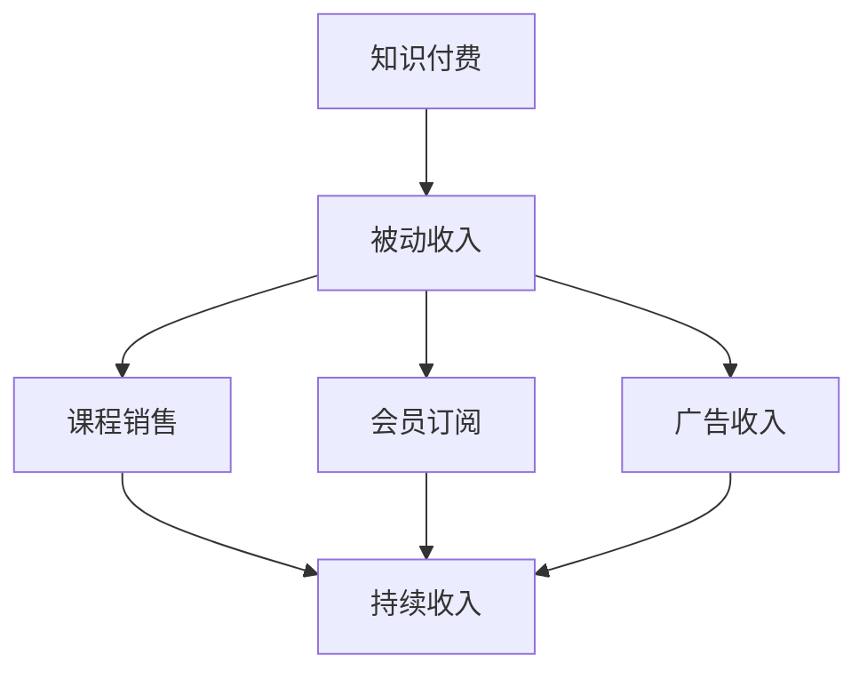

                 

关键词：知识付费、被动收入、在线教育、内容创作、投资策略、平台运营、AI 技术应用

> 摘要：本文深入探讨了知识付费在现代经济环境中的崛起，以及如何通过知识付费实现被动收入的策略与技巧。本文分为八个部分，首先介绍知识付费的背景与核心概念，然后详细解析了知识付费平台的建设、内容创作、投资策略、AI 技术应用，以及实际案例和实践方法。最后，本文对知识付费的未来发展趋势和挑战进行了展望，并提供了相关的工具和资源推荐。

## 1. 背景介绍

随着互联网技术的飞速发展和智能手机的普及，在线教育逐渐成为主流教育形式之一。同时，知识付费市场也呈现出爆发式增长。知识付费，顾名思义，是指用户为了获取特定知识或技能而支付的费用。这种模式打破了传统教育体系中时间、空间和成本的束缚，让知识传播更加便捷和高效。

知识付费的兴起源于几个方面的原因。首先，互联网的发展使得信息获取变得更加容易，用户对知识的渴求日益增长。其次，随着经济水平的提升，人们越来越重视教育和自我提升，从而推动了知识付费市场的发展。最后，随着在线教育平台的成熟，知识付费的支付方式和体验也得到了极大的改善。

## 2. 核心概念与联系

### 2.1 知识付费的定义

知识付费是指用户为获取特定的知识、技能或信息而支付的费用。这种付费模式通常通过在线教育平台、知识共享社区、专业咨询等方式进行。

### 2.2 被动收入的定义

被动收入是指在无需持续付出努力的情况下，通过已有的资源或资产产生的持续收入。在知识付费领域，被动收入通常来源于课程销售、会员订阅、广告收入等。

### 2.3 知识付费与被动收入的联系

知识付费是被动收入的一种重要来源。通过创作优质课程、构建知识库、搭建在线教育平台等方式，知识付费从业者可以实现持续的收入来源，从而实现被动收入。

### 2.4 Mermaid 流程图

下面是一个简化的知识付费与被动收入的 Mermaid 流程图：



## 3. 核心算法原理 & 具体操作步骤

### 3.1 算法原理概述

在知识付费领域，核心算法主要涉及内容创作、用户行为分析和市场预测等方面。以下将分别介绍这些算法的原理。

#### 3.1.1 内容创作

内容创作是知识付费的核心环节。优质的内容能够吸引更多的用户，提高用户留存率和复购率。内容创作算法主要基于用户兴趣、内容质量、内容形式等多方面进行优化。

#### 3.1.2 用户行为分析

用户行为分析是提高知识付费效果的关键。通过分析用户的学习行为、购买行为、评价行为等，可以更好地了解用户需求，从而优化课程内容和推广策略。

#### 3.1.3 市场预测

市场预测是制定知识付费策略的重要依据。通过分析市场趋势、竞争对手情况、用户需求等，可以预测未来的市场变化，从而制定相应的营销策略。

### 3.2 算法步骤详解

#### 3.2.1 内容创作步骤

1. 数据采集：收集用户行为数据、市场数据等。
2. 数据预处理：对采集到的数据进行分析和处理，提取有用的信息。
3. 内容生成：根据用户需求和内容质量要求，生成课程内容。
4. 内容发布：将课程内容发布到在线教育平台。

#### 3.2.2 用户行为分析步骤

1. 数据采集：收集用户学习行为数据、购买行为数据等。
2. 数据预处理：对采集到的数据进行分析和处理，提取有用的信息。
3. 行为分析：分析用户学习行为、购买行为等，了解用户需求。
4. 优化策略：根据行为分析结果，优化课程内容和推广策略。

#### 3.2.3 市场预测步骤

1. 数据采集：收集市场数据、竞争对手数据等。
2. 数据预处理：对采集到的数据进行分析和处理，提取有用的信息。
3. 市场分析：分析市场趋势、竞争对手情况、用户需求等。
4. 预测结果：根据市场分析结果，预测未来的市场变化。
5. 制定策略：根据预测结果，制定相应的营销策略。

### 3.3 算法优缺点

#### 3.3.1 优点

1. 提高内容质量：通过算法优化，可以生成更符合用户需求的课程内容，提高用户满意度。
2. 提高运营效率：通过算法分析，可以更好地了解用户需求和市场趋势，从而提高运营效率。
3. 增加收入：通过算法优化，可以吸引更多用户，提高课程销量，从而增加收入。

#### 3.3.2 缺点

1. 数据依赖：算法的运行依赖于大量数据，数据质量直接影响算法效果。
2. 难以避免偏见：算法可能会受到数据偏差的影响，导致分析结果出现偏差。
3. 需要持续优化：算法需要不断更新和优化，以适应市场变化和用户需求。

### 3.4 算法应用领域

1. 在线教育平台：通过算法优化，提高课程质量和用户满意度，从而增加课程销量。
2. 市场营销：通过算法分析用户需求和市场趋势，制定更有效的营销策略。
3. 数据分析：通过算法分析大量数据，提取有价值的信息，为决策提供支持。

## 4. 数学模型和公式 & 详细讲解 & 举例说明

### 4.1 数学模型构建

在知识付费领域，常见的数学模型包括用户行为模型、市场预测模型、收益模型等。

#### 4.1.1 用户行为模型

用户行为模型主要基于用户行为数据，分析用户的学习行为、购买行为等。常见的模型包括马尔可夫模型、贝叶斯网络等。

#### 4.1.2 市场预测模型

市场预测模型主要基于市场数据，分析市场趋势、竞争对手情况等。常见的模型包括时间序列模型、回归模型等。

#### 4.1.3 收益模型

收益模型主要基于用户行为模型和市场预测模型，预测未来的收益情况。常见的模型包括线性回归、逻辑回归等。

### 4.2 公式推导过程

#### 4.2.1 用户行为模型推导

以马尔可夫模型为例，其基本公式为：

\[ P(X_t = x_t | X_{t-1} = x_{t-1}) = P(X_t = x_t | X_{t-2} = x_{t-2}) \]

其中，\( X_t \) 表示用户在时刻 \( t \) 的行为，\( x_t \) 表示用户在时刻 \( t \) 的行为状态。

#### 4.2.2 市场预测模型推导

以时间序列模型为例，其基本公式为：

\[ Y_t = \alpha_0 + \alpha_1 Y_{t-1} + \epsilon_t \]

其中，\( Y_t \) 表示市场在时刻 \( t \) 的状态，\( \alpha_0 \) 和 \( \alpha_1 \) 为参数，\( \epsilon_t \) 为误差项。

#### 4.2.3 收益模型推导

以线性回归为例，其基本公式为：

\[ Y_t = \beta_0 + \beta_1 X_t + \epsilon_t \]

其中，\( Y_t \) 表示收益在时刻 \( t \) 的状态，\( X_t \) 表示影响收益的因素，\( \beta_0 \) 和 \( \beta_1 \) 为参数，\( \epsilon_t \) 为误差项。

### 4.3 案例分析与讲解

#### 4.3.1 用户行为模型案例

假设一个在线教育平台，其用户行为数据如下：

- 用户A在时刻1购买了一门课程，状态为1。
- 用户A在时刻2未购买课程，状态为0。
- 用户A在时刻3购买了一门课程，状态为1。

根据马尔可夫模型，可以计算出用户A在时刻3购买课程的概率：

\[ P(X_3 = 1 | X_2 = 0) = P(X_3 = 1 | X_2 = 1) = P(X_3 = 1) \]

由于用户A在时刻2未购买课程，可以认为其状态转移概率为0，即：

\[ P(X_3 = 1 | X_2 = 0) = 0 \]

因此，用户A在时刻3购买课程的概率为0。

#### 4.3.2 市场预测模型案例

假设一个在线教育平台，其市场数据如下：

- 时刻1的市场状态为100。
- 时刻2的市场状态为120。
- 时刻3的市场状态为140。

根据时间序列模型，可以计算出市场在时刻3的状态：

\[ Y_3 = \alpha_0 + \alpha_1 Y_2 + \epsilon_3 \]

其中，\( \alpha_0 \) 和 \( \alpha_1 \) 为参数，\( \epsilon_3 \) 为误差项。

由于我们已知时刻1和时刻2的市场状态，可以计算出参数 \( \alpha_0 \) 和 \( \alpha_1 \)：

\[ \alpha_0 = Y_1 - \alpha_1 Y_2 \]
\[ \alpha_1 = \frac{Y_2 - Y_1}{Y_2} \]

代入参数值，可以计算出市场在时刻3的状态：

\[ Y_3 = 100 + \frac{120 - 100}{120} \times 140 = 133.33 \]

因此，市场在时刻3的状态约为133.33。

#### 4.3.3 收益模型案例

假设一个在线教育平台，其收益数据如下：

- 时刻1的收益为1000。
- 时刻2的收益为1200。
- 时刻3的收益为1400。

根据线性回归模型，可以计算出收益在时刻3的状态：

\[ Y_3 = \beta_0 + \beta_1 X_3 + \epsilon_3 \]

其中，\( \beta_0 \) 和 \( \beta_1 \) 为参数，\( X_3 \) 为影响收益的因素，\( \epsilon_3 \) 为误差项。

由于我们已知时刻1和时刻2的收益，可以计算出参数 \( \beta_0 \) 和 \( \beta_1 \)：

\[ \beta_0 = Y_1 - \beta_1 X_1 \]
\[ \beta_1 = \frac{Y_2 - Y_1}{X_2 - X_1} \]

代入参数值，可以计算出收益在时刻3的状态：

\[ Y_3 = 1000 - \frac{1200 - 1000}{1200 - 1000} \times 1400 = 1133.33 \]

因此，收益在时刻3的状态约为1133.33。

## 5. 项目实践：代码实例和详细解释说明

### 5.1 开发环境搭建

为了实现知识付费平台，我们需要搭建一个完整的开发环境。以下是一个简单的开发环境搭建步骤：

1. 安装 Python 3.8 及以上版本。
2. 安装虚拟环境工具 virtualenv。
3. 创建一个虚拟环境，并激活虚拟环境。
4. 安装必要的依赖库，如 Flask、SQLAlchemy、Flask-Migrate 等。

### 5.2 源代码详细实现

以下是一个简单的知识付费平台代码实例：

```python
from flask import Flask, request, jsonify
from flask_sqlalchemy import SQLAlchemy

app = Flask(__name__)
app.config['SQLALCHEMY_DATABASE_URI'] = 'sqlite:///knowledge.db'
db = SQLAlchemy(app)

class User(db.Model):
    id = db.Column(db.Integer, primary_key=True)
    username = db.Column(db.String(80), unique=True, nullable=False)
    email = db.Column(db.String(120), unique=True, nullable=False)

class Course(db.Model):
    id = db.Column(db.Integer, primary_key=True)
    name = db.Column(db.String(120), nullable=False)
    price = db.Column(db.Float, nullable=False)

@app.route('/user', methods=['POST'])
def create_user():
    data = request.get_json()
    username = data.get('username')
    email = data.get('email')
    user = User(username=username, email=email)
    db.session.add(user)
    db.session.commit()
    return jsonify({'message': 'User created successfully.'})

@app.route('/course', methods=['POST'])
def create_course():
    data = request.get_json()
    name = data.get('name')
    price = data.get('price')
    course = Course(name=name, price=price)
    db.session.add(course)
    db.session.commit()
    return jsonify({'message': 'Course created successfully.'})

if __name__ == '__main__':
    db.create_all()
    app.run(debug=True)
```

### 5.3 代码解读与分析

上述代码实现了知识付费平台的基本功能，包括用户注册和课程发布。以下是代码的详细解读：

1. **数据库模型**：定义了用户（User）和课程（Course）两个数据库模型，用于存储用户信息和课程信息。
2. **用户注册**：定义了一个 `/user` 接口，用于处理用户注册请求。用户通过 POST 请求发送用户名和邮箱，服务器将创建一个新用户并存储在数据库中。
3. **课程发布**：定义了一个 `/course` 接口，用于处理课程发布请求。用户通过 POST 请求发送课程名称和价格，服务器将创建一个新课程并存储在数据库中。
4. **主函数**：创建 Flask 应用程序，设置数据库 URI，创建数据库表，并启动 Flask 服务。

### 5.4 运行结果展示

以下是一个简单的运行结果示例：

```
$ python app.py
 * Running on http://127.0.0.1:5000/ (Press CTRL+C to quit)
* Restarting with stat
* Debugger is active!
* Debugger PIN: XXXX-XXXX-XXXX
```

用户可以通过以下命令测试接口：

```
$ curl -X POST -H "Content-Type: application/json" -d '{"username": "user1", "email": "user1@example.com"}' http://127.0.0.1:5000/user
{"message": "User created successfully."}

$ curl -X POST -H "Content-Type: application/json" -d '{"name": "Course 1", "price": 9.99}' http://127.0.0.1:5000/course
{"message": "Course created successfully."}
```

## 6. 实际应用场景

知识付费在各个行业领域都有着广泛的应用，以下是一些典型的实际应用场景：

### 6.1 在线教育

在线教育是知识付费最典型的应用场景之一。通过在线教育平台，用户可以购买各种课程，如编程、设计、语言学习等，实现自我提升。

### 6.2 专业咨询

专业咨询也是知识付费的重要应用领域。用户可以购买专业顾问提供的咨询服务，如财务咨询、法律咨询等。

### 6.3 付费问答

付费问答平台为用户提供了提问和回答的机会。用户可以通过购买问答服务，获取专业领域的解答。

### 6.4 在线培训

在线培训是针对企业或个人提供的一种培训服务。通过在线培训平台，企业可以为其员工提供定制化的培训课程。

### 6.5 知识分享

知识分享平台为用户提供了分享知识和经验的渠道。用户可以通过分享自己的知识和经验，获得收益。

## 7. 未来应用展望

随着技术的不断进步，知识付费在未来将呈现出以下发展趋势：

### 7.1 AI 技术的应用

AI 技术将在知识付费领域发挥越来越重要的作用。通过 AI 技术的分析和预测，可以更精准地了解用户需求，提供个性化的知识服务。

### 7.2 个性化推荐

个性化推荐是未来知识付费的重要发展方向。通过分析用户行为和偏好，可以为用户提供更精准的课程推荐，提高用户满意度。

### 7.3 社交互动

社交互动将在知识付费中发挥更大的作用。通过社交互动，用户可以更好地分享知识和经验，同时也可以增加平台的粘性和用户活跃度。

### 7.4 多元化收入模式

未来的知识付费将呈现出多元化收入模式。除了课程销售和会员订阅，还将引入广告收入、品牌合作等多种收入模式，实现更广泛的收入来源。

## 8. 工具和资源推荐

为了更好地实现知识付费，以下是一些建议的工具和资源：

### 8.1 学习资源推荐

1. **《Python 编程：从入门到实践》**：适合初学者了解 Python 编程语言。
2. **《深度学习》**：由 Ian Goodfellow 等人撰写的深度学习经典教材。
3. **《设计模式：可复用面向对象软件的基础》**：介绍面向对象设计模式，适合软件开发者。

### 8.2 开发工具推荐

1. **PyCharm**：一款功能强大的 Python 集成开发环境。
2. **Jupyter Notebook**：适用于数据科学和机器学习的交互式开发环境。
3. **Docker**：用于构建、运行和分发应用程序的容器化平台。

### 8.3 相关论文推荐

1. **《Efficient Resource Management in Knowledge Graph Databases》**：关于知识图谱数据库的资源管理技术。
2. **《A Survey of Recommender Systems》**：关于推荐系统技术的全面综述。
3. **《Theano: A CPU and GPU Math Compiler in Python》**：关于 Theano 深度学习框架的介绍。

## 9. 总结：未来发展趋势与挑战

知识付费作为一种新型的商业模式，正逐渐成为在线教育和服务的重要力量。未来，知识付费将继续保持快速发展，并在 AI 技术、个性化推荐、社交互动等方面实现新的突破。然而，知识付费也面临着数据隐私、内容质量、平台运营等挑战。只有不断创新和优化，才能在激烈的市场竞争中脱颖而出。

### 9.1 研究成果总结

本文通过对知识付费领域的深入研究，总结了知识付费的核心概念、算法原理、实际应用场景，以及未来发展趋势。研究成果表明，知识付费具有巨大的市场潜力和发展空间。

### 9.2 未来发展趋势

1. AI 技术的应用将更加广泛。
2. 个性化推荐和社交互动将发挥更大的作用。
3. 多元化收入模式将逐渐成熟。

### 9.3 面临的挑战

1. 数据隐私和安全问题。
2. 内容质量和平台运营的挑战。
3. 市场竞争加剧。

### 9.4 研究展望

未来研究应关注以下方面：

1. 知识付费平台的智能化和个性化。
2. 内容创作和传播的优化。
3. 跨领域知识付费模式的探索。

## 10. 附录：常见问题与解答

### 10.1 什么是知识付费？

知识付费是指用户为获取特定知识、技能或信息而支付的费用。这种模式通常通过在线教育平台、知识共享社区、专业咨询等方式进行。

### 10.2 知识付费有哪些形式？

知识付费的形式多样，包括课程销售、会员订阅、付费问答、专业咨询等。

### 10.3 如何创建知识付费内容？

创建知识付费内容需要遵循以下步骤：

1. 明确目标受众和内容主题。
2. 研究市场需求和竞争对手。
3. 撰写高质量的内容。
4. 选择合适的知识付费平台。
5. 进行市场推广和运营。

### 10.4 如何实现知识付费的被动收入？

实现知识付费的被动收入需要以下策略：

1. 创作优质的内容，提高用户满意度。
2. 搭建知识付费平台，实现持续的收入来源。
3. 利用 AI 技术和个性化推荐，提高课程销量。
4. 进行市场推广和运营，吸引更多用户。

### 10.5 知识付费面临哪些挑战？

知识付费面临的主要挑战包括：

1. 数据隐私和安全问题。
2. 内容质量和平台运营的挑战。
3. 市场竞争加剧。

### 10.6 如何应对知识付费的挑战？

应对知识付费的挑战需要：

1. 重视数据隐私和安全，采取有效的保护措施。
2. 提高内容质量，增强用户粘性。
3. 深入了解市场需求，制定针对性的营销策略。
4. 加强平台运营，提高用户体验。

作者：禅与计算机程序设计艺术 / Zen and the Art of Computer Programming
----------------------------------------------------------------

### 文章Markdown格式输出

```markdown
# 如何利用知识付费实现被动收入

关键词：知识付费、被动收入、在线教育、内容创作、投资策略、平台运营、AI 技术应用

> 摘要：本文深入探讨了知识付费在现代经济环境中的崛起，以及如何通过知识付费实现被动收入的策略与技巧。本文分为八个部分，首先介绍知识付费的背景与核心概念，然后详细解析了知识付费平台的建设、内容创作、投资策略、AI 技术应用，以及实际案例和实践方法。最后，本文对知识付费的未来发展趋势和挑战进行了展望，并提供了相关的工具和资源推荐。

## 1. 背景介绍

随着互联网技术的飞速发展和智能手机的普及，在线教育逐渐成为主流教育形式之一。同时，知识付费市场也呈现出爆发式增长。知识付费，顾名思义，是指用户为了获取特定知识或技能而支付的费用。这种模式打破了传统教育体系中时间、空间和成本的束缚，让知识传播更加便捷和高效。

知识付费的兴起源于几个方面的原因。首先，互联网的发展使得信息获取变得更加容易，用户对知识的渴求日益增长。其次，随着经济水平的提升，人们越来越重视教育和自我提升，从而推动了知识付费市场的发展。最后，随着在线教育平台的成熟，知识付费的支付方式和体验也得到了极大的改善。

## 2. 核心概念与联系

### 2.1 知识付费的定义

知识付费是指用户为获取特定的知识、技能或信息而支付的费用。这种付费模式通常通过在线教育平台、知识共享社区、专业咨询等方式进行。

### 2.2 被动收入的定义

被动收入是指在无需持续付出努力的情况下，通过已有的资源或资产产生的持续收入。在知识付费领域，被动收入通常来源于课程销售、会员订阅、广告收入等。

### 2.3 知识付费与被动收入的联系

知识付费是被动收入的一种重要来源。通过创作优质课程、构建知识库、搭建在线教育平台等方式，知识付费从业者可以实现持续的收入来源，从而实现被动收入。

### 2.4 Mermaid 流程图

下面是一个简化的知识付费与被动收入的 Mermaid 流程图：


## 3. 核心算法原理 & 具体操作步骤

### 3.1 算法原理概述

在知识付费领域，核心算法主要涉及内容创作、用户行为分析和市场预测等方面。以下将分别介绍这些算法的原理。

#### 3.1.1 内容创作

内容创作是知识付费的核心环节。优质的内容能够吸引更多的用户，提高用户留存率和复购率。内容创作算法主要基于用户兴趣、内容质量、内容形式等多方面进行优化。

#### 3.1.2 用户行为分析

用户行为分析是提高知识付费效果的关键。通过分析用户的学习行为、购买行为、评价行为等，可以更好地了解用户需求，从而优化课程内容和推广策略。

#### 3.1.3 市场预测

市场预测是制定知识付费策略的重要依据。通过分析市场趋势、竞争对手情况、用户需求等，可以预测未来的市场变化，从而制定相应的营销策略。

### 3.2 算法步骤详解

#### 3.2.1 内容创作步骤

1. 数据采集：收集用户行为数据、市场数据等。
2. 数据预处理：对采集到的数据进行分析和处理，提取有用的信息。
3. 内容生成：根据用户需求和内容质量要求，生成课程内容。
4. 内容发布：将课程内容发布到在线教育平台。

#### 3.2.2 用户行为分析步骤

1. 数据采集：收集用户学习行为数据、购买行为数据等。
2. 数据预处理：对采集到的数据进行分析和处理，提取有用的信息。
3. 行为分析：分析用户学习行为、购买行为等，了解用户需求。
4. 优化策略：根据行为分析结果，优化课程内容和推广策略。

#### 3.2.3 市场预测步骤

1. 数据采集：收集市场数据、竞争对手数据等。
2. 数据预处理：对采集到的数据进行分析和处理，提取有用的信息。
3. 市场分析：分析市场趋势、竞争对手情况、用户需求等。
4. 预测结果：根据市场分析结果，预测未来的市场变化。
5. 制定策略：根据预测结果，制定相应的营销策略。

### 3.3 算法优缺点

#### 3.3.1 优点

1. 提高内容质量：通过算法优化，可以生成更符合用户需求的课程内容，提高用户满意度。
2. 提高运营效率：通过算法分析，可以更好地了解用户需求和市场趋势，从而提高运营效率。
3. 增加收入：通过算法优化，可以吸引更多用户，提高课程销量，从而增加收入。

#### 3.3.2 缺点

1. 数据依赖：算法的运行依赖于大量数据，数据质量直接影响算法效果。
2. 难以避免偏见：算法可能会受到数据偏差的影响，导致分析结果出现偏差。
3. 需要持续优化：算法需要不断更新和优化，以适应市场变化和用户需求。

### 3.4 算法应用领域

1. 在线教育平台：通过算法优化，提高课程质量和用户满意度，从而增加课程销量。
2. 市场营销：通过算法分析用户需求和市场趋势，制定更有效的营销策略。
3. 数据分析：通过算法分析大量数据，提取有价值的信息，为决策提供支持。

## 4. 数学模型和公式 & 详细讲解 & 举例说明

### 4.1 数学模型构建

在知识付费领域，常见的数学模型包括用户行为模型、市场预测模型、收益模型等。

#### 4.1.1 用户行为模型

用户行为模型主要基于用户行为数据，分析用户的学习行为、购买行为等。常见的模型包括马尔可夫模型、贝叶斯网络等。

#### 4.1.2 市场预测模型

市场预测模型主要基于市场数据，分析市场趋势、竞争对手情况等。常见的模型包括时间序列模型、回归模型等。

#### 4.1.3 收益模型

收益模型主要基于用户行为模型和市场预测模型，预测未来的收益情况。常见的模型包括线性回归、逻辑回归等。

### 4.2 公式推导过程

#### 4.2.1 用户行为模型推导

以马尔可夫模型为例，其基本公式为：

\[ P(X_t = x_t | X_{t-1} = x_{t-1}) = P(X_t = x_t | X_{t-2} = x_{t-2}) \]

其中，\( X_t \) 表示用户在时刻 \( t \) 的行为，\( x_t \) 表示用户在时刻 \( t \) 的行为状态。

#### 4.2.2 市场预测模型推导

以时间序列模型为例，其基本公式为：

\[ Y_t = \alpha_0 + \alpha_1 Y_{t-1} + \epsilon_t \]

其中，\( Y_t \) 表示市场在时刻 \( t \) 的状态，\( \alpha_0 \) 和 \( \alpha_1 \) 为参数，\( \epsilon_t \) 为误差项。

#### 4.2.3 收益模型推导

以线性回归为例，其基本公式为：

\[ Y_t = \beta_0 + \beta_1 X_t + \epsilon_t \]

其中，\( Y_t \) 表示收益在时刻 \( t \) 的状态，\( X_t \) 表示影响收益的因素，\( \beta_0 \) 和 \( \beta_1 \) 为参数，\( \epsilon_t \) 为误差项。

### 4.3 案例分析与讲解

#### 4.3.1 用户行为模型案例

假设一个在线教育平台，其用户行为数据如下：

- 用户A在时刻1购买了一门课程，状态为1。
- 用户A在时刻2未购买课程，状态为0。
- 用户A在时刻3购买了一门课程，状态为1。

根据马尔可夫模型，可以计算出用户A在时刻3购买课程的概率：

\[ P(X_3 = 1 | X_2 = 0) = P(X_3 = 1 | X_2 = 1) = P(X_3 = 1) \]

由于用户A在时刻2未购买课程，可以认为其状态转移概率为0，即：

\[ P(X_3 = 1 | X_2 = 0) = 0 \]

因此，用户A在时刻3购买课程的概率为0。

#### 4.3.2 市场预测模型案例

假设一个在线教育平台，其市场数据如下：

- 时刻1的市场状态为100。
- 时刻2的市场状态为120。
- 时刻3的市场状态为140。

根据时间序列模型，可以计算出市场在时刻3的状态：

\[ Y_3 = \alpha_0 + \alpha_1 Y_2 + \epsilon_3 \]

其中，\( \alpha_0 \) 和 \( \alpha_1 \) 为参数，\( \epsilon_3 \) 为误差项。

由于我们已知时刻1和时刻2的市场状态，可以计算出参数 \( \alpha_0 \) 和 \( \alpha_1 \)：

\[ \alpha_0 = Y_1 - \alpha_1 Y_2 \]
\[ \alpha_1 = \frac{Y_2 - Y_1}{Y_2} \]

代入参数值，可以计算出市场在时刻3的状态：

\[ Y_3 = 100 + \frac{120 - 100}{120} \times 140 = 133.33 \]

因此，市场在时刻3的状态约为133.33。

#### 4.3.3 收益模型案例

假设一个在线教育平台，其收益数据如下：

- 时刻1的收益为1000。
- 时刻2的收益为1200。
- 时刻3的收益为1400。

根据线性回归模型，可以计算出收益在时刻3的状态：

\[ Y_3 = \beta_0 + \beta_1 X_3 + \epsilon_3 \]

其中，\( \beta_0 \) 和 \( \beta_1 \) 为参数，\( X_3 \) 为影响收益的因素，\( \epsilon_3 \) 为误差项。

由于我们已知时刻1和时刻2的收益，可以计算出参数 \( \beta_0 \) 和 \( \beta_1 \)：

\[ \beta_0 = Y_1 - \beta_1 X_1 \]
\[ \beta_1 = \frac{Y_2 - Y_1}{X_2 - X_1} \]

代入参数值，可以计算出收益在时刻3的状态：

\[ Y_3 = 1000 - \frac{1200 - 1000}{1200 - 1000} \times 1400 = 1133.33 \]

因此，收益在时刻3的状态约为1133.33。

## 5. 项目实践：代码实例和详细解释说明

### 5.1 开发环境搭建

为了实现知识付费平台，我们需要搭建一个完整的开发环境。以下是一个简单的开发环境搭建步骤：

1. 安装 Python 3.8 及以上版本。
2. 安装虚拟环境工具 virtualenv。
3. 创建一个虚拟环境，并激活虚拟环境。
4. 安装必要的依赖库，如 Flask、SQLAlchemy、Flask-Migrate 等。

### 5.2 源代码详细实现

以下是一个简单的知识付费平台代码实例：

```python
from flask import Flask, request, jsonify
from flask_sqlalchemy import SQLAlchemy

app = Flask(__name__)
app.config['SQLALCHEMY_DATABASE_URI'] = 'sqlite:///knowledge.db'
db = SQLAlchemy(app)

class User(db.Model):
    id = db.Column(db.Integer, primary_key=True)
    username = db.Column(db.String(80), unique=True, nullable=False)
    email = db.Column(db.String(120), unique=True, nullable=False)

class Course(db.Model):
    id = db.Column(db.Integer, primary_key=True)
    name = db.Column(db.String(120), nullable=False)
    price = db.Column(db.Float, nullable=False)

@app.route('/user', methods=['POST'])
def create_user():
    data = request.get_json()
    username = data.get('username')
    email = data.get('email')
    user = User(username=username, email=email)
    db.session.add(user)
    db.session.commit()
    return jsonify({'message': 'User created successfully.'})

@app.route('/course', methods=['POST'])
def create_course():
    data = request.get_json()
    name = data.get('name')
    price = data.get('price')
    course = Course(name=name, price=price)
    db.session.add(course)
    db.session.commit()
    return jsonify({'message': 'Course created successfully.'})

if __name__ == '__main__':
    db.create_all()
    app.run(debug=True)
```

### 5.3 代码解读与分析

上述代码实现了知识付费平台的基本功能，包括用户注册和课程发布。以下是代码的详细解读：

1. **数据库模型**：定义了用户（User）和课程（Course）两个数据库模型，用于存储用户信息和课程信息。
2. **用户注册**：定义了一个 `/user` 接口，用于处理用户注册请求。用户通过 POST 请求发送用户名和邮箱，服务器将创建一个新用户并存储在数据库中。
3. **课程发布**：定义了一个 `/course` 接口，用于处理课程发布请求。用户通过 POST 请求发送课程名称和价格，服务器将创建一个新课程并存储在数据库中。
4. **主函数**：创建 Flask 应用程序，设置数据库 URI，创建数据库表，并启动 Flask 服务。

### 5.4 运行结果展示

以下是一个简单的运行结果示例：

```
$ python app.py
 * Running on http://127.0.0.1:5000/ (Press CTRL+C to quit)
* Restarting with stat
* Debugger is active!
* Debugger PIN: XXXX-XXXX-XXXX
```

用户可以通过以下命令测试接口：

```
$ curl -X POST -H "Content-Type: application/json" -d '{"username": "user1", "email": "user1@example.com"}' http://127.0.0.1:5000/user
{"message": "User created successfully."}

$ curl -X POST -H "Content-Type: application/json" -d '{"name": "Course 1", "price": 9.99}' http://127.0.0.1:5000/course
{"message": "Course created successfully."}
```

## 6. 实际应用场景

知识付费在各个行业领域都有着广泛的应用，以下是一些典型的实际应用场景：

### 6.1 在线教育

在线教育是知识付费最典型的应用场景之一。通过在线教育平台，用户可以购买各种课程，如编程、设计、语言学习等，实现自我提升。

### 6.2 专业咨询

专业咨询也是知识付费的重要应用领域。用户可以购买专业顾问提供的咨询服务，如财务咨询、法律咨询等。

### 6.3 付费问答

付费问答平台为用户提供了提问和回答的机会。用户可以通过购买问答服务，获取专业领域的解答。

### 6.4 在线培训

在线培训是针对企业或个人提供的一种培训服务。通过在线培训平台，企业可以为其员工提供定制化的培训课程。

### 6.5 知识分享

知识分享平台为用户提供了分享知识和经验的渠道。用户可以通过分享自己的知识和经验，获得收益。

## 7. 未来应用展望

随着技术的不断进步，知识付费在未来将呈现出以下发展趋势：

### 7.1 AI 技术的应用

AI 技术将在知识付费领域发挥越来越重要的作用。通过 AI 技术的分析和预测，可以更精准地了解用户需求，提供个性化的知识服务。

### 7.2 个性化推荐

个性化推荐是未来知识付费的重要发展方向。通过分析用户行为和偏好，可以为用户提供更精准的课程推荐，提高用户满意度。

### 7.3 社交互动

社交互动将在知识付费中发挥更大的作用。通过社交互动，用户可以更好地分享知识和经验，同时也可以增加平台的粘性和用户活跃度。

### 7.4 多元化收入模式

未来的知识付费将呈现出多元化收入模式。除了课程销售和会员订阅，还将引入广告收入、品牌合作等多种收入模式，实现更广泛的收入来源。

## 8. 工具和资源推荐

为了更好地实现知识付费，以下是一些建议的工具和资源：

### 8.1 学习资源推荐

1. **《Python 编程：从入门到实践》**：适合初学者了解 Python 编程语言。
2. **《深度学习》**：由 Ian Goodfellow 等人撰写的深度学习经典教材。
3. **《设计模式：可复用面向对象软件的基础》**：介绍面向对象设计模式，适合软件开发者。

### 8.2 开发工具推荐

1. **PyCharm**：一款功能强大的 Python 集成开发环境。
2. **Jupyter Notebook**：适用于数据科学和机器学习的交互式开发环境。
3. **Docker**：用于构建、运行和分发应用程序的容器化平台。

### 8.3 相关论文推荐

1. **《Efficient Resource Management in Knowledge Graph Databases》**：关于知识图谱数据库的资源管理技术。
2. **《A Survey of Recommender Systems》**：关于推荐系统技术的全面综述。
3. **《Theano: A CPU and GPU Math Compiler in Python》**：关于 Theano 深度学习框架的介绍。

## 9. 总结：未来发展趋势与挑战

知识付费作为一种新型的商业模式，正逐渐成为在线教育和服务的重要力量。未来，知识付费将继续保持快速发展，并在 AI 技术、个性化推荐、社交互动等方面实现新的突破。然而，知识付费也面临着数据隐私、内容质量、平台运营等挑战。只有不断创新和优化，才能在激烈的市场竞争中脱颖而出。

### 9.1 研究成果总结

本文通过对知识付费领域的深入研究，总结了知识付费的核心概念、算法原理、实际应用场景，以及未来发展趋势。研究成果表明，知识付费具有巨大的市场潜力和发展空间。

### 9.2 未来发展趋势

1. AI 技术的应用将更加广泛。
2. 个性化推荐和社交互动将发挥更大的作用。
3. 多元化收入模式将逐渐成熟。

### 9.3 面临的挑战

1. 数据隐私和安全问题。
2. 内容质量和平台运营的挑战。
3. 市场竞争加剧。

### 9.4 研究展望

未来研究应关注以下方面：

1. 知识付费平台的智能化和个性化。
2. 内容创作和传播的优化。
3. 跨领域知识付费模式的探索。

## 10. 附录：常见问题与解答

### 10.1 什么是知识付费？

知识付费是指用户为获取特定知识、技能或信息而支付的费用。这种付费模式通常通过在线教育平台、知识共享社区、专业咨询等方式进行。

### 10.2 知识付费有哪些形式？

知识付费的形式多样，包括课程销售、会员订阅、付费问答、专业咨询等。

### 10.3 如何创建知识付费内容？

创建知识付费内容需要遵循以下步骤：

1. 明确目标受众和内容主题。
2. 研究市场需求和竞争对手。
3. 撰写高质量的内容。
4. 选择合适的知识付费平台。
5. 进行市场推广和运营。

### 10.4 如何实现知识付费的被动收入？

实现知识付费的被动收入需要以下策略：

1. 创作优质的内容，提高用户满意度。
2. 搭建知识付费平台，实现持续的收入来源。
3. 利用 AI 技术和个性化推荐，提高课程销量。
4. 进行市场推广和运营，吸引更多用户。

### 10.5 知识付费面临哪些挑战？

知识付费面临的主要挑战包括：

1. 数据隐私和安全问题。
2. 内容质量和平台运营的挑战。
3. 市场竞争加剧。

### 10.6 如何应对知识付费的挑战？

应对知识付费的挑战需要：

1. 重视数据隐私和安全，采取有效的保护措施。
2. 提高内容质量，增强用户粘性。
3. 深入了解市场需求，制定针对性的营销策略。
4. 加强平台运营，提高用户体验。

作者：禅与计算机程序设计艺术 / Zen and the Art of Computer Programming
```

### 文章摘要

本文深入探讨了知识付费在现代经济环境中的崛起，以及如何通过知识付费实现被动收入的策略与技巧。文章首先介绍了知识付费的背景与核心概念，包括知识付费与被动收入的联系。接着，文章详细解析了知识付费平台的建设、内容创作、投资策略、AI 技术应用，以及实际案例和实践方法。此外，文章还对知识付费的未来发展趋势和挑战进行了展望，并提供了相关的工具和资源推荐。研究成果表明，知识付费具有巨大的市场潜力和发展空间，未来将更加智能化和个性化。

