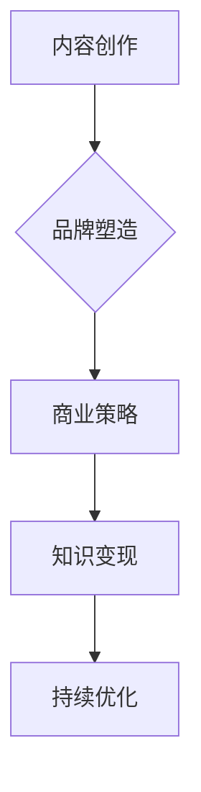

                 

关键词：知识付费，个人IP，内容创作，品牌塑造，商业策略

> 摘要：在信息爆炸的时代，个人IP的打造已成为许多专业人士追求的目标。本文将深入探讨如何利用知识付费这一新兴模式，通过内容创作、品牌塑造和商业策略，成功打造个人IP。

## 1. 背景介绍

随着互联网技术的飞速发展，知识付费成为了一个蓬勃发展的领域。人们对于专业化、个性化的知识和内容需求日益增长，这为专业人士提供了一个前所未有的机会。打造个人IP不仅能提升个人品牌价值，还能通过知识付费实现持续的收入增长。

### 1.1 知识付费的定义

知识付费是指用户为获取特定领域的专业知识、技能或经验而支付的费用。这种模式在近年来逐渐流行，主要得益于以下几个因素：

- **信息过载**：在信息爆炸的时代，用户需要更加精准和高效地获取知识。
- **内容消费习惯**：随着人们收入水平的提高，对于高质量内容的消费习惯逐渐养成。
- **技术进步**：互联网技术的发展，为知识付费提供了更加便捷和多样化的传播渠道。

### 1.2 个人IP的价值

个人IP（Intellectual Property）是指个人在某个领域内所建立的独特品牌形象和声誉。它具有以下价值：

- **品牌价值**：个人IP能够提升个人在行业内的知名度和影响力。
- **经济价值**：通过知识付费、产品销售等多种方式，个人IP能够带来持续的经济收益。
- **资源整合**：个人IP能够吸引更多的合作伙伴、投资人，实现资源的有效整合。

## 2. 核心概念与联系

为了更好地理解如何利用知识付费打造个人IP，我们需要先了解几个核心概念及其之间的联系。

### 2.1 内容创作

内容创作是打造个人IP的基础。高质量的内容不仅能够满足用户的需求，还能展示个人的专业能力和独特见解。内容创作包括以下几个方面：

- **选题策划**：根据目标受众的需求，选择有针对性的话题和内容。
- **内容形式**：文字、音频、视频等多种形式，以适应不同用户的需求。
- **持续更新**：保持内容的持续更新，保持与受众的互动和粘性。

### 2.2 品牌塑造

品牌塑造是个人IP打造的关键环节。一个成功的个人品牌能够树立良好的形象，赢得用户的信任和认可。品牌塑造包括以下几个方面：

- **定位**：明确个人品牌的定位，突出个人独特性和专业性。
- **传播**：通过社交媒体、线上活动等多种渠道，传播个人品牌信息。
- **互动**：与受众建立良好的互动关系，增强用户粘性。

### 2.3 商业策略

商业策略是个人IP变现的关键。一个有效的商业策略能够帮助个人IP实现持续的收入增长。商业策略包括以下几个方面：

- **产品规划**：根据受众需求，规划不同的产品和服务。
- **价格策略**：合理定价，既要保证利润，又要考虑用户接受度。
- **推广渠道**：利用多种推广渠道，提高产品的曝光度和销售量。

### 2.4 Mermaid 流程图

以下是利用知识付费打造个人IP的Mermaid流程图：



## 3. 核心算法原理 & 具体操作步骤

### 3.1 算法原理概述

打造个人IP的核心算法是基于用户需求的内容创作、品牌塑造和商业策略的有机整合。具体来说，该算法包括以下几个步骤：

1. **内容创作**：根据用户需求，进行选题策划和内容创作。
2. **品牌塑造**：明确个人品牌定位，进行品牌传播和互动。
3. **商业策略**：制定商业计划，实现知识变现和持续优化。

### 3.2 算法步骤详解

1. **内容创作**：

   - **选题策划**：通过市场调研，了解用户需求和兴趣点。
   - **内容创作**：根据选题，进行内容创作，包括文字、音频、视频等多种形式。
   - **内容优化**：根据用户反馈，不断优化内容，提高用户满意度。

2. **品牌塑造**：

   - **定位**：明确个人品牌定位，突出个人独特性和专业性。
   - **传播**：利用社交媒体、线上活动等渠道，传播个人品牌信息。
   - **互动**：与受众建立良好的互动关系，增强用户粘性。

3. **商业策略**：

   - **产品规划**：根据受众需求，规划不同的产品和服务。
   - **价格策略**：合理定价，既要保证利润，又要考虑用户接受度。
   - **推广渠道**：利用多种推广渠道，提高产品的曝光度和销售量。

### 3.3 算法优缺点

#### 优点：

- **灵活性强**：可以根据用户需求和市场变化，灵活调整内容和策略。
- **可持续性**：通过持续的内容创作和品牌塑造，实现持续的知识变现。
- **个性化**：针对不同用户需求，提供个性化的知识和服务。

#### 缺点：

- **需要时间和精力**：内容创作和品牌塑造需要大量的时间和精力投入。
- **市场风险**：面对激烈的市场竞争，需要不断优化和调整策略。

### 3.4 算法应用领域

该算法主要应用于知识付费领域，包括在线教育、专业咨询、内容创作等。此外，也可以在其他领域进行应用，如自媒体运营、网红经济等。

## 4. 数学模型和公式 & 详细讲解 & 举例说明

### 4.1 数学模型构建

为了更好地理解个人IP的构建过程，我们可以构建一个简单的数学模型。该模型包括三个主要因素：内容质量（Q）、品牌知名度（B）和商业策略（C）。

个人IP价值（V）= Q × B × C

### 4.2 公式推导过程

1. **内容质量（Q）**：

   内容质量是个人IP的基础。高质量的内容能够吸引用户，提高用户满意度和忠诚度。内容质量可以通过以下几个指标进行衡量：

   - **内容深度**：内容的深度和广度。
   - **内容质量**：内容的准确性、实用性和原创性。
   - **用户反馈**：用户对内容的评价和反馈。

2. **品牌知名度（B）**：

   品牌知名度是个人IP的重要指标。高知名度的品牌能够提高用户对内容的信任度，增加用户粘性。品牌知名度可以通过以下几个指标进行衡量：

   - **传播范围**：品牌信息传播的范围和覆盖面。
   - **口碑**：用户对品牌的评价和推荐。
   - **活跃度**：用户与品牌的互动频率和参与度。

3. **商业策略（C）**：

   商业策略是个人IP变现的关键。有效的商业策略能够实现知识的变现，提高个人IP的经济价值。商业策略可以通过以下几个指标进行衡量：

   - **产品规划**：产品的种类和数量。
   - **价格策略**：产品的定价策略。
   - **推广渠道**：推广渠道的多样性和效果。

### 4.3 案例分析与讲解

以下是一个简单的案例，用于说明如何利用数学模型构建个人IP。

假设有一个专业程序员想要利用知识付费打造个人IP。他拥有丰富的编程经验，并且已经建立了自己的博客和社交媒体账号。

1. **内容质量（Q）**：

   - **内容深度**：他撰写了多篇关于编程技术的高质量文章，内容涵盖了各种编程语言和框架。
   - **内容质量**：他的文章得到了大量用户的点赞和评论，证明内容具有实用性和原创性。
   - **用户反馈**：用户对他的内容评价很高，纷纷表示愿意付费获取更多内容。

2. **品牌知名度（B）**：

   - **传播范围**：他的博客和社交媒体账号拥有数千粉丝，内容得到了广泛的传播。
   - **口碑**：用户对他的评价很高，认为他是一个有价值的知识来源。
   - **活跃度**：他定期更新内容，与用户保持良好的互动。

3. **商业策略（C）**：

   - **产品规划**：他推出了付费课程，涵盖了编程基础、进阶和实战等内容。
   - **价格策略**：课程定价适中，既保证了利润，又考虑了用户的接受度。
   - **推广渠道**：他在博客、社交媒体和相关的技术社区进行推广，提高了课程的曝光度。

根据数学模型，个人IP价值（V）= Q × B × C。在这个案例中，Q=0.9（表示高质量内容），B=0.8（表示高知名度），C=0.7（表示良好商业策略）。因此，V=0.9 × 0.8 × 0.7 = 0.504。

这意味着，他的个人IP价值为0.504，表示他通过知识付费可以实现约504元的经济收益。

## 5. 项目实践：代码实例和详细解释说明

### 5.1 开发环境搭建

为了实现知识付费功能，我们需要搭建一个简单的后端服务器。以下是一个基于Python的Flask框架的简单服务器搭建步骤：

1. **安装Python**：确保Python环境已安装在本地机器。
2. **安装Flask**：在命令行中执行`pip install flask`命令，安装Flask框架。
3. **创建Flask应用**：在本地创建一个名为`knowledge_management`的文件夹，并在其中创建一个名为`app.py`的文件。

### 5.2 源代码详细实现

以下是`app.py`文件的详细实现：

```python
from flask import Flask, jsonify, request
app = Flask(__name__)

# 存储用户信息的字典
users = {}

@app.route('/api/register', methods=['POST'])
def register():
    data = request.get_json()
    username = data.get('username')
    password = data.get('password')
    if username in users:
        return jsonify({'error': '用户名已存在'})
    users[username] = password
    return jsonify({'message': '注册成功'})

@app.route('/api/login', methods=['POST'])
def login():
    data = request.get_json()
    username = data.get('username')
    password = data.get('password')
    if username not in users or users[username] != password:
        return jsonify({'error': '登录失败'})
    return jsonify({'message': '登录成功'})

@app.route('/api/knowledge', methods=['GET'])
def get_knowledge():
    username = request.args.get('username')
    password = request.args.get('password')
    if username not in users or users[username] != password:
        return jsonify({'error': '无权限访问'})
    knowledge = "这是一段关于编程的知识。"
    return jsonify({'knowledge': knowledge})

if __name__ == '__main__':
    app.run(debug=True)
```

### 5.3 代码解读与分析

- **注册和登录接口**：通过POST请求，用户可以注册和登录系统。系统使用一个简单的字典来存储用户名和密码。
- **知识获取接口**：通过GET请求，用户可以获取特定知识内容。系统通过验证用户名和密码来确保只有授权用户可以访问知识内容。

### 5.4 运行结果展示

以下是使用Python的命令行工具运行服务器的示例：

```bash
$ python app.py
 * Running on http://127.0.0.1:5000/ (Press CTRL+C to quit)
 * Restarting with stat
 * Debugger is active!
 * Debugger PIN: XXX-XX-XXX
```

用户可以通过以下命令进行测试：

```bash
$ curl -X POST -H "Content-Type: application/json" -d '{"username": "testuser", "password": "testpass"}' http://127.0.0.1:5000/api/register
{"message":"注册成功"}

$ curl -X POST -H "Content-Type: application/json" -d '{"username": "testuser", "password": "testpass"}' http://127.0.0.1:5000/api/login
{"message":"登录成功"}

$ curl -X GET "http://127.0.0.1:5000/api/knowledge?username=testuser&password=testpass"
{"knowledge":"这是一段关于编程的知识。"}
```

## 6. 实际应用场景

### 6.1 在线教育平台

知识付费在在线教育领域有着广泛的应用。例如，网易云课堂、腾讯课堂等平台，提供了大量的在线课程，用户可以付费购买并学习。通过知识付费，教育机构可以更好地实现教育资源的共享，提升教育质量。

### 6.2 专业咨询服务

专业咨询服务也是知识付费的一个重要领域。例如，法律咨询、财务咨询等，专业人士可以通过线上或线下的方式，为客户提供专业咨询服务。通过知识付费，专业人士可以更好地实现个人价值的变现。

### 6.3 内容创作平台

内容创作平台，如知乎、抖音等，也利用知识付费模式，为创作者提供了变现渠道。创作者可以通过撰写文章、制作视频等方式，吸引粉丝并获得收益。

## 7. 未来应用展望

随着互联网技术的不断进步，知识付费将在更多领域得到应用。以下是几个未来应用展望：

### 7.1 新兴领域

随着新兴领域的不断涌现，如人工智能、区块链等，知识付费将提供更多的机会。专业人士可以通过分享专业知识和经验，吸引更多的关注和收益。

### 7.2 深度学习

随着深度学习的广泛应用，知识付费将提供更多的学习资源和培训。专业人士可以通过在线课程、实战项目等方式，帮助更多用户掌握深度学习技术。

### 7.3 跨界合作

知识付费将促进不同领域之间的跨界合作。通过知识共享和合作，可以创造出更多的商业机会和商业模式。

## 8. 工具和资源推荐

### 8.1 学习资源推荐

- **Coursera**：提供全球顶尖大学和企业的在线课程。
- **Udemy**：提供丰富的在线课程，涵盖各种领域。

### 8.2 开发工具推荐

- **Flask**：Python的一个轻量级Web框架，适用于搭建简单的Web应用。
- **Jupyter Notebook**：用于数据科学和机器学习的交互式环境。

### 8.3 相关论文推荐

- **"Knowledge付费：现状、挑战与未来"**：探讨知识付费的起源、现状和未来趋势。
- **"基于知识付费的在线教育模式研究"**：分析知识付费在在线教育领域的应用。

## 9. 总结：未来发展趋势与挑战

### 9.1 研究成果总结

本文通过深入探讨知识付费和打造个人IP的关系，总结了以下几个关键点：

- **知识付费是打造个人IP的重要手段**。
- **内容创作、品牌塑造和商业策略是个人IP成功的关键因素**。
- **数学模型和算法提供了对个人IP构建过程的量化理解**。

### 9.2 未来发展趋势

- **知识付费将继续保持高速增长**。
- **个性化、专业化的内容将更受欢迎**。
- **跨界合作和新兴领域的应用将不断扩展**。

### 9.3 面临的挑战

- **市场竞争加剧**：越来越多的个人和专业机构加入知识付费领域，竞争将更加激烈。
- **知识产权保护**：保护知识成果的知识产权，防止盗版和侵权行为。
- **用户信任问题**：建立用户信任，提高用户满意度，是个人IP成功的关键。

### 9.4 研究展望

未来，我们需要进一步研究以下问题：

- **知识付费的模式创新**：探索新的知识付费模式和商业模式。
- **用户行为分析**：通过数据分析，更好地理解用户需求和行为。
- **知识产权保护技术**：研究更有效的知识产权保护技术和方法。

## 9. 附录：常见问题与解答

### Q：如何确定个人IP的定位？

A：确定个人IP的定位需要从以下几个方面考虑：

- **个人兴趣和特长**：选择自己感兴趣且擅长的领域。
- **市场需求**：研究目标受众的需求和市场趋势。
- **竞争分析**：了解同行业内的竞争态势和差异化优势。

### Q：如何制定有效的商业策略？

A：制定有效的商业策略需要考虑以下几个方面：

- **产品规划**：明确产品定位、功能和服务。
- **价格策略**：根据成本和用户需求，合理定价。
- **推广渠道**：选择合适的推广渠道，提高产品曝光度。

### Q：如何保护个人知识产权？

A：保护个人知识产权可以采取以下措施：

- **版权登记**：对原创作品进行版权登记。
- **技术保护**：使用加密技术和数字签名，防止作品被非法复制和篡改。
- **法律维权**：遇到侵权行为，及时采取法律手段维权。

---

本文由 **禅与计算机程序设计艺术 / Zen and the Art of Computer Programming** 撰写，旨在为读者提供关于利用知识付费打造个人IP的全面指导。希望本文能够为您的个人IP打造之路提供一些有价值的参考和启示。如果您有任何问题或建议，欢迎在评论区留言交流。

