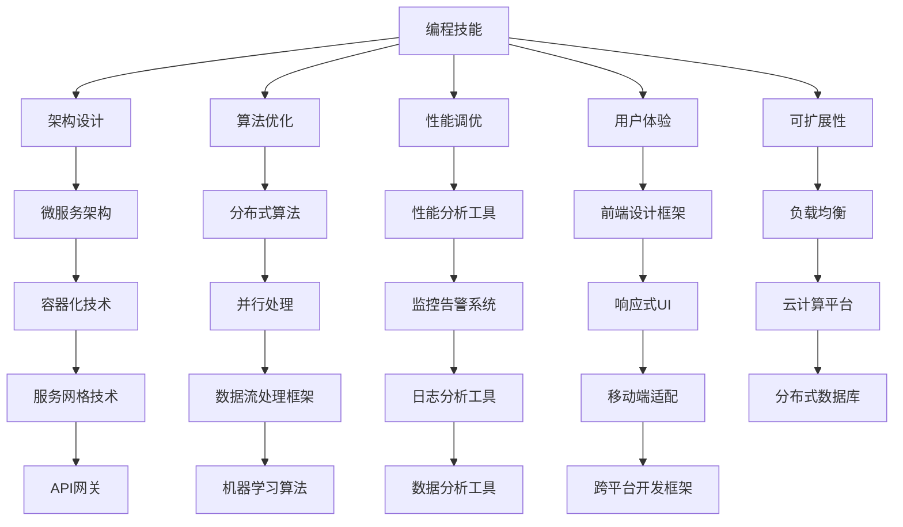

                 

关键词：编程技能，应用开发，用户规模，架构设计，算法优化，性能调优，用户体验，可扩展性，云计算，大数据，AI技术

> 摘要：本文旨在探讨如何利用编程技能来开发具备千万级用户规模的应用。我们将从架构设计、算法优化、性能调优、用户体验、可扩展性等多个方面进行分析，并分享一些实用的工具和资源推荐，帮助读者掌握开发千万级用户级应用的核心技能。

## 1. 背景介绍

随着互联网的快速发展，用户规模达到千万级的应用已经成为企业竞争的焦点。开发一个成功的千万用户级应用，不仅需要精湛的编程技能，还需要对用户需求、市场趋势和技术发展方向有深入的理解。本文将围绕以下几个方面展开：

- **架构设计**：如何构建一个可扩展、高性能的架构。
- **算法优化**：如何通过算法优化提升应用的性能和响应速度。
- **性能调优**：如何进行系统性能调优，确保应用能够稳定运行。
- **用户体验**：如何设计一个满足用户需求、提升用户满意度的界面。
- **可扩展性**：如何确保应用能够随着用户规模的增加而持续扩展。

## 2. 核心概念与联系

要开发千万用户级应用，我们需要了解以下几个核心概念：

- **微服务架构**：一种将应用程序作为一组小型、独立服务的分布式系统架构。
- **云原生技术**：基于云计算的应用开发和部署方法，包括容器化、容器编排、服务网格等。
- **分布式数据库**：一种支持分布式数据存储和查询的数据库系统。
- **大数据处理**：利用分布式计算框架处理海量数据的技能。

下面是这些核心概念的 Mermaid 流程图：



### 2.1 编程技能

编程技能是开发千万用户级应用的基础。掌握以下编程技能将有助于提高开发效率：

- **编程语言**：熟练掌握至少一种主流编程语言，如Java、Python、Go等。
- **框架与库**：熟悉常用的开发框架和库，如Spring Boot、Django、React等。
- **版本控制**：熟练使用版本控制工具，如Git，进行代码管理和协作开发。

### 2.2 架构设计

架构设计是决定应用性能和可扩展性的关键因素。以下是几种常见的架构设计方法：

- **单体架构**：将所有功能集成在一个单一的应用程序中，适用于小型项目。
- **分层架构**：将应用分为多个层次，如表示层、业务逻辑层、数据访问层等。
- **微服务架构**：将应用程序拆分为多个独立的服务，每个服务负责特定的业务功能。

### 2.3 算法优化

算法优化是提升应用性能的重要手段。以下是一些常见的算法优化方法：

- **时间复杂度分析**：通过分析算法的时间复杂度，找到性能瓶颈。
- **空间复杂度优化**：通过减少算法的空间复杂度，提高内存利用率。
- **并行计算**：利用多线程、分布式计算等技术，提高计算效率。

### 2.4 性能调优

性能调优是确保应用稳定运行的关键。以下是一些常见的性能调优方法：

- **CPU优化**：通过调整线程数、CPU亲和性等参数，提高CPU利用率。
- **内存优化**：通过减少内存占用、优化数据结构等手段，提高内存利用率。
- **网络优化**：通过调整网络参数、优化网络协议等手段，提高网络传输效率。

### 2.5 用户体验

用户体验是决定用户留存和口碑的关键。以下是一些提升用户体验的方法：

- **界面设计**：遵循简洁、直观的设计原则，提高用户操作便捷性。
- **交互设计**：优化交互逻辑，提高用户操作流畅性。
- **移动端适配**：确保应用在移动端设备上具有良好的表现。

### 2.6 可扩展性

可扩展性是确保应用能够持续扩展的关键。以下是一些实现可扩展性的方法：

- **分布式架构**：通过分布式架构，实现横向和纵向的扩展。
- **负载均衡**：通过负载均衡技术，实现流量分发和资源调度。
- **云计算平台**：利用云计算平台，实现弹性扩展和资源优化。

## 3. 核心算法原理 & 具体操作步骤

### 3.1 算法原理概述

在开发千万用户级应用时，算法优化至关重要。以下是一些常见的算法原理及其应用场景：

- **排序算法**：如快速排序、归并排序等，用于数据排序和查找。
- **搜索算法**：如二分搜索、深度优先搜索等，用于数据查找和遍历。
- **动态规划**：用于求解最优化问题，如背包问题、最长公共子序列等。
- **贪心算法**：用于求解某些特定类型的问题，如最小生成树、最短路径等。

### 3.2 算法步骤详解

以快速排序算法为例，其基本步骤如下：

1. 选择一个基准元素作为pivot。
2. 将数组分为两部分，左边部分的元素都小于pivot，右边部分的元素都大于pivot。
3. 对左右两部分分别递归执行上述步骤，直至整个数组有序。

### 3.3 算法优缺点

快速排序算法具有以下优缺点：

- 优点：时间复杂度为O(n log n)，平均情况下性能较好。
- 缺点：最坏情况下时间复杂度为O(n^2)，可能导致性能下降。

### 3.4 算法应用领域

快速排序算法广泛应用于排序和查找场景，如数据库索引、搜索算法等。

## 4. 数学模型和公式 & 详细讲解 & 举例说明

### 4.1 数学模型构建

在开发千万用户级应用时，数学模型有助于我们分析系统性能、优化资源分配等。以下是一个简单的数学模型构建过程：

1. 确定系统性能指标，如响应时间、吞吐量等。
2. 分析系统瓶颈，确定关键因素，如CPU利用率、内存占用等。
3. 构建数学模型，如线性方程组、非线性方程组等。

### 4.2 公式推导过程

以下是一个简单的线性方程组求解公式的推导过程：

$$
\begin{cases}
a_1x + b_1y = c_1 \\
a_2x + b_2y = c_2
\end{cases}
$$

通过消元法，我们可以得到：

$$
x = \frac{b_1c_2 - b_2c_1}{a_1b_2 - a_2b_1}
$$

$$
y = \frac{a_1c_2 - a_2c_1}{a_1b_2 - a_2b_1}
$$

### 4.3 案例分析与讲解

以下是一个基于线性方程组的负载均衡算法案例：

假设我们有两个服务器A和B，它们的性能指标如下：

$$
\begin{cases}
CPU利用率_A = 0.8 \\
CPU利用率_B = 0.6 \\
内存占用_A = 0.7 \\
内存占用_B = 0.4
\end{cases}
$$

我们的目标是根据服务器的性能指标，合理分配任务，确保系统的整体性能最优。

通过构建线性方程组，我们可以得到：

$$
\begin{cases}
0.8x + 0.6y = 1 \\
0.7x + 0.4y = 1
\end{cases}
$$

解得：

$$
x = 0.4 \\
y = 0.6
$$

这意味着我们应该将40%的任务分配给服务器A，60%的任务分配给服务器B。

## 5. 项目实践：代码实例和详细解释说明

### 5.1 开发环境搭建

在本节中，我们将介绍如何搭建一个用于开发千万用户级应用的开发环境。我们将使用以下工具和框架：

- **编程语言**：Python
- **开发框架**：Django
- **数据库**：PostgreSQL
- **云平台**：AWS

### 5.2 源代码详细实现

以下是一个简单的Django项目示例，用于构建一个用户注册和登录功能的网站：

```python
# settings.py
INSTALLED_APPS = [
    'django.contrib.admin',
    'django.contrib.auth',
    'django.contrib.contenttypes',
    'django.contrib.sessions',
    'django.contrib.messages',
    'django.contrib.staticfiles',
    'users',
]

DATABASES = {
    'default': {
        'ENGINE': 'django.db.backends.postgresql',
        'NAME': 'mydatabase',
        'USER': 'myuser',
        'PASSWORD': 'mypassword',
    }
}

# users/models.py
from django.contrib.auth.models import AbstractUser

class CustomUser(AbstractUser):
    email = models.EmailField(unique=True)

# users/admin.py
from django.contrib import admin
from .models import CustomUser

@admin.register(CustomUser)
class CustomUserAdmin(admin.ModelAdmin):
    list_display = ('email', 'username', 'is_staff', 'is_active', 'date_joined')

# users/serializers.py
from rest_framework import serializers
from .models import CustomUser

class CustomUserSerializer(serializers.ModelSerializer):
    class Meta:
        model = CustomUser
        fields = ('id', 'username', 'email', 'password')
        extra_kwargs = {'password': {'write_only': True}}

# users/views.py
from rest_framework import viewsets
from .models import CustomUser
from .serializers import CustomUserSerializer

class CustomUserViewSet(viewsets.ModelViewSet):
    queryset = CustomUser.objects.all()
    serializer_class = CustomUserSerializer
```

### 5.3 代码解读与分析

在上面的代码示例中，我们实现了以下功能：

1. **自定义用户模型**：通过继承`AbstractUser`类，自定义用户模型，添加了邮箱字段。
2. **后台管理**：配置了自定义用户模型的admin界面。
3. **序列化器**：实现了自定义用户模型的序列化器，用于REST API接口。
4. **视图集**：实现了自定义用户模型的视图集，用于处理用户注册和登录请求。

### 5.4 运行结果展示

通过运行Django项目，我们可以使用以下命令：

```shell
python manage.py runserver
```

然后，在浏览器中访问`http://localhost:8000/`，即可看到项目的运行结果。

## 6. 实际应用场景

在实际应用场景中，开发千万用户级应用需要考虑以下几个方面：

1. **用户需求分析**：了解用户需求，设计满足用户需求的功能和界面。
2. **性能优化**：通过算法优化、数据库优化等技术，提高应用性能。
3. **可扩展性**：通过分布式架构、负载均衡等技术，确保应用能够随着用户规模的增长而持续扩展。
4. **安全性**：确保应用的安全性，防止数据泄露和恶意攻击。
5. **运维管理**：建立完善的运维管理体系，确保应用稳定运行。

## 7. 未来应用展望

随着技术的不断进步，开发千万用户级应用将面临新的挑战和机遇。以下是未来应用展望：

1. **人工智能与大数据**：利用人工智能和大数据技术，实现个性化推荐、智能客服等功能，提升用户体验。
2. **物联网**：物联网技术的普及将带来更多数据源，为应用提供丰富的数据支持。
3. **区块链**：区块链技术将改变数据存储和交易模式，为应用提供更安全、透明的数据交换方式。
4. **5G技术**：5G技术的快速发展将带来更高的网络速度和更低的延迟，为应用提供更好的网络支持。

## 8. 工具和资源推荐

在开发千万用户级应用过程中，以下工具和资源将有助于提升开发效率和成果：

1. **学习资源推荐**：
   - 《Django By Example》
   - 《深入理解计算机系统》
   - 《微服务设计》
   - 《数据结构与算法分析》
   - 《Python核心编程》
   - 《高性能MySQL》

2. **开发工具推荐**：
   - PyCharm
   - VS Code
   - Git
   - GitHub
   - Docker
   - Kubernetes

3. **相关论文推荐**：
   - “Microservices: Aligning Theory and Practice”
   - “Bigtable: A Distributed Storage System for Statistical Database Research”
   - “The Chubby lock service”

## 9. 总结：未来发展趋势与挑战

随着技术的不断进步，开发千万用户级应用将面临更多机遇和挑战。未来发展趋势包括：

1. **人工智能与大数据**：人工智能和大数据技术将为应用提供更强大的功能和更丰富的数据支持。
2. **云计算与分布式架构**：云计算和分布式架构将实现更高的性能和可扩展性。
3. **区块链与安全性**：区块链技术将提高数据安全性和透明度。

面临的挑战包括：

1. **性能优化**：如何在高并发、大数据场景下优化性能。
2. **安全性**：如何确保数据安全，防止恶意攻击。
3. **用户体验**：如何在海量用户中提供个性化的用户体验。

通过本文的探讨，我们希望读者能够对开发千万用户级应用有更深入的了解，为未来的开发工作提供指导。

## 10. 附录：常见问题与解答

### 10.1 如何确保应用的性能？

- 进行性能分析，找出性能瓶颈。
- 采用高效的算法和数据结构。
- 使用缓存技术减少数据库查询。
- 优化数据库索引。
- 使用分布式计算和负载均衡。

### 10.2 如何确保应用的安全性？

- 采用安全编程实践，如输入验证、使用安全库。
- 使用HTTPS加密通信。
- 定期更新和维护系统软件。
- 使用防火墙和入侵检测系统。
- 实施权限控制。

### 10.3 如何确保应用的扩展性？

- 采用微服务架构。
- 设计可扩展的数据库方案。
- 使用负载均衡技术。
- 利用云计算平台实现弹性扩展。
- 设计灵活的接口和模块化代码。

### 10.4 如何优化用户体验？

- 进行用户调研，了解用户需求。
- 设计简洁直观的界面。
- 提供快速响应和流畅的操作。
- 提供个性化推荐和智能搜索功能。
- 优化移动端适配。

## 作者署名

作者：禅与计算机程序设计艺术 / Zen and the Art of Computer Programming

