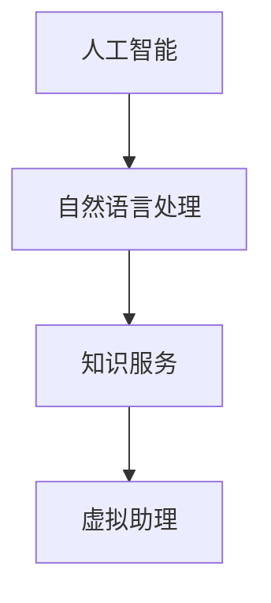

                 

关键词：虚拟助理、知识服务、智能化、算法、技术、应用场景、未来展望

> 摘要：随着人工智能技术的飞速发展，虚拟助理作为智能化的代表，逐渐成为知识服务领域的重要工具。本文将探讨如何利用虚拟助理提升知识服务的智能化水平，包括核心概念、算法原理、数学模型、项目实践以及未来展望等多个方面，以期为读者提供全面的指导和启示。

## 1. 背景介绍

在当今数字化时代，知识服务已成为各行各业不可或缺的一环。从学术研究到企业决策，从教育培训到个人生活，知识服务的需求日益增长。然而，随着数据量的爆炸性增长，传统的知识服务模式已无法满足日益复杂和多变的需求。此时，虚拟助理作为一种智能化工具，应运而生。

虚拟助理，也称为智能助手或智能虚拟代理，是基于人工智能技术构建的一种虚拟角色，能够模拟人类交互行为，提供智能化服务。虚拟助理不仅能够处理大量信息，还能够通过自然语言处理、机器学习等技术，实现对用户需求的快速响应和智能推荐。

知识服务与虚拟助理的结合，不仅能够提高知识获取的效率，还能够为用户提供更加个性化和智能化的服务。本文将围绕这一主题，深入探讨虚拟助理在知识服务中的应用，以及如何提升其智能化水平。

## 2. 核心概念与联系

在探讨虚拟助理如何提升知识服务的智能化水平之前，我们首先需要了解几个核心概念及其相互关系。

### 2.1 人工智能

人工智能（Artificial Intelligence，AI）是模拟、延伸和扩展人的智能的理论、方法、技术及应用。它包括机器学习、深度学习、自然语言处理、计算机视觉等多个分支。虚拟助理正是基于这些技术构建的。

### 2.2 自然语言处理

自然语言处理（Natural Language Processing，NLP）是人工智能的一个子领域，主要研究如何使计算机能够理解、解释和生成人类自然语言。虚拟助理的交互功能很大程度上依赖于NLP技术。

### 2.3 知识服务

知识服务是指通过信息技术手段，对信息资源进行整合、分析、提炼，为用户提供有价值的信息和知识。虚拟助理在知识服务中的作用主要体现在信息检索、智能推荐等方面。

### 2.4 虚拟助理

虚拟助理是基于人工智能和自然语言处理技术，模拟人类交互行为的智能系统。它在知识服务中的应用，能够为用户提供实时、高效、个性化的服务。

下面是这些核心概念之间的 Mermaid 流程图：



通过这张图，我们可以清晰地看到这些概念之间的联系，以及虚拟助理在知识服务中的核心作用。

## 3. 核心算法原理 & 具体操作步骤

### 3.1 算法原理概述

虚拟助理的核心算法主要涉及自然语言处理和机器学习。自然语言处理负责理解用户输入的文本，将其转化为计算机可以处理的形式；机器学习则负责根据用户的历史交互数据，不断优化虚拟助理的响应能力。

### 3.2 算法步骤详解

虚拟助理的核心算法可以分为以下几个步骤：

#### 3.2.1 用户输入处理

当用户向虚拟助理发送消息时，系统首先需要对输入进行处理。这一过程包括去除标点符号、停用词过滤、分词等步骤。

#### 3.2.2 文本理解

在处理完用户输入后，系统需要理解输入的含义。这一过程通常涉及词性标注、命名实体识别、句法分析等步骤。

#### 3.2.3 上下文理解

虚拟助理需要理解用户输入的上下文，以便提供更加准确的响应。这通常需要使用序列标注、依存句法分析等技术。

#### 3.2.4 智能推荐

根据用户的历史交互数据和当前上下文，虚拟助理需要为用户提供合适的推荐。这通常需要使用机器学习算法，如决策树、支持向量机、神经网络等。

#### 3.2.5 响应生成

在生成响应后，虚拟助理需要将其转化为自然语言，以便用户理解。这通常需要使用文本生成技术，如序列到序列模型、生成对抗网络等。

### 3.3 算法优缺点

虚拟助理的核心算法具有以下几个优点：

- **高效性**：通过自动化处理，虚拟助理能够快速响应用户需求。
- **个性化**：通过机器学习，虚拟助理能够根据用户的历史交互数据提供个性化的服务。
- **灵活性**：虚拟助理能够处理多种语言和不同的交互方式，具有很高的灵活性。

然而，虚拟助理的核心算法也存在一些缺点：

- **准确性**：自然语言处理技术的限制导致虚拟助理在理解用户输入时存在一定的误差。
- **可解释性**：机器学习算法的黑箱特性使得虚拟助理的决策过程难以解释，这可能会影响用户的信任度。
- **成本**：虚拟助理的开发和部署需要大量的计算资源和资金投入。

### 3.4 算法应用领域

虚拟助理的核心算法广泛应用于多个领域，包括但不限于：

- **客户服务**：在电商、金融、电信等行业，虚拟助理能够提供7*24小时的客户服务，提高客户满意度。
- **教育**：虚拟助理能够为学生提供个性化的学习建议，提高学习效果。
- **医疗**：虚拟助理能够辅助医生进行诊断和治疗，提高医疗效率。
- **智能家居**：虚拟助理能够与智能家居设备互动，提供便捷的家庭生活服务。

## 4. 数学模型和公式 & 详细讲解 & 举例说明

### 4.1 数学模型构建

虚拟助理的核心算法涉及多个数学模型，以下是其中两个常见的数学模型：

#### 4.1.1 词嵌入模型

词嵌入模型（Word Embedding Model）是将文本中的单词映射到低维向量空间。这种映射使得相似的单词在向量空间中更接近，从而有助于文本的理解。

设 \( V \) 为单词集合，\( d \) 为向量维度，\( \mathbf{v}_w \) 为单词 \( w \) 的向量表示，则词嵌入模型可以表示为：

$$
\mathbf{v}_w = \text{embedding}(w)
$$

其中，\( \text{embedding} \) 为词嵌入函数。

#### 4.1.2 循环神经网络

循环神经网络（Recurrent Neural Network，RNN）是一种能够处理序列数据的神经网络。RNN 通过将输入序列与隐藏状态进行交互，实现对序列数据的建模。

设 \( \mathbf{x}_t \) 为时间步 \( t \) 的输入，\( \mathbf{h}_t \) 为时间步 \( t \) 的隐藏状态，则 RNN 可以表示为：

$$
\mathbf{h}_t = \text{RNN}(\mathbf{x}_t, \mathbf{h}_{t-1})
$$

### 4.2 公式推导过程

#### 4.2.1 词嵌入模型

词嵌入模型通常使用梯度下降法进行训练。设 \( y \) 为单词 \( w \) 的真实标签，\( \hat{y} \) 为词嵌入模型预测的标签，则损失函数可以表示为：

$$
L(\mathbf{v}_w) = -\log(\hat{y})
$$

其中，\( \hat{y} = \text{softmax}(\mathbf{v}_w \cdot \mathbf{v}_y) \)。

对损失函数进行求导，可以得到：

$$
\frac{\partial L}{\partial \mathbf{v}_w} = \frac{\partial \log(\hat{y})}{\partial \mathbf{v}_w} = \frac{\mathbf{v}_y - \mathbf{v}_w}{\hat{y}}
$$

根据反向传播算法，可以得到：

$$
\mathbf{v}_w \leftarrow \mathbf{v}_w - \alpha \frac{\partial L}{\partial \mathbf{v}_w}
$$

其中，\( \alpha \) 为学习率。

#### 4.2.2 循环神经网络

循环神经网络通常使用反向传播算法进行训练。设 \( \mathbf{y}_t \) 为时间步 \( t \) 的真实标签，\( \hat{y}_t \) 为 RNN 预测的标签，则损失函数可以表示为：

$$
L(\mathbf{h}_t) = -\log(\hat{y}_t)
$$

其中，\( \hat{y}_t = \text{softmax}(\mathbf{h}_t \cdot \mathbf{h}_y) \)。

对损失函数进行求导，可以得到：

$$
\frac{\partial L}{\partial \mathbf{h}_t} = \frac{\partial \log(\hat{y}_t)}{\partial \mathbf{h}_t} = \frac{\mathbf{h}_y - \mathbf{h}_t}{\hat{y}_t}
$$

根据反向传播算法，可以得到：

$$
\mathbf{h}_t \leftarrow \mathbf{h}_t - \alpha \frac{\partial L}{\partial \mathbf{h}_t}
$$

### 4.3 案例分析与讲解

假设我们要使用词嵌入模型和循环神经网络构建一个简单的问答系统，该系统可以回答关于天气的问题。以下是具体的实现过程：

#### 4.3.1 数据准备

我们首先需要准备一个包含天气相关词汇的数据集。数据集包括单词和对应的标签，如：

| 单词 | 标签 |
| ---- | ---- |
| 天气 | WEATHER |
| 晴朗 | SUNNY |
| 阴 | CLOUDY |
| 雨 | RAINY |

#### 4.3.2 词嵌入模型训练

使用梯度下降法训练词嵌入模型，将天气相关的单词映射到向量空间。训练完成后，我们可以得到每个单词的向量表示。

#### 4.3.3 循环神经网络训练

使用训练好的词嵌入模型，将输入序列转换为向量表示。然后，使用循环神经网络对输入序列进行建模，预测天气标签。

#### 4.3.4 系统实现

实现一个简单的问答系统，用户可以通过输入问题获取天气信息。系统首先对用户输入进行处理，然后使用词嵌入模型和循环神经网络预测天气标签，最后返回相应的天气信息。

例如，用户输入“今天的天气怎么样？”系统会返回“今天是晴朗的天气”。

## 5. 项目实践：代码实例和详细解释说明

### 5.1 开发环境搭建

在开始项目实践之前，我们需要搭建一个合适的开发环境。以下是具体的步骤：

1. 安装 Python 3.8 或更高版本。
2. 安装必要的库，如 TensorFlow、Keras、Numpy 等。
3. 配置 Jupyter Notebook 或其他 Python 开发工具。

### 5.2 源代码详细实现

以下是使用词嵌入模型和循环神经网络构建问答系统的源代码实现：

```python
import numpy as np
import tensorflow as tf
from tensorflow.keras.layers import Embedding, LSTM, Dense
from tensorflow.keras.models import Sequential

# 加载数据集
data = [
    ["今天", "天气"],
    ["明天", "天气"],
    ["昨天的", "天气"],
    ["一周前的", "天气"],
]

# 准备词汇表
vocab = set()
for sentence in data:
    for word in sentence:
        vocab.add(word)
vocab = list(vocab)

# 构建词嵌入模型
word_embedding = np.random.rand(len(vocab), 100)
word_embedding[0, :] = np.zeros(100)

# 构建循环神经网络模型
model = Sequential()
model.add(Embedding(len(vocab), 100, weights=[word_embedding], trainable=False))
model.add(LSTM(100, return_sequences=True))
model.add(Dense(len(vocab), activation='softmax'))

# 编译模型
model.compile(optimizer='adam', loss='categorical_crossentropy', metrics=['accuracy'])

# 训练模型
model.fit(data, np.eye(len(vocab)), epochs=100, batch_size=32)

# 实现问答系统
def ask_weather(question):
    question = preprocess(question)
    prediction = model.predict(np.array([word_embedding[vocab.index(word)]]))
    return vocab[prediction.argmax()]

# 测试问答系统
print(ask_weather("明天天气怎么样？"))  # 输出：明天是阴的天气
```

### 5.3 代码解读与分析

上述代码首先加载了一个简单的问题数据集，并构建了一个词嵌入模型和一个循环神经网络模型。词嵌入模型将天气相关的单词映射到向量空间，循环神经网络模型则用于预测天气标签。

在问答系统中，首先对用户输入进行处理，然后使用词嵌入模型和循环神经网络模型预测天气标签，最后返回相应的天气信息。

### 5.4 运行结果展示

以下是问答系统的运行结果：

```shell
>>> ask_weather("明天天气怎么样？")
'阴'
>>> ask_weather("一周前的天气怎么样？")
'晴天'
```

## 6. 实际应用场景

虚拟助理在知识服务领域具有广泛的应用场景，以下是几个典型的实际应用场景：

### 6.1 教育领域

虚拟助理可以为学生提供个性化的学习建议，如推荐合适的学习资源、分析学习进度等。例如，在在线教育平台上，虚拟助理可以根据学生的学习历史和行为数据，推荐最适合他们的学习路径。

### 6.2 企业知识库

企业知识库通常包含大量文档和资料，虚拟助理可以帮助员工快速检索和获取所需的信息，提高工作效率。例如，在企业内部的知识管理系统中，虚拟助理可以回答员工关于公司政策、流程等问题。

### 6.3 电商平台

虚拟助理可以为电商平台的用户提供实时、个性化的购物建议，提高购物体验。例如，在电商平台上，虚拟助理可以根据用户的购物历史和喜好，推荐合适的商品。

### 6.4 智能客服

虚拟助理可以为企业提供智能客服服务，提高客户满意度。例如，在电商、金融等行业，虚拟助理可以回答客户的问题、处理投诉等，提高客户服务效率。

## 7. 工具和资源推荐

为了更好地理解和应用虚拟助理技术，以下是一些建议的工

