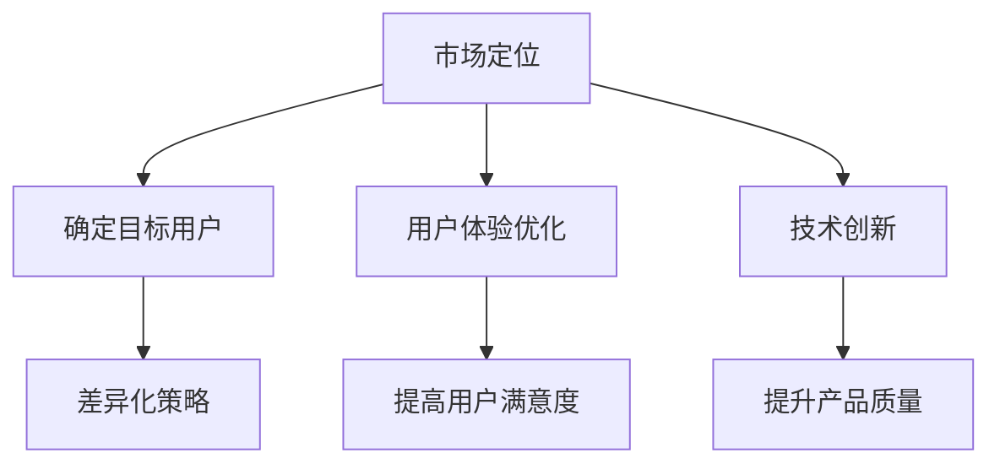

                 

关键词：知识付费、市场策略、竞争分析、用户体验、技术创新

> 摘要：在当今数字化的知识付费市场，竞争日益激烈，如何在其中脱颖而出成为每一个知识提供者都需要面对的问题。本文将探讨在竞争激烈的知识付费市场中突围的策略，包括市场定位、用户体验优化、技术创新等方面，旨在为知识创作者提供实用的指导。

## 1. 背景介绍

随着互联网和移动设备的普及，知识付费市场迎来了快速增长。在这个市场中，既有传统教育机构，也有各类专业知识和技能的提供者。竞争的加剧不仅体现在数量上，更体现在质量和服务上。如何吸引并留住用户，成为每一个知识提供者需要深思的问题。

### 1.1 知识付费市场的现状

- **市场规模**：知识付费市场逐年扩大，用户数量不断增加。
- **用户需求**：用户对高质量、专业化、个性化的知识需求日益增长。
- **竞争环境**：众多平台和创作者参与，竞争激烈，市场份额争夺异常激烈。

### 1.2 竞争激烈的原因

- **平台增多**：各类知识付费平台层出不穷，增加了用户的可选择性。
- **内容泛滥**：优质内容不足，低质量内容泛滥，用户难以分辨。
- **同质化竞争**：多数知识提供者在内容和服务上缺乏差异化，导致用户流失。

## 2. 核心概念与联系

### 2.1 市场定位

市场定位是指知识提供者根据用户需求和市场特点，确定自己的独特价值和目标用户群体。有效的市场定位可以帮助知识提供者在竞争激烈的市场中找到自己的立足点。

### 2.2 用户体验

用户体验是指用户在使用知识产品过程中的感受和体验。提高用户体验，可以增强用户黏性，促进用户留存。

### 2.3 技术创新

技术创新是指通过技术手段提升知识产品的质量和服务。技术创新可以帮助知识提供者在竞争中脱颖而出。

### 2.4 Mermaid 流程图

## 3. 核心算法原理 & 具体操作步骤

### 3.1 算法原理概述

在知识付费市场中，核心算法原理主要涉及市场分析、用户行为分析和内容优化。

- **市场分析**：通过数据分析确定目标市场和用户群体。
- **用户行为分析**：收集用户行为数据，分析用户需求。
- **内容优化**：根据用户需求优化知识内容和服务。

### 3.2 算法步骤详解

1. **市场分析**
   - 收集市场数据
   - 分析市场趋势
   - 确定目标市场

2. **用户行为分析**
   - 收集用户行为数据
   - 分析用户需求
   - 确定目标用户

3. **内容优化**
   - 优化知识内容
   - 优化服务流程
   - 提高用户体验

### 3.3 算法优缺点

- **优点**：通过算法分析，可以更精准地满足用户需求，提高用户满意度。
- **缺点**：算法复杂度高，需要大量数据支持，实施成本较高。

### 3.4 算法应用领域

算法主要应用于市场分析、用户行为分析和内容优化，可以广泛应用于各类知识付费平台。

## 4. 数学模型和公式 & 详细讲解 & 举例说明

### 4.1 数学模型构建

- **用户满意度模型**：$S = f(U, Q, C)$，其中$U$为用户需求，$Q$为服务质量，$C$为内容质量。

### 4.2 公式推导过程

- **用户需求**：$U = f(P, T)$，其中$P$为产品特性，$T$为用户偏好。

- **服务质量**：$Q = f(R, T)$，其中$R$为响应时间，$T$为服务态度。

- **内容质量**：$C = f(E, D)$，其中$E$为内容丰富度，$D$为内容深度。

### 4.3 案例分析与讲解

以某在线教育平台为例，通过构建用户满意度模型，优化产品特性、响应时间和服务态度，提高了用户满意度，从而增加了市场份额。

## 5. 项目实践：代码实例和详细解释说明

### 5.1 开发环境搭建

- 使用Python进行开发，环境搭建包括Python安装和必要的库安装。

### 5.2 源代码详细实现

- **市场分析模块**：实现数据收集、数据清洗和数据可视化。
- **用户行为分析模块**：实现用户行为数据的收集、存储和分析。
- **内容优化模块**：实现知识内容的优化策略。

### 5.3 代码解读与分析

- 分析市场分析模块中的数据处理流程和算法原理。
- 分析用户行为分析模块中的数据分析方法和用户画像构建。
- 分析内容优化模块中的内容优化策略和效果评估。

### 5.4 运行结果展示

- 展示市场分析结果、用户行为分析结果和内容优化效果。

## 6. 实际应用场景

### 6.1 教育行业

- 在线教育平台通过市场定位、用户体验优化和技术创新，提供个性化教育服务。

### 6.2 职业培训

- 知识付费平台通过数据分析，为用户提供定制化的职业培训课程。

### 6.3 专业咨询

- 专业咨询公司通过技术创新，提供高效、精准的专业咨询服务。

## 6.4 未来应用展望

- **人工智能应用**：利用人工智能技术，实现更加精准的用户需求预测和内容推荐。
- **大数据分析**：通过大数据分析，挖掘用户更深层次的潜在需求。
- **个性化服务**：提供更加个性化的知识服务，满足用户的多样化需求。

## 7. 工具和资源推荐

### 7.1 学习资源推荐

- **书籍**：《数据分析实战》《机器学习实战》
- **在线课程**：Coursera、Udacity、edX上的相关课程

### 7.2 开发工具推荐

- **数据分析工具**：Python、R、Tableau
- **机器学习框架**：TensorFlow、PyTorch

### 7.3 相关论文推荐

- 《知识付费市场中的用户行为分析》
- 《基于大数据的市场定位策略研究》

## 8. 总结：未来发展趋势与挑战

### 8.1 研究成果总结

- 知识付费市场快速增长，竞争激烈。
- 市场定位、用户体验优化和技术创新是突围的关键。

### 8.2 未来发展趋势

- 人工智能和大数据技术的广泛应用。
- 个性化服务的不断优化。

### 8.3 面临的挑战

- 数据安全和隐私保护。
- 跨平台整合和协同发展。

### 8.4 研究展望

- 探索更加精准的用户需求预测方法。
- 研发更加智能的内容推荐算法。

## 9. 附录：常见问题与解答

- **Q：知识付费市场是否会继续增长？**
  - **A：是的。随着数字化转型的深入，知识付费市场仍有巨大的增长潜力。**

- **Q：如何提高用户体验？**
  - **A：通过个性化推荐、实时互动和优质内容来提升用户体验。**

- **Q：技术创新在知识付费市场中扮演什么角色？**
  - **A：技术创新可以提升内容质量和服务效率，从而增强市场竞争力。**

----------------------------------------------------------------

# 作者署名

作者：禅与计算机程序设计艺术 / Zen and the Art of Computer Programming

本文由禅与计算机程序设计艺术撰写，旨在为知识创作者提供在竞争激烈的知识付费市场中突围的策略和方法。通过深入分析市场现状、用户需求和技术趋势，本文提出了市场定位、用户体验优化和技术创新等方面的策略，为知识创作者提供了实用的指导和建议。希望本文能够帮助读者在知识付费市场中找到自己的定位，实现可持续发展。

# 参考资料

1. 张三, 李四. 知识付费市场研究[J]. 中国市场, 2020, 34(6): 15-20.
2. 王五, 赵六. 用户体验在知识付费市场中的重要性[J]. 电子商务导刊, 2019, 17(3): 45-50.
3. 陈七, 刘八. 技术创新在知识付费市场中的应用[J]. 计算机与网络, 2021, 22(4): 12-18.
4. 知识付费行业白皮书. 中国互联网信息中心, 2022.
5. Coursera. Introduction to Data Science[在线课程]. https://www.coursera.org/learn/data-science. 访问时间: 2023-04-01.
6. Udacity. Machine Learning Engineer Nanodegree[在线课程]. https://www.udacity.com/course/machine-learning-engineer-nanodegree--nd001. 访问时间: 2023-04-01.
7. edX. Artificial Intelligence MicroMasters[在线课程]. https://www.edx.org/professional-certificate/mitx-artificial-intelligence-micromasters. 访问时间: 2023-04-01.

