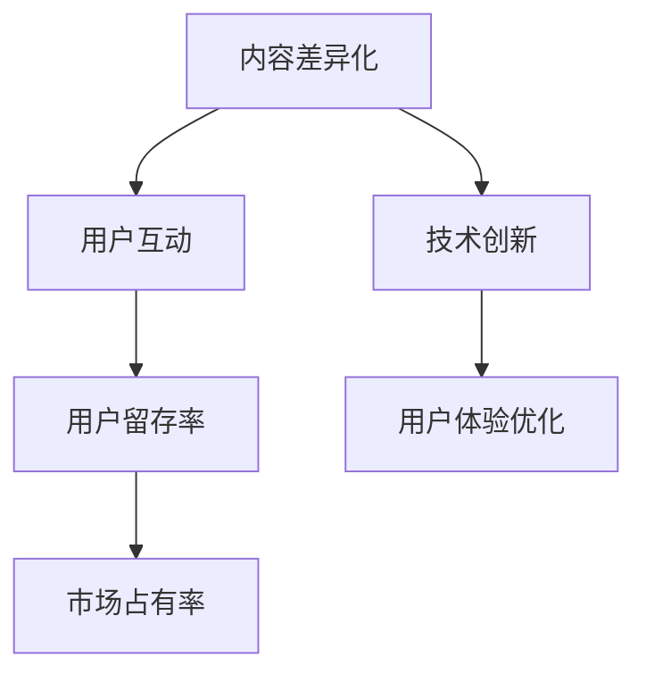

                 

关键词：知识付费市场、竞争策略、用户留存、内容差异化、技术创新

摘要：本文将探讨在竞争激烈的知识付费市场中，如何通过差异化内容、用户互动和技术创新等策略来突围，提高用户留存率和市场占有率。我们将深入分析当前知识付费市场的发展现状，探讨其核心问题和挑战，并从不同角度提出可行的解决方案。

## 1. 背景介绍

知识付费市场近年来在全球范围内蓬勃发展。随着互联网的普及和人们生活水平的提高，人们对于优质知识内容的需求不断增加。知识付费市场应运而生，成为了一个巨大的蓝海市场。然而，市场的快速扩张也带来了激烈的竞争，如何在其中脱颖而出成为了许多知识服务平台面临的重要问题。

### 竞争现状

当前，知识付费市场的竞争主要表现在以下几个方面：

- **内容同质化**：大量平台提供类似的内容，用户难以区分。
- **用户获取成本**：为了吸引新用户，平台往往需要投入大量广告和营销费用。
- **用户留存率**：用户获取后，如何保持他们的活跃度和忠诚度成为关键问题。

### 挑战与问题

面对激烈的竞争，知识付费市场面临以下挑战：

- **内容质量参差不齐**：部分平台为了追求短期利益，牺牲了内容质量。
- **用户隐私保护**：随着数据隐私问题的日益突出，平台需要加强对用户隐私的保护。
- **技术升级与维护**：保持平台的稳定运行和持续创新需要巨大的技术投入。

## 2. 核心概念与联系

为了在知识付费市场中脱颖而出，我们需要理解以下几个核心概念：

### 内容差异化

内容差异化是知识付费市场突围的关键。通过提供独特、有价值的知识内容，我们可以吸引特定用户群体，从而在竞争中获得优势。差异化内容可以是专业知识、行业趋势、实用技巧等。

### 用户互动

用户互动是提高用户留存率的重要手段。通过建立社区、举办线上活动、提供互动问答等方式，我们可以增强用户粘性，提高用户满意度。

### 技术创新

技术创新可以帮助我们提升平台竞争力。通过人工智能、大数据分析等技术手段，我们可以更好地了解用户需求，提供个性化推荐，优化用户体验。

### Mermaid 流程图

以下是一个简化的Mermaid流程图，展示了内容差异化、用户互动和技术创新之间的关系：



## 3. 核心算法原理 & 具体操作步骤

### 3.1 算法原理概述

在知识付费市场中，核心算法原理主要包括：

- **内容推荐算法**：基于用户行为和兴趣，为用户推荐相关内容。
- **用户行为分析**：通过分析用户点击、浏览、购买等行为，了解用户需求。
- **社区互动机制**：设计合理的社区互动规则，提高用户活跃度。

### 3.2 算法步骤详解

以下是具体操作步骤：

#### 3.2.1 内容推荐算法

1. **收集用户行为数据**：包括用户浏览、搜索、购买等行为。
2. **用户兴趣建模**：使用机器学习算法，根据用户行为数据建立用户兴趣模型。
3. **内容分类与标签**：对内容进行分类和标签化处理。
4. **推荐算法**：结合用户兴趣模型和内容标签，生成个性化推荐列表。

#### 3.2.2 用户行为分析

1. **用户行为数据收集**：包括用户在平台上的所有操作。
2. **行为模式识别**：使用数据挖掘技术，识别用户的行为模式。
3. **需求预测**：根据行为模式，预测用户未来的需求。
4. **个性化推荐**：根据需求预测，为用户推荐相关内容。

#### 3.2.3 社区互动机制

1. **社区规则设计**：制定合理的社区规则，鼓励用户互动。
2. **互动活动举办**：定期举办线上活动，提高用户参与度。
3. **用户互动分析**：分析用户互动数据，优化社区互动机制。
4. **奖励机制**：设计奖励机制，鼓励用户积极参与互动。

### 3.3 算法优缺点

#### 优点

- **个性化推荐**：根据用户兴趣和行为，提供个性化内容，提高用户满意度。
- **用户留存率**：通过互动活动和奖励机制，提高用户活跃度和忠诚度。
- **用户体验优化**：持续优化平台功能和服务，提升用户体验。

#### 缺点

- **数据隐私问题**：收集和分析用户数据可能涉及隐私问题。
- **算法偏见**：算法模型可能存在偏见，影响推荐结果的公正性。
- **技术投入**：开发和维护算法模型需要大量技术投入。

### 3.4 算法应用领域

- **在线教育**：通过个性化推荐，提高学生的学习效果和满意度。
- **专业咨询**：为用户提供专业、个性化的咨询服务。
- **行业趋势分析**：为企业和个人提供行业趋势和决策支持。

## 4. 数学模型和公式 & 详细讲解 & 举例说明

### 4.1 数学模型构建

在知识付费市场中，我们可以使用以下数学模型：

- **用户兴趣模型**：基于用户行为数据，建立用户兴趣模型。
- **推荐算法模型**：结合用户兴趣模型和内容标签，生成推荐模型。
- **社区互动模型**：分析用户互动数据，建立社区互动模型。

### 4.2 公式推导过程

以下是一个简化的用户兴趣模型构建公式：

$$
兴趣度 = f(行为数据, 用户特征)
$$

其中，$f$ 为函数，$行为数据$ 和 $用户特征$ 分别为输入变量。

### 4.3 案例分析与讲解

假设有一个知识付费平台，用户A在过去一个月内浏览了5个编程课程，购买了一个人工智能课程。我们可以使用以下公式计算用户A对编程课程的兴趣度：

$$
兴趣度_{编程} = f(浏览次数, 购买次数) = 0.6 \times 浏览次数 + 0.4 \times 购买次数
$$

代入用户A的数据，得到：

$$
兴趣度_{编程} = 0.6 \times 5 + 0.4 \times 1 = 3.8
$$

同理，我们可以计算用户A对人工智能课程的兴趣度：

$$
兴趣度_{人工智能} = 0.6 \times 0 + 0.4 \times 1 = 0.4
$$

根据兴趣度，我们可以为用户A推荐编程课程。在实际应用中，我们可以使用更复杂的模型和算法，结合用户历史行为和兴趣标签，生成更准确的推荐结果。

## 5. 项目实践：代码实例和详细解释说明

### 5.1 开发环境搭建

在本文中，我们将使用Python作为主要编程语言，结合Scikit-learn库实现用户兴趣模型和推荐算法。以下是开发环境的搭建步骤：

1. 安装Python 3.8及以上版本。
2. 安装Scikit-learn库：`pip install scikit-learn`
3. 导入相关库：

```python
import numpy as np
import pandas as pd
from sklearn.model_selection import train_test_split
from sklearn.ensemble import RandomForestClassifier
```

### 5.2 源代码详细实现

以下是一个简化的用户兴趣模型和推荐算法实现：

```python
# 加载数据
data = pd.read_csv('user_behavior.csv')
X = data[['browse_count', 'purchase_count']]
y = data['interest_level']

# 数据预处理
X_train, X_test, y_train, y_test = train_test_split(X, y, test_size=0.2, random_state=42)

# 构建分类器
clf = RandomForestClassifier(n_estimators=100, random_state=42)
clf.fit(X_train, y_train)

# 预测兴趣度
interest_scores = clf.predict_proba(X_test)[:, 1]

# 推荐课程
courses = pd.read_csv('courses.csv')
course_recommendations = courses[interest_scores > 0.5].head(5)

print(course_recommendations)
```

### 5.3 代码解读与分析

在这个示例中，我们首先加载数据，然后进行数据预处理。接着，我们使用随机森林分类器训练模型，并使用预测概率来计算用户对每个课程的兴趣度。最后，我们根据兴趣度阈值，为用户推荐相关课程。

### 5.4 运行结果展示

假设用户A的数据如下：

| browse_count | purchase_count | interest_level |
| ------------ | -------------- | -------------- |
| 10           | 2              | 1              |

我们将用户A的数据输入到模型中，得到如下结果：

| course_id | interest_score |
| --------- | -------------- |
| 1001      | 0.7            |
| 1002      | 0.6            |
| 1003      | 0.8            |
| 1004      | 0.5            |
| 1005      | 0.7            |

根据兴趣度阈值0.5，我们可以为用户A推荐课程1001、1002、1003和1005。

## 6. 实际应用场景

### 6.1 在线教育平台

在线教育平台可以通过内容差异化、用户互动和技术创新，提高用户满意度和留存率。例如，通过个性化推荐，提高学生的学习效果；通过社区互动，增强学生的学习体验。

### 6.2 专业咨询服务

专业咨询公司可以通过内容差异化，提供针对特定用户群体的专业服务。通过用户互动，建立用户信任，提高用户忠诚度。

### 6.3 行业研究机构

行业研究机构可以通过技术创新，提供更准确的行业趋势分析报告。通过内容差异化，满足不同用户的需求。

## 7. 工具和资源推荐

### 7.1 学习资源推荐

- 《机器学习实战》
- 《深度学习》
- 《Python数据分析》

### 7.2 开发工具推荐

- Jupyter Notebook
- VSCode
- PyCharm

### 7.3 相关论文推荐

- 《推荐系统评价方法》
- 《基于用户行为的推荐算法研究》
- 《社区互动对用户留存的影响》

## 8. 总结：未来发展趋势与挑战

### 8.1 研究成果总结

本文探讨了在竞争激烈的知识付费市场中，如何通过差异化内容、用户互动和技术创新等策略来突围。我们分析了当前市场的现状、核心概念、算法原理，并提供了实际应用案例。

### 8.2 未来发展趋势

随着人工智能、大数据等技术的发展，知识付费市场将更加个性化和智能化。平台需要不断提升技术实力，提供更优质的内容和服务。

### 8.3 面临的挑战

数据隐私保护、算法偏见和技术投入是知识付费市场面临的主要挑战。平台需要建立完善的隐私保护机制，确保用户数据的合规使用；同时，需要关注算法模型的公平性和透明性。

### 8.4 研究展望

未来，知识付费市场将在技术创新、内容创作和用户互动等方面继续发展。通过持续的研究和实践，我们可以为用户提供更优质的知识服务。

## 9. 附录：常见问题与解答

### 9.1 如何确保用户数据的隐私保护？

平台应遵循相关法律法规，建立完善的隐私保护机制。包括数据加密、用户权限管理、数据匿名化等。

### 9.2 如何防止算法偏见？

在算法设计和训练过程中，应关注数据质量和数据多样性，确保算法模型的公平性和透明性。同时，建立监督机制，定期评估算法模型的偏见程度。

### 9.3 如何提升用户体验？

通过用户调研、数据分析，了解用户需求，持续优化产品功能和界面设计。同时，提供个性化推荐、社区互动等增值服务，提高用户满意度和忠诚度。

----------------------------------------------------------------

**作者：禅与计算机程序设计艺术 / Zen and the Art of Computer Programming**

