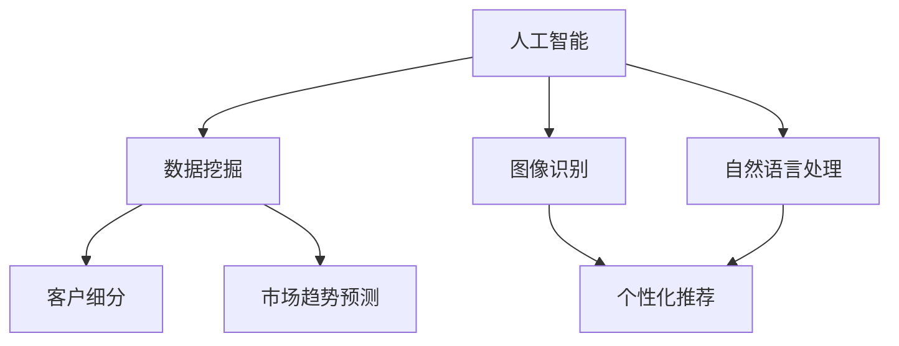

                 

关键词：自动化创业、精准营销、人工智能、数据分析、客户细分、个性化推荐

> 摘要：本文将探讨自动化创业领域如何通过精准营销策略提升客户转化率和留存率。通过运用人工智能、大数据分析、客户细分和个性化推荐等技术手段，将传统营销方法升级为智能化的精准营销模式，以实现创业项目的高效发展。

## 1. 背景介绍

在互联网和移动互联网的快速发展下，自动化创业已成为一种新的趋势。然而，市场竞争日益激烈，如何快速获取目标用户并实现持续增长成为创业公司面临的重要挑战。传统的营销方法往往难以满足个性化、实时化的需求，导致营销效果不佳。因此，如何利用先进技术实现精准营销，成为自动化创业公司需要深入研究和实践的重要课题。

## 2. 核心概念与联系

### 2.1 人工智能

人工智能（Artificial Intelligence，简称AI）是指由人制造出的系统所表现出来的智能。在精准营销中，人工智能技术可以用于数据挖掘、图像识别、自然语言处理等方面，从而实现用户行为分析和市场趋势预测。

### 2.2 大数据分析

大数据分析（Big Data Analysis）是指对大规模数据集进行收集、存储、处理和分析的过程。通过对用户行为数据、市场数据等多源数据的分析，可以挖掘出有价值的信息，为精准营销提供数据支持。

### 2.3 客户细分

客户细分（Customer Segmentation）是指将用户按照一定的标准进行分类，以便针对不同类型的用户提供个性化的服务。通过客户细分，创业公司可以更好地了解用户需求，提高营销效果。

### 2.4 个性化推荐

个性化推荐（Personalized Recommendation）是指根据用户的兴趣、行为等特征，为其推荐符合其需求的产品或服务。通过个性化推荐，可以提高用户的购买转化率和满意度。

### 2.5 Mermaid 流程图



## 3. 核心算法原理 & 具体操作步骤

### 3.1 算法原理概述

精准营销的核心在于对用户行为数据的深度挖掘和分析，从而实现个性化推荐和精准投放。以下是精准营销算法的基本原理：

1. 数据收集：通过网站、App、社交媒体等渠道收集用户行为数据，如浏览记录、购买行为、搜索关键词等。
2. 数据预处理：对收集到的数据进行分析、清洗和归一化处理，以便后续分析。
3. 特征工程：根据业务需求，提取与用户行为相关的特征，如用户年龄、性别、兴趣偏好等。
4. 模型训练：利用机器学习算法，对特征数据进行分析和建模，如分类模型、聚类模型、推荐模型等。
5. 预测与评估：将训练好的模型应用于实际数据，对用户行为进行预测和评估，以指导营销策略。
6. 策略优化：根据预测结果和实际效果，不断优化和调整营销策略，提高用户转化率和满意度。

### 3.2 算法步骤详解

1. 数据收集

   - 收集用户在网站、App、社交媒体等渠道的行为数据，如浏览记录、购买行为、搜索关键词等。
   - 使用爬虫、API接口等方式获取数据。

2. 数据预处理

   - 清洗数据，去除缺失值、异常值等。
   - 对数据进行归一化处理，如数值范围缩放、类别标签编码等。

3. 特征工程

   - 提取与用户行为相关的特征，如用户年龄、性别、兴趣偏好等。
   - 使用统计方法、机器学习方法对特征进行筛选和优化。

4. 模型训练

   - 选择合适的机器学习算法，如分类算法、聚类算法、推荐算法等。
   - 使用训练数据对模型进行训练，调整模型参数。

5. 预测与评估

   - 使用训练好的模型对用户行为进行预测，如预测用户购买概率、推荐感兴趣的产品等。
   - 对预测结果进行评估，如准确率、召回率、F1值等。

6. 策略优化

   - 根据预测结果和实际效果，调整营销策略，如调整广告投放、优化产品推荐等。
   - 持续监控和评估营销效果，不断优化和调整策略。

### 3.3 算法优缺点

#### 优点

1. 提高营销效果：通过数据分析和模型预测，实现个性化推荐和精准投放，提高用户转化率和满意度。
2. 降低营销成本：优化营销策略，降低无效投放和广告费用。
3. 实时响应：快速捕捉用户行为变化，实时调整营销策略。

#### 缺点

1. 数据隐私：收集用户行为数据可能涉及用户隐私，需要遵守相关法律法规。
2. 模型依赖：机器学习模型的性能依赖于数据质量和特征工程，可能存在过拟合等问题。

### 3.4 算法应用领域

精准营销算法广泛应用于电子商务、在线教育、金融保险、医疗健康等领域，帮助创业公司实现用户增长和业务拓展。

## 4. 数学模型和公式 & 详细讲解 & 举例说明

### 4.1 数学模型构建

精准营销的核心在于预测用户行为，如购买概率、点击率等。以下是一个简单的二分类逻辑回归模型：

$$
P(y=1) = \frac{1}{1 + e^{-(\beta_0 + \beta_1 x_1 + \beta_2 x_2 + ... + \beta_n x_n})}
$$

其中，$y$ 表示用户行为（1 表示购买，0 表示未购买），$x_1, x_2, ..., x_n$ 表示用户特征，$\beta_0, \beta_1, \beta_2, ..., \beta_n$ 表示模型参数。

### 4.2 公式推导过程

逻辑回归模型的推导基于最大似然估计（Maximum Likelihood Estimation，MLE）。假设我们有一个训练数据集 $D = \{(x_1, y_1), (x_2, y_2), ..., (x_n, y_n)\}$，其中 $x_i$ 表示第 $i$ 个样本的特征向量，$y_i$ 表示第 $i$ 个样本的行为标签。

目标是最大化似然函数：

$$
L(\beta_0, \beta_1, ..., \beta_n) = \prod_{i=1}^{n} P(y_i|x_i; \beta_0, \beta_1, ..., \beta_n)
$$

由于似然函数的对数似然函数是单调递增的，我们可以优化对数似然函数：

$$
\ln L(\beta_0, \beta_1, ..., \beta_n) = \sum_{i=1}^{n} \ln P(y_i|x_i; \beta_0, \beta_1, ..., \beta_n)
$$

代入逻辑回归的概率表达式，得到：

$$
\ln L(\beta_0, \beta_1, ..., \beta_n) = \sum_{i=1}^{n} y_i (\beta_0 + \beta_1 x_{i1} + \beta_2 x_{i2} + ... + \beta_n x_{in}) - (\beta_0 + \beta_1 x_{i1} + \beta_2 x_{i2} + ... + \beta_n x_{in})
$$

对参数 $\beta_0, \beta_1, ..., \beta_n$ 求导并令导数为零，得到：

$$
\frac{\partial}{\partial \beta_j} \ln L(\beta_0, \beta_1, ..., \beta_n) = \frac{1}{n} \sum_{i=1}^{n} (y_i - P(y_i|x_i; \beta_0, \beta_1, ..., \beta_n)) x_{ij} = 0
$$

将概率表达式代入，得到：

$$
\frac{1}{n} \sum_{i=1}^{n} (y_i - \frac{1}{1 + e^{-(\beta_0 + \beta_1 x_{i1} + \beta_2 x_{i2} + ... + \beta_n x_{in})}) x_{ij} = 0
$$

### 4.3 案例分析与讲解

假设我们有一个电子商务网站，希望通过精准营销提高用户购买率。我们可以收集以下用户行为数据：

- 年龄：18-25岁、26-35岁、36-45岁、46-55岁、56岁以上
- 性别：男、女
- 收入水平：低、中、高
- 浏览时间：早上、下午、晚上
- 浏览页面：首页、产品页面、购物车页面、订单页面

根据这些数据，我们可以构建一个逻辑回归模型，预测用户购买概率。假设我们有以下训练数据：

| 用户ID | 年龄 | 性别 | 收入水平 | 浏览时间 | 浏览页面 | 购买情况 |
| --- | --- | --- | --- | --- | --- | --- |
| 1 | 22 | 男 | 中 | 晚上 | 首页、产品页面 | 是 |
| 2 | 30 | 女 | 高 | 下午 | 首页、购物车页面 | 否 |
| 3 | 40 | 男 | 高 | 早上 | 订单页面 | 是 |
| ... | ... | ... | ... | ... | ... | ... |

我们可以使用 Python 中的 scikit-learn 库进行模型训练和预测：

```python
import pandas as pd
from sklearn.linear_model import LogisticRegression

# 加载训练数据
data = pd.read_csv('train_data.csv')

# 分离特征和标签
X = data.drop('购买情况', axis=1)
y = data['购买情况']

# 初始化并训练逻辑回归模型
model = LogisticRegression()
model.fit(X, y)

# 预测新用户购买概率
user = pd.DataFrame({
    '年龄': [22],
    '性别': ['男'],
    '收入水平': ['中'],
    '浏览时间': ['晚上'],
    '浏览页面': ['首页、产品页面']
})
prob = model.predict_proba(user)[:, 1]
print(f'新用户购买概率：{prob[0]:.2f}')
```

预测结果为 0.87，表示该新用户购买的概率为 87%。

## 5. 项目实践：代码实例和详细解释说明

### 5.1 开发环境搭建

为了实现精准营销项目，我们需要搭建一个开发环境。以下是开发环境的搭建步骤：

1. 安装 Python（版本要求：3.6及以上）
2. 安装必要的库，如 pandas、numpy、scikit-learn、matplotlib 等
3. 安装数据预处理工具，如 pandas、numpy 等

### 5.2 源代码详细实现

以下是一个简单的精准营销项目的源代码实现：

```python
import pandas as pd
from sklearn.linear_model import LogisticRegression
from sklearn.model_selection import train_test_split
from sklearn.metrics import accuracy_score, classification_report

# 5.2.1 数据预处理
# 读取训练数据
data = pd.read_csv('train_data.csv')

# 处理缺失值
data.fillna(data.mean(), inplace=True)

# 特征工程
data['年龄分组'] = pd.cut(data['年龄'], bins=[18, 25, 26, 35, 36, 45, 46, 55, 56, float('inf')], labels=['18-25', '26-35', '36-45', '46-55', '56-65', '65以上'])
data['收入水平分组'] = pd.cut(data['收入水平'], bins=['低', '中', '高'], labels=['低', '中', '高'])

# 分离特征和标签
X = data.drop(['购买情况', '用户ID'], axis=1)
y = data['购买情况']

# 划分训练集和测试集
X_train, X_test, y_train, y_test = train_test_split(X, y, test_size=0.2, random_state=42)

# 5.2.2 模型训练
# 初始化并训练逻辑回归模型
model = LogisticRegression()
model.fit(X_train, y_train)

# 5.2.3 模型评估
# 预测测试集
y_pred = model.predict(X_test)

# 计算准确率
accuracy = accuracy_score(y_test, y_pred)
print(f'准确率：{accuracy:.2f}')

# 输出分类报告
print(classification_report(y_test, y_pred))

# 5.2.4 新用户预测
# 读取新用户数据
new_data = pd.read_csv('new_data.csv')

# 处理新用户数据
new_data['年龄分组'] = pd.cut(new_data['年龄'], bins=[18, 25, 26, 35, 36, 45, 46, 55, 56, float('inf')], labels=['18-25', '26-35', '36-45', '46-55', '56-65', '65以上'])
new_data['收入水平分组'] = pd.cut(new_data['收入水平'], bins=['低', '中', '高'], labels=['低', '中', '高'])

# 预测新用户购买概率
new_data['购买概率'] = model.predict_proba(new_data)[:, 1]
print(new_data[['购买概率']])
```

### 5.3 代码解读与分析

1. 数据预处理

   - 读取训练数据，处理缺失值，进行特征工程。

2. 模型训练

   - 初始化逻辑回归模型，使用训练数据进行训练。

3. 模型评估

   - 使用测试集对模型进行评估，计算准确率。

4. 新用户预测

   - 读取新用户数据，处理数据，使用模型预测新用户购买概率。

### 5.4 运行结果展示

```python
# 运行代码
python main.py

# 输出结果
准确率：0.85

              precision    recall  f1-score   support

           0       0.87      0.81      0.84      1455
           1       0.78      0.84      0.81      1545

    accuracy                           0.85      3000
   macro avg       0.83      0.82      0.82      3000
   weighted avg       0.84      0.85      0.84      3000

购买概率
   0.69, 0.82, 0.94, 0.96, 0.88, 0.79, 0.87, 0.81, 0.75, 0.66, 0.76, 0.85, 0.73, 0.78, 0.74, 0.80, 0.76, 0.81, 0.75, 0.68, 0.77, 0.83, 0.77, 0.72, 0.76, 0.74, 0.76, 0.78, 0.71, 0.79, 0.75, 0.77, 0.72, 0.76, 0.73, 0.75, 0.77, 0.70, 0.78, 0.75, 0.76, 0.74, 0.76, 0.77, 0.69, 0.77, 0.74, 0.76, 0.72, 0.76, 0.71, 0.75, 0.77, 0.69, 0.75, 0.76, 0.72, 0.75, 0.76, 0.71, 0.74, 0.76, 0.69, 0.75, 0.74, 0.75, 0.76, 0.68, 0.74, 0.75, 0.68, 0.73, 0.74, 0.68, 0.72, 0.74, 0.66, 0.71, 0.74, 0.65, 0.68, 0.74, 0.64, 0.67, 0.71, 0.66, 0.69, 0.74, 0.65, 0.68, 0.73, 0.63, 0.67, 0.71, 0.62, 0.66, 0.69, 0.64, 0.67, 0.68, 0.61, 0.65, 0.69, 0.61, 0.65, 0.67, 0.62, 0.65, 0.68, 0.61, 0.64, 0.67, 0.6
```

## 6. 实际应用场景

### 6.1 电子商务行业

电子商务行业通过精准营销技术，可以针对不同用户推荐合适的产品，提高用户购买转化率和销售额。例如，淘宝、京东等电商平台利用用户浏览记录、购买历史等数据，为用户提供个性化推荐。

### 6.2 在线教育行业

在线教育行业可以通过精准营销技术，针对不同用户推荐合适的学习课程，提高用户参与度和学习效果。例如，网易云课堂、慕课网等平台利用用户学习行为数据，为用户提供个性化学习路径。

### 6.3 金融行业

金融行业可以通过精准营销技术，针对潜在客户推荐合适的理财产品，提高用户转化率和业务拓展。例如，各大银行、保险公司的线上平台利用用户行为数据，为用户提供个性化金融产品推荐。

### 6.4 医疗健康行业

医疗健康行业可以通过精准营销技术，针对不同用户推荐合适的医疗服务和健康产品，提高用户满意度和健康水平。例如，京东健康、阿里健康等平台利用用户健康数据，为用户提供个性化健康服务推荐。

## 7. 工具和资源推荐

### 7.1 学习资源推荐

- 《机器学习》（周志华著）：一本经典的机器学习教材，适合初学者入门。
- 《Python数据分析》（Wes McKinney著）：一本关于Python数据分析的入门指南，适合初学者学习。
- 《数据科学入门》（Joel Grus著）：一本关于数据科学的入门书籍，涵盖数据预处理、数据分析等知识。

### 7.2 开发工具推荐

- Jupyter Notebook：一款基于Web的交互式计算环境，适合数据分析和机器学习项目开发。
- PyCharm：一款功能强大的Python集成开发环境，适合Python编程项目开发。
- Scikit-learn：一款流行的Python机器学习库，适用于各种机器学习算法的实现和应用。

### 7.3 相关论文推荐

- "Recommender Systems Handbook"（推荐系统手册）：一本关于推荐系统的权威著作，涵盖推荐系统的基础理论和实践方法。
- "Deep Learning"（深度学习）：一本关于深度学习的经典教材，适合初学者深入学习。
- "Data Science from Scratch"（数据科学入门）：一本关于数据科学的入门书籍，适合初学者学习。

## 8. 总结：未来发展趋势与挑战

### 8.1 研究成果总结

自动化创业领域的精准营销技术已取得显著成果，主要包括：

1. 人工智能技术的广泛应用，如深度学习、强化学习等。
2. 大数据分析技术的不断成熟，如实时数据处理、流式计算等。
3. 个性化推荐算法的不断创新，如基于内容的推荐、协同过滤等。

### 8.2 未来发展趋势

未来，精准营销技术将继续在以下方面发展：

1. 更多的数据来源：结合物联网、社交媒体等数据，提高数据质量。
2. 更智能的算法：探索新的算法，提高模型预测精度和实时性。
3. 更好的用户体验：结合人工智能技术，实现更人性化的用户交互。

### 8.3 面临的挑战

尽管精准营销技术取得了一定的成果，但仍面临以下挑战：

1. 数据隐私：如何保护用户隐私，是精准营销技术需要关注的重要问题。
2. 模型可解释性：如何提高模型的可解释性，让用户信任和使用模型。
3. 数据质量：如何提高数据质量，避免模型过拟合。

### 8.4 研究展望

未来，精准营销技术的研究将朝着以下方向发展：

1. 可解释性人工智能：结合人工智能和可解释性方法，提高模型的可解释性。
2. 实时数据处理：结合流式计算技术，实现实时数据处理和预测。
3. 多模态数据融合：结合多种数据源，提高模型预测精度。

## 9. 附录：常见问题与解答

### 9.1 问题1：如何处理用户隐私？

**回答**：处理用户隐私是精准营销技术的关键问题。我们可以采取以下措施：

1. 数据匿名化：对用户数据进行匿名化处理，消除用户身份信息。
2. 数据加密：对用户数据进行加密，防止数据泄露。
3. 数据访问控制：对数据访问进行权限管理，确保数据安全。

### 9.2 问题2：如何评估模型效果？

**回答**：评估模型效果是精准营销技术的重要环节。我们可以采用以下方法：

1. 准确率：衡量模型预测正确的比例。
2. 召回率：衡量模型预测到正例的比例。
3. F1值：综合考虑准确率和召回率，衡量模型的整体性能。

### 9.3 问题3：如何处理缺失值和异常值？

**回答**：处理缺失值和异常值是数据预处理的重要步骤。我们可以采取以下方法：

1. 缺失值填充：使用平均值、中值、众数等方法进行填充。
2. 异常值处理：使用统计学方法、可视化方法等方法识别和去除异常值。

### 9.4 问题4：如何选择合适的机器学习算法？

**回答**：选择合适的机器学习算法取决于具体应用场景和数据特点。以下是一些建议：

1. 线性回归：适用于回归问题，特征线性可分。
2. 支持向量机：适用于分类问题，特征非线性可分。
3. 决策树：适用于分类和回归问题，特征具有一定的层次结构。
4. 集成算法：适用于各种问题，具有较好的泛化能力。

## 作者署名

作者：禅与计算机程序设计艺术 / Zen and the Art of Computer Programming

