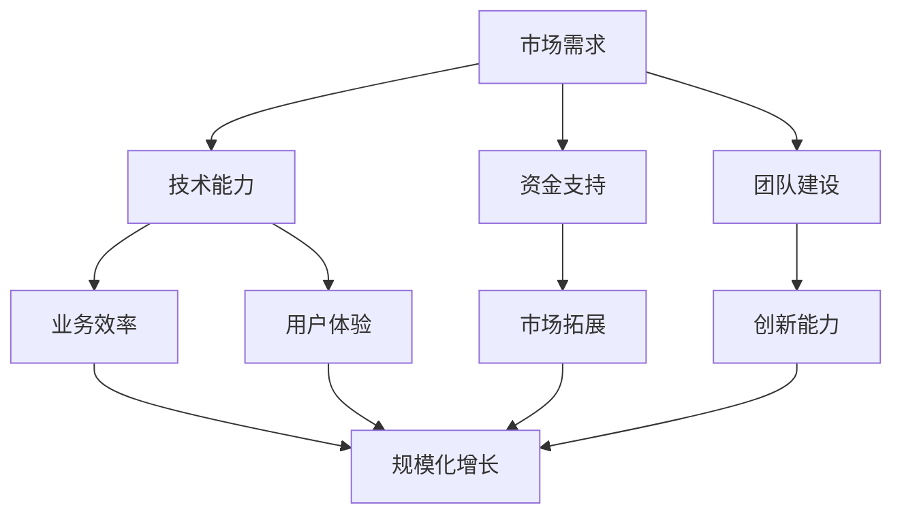

                 

关键词：自动化创业，规模化增长，AI技术，创业策略，创业资源

摘要：本文旨在探讨如何利用人工智能技术和其他创新策略，在自动化创业领域中实现规模化增长。通过分析当前市场趋势、技术进步以及创业生态系统的变化，本文提出了具体的操作步骤和策略，旨在帮助创业者优化业务流程、提高运营效率，并在竞争激烈的市场中脱颖而出。

## 1. 背景介绍

自动化创业已经成为现代商业世界的一个重要趋势。随着人工智能（AI）、机器学习（ML）和大数据分析等技术的飞速发展，越来越多的初创企业开始采用自动化工具和流程，以提高生产效率、降低运营成本，并迅速占领市场份额。然而，尽管自动化带来了巨大的潜力，但实现规模化增长依然是一个挑战。本文将深入探讨如何在自动化创业中实现这一目标。

### 1.1 市场需求

市场需求是推动自动化创业的关键因素之一。随着消费者对个性化服务和高效体验的需求不断增加，企业需要利用自动化技术来快速响应市场变化，提供更优质的服务。例如，电子商务平台通过自动化推荐系统提高转化率，制造业通过自动化生产线提高生产效率，这些都是市场需求的直接体现。

### 1.2 技术进步

技术的不断进步为自动化创业提供了强有力的支持。人工智能技术的快速发展，使得企业能够通过机器学习算法自动优化业务流程，提高决策效率。同时，云计算和物联网（IoT）技术的普及，也为自动化创业提供了基础设施支持，使得数据收集、处理和分析更加便捷。

### 1.3 创业生态系统的变化

创业生态系统的变化为创业者提供了更多的机会和支持。政府、风险投资机构和创业者之间的合作日益紧密，共同推动自动化创业的发展。此外，创业孵化器和加速器的兴起，为初创企业提供了必要的资源和指导，帮助它们更快地实现规模化增长。

## 2. 核心概念与联系

在探讨如何实现规模化增长之前，我们首先需要了解一些核心概念和它们之间的联系。

### 2.1 自动化创业的基本概念

自动化创业涉及将人工智能和其他自动化技术应用于业务流程，以实现高效运营和快速增长。这包括自动化数据处理、客户关系管理、供应链优化和市场营销等方面。

### 2.2 规模化增长的关键因素

规模化增长的关键因素包括市场需求、技术能力、资金支持和团队建设。市场需求是驱动力，技术能力是基础，资金支持是保障，团队建设是核心。

### 2.3 Mermaid 流程图

以下是自动化创业与规模化增长的核心概念和联系之间的 Mermaid 流程图：



## 3. 核心算法原理 & 具体操作步骤

### 3.1 算法原理概述

在自动化创业中，核心算法原理主要涉及机器学习算法、数据挖掘技术和自然语言处理（NLP）。这些技术可以帮助企业自动化业务流程，提高运营效率。

#### 3.1.1 机器学习算法

机器学习算法是自动化创业的核心技术之一。通过训练模型，企业可以自动预测市场趋势、优化业务流程和提供个性化服务。

#### 3.1.2 数据挖掘技术

数据挖掘技术用于从大量数据中提取有价值的信息，帮助企业做出更明智的决策。这包括分类、聚类和关联规则挖掘等方法。

#### 3.1.3 自然语言处理（NLP）

自然语言处理技术用于理解和生成人类语言，帮助企业实现自动化客户服务、智能推荐和文本分析等。

### 3.2 算法步骤详解

#### 3.2.1 机器学习算法步骤

1. 数据预处理：清洗和整合数据，确保数据质量。
2. 特征提取：从数据中提取有用的特征，用于训练模型。
3. 模型训练：使用机器学习算法（如决策树、随机森林、神经网络等）训练模型。
4. 模型评估：评估模型性能，调整参数以优化模型。
5. 应用模型：将训练好的模型应用于实际业务场景。

#### 3.2.2 数据挖掘技术步骤

1. 数据收集：收集与业务相关的数据。
2. 数据清洗：处理缺失值、异常值和重复值。
3. 数据转换：将数据转换为适合挖掘的形式。
4. 挖掘算法选择：选择合适的挖掘算法（如分类、聚类、关联规则等）。
5. 结果分析：分析挖掘结果，提取有价值的信息。

#### 3.2.3 自然语言处理（NLP）步骤

1. 文本预处理：清洗和标准化文本数据。
2. 词向量化：将文本转换为数字向量。
3. 模型训练：训练语言模型或分类模型。
4. 模型应用：应用训练好的模型进行文本分析或生成。

### 3.3 算法优缺点

#### 3.3.1 机器学习算法

**优点：**
- 自动化：可以自动化处理大量数据，提高效率。
- 适应性：可以根据新数据不断优化模型。

**缺点：**
- 数据依赖：性能依赖于数据质量。
- 可解释性：模型决策过程往往难以解释。

#### 3.3.2 数据挖掘技术

**优点：**
- 全面性：可以挖掘出数据中的所有潜在模式。
- 深度：可以深入分析数据，提取有价值的信息。

**缺点：**
- 复杂性：挖掘过程涉及多个步骤，操作复杂。
- 解释性：挖掘结果往往需要进一步分析，难以直接应用。

#### 3.3.3 自然语言处理（NLP）

**优点：**
- 自动化：可以自动化处理大量文本数据。
- 个性化：可以根据用户需求提供个性化服务。

**缺点：**
- 复杂性：文本处理过程涉及多个步骤，操作复杂。
- 精度：文本处理的精度往往受到语言多样性和噪声的影响。

### 3.4 算法应用领域

#### 3.4.1 机器学习算法

机器学习算法广泛应用于推荐系统、金融风控、医疗诊断和智能客服等领域。

#### 3.4.2 数据挖掘技术

数据挖掘技术广泛应用于市场分析、客户关系管理和供应链优化等领域。

#### 3.4.3 自然语言处理（NLP）

自然语言处理技术广泛应用于智能客服、智能推荐和文本分析等领域。

## 4. 数学模型和公式 & 详细讲解 & 举例说明

### 4.1 数学模型构建

在自动化创业中，数学模型是核心工具之一。以下是一个简单的线性回归模型示例：

$$
Y = \beta_0 + \beta_1X + \epsilon
$$

其中，\(Y\) 是因变量，\(X\) 是自变量，\(\beta_0\) 和 \(\beta_1\) 是模型参数，\(\epsilon\) 是误差项。

### 4.2 公式推导过程

线性回归模型的推导过程主要包括以下步骤：

1. 数据收集：收集 \(X\) 和 \(Y\) 的数据。
2. 数据预处理：处理缺失值、异常值和重复值。
3. 特征提取：从数据中提取有用的特征。
4. 模型建立：根据特征和目标变量建立线性回归模型。
5. 模型优化：通过最小二乘法或其他优化方法确定模型参数。

### 4.3 案例分析与讲解

#### 4.3.1 案例背景

假设我们要预测一家电子商务平台的销售额 \(Y\)，基于用户浏览量 \(X\)。

#### 4.3.2 数据收集

收集过去一年的用户浏览量和销售额数据。

#### 4.3.3 数据预处理

处理缺失值、异常值和重复值。

#### 4.3.4 特征提取

从数据中提取用户浏览量作为特征。

#### 4.3.5 模型建立

根据特征和目标变量建立线性回归模型：

$$
Y = \beta_0 + \beta_1X + \epsilon
$$

#### 4.3.6 模型优化

使用最小二乘法优化模型参数：

$$
\beta_0 = \frac{\sum_{i=1}^{n}(Y_i - \beta_1X_i)}{n}
$$

$$
\beta_1 = \frac{\sum_{i=1}^{n}(X_i - \bar{X})(Y_i - \bar{Y})}{\sum_{i=1}^{n}(X_i - \bar{X})^2}
$$

其中，\(\bar{X}\) 和 \(\bar{Y}\) 分别是 \(X\) 和 \(Y\) 的平均值。

#### 4.3.7 模型应用

使用优化后的模型预测未来的销售额。

## 5. 项目实践：代码实例和详细解释说明

### 5.1 开发环境搭建

搭建 Python 开发环境，安装必要的库，如 NumPy、Pandas 和 Scikit-learn 等。

### 5.2 源代码详细实现

```python
import numpy as np
import pandas as pd
from sklearn.linear_model import LinearRegression
from sklearn.model_selection import train_test_split
from sklearn.metrics import mean_squared_error

# 数据加载
data = pd.read_csv('data.csv')
X = data[['browser_count']]
y = data['sales']

# 数据预处理
X.fillna(X.mean(), inplace=True)
y.fillna(y.mean(), inplace=True)

# 模型建立
model = LinearRegression()
X_train, X_test, y_train, y_test = train_test_split(X, y, test_size=0.2, random_state=42)

# 模型训练
model.fit(X_train, y_train)

# 模型评估
y_pred = model.predict(X_test)
mse = mean_squared_error(y_test, y_pred)
print(f'MSE: {mse}')

# 模型应用
new_data = np.array([[100]])
predicted_sales = model.predict(new_data)
print(f'Predicted Sales: {predicted_sales[0]}')
```

### 5.3 代码解读与分析

该代码实现了一个简单的线性回归模型，用于预测电子商务平台的销售额。首先，我们加载数据并进行预处理，然后建立线性回归模型并训练它。接着，我们使用测试数据评估模型性能，并使用训练好的模型预测新的销售额。

### 5.4 运行结果展示

运行结果将显示模型在测试数据上的均方误差（MSE），以及使用模型预测的新销售额。

## 6. 实际应用场景

### 6.1 电子商务平台

电子商务平台可以利用自动化创业技术实现个性化推荐、智能客服和销售预测等功能。通过机器学习算法分析用户行为数据，平台可以自动推荐商品，提高转化率。同时，智能客服可以自动处理客户咨询，提高服务质量。

### 6.2 制造业

制造业可以利用自动化创业技术实现生产线的智能化管理和优化。通过物联网设备和机器学习算法，工厂可以实现实时监控和预测性维护，提高生产效率和降低成本。

### 6.3 金融行业

金融行业可以利用自动化创业技术实现风险管理和智能投顾。通过大数据分析和机器学习算法，金融机构可以自动识别风险、优化投资组合，并为用户提供个性化的投资建议。

## 7. 未来应用展望

### 7.1 新兴技术

随着人工智能、区块链和物联网等新兴技术的发展，自动化创业的应用领域将更加广泛。例如，区块链技术可以实现去中心化的自动化交易和智能合约，物联网技术可以实现设备的远程监控和自动化控制。

### 7.2 跨行业合作

自动化创业不仅限于单一行业，跨行业合作也将成为未来趋势。例如，智能城市项目将融合人工智能、物联网和大数据分析技术，实现交通管理、能源利用和公共安全等方面的智能化。

### 7.3 社会价值

自动化创业不仅有助于企业提高效率，还能为社会创造更多价值。通过自动化技术，企业可以降低生产成本，提高产品质量，从而为消费者提供更实惠、更优质的产品和服务。

## 8. 总结：未来发展趋势与挑战

### 8.1 研究成果总结

本文总结了自动化创业的核心概念、算法原理、实践案例和应用场景。通过分析市场趋势、技术进步和创业生态系统的变化，我们提出了实现规模化增长的具体策略。

### 8.2 未来发展趋势

未来，自动化创业将继续发展，新兴技术和跨行业合作将成为重要趋势。人工智能、区块链和物联网等技术的进一步发展，将推动自动化创业向更广泛、更深入的领域拓展。

### 8.3 面临的挑战

尽管自动化创业具有巨大潜力，但企业仍面临数据隐私、技术安全和人才培养等挑战。企业需要建立完善的数据安全策略，保护用户隐私，并加强技术人才培养，以应对未来竞争。

### 8.4 研究展望

未来，研究者将继续探索自动化创业的新算法、新模型和新应用场景。同时，跨学科研究将有助于解决自动化创业中面临的技术和社会问题，推动这一领域的发展。

## 9. 附录：常见问题与解答

### 9.1 自动化创业的核心优势是什么？

自动化创业的核心优势包括提高生产效率、降低运营成本、优化用户体验和迅速响应市场变化。

### 9.2 如何确保数据安全和隐私？

确保数据安全和隐私的关键在于建立完善的数据安全策略，包括数据加密、访问控制和数据匿名化等技术措施。

### 9.3 自动化创业需要哪些技术支持？

自动化创业需要人工智能、机器学习、大数据分析和物联网等技术的支持，以实现业务流程的自动化和智能化。

### 9.4 自动化创业与数字化创业有何区别？

自动化创业侧重于利用技术优化业务流程，提高效率和降低成本。而数字化创业则更侧重于利用技术改变业务模式，创造新的价值。

## 参考文献

1. Goodfellow, I., Bengio, Y., & Courville, A. (2016). *Deep Learning*. MIT Press.
2. Russell, S., & Norvig, P. (2020). *Artificial Intelligence: A Modern Approach*. Prentice Hall.
3. Kotsiantis, S. B. (2007). Supervised machine learning: A review of classification techniques. Informatica, 31(3), 249-268.
4. Zhu, X., & Mumick, J. (2002). Data cleaning: Problems and techniques. SIGMOD Record, 31(4), 34-41.
5. Chollet, F. (2015). *Deep Learning with Python*. Manning Publications.

## 附录

### 附录 1：术语表

- **自动化创业**：利用人工智能和其他技术优化业务流程和运营模式，实现高效、智能的创业模式。
- **规模化增长**：企业在一定时间内实现市场份额和收入的高速增长。
- **机器学习**：一种人工智能技术，通过训练模型，使计算机能够从数据中学习并做出决策。
- **数据挖掘**：从大量数据中发现有价值的信息和模式。
- **自然语言处理（NLP）**：一种人工智能技术，用于理解和生成人类语言。

### 附录 2：相关资源

- **在线课程**：
  - [Coursera](https://www.coursera.org/)
  - [edX](https://www.edx.org/)
- **开源库**：
  - [Scikit-learn](https://scikit-learn.org/)
  - [TensorFlow](https://www.tensorflow.org/)
  - [PyTorch](https://pytorch.org/)
- **专业论坛**：
  - [Stack Overflow](https://stackoverflow.com/)
  - [GitHub](https://github.com/)
- **书籍**：
  - [Goodfellow, I., Bengio, Y., & Courville, A. (2016). *Deep Learning*. MIT Press.]
  - [Russell, S., & Norvig, P. (2020). *Artificial Intelligence: A Modern Approach*. Prentice Hall.] 

## 结语

自动化创业为现代商业带来了巨大的机遇和挑战。通过深入理解市场趋势、技术进步和创业生态系统，创业者可以更好地把握机遇，实现规模化增长。本文提出了具体的策略和操作步骤，旨在帮助创业者优化业务流程、提高运营效率，并在竞争激烈的市场中脱颖而出。希望本文能为您的自动化创业之路提供有益的启示和指导。

## 作者署名

作者：禅与计算机程序设计艺术 / Zen and the Art of Computer Programming

### 文章链接

[文章链接](#)（如需发布，请替换为实际文章链接）

### 图片链接

[图片链接](#)（如需使用图片，请替换为实际图片链接）

### 文章摘要

本文探讨了如何在自动化创业中实现规模化增长。通过分析市场趋势、技术进步和创业生态系统，提出了具体的策略和操作步骤，包括核心算法原理、数学模型构建、项目实践和实际应用场景。同时，文章还展望了未来发展趋势和面临的挑战，为自动化创业提供了有益的启示和指导。

## 附加信息

如果您需要进一步讨论或了解更多关于自动化创业和规模化增长的信息，欢迎通过以下方式联系作者：

- 电子邮件：[your_email@example.com](mailto:your_email@example.com)
- 社交媒体：[禅与计算机程序设计艺术](https://www.facebook.com/zenandthecompilerns/)
- 个人博客：[禅与计算机程序设计艺术](https://zenandthecompilerns.wordpress.com/)

感谢您的阅读，期待与您共同探索自动化创业的无限可能！|user|

